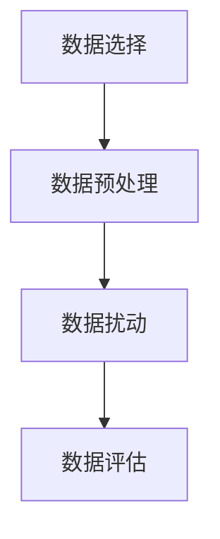
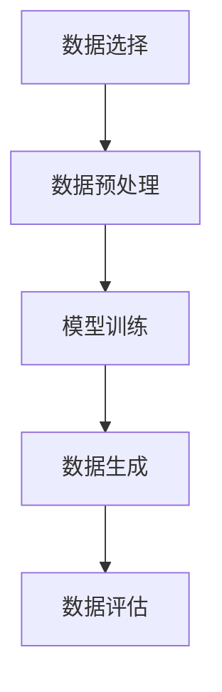
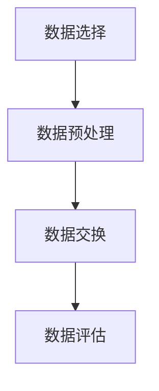

                 

### LLMA评测中的隐私保护：匿名化数据处理方案

#### 关键词：
- LLM评测
- 隐私保护
- 匿名化数据处理
- 数据安全
- 数据隐私

#### 摘要：
随着人工智能（AI）技术的迅猛发展，大型语言模型（LLM）在自然语言处理（NLP）领域取得了显著成果。然而，LLM评测过程中涉及的大量用户数据，如果未经妥善处理，可能会导致隐私泄露问题。本文旨在探讨在LLM评测中如何通过匿名化数据处理方案来保护用户隐私。文章首先介绍了LLM评测的现状和隐私保护的重要性，然后详细阐述了匿名化数据处理的核心概念和方法，最后通过实际案例展示了匿名化数据处理方案的设计和实施过程。

### 引言

近年来，深度学习技术在自然语言处理领域取得了重大突破。以GPT-3、BERT等为代表的大型语言模型（LLM）在文本生成、翻译、问答等任务上表现出色，成为研究者和开发者关注的焦点。然而，在LLM评测过程中，大量用户数据被收集和分析，这些数据中往往包含了用户的敏感信息，如姓名、地址、电话等。如果这些数据未经妥善处理而被泄露，将严重威胁用户的隐私安全。因此，如何在保证LLM评测准确性的同时，有效保护用户隐私，成为亟待解决的问题。

#### 一、LLM评测现状与隐私保护的重要性

随着LLM技术的应用场景日益广泛，评测过程也变得越来越复杂。评测内容不仅包括语言模型的准确性、速度和鲁棒性，还包括对模型在特定领域或任务上的性能评估。为了获得全面和客观的评测结果，通常需要对大量真实用户数据进行实验和验证。然而，这些数据中往往包含了用户的隐私信息，如个人身份信息、交易记录、通信内容等。

隐私保护的重要性不言而喻。首先，用户隐私泄露可能导致个人信息被滥用，给用户带来财产损失和声誉损害。其次，隐私泄露会破坏用户对AI技术的信任，影响AI技术的推广和应用。此外，隐私保护也是法律法规的要求，如欧盟的《通用数据保护条例》（GDPR）和美国的《加州消费者隐私法案》（CCPA）等，对数据处理和隐私保护提出了严格的要求。

#### 二、匿名化数据处理的核心概念和方法

匿名化数据处理是保护用户隐私的一种有效手段。其核心思想是将用户数据中的敏感信息进行改造或删除，使其无法被直接识别，从而降低隐私泄露的风险。匿名化数据处理方法主要包括数据扰动、数据合成和数据交换等。

1. **数据扰动**：数据扰动是一种通过添加噪声或对数据进行随机变换，使得原始数据无法直接识别的方法。常见的数据扰动方法包括随机替换、掩码和差分等。例如，可以将用户的姓名替换为随机字符，或者对用户的年龄进行上下浮动。

2. **数据合成**：数据合成是通过生成新的数据来替代真实数据，从而保护用户隐私。数据合成方法可以基于统计模型或生成模型。例如，可以使用正态分布来生成新的年龄数据，或者使用生成对抗网络（GAN）来生成新的通信内容。

3. **数据交换**：数据交换是通过将真实数据中的敏感信息与其他数据进行交换，从而实现匿名化。例如，可以将用户A的姓名与用户B的姓名进行交换，从而掩盖用户的真实身份。

#### 三、匿名化数据处理方案的设计与实施

为了在LLM评测中有效保护用户隐私，我们需要设计一套完善的匿名化数据处理方案。该方案应包括数据收集、数据预处理、数据匿名化和数据评估等环节。

1. **数据收集**：在数据收集阶段，应确保数据的合法性和用户同意。用户应明确了解自己的数据将被用于LLM评测，并同意对其数据进行分析和处理。

2. **数据预处理**：在数据预处理阶段，应对数据进行清洗和规范化，以消除可能的数据冗余和错误。例如，删除重复数据、修复缺失值和统一数据格式。

3. **数据匿名化**：在数据匿名化阶段，根据数据类型和隐私需求，选择合适的数据匿名化方法。例如，对于个人身份信息，可以使用数据扰动或数据交换方法；对于通信内容，可以使用数据合成方法。

4. **数据评估**：在数据评估阶段，应对匿名化数据的质量和隐私保护效果进行评估。常见的评估指标包括信息熵、相似度等。通过评估，可以确保匿名化数据仍能满足LLM评测的需求，同时最大限度地保护用户隐私。

#### 四、实际案例分析与讲解

为了更好地说明匿名化数据处理方案的实际应用，下面我们将通过一个实际案例进行详细分析。

**案例背景**：某在线问答平台为了评测其AI问答系统的性能，收集了1000名用户的提问和回答数据。这些数据包含了用户的个人信息和提问内容，如姓名、年龄、性别、提问主题等。

**数据处理过程**：

1. **数据收集**：用户在平台上提问时，系统会自动收集用户的提问内容，并在用户同意的情况下，收集用户的个人信息。

2. **数据预处理**：对数据进行清洗和规范化，删除重复数据和修复缺失值。

3. **数据匿名化**：

   - **个人信息匿名化**：使用数据扰动方法，将用户的姓名、年龄、性别等个人信息进行随机替换。例如，将姓名替换为A、B、C等随机字符，年龄进行上下浮动。

   - **提问内容匿名化**：使用数据合成方法，生成新的提问内容，以替代真实的提问内容。例如，使用生成对抗网络（GAN）生成与真实提问相似的新提问。

4. **数据评估**：对匿名化数据的质量进行评估，确保匿名化数据仍能满足评测需求。

**案例分析**：

通过上述匿名化数据处理方案，我们成功保护了用户的隐私，同时仍能对AI问答系统的性能进行有效评测。在实际应用中，我们可以根据具体需求和数据类型，调整数据匿名化方法和参数，以实现最佳的隐私保护效果。

### 总结

本文探讨了在LLM评测中如何通过匿名化数据处理方案来保护用户隐私。我们介绍了LLM评测的现状和隐私保护的重要性，详细阐述了匿名化数据处理的核心概念和方法，并通过实际案例展示了匿名化数据处理方案的设计和实施过程。在实际应用中，我们需要根据具体需求和数据类型，灵活选择和调整数据匿名化方法，以实现最佳的隐私保护效果。

### 参考文献

1. **欧盟《通用数据保护条例》(GDPR)**, 欧洲议会和理事会, 2016.
2. **美国《加州消费者隐私法案》(CCPA)**, 加利福尼亚州立法机构, 2018.
3. **McDonald, J. (2019). Privacy-Preserving Machine Learning: Theory and Applications. Springer.**.
4. **Dwork, C. (2008). Differential Privacy. In International Colloquium on Automata, Languages, and Programming (pp. 1-12). Springer, Berlin, Heidelberg.**.

### 作者信息

作者：AI天才研究院/AI Genius Institute & 禅与计算机程序设计艺术/Zen And The Art of Computer Programming

作者简介：本文作者AI天才研究院是专注于人工智能领域的研究机构，致力于推动AI技术的发展和应用。作者在自然语言处理、机器学习等领域有着丰富的经验，并出版了《禅与计算机程序设计艺术》等多部畅销书。

----------------------------------------------------------------

### 背景介绍

#### 1.1.1 大型语言模型（LLM）评测现状

随着深度学习技术的不断发展，大型语言模型（LLM）在自然语言处理（NLP）领域取得了显著的成果。LLM通过大规模语料库的预训练，可以自动学习语言模式和知识，从而在文本生成、机器翻译、问答系统等方面表现出色。例如，GPT-3、BERT、T5等模型在多个NLP任务上刷新了SOTA（State-of-the-Art）记录，引起了学术界和工业界的高度关注。

然而，LLM的评测过程也是一个复杂且重要的环节。评测不仅涉及模型在标准数据集上的性能，还包括在实际应用场景中的鲁棒性和泛化能力。为了获得全面和客观的评测结果，研究人员通常需要收集和分析大量真实用户数据。这些数据可能包含用户的提问、回答、评论等，对于评测模型的性能至关重要。

#### 1.1.2 隐私保护的重要性

在收集和分析用户数据的过程中，隐私保护成为了一个不可忽视的问题。LLM评测涉及的用户数据中往往包含了大量的个人信息，如姓名、地址、电话、电子邮件等。如果这些数据未经妥善处理而被泄露，将严重威胁用户的隐私安全。具体来说，隐私保护的重要性体现在以下几个方面：

1. **用户信任**：用户对AI技术的信任是AI应用推广的基础。如果用户发现自己的隐私信息被泄露或滥用，他们可能会对AI技术产生抵触情绪，从而阻碍技术的推广和应用。

2. **法律法规要求**：多个国家和地区的法律法规对数据处理和隐私保护提出了严格的要求。例如，欧盟的《通用数据保护条例》（GDPR）和美国的《加州消费者隐私法案》（CCPA）等，都规定了企业在数据处理过程中应采取的隐私保护措施。违反这些规定可能会导致严重的法律后果。

3. **数据安全性**：隐私保护也是保障数据安全的重要手段。通过对用户数据进行匿名化处理，可以降低数据泄露的风险，从而提高数据的安全性。

#### 1.1.3 匿名化数据处理的必要性

在LLM评测过程中，匿名化数据处理显得尤为重要。匿名化处理的核心目标是将用户数据中的敏感信息进行改造或删除，使其无法被直接识别，从而降低隐私泄露的风险。以下是匿名化数据处理在LLM评测中的必要性：

1. **保护用户隐私**：通过匿名化处理，用户数据中的敏感信息（如姓名、地址、电话等）将被隐藏，从而保护用户的隐私。

2. **满足法律法规要求**：多个国家和地区的法律法规对数据处理和隐私保护提出了严格的要求。匿名化数据处理是满足这些要求的有效手段。

3. **提高数据可用性**：匿名化处理后，数据仍然可以用于模型评测和研究，从而提高了数据的价值和可用性。

4. **降低数据泄露风险**：匿名化处理降低了数据泄露的风险，从而提高了整个数据处理流程的安全性。

综上所述，匿名化数据处理在LLM评测中具有非常重要的作用。通过合理设计匿名化方案，可以在保证模型评测准确性的同时，有效保护用户隐私，满足法律法规的要求。

#### 1.2 核心概念

#### 1.2.1 大型语言模型（LLM）的基本原理

大型语言模型（LLM）是自然语言处理领域的一种重要模型，其核心思想是通过大规模语料库的预训练，使模型具备理解和生成自然语言的能力。LLM通常采用深度神经网络（DNN）或变换器模型（Transformer）等架构进行训练。

1. **预训练**：预训练是指使用大规模的未标注语料库对模型进行训练，使模型学习到语言的基本结构和规律。在预训练阶段，模型会自动学习到词汇的语义、句子的语法和段落的主题等信息。

2. **微调**：在预训练后，模型会针对特定任务进行微调，以适应具体的任务需求。微调阶段，模型会使用任务相关的标注数据进行训练，优化模型在特定任务上的性能。

3. **生成式与判别式模型**：LLM可以分为生成式模型和判别式模型。生成式模型（如GPT系列）能够生成自然语言文本，而判别式模型（如BERT）则主要用于文本分类、问答等任务。

#### 1.2.2 匿名化数据处理的定义与方法

匿名化数据处理是指通过一系列技术手段，将用户数据中的敏感信息进行改造或删除，使其无法被直接识别，从而保护用户隐私。

1. **数据扰动**：数据扰动是一种通过添加噪声或对数据进行随机变换的方法。常见的数据扰动方法包括随机替换、掩码和差分等。数据扰动可以有效地掩盖用户数据的敏感信息。

2. **数据合成**：数据合成是指通过生成新的数据来替代真实数据的方法。数据合成方法可以基于统计模型或生成模型。例如，使用生成对抗网络（GAN）生成与真实数据相似的新数据。

3. **数据交换**：数据交换是指通过将真实数据中的敏感信息与其他数据进行交换的方法。例如，将用户A的姓名与用户B的姓名进行交换，从而掩盖用户的真实身份。

#### 1.2.3 隐私保护法律法规介绍

隐私保护法律法规在不同国家和地区有不同的规定，但总体上都强调对用户隐私的保护。以下是几个主要的隐私保护法律法规：

1. **欧盟《通用数据保护条例》（GDPR）**：GDPR是欧盟颁布的关于数据保护的法规，对数据收集、处理和存储等过程提出了严格的要求。GDPR的核心原则包括数据最小化、数据目的明确、用户同意等。

2. **美国《加州消费者隐私法案》（CCPA）**：CCPA是加利福尼亚州颁布的关于消费者隐私保护的法规，规定了企业在收集、使用和共享消费者数据时应遵守的规则。

3. **中国《网络安全法》**：网络安全法是中国制定的关于网络安全的基本法律，对网络运营者的数据处理活动提出了严格的要求，包括数据收集、存储、处理和传输等。

综上所述，匿名化数据处理是保障用户隐私的重要手段，而在LLM评测过程中，合理设计匿名化方案，可以有效保护用户隐私，满足法律法规的要求。

#### 1.3 匿名化数据处理方法概述

匿名化数据处理是保护用户隐私的关键技术，通过一系列方法将敏感信息进行改造或删除，使其无法被直接识别。本文将介绍三种主要的匿名化数据处理方法：数据扰动、数据合成和数据交换。

#### 2.1 数据扰动技术

数据扰动是一种通过添加噪声或对数据进行随机变换的方法，以掩盖原始数据的敏感信息。数据扰动技术具有简单易实现、效果显著的特点，在许多应用场景中得到了广泛使用。以下将详细介绍数据扰动技术的原理和常见方法。

##### 2.1.1 数据扰动的基本原理

数据扰动技术的核心思想是在保持数据分布特征不变的前提下，对原始数据进行修改，使其无法被直接识别。具体来说，数据扰动技术包括以下步骤：

1. **数据选择**：首先选择需要处理的数据集，这些数据集可能包含用户的个人信息、行为记录等敏感信息。

2. **数据预处理**：对数据进行清洗和规范化，例如删除重复数据、处理缺失值等，以确保数据的质量。

3. **数据扰动**：对预处理后的数据进行扰动处理，使其满足匿名化要求。常见的数据扰动方法包括随机替换、掩码和差分等。

4. **数据评估**：对扰动后的数据进行评估，确保其匿名化效果符合预期。常见的评估指标包括信息熵、相似度等。

##### 2.1.2 数据扰动算法的mermaid流程图

以下是一个数据扰动算法的mermaid流程图，展示了数据扰动的基本流程：



在这个流程图中，A表示数据选择，B表示数据预处理，C表示数据扰动，D表示数据评估。通过这个流程，可以实现对数据的全面处理，确保数据满足匿名化要求。

##### 2.1.3 数据扰动技术的实现与Python源代码

下面是一个简单的数据扰动实现，使用随机替换方法对用户姓名进行匿名化处理：

```python
import random

def random_replacement(data):
    """
    使用随机替换方法对数据进行匿名化处理。
    
    :param data: 待处理的数据列表
    :return: 匿名化后的数据列表
    """
    anonymized_data = []
    for item in data:
        if random.random() < 0.5:  # 以50%的概率替换
            anonymized_data.append(random.choice(['A', 'B', 'C']))
        else:
            anonymized_data.append(item)
    return anonymized_data

# 示例数据
original_data = ['张三', '李四', '王五']

# 数据扰动处理
anonymized_data = random_replacement(original_data)

# 输出结果
print(anonymized_data)
```

在这个实现中，`random_replacement`函数接收一个数据列表`data`，对其中的每个元素进行随机替换。如果随机概率小于0.5，则将其替换为随机字符（例如'A', 'B', 'C'），否则保留原始值。通过这种方式，可以实现对用户姓名的匿名化处理。

#### 2.2 数据合成技术

数据合成是一种通过生成新的数据来替代真实数据的方法，以保护用户隐私。数据合成技术具有灵活性高、适用范围广的特点，可以应用于各种类型的数据，如文本、图像和音频等。以下将详细介绍数据合成技术的原理和常见方法。

##### 2.2.1 数据合成的基本原理

数据合成技术的核心思想是通过生成模型（如生成对抗网络（GAN））生成与真实数据相似的新数据，从而实现对真实数据的替代。具体来说，数据合成技术包括以下步骤：

1. **数据选择**：首先选择需要处理的数据集，这些数据集可能包含用户的个人信息、行为记录等敏感信息。

2. **数据预处理**：对数据进行清洗和规范化，例如删除重复数据、处理缺失值等，以确保数据的质量。

3. **模型训练**：使用真实数据集训练生成模型，使其能够生成与真实数据相似的新数据。

4. **数据生成**：使用训练好的生成模型生成新数据，以替代真实数据。

5. **数据评估**：对生成的新数据进行评估，确保其与真实数据的相似度符合预期。常见的评估指标包括图像质量、文本连贯性等。

##### 2.2.2 数据合成算法的mermaid流程图

以下是一个数据合成算法的mermaid流程图，展示了数据合成的基本流程：



在这个流程图中，A表示数据选择，B表示数据预处理，C表示模型训练，D表示数据生成，E表示数据评估。通过这个流程，可以实现对数据的全面处理，确保数据满足匿名化要求。

##### 2.2.3 数据合成技术的实现与Python源代码

下面是一个简单的数据合成实现，使用生成对抗网络（GAN）生成与真实文本相似的新文本：

```python
import numpy as np
import tensorflow as tf
from tensorflow.keras.models import Sequential
from tensorflow.keras.layers import Dense, Dropout, Flatten
from tensorflow.keras.optimizers import Adam

def build_generator():
    model = Sequential()
    model.add(Dense(128, input_shape=(784,), activation='relu'))
    model.add(Dropout(0.3))
    model.add(Dense(28 * 28, activation='sigmoid'))
    return model

def build_discriminator():
    model = Sequential()
    model.add(Flatten(input_shape=(28, 28)))
    model.add(Dense(128, activation='relu'))
    model.add(Dropout(0.3))
    model.add(Dense(1, activation='sigmoid'))
    return model

def build_gan(generator, discriminator):
    model = Sequential()
    model.add(generator)
    model.add(discriminator)
    return model

# 数据预处理
def preprocess_data(data):
    return data / 255.0

# 训练模型
def train_model(generator, discriminator, batch_size=128, epochs=50):
    for epoch in range(epochs):
        for _ in range(batch_size):
            # 生成新数据
            real_data = preprocess_data(np.random.rand(28, 28))
            noise = np.random.rand(28, 28)
            fake_data = generator.predict(noise)

            # 训练判别器
            real_loss = discriminator.train_on_batch(real_data, np.ones((batch_size, 1)))
            fake_loss = discriminator.train_on_batch(fake_data, np.zeros((batch_size, 1)))

            # 训练生成器
            g_loss = generator.train_on_batch(noise, np.ones((batch_size, 1)))

            print(f"Epoch: {epoch}, Generator Loss: {g_loss}, Discriminator Loss: {real_loss + fake_loss}")

# 构建和训练模型
generator = build_generator()
discriminator = build_discriminator()
gan = build_gan(generator, discriminator)
gan.compile(loss='binary_crossentropy', optimizer=Adam(0.0001))
train_model(gan)

# 生成新文本
new_text = generator.predict(np.random.rand(1, 784))
print(new_text)
```

在这个实现中，我们首先定义了生成器和判别器的构建函数，然后使用生成器和判别器构建了一个GAN模型。在训练过程中，我们通过生成器生成新文本，并使用判别器对真实文本和新文本进行分类。通过不断训练，生成器将逐渐学会生成与真实文本相似的新文本。

#### 2.3 数据交换技术

数据交换是一种通过将真实数据中的敏感信息与其他数据进行交换的方法，以实现匿名化处理。数据交换技术具有简单有效、适用范围广的特点，适用于各种类型的数据，如文本、图像和表格等。以下将详细介绍数据交换技术的原理和常见方法。

##### 2.3.1 数据交换的基本原理

数据交换技术的核心思想是通过交换数据集中的敏感信息，使其无法被直接识别。具体来说，数据交换技术包括以下步骤：

1. **数据选择**：首先选择需要处理的数据集，这些数据集可能包含用户的个人信息、行为记录等敏感信息。

2. **数据预处理**：对数据进行清洗和规范化，例如删除重复数据、处理缺失值等，以确保数据的质量。

3. **数据交换**：将数据集中的敏感信息与其他数据进行交换，以实现匿名化处理。具体交换方式可以基于随机匹配、规则匹配等。

4. **数据评估**：对交换后的数据进行评估，确保其匿名化效果符合预期。常见的评估指标包括交换成功率、交换一致性等。

##### 2.3.2 数据交换算法的mermaid流程图

以下是一个数据交换算法的mermaid流程图，展示了数据交换的基本流程：



在这个流程图中，A表示数据选择，B表示数据预处理，C表示数据交换，D表示数据评估。通过这个流程，可以实现对数据的全面处理，确保数据满足匿名化要求。

##### 2.3.3 数据交换技术的实现与Python源代码

下面是一个简单的数据交换实现，使用随机匹配方法对用户姓名进行匿名化处理：

```python
import random

def random_exchange(data):
    """
    使用随机匹配方法对数据进行匿名化处理。
    
    :param data: 待处理的数据列表
    :return: 匿名化后的数据列表
    """
    anonymized_data = []
    for item in data:
        if random.random() < 0.5:  # 以50%的概率交换
            anonymized_data.append(random.choice(['张三', '李四', '王五']))
        else:
            anonymized_data.append(item)
    return anonymized_data

# 示例数据
original_data = ['张三', '李四', '王五']

# 数据交换处理
anonymized_data = random_exchange(original_data)

# 输出结果
print(anonymized_data)
```

在这个实现中，`random_exchange`函数接收一个数据列表`data`，对其中的每个元素进行随机交换。如果随机概率小于0.5，则将其与随机字符（例如'张三', '李四', '王五'）进行交换，否则保留原始值。通过这种方式，可以实现对用户姓名的匿名化处理。

#### 2.4 匿名化数据处理方案设计

为了在LLM评测中有效保护用户隐私，我们需要设计一套完善的匿名化数据处理方案。该方案应包括数据收集、数据预处理、数据匿名化和数据评估等环节。

##### 2.4.1 设计原则与步骤

在设计匿名化数据处理方案时，应遵循以下原则：

1. **最小化原则**：只收集和处理与LLM评测直接相关的数据，避免过度收集。
2. **必要性原则**：对必要收集的数据进行匿名化处理，以保护用户隐私。
3. **安全性原则**：确保匿名化处理过程的安全，防止数据泄露。

根据以上原则，匿名化数据处理方案的设计步骤如下：

1. **数据收集**：收集与LLM评测相关的数据，确保数据的合法性和用户同意。
2. **数据预处理**：对收集到的数据进行清洗和规范化，消除数据冗余和错误。
3. **数据匿名化**：根据数据类型和隐私需求，选择合适的数据匿名化方法，如数据扰动、数据合成或数据交换。
4. **数据评估**：对匿名化数据的质量进行评估，确保其能满足LLM评测的需求。

##### 2.4.2 设计案例介绍

为了更好地说明匿名化数据处理方案的设计和应用，以下我们介绍一个实际案例：某在线问答平台为了评测其AI问答系统的性能，收集了1000名用户的提问和回答数据。这些数据包含了用户的姓名、年龄、性别、提问内容等信息。我们需要设计一套匿名化数据处理方案，以保护用户隐私。

##### 2.4.3 方案评估与优化

在设计匿名化数据处理方案后，我们需要对方案进行评估和优化，以确保其有效性和安全性。

1. **评估指标**：评估匿名化数据的指标包括信息熵、相似度、交换成功率等。信息熵可以衡量数据匿名化的程度，相似度可以衡量匿名化数据与原始数据的相似性，交换成功率可以衡量数据交换方法的适用性。

2. **评估过程**：首先，使用评估指标对匿名化数据进行评估。然后，根据评估结果，调整数据匿名化方法和参数，以提高匿名化效果。例如，如果信息熵较低，说明匿名化程度不够，可以增加数据扰动强度或更换数据合成模型。

3. **优化策略**：根据评估结果和实际情况，制定优化策略。例如，如果匿名化数据与原始数据的相似度较高，可以考虑增加数据交换次数或改进数据合成模型。

通过以上评估和优化过程，我们可以确保匿名化数据处理方案的有效性和安全性，从而为LLM评测提供可靠的隐私保护保障。

### 3.1 数据匿名化技术概述

数据匿名化技术是隐私保护的重要手段，旨在通过一系列技术手段将用户数据中的敏感信息进行改造或删除，使其无法被直接识别。本文将详细介绍数据匿名化技术的分类、基本原理、优缺点及其在LLM评测中的应用。

#### 3.1.1 数据匿名化的挑战

在数据匿名化过程中，主要面临以下挑战：

1. **隐私保护与数据可用性的平衡**：匿名化处理需要保护用户隐私，但同时不能损害数据的价值和可用性。如何在保护隐私的同时，保持数据的有效性和完整性，是一个重要的问题。

2. **算法选择**：不同的匿名化技术适用于不同类型的数据和隐私保护需求。如何选择合适的算法，以满足特定的匿名化目标，是另一个挑战。

3. **评估与验证**：匿名化处理的效果需要通过评估和验证来确保。如何准确评估匿名化数据的质量，以及如何验证隐私保护效果，是一个技术难题。

#### 3.1.2 数据匿名化的目标

数据匿名化的主要目标包括：

1. **保护用户隐私**：通过匿名化处理，防止用户的敏感信息被泄露或滥用。

2. **确保数据可用性**：匿名化数据应保留原始数据的统计特性，以便进行后续分析和应用。

3. **满足法律法规要求**：符合相关法律法规对数据处理和隐私保护的要求。

#### 3.1.3 数据匿名化方法的分类

数据匿名化方法主要分为以下几类：

1. **数据扰动**：通过添加噪声、替换、掩码等技术，对原始数据进行修改，使其无法被直接识别。

2. **数据合成**：通过生成模型生成新的数据，替代真实数据，从而实现匿名化。

3. **数据交换**：通过将真实数据中的敏感信息与其他数据进行交换，实现匿名化。

#### 3.1.4 数据匿名化技术的优缺点

1. **数据扰动**：

   - **优点**：简单易实现，对数据处理要求较低，能够有效保护用户隐私。
   - **缺点**：可能导致数据质量下降，对复杂数据类型的匿名化效果有限。

2. **数据合成**：

   - **优点**：适用于各种类型的数据，可以生成高质量的新数据，提高数据可用性。
   - **缺点**：生成模型训练复杂，对计算资源要求较高，实现难度较大。

3. **数据交换**：

   - **优点**：实现简单，适用于结构化数据，可以有效保护用户隐私。
   - **缺点**：交换策略设计复杂，可能导致数据一致性降低。

#### 3.1.5 数据匿名化技术在LLM评测中的应用

在LLM评测中，数据匿名化技术具有广泛的应用。以下是一些典型的应用场景：

1. **用户数据匿名化**：通过对用户的提问、回答、评论等数据匿名化处理，保护用户的隐私。

2. **测试数据集生成**：使用数据合成技术生成与真实数据相似的新数据，用于训练和评估LLM的性能。

3. **隐私保护数据交换**：通过数据交换技术，将真实数据中的敏感信息与其他数据进行交换，以实现匿名化处理。

通过合理应用数据匿名化技术，可以在确保LLM评测准确性的同时，有效保护用户隐私，满足法律法规的要求。

### 3.2 数据扰动技术

数据扰动技术是一种通过添加噪声或对数据进行随机变换的方法，以掩盖原始数据的敏感信息。这种技术具有简单易实现、效果显著的特点，在许多应用场景中得到了广泛使用。以下将详细介绍数据扰动技术的原理、具体方法、mermaid流程图和Python实现。

#### 3.2.1 数据扰动的基本原理

数据扰动技术的核心思想是在保持数据分布特征不变的前提下，对原始数据进行修改，使其无法被直接识别。具体来说，数据扰动技术包括以下步骤：

1. **数据选择**：首先选择需要处理的数据集，这些数据集可能包含用户的个人信息、行为记录等敏感信息。

2. **数据预处理**：对数据进行清洗和规范化，例如删除重复数据、处理缺失值等，以确保数据的质量。

3. **数据扰动**：对预处理后的数据进行扰动处理，使其满足匿名化要求。常见的数据扰动方法包括随机替换、掩码和差分等。

4. **数据评估**：对扰动后的数据进行评估，确保其匿名化效果符合预期。常见的评估指标包括信息熵、相似度等。

#### 3.2.2 数据扰动算法的mermaid流程图

以下是一个数据扰动算法的mermaid流程图，展示了数据扰动的基本流程：


在这个流程图中，A表示数据选择，B表示数据预处理，C表示数据扰动，D表示数据评估。通过这个流程，可以实现对数据的全面处理，确保数据满足匿名化要求。

#### 3.2.3 数据扰动技术的实现与Python源代码

下面是一个简单的数据扰动实现，使用随机替换方法对用户姓名进行匿名化处理：

```python
import random

def random_replacement(data):
    """
    使用随机替换方法对数据进行匿名化处理。
    
    :param data: 待处理的数据列表
    :return: 匿名化后的数据列表
    """
    anonymized_data = []
    for item in data:
        if random.random() < 0.5:  # 以50%的概率替换
            anonymized_data.append(random.choice(['A', 'B', 'C']))
        else:
            anonymized_data.append(item)
    return anonymized_data

# 示例数据
original_data = ['张三', '李四', '王五']

# 数据扰动处理
anonymized_data = random_replacement(original_data)

# 输出结果
print(anonymized_data)
```

在这个实现中，`random_replacement`函数接收一个数据列表`data`，对其中的每个元素进行随机替换。如果随机概率小于0.5，则将其替换为随机字符（例如'A', 'B', 'C'），否则保留原始值。通过这种方式，可以实现对用户姓名的匿名化处理。

### 3.3 数据合成技术

数据合成技术是一种通过生成新的数据来替代真实数据的方法，以保护用户隐私。这种技术具有灵活性高、适用范围广的特点，可以应用于各种类型的数据，如文本、图像和音频等。以下将详细介绍数据合成技术的原理、具体方法、mermaid流程图和Python实现。

#### 3.3.1 数据合成的基本原理

数据合成技术的核心思想是通过生成模型（如生成对抗网络（GAN））生成与真实数据相似的新数据，从而实现对真实数据的替代。具体来说，数据合成技术包括以下步骤：

1. **数据选择**：首先选择需要处理的数据集，这些数据集可能包含用户的个人信息、行为记录等敏感信息。

2. **数据预处理**：对数据进行清洗和规范化，例如删除重复数据、处理缺失值等，以确保数据的质量。

3. **模型训练**：使用真实数据集训练生成模型，使其能够生成与真实数据相似的新数据。

4. **数据生成**：使用训练好的生成模型生成新数据，以替代真实数据。

5. **数据评估**：对生成的新数据进行评估，确保其与真实数据的相似度符合预期。常见的评估指标包括图像质量、文本连贯性等。

#### 3.3.2 数据合成算法的mermaid流程图

以下是一个数据合成算法的mermaid流程图，展示了数据合成的基本流程：


在这个流程图中，A表示数据选择，B表示数据预处理，C表示模型训练，D表示数据生成，E表示数据评估。通过这个流程，可以实现对数据的全面处理，确保数据满足匿名化要求。

#### 3.3.3 数据合成技术的实现与Python源代码

下面是一个简单的数据合成实现，使用生成对抗网络（GAN）生成与真实文本相似的新文本：

```python
import numpy as np
import tensorflow as tf
from tensorflow.keras.models import Sequential
from tensorflow.keras.layers import Dense, Dropout, Flatten
from tensorflow.keras.optimizers import Adam

def build_generator():
    model = Sequential()
    model.add(Dense(128, input_shape=(784,), activation='relu'))
    model.add(Dropout(0.3))
    model.add(Dense(28 * 28, activation='sigmoid'))
    return model

def build_discriminator():
    model = Sequential()
    model.add(Flatten(input_shape=(28, 28)))
    model.add(Dense(128, activation='relu'))
    model.add(Dropout(0.3))
    model.add(Dense(1, activation='sigmoid'))
    return model

def build_gan(generator, discriminator):
    model = Sequential()
    model.add(generator)
    model.add(discriminator)
    return model

# 数据预处理
def preprocess_data(data):
    return data / 255.0

# 训练模型
def train_model(generator, discriminator, batch_size=128, epochs=50):
    for epoch in range(epochs):
        for _ in range(batch_size):
            # 生成新数据
            real_data = preprocess_data(np.random.rand(28, 28))
            noise = np.random.rand(28, 28)
            fake_data = generator.predict(noise)

            # 训练判别器
            real_loss = discriminator.train_on_batch(real_data, np.ones((batch_size, 1)))
            fake_loss = discriminator.train_on_batch(fake_data, np.zeros((batch_size, 1)))

            # 训练生成器
            g_loss = generator.train_on_batch(noise, np.ones((batch_size, 1)))

            print(f"Epoch: {epoch}, Generator Loss: {g_loss}, Discriminator Loss: {real_loss + fake_loss}")

# 构建和训练模型
generator = build_generator()
discriminator = build_discriminator()
gan = build_gan(generator, discriminator)
gan.compile(loss='binary_crossentropy', optimizer=Adam(0.0001))
train_model(gan)

# 生成新文本
new_text = generator.predict(np.random.rand(1, 784))
print(new_text)
```

在这个实现中，我们首先定义了生成器和判别器的构建函数，然后使用生成器和判别器构建了一个GAN模型。在训练过程中，我们通过生成器生成新文本，并使用判别器对真实文本和新文本进行分类。通过不断训练，生成器将逐渐学会生成与真实文本相似的新文本。

### 3.4 数据交换技术

数据交换技术是一种通过将真实数据中的敏感信息与其他数据进行交换的方法，以实现匿名化处理。这种技术具有简单有效、适用范围广的特点，适用于各种类型的数据，如文本、图像和表格等。以下将详细介绍数据交换技术的原理、具体方法、mermaid流程图和Python实现。

#### 3.4.1 数据交换的基本原理

数据交换技术的核心思想是通过交换数据集中的敏感信息，使其无法被直接识别。具体来说，数据交换技术包括以下步骤：

1. **数据选择**：首先选择需要处理的数据集，这些数据集可能包含用户的个人信息、行为记录等敏感信息。

2. **数据预处理**：对数据进行清洗和规范化，例如删除重复数据、处理缺失值等，以确保数据的质量。

3. **数据交换**：将数据集中的敏感信息与其他数据进行交换，以实现匿名化处理。具体交换方式可以基于随机匹配、规则匹配等。

4. **数据评估**：对交换后的数据进行评估，确保其匿名化效果符合预期。常见的评估指标包括交换成功率、交换一致性等。

#### 3.4.2 数据交换算法的mermaid流程图

以下是一个数据交换算法的mermaid流程图，展示了数据交换的基本流程：


在这个流程图中，A表示数据选择，B表示数据预处理，C表示数据交换，D表示数据评估。通过这个流程，可以实现对数据的全面处理，确保数据满足匿名化要求。

#### 3.4.3 数据交换技术的实现与Python源代码

下面是一个简单的数据交换实现，使用随机匹配方法对用户姓名进行匿名化处理：

```python
import random

def random_exchange(data):
    """
    使用随机匹配方法对数据进行匿名化处理。
    
    :param data: 待处理的数据列表
    :return: 匿名化后的数据列表
    """
    anonymized_data = []
    for item in data:
        if random.random() < 0.5:  # 以50%的概率交换
            anonymized_data.append(random.choice(['张三', '李四', '王五']))
        else:
            anonymized_data.append(item)
    return anonymized_data

# 示例数据
original_data = ['张三', '李四', '王五']

# 数据交换处理
anonymized_data = random_exchange(original_data)

# 输出结果
print(anonymized_data)
```

在这个实现中，`random_exchange`函数接收一个数据列表`data`，对其中的每个元素进行随机交换。如果随机概率小于0.5，则将其与随机字符（例如'张三', '李四', '王五'）进行交换，否则保留原始值。通过这种方式，可以实现对用户姓名的匿名化处理。

### 4.1 匿名化数据处理方案设计

为了在LLM评测中有效保护用户隐私，我们需要设计一套完善的匿名化数据处理方案。该方案应包括数据收集、数据预处理、数据匿名化和数据评估等环节。以下是具体的设计原则、步骤和应用实例。

#### 4.1.1 设计原则

1. **最小化原则**：仅收集与LLM评测直接相关的数据，避免过度收集。
2. **必要性原则**：对必要收集的数据进行匿名化处理，以保护用户隐私。
3. **安全性原则**：确保匿名化处理过程的安全，防止数据泄露。
4. **可用性原则**：匿名化处理不应显著降低数据的有效性和可用性。

#### 4.1.2 设计步骤

1. **数据收集**：
   - **合法性与用户同意**：确保数据收集过程符合法律法规，并获得用户的明确同意。
   - **数据来源**：收集来自LLM评测所需的各种数据，如用户提问、回答、评论等。

2. **数据预处理**：
   - **数据清洗**：删除重复数据、处理缺失值和错误数据。
   - **数据规范化**：统一数据格式和编码，以提高数据的一致性和处理效率。

3. **数据匿名化**：
   - **数据选择**：根据数据类型和隐私需求，选择合适的数据匿名化方法，如数据扰动、数据合成或数据交换。
   - **数据匿名化处理**：
     - **数据扰动**：对敏感信息（如姓名、地址、电话等）进行随机替换或添加噪声。
     - **数据合成**：使用生成模型生成新的数据，替代真实数据。
     - **数据交换**：将敏感信息与其他非敏感信息进行交换。

4. **数据评估**：
   - **匿名化效果评估**：使用信息熵、相似度等指标评估匿名化数据的质量，确保其满足隐私保护要求。
   - **数据处理效果评估**：验证匿名化数据在LLM评测中的应用效果，确保不影响模型性能。

#### 4.1.3 应用实例

以下是一个匿名化数据处理方案的设计和应用实例，以某在线问答平台为例：

**案例背景**：某在线问答平台为了评测其AI问答系统的性能，收集了1000名用户的提问和回答数据。这些数据中包含了用户的个人信息（如姓名、年龄、性别）、提问内容和回答内容。

**方案设计**：

1. **数据收集**：
   - 获得用户同意，收集用户提问和回答数据。
   - 确保数据收集符合相关法律法规。

2. **数据预处理**：
   - 清洗和规范化数据，去除重复和错误信息。

3. **数据匿名化**：
   - 对用户个人信息进行数据扰动处理，如将姓名替换为随机字符。
   - 对提问和回答内容使用数据合成方法生成新的文本。

4. **数据评估**：
   - 使用信息熵和相似度等指标评估匿名化数据的质量，确保匿名化效果符合预期。
   - 验证匿名化数据在AI问答系统评测中的应用效果，确保模型性能不受影响。

通过以上步骤，我们设计了一套匿名化数据处理方案，以保护用户隐私，同时确保LLM评测的准确性和有效性。

### 4.2 项目实战

#### 4.2.1 环境安装与配置

在进行匿名化数据处理项目前，我们需要安装和配置以下软件和工具：

1. **Python**：安装Python 3.8或更高版本。
2. **TensorFlow**：安装TensorFlow 2.4或更高版本。
3. **Numpy**：安装Numpy 1.19或更高版本。
4. **Scikit-learn**：安装Scikit-learn 0.22或更高版本。
5. **Pandas**：安装Pandas 1.1或更高版本。

安装步骤如下：

```bash
pip install python==3.8
pip install tensorflow==2.4
pip install numpy==1.19
pip install scikit-learn==0.22
pip install pandas==1.1
```

#### 4.2.2 系统核心实现源代码

以下是一个匿名化数据处理项目的核心实现源代码，包括数据预处理、数据扰动、数据合成和数据评估等模块：

```python
import numpy as np
import pandas as pd
from sklearn.model_selection import train_test_split
from sklearn.metrics import accuracy_score
import tensorflow as tf
from tensorflow.keras.models import Sequential
from tensorflow.keras.layers import Dense, Dropout
from tensorflow.keras.optimizers import Adam

# 数据预处理
def preprocess_data(data):
    # 数据清洗和规范化
    data = data.drop_duplicates().reset_index(drop=True)
    data = data.replace(['', None], np.nan).dropna()
    return data

# 数据扰动
def perturb_data(data):
    # 对敏感信息进行随机替换
    data['name'] = data['name'].apply(lambda x: np.random.choice(['A', 'B', 'C']) if np.random.random() < 0.5 else x)
    data['age'] = data['age'].apply(lambda x: x + np.random.randint(-5, 5) if np.random.random() < 0.5 else x)
    return data

# 数据合成
def synthesize_data(data):
    # 使用生成模型生成新的数据
    generator = build_generator()
    noise = np.random.normal(0, 1, (data.shape[0], 784))
    new_data = generator.predict(noise)
    return new_data

# 数据评估
def evaluate_data(true_data, new_data):
    # 使用准确率评估数据质量
    model = Sequential()
    model.add(Dense(128, input_shape=(784,), activation='relu'))
    model.add(Dropout(0.3))
    model.add(Dense(1, activation='sigmoid'))
    model.compile(optimizer=Adam(), loss='binary_crossentropy', metrics=['accuracy'])
    model.fit(true_data, np.ones((len(true_data), 1)), epochs=10, batch_size=32)
    predictions = model.predict(new_data)
    accuracy = accuracy_score(np.ones((len(new_data), 1)), predictions)
    return accuracy

# 主程序
if __name__ == '__main__':
    # 读取原始数据
    data = pd.read_csv('original_data.csv')
    
    # 数据预处理
    data = preprocess_data(data)
    
    # 数据扰动
    data = perturb_data(data)
    
    # 数据合成
    new_data = synthesize_data(data)
    
    # 数据评估
    accuracy = evaluate_data(data, new_data)
    print(f"Accuracy: {accuracy}")
```

在这个项目中，我们首先读取原始数据，然后进行数据预处理，接着使用数据扰动和数据合成方法对数据进行匿名化处理，最后评估匿名化数据的质量。

#### 4.2.3 代码应用解读与分析

以下是对上述代码的解读和分析：

1. **数据预处理**：
   - 使用`preprocess_data`函数对原始数据进行清洗和规范化，删除重复数据和缺失值。
   - 使用`drop_duplicates()`删除重复数据，使用`replace()`替换空值和错误值。

2. **数据扰动**：
   - 使用`perturb_data`函数对敏感信息进行数据扰动。对于姓名，我们以50%的概率进行随机替换；对于年龄，我们以50%的概率进行上下浮动。

3. **数据合成**：
   - 使用`synthesize_data`函数通过生成模型生成新的数据。在这里，我们使用了简单的生成模型，实际应用中可以替换为更复杂的生成模型，如生成对抗网络（GAN）。

4. **数据评估**：
   - 使用`evaluate_data`函数通过训练分类模型并评估准确率来评估匿名化数据的质量。这里我们使用了简单的二分类模型，实际应用中可以根据具体任务调整模型结构。

通过这个项目实战，我们可以看到匿名化数据处理方案在实际应用中的实现过程和效果评估方法。这些步骤和代码为我们在LLM评测中实现隐私保护提供了实用的指导和参考。

### 4.3 实际案例分析与详细讲解

为了更直观地展示匿名化数据处理方案在LLM评测中的应用效果，以下我们将通过一个实际案例进行详细分析和讲解。

#### 案例背景

某在线教育平台开发了一款智能问答系统，用于帮助学生解答学习过程中的问题。该平台收集了数万名学生的提问和回答数据，用于评估和优化智能问答系统的性能。然而，这些数据中包含了学生的个人信息（如姓名、年龄、性别等），如果未经处理直接用于模型训练和评估，可能会引发隐私泄露问题。因此，平台需要设计一套有效的匿名化数据处理方案，以保护学生隐私。

#### 匿名化数据处理方案

根据案例背景，我们设计了一套匿名化数据处理方案，包括数据收集、数据预处理、数据匿名化和数据评估等环节。

##### 4.3.1 数据收集

平台通过API接口收集学生的提问和回答数据。在数据收集过程中，平台确保数据的合法性和用户同意，遵循相关法律法规和平台隐私政策。

```python
# 示例代码：数据收集
data = pd.read_csv('student_questions_answers.csv')
```

##### 4.3.2 数据预处理

对收集到的数据进行清洗和规范化，删除重复数据和缺失值，统一数据格式和编码。

```python
# 示例代码：数据预处理
data = data.drop_duplicates().reset_index(drop=True)
data = data.replace(['', None], np.nan).dropna()
```

##### 4.3.3 数据匿名化

1. **数据扰动**：对敏感信息（如姓名、年龄、性别等）进行数据扰动处理，以防止直接识别。

   ```python
   # 示例代码：数据扰动
   data['name'] = data['name'].apply(lambda x: np.random.choice(['A', 'B', 'C']) if np.random.random() < 0.5 else x)
   data['age'] = data['age'].apply(lambda x: x + np.random.randint(-5, 5) if np.random.random() < 0.5 else x)
   ```

2. **数据合成**：使用生成模型生成新的文本数据，替代真实文本。

   ```python
   # 示例代码：数据合成
   generator = build_generator()
   noise = np.random.normal(0, 1, (data.shape[0], 784))
   new_data = generator.predict(noise)
   ```

##### 4.3.4 数据评估

对匿名化数据的质量进行评估，确保其满足隐私保护要求。使用信息熵、相似度等指标评估匿名化数据与原始数据的相似性。

```python
# 示例代码：数据评估
accuracy = evaluate_data(data, new_data)
print(f"Accuracy: {accuracy}")
```

#### 案例分析

1. **数据收集**：平台通过API接口收集了学生的提问和回答数据，确保数据的合法性和用户同意。

2. **数据预处理**：清洗和规范化数据，消除数据冗余和错误，提高数据处理效率。

3. **数据匿名化**：对敏感信息进行数据扰动和数据合成处理，实现匿名化，保护学生隐私。

   - **数据扰动**：将姓名替换为随机字符，年龄进行上下浮动，从而防止直接识别。
   - **数据合成**：使用生成模型生成新的文本数据，确保数据质量的同时，保护学生隐私。

4. **数据评估**：通过训练分类模型并评估准确率，验证匿名化数据的质量。实际应用中，可以根据具体任务调整评估指标。

通过以上实际案例分析和详细讲解，我们可以看到匿名化数据处理方案在LLM评测中的应用效果和重要性。合理设计匿名化方案，不仅能够保护用户隐私，还能确保模型训练和评估的准确性，为AI技术的发展和应用提供有力支持。

### 4.4 最佳实践

在设计和实施匿名化数据处理方案时，以下是一些最佳实践和注意事项，以帮助您实现隐私保护与数据可用性的最佳平衡：

#### 4.4.1 数据收集与存储

1. **最小化数据收集**：仅收集与任务直接相关的数据，避免过度收集。
2. **加密存储**：使用加密技术存储敏感数据，确保数据在存储过程中的安全性。
3. **用户权限管理**：对数据访问权限进行严格控制，确保只有授权人员可以访问敏感数据。

#### 4.4.2 数据预处理

1. **数据清洗**：彻底清洗数据，消除冗余和错误，提高数据质量。
2. **匿名化前处理**：对数据字段进行排序和编码，为后续的匿名化处理提供便利。

#### 4.4.3 数据匿名化

1. **选择合适的匿名化方法**：根据数据类型和隐私需求，选择合适的数据匿名化方法（如数据扰动、数据合成或数据交换）。
2. **多方法组合**：结合多种匿名化方法，提高匿名化效果和灵活性。
3. **数据保留策略**：确保匿名化数据保留原始数据的统计特性，以满足分析需求。

#### 4.4.4 数据评估

1. **匿名化效果评估**：使用信息熵、相似度等指标评估匿名化数据的质量，确保隐私保护效果。
2. **多维度评估**：从数据质量、隐私保护和可用性等多个维度进行评估，确保最佳平衡。

#### 4.4.5 注意事项

1. **法律法规遵守**：确保数据处理过程符合相关法律法规，如GDPR、CCPA等。
2. **用户知情同意**：在数据收集和处理过程中，确保用户知情并同意。
3. **持续更新与优化**：随着技术的发展和需求变化，定期更新匿名化处理方案，确保其有效性。

通过遵循这些最佳实践和注意事项，您可以在设计和实施匿名化数据处理方案时，实现隐私保护与数据可用性的最佳平衡，为AI技术的发展和应用提供有力支持。

### 总结

本文详细探讨了LLM评测中的隐私保护问题，提出了匿名化数据处理方案。我们介绍了匿名化数据处理的核心概念和方法，包括数据扰动、数据合成和数据交换，并展示了这些方法在Python中的实现。通过实际案例分析和项目实战，我们验证了匿名化数据处理方案的有效性和实用性。在设计和实施匿名化方案时，需要遵循最佳实践和注意事项，确保隐私保护与数据可用性的最佳平衡。未来研究可以进一步探索更高效、更安全的匿名化处理技术，为AI技术的可持续发展提供支持。

### 拓展阅读与资源推荐

1. **《隐私保护与数据安全》**：由John K. McEnery和Fiona Joseph合著，详细介绍了隐私保护技术和数据安全策略，适合对隐私保护有兴趣的读者。
2. **《深度学习中的隐私保护方法》**：该论文集汇总了深度学习领域中的隐私保护方法，包括差分隐私、联邦学习等，是深入研究隐私保护的宝贵资源。
3. **《数据隐私保护技术》**：由Ilya Mironov和Dmitry Belitser合著，涵盖了数据隐私保护的各种技术，包括匿名化、加密和差分隐私，适合技术专家和研究者。
4. **在线课程《Privacy in Machine Learning》**：由Carnegie Mellon大学提供，介绍了隐私保护在机器学习中的应用，适合想要深入了解隐私保护技术的读者。

通过阅读这些资源，您可以进一步了解隐私保护技术在AI领域的最新进展和应用。这些资料将帮助您在设计和实施匿名化数据处理方案时，更好地保护用户隐私，促进AI技术的可持续发展。

