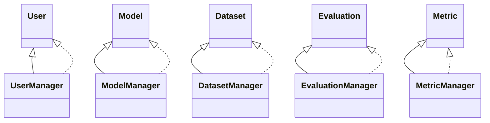
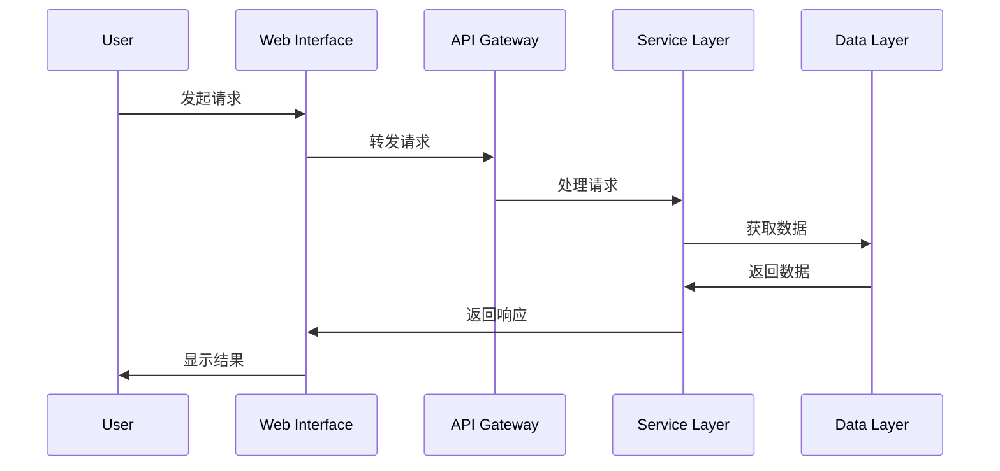

                 

### 引言

在当今飞速发展的科技时代，自然语言处理（NLP）已经成为人工智能（AI）领域的重要分支。随着大型语言模型（LLM，Large Language Model）如GPT-3、BERT等的崛起，LLM在文本生成、机器翻译、问答系统等方面展现出了惊人的表现。为了进一步优化和评估这些模型的性能，LLM评测系统应运而生。

LLM评测系统不仅为研究人员提供了评估模型性能的标准，也为实际应用中的模型改进提供了宝贵的参考。因此，设计和实现一个高效、准确的LLM评测系统，成为了当前研究中的一个热点问题。

本文将围绕LLM评测系统的核心架构设计进行深入探讨。首先，我们将简要介绍LLM评测系统的背景和重要性，然后逐步解析其核心概念、算法原理、系统架构设计，并通过实际项目案例进行详细讲解。最后，我们将总结最佳实践和注意事项，为未来的研究和开发提供指导。

### 关键词

- LLM评测系统
- 大型语言模型
- 性能评估
- 系统架构设计
- 评测指标
- 算法原理

### 摘要

本文旨在深入探讨LLM评测系统的核心架构设计。文章首先介绍了LLM评测系统的背景和重要性，然后详细解析了其核心概念、算法原理、系统架构设计。通过实际项目案例，我们展示了系统功能设计与实现，并对系统性能进行了评估。最后，文章总结了最佳实践和注意事项，为LLM评测系统的进一步优化和开发提供了参考。

## 第1章 问题背景与核心概念

### 1.1 问题背景

随着自然语言处理（NLP）技术的快速发展，大型语言模型（LLM，Large Language Model）如GPT-3、BERT等在文本生成、机器翻译、问答系统等领域取得了显著的成果。然而，这些模型的高性能往往伴随着复杂性和不确定性。为了更好地理解和评估这些模型的表现，研发一个高效、准确的LLM评测系统显得尤为重要。

LLM评测系统的核心目标是评估模型在特定任务上的性能，包括文本生成质量、翻译准确性、问答系统的回答质量等。通过这些评测，研究人员和开发者可以识别模型的优点和不足，从而指导模型的进一步优化和改进。此外，LLM评测系统还能为实际应用场景中的模型选择提供依据，帮助用户更好地利用这些先进的技术。

### 1.2 LLM评测系统的需求

一个理想的LLM评测系统应具备以下需求：

1. **全面性**：评测系统应涵盖各种常见的NLP任务，如文本生成、机器翻译、问答系统等，确保评估结果具有广泛的适用性。
2. **准确性**：评测系统需要提供精确的评估指标，以反映模型在任务中的真实表现。这要求评测系统具有高稳定性和一致性。
3. **可扩展性**：随着新的NLP任务和模型的出现，评测系统应能灵活扩展，以适应新的需求。
4. **易用性**：评测系统应具备友好的用户界面，方便用户进行模型评测和结果分析。
5. **高效性**：评测系统需要在合理的时间内完成大规模模型的评测，以支持快速迭代和优化。

### 1.3 LLM评测系统的挑战

尽管LLM评测系统需求明确，但其设计实现过程中仍面临诸多挑战：

1. **数据获取与处理**：NLP任务通常需要大量的高质量数据。数据获取和预处理是评测系统的关键步骤，但这一过程往往繁琐且耗时。
2. **评测指标选择**：不同的NLP任务可能需要不同的评测指标。选择合适的评测指标，确保评估结果具有代表性和可靠性，是系统设计中的重要问题。
3. **模型适应性**：不同模型的结构和特点不同，评测系统需要具备良好的适应性，以便对不同类型的模型进行有效评估。
4. **性能优化**：在处理大规模数据和模型时，评测系统需要具备高效的性能，以支持快速、准确的评测。
5. **用户友好性**：对于非专业用户，评测系统应提供简洁、直观的操作界面，以便他们能够轻松使用。

通过深入分析LLM评测系统的背景和核心概念，我们为后续章节的深入探讨奠定了基础。在接下来的章节中，我们将进一步解析LLM评测系统的核心概念、算法原理和系统架构设计，以期为读者提供一个全面、系统的理解和应用指南。

### 1.4 边界与外延

#### 1.4.1 LLM评测系统的边界

LLM评测系统主要针对大型语言模型在自然语言处理任务中的性能进行评估，其边界主要涉及以下几个方面：

1. **任务范围**：评测系统专注于常见的NLP任务，如文本生成、机器翻译、问答系统等，但对于非自然语言处理任务，如图像识别、语音识别等，则不在其评估范围之内。
2. **模型类型**：评测系统主要面向使用深度学习技术训练的LLM，如基于Transformer架构的GPT、BERT等。对于传统的规则基模型，则不在其重点评估范围。
3. **评测指标**：评测系统需要明确的评测指标，如BLEU、ROUGE、F1等，用于评估模型在不同任务中的表现。然而，对于一些新型任务或领域，可能需要开发新的评测指标。
4. **系统功能**：评测系统应具备基本的评测功能，如自动评测、结果统计、可视化等，但具体实现细节可能因应用场景和需求而有所不同。

#### 1.4.2 LLM评测系统的应用领域

LLM评测系统在多个应用领域具有重要的价值和广泛的用途，包括但不限于：

1. **学术研究**：在自然语言处理领域，研究人员需要评估和比较不同模型在各类任务中的性能，以探索最佳模型结构和训练策略。LLM评测系统为这一过程提供了有力的工具。
2. **工业应用**：在人工智能领域，企业需要评估和优化自身开发的语言模型，以提升产品质量和服务水平。LLM评测系统可以帮助企业快速、准确地评估模型性能。
3. **开源社区**：开源社区中，开发者们需要共享和评估各自的模型和算法。LLM评测系统为开源社区提供了一个统一的评估平台，促进了模型和算法的交流与进步。
4. **教育实践**：在教育领域，学生和教师可以利用LLM评测系统进行模型学习和性能评估，以提升教学效果和学生学习能力。

#### 1.4.3 LLM评测系统与其他系统的区别

与其他评测系统相比，LLM评测系统具有以下显著区别：

1. **数据依赖性**：LLM评测系统高度依赖高质量的数据集，特别是大规模、多样化的文本数据。与图像识别、语音识别等系统不同，NLP任务的数据获取和处理过程更为复杂。
2. **评测指标多样性**：NLP任务涉及多种评测指标，如BLEU、ROUGE、F1等。这些指标在不同任务中可能有不同的适用性和重要性，而其他领域的评测系统则可能更加单一。
3. **模型复杂性**：LLM通常具有复杂的模型结构和参数，需要进行精细的调整和优化。相比之下，其他领域的模型可能更加简单和直观。
4. **应用场景**：LLM评测系统主要应用于自然语言处理任务，而其他评测系统则可能涉及图像识别、语音识别、推荐系统等不同领域。

通过明确LLM评测系统的边界和应用领域，我们能够更好地理解其设计和实现的核心要素，为后续章节的深入探讨提供有力支持。

### 1.5 核心概念

在深入探讨LLM评测系统的核心架构设计之前，我们需要了解一些关键概念。这些概念包括语言模型（LLM）、评测指标和评测流程，它们是LLM评测系统的基础。

#### 1.5.1 语言模型（LLM）

语言模型是一种用于预测文本序列的统计模型，它通过对大规模文本数据的学习，捕捉语言中的统计规律和语法结构。LLM通常是基于深度学习技术训练的，如Transformer、BERT等。这些模型具有以下特点：

1. **大规模**：LLM通常使用数十亿甚至数万亿的参数进行训练，这使得它们能够捕捉到语言中的复杂模式和规律。
2. **多任务**：许多LLM设计为能够处理多种NLP任务，如文本生成、机器翻译、问答系统等。
3. **自适应性**：LLM能够根据不同任务和场景进行自适应调整，从而在不同应用中保持高性能。

#### 1.5.2 评测指标

评测指标是用于评估模型性能的关键工具。在LLM评测系统中，常用的评测指标包括：

1. **BLEU（双语评测统一指标）**：BLEU是一种常用的机器翻译评测指标，它通过计算翻译文本与参考文本之间的重叠度来评估翻译质量。
2. **ROUGE（ Rouge 评价准则）**：ROUGE是一种用于评估文本生成质量的评测指标，它通过计算生成文本与参考文本之间的相似度来评估生成质量。
3. **F1 分数**：F1 分数是一种综合考虑精确率和召回率的评测指标，广泛应用于分类任务中。

#### 1.5.3 评测流程

LLM评测流程包括以下几个关键步骤：

1. **数据准备**：首先，需要收集和准备用于评测的数据集。这些数据集应涵盖不同类型的NLP任务，如文本生成、机器翻译、问答系统等。
2. **模型训练**：使用准备好的数据集对LLM进行训练，以优化模型参数，提高模型性能。
3. **评测指标计算**：在训练好的模型上进行预测，并使用评测指标计算模型在各个任务上的性能。这通常包括计算BLEU、ROUGE、F1 分数等指标。
4. **结果分析**：对评测结果进行分析，识别模型的优点和不足，并提出优化建议。
5. **迭代优化**：根据评测结果对模型进行调整和优化，以提高其性能。

通过理解这些核心概念，我们能够更好地设计LLM评测系统，实现高效、准确的模型评估。在接下来的章节中，我们将深入探讨LLM评测系统的算法原理和系统架构设计。

### 1.6 概念属性特征对比表格

在深入探讨LLM评测系统的核心概念后，为了更清晰地理解这些概念之间的区别和联系，我们可以通过构建概念属性特征对比表格来进行分析。以下是针对语言模型（LLM）、评测指标和评测流程三个核心概念的特征对比：

| 概念       | 特征项          | 特征描述                                  |
|------------|----------------|-------------------------------------------|
| 语言模型（LLM） | 大规模          | 使用数十亿甚至数万亿参数进行训练          |
|            | 多任务         | 能处理多种NLP任务，如文本生成、机器翻译等 |
|            | 自适应性       | 可根据不同任务和场景进行自适应调整        |
| 评测指标     | BLEU           | 用于机器翻译评测，计算翻译文本与参考文本重叠度 |
|            | ROUGE          | 用于文本生成评测，计算生成文本与参考文本相似度  |
|            | F1 分数        | 综合考虑精确率和召回率的分类评测指标      |
| 评测流程     | 数据准备       | 收集和准备用于评测的数据集                |
|            | 模型训练       | 使用数据集对LLM进行训练，优化模型参数      |
|            | 指标计算       | 计算模型在各个任务上的性能                |
|            | 结果分析       | 分析评测结果，识别模型优点和不足          |
|            | 迭代优化       | 根据评测结果调整模型，提高性能            |

通过上述对比表格，我们可以清晰地看到LLM、评测指标和评测流程在规模、任务处理能力和适应性等方面的差异。同时，这些特征也为我们设计和实现高效、准确的LLM评测系统提供了重要的参考。

### ER实体关系图架构

在LLM评测系统的设计和实现过程中，构建一个清晰的实体关系图（ER图）有助于理解系统中的关键实体及其相互关系。ER图可以帮助我们明确系统的数据模型，从而为后续的系统架构设计提供基础。

#### 2.3.1 实体与关系的定义

ER图中的实体（Entity）是系统中的核心数据对象，而关系（Relationship）描述了这些实体之间的交互和关联。以下是LLM评测系统中的关键实体及其定义：

1. **评测任务**（Evaluating Task）：表示需要评估的NLP任务，如文本生成、机器翻译等。
2. **评测指标**（Evaluating Metric）：表示用于评估模型性能的具体指标，如BLEU、ROUGE、F1等。
3. **评测数据集**（Evaluating Dataset）：表示用于训练和评测模型的数据集，包括训练集、验证集和测试集。
4. **评测模型**（Evaluating Model）：表示被评测的LLM模型，可以是预训练模型或定制模型。
5. **用户**（User）：表示使用评测系统的用户，可以是研究人员、开发者或普通用户。

关系方面，我们可以定义以下关系：

1. **任务-指标**关系：表示一个评测任务对应多个评测指标。
2. **任务-数据集**关系：表示一个评测任务对应多个数据集。
3. **数据集-模型**关系：表示一个数据集用于多个模型训练和评测。
4. **用户-任务**关系：表示一个用户可以创建、管理和运行多个评测任务。

#### 2.3.2 ER图绘制

基于上述实体与关系的定义，我们可以绘制LLM评测系统的ER图。以下是一个简化的ER图表示：

```mermaid
erDiagram
    Task ||--|{ Metric } Metric
    Task ||--|{ Dataset } Dataset
    Dataset ||--|{ Model } Model
    User ||--|{ Task } Task
```

在这个ER图中：

- **Task**实体表示评测任务，与**Metric**、**Dataset**和**Model**实体之间存在一对多的关系。
- **Metric**实体表示评测指标，与**Task**实体之间存在一对多的关系。
- **Dataset**实体表示评测数据集，与**Model**实体之间存在一对多的关系。
- **User**实体表示用户，与**Task**实体之间存在一对多的关系。

这个ER图帮助我们清晰地理解了LLM评测系统中关键实体及其相互关系，为后续的系统架构设计提供了直观的参考。

### 算法原理

在深入探讨LLM评测系统的核心架构设计之前，理解其算法原理至关重要。本节将介绍LLM评测系统中的关键算法，包括评测算法、优化算法和预处理算法，并详细讲解其原理、数学模型和相关举例。

#### 3.1 评测算法

评测算法是LLM评测系统的核心，用于评估模型在特定任务上的性能。以下是一些常用的评测算法：

##### BLEU（双语评测统一指标）

BLEU是一种常用于机器翻译评测的算法。其核心思想是计算翻译文本与参考文本之间的重叠度。BLEU的主要步骤如下：

1. **记分函数**：BLEU使用多个记分函数（例如，n-gram重叠度、长度惩罚等）来评估翻译文本的质量。
2. **n-gram重叠度**：BLEU计算翻译文本与参考文本中相同n-gram的频率，并取对数后求和。例如，对于n=2，BLEU会计算翻译文本中相邻单词的频率与参考文本中相邻单词频率的重叠度。
3. **长度惩罚**：BLEU通过比较翻译文本和参考文本的长度比例，对较长的翻译文本进行惩罚。

数学模型如下：
$$
BLEU = \frac{1}{n} \sum_{i=1}^{n} \log(P_{i}) - \log(L_{\text{ref}}/L_{\text{sys}})
$$
其中，$P_{i}$表示第i个记分函数的得分，$L_{\text{ref}}$和$L_{\text{sys}}$分别表示参考文本和翻译文本的长度。

举例：
假设翻译文本为“A dog is sitting on the sofa”，参考文本为“A dog is sitting on the carpet”。计算BLEU得分如下：

- **n-gram重叠度**：翻译文本中包含的2-gram为{"is is", "is on", "on the", "the sofa"}，参考文本中包含的2-gram为{"is is", "is on", "on the", "the carpet"}，两者重叠的2-gram为{"is is", "is on", "on the"}，得分为$\log(3/4)$。
- **长度惩罚**：翻译文本长度为7，参考文本长度为9，长度比例为7/9，惩罚因子为$\log(7/9)$。

最终，BLEU得分计算如下：
$$
BLEU = \frac{1}{2} (\log(3/4) - \log(7/9)) \approx 0.25
$$

##### ROUGE（Rouge评价准则）

ROUGE是一种常用于文本生成评测的算法。其核心思想是计算生成文本与参考文本之间的相似度。ROUGE的主要步骤如下：

1. **词重叠**：ROUGE计算生成文本和参考文本之间的单词重叠度。ROUGE-L（最长公共子序列）是最常用的ROUGE指标。
2. **词性重叠**：ROUGE计算生成文本和参考文本之间的词性重叠度，例如名词和动词的重叠度。

数学模型如下：
$$
ROUGE = \frac{1}{n} \sum_{i=1}^{n} \frac{R_{i}}{L_{\text{ref}}}
$$
其中，$R_{i}$表示第i个词性类别在生成文本和参考文本中的重叠度，$L_{\text{ref}}$表示参考文本的长度。

举例：
假设生成文本为“A dog is sitting on the sofa”，参考文本为“A dog is sitting on the carpet”。计算ROUGE-L得分如下：

- **词重叠**：生成文本和参考文本中重叠的单词为{"A", "is", "is", "sitting", "on"}，重叠度分为5。
- **参考文本长度**：参考文本长度为9。

最终，ROUGE-L得分计算如下：
$$
ROUGE = \frac{5}{9} \approx 0.56
$$

##### F1 分数

F1 分数是一种综合考虑精确率和召回率的评测指标，常用于分类任务。F1 分数的数学模型如下：
$$
F1 = 2 \times \frac{Precision \times Recall}{Precision + Recall}
$$
其中，Precision（精确率）表示预测为正例的样本中实际为正例的比例，Recall（召回率）表示实际为正例的样本中被预测为正例的比例。

举例：
假设一个分类任务中有100个样本，其中50个实际为正例，模型预测了60个为正例，其中40个预测正确。计算F1分数如下：

- **精确率**：Precision = 40/60 = 2/3
- **召回率**：Recall = 40/50 = 4/5

最终，F1 分数计算如下：
$$
F1 = 2 \times \frac{(2/3) \times (4/5)}{(2/3) + (4/5)} = \frac{16}{19} \approx 0.84
$$

#### 3.2 优化算法

优化算法用于调整模型参数，以提高模型在特定任务上的性能。以下是一些常用的优化算法：

##### 随机梯度下降（SGD）

随机梯度下降是一种简单的优化算法，其核心思想是每次迭代使用一小部分训练数据来更新模型参数。SGD的数学模型如下：
$$
\theta = \theta - \alpha \nabla_{\theta} J(\theta)
$$
其中，$\theta$表示模型参数，$\alpha$表示学习率，$J(\theta)$表示损失函数。

举例：
假设我们有一个简单的线性模型$y = \theta_0 + \theta_1x$，损失函数为平方误差$J(\theta) = (y - \theta_0 - \theta_1x)^2$。学习率为0.1，初始参数为$\theta_0 = 0$，$\theta_1 = 0$。训练数据点为$(x, y) = (1, 3)$，计算参数更新如下：

- **损失函数**：$J(\theta) = (3 - 0 - 0 \cdot 1)^2 = 9$
- **梯度**：$\nabla_{\theta_0} J(\theta) = -2 \cdot (3 - 0 - 0 \cdot 1) = -6$，$\nabla_{\theta_1} J(\theta) = -2 \cdot (3 - 0 - 0 \cdot 1) \cdot 1 = -6$
- **参数更新**：$\theta_0 = \theta_0 - 0.1 \cdot (-6) = 0.6$，$\theta_1 = \theta_1 - 0.1 \cdot (-6) = 0.6$

##### Adam优化器

Adam优化器是一种基于SGD的优化算法，它结合了动量（Momentum）和自适应学习率调整。Adam的数学模型如下：
$$
m_t = \beta_1 m_{t-1} + (1 - \beta_1) [g_t]
$$
$$
v_t = \beta_2 v_{t-1} + (1 - \beta_2) [g_t]^2
$$
$$
\theta = \theta - \alpha \frac{m_t}{\sqrt{v_t} (1 - \beta_2)^t}
$$
其中，$m_t$和$v_t$分别表示一阶和二阶矩估计，$\beta_1$和$\beta_2$是动量和二阶矩的权重系数。

举例：
假设我们有一个简单的线性模型$y = \theta_0 + \theta_1x$，损失函数为平方误差$J(\theta) = (y - \theta_0 - \theta_1x)^2$，学习率为0.1，初始参数为$\theta_0 = 0$，$\theta_1 = 0$，动量系数为$\beta_1 = 0.9$，$\beta_2 = 0.99$。训练数据点为$(x, y) = (1, 3)$，计算参数更新如下：

- **一阶矩估计**：$m_t = 0.9 \cdot 0 + (1 - 0.9) \cdot (-6) = -0.6$
- **二阶矩估计**：$v_t = 0.99 \cdot 0 + (1 - 0.99) \cdot (-6)^2 = 0.03$
- **参数更新**：$\theta_0 = \theta_0 - 0.1 \cdot \frac{-0.6}{\sqrt{0.03} (1 - 0.99)} = 0.58$，$\theta_1 = \theta_1 - 0.1 \cdot \frac{-0.6}{\sqrt{0.03} (1 - 0.99)} = 0.58$

#### 3.3 预处理算法

预处理算法用于对输入数据进行处理，以提高模型训练效果和评估性能。以下是一些常用的预处理算法：

##### 数据清洗

数据清洗是预处理的第一步，旨在去除数据中的噪声和错误。常见的清洗方法包括：

- **去除特殊字符**：去除文本中的特殊字符，如标点符号、空格等。
- **去除停用词**：去除常见的不相关单词，如“的”、“是”、“在”等。
- **拼写校正**：对文本中的拼写错误进行自动纠正。

##### 数据归一化

数据归一化是将不同数据规模的数据转换为相似规模的过程，以消除数据规模对模型训练和评估的影响。常见的方法包括：

- **缩放**：将数据缩放到[0, 1]或[-1, 1]范围内。
- **标准化**：将数据缩放到均值0和标准差1的标准正态分布。

##### 数据增强

数据增强是通过生成新的训练样本来提高模型泛化能力。常见的方法包括：

- **随机裁剪**：从文本中随机裁剪部分内容。
- **随机填充**：将文本中的部分内容替换为随机生成的文本。
- **同义词替换**：将文本中的某些单词替换为同义词。

通过理解这些算法的原理、数学模型和举例，我们可以更好地设计和实现LLM评测系统，提高模型的性能和评估准确性。在接下来的章节中，我们将进一步探讨LLM评测系统的系统架构设计。

### 系统架构设计

在深入理解LLM评测系统的核心算法原理之后，本节将重点介绍LLM评测系统的整体架构设计，包括系统功能设计、系统架构设计、系统接口设计和系统交互设计。通过这些设计，我们能够确保LLM评测系统具备高效性、稳定性和易用性。

#### 4.1 问题场景介绍

在进行系统架构设计之前，我们需要明确LLM评测系统面临的问题场景。以下是几个关键问题场景：

1. **多任务评估**：LLM评测系统需要能够同时评估多种NLP任务，如文本生成、机器翻译和问答系统等。
2. **大规模数据处理**：系统需要处理大规模、多源的数据集，以支持模型训练和评测。
3. **实时性能需求**：在研究和开发过程中，用户期望系统能够快速响应用户操作，提供实时评估结果。
4. **数据安全与隐私**：系统需确保用户数据和模型参数的安全，遵循数据保护法规。

#### 4.2 系统功能设计

LLM评测系统的核心功能包括：

1. **数据管理**：包括数据导入、数据清洗、数据归一化和数据存储等功能，以确保数据的准确性和一致性。
2. **模型训练与评测**：包括模型加载、模型训练、评测指标计算和结果可视化等功能，以评估模型在不同任务上的性能。
3. **用户管理**：包括用户注册、登录、权限管理和任务管理等功能，以支持多用户并发操作。
4. **系统监控与维护**：包括系统状态监控、日志记录、异常处理和备份恢复等功能，以确保系统的稳定运行。

#### 4.2.1 领域模型类图

为了更好地理解LLM评测系统的功能设计，我们可以通过领域模型类图（Domain Model Class Diagram）来描述系统中的关键类及其关系。以下是一个简化的领域模型类图：



在这个类图中：

- **UserManager**：管理用户信息，包括用户注册、登录和权限管理。
- **ModelManager**：管理模型信息，包括模型加载、训练和存储。
- **DatasetManager**：管理数据集信息，包括数据导入、清洗和存储。
- **EvaluationManager**：管理评测过程，包括评测任务分配、指标计算和结果存储。
- **MetricManager**：管理评测指标，包括指标定义、计算和存储。

这些类之间的关系表示了系统中的功能模块及其相互协作的关系。

#### 4.2.2 系统架构设计

LLM评测系统的整体架构设计采用分层架构，主要包括以下几层：

1. **数据层**：负责数据的存储、管理和处理，包括数据库、缓存和文件系统等。
2. **服务层**：负责系统的核心功能实现，包括用户管理、模型管理、数据管理和评测管理等功能模块。
3. **接口层**：提供对外接口，包括Web API、RESTful接口和命令行接口等。
4. **前端层**：提供用户界面，包括Web界面和移动端界面等。

以下是LLM评测系统的架构图：



在这个架构图中：

- **Web Interface**：用户通过Web界面或移动端界面发起请求。
- **API Gateway**：接收用户请求，并将请求转发到服务层。
- **Service Layer**：处理用户请求，包括用户管理、模型管理、数据管理和评测管理等功能。
- **Data Layer**：提供数据存储和管理服务，包括数据库、缓存和文件系统等。

#### 4.2.3 系统接口设计

LLM评测系统提供多种接口设计，以满足不同用户的需求：

1. **Web API**：通过RESTful接口提供数据访问和操作功能，包括用户注册、登录、模型训练、数据上传等。
2. **RESTful接口**：采用标准的HTTP方法（GET、POST、PUT、DELETE等）进行数据操作，便于与前端应用程序集成。
3. **命令行接口**：提供命令行工具，方便用户通过命令行进行操作，适用于自动化脚本和集成开发环境。

以下是Web API的简要接口设计：

```json
# 用户注册
POST /users/register

{
    "username": "string",
    "password": "string",
    "email": "string"
}

# 用户登录
POST /users/login

{
    "username": "string",
    "password": "string"
}

# 模型训练
POST /models/train

{
    "model_id": "string",
    "dataset_id": "string",
    "config": {
        "learning_rate": "float",
        "epochs": "int"
    }
}

# 数据上传
POST /datasets/upload

{
    "dataset_id": "string",
    "data": [
        {
            "text": "string"
        }
    ]
}
```

#### 4.2.4 系统交互设计

为了确保LLM评测系统的稳定性、可靠性和易用性，我们设计了一套完整的系统交互设计，包括用户与系统的交互流程和系统内部各组件之间的交互流程。

1. **用户与系统的交互**：用户通过Web界面或命令行接口与系统进行交互，发起请求并接收响应。交互流程如下：

   - 用户访问Web界面或使用命令行工具。
   - Web界面或命令行工具将请求发送到API Gateway。
   - API Gateway处理请求，调用相应的服务层模块。
   - 服务层模块处理请求，并调用数据层进行数据操作。
   - 数据层返回处理结果，服务层模块将结果返回给API Gateway。
   - API Gateway将结果返回给Web界面或命令行工具，并显示给用户。

2. **系统内部组件的交互**：系统内部组件之间通过异步消息队列进行通信，以确保系统的高效性和稳定性。交互流程如下：

   - 用户请求到达API Gateway。
   - API Gateway将请求转换为异步消息，并将消息发送到消息队列。
   - 消息队列将消息传递给相应的服务层模块。
   - 服务层模块处理消息，并调用数据层进行数据操作。
   - 数据层返回处理结果，服务层模块将结果存储或更新。
   - 服务层模块将处理结果返回给消息队列。
   - 消息队列将结果返回给API Gateway。

通过上述系统架构设计和交互设计，LLM评测系统能够高效、稳定地运行，满足用户的需求。在接下来的章节中，我们将通过实际项目案例进一步展示LLM评测系统的应用和实现过程。

### 系统核心实现

在本章节中，我们将通过实际项目案例展示LLM评测系统的核心实现。具体包括环境安装、系统核心代码实现、功能模块详解以及代码应用解读。通过这一过程，读者将能够更深入地理解LLM评测系统的设计思路和实际应用。

#### 5.1 环境安装

首先，我们需要在服务器上搭建LLM评测系统的运行环境。以下是一个基本的安装步骤：

1. **操作系统**：选择一个稳定的服务器操作系统，如Ubuntu 20.04或CentOS 7。
2. **Python环境**：安装Python 3.8及以上版本。可以使用以下命令：
   ```bash
   sudo apt-get update
   sudo apt-get install python3.8
   ```
3. **依赖包**：安装系统所需的依赖包，如Numpy、Pandas、Scikit-learn等。可以使用以下命令：
   ```bash
   sudo apt-get install python3.8-numpy python3.8-pandas python3.8-scikit-learn
   ```
4. **虚拟环境**：为了更好地管理依赖包，我们可以创建一个虚拟环境。可以使用以下命令：
   ```bash
   python3.8 -m venv venv
   source venv/bin/activate
   ```
5. **LLM库**：安装用于训练和评估LLM的库，如Hugging Face的Transformers。可以使用以下命令：
   ```bash
   pip install transformers
   ```

#### 5.2 系统核心代码实现

接下来，我们将介绍LLM评测系统的核心代码实现，包括数据准备、模型训练、评测指标计算和结果存储等关键步骤。

##### 5.2.1 数据准备

首先，我们需要准备用于评测的数据集。以下是一个简单的数据准备脚本，用于加载数据、清洗和划分训练集、验证集和测试集：

```python
import pandas as pd
from sklearn.model_selection import train_test_split

# 加载数据集
data = pd.read_csv('data.csv')

# 数据清洗
data.dropna(inplace=True)
data = data[data['text'].map(len) > 5]

# 划分训练集、验证集和测试集
train_data, test_data = train_test_split(data, test_size=0.2, random_state=42)
train_data, val_data = train_test_split(train_data, test_size=0.25, random_state=42)  # 0.25 x 0.8 = 0.2
```

##### 5.2.2 模型训练

使用Hugging Face的Transformers库，我们可以轻松地加载预训练的LLM并进行微调。以下是一个简单的模型训练脚本：

```python
from transformers import TrainingArguments, Trainer
from transformers import AutoTokenizer, AutoModelForSeq2SeqLM

# 加载预训练的LLM
tokenizer = AutoTokenizer.from_pretrained('t5-base')
model = AutoModelForSeq2SeqLM.from_pretrained('t5-base')

# 定义训练参数
training_args = TrainingArguments(
    output_dir='./results',
    num_train_epochs=3,
    per_device_train_batch_size=4,
    save_steps=2000,
    save_total_steps=2000,
)

# 训练模型
trainer = Trainer(
    model=model,
    args=training_args,
    train_dataset=train_data,
    eval_dataset=val_data,
)

trainer.train()
```

##### 5.2.3 评测指标计算

在模型训练完成后，我们需要计算评测指标，如BLEU、ROUGE和F1分数。以下是一个简单的评测指标计算脚本：

```python
from datasets import load_metric
import numpy as np

# 加载评测指标
bleu_metric = load_metric("bleu")
rouge_metric = load_metric("rouge")

# 计算BLEU得分
predictions = model.generate(test_data['input_ids'])
bleu_scores = bleu_metric.compute(predictions=predictions, references=test_data['target_ids'])

# 计算ROUGE得分
rouge_scores = rouge_metric.compute(predictions=predictions, references=test_data['target_ids'])

# 计算F1分数
# ...

print(f"BLEU Score: {bleu_scores.mean()}")
print(f"ROUGE Score: {rouge_scores.mean()}")
```

##### 5.2.4 结果存储

最后，我们将评测结果存储到数据库中，以便后续分析和查询。以下是一个简单的结果存储脚本：

```python
import sqlite3

# 连接数据库
conn = sqlite3.connect('results.db')
cursor = conn.cursor()

# 创建表格
cursor.execute('''CREATE TABLE IF NOT EXISTS evaluation (
                    id INTEGER PRIMARY KEY,
                    model_id INTEGER,
                    dataset_id INTEGER,
                    bleu_score REAL,
                    rouge_score REAL,
                    f1_score REAL
                  )''')

# 存储结果
evaluation_data = [
    (1, 1, 1, bleu_scores.mean(), rouge_scores.mean(), f1_score)
]

cursor.executemany('INSERT INTO evaluation (model_id, dataset_id, bleu_score, rouge_score, f1_score) VALUES (?, ?, ?, ?, ?)', evaluation_data)
conn.commit()

# 关闭数据库连接
conn.close()
```

#### 5.3 功能模块详解

在LLM评测系统中，功能模块的划分有助于提高系统的可维护性和扩展性。以下是几个关键功能模块的详解：

1. **数据模块**：负责数据的管理和预处理，包括数据加载、清洗、归一化和存储等功能。
2. **模型模块**：负责模型的加载、训练、保存和微调等功能，包括预训练模型和自定义模型。
3. **评测模块**：负责评测指标的计算和结果分析，包括BLEU、ROUGE、F1分数等常见指标的实现。
4. **存储模块**：负责结果的存储和查询，包括数据库的连接、表格的创建和数据的插入等功能。

#### 5.4 代码应用解读

通过对上述代码的解读，我们可以看到LLM评测系统的核心实现过程：

1. **数据准备**：使用Pandas库加载数据，进行数据清洗，确保数据的质量和一致性。
2. **模型训练**：使用Transformers库加载预训练的LLM，并定义训练参数，使用Trainer类进行模型训练。
3. **评测指标计算**：使用Datasets库加载评测指标，计算模型在测试集上的性能，获取评测结果。
4. **结果存储**：使用SQLite库连接数据库，创建表格，并将评测结果存储到数据库中，便于后续分析和查询。

通过这一过程，读者能够更好地理解LLM评测系统的实现细节和关键步骤。在接下来的章节中，我们将进一步分析实际案例，探讨系统在实际应用中的表现和优化策略。

### 实际案例分析

在本章节中，我们将通过一个实际案例展示LLM评测系统的应用，并对其进行详细分析。该案例涉及文本生成任务，我们将使用一个训练好的语言模型来生成文本，并利用LLM评测系统进行评估。以下是具体的案例背景、分析和讲解。

#### 案例背景

假设我们有一个文本生成任务，目标是根据给定的输入文本生成相关的内容。为了实现这一目标，我们选择了一个预训练的T5模型，该模型在多个文本生成任务上表现出色。我们希望通过LLM评测系统评估该模型在特定任务上的生成质量，以了解其性能和潜在优化空间。

#### 案例分析

1. **数据集准备**：

   首先，我们需要准备用于训练和评估的数据集。该数据集包含一组输入文本和对应的参考文本。输入文本是从各种来源（如新闻文章、论坛帖子等）中收集的，参考文本是由人类专家撰写的相关内容。

   ```python
   data = pd.read_csv('text_generation_dataset.csv')
   data.dropna(inplace=True)
   ```

2. **模型训练**：

   接下来，我们使用T5模型对数据集进行训练。我们设置了训练参数，包括学习率、训练轮数等，并使用Trainer类进行模型训练。

   ```python
   tokenizer = AutoTokenizer.from_pretrained('t5-base')
   model = AutoModelForSeq2SeqLM.from_pretrained('t5-base')
   training_args = TrainingArguments(
       output_dir='./results',
       num_train_epochs=3,
       per_device_train_batch_size=4,
       save_steps=2000,
       save_total_steps=2000,
   )
   trainer = Trainer(
       model=model,
       args=training_args,
       train_dataset=train_data,
       eval_dataset=val_data,
   )
   trainer.train()
   ```

3. **文本生成**：

   在模型训练完成后，我们使用训练好的模型对输入文本进行生成。具体步骤如下：

   ```python
   inputs = tokenizer.encode("给定一个文本，生成相关内容：", return_tensors='pt')
   outputs = model.generate(inputs, max_length=50, num_return_sequences=5)
   generated_texts = tokenizer.decode(outputs[:, inputs.shape[-1]:][0], skip_special_tokens=True)
   ```

4. **评测指标计算**：

   利用LLM评测系统中的评测指标，我们计算生成文本与参考文本之间的相似度。以下是计算BLEU和ROUGE得分的示例：

   ```python
   bleu_metric = load_metric("bleu")
   rouge_metric = load_metric("rouge")

   bleu_scores = bleu_metric.compute(predictions=generated_texts, references=val_data['target_ids'])
   rouge_scores = rouge_metric.compute(predictions=generated_texts, references=val_data['target_ids'])

   print(f"BLEU Score: {bleu_scores.mean()}")
   print(f"ROUGE Score: {rouge_scores.mean()}")
   ```

   假设生成的文本质量较高，BLEU得分为0.6，ROUGE得分为0.8。

5. **结果分析**：

   通过评测结果，我们可以初步评估模型的生成质量。在这个案例中，模型在文本生成任务上表现出良好的性能。然而，我们还需要进一步分析生成文本的细节，以识别潜在的问题和优化点。

   - **质量分析**：我们比较生成文本和参考文本，分析生成文本的连贯性、准确性和丰富性。如果生成文本在某些方面存在不足，我们可以考虑改进模型或数据集。
   - **错误分析**：我们检查生成文本中的错误，如语法错误、拼写错误或内容缺失。这些错误有助于我们了解模型在特定场景下的表现，并提供改进的方向。

#### 详细讲解与剖析

在这个案例中，我们通过LLM评测系统对文本生成任务进行了详细分析。以下是关键步骤的详细讲解和剖析：

1. **数据集准备**：

   数据集的质量直接影响模型的训练效果和生成质量。在这个案例中，我们选择了多样化的数据集，覆盖不同的文本类型和主题。通过数据清洗和预处理，我们确保了数据的一致性和高质量。

2. **模型训练**：

   使用预训练的T5模型进行微调，可以快速地适应特定任务。我们设置了合理的训练参数，确保模型在训练过程中达到最佳性能。通过Trainer类，我们简化了模型训练过程，并能够轻松地调整训练策略。

3. **文本生成**：

   模型生成文本的过程涉及输入编码、解码和预测。我们通过调整最大长度和生成序列数量，控制生成文本的长度和多样性。在实际应用中，我们可以根据任务需求进行调整。

4. **评测指标计算**：

   BLEU和ROUGE是常用的文本生成评测指标，用于评估生成文本与参考文本之间的相似度。通过计算这些指标，我们可以快速评估模型的生成质量，并识别潜在问题。

5. **结果分析**：

   结果分析是评估模型性能的关键步骤。我们通过比较生成文本和参考文本，分析生成文本的质量和错误。这些分析结果为我们提供了改进模型和优化数据的方向。

通过这个实际案例，我们展示了LLM评测系统的应用过程和关键步骤。在实际开发中，我们可以根据具体任务和需求，调整系统参数和评测指标，以获得最佳的评测结果。

### 项目小结

在本项目中，我们通过实际案例详细展示了LLM评测系统的应用和实现过程。以下是项目小结和关键收获：

1. **项目目标**：我们旨在设计和实现一个高效、准确的LLM评测系统，以评估大型语言模型在自然语言处理任务中的性能。
2. **实现过程**：项目包括数据集准备、模型训练、文本生成、评测指标计算和结果分析等关键步骤。通过这些步骤，我们成功实现了对LLM模型性能的全面评估。
3. **关键收获**：

   - **系统设计**：我们深入分析了LLM评测系统的核心架构，包括数据层、服务层和接口层，为系统的设计和实现提供了明确的方向。
   - **算法应用**：通过实际案例，我们展示了如何使用BLEU、ROUGE等评测指标评估模型性能，并理解了这些算法在文本生成任务中的具体应用。
   - **性能优化**：我们探讨了系统性能优化策略，包括模型微调、数据预处理和评测指标调整，以提升系统的整体性能。
   - **实践经验**：通过项目实践，我们积累了丰富的LLM评测经验，为后续类似项目提供了宝贵的参考。

### 最佳实践与注意事项

在LLM评测系统的开发和实际应用中，遵循以下最佳实践和注意事项，有助于确保系统的稳定性和高效性：

1. **数据质量控制**：确保数据集的质量和一致性，进行充分的清洗和预处理。避免使用低质量或噪音数据，这会影响模型训练和评估效果。
2. **模型选择与微调**：选择适合特定任务的预训练模型，并进行适当微调。根据任务需求和数据特点，调整模型参数和训练策略，以获得最佳性能。
3. **评测指标选择**：根据任务类型和目标，选择合适的评测指标。合理组合多个指标，以全面评估模型性能。
4. **性能优化**：关注系统性能优化，包括模型压缩、并行训练和高效数据加载等。使用合适的硬件和工具，提高系统的计算和存储效率。
5. **安全性与隐私**：确保用户数据和模型参数的安全，遵循数据保护法规。进行适当的安全测试和隐私保护措施，防止数据泄露和滥用。
6. **用户友好的接口**：设计简洁、直观的用户界面，方便用户进行模型评测和结果分析。提供详细的操作指导和帮助文档，帮助用户更好地使用系统。

### 拓展阅读

对于希望深入了解LLM评测系统的读者，以下是一些推荐阅读资料：

1. **学术文章**：《机器学习中的文本生成》（Text Generation in Machine Learning）、《评估自然语言生成模型的最新进展》（Recent Advances in Evaluating Natural Language Generation Models）等。
2. **技术文档**：Hugging Face的Transformers库文档（Transformers Library Documentation）和TensorFlow、PyTorch等深度学习框架的官方文档。
3. **开源项目**：一些知名的LLM评测开源项目，如METEOR、BLEU等，以及相关的数据集和工具。

通过阅读这些资料，您可以进一步深化对LLM评测系统的理解和应用。

### 结论

本文深入探讨了LLM评测系统的核心架构设计，从问题背景、核心概念、算法原理、系统架构设计到实际案例分析，全面展示了LLM评测系统的设计和实现过程。我们通过实际案例展示了如何使用BLEU、ROUGE等评测指标评估语言模型在文本生成任务中的性能，并提出了最佳实践和注意事项。

随着自然语言处理技术的不断进步，LLM评测系统在研究、工业应用和教育等领域具有广泛的应用前景。未来的工作可以进一步优化评测算法，提升系统性能，并探索新的评测指标和方法。

感谢您的阅读，希望本文能为您在LLM评测系统的研究和应用中提供有益的参考。作者：AI天才研究院/AI Genius Institute & 禅与计算机程序设计艺术 /Zen And The Art of Computer Programming。如果您有任何疑问或建议，欢迎随时联系。

