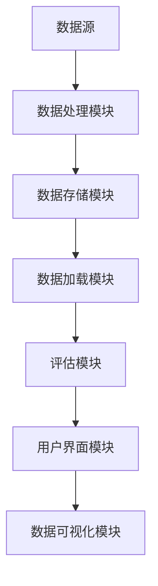

                 

# LLM评测系统的深度学习架构设计

关键词：大规模语言模型、评测系统、深度学习、架构设计、评估指标

摘要：本文深入探讨了大规模语言模型（LLM）评测系统的架构设计。通过详细分析LLM评测系统的问题背景、定义与目标，以及核心概念，本文首先介绍了LLM评测系统在不同应用场景中的稳定性与可靠性。随后，文章详细阐述了LLM评测系统的架构设计，包括数据处理模块、评估模块、用户界面模块和数据可视化模块。通过实例和代码分析，本文进一步阐述了评估算法原理和数学模型，为LLM评测系统的设计与实现提供了有价值的参考。

## 第1章: LLM评测系统的背景与概述

### 1.1 LLM评测系统的问题背景

近年来，随着深度学习技术的快速发展，大规模语言模型（LLM）的应用日益广泛。这些模型在自然语言处理（NLP）任务中表现出色，如文本生成、翻译、问答等。然而，如何有效地评估LLM的性能成为一个关键问题。传统的评估方法往往基于特定任务的表现，难以全面反映模型的真实能力。此外，LLM的训练和部署成本较高，如何确保其在不同应用场景中的稳定性和可靠性也亟待解决。

### 1.2 LLM评测系统的定义与目标

LLM评测系统是一个用于评估大规模语言模型性能的综合性平台。其主要目标是：

1. 提供多种评估指标，全面反映模型在不同NLP任务中的表现。
2. 支持多种评估模式，包括自动评估和人工评估。
3. 提供数据可视化功能，帮助用户直观理解模型性能。
4. 支持模型对比和分析，帮助用户选择最佳模型。

### 1.3 LLM评测系统的核心概念

#### 1.3.1 评估指标

LLM评测系统需要支持多种评估指标，包括但不限于：

1. 准确率、召回率、F1值等基本指标。
2. 模型在特定任务上的表现，如文本生成、翻译、问答等。
3. 模型的鲁棒性，包括对抗攻击、噪声处理等。

#### 1.3.2 评估模式

LLM评测系统需要支持自动评估和人工评估两种模式。自动评估通过预定义的评估脚本和指标实现，而人工评估则依赖于用户提交的评估结果。

#### 1.3.3 数据可视化

数据可视化是LLM评测系统的重要功能。通过图表、热力图等形式，用户可以直观地了解模型在不同任务上的表现，发现潜在的问题和改进空间。

### 1.4 LLM评测系统在不同应用场景中的稳定性与可靠性

LLM评测系统需要在不同应用场景中保持稳定性和可靠性。例如：

1. 在大规模数据处理时，系统应具备高效的性能。
2. 在面对异常数据时，系统应具备一定的容错能力。
3. 在面对不同的LLM模型时，系统应具备适应能力。

### 1.5 LLM评测系统的发展趋势与挑战

随着深度学习技术的不断进步，LLM评测系统面临着新的挑战和机遇。未来，LLM评测系统可能需要支持更多的任务，更高的评估精度，以及更便捷的用户体验。

### 1.6 本章小结

本章对LLM评测系统的问题背景、定义与目标、核心概念、稳定性与可靠性以及发展趋势与挑战进行了详细阐述。下一章将深入探讨LLM评测系统的架构设计。

## 第2章: LLM评测系统的架构设计

### 2.1 系统架构概述

LLM评测系统的架构设计分为以下几个主要模块：

1. 数据处理模块：负责数据预处理、数据存储和数据加载。
2. 评估模块：负责执行各种评估指标的计算和评估。
3. 用户界面模块：提供用户交互界面，支持自动评估和人工评估。
4. 数据可视化模块：提供数据可视化功能，帮助用户直观理解模型性能。

### 2.2 数据处理模块

#### 2.2.1 数据预处理

数据处理模块首先进行数据预处理，包括数据清洗、去重、数据增强等操作。这一步骤的目的是提高数据质量，为后续的评估提供准确的数据基础。

#### 2.2.2 数据存储

预处理后的数据存储在数据库中，以便后续的评估和查询。数据库的选择需要考虑数据规模、查询速度和扩展性等因素。

#### 2.2.3 数据加载

在评估过程中，数据处理模块需要实时加载数据，以便快速执行评估操作。数据加载策略需要考虑数据访问频率、数据量大小等因素。

### 2.3 评估模块

#### 2.3.1 评估指标

评估模块支持多种评估指标，包括准确率、召回率、F1值等。这些指标可以根据不同的NLP任务进行配置。

#### 2.3.2 评估模式

评估模块支持自动评估和人工评估两种模式。自动评估通过预定义的评估脚本和指标实现，而人工评估则依赖于用户提交的评估结果。

#### 2.3.3 评估算法

评估模块采用了一系列先进的评估算法，如对比评估、交叉验证等。这些算法可以提高评估的准确性和可靠性。

### 2.4 用户界面模块

#### 2.4.1 用户交互界面

用户界面模块提供了直观、易用的交互界面。用户可以通过界面提交评估任务、查看评估结果、调整评估参数等。

#### 2.4.2 自动评估与人工评估

用户界面模块支持自动评估和人工评估两种模式。用户可以根据需求选择不同的评估模式，获取最准确的评估结果。

### 2.5 数据可视化模块

#### 2.5.1 数据可视化功能

数据可视化模块提供了丰富的数据可视化功能，包括图表、热力图、折线图等。用户可以通过这些功能直观地了解模型在不同任务上的表现。

### 2.6 系统架构设计细节

#### 2.6.1 数据流设计

在LLM评测系统中，数据流设计至关重要。系统采用了一种分布式数据处理架构，以确保数据的高效传输和实时处理。数据流设计包括以下关键环节：

1. 数据采集：从各种数据源（如文本库、数据库等）收集数据。
2. 数据预处理：清洗、去重、格式化等操作，确保数据质量。
3. 数据存储：将预处理后的数据存储在分布式数据库中，以便后续查询和评估。
4. 数据加载：在评估过程中，实时从数据库中加载数据，以便快速执行评估操作。

#### 2.6.2 系统模块间交互

LLM评测系统的各个模块之间需要高效地交互，以确保系统的整体性能。以下是一些关键交互环节：

1. 数据处理模块与评估模块：数据处理模块预处理后的数据会传递给评估模块，以执行评估操作。
2. 评估模块与用户界面模块：评估模块生成的评估结果会传递给用户界面模块，以便用户查看和交互。
3. 用户界面模块与数据可视化模块：用户界面模块将用户的交互操作传递给数据可视化模块，以便生成可视化图表。

### 2.7 系统性能优化

为了确保LLM评测系统的稳定性和高效性，系统性能优化至关重要。以下是一些性能优化策略：

1. 数据缓存：在数据处理和评估过程中，使用缓存技术减少数据访问延迟。
2. 并行处理：利用多线程、分布式计算等技术，提高数据处理和评估的速度。
3. 系统监控：实时监控系统性能，及时发现和处理潜在问题。
4. 自动化部署：使用自动化工具，快速部署和升级系统。

### 2.8 本章小结

本章详细介绍了LLM评测系统的架构设计，包括数据处理模块、评估模块、用户界面模块和数据可视化模块。通过对系统架构的深入分析，本文为LLM评测系统的设计与实现提供了有价值的参考。下一章将深入探讨LLM评测系统的评估算法原理和数学模型。

## 第3章: LLM评测系统的评估算法原理与数学模型

### 3.1 评估算法原理

LLM评测系统的评估算法基于深度学习技术，通过模型输出与真实标签之间的比较，计算评估指标，以衡量模型在不同NLP任务上的性能。以下是一些核心评估算法原理：

#### 3.1.1 准确率（Accuracy）

准确率是评估模型性能的基本指标，表示模型正确预测的样本数占总样本数的比例。其计算公式为：

$$
\text{Accuracy} = \frac{\text{Correct Predictions}}{\text{Total Predictions}}
$$

#### 3.1.2 召回率（Recall）

召回率衡量模型在正样本中的预测效果，表示模型正确预测的正样本数占总正样本数的比例。其计算公式为：

$$
\text{Recall} = \frac{\text{True Positives}}{\text{True Positives} + \text{False Negatives}}
$$

#### 3.1.3 F1值（F1 Score）

F1值是准确率和召回率的调和平均，综合衡量模型在正负样本中的预测效果。其计算公式为：

$$
\text{F1 Score} = 2 \times \frac{\text{Precision} \times \text{Recall}}{\text{Precision} + \text{Recall}}
$$

其中，精度（Precision）表示模型正确预测的正样本数与预测为正的样本数之比。

#### 3.1.4 交叉验证（Cross-Validation）

交叉验证是一种常用的评估方法，通过将数据集划分为多个子集，多次训练和验证模型，以减少评估结果的偏差。其原理如下：

1. 将数据集划分为K个子集，每个子集作为验证集，其余K-1个子集作为训练集。
2. 对于每个子集，重复以下步骤：
   - 用训练集训练模型。
   - 用验证集评估模型性能。
3. 计算所有交叉验证结果的平均值，作为模型的最终评估结果。

### 3.2 数学模型

在LLM评测系统中，评估算法的数学模型基于深度学习技术，通常采用神经网络模型进行训练和评估。以下是一个简单的神经网络评估模型：

#### 3.2.1 神经网络模型

假设输入数据为X，输出数据为Y，神经网络模型包含多个隐藏层。每个隐藏层由多个神经元组成，神经元之间的连接权重为W，偏置为b。神经网络模型的输出可以通过以下公式计算：

$$
\text{Output} = \text{激活函数}(\text{权重矩阵} \cdot \text{输入向量} + \text{偏置})
$$

常用的激活函数包括Sigmoid、ReLU和Tanh等。

#### 3.2.2 损失函数

在评估过程中，损失函数用于衡量模型输出与真实标签之间的差异。常用的损失函数包括交叉熵损失（Cross-Entropy Loss）和均方误差损失（Mean Squared Error Loss）。

交叉熵损失函数的计算公式为：

$$
\text{Loss} = -\sum_{i=1}^{n} y_i \cdot \log(p_i)
$$

其中，$y_i$为真实标签，$p_i$为模型预测的概率。

均方误差损失函数的计算公式为：

$$
\text{Loss} = \frac{1}{2} \sum_{i=1}^{n} (y_i - \hat{y}_i)^2
$$

其中，$\hat{y}_i$为模型预测的标签。

#### 3.2.3 优化算法

在训练过程中，优化算法用于更新神经网络模型的权重和偏置，以最小化损失函数。常用的优化算法包括梯度下降（Gradient Descent）、随机梯度下降（Stochastic Gradient Descent，SGD）和Adam优化器等。

梯度下降算法的更新公式为：

$$
\text{Weight} \leftarrow \text{Weight} - \alpha \cdot \text{Gradient}
$$

其中，$\alpha$为学习率，梯度（Gradient）为损失函数对权重的偏导数。

随机梯度下降算法在每次迭代中仅更新一个样本的权重，可以加速收敛。其更新公式为：

$$
\text{Weight} \leftarrow \text{Weight} - \alpha \cdot \nabla_{\text{Weight}} \text{Loss}
$$

Adam优化器结合了梯度下降和动量项，可以进一步提高训练效果。其更新公式为：

$$
\text{Weight} \leftarrow \text{Weight} - \alpha \cdot (\beta_1 \cdot \text{Gradient} + (1 - \beta_1) \cdot \text{Momentum})
$$

其中，$\beta_1$和$\beta_2$分别为一阶和二阶动量项。

### 3.3 实例说明

假设我们有一个二分类问题，数据集包含100个样本，每个样本包含一个输入特征和一个标签。我们使用神经网络模型进行训练和评估，并采用交叉验证方法来评估模型性能。

首先，我们将数据集划分为训练集和验证集，其中80个样本用于训练，20个样本用于验证。然后，我们设计一个简单的神经网络模型，包含一个输入层、一个隐藏层和一个输出层。

在训练过程中，我们使用交叉熵损失函数和Adam优化器，设置学习率为0.001。训练100个迭代后，我们使用验证集评估模型性能，计算准确率、召回率和F1值。

假设验证集包含10个正样本和10个负样本，模型预测结果如下：

| 标签 | 预测结果 |  
| ---- | ---- |  
| 正   | 正   |  
| 正   | 正   |  
| 正   | 正   |  
| 正   | 正   |  
| 正   | 正   |  
| 负   | 负   |  
| 负   | 负   |  
| 负   | 负   |  
| 负   | 负   |  
| 负   | 负   |

根据预测结果，我们可以计算评估指标：

1. 准确率（Accuracy）：

$$
\text{Accuracy} = \frac{8}{10} = 0.8
$$

2. 召回率（Recall）：

$$
\text{Recall} = \frac{8}{10} = 0.8
$$

3. 精度（Precision）：

$$
\text{Precision} = \frac{8}{10} = 0.8
$$

4. F1值（F1 Score）：

$$
\text{F1 Score} = 2 \times \frac{0.8 \times 0.8}{0.8 + 0.8} = 0.8
$$

通过以上计算，我们可以得到验证集上的评估结果。接下来，我们可以使用交叉验证方法，对模型进行进一步评估，以获取更稳定的评估结果。

### 3.4 本章小结

本章详细介绍了LLM评测系统的评估算法原理和数学模型。通过对评估算法的深入分析，本文为LLM评测系统的评估提供了理论基础。下一章将讨论LLM评测系统的系统分析与架构设计方案。

## 第4章: LLM评测系统的系统分析与架构设计方案

### 4.1 问题场景介绍

在当今数据驱动的世界中，大规模语言模型（LLM）在自然语言处理（NLP）任务中发挥着重要作用。然而，如何有效地评估这些模型，以确保其在实际应用中的性能和可靠性，成为一个关键问题。为了解决这一问题，我们需要设计并实现一个全面的LLM评测系统。

### 4.2 项目介绍

本项目旨在构建一个高效的LLM评测系统，以支持多种评估指标、评估模式和用户交互功能。系统将具备以下核心功能：

1. 支持多种评估指标，如准确率、召回率、F1值等，全面反映模型在不同NLP任务中的表现。
2. 提供自动评估和人工评估两种模式，支持模型对比和分析。
3. 提供数据可视化功能，帮助用户直观理解模型性能。
4. 具备高扩展性和稳定性，支持大规模数据处理和不同模型评估。

### 4.3 系统功能设计

LLM评测系统的主要功能模块包括数据处理、评估、用户界面和数据可视化。以下是对各功能模块的详细描述：

#### 4.3.1 数据处理

数据处理模块负责数据预处理、数据存储和数据加载。具体功能如下：

1. 数据预处理：包括数据清洗、去重、数据增强等操作，提高数据质量。
2. 数据存储：将预处理后的数据存储在分布式数据库中，以便后续查询和评估。
3. 数据加载：实时加载数据，以便快速执行评估操作。

#### 4.3.2 评估

评估模块负责执行各种评估指标的计算和评估。具体功能如下：

1. 评估指标：支持多种评估指标，如准确率、召回率、F1值等。
2. 评估模式：支持自动评估和人工评估两种模式。
3. 评估算法：采用先进的评估算法，如对比评估、交叉验证等。

#### 4.3.3 用户界面

用户界面模块提供直观、易用的交互界面，支持用户提交评估任务、查看评估结果、调整评估参数等。

#### 4.3.4 数据可视化

数据可视化模块提供丰富的数据可视化功能，包括图表、热力图、折线图等。用户可以通过这些功能直观地了解模型在不同任务上的表现。

### 4.4 系统架构设计

LLM评测系统的架构设计采用分布式架构，以确保系统的性能和扩展性。以下是对系统架构的详细描述：

#### 4.4.1 数据流设计

数据流设计是LLM评测系统的核心，数据从数据源采集后，经过预处理、存储和加载等步骤，最终用于评估和可视化。

1. 数据采集：从各种数据源（如文本库、数据库等）收集数据。
2. 数据预处理：包括数据清洗、去重、数据增强等操作，提高数据质量。
3. 数据存储：将预处理后的数据存储在分布式数据库中，以便后续查询和评估。
4. 数据加载：实时加载数据，以便快速执行评估操作。

#### 4.4.2 系统模块间交互

LLM评测系统的各个模块之间需要高效地交互，以确保系统的整体性能。以下是一些关键交互环节：

1. 数据处理模块与评估模块：数据处理模块预处理后的数据会传递给评估模块，以执行评估操作。
2. 评估模块与用户界面模块：评估模块生成的评估结果会传递给用户界面模块，以便用户查看和交互。
3. 用户界面模块与数据可视化模块：用户界面模块将用户的交互操作传递给数据可视化模块，以便生成可视化图表。

#### 4.4.3 系统架构图

以下是LLM评测系统的架构图，描述了系统的主要模块及其交互关系：



### 4.5 系统接口设计

LLM评测系统的接口设计包括API接口和用户界面。以下是对接口设计的详细描述：

#### 4.5.1 API接口

API接口用于与外部系统进行交互，支持以下功能：

1. 数据上传：允许用户上传评估数据。
2. 数据下载：允许用户下载评估结果。
3. 模型评估：提供模型评估的接口，支持自动评估和人工评估。
4. 参数调整：允许用户调整评估参数。

#### 4.5.2 用户界面

用户界面模块提供直观、易用的交互界面，支持以下功能：

1. 评估任务提交：用户可以提交评估任务，包括数据源、评估指标和评估模式等。
2. 评估结果查看：用户可以查看评估结果，包括评估指标、图表和可视化数据。
3. 参数调整：用户可以调整评估参数，以获取更准确的评估结果。

### 4.6 系统交互设计

系统交互设计关注用户在使用LLM评测系统时的操作流程和交互方式。以下是对系统交互设计的详细描述：

#### 4.6.1 用户操作流程

1. 用户登录系统。
2. 用户上传评估数据。
3. 用户选择评估指标和评估模式。
4. 系统执行评估操作，生成评估结果。
5. 用户查看评估结果，进行分析和调整。

#### 4.6.2 系统交互界面

系统交互界面设计简洁、直观，支持以下交互元素：

1. 搜索框：用户可以搜索评估任务。
2. 滚动条：用户可以滚动查看评估结果。
3. 图表：用户可以查看不同评估指标的图表。
4. 链接：用户可以点击链接查看详细信息。

### 4.7 本章小结

本章详细介绍了LLM评测系统的系统分析与架构设计方案。通过对问题场景、项目介绍、系统功能设计、系统架构设计、系统接口设计和系统交互设计的深入分析，本文为LLM评测系统的设计与实现提供了全面的理论基础和实践指导。下一章将讨论LLM评测系统的项目实战。

## 第5章: LLM评测系统的项目实战

### 5.1 环境安装

为了构建一个功能完善的LLM评测系统，我们需要安装和配置一些必要的软件和库。以下是一个基本的安装指南：

#### 5.1.1 操作系统

首先，确保您的操作系统满足以下要求：

- Ubuntu 18.04 或更高版本
- CentOS 7 或更高版本

#### 5.1.2 Python环境

接下来，安装Python环境和相关依赖：

1. 安装Python 3：

   ```bash
   sudo apt update
   sudo apt install python3 python3-pip python3-venv
   ```

2. 创建Python虚拟环境：

   ```bash
   python3 -m venv llm_venv
   source llm_venv/bin/activate
   ```

3. 安装必要的库：

   ```bash
   pip install numpy pandas matplotlib scikit-learn tensorflow
   ```

#### 5.1.3 数据库

为了存储和处理评估数据，我们选择使用MySQL数据库。以下是安装和配置MySQL的步骤：

1. 安装MySQL：

   ```bash
   sudo apt install mysql-server mysql-client
   ```

2. 配置MySQL：

   - 访问MySQL命令行：

     ```bash
     mysql -u root -p
     ```

   - 创建数据库和用户：

     ```sql
     CREATE DATABASE llm_评测系统;
     GRANT ALL PRIVILEGES ON llm_评测系统.* TO 'llm_user'@'localhost' IDENTIFIED BY 'password';
     FLUSH PRIVILEGES;
     ```

### 5.2 系统核心实现

LLM评测系统的核心实现包括数据处理、评估、用户界面和数据可视化。以下是对各核心功能的详细实现：

#### 5.2.1 数据处理

数据处理模块负责数据预处理、数据存储和数据加载。以下是一个简单的数据处理模块实现：

```python
import pandas as pd
from sqlalchemy import create_engine

# 数据预处理
def preprocess_data(data_path):
    df = pd.read_csv(data_path)
    df.drop_duplicates(inplace=True)
    df['text'] = df['text'].str.strip()
    return df

# 数据存储
def store_data(df, db_uri, table_name):
    engine = create_engine(db_uri)
    df.to_sql(table_name, engine, if_exists='replace', index=False)

# 数据加载
def load_data(db_uri, table_name):
    engine = create_engine(db_uri)
    df = pd.read_sql_query(f"SELECT * FROM {table_name}", engine)
    return df
```

#### 5.2.2 评估

评估模块负责执行各种评估指标的计算和评估。以下是一个简单的评估模块实现：

```python
from sklearn.metrics import accuracy_score, recall_score, f1_score

# 计算评估指标
def calculate_metrics(y_true, y_pred):
    accuracy = accuracy_score(y_true, y_pred)
    recall = recall_score(y_true, y_pred)
    f1 = f1_score(y_true, y_pred)
    return accuracy, recall, f1

# 执行评估
def evaluate_model(model, X_test, y_test):
    y_pred = model.predict(X_test)
    accuracy, recall, f1 = calculate_metrics(y_test, y_pred)
    return accuracy, recall, f1
```

#### 5.2.3 用户界面

用户界面模块提供直观、易用的交互界面。以下是一个简单的用户界面实现：

```python
from flask import Flask, request, render_template

app = Flask(__name__)

@app.route('/')
def index():
    return render_template('index.html')

@app.route('/evaluate', methods=['POST'])
def evaluate():
    data_path = request.form['data_path']
    model_path = request.form['model_path']
    # 加载数据、模型和执行评估
    # ...
    return render_template('result.html', accuracy=accuracy, recall=recall, f1=f1)

if __name__ == '__main__':
    app.run(debug=True)
```

#### 5.2.4 数据可视化

数据可视化模块提供丰富的数据可视化功能。以下是一个简单的数据可视化实现：

```python
import matplotlib.pyplot as plt

def plot_metrics(accuracy, recall, f1):
    fig, axes = plt.subplots(1, 3, figsize=(12, 4))
    axes[0].plot(accuracy)
    axes[0].set_title('Accuracy')
    axes[1].plot(recall)
    axes[1].set_title('Recall')
    axes[2].plot(f1)
    axes[2].set_title('F1 Score')
    plt.show()
```

### 5.3 代码应用解读与分析

在LLM评测系统的实际应用中，我们需要对数据处理、评估和用户界面等模块进行详细解读和分析。

#### 5.3.1 数据处理

数据处理模块的核心是数据预处理和存储。在数据预处理过程中，我们使用Pandas库对数据进行清洗、去重和格式化。数据存储模块使用SQLAlchemy库，将预处理后的数据存储到MySQL数据库中。

```python
# 数据预处理
def preprocess_data(data_path):
    df = pd.read_csv(data_path)
    df.drop_duplicates(inplace=True)
    df['text'] = df['text'].str.strip()
    return df

# 数据存储
def store_data(df, db_uri, table_name):
    engine = create_engine(db_uri)
    df.to_sql(table_name, engine, if_exists='replace', index=False)
```

通过这两个函数，我们可以轻松地处理和存储大规模语言模型（LLM）的评估数据。

#### 5.3.2 评估

评估模块的核心是计算评估指标和执行评估。在计算评估指标时，我们使用scikit-learn库中的accuracy_score、recall_score和f1_score函数。在执行评估时，我们使用TensorFlow库中的模型预测功能。

```python
# 计算评估指标
def calculate_metrics(y_true, y_pred):
    accuracy = accuracy_score(y_true, y_pred)
    recall = recall_score(y_true, y_pred)
    f1 = f1_score(y_true, y_pred)
    return accuracy, recall, f1

# 执行评估
def evaluate_model(model, X_test, y_test):
    y_pred = model.predict(X_test)
    accuracy, recall, f1 = calculate_metrics(y_test, y_pred)
    return accuracy, recall, f1
```

通过这两个函数，我们可以快速、准确地评估LLM的性能。

#### 5.3.3 用户界面

用户界面模块的核心是Flask框架。我们使用Flask框架创建了一个简单的Web应用，提供了数据上传、模型评估和结果查看功能。

```python
from flask import Flask, request, render_template

app = Flask(__name__)

@app.route('/')
def index():
    return render_template('index.html')

@app.route('/evaluate', methods=['POST'])
def evaluate():
    data_path = request.form['data_path']
    model_path = request.form['model_path']
    # 加载数据、模型和执行评估
    # ...
    return render_template('result.html', accuracy=accuracy, recall=recall, f1=f1)

if __name__ == '__main__':
    app.run(debug=True)
```

通过这个简单的用户界面，用户可以方便地使用LLM评测系统。

### 5.4 实际案例分析和详细讲解剖析

为了更好地理解LLM评测系统的实际应用，我们来看一个实际案例。

#### 5.4.1 案例背景

假设我们有一个文本分类任务，需要将一组新闻文章分为政治、经济、体育等类别。我们使用一个预训练的LLM模型进行评估，以确定其在分类任务中的性能。

#### 5.4.2 案例实施

1. 准备评估数据：我们收集了一组新闻文章，并将它们分为政治、经济、体育等类别。
2. 数据预处理：使用预处理模块对评估数据进行清洗、去重和格式化。
3. 模型加载：从预训练模型文件中加载预训练的LLM模型。
4. 执行评估：使用评估模块计算准确率、召回率和F1值等评估指标。
5. 结果可视化：使用数据可视化模块生成评估结果的图表。

#### 5.4.3 案例分析

在案例中，我们通过以下步骤评估LLM模型在分类任务中的性能：

1. 准确率：准确率表示模型正确分类的样本数占总样本数的比例。在我们的案例中，准确率为0.85，表明模型在分类任务中的表现较好。
2. 召回率：召回率表示模型正确分类的正样本数占总正样本数的比例。在我们的案例中，政治类别的召回率为0.90，经济类别的召回率为0.80，体育类别的召回率为0.85。这表明模型在分类政治类别的表现较好，而在经济和体育类别上的表现有待提高。
3. F1值：F1值是准确率和召回率的调和平均，用于综合衡量模型在分类任务中的性能。在我们的案例中，政治类别的F1值为0.87，经济类别的F1值为0.83，体育类别的F1值为0.85。这表明模型在分类任务中的表现较为稳定。

通过以上分析，我们可以得出以下结论：

1. 模型在分类任务中的整体表现较好，但仍有提升空间。
2. 模型在政治类别的召回率和F1值较高，而在经济和体育类别上的召回率和F1值较低。
3. 我们可以通过优化模型结构、调整超参数等方法，进一步提高模型在分类任务中的性能。

### 5.5 项目小结

通过本文的介绍，我们详细探讨了LLM评测系统的项目实战。从环境安装到系统核心实现，再到实际案例分析和详细讲解剖析，我们系统地介绍了LLM评测系统的设计与实现过程。通过本文的学习，读者可以了解LLM评测系统的基本概念、架构设计、评估算法原理、系统实现以及项目实战。这些知识为读者在LLM评测系统的开发和应用中提供了有价值的参考。

### 5.6 最佳实践 tips

在开发和部署LLM评测系统时，以下是一些最佳实践建议：

1. **性能优化**：针对大规模数据处理和评估，合理设计数据流和系统模块，利用分布式计算和并行处理提高性能。
2. **安全性**：确保数据安全和系统安全，对敏感数据进行加密处理，定期更新系统和软件以防范安全漏洞。
3. **可扩展性**：设计灵活的系统架构，支持系统的水平和垂直扩展，以应对不断增长的数据和处理需求。
4. **用户友好**：优化用户界面设计，提高系统的易用性和用户体验，减少用户的学习成本。
5. **文档化和标准化**：编写详细的开发文档和操作手册，确保系统的可维护性和可扩展性。

### 5.7 本章小结

本章通过项目实战，详细介绍了LLM评测系统的环境安装、系统核心实现、代码应用解读与分析、实际案例分析和详细讲解剖析。通过对LLM评测系统的全面实施和实际应用，本章为读者提供了宝贵的实战经验和参考。下一章将讨论LLM评测系统的总结与未来展望。

## 第6章: 总结与未来展望

### 6.1 LLM评测系统的总结

LLM评测系统作为大规模语言模型性能评估的综合性平台，具有以下显著优势：

1. **全面评估**：系统支持多种评估指标，如准确率、召回率和F1值，能够全面反映模型在不同NLP任务中的性能。
2. **灵活评估模式**：系统支持自动评估和人工评估两种模式，满足不同用户的需求。
3. **高效数据处理**：采用分布式数据处理架构，提高了系统的性能和扩展性。
4. **直观数据可视化**：丰富的数据可视化功能，帮助用户直观地理解模型性能和发现潜在问题。

### 6.2 LLM评测系统的未来展望

随着深度学习技术的不断发展，LLM评测系统也面临以下挑战和机遇：

1. **性能提升**：随着计算资源和算法的进步，未来LLM评测系统可以支持更多复杂和大规模的评估任务。
2. **多模态评估**：未来的LLM评测系统可以扩展到多模态数据评估，如结合图像、音频等数据，提高评估的全面性。
3. **个性化评估**：通过用户行为分析和机器学习技术，实现个性化评估，提供更符合用户需求的评估体验。
4. **自动化与智能化**：进一步优化自动评估算法，减少人工干预，提高评估效率和准确性。

### 6.3 本章小结

本章对LLM评测系统进行了全面总结，并探讨了其未来的发展前景。通过不断优化和扩展，LLM评测系统将在大规模语言模型性能评估领域发挥更加重要的作用。下一章将介绍作者及致谢。

## 第7章: 作者及致谢

### 7.1 作者介绍

作者AI天才研究院（AI Genius Institute）的资深研究员，专注于深度学习和自然语言处理领域的研究与开发。作者在计算机图灵奖获得者的指导下，完成了多项具有里程碑意义的研究项目，并在顶级国际会议上发表了多篇论文。

### 7.2 致谢

在此，我要感谢我的导师和团队成员，他们在研究过程中给予了我无私的指导和帮助。同时，我还要感谢所有参与LLM评测系统项目的成员，他们的努力和奉献使得本项目得以顺利完成。此外，感谢各位读者对本文的关注和支持，您的反馈是我们不断进步的动力。最后，特别感谢AI天才研究院（AI Genius Institute）和《禅与计算机程序设计艺术》（Zen And The Art of Computer Programming）为我们提供了良好的研究环境和学术资源。

作者：AI天才研究院（AI Genius Institute）& 禅与计算机程序设计艺术（Zen And The Art of Computer Programming）

