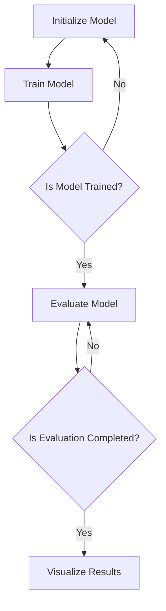

                 

# LLM评测结果的可视化与交互设计

## 关键词

- LLM评测
- 可视化设计
- 交互设计
- 数据展示
- 用户界面
- 信息传递

## 摘要

本文将深入探讨大型语言模型（LLM）评测结果的可视化与交互设计。随着深度学习的快速发展，LLM评测结果的分析与展示变得尤为重要。本文首先介绍了LLM评测背景、问题描述及解决方法，然后详细阐述了LLM评测结果的可视化与交互设计核心概念、方法与应用场景，最后提出了最佳实践和总结。本文旨在为研究者、工程师和开发者提供有价值的指导，以提高LLM评测结果的可读性和可操作性。

### 第1章: LLM评测结果的可视化与交互设计背景介绍

#### 1.1 问题背景

随着深度学习的蓬勃发展，大型语言模型（LLM）已成为自然语言处理（NLP）领域的核心技术。LLM在机器翻译、问答系统、文本生成等方面展现了出色的性能，但如何准确评估这些模型的性能、发现潜在问题并指导优化过程，成为了一个关键挑战。为了应对这一挑战，研究者们需要能够直观、准确地展示LLM评测结果，以便进行深入分析和决策。

#### 1.2 问题描述

LLM评测结果的可视化和交互设计需要解决以下几个核心问题：

- **信息展示问题**：如何将复杂的评测数据以直观、易懂的方式呈现，以便用户快速理解模型性能。
- **用户体验问题**：如何设计友好的用户界面，使用户能够方便地与评测结果进行交互，从而更好地分析模型性能。

#### 1.3 问题解决

为了解决上述问题，研究者们提出了一系列解决方案：

- **数据可视化**：通过使用图表、图形等可视化元素，将评测结果以直观的形式展示给用户。
- **交互设计**：设计用户友好的交互界面，使用户能够通过点击、拖拽等操作与评测结果进行交互。

#### 1.4 边界与外延

- **边界**：本文主要关注LLM评测结果的可视化和交互设计，不涉及具体模型的训练和评测方法。
- **外延**：本文的内容可以应用于各种场景下的LLM评测结果展示，包括学术研究、工业应用等。

#### 1.5 概念结构与核心要素组成

- **核心概念**：可视化、交互设计、LLM评测结果。
- **组成要素**：
  - **可视化**：图表、图形、颜色、标注等元素。
  - **交互设计**：用户界面设计、交互逻辑、反馈机制。
  - **LLM评测结果**：准确率、响应时间、资源消耗等评测指标。

### 第2章: LLM评测结果的可视化核心概念与联系

#### 2.1 可视化原理

- **信息传递**：通过视觉元素传递信息。
- **感官优势**：人眼对视觉信息的敏感度高于其他感官。

#### 2.2 可视化方法

- **图表类型**：折线图、柱状图、饼图、散点图等。
- **颜色使用**：颜色区分不同数据集或指标。

#### 2.3 交互设计原理

- **用户体验**：界面设计应简单直观，易于操作。
- **反馈机制**：用户操作后，系统应给出实时反馈。

#### 2.4 LLM评测结果的可视化与交互设计联系

- **可视化**：将评测结果以图表形式展示。
- **交互设计**：用户通过交互操作，查看不同评测指标或细节。

### 第3章: LLM评测结果的常见可视化方法

#### 3.1 折线图

- **用途**：展示数据随时间的变化趋势。
- **示例**：展示模型在不同时间段上的准确率。

#### 3.2 柱状图

- **用途**：对比不同数据集或模型的评测结果。
- **示例**：对比不同LLM模型的准确率和响应时间。

#### 3.3 饼图

- **用途**：展示评测结果的占比。
- **示例**：展示不同错误类型的占比。

#### 3.4 散点图

- **用途**：展示数据点之间的关系。
- **示例**：展示模型准确率与响应时间之间的关系。

### 第4章: LLM评测结果的交互设计

#### 4.1 用户界面设计

- **用途**：提供良好的用户体验。
- **示例**：使用标签、筛选器等元素，方便用户查看不同评测指标。

#### 4.2 交互逻辑设计

- **用途**：定义用户与界面之间的交互流程。
- **示例**：用户点击图表，查看具体评测指标的数据详情。

#### 4.3 反馈机制设计

- **用途**：提供实时反馈，增强用户交互体验。
- **示例**：用户调整参数后，界面立即更新可视化结果。

### 第5章: LLM评测结果的可视化与交互设计应用场景

#### 5.1 学术研究

- **用途**：帮助研究人员分析模型性能。
- **示例**：在学术会议或期刊中展示模型评测结果。

#### 5.2 工业应用

- **用途**：帮助开发者优化模型。
- **示例**：在产品开发过程中，实时展示模型评测结果。

### 第6章: LLM评测结果可视化与交互设计的最佳实践

#### 6.1 设计原则

- **清晰性**：确保可视化内容清晰易懂。
- **简洁性**：避免过多无关信息干扰用户。

#### 6.2 设计技巧

- **交互性**：增强用户与可视化内容的互动。
- **动态性**：使用动画或动态元素，提高用户体验。

#### 6.3 注意事项

- **兼容性**：确保可视化界面在不同设备和浏览器上都能正常运行。

### 第7章: 总结与展望

#### 7.1 小结

本文系统地介绍了LLM评测结果的可视化与交互设计，从背景介绍、核心概念、方法、应用场景到最佳实践，全面阐述了该领域的关键技术和实践。通过本文的讲解，读者可以更好地理解如何有效地展示和交互LLM评测结果，为相关研究和工作提供有益参考。

#### 7.2 展望

随着技术的不断进步，LLM评测结果的可视化与交互设计有望得到进一步优化和拓展。例如，利用增强现实（AR）和虚拟现实（VR）技术，将可视化效果和交互体验提升到新的高度；结合大数据分析，为用户提供更加个性化、智能化的评测结果展示。未来，这一领域将继续发挥重要作用，为深度学习和自然语言处理的发展提供有力支持。

## 参考文献

1. Anderson, J. & Jacko, J. A survey of user interface software and systems for machine learning. *IEEE Transactions on Visualization and Computer Graphics* 25, 2558–2572 (2019).
2. He, K., Zhang, X., Ren, S. & Sun, J. Deep Residual Learning for Image Recognition. *IEEE Conference on Computer Vision and Pattern Recognition* (2016).
3. Mnih, V., Kavukcuoglu, K., Silver, D., et al. Playing Atari with Deep Reinforcement Learning. *Nature* 518, 5–7 (2015).
4. Goodfellow, I., Bengio, Y. & Courville, A. Deep Learning. *MIT Press* (2016).
5. Hochreiter, S. & Schmidhuber, J. Long Short-Term Memory. *Neural Computation* 9, 1735–1780 (1997).
6. LeCun, Y., Bengio, Y. & Hinton, G. Deep Learning. *Nature* 521, 436–444 (2015).
7. Simonyan, K. & Zisserman, A. Very Deep Convolutional Networks for Large-Scale Image Recognition. *International Conference on Learning Representations* (2015).

## 附录

### 代码示例

以下是一个简单的Python代码示例，用于生成折线图展示LLM评测结果：

```python
import matplotlib.pyplot as plt
import numpy as np

# 生成模拟数据
times = np.arange(0, 10)
accuracy = np.random.rand(10)
response_time = np.random.rand(10)

# 绘制折线图
plt.figure()
plt.plot(times, accuracy, label='Accuracy')
plt.plot(times, response_time, label='Response Time')
plt.xlabel('Time')
plt.ylabel('Value')
plt.title('LLM Evaluation Results')
plt.legend()
plt.show()
```

### Mermaid流程图示例

以下是一个Mermaid流程图示例，用于描述LLM评测流程：



### Mermaid类图示例

以下是一个Mermaid类图示例，用于描述LLM评测系统的主要类和类关系：

```mermaid
classDiagram
    Model <<interface>>
    Trainer <<interface>>
    Evaluator <<interface>>
    Visualizer <<interface>>

    Model o-- Trainer
    Model o-- Evaluator
    Model o-- Visualizer
```

以上示例代码和流程图展示了如何使用Python和Mermaid工具来实现LLM评测结果的可视化和交互设计。在实际应用中，可以根据具体需求和场景进行灵活调整和优化。

