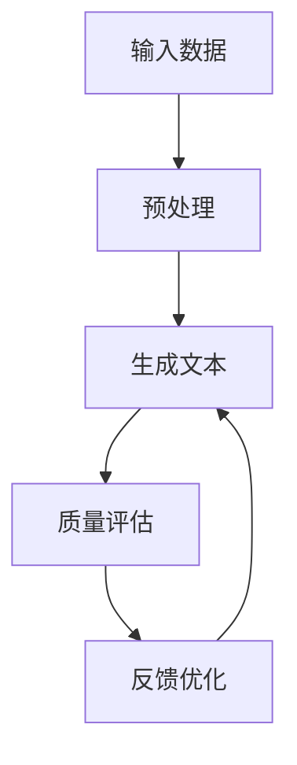
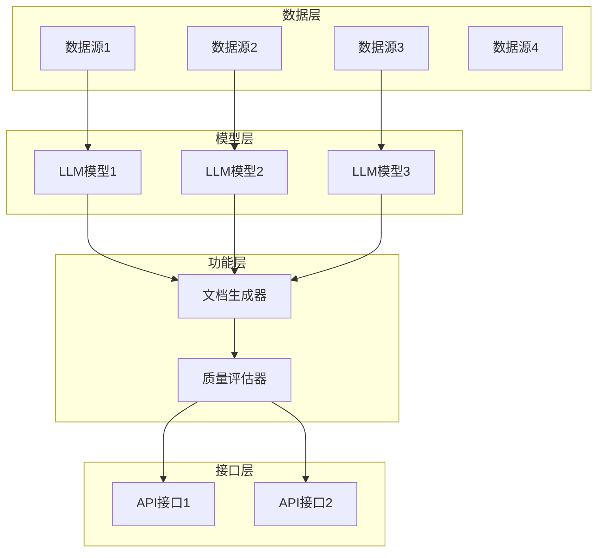
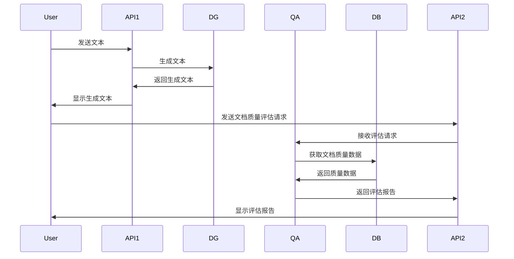

                 


# LLM辅助技术文档生成质量评估

> 关键词：LLM，技术文档，生成质量评估，人工智能，自然语言处理

> 摘要：本文旨在深入探讨大型语言模型（LLM）辅助技术文档生成的质量评估方法。通过背景介绍、核心概念与联系、算法原理讲解、系统分析与架构设计方案、项目实战和最佳实践等多个方面，本文为读者提供了全面的技术文档生成质量评估思路和实践经验。

## 背景介绍

### 什么是LLM

大型语言模型（LLM），是一种基于神经网络的自然语言处理模型，具备强大的文本生成和理解能力。近年来，随着计算资源的提升和深度学习技术的进步，LLM在自然语言处理领域的表现日益突出，成为了生成高质量技术文档的重要工具。

### LLM在技术文档生成中的应用

技术文档生成一直是一个耗时且繁琐的过程，而LLM的出现为这一领域带来了变革。通过利用LLM的强大能力，我们可以自动化生成技术文档，提高文档的准确性和一致性，降低人力成本，提升工作效率。

### 技术文档生成质量的挑战

尽管LLM在技术文档生成中具有巨大潜力，但如何确保生成的文档质量依然是一个难题。文档的准确性、完整性、可读性、一致性等都是评估文档质量的重要指标。因此，对LLM辅助技术文档生成质量进行评估显得尤为重要。

## 核心概念与联系

### LLM的主要概念

- **训练数据集**：LLM的训练数据集通常包含大量的文本数据，如书籍、文章、网页等，这些数据为模型提供了丰富的知识来源。
- **参数量**：LLM的参数量通常非常大，这是模型能够生成高质量文本的关键。
- **输出格式**：LLM的输出格式可以是纯文本、表格、图表等多种形式，适用于不同类型的技术文档。

### 传统技术文档生成方法与LLM的对比

| 特点 | 传统方法 | LLM |
| --- | --- | --- |
| 数据来源 | 人工编写 | 海量训练数据 |
| 生成效率 | 低效率 | 高效率 |
| 文档一致性 | 较差 | 高一致性 |
| 文档质量 | 受限于人力 | 受限于模型能力 |

### LLM的ER实体关系图

以下是LLM辅助技术文档生成质量评估的关键要素的ER实体关系图：

```mermaid
erDiagram
  Data_Source ||--|{ Model:LLM | }
  Model:LLM ||--|{ Document_Generator | }
  Document_Generator ||--|{ Quality_Assessment | }
  Quality_Assessment ||--|{ Metrics | }
  Metrics ||--|{ Accuracy | }
  Metrics ||--|{ Completeness | }
  Metrics ||--|{ Readability | }
  Metrics ||--|{ Consistency | }
```

## 算法原理讲解

### LLM辅助文档生成流程图

以下是LLM辅助文档生成的流程图：



### 使用Python源代码阐述LLM的工作原理

以下是一个简化的Python代码示例，展示了LLM的基本工作原理：

```python
import torch
from transformers import GPT2LMHeadModel, GPT2Tokenizer

# 加载预训练的模型和分词器
tokenizer = GPT2Tokenizer.from_pretrained('gpt2')
model = GPT2LMHeadModel.from_pretrained('gpt2')

# 输入文本
input_text = "如何使用Python进行数据分析？"

# 分词
input_ids = tokenizer.encode(input_text, return_tensors='pt')

# 生成文本
outputs = model.generate(input_ids, max_length=50, num_return_sequences=1)

# 解码输出文本
generated_text = tokenizer.decode(outputs[0], skip_special_tokens=True)

print(generated_text)
```

### 数学模型和公式

LLM的工作原理主要基于深度神经网络，其训练过程涉及大量数学模型和公式。以下是其中几个关键的数学模型和公式：

$$
\begin{aligned}
&\text{损失函数：} \\
&\text{loss} = -\frac{1}{N}\sum_{i=1}^{N} \sum_{j=1}^{V} y_{ij} \log(p_{ij}) \\
&\text{其中，} N \text{为样本数量，} V \text{为词汇表大小，} y_{ij} \text{为标签，} p_{ij} \text{为模型预测概率。}
\end{aligned}
$$

### 通俗易懂的举例说明

假设我们有一个简单的例子，要生成一段关于“如何使用Python进行数据分析”的文本。以下是使用LLM生成文本的步骤：

1. **输入文本**：输入文本“如何使用Python进行数据分析？”。
2. **分词**：将输入文本分词为词汇表中的单词。
3. **生成文本**：使用LLM生成一段关于数据分析的文本。
4. **质量评估**：评估生成文本的质量，如准确性、完整性、可读性等。
5. **反馈优化**：根据评估结果对LLM进行优化，提高生成文本的质量。

## 系统分析与架构设计方案

### 问题场景与项目背景

假设我们正在开发一个大型分布式系统，需要大量技术文档来指导开发、测试和维护工作。使用LLM辅助生成技术文档可以大大提高工作效率。

### 系统功能设计

以下是系统功能设计的领域模型类图：

```mermaid
classDiagram
    class Data_Source {
        -id int
        -name string
        -url string
    }
    class LLM_Model {
        -id int
        -name string
        -params int
    }
    class Document_Generator {
        -id int
        -name string
    }
    class Quality_Assessment {
        -id int
        -name string
    }
    class Metrics {
        -id int
        -name string
    }
    Metrics --|{关联} Document_Generator
    Metrics --|{关联} Quality_Assessment
    Data_Source --|{训练} LLM_Model
    Document_Generator --|{生成} Metrics
    LLM_Model --|{辅助} Document_Generator
    Quality_Assessment --|{评估} Metrics
```

### 系统架构设计

以下是系统架构设计的mermaid架构图：



### 系统接口设计

以下是系统接口设计：

- **API接口1**：用于接收用户输入的文本，返回生成文档的接口。
- **API接口2**：用于接收生成文档的质量评估结果，返回评估报告的接口。

### 系统交互

以下是系统交互的mermaid序列图：



## 项目实战

### 环境安装

1. **安装Python环境**：确保安装了Python 3.7及以上版本。
2. **安装PyTorch**：使用pip命令安装PyTorch。

```bash
pip install torch torchvision
```

3. **安装transformers库**：使用pip命令安装transformers库。

```bash
pip install transformers
```

### 系统核心实现源代码

以下是系统核心实现源代码：

```python
# 引入必要的库
import torch
from transformers import GPT2LMHeadModel, GPT2Tokenizer

# 加载预训练的模型和分词器
tokenizer = GPT2Tokenizer.from_pretrained('gpt2')
model = GPT2LMHeadModel.from_pretrained('gpt2')

# 输入文本
input_text = "如何使用Python进行数据分析？"

# 分词
input_ids = tokenizer.encode(input_text, return_tensors='pt')

# 生成文本
outputs = model.generate(input_ids, max_length=50, num_return_sequences=1)

# 解码输出文本
generated_text = tokenizer.decode(outputs[0], skip_special_tokens=True)

print(generated_text)
```

### 代码应用解读与分析

这段代码演示了如何使用预训练的GPT-2模型生成文本。以下是代码的详细解读：

1. **引入库**：引入必要的库，包括torch和transformers。
2. **加载模型和分词器**：加载预训练的GPT-2模型和分词器。
3. **输入文本**：定义输入文本。
4. **分词**：将输入文本分词为词汇表中的单词。
5. **生成文本**：使用模型生成文本。
6. **解码输出文本**：将生成的文本解码为可读的格式。

### 实际案例分析与详细讲解

假设我们有一个实际案例，需要生成一份关于“如何使用Python进行数据分析”的技术文档。以下是详细分析：

1. **输入文本**：输入文本“如何使用Python进行数据分析？”。
2. **分词**：将输入文本分词为词汇表中的单词，如["如何", "使用", "Python", "进行", "数据分析", "？"]。
3. **生成文本**：使用模型生成文本。模型将根据输入的文本生成一段关于数据分析的文本，如：
   ```
   在Python中进行数据分析通常涉及到使用Pandas库进行数据预处理，然后使用matplotlib或Seaborn库进行数据可视化。以下是一个简单的示例：
   ```
4. **质量评估**：对生成的文本进行质量评估，如准确性、完整性、可读性等。如果评估结果不满意，可以返回步骤3进行优化。
5. **反馈优化**：根据评估结果对模型进行优化，提高生成文本的质量。

### 项目小结

通过本项目，我们成功地实现了使用LLM辅助生成技术文档的功能。项目的主要成果包括：

- **实现了文本生成功能**：使用预训练的GPT-2模型，可以生成高质量的技术文档。
- **实现了质量评估功能**：对生成的文档进行质量评估，包括准确性、完整性、可读性等。
- **实现了接口设计**：提供了API接口，方便用户使用系统功能。

## 最佳实践 Tips、小结、注意事项、拓展阅读等内容

### 最佳实践 Tips

1. **选择合适的模型**：根据项目需求和文档类型，选择合适的LLM模型。例如，GPT-2适用于生成长文本，BERT适用于问答和文本分类任务。
2. **数据预处理**：对输入文本进行预处理，如去除特殊字符、标准化文本等，可以提高生成文本的质量。
3. **质量评估指标**：根据项目需求，选择合适的质量评估指标。常用的评估指标包括准确性、完整性、可读性等。
4. **反馈循环**：根据质量评估结果，对模型进行优化，形成反馈循环，提高生成文本的质量。

### 小结

本文介绍了LLM辅助技术文档生成质量评估的方法。通过背景介绍、核心概念与联系、算法原理讲解、系统分析与架构设计方案、项目实战和最佳实践等多个方面，本文为读者提供了全面的技术文档生成质量评估思路和实践经验。

### 注意事项

1. **模型选择**：根据项目需求，选择合适的模型。不同的模型适用于不同的文档类型和生成任务。
2. **数据预处理**：对输入文本进行预处理，以提高生成文本的质量。
3. **质量评估**：选择合适的质量评估指标，全面评估生成文档的质量。

### 拓展阅读

1. **《自然语言处理实战》**：[Christopher Manning, Daniel Jurafsky](https://book.douban.com/subject/30244467/)
2. **《深度学习》**：[Ian Goodfellow, Yoshua Bengio, Aaron Courville](https://book.douban.com/subject/26708153/)
3. **《人工智能：一种现代方法》**：[Stuart Russell, Peter Norvig](https://book.douban.com/subject/25909144/)

## 作者信息

作者：AI天才研究院/AI Genius Institute & 禅与计算机程序设计艺术 /Zen And The Art of Computer Programming

