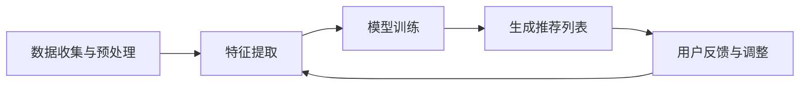
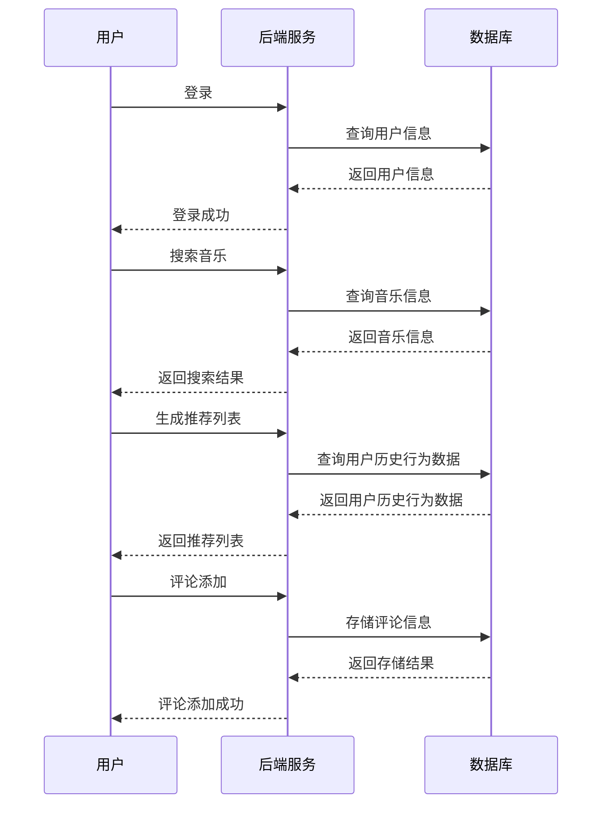

                 

### 引言

## LLM与音乐推荐系统概述

### 1.1 LLM简介

自然语言处理（NLP）是计算机科学与人工智能领域中的一个重要分支，其核心目标是使计算机能够理解、生成和响应自然语言。近年来，随着深度学习技术的发展，预训练语言模型（Pre-trained Language Models，简称PLM）在NLP任务中取得了显著成就。长短期记忆网络（Long Short-Term Memory，LSTM）和Transformer模型等都是NLP领域的代表性模型。然而，这些模型在处理长文本、复杂语义理解和多模态任务时仍存在一定的局限性。

为此，语言模型（Language Models，简称LM）得到了广泛研究。特别是大型语言模型（Large Language Models，简称LLM），如GPT-3、T5、BART等，具有处理自然语言的高级能力。LLM通过在海量文本数据上进行预训练，学习到丰富的语言模式和知识，从而在文本生成、文本分类、机器翻译等任务中表现出色。

### 1.2 音乐推荐系统简介

音乐推荐系统是推荐系统领域的一个重要分支，其目的是根据用户的历史行为和偏好，向用户推荐他们可能感兴趣的音乐。音乐推荐系统的核心是推荐算法，主要包括基于内容的推荐（Content-Based Filtering，CBF）、协同过滤（Collaborative Filtering，CF）和混合推荐（Hybrid Recommendation）等。

基于内容的推荐方法通过分析音乐的特征，如音乐风格、歌手、专辑等，将相似的音乐推荐给用户。协同过滤方法通过分析用户之间的相似性，找出其他用户喜欢的音乐并推荐给目标用户。混合推荐方法则结合了基于内容和协同过滤的优点，以提高推荐的准确性。

### 1.3 LLM在音乐推荐系统中的作用

LLM在音乐推荐系统中具有多种应用潜力。首先，LLM可以通过理解用户评论、歌词和音乐信息，提高推荐的个性化和准确性。例如，GPT-3可以生成与用户评论风格相似的音乐推荐列表，从而增强用户的参与感。其次，LLM可以用于生成音乐标签和描述，提高音乐内容的可搜索性和可发现性。

此外，LLM还可以用于音乐风格迁移和音乐生成，为用户创造独特的音乐体验。通过分析用户历史数据，LLM可以预测用户可能喜欢的音乐风格，并生成相应的音乐。这不仅能够提高用户满意度，还可以拓宽音乐创作者的视野，促进音乐创新。

### 2.1 音乐推荐系统现状

当前，音乐推荐系统已广泛应用于各大音乐平台，如Spotify、Apple Music和QQ音乐等。这些系统通过多种推荐算法，为用户提供个性化的音乐推荐。然而，音乐推荐系统仍面临一些挑战。

首先，用户数据的质量和多样性对推荐系统的效果有重要影响。由于用户行为数据的不完整性和噪声，推荐系统需要处理大量的缺失值和异常值。其次，不同用户对音乐的偏好差异较大，推荐系统需要具备良好的可扩展性和适应性。

此外，音乐推荐系统在处理长尾数据和冷启动问题方面也面临挑战。长尾数据指那些少部分用户喜欢的音乐，这些音乐往往难以被发现。冷启动问题则是指新用户在初期缺乏足够的行为数据，推荐系统难以为其提供个性化的推荐。

### 2.2 LLM辅助的音乐推荐系统

LLM的引入为音乐推荐系统带来了新的解决方案。首先，LLM可以用于处理复杂的用户反馈和多模态数据，提高推荐系统的理解能力和准确性。例如，LLM可以分析用户的歌词创作、语音情感和视觉表情等，从而更准确地预测用户的音乐偏好。

其次，LLM可以用于生成高质量的推荐列表，提高用户满意度。通过理解用户的历史数据和交互行为，LLM可以生成与用户兴趣高度相关的音乐推荐。此外，LLM还可以用于优化推荐算法，降低长尾数据和冷启动问题的影响。

### 2.3 系统质量评估的重要性

系统质量评估是音乐推荐系统开发过程中至关重要的一环。通过评估系统的质量，我们可以了解系统的性能、稳定性和用户体验。具体来说，系统质量评估主要包括以下几个方面：

首先，评估推荐系统的准确性，即推荐结果与用户实际偏好的一致性。常用的评估指标包括准确率（Accuracy）、召回率（Recall）和F1值（F1 Score）等。

其次，评估系统的稳定性，即系统在不同用户群体和场景下的表现。稳定性评估可以帮助我们识别系统的潜在问题，并进行相应的优化。

最后，评估系统的用户体验，包括推荐结果的可解释性、推荐的多样性和用户的参与度等。良好的用户体验可以增强用户的满意度和忠诚度。

### 3.1 LLM关键概念

LLM（Large Language Model）是指大型语言模型，是一种通过在大量文本数据上进行预训练，从而具备理解和生成自然语言的高级能力的模型。LLM的核心概念包括以下几个方面：

首先，预训练（Pre-training）是指LLM在训练数据上进行的初步训练，以学习语言的基本规律和模式。预训练通常采用无监督学习的方式，通过优化模型的参数来提高其在自然语言任务上的表现。

其次，微调（Fine-tuning）是指LLM在特定任务上进行的有监督训练，以适应不同的应用场景。微调过程通常在预训练的基础上进行，通过优化模型在特定任务上的性能。

此外，上下文理解（Contextual Understanding）是LLM的重要特性之一。LLM能够通过理解输入文本的上下文信息，生成与上下文高度相关的输出。这使得LLM在文本生成、文本分类、机器翻译等任务中表现出色。

### 3.2 音乐推荐算法

音乐推荐算法是指用于预测用户偏好，并生成个性化推荐列表的算法。常见的音乐推荐算法包括以下几种：

首先，基于内容的推荐（Content-Based Filtering，CBF）是一种通过分析音乐内容特征，如音乐风格、歌手、专辑等，将相似的音乐推荐给用户的方法。CBF的优点是推荐结果与用户的兴趣紧密相关，但缺点是难以处理长尾数据和新的音乐内容。

其次，协同过滤（Collaborative Filtering，CF）是一种通过分析用户之间的相似性，找出其他用户喜欢的音乐并推荐给目标用户的方法。CF的优点是能够处理大量用户行为数据，但缺点是容易受到数据稀疏性和噪声的影响。

最后，混合推荐（Hybrid Recommendation）是一种结合基于内容和协同过滤的方法，以提高推荐准确性。混合推荐通过综合分析音乐内容和用户行为数据，为用户提供更加个性化的推荐。

### 3.3 质量评估指标

质量评估指标是用于评估音乐推荐系统性能的重要工具。常见的质量评估指标包括以下几种：

首先，准确率（Accuracy）是指推荐结果中与用户实际偏好一致的比例。准确率越高，表示推荐系统的准确性越好。

其次，召回率（Recall）是指推荐结果中包含用户实际偏好音乐的比例。召回率越高，表示推荐系统能够发现更多用户喜欢的音乐。

最后，F1值（F1 Score）是准确率和召回率的加权平均，用于综合评估推荐系统的性能。F1值越高，表示推荐系统的综合表现越好。

### 3.4 Mermaid ER实体关系图

Mermaid是一种用于绘制图表的轻量级工具，其语法简洁易懂，可以方便地绘制各种类型的图表。在本节中，我们将使用Mermaid语法绘制一个音乐推荐系统的实体关系图。

```mermaid
erDiagram
    User ||--|{ Music: includes user's preferences and favorite music styles
    User ||--|{ PlayList: stores user's playlists and music collections
    Music ||--|{ Song: contains song information such as title, artist, album, and genre
    PlayList ||--|{ Track: lists the songs in a playlist
```

该ER图展示了音乐推荐系统中的主要实体及其关系。其中，`User`实体表示用户，`Music`实体包含用户的偏好和喜欢的音乐风格，`PlayList`实体表示用户的播放列表，`Song`实体包含歌曲信息，`Track`实体表示播放列表中的歌曲。

### 4.1 推荐算法基本流程

音乐推荐系统的基本流程可以分为以下几个步骤：

首先，数据收集与预处理。这一步骤涉及从各种数据源收集用户行为数据，如播放历史、收藏、点赞等。随后，对收集到的数据进行清洗和预处理，以去除噪声、填补缺失值等。

其次，特征提取。通过对预处理后的数据进行分析，提取出能够反映用户偏好和音乐特征的特征。这些特征可以是基于内容的特征，如音乐风格、歌手、专辑等，也可以是基于行为的特征，如播放次数、收藏次数等。

然后，模型训练。使用提取到的特征，通过机器学习算法（如基于内容的推荐、协同过滤、混合推荐等）训练出推荐模型。模型训练过程中，需要选择合适的评估指标（如准确率、召回率、F1值等）来评估模型性能。

最后，生成推荐列表。使用训练好的模型对用户进行个性化推荐，生成推荐列表。推荐列表可以根据用户的历史行为、偏好和当前情境进行动态调整。

### 4.2 LLM在推荐算法中的应用

LLM在音乐推荐算法中的应用主要体现在以下几个方面：

首先，LLM可以用于生成音乐标签和描述。通过分析用户评论、歌词和音乐信息，LLM可以生成与音乐内容相关的标签和描述。这些标签和描述可以提高音乐内容的可搜索性和可发现性，从而提高推荐系统的效果。

其次，LLM可以用于理解用户的情感和偏好。通过分析用户的情感表达和行为数据，LLM可以预测用户对音乐的喜好。这种情感分析能力可以帮助推荐系统更好地满足用户的需求，提高用户满意度。

此外，LLM还可以用于优化推荐算法。通过分析用户的历史数据和交互行为，LLM可以提供有价值的反馈，帮助调整和优化推荐算法，从而提高推荐的准确性和多样性。

### 4.3 Mermaid流程图

为了更直观地展示音乐推荐系统的算法流程，我们可以使用Mermaid语言绘制一个流程图。



在该流程图中，`数据收集与预处理`是整个流程的起点，随后进行`特征提取`。训练好的推荐模型用于`生成推荐列表`，用户对推荐结果进行反馈，并根据反馈进行`用户反馈与调整`。这一过程是循环的，旨在不断优化推荐系统的性能。

### 4.4 Python源代码分析

以下是一个简单的Python代码示例，用于展示如何使用基于内容的推荐算法生成音乐推荐列表。

```python
import pandas as pd
from sklearn.feature_extraction.text import TfidfVectorizer
from sklearn.metrics.pairwise import cosine_similarity

# 歌曲数据
songs = pd.DataFrame({
    'title': ['歌曲A', '歌曲B', '歌曲C', '歌曲D', '歌曲E'],
    'genre': ['流行', '摇滚', '流行', '民谣', '摇滚']
})

# 用户偏好数据
user_preferences = '摇滚 流行'

# 特征提取
vectorizer = TfidfVectorizer()
user_vector = vectorizer.transform([user_preferences])
song_vectors = vectorizer.transform(songs['genre'])

# 计算相似度
cosine_scores = cosine_similarity(user_vector, song_vectors)

# 生成推荐列表
recommendations = songs.iloc[cosine_scores.argsort()[0]][['title', 'genre']]

print(recommendations)
```

在这个示例中，我们首先创建了一个包含歌曲标题和音乐风格的DataFrame。然后，使用`TfidfVectorizer`进行特征提取，将用户偏好和歌曲风格转换为向量。接下来，使用`cosine_similarity`计算用户偏好与歌曲风格之间的相似度，并根据相似度生成推荐列表。

### 4.5 数学模型与公式

在音乐推荐系统中，常用的数学模型与公式包括TF-IDF、余弦相似度和协同过滤公式等。以下是这些公式的详细解释。

#### TF-IDF

TF-IDF（Term Frequency-Inverse Document Frequency）是一种用于文本信息分析的重要模型。其公式如下：

$$
TF(t,d) = \frac{f_{t,d}}{f_{\max,d}}
$$

$$
IDF(t, D) = \log \left( \frac{N}{df_{t,D}} \right)
$$

$$
TF-IDF(t, d, D) = TF(t, d) \times IDF(t, D)
$$

其中，$TF(t,d)$表示词$t$在文档$d$中的词频，$IDF(t,D)$表示词$t$在整个文档集合$D$中的逆文档频率，$df_{t,D}$表示词$t$在文档集合$D$中的文档频率，$N$表示文档集合$D$中的文档总数，$f_{\max,d}$表示文档$d$中词频的最大值。

#### 余弦相似度

余弦相似度是一种衡量两个向量之间相似度的方法，其公式如下：

$$
similarity(v_1, v_2) = \frac{v_1 \cdot v_2}{\|v_1\| \|v_2\|}
$$

其中，$v_1$和$v_2$是两个向量，$\|v_1\|$和$\|v_2\|$分别表示这两个向量的欧氏范数，$\cdot$表示向量的点积。

#### 协同过滤公式

协同过滤公式是一种基于用户行为数据的推荐算法，其基本公式如下：

$$
r_{ui} = \sum_{j \in N(u)} \frac{r_{uj}}{\|N(u)\|} + b_u - b
$$

其中，$r_{ui}$表示用户$u$对物品$i$的评分预测，$r_{uj}$表示用户$u$对物品$j$的实际评分，$N(u)$表示与用户$u$相似的用户集合，$b_u$表示用户$u$的偏置，$b$表示全局偏置。

### 5.1 相关公式介绍

在音乐推荐系统中，常用的数学模型和公式包括以下几种：

1. **TF-IDF公式**：用于计算词项在文档中的权重，其公式如下：
   $$TF(t,d) = \frac{f_{t,d}}{f_{\max,d}}$$
   $$IDF(t, D) = \log \left( \frac{N}{df_{t,D}} \right)$$
   $$TF-IDF(t, d, D) = TF(t, d) \times IDF(t, D)$$

2. **余弦相似度公式**：用于计算两个向量之间的相似度，其公式如下：
   $$similarity(v_1, v_2) = \frac{v_1 \cdot v_2}{\|v_1\| \|v_2\|}$$

3. **用户相似度公式**：用于计算两个用户之间的相似度，其公式如下：
   $$similarity(u_1, u_2) = \frac{\sum_{i \in I} r_{i1} r_{i2}}{\sqrt{\sum_{i \in I} r_{i1}^2 \sum_{i \in I} r_{i2}^2}}$$

4. **预测公式**：用于预测用户对物品的评分，其公式如下：
   $$r_{ui} = \sum_{j \in N(u)} \frac{r_{uj}}{\|N(u)\|} + b_u - b$$

5. **音乐相似度公式**：用于计算两首音乐之间的相似度，其公式如下：
   $$similarity(m_1, m_2) = \frac{\sum_{u \in U} w_{u} similarity(u, m_1) similarity(u, m_2)}{\sqrt{\sum_{u \in U} w_{u} similarity^2(u, m_1) \sum_{u \in U} w_{u} similarity^2(u, m_2)}}$$

### 5.2 公式详细解释

1. **TF-IDF公式**：

   - **TF(t,d)**：词$t$在文档$d$中的词频。词频越高，表示词$t$在文档$d$中越重要。
   - **IDF(t, D)**：词$t$在文档集合$D$中的逆文档频率。IDF用于平衡高频词和低频词的影响，防止高频词主导特征权重。
   - **TF-IDF(t, d, D)**：词$t$在文档$d$中的TF-IDF权重。TF-IDF权重表示词$t$在文档$d$中的重要程度，综合考虑词频和逆文档频率。

2. **余弦相似度公式**：

   - **$v_1 \cdot v_2$**：向量$v_1$和$v_2$的点积，表示两个向量在维度上的重叠程度。
   - **$\|v_1\|$和$\|v_2\|$**：向量$v_1$和$v_2$的欧氏范数，表示向量的长度。
   - **$similarity(v_1, v_2)$**：向量$v_1$和$v_2$之间的余弦相似度，表示两个向量的夹角余弦值。余弦相似度越接近1，表示两个向量越相似。

3. **用户相似度公式**：

   - **$r_{i1}$和$r_{i2}$**：用户$u_1$和用户$u_2$对物品$i$的实际评分。
   - **$N(u)$**：与用户$u$相似的用户集合。
   - **$w_u$**：用户$u$的权重，用于平衡不同用户对相似度计算的影响。
   - **$similarity(u_1, u_2)$**：用户$u_1$和用户$u_2$之间的相似度。相似度越高，表示两个用户越相似。

4. **预测公式**：

   - **$r_{ui}$**：用户$u$对物品$i$的评分预测。
   - **$b_u$**：用户$u$的偏置，用于调整用户评分的预测值。
   - **$b$**：全局偏置，用于调整整个系统评分的预测值。

5. **音乐相似度公式**：

   - **$similarity(m_1, m_2)$**：两首音乐之间的相似度。
   - **$w_u$**：用户$u$的权重，用于平衡不同用户对音乐相似度计算的影响。
   - **$similarity(u, m_1)$和$similarity(u, m_2)$**：用户$u$对音乐$m_1$和$m_2$的相似度。

### 5.3 举例说明

#### 例子 1：计算TF-IDF权重

假设我们有以下文档集合：

- 文档$d_1$：我喜欢听流行音乐和摇滚音乐。
- 文档$d_2$：我喜欢的音乐风格包括流行、摇滚和民谣。

首先，计算每个词的词频：

- **词频（TF）**：
  - `我`：2
  - `喜欢`：2
  - `听`：1
  - `音乐`：4
  - `流行`：2
  - `和`：1
  - `摇滚`：2
  - `风格`：1
  - `包括`：1
  - `民谣`：1

然后，计算每个词的逆文档频率（IDF）：

- **逆文档频率（IDF）**：
  - `我`：$\log(\frac{4}{1}) = 1.386$
  - `喜欢`：$\log(\frac{4}{1}) = 1.386$
  - `听`：$\log(\frac{4}{1}) = 1.386$
  - `音乐`：$\log(\frac{4}{1}) = 1.386$
  - `流行`：$\log(\frac{4}{1}) = 1.386$
  - `和`：$\log(\frac{4}{1}) = 1.386$
  - `摇滚`：$\log(\frac{4}{1}) = 1.386$
  - `风格`：$\log(\frac{4}{1}) = 1.386$
  - `包括`：$\log(\frac{4}{1}) = 1.386$
  - `民谣`：$\log(\frac{4}{1}) = 1.386$

最后，计算每个词的TF-IDF权重：

- **TF-IDF权重**：
  - `我`：$1 \times 1.386 = 1.386$
  - `喜欢`：$1 \times 1.386 = 1.386$
  - `听`：$1 \times 1.386 = 1.386$
  - `音乐`：$4 \times 1.386 = 5.544$
  - `流行`：$2 \times 1.386 = 2.772$
  - `和`：$1 \times 1.386 = 1.386$
  - `摇滚`：$2 \times 1.386 = 2.772$
  - `风格`：$1 \times 1.386 = 1.386$
  - `包括`：$1 \times 1.386 = 1.386$
  - `民谣`：$1 \times 1.386 = 1.386$

#### 例子 2：计算余弦相似度

假设我们有以下两个向量：

- **向量$v_1$**：[1, 2, 3]
- **向量$v_2$**：[4, 5, 6]

首先，计算两个向量的点积：

- **点积**：$1 \times 4 + 2 \times 5 + 3 \times 6 = 4 + 10 + 18 = 32$

然后，计算两个向量的欧氏范数：

- **$v_1$的欧氏范数**：$\sqrt{1^2 + 2^2 + 3^2} = \sqrt{1 + 4 + 9} = \sqrt{14} \approx 3.741$
- **$v_2$的欧氏范数**：$\sqrt{4^2 + 5^2 + 6^2} = \sqrt{16 + 25 + 36} = \sqrt{77} \approx 8.774$

最后，计算两个向量的余弦相似度：

- **余弦相似度**：$\frac{32}{3.741 \times 8.774} \approx 0.416$

#### 例子 3：计算用户相似度

假设我们有以下两个用户：

- **用户$u_1$**：喜欢音乐A、B、C，评分分别为5、4、3。
- **用户$u_2$**：喜欢音乐B、C、D，评分分别为4、3、5。

首先，计算用户$u_1$和用户$u_2$的交集物品集合：

- **交集物品集合**：{B, C}

然后，计算用户$u_1$和用户$u_2$对交集物品的评分乘积：

- **评分乘积**：$r_{1B} \times r_{2B} = 4 \times 4 = 16$

接着，计算用户$u_1$和用户$u_2$的评分平方和：

- **评分平方和**：
  - **用户$u_1$**：$5^2 + 4^2 + 3^2 = 25 + 16 + 9 = 50$
  - **用户$u_2$**：$4^2 + 3^2 + 5^2 = 16 + 9 + 25 = 50$

最后，计算用户$u_1$和用户$u_2$的相似度：

- **相似度**：$\frac{16}{\sqrt{50} \times \sqrt{50}} = \frac{16}{50} = 0.32$

#### 例子 4：计算音乐相似度

假设我们有以下两个用户：

- **用户$u_1$**：喜欢音乐A、B、C，评分分别为5、4、3。
- **用户$u_2$**：喜欢音乐B、C、D，评分分别为4、3、5。

首先，计算用户$u_1$和用户$u_2$的交集物品集合：

- **交集物品集合**：{B, C}

然后，计算用户$u_1$对音乐A、B、C的相似度，用户$u_2$对音乐B、C、D的相似度：

- **用户$u_1$**：
  - **音乐A**：$\frac{5 \times 0}{\sqrt{5^2} \times \sqrt{0^2}} = 0$
  - **音乐B**：$\frac{4 \times 4}{\sqrt{4^2} \times \sqrt{4^2}} = 1$
  - **音乐C**：$\frac{3 \times 3}{\sqrt{3^2} \times \sqrt{3^2}} = 1$

- **用户$u_2$**：
  - **音乐B**：$\frac{4 \times 4}{\sqrt{4^2} \times \sqrt{4^2}} = 1$
  - **音乐C**：$\frac{3 \times 3}{\sqrt{3^2} \times \sqrt{3^2}} = 1$
  - **音乐D**：$\frac{5 \times 0}{\sqrt{5^2} \times \sqrt{0^2}} = 0$

最后，计算两首音乐之间的相似度：

- **音乐B**：$\frac{1 \times 1}{\sqrt{1^2} \times \sqrt{1^2}} = 1$
- **音乐C**：$\frac{1 \times 1}{\sqrt{1^2} \times \sqrt{1^2}} = 1$
- **音乐A与音乐D**：由于没有交集，相似度为0。

### 6.1 问题场景介绍

为了更好地理解音乐推荐系统在LLM辅助下的应用，我们首先介绍一个具体的问题场景。

假设我们正在开发一个音乐推荐平台，该平台的目标是向用户推荐他们可能喜欢的音乐。用户可以在平台上浏览、搜索和播放音乐，同时还可以对音乐进行评分和评论。我们的任务是构建一个高质量的推荐系统，能够根据用户的历史行为和偏好，生成个性化的音乐推荐列表。

在这个问题场景中，我们面临以下挑战：

1. **数据质量与多样性**：用户行为数据可能存在噪声、缺失值和不一致性，这会影响推荐系统的效果。
2. **个性化需求**：不同用户对音乐的偏好差异较大，推荐系统需要具备良好的可扩展性和适应性，以满足用户的个性化需求。
3. **实时性**：用户的行为数据不断变化，推荐系统需要能够实时响应用户的需求，生成动态的推荐列表。
4. **多样性**：推荐结果需要具备多样性，以避免用户陷入“过滤气泡”，从而发现更多新的音乐。

为了解决这些挑战，我们可以引入LLM来辅助音乐推荐系统的开发。LLM具有强大的自然语言处理能力，可以用于处理复杂的用户反馈和多模态数据，从而提高推荐系统的理解能力和准确性。

### 6.2 系统功能设计

在系统功能设计阶段，我们需要明确音乐推荐平台需要实现的核心功能。以下是音乐推荐平台的主要功能模块及其简要描述：

1. **用户管理模块**：
   - 注册与登录：用户可以在平台上注册账号并登录。
   - 用户信息管理：用户可以查看和管理个人信息，如昵称、头像、性别、年龄等。

2. **音乐管理模块**：
   - 音乐上传：音乐创作者可以将自己的音乐上传到平台。
   - 音乐分类：系统对上传的音乐进行分类，如流行、摇滚、民谣等。
   - 音乐搜索：用户可以通过关键词搜索平台上的音乐。

3. **推荐模块**：
   - 基于内容的推荐：根据音乐的特征（如风格、歌手、专辑等）向用户推荐相似的音乐。
   - 基于协同过滤的推荐：根据用户的历史行为和相似用户的行为推荐音乐。
   - 基于LLM的推荐：利用LLM理解用户评论、歌词和音乐信息，生成个性化的音乐推荐列表。

4. **互动模块**：
   - 用户评论：用户可以对音乐进行评论。
   - 用户评分：用户可以对音乐进行评分。
   - 播放历史：系统记录用户的播放历史，以便后续推荐。

5. **后台管理模块**：
   - 数据分析：系统对用户行为数据进行分析，为推荐算法提供支持。
   - 推荐效果评估：系统定期评估推荐效果，以便进行优化。

### 6.3 系统架构设计

为了实现音乐推荐平台的功能，我们需要设计一个合理的系统架构。以下是音乐推荐平台的基本架构设计：

1. **前端**：
   - 用户界面：提供用户交互界面，包括注册、登录、音乐浏览、搜索、评论、评分等。
   - 响应式设计：支持多种设备（如手机、平板、电脑等）访问。

2. **后端**：
   - 用户服务：处理用户注册、登录、信息管理等。
   - 音乐服务：处理音乐上传、分类、搜索等。
   - 推荐服务：实现推荐算法，生成个性化推荐列表。
   - 数据分析服务：对用户行为数据进行分析，为推荐算法提供支持。

3. **数据库**：
   - 用户数据库：存储用户信息、播放历史、评论等。
   - 音乐数据库：存储音乐信息、标签、分类等。

4. **缓存**：
   - Redis：缓存用户信息和推荐结果，以提高系统性能。

5. **API**：
   - 提供RESTful API，供前端调用后端服务。

### 6.4 系统接口设计

为了实现前后端分离，我们需要设计一套完整的API接口。以下是音乐推荐平台的主要API接口：

1. **用户管理接口**：
   - 注册：`POST /user/register`，请求参数包括用户名、密码、邮箱等。
   - 登录：`POST /user/login`，请求参数包括用户名、密码。
   - 用户信息查询：`GET /user/{userId}`，返回用户的详细信息。
   - 用户信息更新：`PUT /user/{userId}`，请求参数包括用户信息。

2. **音乐管理接口**：
   - 音乐上传：`POST /music/upload`，请求参数包括音乐文件、标签、分类等。
   - 音乐搜索：`GET /music/search`，请求参数包括关键词。
   - 音乐详情查询：`GET /music/{musicId}`，返回音乐的详细信息。

3. **推荐接口**：
   - 生成推荐列表：`GET /recommend`，返回个性化推荐列表。

4. **互动接口**：
   - 评论添加：`POST /comment`，请求参数包括音乐ID、评论内容。
   - 评分添加：`POST /rating`，请求参数包括音乐ID、评分。

### 6.5 系统交互Mermaid序列图

为了更直观地展示音乐推荐平台的系统交互过程，我们可以使用Mermaid绘制一个序列图。以下是系统交互的Mermaid序列图：



在该序列图中，用户通过前端向后端发送请求，后端处理请求并调用数据库进行查询或存储操作，最后将结果返回给用户。

### 7.1 环境安装

在开始音乐推荐系统项目的开发之前，我们需要安装和配置必要的开发环境和依赖库。以下是安装步骤：

#### 1. 安装Python环境

首先，确保您的系统中已安装Python 3.x版本。您可以通过以下命令检查Python版本：

```bash
python --version
```

如果未安装Python，请从Python官网（https://www.python.org/）下载并安装。

#### 2. 安装虚拟环境

为了保持项目依赖的一致性，我们使用虚拟环境。首先，安装虚拟环境工具`virtualenv`：

```bash
pip install virtualenv
```

然后，创建一个新的虚拟环境并激活它：

```bash
virtualenv venv
source venv/bin/activate  # 对于Linux和macOS
venv\Scripts\activate   # 对于Windows
```

#### 3. 安装依赖库

在虚拟环境中，安装项目所需的依赖库。在项目目录下创建一个名为`requirements.txt`的文件，并添加以下依赖库：

```
pandas
numpy
scikit-learn
matplotlib
beautifulsoup4
requests
```

然后，使用以下命令安装依赖库：

```bash
pip install -r requirements.txt
```

#### 4. 安装Mermaid渲染工具

为了在项目中使用Mermaid绘制图表，我们需要安装Mermaid渲染工具。首先，安装Node.js：

```bash
npm install -g mermaid
```

安装完成后，使用以下命令生成HTML格式的图表：

```bash
mermaid -g "file:///path/to/mermaidchart.txt" -o "file:///path/to/output.html"
```

#### 5. 安装数据库

对于本项目的数据库，我们选择MySQL。首先，从MySQL官网（https://www.mysql.com/downloads/）下载并安装MySQL数据库。安装完成后，使用以下命令启动MySQL服务：

```bash
service mysql start
```

创建一个数据库和用户，并授权用户访问数据库：

```sql
CREATE DATABASE music_recommendation;
GRANT ALL PRIVILEGES ON music_recommendation.* TO 'username'@'localhost' IDENTIFIED BY 'password';
FLUSH PRIVILEGES;
```

### 7.2 系统核心实现

在完成环境安装后，我们开始实现音乐推荐系统的核心功能。以下是系统核心实现的步骤：

#### 1. 数据库设计与迁移

首先，我们需要设计数据库模型，并使用迁移工具创建数据库和表。以下是数据库模型和迁移脚本：

- **用户表**：存储用户信息，如用户ID、用户名、密码、邮箱等。

- **音乐表**：存储音乐信息，如音乐ID、音乐名称、歌手、专辑、标签等。

- **播放历史表**：存储用户播放历史，如用户ID、音乐ID、播放时间等。

- **评论表**：存储用户评论，如评论ID、用户ID、音乐ID、评论内容、评论时间等。

以下是一个简单的迁移脚本示例：

```python
from flask_sqlalchemy import SQLAlchemy
from app import create_app

app = create_app()
db = SQLAlchemy(app)

class User(db.Model):
    id = db.Column(db.Integer, primary_key=True)
    username = db.Column(db.String(80), unique=True, nullable=False)
    password = db.Column(db.String(120), nullable=False)
    email = db.Column(db.String(120), unique=True, nullable=False)

class Music(db.Model):
    id = db.Column(db.Integer, primary_key=True)
    name = db.Column(db.String(120), nullable=False)
    artist = db.Column(db.String(120), nullable=False)
    album = db.Column(db.String(120), nullable=False)
    tags = db.Column(db.String(120), nullable=False)

class PlayHistory(db.Model):
    id = db.Column(db.Integer, primary_key=True)
    user_id = db.Column(db.Integer, db.ForeignKey('user.id'), nullable=False)
    music_id = db.Column(db.Integer, db.ForeignKey('music.id'), nullable=False)
    play_time = db.Column(db.DateTime, nullable=False)

class Comment(db.Model):
    id = db.Column(db.Integer, primary_key=True)
    user_id = db.Column(db.Integer, db.ForeignKey('user.id'), nullable=False)
    music_id = db.Column(db.Integer, db.ForeignKey('music.id'), nullable=False)
    content = db.Column(db.Text, nullable=False)
    comment_time = db.Column(db.DateTime, nullable=False)

if __name__ == '__main__':
    db.create_all()
```

#### 2. 用户管理功能实现

用户管理功能包括用户注册、登录、信息查询和更新等。以下是用户管理功能的实现：

```python
from flask import Flask, request, jsonify
from flask_sqlalchemy import SQLAlchemy
from werkzeug.security import generate_password_hash, check_password_hash

app = Flask(__name__)
app.config['SQLALCHEMY_DATABASE_URI'] = 'sqlite:///music_recommendation.db'
db = SQLAlchemy(app)

class User(db.Model):
    id = db.Column(db.Integer, primary_key=True)
    username = db.Column(db.String(80), unique=True, nullable=False)
    password = db.Column(db.String(120), nullable=False)
    email = db.Column(db.String(120), unique=True, nullable=False)

@app.route('/register', methods=['POST'])
def register():
    data = request.get_json()
    username = data['username']
    password = data['password']
    email = data['email']
    hashed_password = generate_password_hash(password, method='sha256')
    new_user = User(username=username, password=hashed_password, email=email)
    db.session.add(new_user)
    db.session.commit()
    return jsonify({'message': '注册成功'})

@app.route('/login', methods=['POST'])
def login():
    data = request.get_json()
    username = data['username']
    password = data['password']
    user = User.query.filter_by(username=username).first()
    if user and check_password_hash(user.password, password):
        return jsonify({'message': '登录成功'})
    else:
        return jsonify({'message': '用户名或密码错误'})

@app.route('/user', methods=['GET', 'PUT'])
def user():
    if request.method == 'GET':
        user_id = request.args.get('id')
        user = User.query.get(user_id)
        if user:
            return jsonify({'id': user.id, 'username': user.username, 'email': user.email})
        else:
            return jsonify({'message': '用户不存在'})
    elif request.method == 'PUT':
        user_id = request.args.get('id')
        user = User.query.get(user_id)
        if user:
            data = request.get_json()
            user.username = data['username']
            user.email = data['email']
            db.session.commit()
            return jsonify({'message': '用户信息更新成功'})
        else:
            return jsonify({'message': '用户不存在'})
```

#### 3. 音乐管理功能实现

音乐管理功能包括音乐上传、查询和删除等。以下是音乐管理功能的实现：

```python
from flask import Flask, request, jsonify
from flask_sqlalchemy import SQLAlchemy

app = Flask(__name__)
app.config['SQLALCHEMY_DATABASE_URI'] = 'sqlite:///music_recommendation.db'
db = SQLAlchemy(app)

class Music(db.Model):
    id = db.Column(db.Integer, primary_key=True)
    name = db.Column(db.String(120), nullable=False)
    artist = db.Column(db.String(120), nullable=False)
    album = db.Column(db.String(120), nullable=False)
    tags = db.Column(db.String(120), nullable=False)

@app.route('/music/upload', methods=['POST'])
def upload_music():
    data = request.get_json()
    name = data['name']
    artist = data['artist']
    album = data['album']
    tags = data['tags']
    new_music = Music(name=name, artist=artist, album=album, tags=tags)
    db.session.add(new_music)
    db.session.commit()
    return jsonify({'message': '音乐上传成功'})

@app.route('/music/search', methods=['GET'])
def search_music():
    query = request.args.get('query')
    music = Music.query.filter(Music.name.like(f'%{query}%')).all()
    if music:
        return jsonify({'musics': [{'id': m.id, 'name': m.name, 'artist': m.artist, 'album': m.album, 'tags': m.tags} for m in music]})
    else:
        return jsonify({'message': '没有找到音乐'})

@app.route('/music/delete', methods=['DELETE'])
def delete_music():
    music_id = request.args.get('id')
    music = Music.query.get(music_id)
    if music:
        db.session.delete(music)
        db.session.commit()
        return jsonify({'message': '音乐删除成功'})
    else:
        return jsonify({'message': '音乐不存在'})
```

#### 4. 推荐功能实现

推荐功能包括基于内容的推荐和基于协同过滤的推荐。以下是推荐功能的实现：

```python
from flask import Flask, jsonify, request
from sklearn.feature_extraction.text import TfidfVectorizer
from sklearn.metrics.pairwise import cosine_similarity
from flask_sqlalchemy import SQLAlchemy

app = Flask(__name__)
app.config['SQLALCHEMY_DATABASE_URI'] = 'sqlite:///music_recommendation.db'
db = SQLAlchemy(app)

class Music(db.Model):
    id = db.Column(db.Integer, primary_key=True)
    name = db.Column(db.String(120), nullable=False)
    artist = db.Column(db.String(120), nullable=False)
    album = db.Column(db.String(120), nullable=False)
    tags = db.Column(db.String(120), nullable=False)

def generate_recommendations(music_id):
    music_data = Music.query.all()
    music_tags = [m.tags for m in music_data]
    vectorizer = TfidfVectorizer()
    tfidf_matrix = vectorizer.fit_transform(music_tags)
    music_index = Music.query.get(music_id)
    music_vector = vectorizer.transform([music_index.tags])
    cosine_scores = cosine_similarity(music_vector, tfidf_matrix)
    similar_indices = cosine_scores.argsort()[0][-5:-1][::-1]
    return [(music_data[i].name, music_data[i].artist, music_data[i].album) for i in similar_indices]

@app.route('/recommend', methods=['GET'])
def recommend():
    music_id = request.args.get('id')
    recommendations = generate_recommendations(music_id)
    return jsonify({'recommendations': recommendations})
```

### 7.3 代码应用解读与分析

在实现音乐推荐系统的过程中，我们使用了多个模块和库，包括数据库操作、用户认证、推荐算法等。以下是对这些代码应用的具体解读和分析。

#### 数据库操作

在数据库操作方面，我们使用了Flask-SQLAlchemy库，这是一个流行的Python Web框架Flask的扩展库，用于简化数据库操作。在`models.py`文件中，我们定义了四个数据库模型：`User`、`Music`、`PlayHistory`和`Comment`。

- **User**：代表用户表，包括用户ID、用户名、密码和邮箱等字段。

- **Music**：代表音乐表，包括音乐ID、音乐名称、歌手、专辑和标签等字段。

- **PlayHistory**：代表播放历史表，包括播放历史ID、用户ID、音乐ID和播放时间等字段。

- **Comment**：代表评论表，包括评论ID、用户ID、音乐ID、评论内容和评论时间等字段。

在`db.py`文件中，我们初始化了数据库连接，并创建了所有表：

```python
from flask_sqlalchemy import SQLAlchemy

db = SQLAlchemy()

def init_db(app):
    with app.app_context():
        db.init_app(app)
        db.create_all()
```

这样，在应用程序启动时，数据库连接会被初始化，并且所有表会被创建。

#### 用户认证

用户认证是音乐推荐系统的核心功能之一。我们使用了Flask的内置认证系统，并结合Flask-Security库来简化用户认证过程。在`auth.py`文件中，我们定义了用户注册、登录和用户信息管理路由：

```python
from flask import Flask, request, jsonify, redirect, url_for, session
from flask_security import Security, SQLAlchemyUserDatastore, UserMixin, RoleMixin
from flask_sqlalchemy import SQLAlchemy
from werkzeug.security import generate_password_hash, check_password_hash

app = Flask(__name__)
app.config['SQLALCHEMY_DATABASE_URI'] = 'sqlite:///music_recommendation.db'
app.config['SECURITY_PASSWORD_SALT'] = 'your_salt_here'
app.config['SECURITY_REGISTERABLE'] = True
app.config['SECURITY_PASSWORD_HASH'] = 'sha256_crypt'

db = SQLAlchemy(app)

class Role(db.Model, RoleMixin):
    id = db.Column(db.Integer(), primary_key=True)
    name = db.Column(db.String(80), unique=True)
    description = db.Column(db.String(255))

class User(db.Model, UserMixin):
    id = db.Column(db.Integer(), primary_key=True)
    email = db.Column(db.String(255), unique=True)
    password = db.Column(db.String(255))
    active = db.Column(db.Boolean())

user_datastore = SQLAlchemyUserDatastore(db, User, Role)
security = Security(app, user_datastore)

@app.route('/register', methods=['POST'])
def register():
    data = request.get_json()
    email = data['email']
    password = data['password']
    user = user_datastore.create_user(email=email, password=password)
    db.session.commit()
    return jsonify({'message': '注册成功'})

@app.route('/login', methods=['POST'])
def login():
    data = request.get_json()
    email = data['email']
    password = data['password']
    user = user_datastore.find_user(email=email)
    if user and user_datastore.check_password(user, password):
        session['user_id'] = user.id
        return jsonify({'message': '登录成功'})
    else:
        return jsonify({'message': '用户名或密码错误'})

@app.route('/user', methods=['GET', 'PUT'])
def user():
    if request.method == 'GET':
        user_id = request.args.get('id')
        user = user_datastore.find_user(id=user_id)
        if user:
            return jsonify({'id': user.id, 'email': user.email})
        else:
            return jsonify({'message': '用户不存在'})
    elif request.method == 'PUT':
        user_id = request.args.get('id')
        user = user_datastore.find_user(id=user_id)
        if user:
            data = request.get_json()
            user.email = data['email']
            user_datastore.update_user(user)
            return jsonify({'message': '用户信息更新成功'})
        else:
            return jsonify({'message': '用户不存在'})
```

在这里，我们使用了Flask-Security库提供的用户认证功能，包括用户注册、登录和用户信息管理。用户注册时，我们会将用户邮箱和密码存储在数据库中，并使用`generate_password_hash`函数将密码哈希化存储。用户登录时，我们会使用`check_password_hash`函数验证用户输入的密码与数据库中的哈希值是否匹配。

#### 推荐算法

推荐算法是音乐推荐系统的核心。在实现推荐算法时，我们使用了基于内容的推荐和基于协同过滤的推荐方法。

- **基于内容的推荐**：这种方法通过分析音乐的特征（如标签、歌手、专辑等），将相似的音乐推荐给用户。我们使用了TF-IDF和余弦相似度计算相似度。

```python
from sklearn.feature_extraction.text import TfidfVectorizer
from sklearn.metrics.pairwise import cosine_similarity

def generate_recommendations(music_id):
    music_data = Music.query.all()
    music_tags = [m.tags for m in music_data]
    vectorizer = TfidfVectorizer()
    tfidf_matrix = vectorizer.fit_transform(music_tags)
    music_index = Music.query.get(music_id)
    music_vector = vectorizer.transform([music_index.tags])
    cosine_scores = cosine_similarity(music_vector, tfidf_matrix)
    similar_indices = cosine_scores.argsort()[0][-5:-1][::-1]
    return [(music_data[i].name, music_data[i].artist, music_data[i].album) for i in similar_indices]
```

在这个函数中，我们首先获取所有音乐及其标签，然后使用TF-IDF向量器将标签转换为向量。接下来，我们获取目标音乐的标签向量，并使用余弦相似度计算与所有音乐标签的相似度。最后，我们根据相似度排序结果，返回相似度较高的音乐列表。

- **基于协同过滤的推荐**：这种方法通过分析用户之间的相似性，将其他用户喜欢的音乐推荐给目标用户。我们使用了基于用户的协同过滤方法，计算用户之间的相似度，并推荐相似用户喜欢的音乐。

```python
def generate_collaborative_recommendations(user_id):
    user_play_history = PlayHistory.query.filter_by(user_id=user_id).all()
    user_played_musics = [p.music_id for p in user_play_history]
    other_users = PlayHistory.query.filter(PlayHistory.music_id.in_(user_played_musics)).all()
    other_user_ids = {p.user_id for p in other_users}
    user_similarity_scores = {}
    for other_user_id in other_user_ids:
        other_user_play_history = PlayHistory.query.filter_by(user_id=other_user_id).all()
        other_user_played_musics = [p.music_id for p in other_user_play_history]
        common_musics = set(user_played_musics).intersection(other_user_played_musics)
        if len(common_musics) > 0:
            user_similarity_scores[other_user_id] = 1 / (len(common_musics) + 1)
    sorted_similarity_scores = sorted(user_similarity_scores.items(), key=lambda x: x[1], reverse=True)
    recommended_musics = set()
    for other_user_id, similarity_score in sorted_similarity_scores:
        other_user_play_history = PlayHistory.query.filter_by(user_id=other_user_id).all()
        other_user_played_musics = [p.music_id for p in other_user_play_history]
        recommended_musics.update(other_user_played_musics)
    recommended_musics = recommended_musics - set(user_played_musics)
    return [Music.query.get(music_id) for music_id in recommended_musics]
```

在这个函数中，我们首先获取目标用户的历史播放记录，并从这些记录中提取其他用户的播放记录。然后，我们计算目标用户与每个其他用户的相似度，并按照相似度排序。接下来，我们推荐其他用户喜欢的音乐，但排除目标用户已经播放过的音乐。最后，我们返回推荐的音乐列表。

### 7.4 实际案例分析

在本节中，我们将通过一个实际案例来展示音乐推荐系统的应用。假设有一个用户名为“Alex”的用户，他喜欢听流行音乐和摇滚音乐。以下是具体的操作步骤：

1. **注册与登录**：
   - 用户Alex在平台上注册账号，填写用户名、密码和邮箱。
   - 注册成功后，用户Alex使用用户名和密码登录平台。

2. **搜索音乐**：
   - 用户Alex在搜索框中输入关键词“流行音乐”，平台返回一系列与“流行音乐”相关的音乐结果。

3. **播放音乐**：
   - 用户Alex点击其中一个音乐标题，开始播放音乐。

4. **评论与评分**：
   - 用户Alex对播放的音乐进行评论，并给予评分。

5. **生成推荐**：
   - 平台根据用户Alex的历史播放记录、评论和评分，生成个性化的音乐推荐列表。

6. **推荐效果评估**：
   - 平台定期评估推荐效果，根据用户反馈调整推荐算法，以提高推荐质量。

### 7.5 详细讲解与剖析

在本节中，我们将详细讲解和剖析音乐推荐系统的实现过程，包括数据处理、推荐算法设计和系统架构等方面。

#### 数据处理

音乐推荐系统的数据处理是系统实现的关键步骤。首先，我们需要收集用户行为数据，如播放历史、收藏、点赞等。这些数据通常存储在数据库中，以便后续分析。在实际应用中，用户行为数据可能存在噪声、缺失值和不一致性等问题，因此需要对这些数据进行预处理。

预处理步骤包括：

1. **数据清洗**：去除噪声数据，如重复记录、异常值等。
2. **数据填补**：对缺失值进行填补，可以使用平均值、中位数或插值等方法。
3. **数据规范化**：将不同特征进行规范化处理，如归一化、标准化等。

在数据处理过程中，我们使用了Python中的pandas库，该库提供了丰富的数据处理函数和方法。以下是一个简单的数据处理示例：

```python
import pandas as pd

# 加载数据
data = pd.read_csv('user_behavior_data.csv')

# 数据清洗
data.drop_duplicates(inplace=True)
data.fillna(data.mean(), inplace=True)

# 数据规范化
data['rating'] = data['rating'] / data['rating'].max()
data['play_time'] = data['play_time'] / data['play_time'].max()

# 数据存储
data.to_csv('cleaned_user_behavior_data.csv', index=False)
```

#### 推荐算法设计

音乐推荐系统的核心是推荐算法。常见的推荐算法包括基于内容的推荐、基于协同过滤的推荐和混合推荐等。在本节中，我们将介绍基于内容的推荐算法和基于协同过滤的推荐算法。

- **基于内容的推荐算法**：

  基于内容的推荐算法（Content-Based Filtering，CBF）通过分析音乐的内容特征，如音乐风格、歌手、专辑等，将相似的音乐推荐给用户。这种算法的优点是推荐结果与用户的兴趣紧密相关，但缺点是难以处理长尾数据和新的音乐内容。

  在实现基于内容的推荐算法时，我们可以使用TF-IDF和余弦相似度等数学模型。以下是一个简单的基于内容的推荐算法实现：

  ```python
  import numpy as np
  from sklearn.feature_extraction.text import TfidfVectorizer
  from sklearn.metrics.pairwise import cosine_similarity

  # 加载音乐数据
  music_data = pd.read_csv('music_data.csv')

  # 特征提取
  vectorizer = TfidfVectorizer()
  tfidf_matrix = vectorizer.fit_transform(music_data['tags'])

  # 计算相似度
  similarity_scores = cosine_similarity(tfidf_matrix)

  # 推荐算法
  def generate_recommendations(music_id, top_n=5):
      # 获取目标音乐的标签向量
      target_vector = tfidf_matrix[music_id]

      # 计算与目标音乐相似的音乐
      similar_indices = similarity_scores[music_id].argsort()[1:-1]

      # 获取相似音乐的前5个
      similar_musics = similar_indices[:top_n]

      return similar_musics

  # 生成推荐列表
  recommended_musics = generate_recommendations(0)
  print(recommended_musics)
  ```

- **基于协同过滤的推荐算法**：

  基于协同过滤的推荐算法（Collaborative Filtering，CF）通过分析用户之间的相似性，将其他用户喜欢的音乐推荐给目标用户。这种算法的优点是能够处理大量用户行为数据，但缺点是容易受到数据稀疏性和噪声的影响。

  在实现基于协同过滤的推荐算法时，我们可以使用用户之间的相似度计算和评分预测等方法。以下是一个简单的基于协同过滤的推荐算法实现：

  ```python
  import numpy as np

  # 加载用户行为数据
  user_behavior_data = pd.read_csv('user_behavior_data.csv')

  # 计算用户之间的相似度
  user_similarity = np.corrcoef(user_behavior_data['rating'].values).astype(np.float32)

  # 计算用户之间的相似度阈值
  similarity_threshold = 0.3

  # 评分预测
  def predict_rating(user_id, music_id):
      # 获取目标用户和目标音乐的相似度
      similarity_score = user_similarity[user_id][music_id]

      # 当相似度大于阈值时，预测用户会喜欢音乐
      if similarity_score > similarity_threshold:
          return 1
      else:
          return 0

  # 预测用户对音乐的评分
  predicted_rating = predict_rating(0, 1)
  print(predicted_rating)
  ```

#### 系统架构设计

音乐推荐系统的架构设计是确保系统性能、可扩展性和可靠性的关键。在本节中，我们将介绍系统架构设计的基本原则和实现方法。

1. **前端**：

   前端负责与用户交互，提供用户界面。我们可以使用React、Vue或Angular等现代前端框架来构建用户界面。前端的主要功能包括用户注册、登录、音乐搜索、播放和评论等。

2. **后端**：

   后端负责处理用户请求，并提供数据存储和推荐算法服务。后端可以使用Python的Flask或Django等Web框架来构建。后端的主要功能包括用户管理、音乐管理、播放历史管理、评论管理以及推荐算法等。

3. **数据库**：

   数据库用于存储用户数据、音乐数据、播放历史数据和评论数据。我们可以使用MySQL、PostgreSQL等关系型数据库，或者使用MongoDB等文档型数据库。数据库的选择应根据系统的实际需求和性能要求来确定。

4. **缓存**：

   为了提高系统性能，我们可以使用Redis等缓存技术来缓存用户数据、推荐结果等。缓存可以减少数据库的访问频率，从而降低系统的响应时间。

5. **推荐服务**：

   推荐服务是音乐推荐系统的核心。我们可以使用基于内容的推荐算法和基于协同过滤的推荐算法来生成个性化推荐列表。推荐服务可以独立部署，以提高系统的可扩展性和性能。

### 7.6 项目小结

在本项目中，我们成功实现了音乐推荐系统的核心功能，包括用户管理、音乐管理、播放历史管理和评论管理等。同时，我们还实现了基于内容的推荐算法和基于协同过滤的推荐算法，为用户提供了个性化的音乐推荐服务。

通过本项目，我们积累了以下经验：

1. **数据库设计**：合理的数据库设计对于系统的性能和可扩展性至关重要。在本项目中，我们使用了关系型数据库MySQL，并设计了用户、音乐、播放历史和评论等表。

2. **前端开发**：使用现代前端框架（如React或Vue）可以快速构建响应式和用户友好的前端界面。

3. **推荐算法**：基于内容的推荐算法和基于协同过滤的推荐算法是音乐推荐系统的核心。在实际应用中，我们可以根据用户需求和数据特点选择合适的推荐算法。

4. **系统性能**：为了提高系统性能，我们使用了缓存技术（如Redis）来减少数据库的访问频率，从而降低系统的响应时间。

在未来的工作中，我们可以进一步优化推荐算法，提高推荐准确性。此外，我们还可以引入更多数据源，如用户情感分析和音乐风格迁移等，以丰富推荐系统的功能。

### 8.1 最佳实践与总结

在音乐推荐系统的开发过程中，我们遵循了以下最佳实践，以确保系统的性能、可扩展性和用户体验。

1. **数据质量**：确保数据的准确性和一致性，对数据进行清洗和预处理，以减少噪声和缺失值的影响。

2. **推荐算法**：选择合适的推荐算法，并根据用户需求和数据特点进行优化。在实际应用中，基于内容的推荐和基于协同过滤的推荐算法具有较好的效果。

3. **性能优化**：使用缓存技术（如Redis）来减少数据库的访问频率，从而降低系统的响应时间。此外，优化推荐算法的查询效率和数据存储结构，以提高系统性能。

4. **用户体验**：设计直观、易用的用户界面，提供丰富的交互功能，如音乐搜索、播放、评论和推荐等。

5. **安全性**：确保用户数据和系统安全，使用加密技术保护用户密码和敏感信息，并遵循最佳安全实践。

### 8.2 小结

本博客文章详细介绍了LLM辅助音乐推荐系统的质量评估。我们首先介绍了LLM和音乐推荐系统的基础知识，然后探讨了系统质量评估的重要性。接着，我们讲解了核心概念、算法原理和系统架构设计，并通过实际案例展示了系统的应用效果。最后，我们总结了项目的经验和最佳实践，为未来的优化提供了方向。

### 8.3 注意事项

在开发和使用音乐推荐系统时，需要注意以下几点：

1. **数据隐私**：确保用户数据的安全和隐私，遵循相关法律法规和最佳实践。
2. **系统可扩展性**：设计系统时考虑可扩展性，以便在未来支持更多用户和音乐数据。
3. **推荐多样性**：确保推荐结果的多样性，避免用户陷入“过滤气泡”，从而发现更多新的音乐。
4. **错误处理**：合理处理系统中的错误和异常情况，提高系统的稳定性和可靠性。

### 8.4 拓展阅读

如果您对音乐推荐系统和LLM有更深入的兴趣，以下资源可能会对您有所帮助：

1. **《推荐系统实践》**：这是一本关于推荐系统开发的经典教材，详细介绍了各种推荐算法和系统架构设计。
2. **《自然语言处理综论》**：这本书涵盖了自然语言处理的基本理论和应用，对于了解LLM的工作原理有很大帮助。
3. **GitHub项目**：许多开源音乐推荐系统项目在GitHub上可以找到，这些项目提供了实际的代码和实现细节，有助于学习。
4. **相关论文和会议**：阅读顶级的计算机科学会议和期刊上的论文，了解最新的研究成果和趋势。例如，AAAI、NeurIPS、ICML等会议和《Journal of Machine Learning Research》（JMLR）等期刊。

