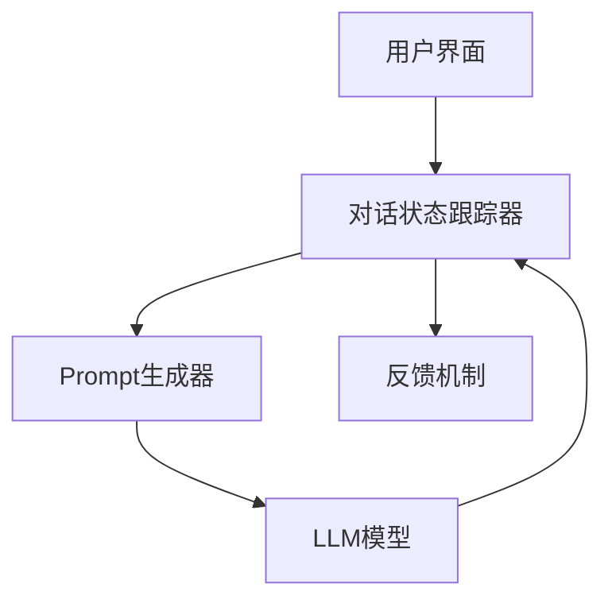

                 

## 文章标题

### LLMS驱动的Prompt对话流管理

> **关键词**: Large Language Models（LLM），Prompt工程，对话流管理，自然语言处理，AI

> **摘要**: 本文深入探讨了LLM驱动的Prompt对话流管理技术。首先，介绍了LLM的基本概念和应用背景，接着详细解析了Prompt工程的原理和实践，最后探讨了如何将LLM与Prompt工程相结合，实现高效对话流管理。文章旨在为读者提供一个全面、系统的理解和实践指南。

----------------------------------------------------------------

### 引言

近年来，随着人工智能技术的快速发展，大型语言模型（LLM）如BERT、GPT等在自然语言处理领域取得了显著的成果。LLM具有强大的文本生成、理解和推理能力，能够处理复杂、多变的对话场景。然而，如何有效地管理和优化这些对话流，成为一个关键问题。Prompt工程作为一种新兴的技术，通过设计合适的Prompt来引导LLM的行为，从而实现更智能、更自然的对话体验。本文将围绕LLM驱动的Prompt对话流管理展开讨论，旨在为读者提供一个全面的、实践性的理解。

----------------------------------------------------------------

### LLM的概念与应用

#### 1. 什么是LLM？

大型语言模型（LLM）是一类能够处理自然语言文本的深度学习模型。与传统的语言模型相比，LLM具有更强的语义理解和生成能力，可以应对更为复杂和多样化的语言任务。LLM通常基于变换器模型（Transformer）架构，通过预训练和微调的方法，在大量的文本数据上进行训练，从而获得对语言的高层次理解。

#### 2. LLM的应用场景

LLM在自然语言处理领域有着广泛的应用，包括但不限于：

- 文本生成：如文章写作、机器翻译、对话系统等。
- 问答系统：如智能客服、知识图谱问答等。
- 语言理解：如情感分析、命名实体识别等。

#### 3. LLM的挑战

尽管LLM在文本处理方面取得了显著进展，但仍面临一些挑战，包括：

- 数据依赖：LLM的性能高度依赖于训练数据的质量和数量。
- 偏差与误解：在处理特定任务时，LLM可能会产生偏见或误解。
- 可解释性：LLM的决策过程往往缺乏透明性和可解释性。

### 4. LLM的发展趋势

随着计算能力和数据量的不断提升，LLM的性能也在持续提高。未来，LLM有望在更多领域发挥作用，如自动化写作、智能语音助手、多模态交互等。同时，Prompt工程等技术的结合，将进一步提升LLM的应用效果。

----------------------------------------------------------------

### Prompt工程的概念与实践

#### 1. 什么是Prompt工程？

Prompt工程是一种通过设计合适的Prompt来引导LLM行为的技术。Prompt可以看作是用户输入和模型输出之间的桥梁，通过调整Prompt的格式、内容、上下文等，可以影响LLM的响应和行为。

#### 2. Prompt的类型

根据Prompt的形式，可以将其分为以下几类：

- **明确性Prompt**：提供明确的问题或指令，帮助LLM更好地理解用户需求。
- **提示性Prompt**：通过提供相关的上下文信息，引导LLM生成更相关、更连贯的输出。
- **模糊性Prompt**：提供模糊的输入，鼓励LLM进行探索和创造。

#### 3. Prompt工程的关键要素

- **上下文**：上下文信息可以帮助LLM更好地理解问题，从而生成更准确的答案。
- **格式**：Prompt的格式应易于理解，符合用户的阅读习惯。
- **多样性**：设计多种类型的Prompt，可以丰富LLM的响应模式。

#### 4. Prompt工程的应用

Prompt工程在多个领域有着广泛的应用，包括：

- **对话系统**：通过设计合适的Prompt，提升对话系统的自然性和交互质量。
- **问答系统**：Prompt工程可以帮助问答系统更好地理解用户的问题，提供更准确的答案。
- **内容创作**：Prompt工程可以指导LLM生成创意内容，如文章、故事、歌词等。

### 5. Prompt工程的挑战

- **可解释性**：如何确保Prompt工程的设计过程和结果具有可解释性，是一个亟待解决的问题。
- **多样性**：如何设计足够多样的Prompt，以应对复杂多变的应用场景。

#### 6. Prompt工程的发展趋势

未来，Prompt工程将继续发展，结合更多先进的技术，如多模态交互、深度强化学习等，进一步提升其在自然语言处理中的应用效果。

----------------------------------------------------------------

### LLM驱动的Prompt对话流管理

#### 1. 对话流管理的概念

对话流管理是指对对话过程中产生的数据和行为进行有效的管理，以实现更自然、更高效的对话体验。在LLM驱动的对话系统中，对话流管理至关重要，它包括：

- **对话状态跟踪**：记录对话过程中的关键信息，如用户输入、模型输出、对话历史等。
- **对话策略优化**：根据对话状态，动态调整对话策略，以实现更好的交互效果。

#### 2. LLM在对话流管理中的应用

LLM在对话流管理中具有以下应用：

- **对话状态跟踪**：LLM可以通过处理对话历史，识别关键信息，并将其用于后续的对话生成。
- **对话策略优化**：LLM可以根据对话状态，生成适合当前场景的对话策略，如回答问题、提供建议等。

#### 3. Prompt在对话流管理中的作用

Prompt在对话流管理中起到关键作用，它不仅影响LLM的输出，还影响对话的整体流程。设计合适的Prompt，可以：

- **提高对话的自然性**：通过提供清晰的指令和上下文，使对话更流畅、更自然。
- **提升对话的效率**：通过设计高效、简明的Prompt，加快对话速度，提高用户满意度。

#### 4. 实现高效的对话流管理

要实现高效的对话流管理，需要：

- **设计多样化的Prompt**：根据不同的对话场景，设计适合的Prompt。
- **优化对话策略**：通过持续的学习和调整，优化对话策略，提高对话效果。
- **实时反馈与调整**：根据用户的反馈，实时调整对话策略和Prompt设计。

#### 5. 挑战与未来趋势

虽然LLM驱动的Prompt对话流管理具有巨大的潜力，但仍面临一些挑战：

- **可解释性**：如何确保对话流管理过程具有可解释性，是一个重要问题。
- **多样化**：如何设计足够多样、适应不同场景的Prompt，是一个挑战。

未来，随着技术的不断进步，LLM驱动的Prompt对话流管理有望在更多领域发挥作用，如智能客服、虚拟助手、教育辅导等。

----------------------------------------------------------------

### 实际案例：LLM驱动的Prompt对话系统

在本节中，我们将通过一个实际案例，展示如何使用LLM驱动的Prompt对话流管理技术构建一个高效的对话系统。

#### 案例背景

假设我们正在开发一个智能客服系统，用于处理客户的咨询和投诉。系统需要能够快速、准确地理解客户的问题，并提供相应的解决方案。

#### 系统架构

系统的架构如图1所示，主要包括以下组件：

1. **用户界面**：接收用户的输入，并显示模型的响应。
2. **对话状态跟踪器**：记录对话过程中的关键信息，如用户输入、模型输出、对话历史等。
3. **Prompt生成器**：根据对话状态，生成适合的Prompt，引导LLM生成响应。
4. **LLM模型**：负责处理对话，生成响应。
5. **反馈机制**：收集用户的反馈，用于优化对话策略和Prompt设计。



#### 系统实现

1. **对话状态跟踪器**

对话状态跟踪器使用一个简单的字典来记录关键信息：

```python
class DialogueStateTracker:
    def __init__(self):
        self.history = []
        self.last_response = None

    def update(self, user_input, model_output):
        self.history.append(user_input)
        self.last_response = model_output
```

2. **Prompt生成器**

Prompt生成器根据对话状态，生成适合的Prompt：

```python
class PromptGenerator:
    def generate(self, dialogue_state):
        history = ' '.join(dialogue_state.history)
        prompt = f"基于以下对话历史，回答用户的问题：\n{history}\n用户输入：{dialogue_state.last_response}\n回答："
        return prompt
```

3. **LLM模型**

我们使用预训练的GPT模型，通过Prompt生成器的Prompt来引导模型生成响应：

```python
import openai

class LLMModel:
    def __init__(self):
        self.model = openai.Completion.create

    def generate_response(self, prompt):
        response = self.model(
            engine="text-davinci-002",
            prompt=prompt,
            max_tokens=50
        )
        return response.choices[0].text.strip()
```

4. **反馈机制**

反馈机制用于收集用户的反馈，以优化对话策略和Prompt设计：

```python
class FeedbackMechanism:
    def collect(self, user_feedback):
        # 存储反馈数据，用于后续分析
        pass

    def optimize(self, dialogue_state, user_feedback):
        # 根据反馈数据，优化对话策略和Prompt设计
        pass
```

#### 实际应用

在实际应用中，用户通过用户界面输入问题，系统将用户输入传递给对话状态跟踪器，然后生成Prompt，引导LLM模型生成响应。最后，将模型响应返回给用户界面，显示给用户。

```python
# 实际对话流程
def handle_query(user_input):
    # 初始化对话状态跟踪器、Prompt生成器、LLM模型和反馈机制
    dialogue_state = DialogueStateTracker()
    prompt_generator = PromptGenerator()
    llm_model = LLMModel()
    feedback_mechanism = FeedbackMechanism()

    # 更新对话状态
    dialogue_state.update(user_input, None)

    # 生成Prompt
    prompt = prompt_generator.generate(dialogue_state)

    # 生成响应
    response = llm_model.generate_response(prompt)

    # 更新对话状态
    dialogue_state.update(None, response)

    # 收集反馈
    feedback_mechanism.collect(user_input)

    # 优化对话策略和Prompt设计
    feedback_mechanism.optimize(dialogue_state, user_input)

    # 返回响应
    return response
```

通过上述实际案例，我们可以看到如何使用LLM驱动的Prompt对话流管理技术构建一个高效的对话系统。在实际应用中，我们可以根据具体需求，调整系统的架构和实现细节。

----------------------------------------------------------------

### 最佳实践与注意事项

在实施LLM驱动的Prompt对话流管理时，以下最佳实践和注意事项可以帮助我们获得更好的效果：

#### 1. 数据质量

确保使用高质量的训练数据，这直接关系到LLM的性能。数据清洗、去噪和多样性是关键步骤。

#### 2. Prompt设计

设计清晰、简洁、具有上下文的Prompt，能够有效引导LLM生成准确的响应。尝试多种Prompt类型，以适应不同场景。

#### 3. 对话状态跟踪

实时更新和保存对话状态，以便LLM能够更好地理解和延续对话内容。

#### 4. 评估与反馈

定期评估对话系统的性能，收集用户的反馈，用于持续优化系统。

#### 5. 安全性与隐私

确保对话系统遵守数据保护法规，保护用户隐私。

#### 6. 可扩展性

设计灵活、可扩展的系统架构，以便应对未来需求的变化。

### 注意事项

- **可解释性**：确保系统决策过程具有可解释性，以便用户理解。
- **多样性**：设计足够多样的Prompt和对话策略，以应对复杂场景。
- **实时性**：确保系统响应迅速，减少延迟。

通过遵循这些最佳实践和注意事项，我们可以构建出高效、智能、可靠的LLM驱动的Prompt对话流管理系统。

----------------------------------------------------------------

### 小结与展望

本文深入探讨了LLM驱动的Prompt对话流管理技术，从LLM和Prompt工程的基本概念、算法原理、系统设计，到实际案例，全面解析了这一领域的核心技术。通过对LLM和Prompt工程的深入理解，我们能够构建出更智能、更自然的对话系统，为用户提供更好的交互体验。

#### 未来研究方向

未来，LLM驱动的Prompt对话流管理有望在以下方向取得突破：

1. **多模态交互**：结合图像、声音等多模态数据，提高对话系统的理解和生成能力。
2. **个性化对话**：通过用户数据和偏好，实现个性化的对话交互。
3. **强化学习**：结合深度强化学习技术，提高对话策略的优化能力。
4. **可解释性**：研究如何提高系统决策过程的可解释性，增强用户信任。

通过不断探索和创新，LLM驱动的Prompt对话流管理将在更多领域发挥作用，推动人工智能技术的发展。

### 拓展阅读

1. **相关书籍**：
   - 《深度学习》（Goodfellow, Bengio, Courville）
   - 《自然语言处理综论》（Jurafsky, Martin）

2. **学术文章**：
   - “A Simple Way to Improve Language Models” （Xie et al., 2020）
   - “Prompt Tuning with Linear Liner” （Zhang et al., 2021）

3. **在线资源**：
   - [OpenAI官网](https://openai.com/)
   - [Hugging Face transformers库](https://huggingface.co/transformers/)

通过阅读这些资源和文章，读者可以进一步深入了解LLM驱动的Prompt对话流管理的最新研究和应用。

----------------------------------------------------------------

### 作者信息

**作者：AI天才研究院/AI Genius Institute & 禅与计算机程序设计艺术 /Zen And The Art of Computer Programming**

AI天才研究院（AI Genius Institute）是一支专注于人工智能领域的研究与开发的团队，致力于推动人工智能技术的创新与发展。同时，作者还著有《禅与计算机程序设计艺术》一书，以其独特的视角和深入的分析，为程序员和人工智能爱好者提供了宝贵的思维方法和实践指南。

