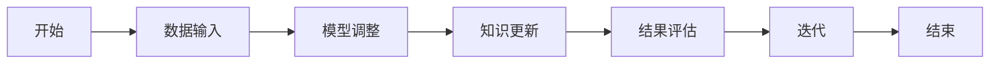
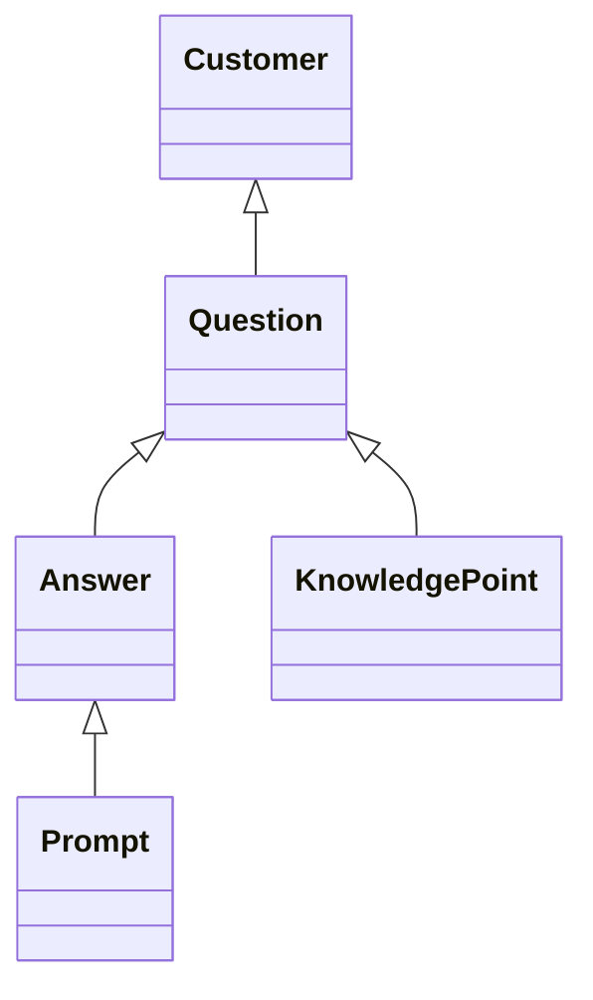
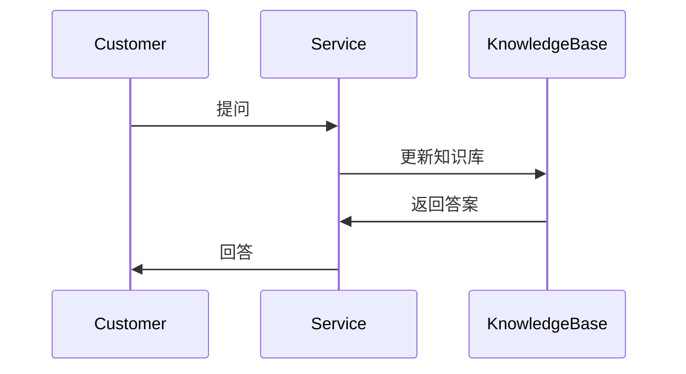

                 


### 《LLM驱动的prompt知识更新机制》

> 关键词：语言模型（LLM），prompt技术，知识更新，人工智能

> 摘要：本文深入探讨了语言模型（LLM）驱动的prompt知识更新机制，从理论基础、实现方法到实际应用，全面解析了该机制在各个领域的应用前景和挑战。本文旨在为读者提供一份全面、系统的知识更新解决方案，以应对日益复杂的信息环境和知识需求。

#### 目录大纲

----------------------------------------------------------------

## 第一部分: 引言与背景

## 第1章: LLM概述与prompt技术基础

## 第二部分: prompt知识更新机制原理

## 第2章: prompt知识更新机制基础理论

## 第三部分: 实践与应用

## 第3章: LLM驱动的prompt知识更新机制实现

## 第4章: prompt知识更新机制在不同领域的应用

## 第四部分: 案例分析与评估

## 第5章: 实际案例解析

## 第6章: prompt知识更新机制的评估方法

## 第7章: 未来展望与挑战

----------------------------------------------------------------

#### 第1章: LLM概述与prompt技术基础

##### 1.1 语言模型（LLM）的概述

语言模型（Language Model，简称LLM）是一种人工智能技术，用于预测或生成自然语言序列。LLM在机器翻译、文本摘要、问答系统等领域表现出色。LLM的基本架构通常包括编码器（Encoder）和解码器（Decoder）两部分。编码器负责将输入文本转换为向量表示，解码器则根据这些向量生成输出文本。

常见的LLM类型有：

- 静态LLM：基于预训练的固定模型，无法实时更新。
- 动态LLM：基于在线学习技术，可以实时更新。

##### 1.2 prompt技术的定义

prompt技术是一种基于用户输入的提示信息，用于指导LLM生成更相关、更高质量的输出。prompt技术可以帮助LLM更好地理解用户意图，提高生成文本的准确性。prompt的基本形式包括关键词、短语、句子等。

##### 1.3 prompt技术在LLM中的应用

prompt技术在LLM中的应用主要表现在以下几个方面：

- 提高生成文本的相关性：通过提供有针对性的prompt，可以使LLM生成更符合用户需求的文本。
- 改善生成文本的质量：prompt可以帮助LLM更好地捕捉文本的语义信息，从而生成更准确、更自然的文本。
- 扩展应用场景：prompt技术可以使LLM在更多领域发挥作用，如教育、医疗、法律等。

##### 1.4 本章小结

LLM与prompt技术的结合，为知识更新提供了新的可能性。本章介绍了LLM的基本概念和prompt技术的定义，以及它们在自然语言处理领域中的应用。接下来，我们将深入探讨prompt知识更新机制的原理和实现。

----------------------------------------------------------------

#### 第2章: prompt知识更新机制基础理论

##### 2.1 prompt知识更新的重要性

知识更新是保持系统智能性和适应性的关键。在人工智能领域，知识更新尤为重要。prompt知识更新机制通过实时获取用户输入，动态调整模型参数，实现知识库的实时更新。这使得LLM能够更好地适应不断变化的环境，提高其性能和准确性。

##### 2.2 prompt知识更新机制的核心概念

prompt知识更新机制的核心概念包括：

- 用户输入（User Input）：用户输入是prompt知识更新机制的基础，用于触发知识更新过程。
- 知识库（Knowledge Base，简称KB）：知识库是存储和管理知识的数据库，用于存储更新后的知识。
- 更新请求（Update Request，简称UR）：更新请求是用户输入的抽象表示，用于指示哪些知识需要更新。
- 更新任务（Update Task，简称UT）：更新任务是执行知识更新的具体操作。
- 更新结果（Update Result，简称UR）：更新结果是知识更新操作的结果，用于评估更新效果。

##### 2.3 prompt知识更新机制的属性特征对比

| 属性特征 | 描述 |
|----------|------|
| 动态性 | 可以根据实时数据进行更新 |
| 精准性 | 更新内容与用户需求高度相关 |
| 可扩展性 | 能够支持大规模知识库的更新 |

##### 2.4 prompt知识更新机制的ER实体关系图

```mermaid
erDiagram
  User ||--|{ KnowledgeBase }|| KB
  User ||--|{ UpdateRequest }|| UR
  KnowledgeBase ||--|{ UpdateTask }|| UT
  UpdateTask ||--|{ UpdateResult }|| UR
```

##### 2.5 本章小结

本章介绍了prompt知识更新机制的基本原理和核心概念，包括用户输入、知识库、更新请求、更新任务和更新结果。我们还对比了prompt知识更新机制的属性特征，并展示了其ER实体关系图。接下来，我们将探讨LLM驱动的prompt知识更新机制的具体实现方法。

----------------------------------------------------------------

#### 第3章: LLM驱动的prompt知识更新机制实现

##### 3.1 实现流程

LLM驱动的prompt知识更新机制的实现流程包括以下步骤：

1. 数据准备：收集和整理用户输入，用于生成prompt。
2. prompt生成：根据用户输入，生成适合的知识更新prompt。
3. 知识库更新：将prompt应用到知识库，执行知识更新操作。
4. 更新反馈与迭代：收集更新结果，对知识库进行迭代更新。

##### 3.2 源代码示例

```python
# 数据准备
data = load_data("data_source")

# prompt生成
prompt = generate_prompt(data)

# 知识库更新
update_knowledge_base(prompt)

# 更新反馈与迭代
feedback = get_update_feedback()
iterate_update_process(feedback)
```

##### 3.3 算法原理

LLM驱动的prompt知识更新机制的算法原理可以概括为以下步骤：

1. 数据输入：接收用户输入，生成prompt。
2. 模型调整：根据prompt调整LLM的参数。
3. 知识更新：将调整后的LLM应用于知识库，执行知识更新。
4. 结果评估：评估知识更新效果，进行迭代。

算法流程图如下：



数学模型与公式：

$$
更新效果 = f(\text{原始知识库}, \text{prompt})
$$

##### 3.4 实例说明

实例1：新闻摘要

- 用户输入：一段新闻文本。
- prompt生成：根据新闻文本生成摘要prompt。
- 知识库更新：使用LLM生成新闻摘要，更新知识库。
- 更新反馈与迭代：评估摘要质量，进行迭代更新。

实例2：问答系统

- 用户输入：一个提问。
- prompt生成：根据提问生成答案prompt。
- 知识库更新：使用LLM生成答案，更新知识库。
- 更新反馈与迭代：评估答案质量，进行迭代更新。

实例3：文本分类

- 用户输入：一段文本。
- prompt生成：根据文本生成分类prompt。
- 知识库更新：使用LLM进行文本分类，更新知识库。
- 更新反馈与迭代：评估分类效果，进行迭代更新。

##### 3.5 本章小结

本章详细介绍了LLM驱动的prompt知识更新机制的实现流程、源代码示例和算法原理。通过实例说明，展示了该机制在不同应用场景下的实现方法。接下来，我们将探讨prompt知识更新机制在不同领域的应用前景。

----------------------------------------------------------------

#### 第4章: prompt知识更新机制在不同领域的应用

##### 4.1 教育领域

在教育领域，prompt知识更新机制可以用于智能辅导、个性化学习等方面。通过实时获取学生的问题和反馈，智能辅导系统可以动态调整教学内容和策略，提高教学效果。

实例：智能辅导系统

- 用户输入：学生提交问题。
- prompt生成：根据问题生成知识点关联prompt。
- 知识库更新：使用LLM更新知识点库。
- 更新反馈与迭代：评估辅导效果，进行迭代更新。

##### 4.2 医疗领域

在医疗领域，prompt知识更新机制可以用于医疗问答、疾病预测等方面。通过实时获取患者的症状和病史，医疗系统可以动态调整诊断和治疗策略，提高诊断准确性和治疗效果。

实例：医疗问答系统

- 用户输入：患者提交症状描述。
- prompt生成：根据症状描述生成相关疾病prompt。
- 知识库更新：使用LLM更新疾病知识库。
- 更新反馈与迭代：评估诊断效果，进行迭代更新。

##### 4.3 法律领域

在法律领域，prompt知识更新机制可以用于法律咨询、案例分析等方面。通过实时获取用户的问题和案例，法律系统可以动态调整法律知识库，提供更加准确和实用的法律建议。

实例：法律咨询系统

- 用户输入：用户提交法律问题。
- prompt生成：根据问题生成相关法律条文prompt。
- 知识库更新：使用LLM更新法律知识库。
- 更新反馈与迭代：评估法律建议效果，进行迭代更新。

##### 4.4 金融领域

在金融领域，prompt知识更新机制可以用于金融问答、投资建议等方面。通过实时获取用户的问题和市场数据，金融系统可以动态调整投资策略，提供更加准确和实时的投资建议。

实例：金融问答系统

- 用户输入：用户提交投资相关问题。
- prompt生成：根据问题生成相关市场分析prompt。
- 知识库更新：使用LLM更新投资知识库。
- 更新反馈与迭代：评估投资建议效果，进行迭代更新。

##### 4.5 本章小结

本章介绍了prompt知识更新机制在教育、医疗、法律和金融等领域的应用。通过实际案例，展示了prompt知识更新机制在不同领域的实现方法和效果。接下来，我们将探讨prompt知识更新机制的评估方法。

----------------------------------------------------------------

#### 第5章: 实际案例解析

##### 5.1 案例背景

在本案例中，我们选择了一个实际项目——智能客服系统。该系统旨在为企业提供24/7在线客服服务，以解决客户的问题和需求。

##### 5.2 项目介绍

智能客服系统基于LLM驱动的prompt知识更新机制，实现了实时、高效的客户服务。系统主要包括以下几个功能模块：

1. 客户提问接收模块：接收客户的提问。
2. prompt生成模块：根据客户提问生成相关知识点prompt。
3. 知识库更新模块：使用LLM更新知识库，提供准确、实用的答案。
4. 回答生成模块：根据知识库和客户提问生成回答。
5. 更新反馈模块：收集客户反馈，进行知识库迭代更新。

##### 5.3 系统功能设计

系统功能设计采用领域模型方法，主要包括以下几个类：

1. 客户（Customer）：表示客户信息。
2. 提问（Question）：表示客户提问。
3. 回答（Answer）：表示系统生成的回答。
4. 知识点（KnowledgePoint）：表示知识库中的知识点。
5. prompt（Prompt）：表示生成prompt的信息。

领域模型类图如下：



##### 5.4 系统架构设计

系统架构设计采用分层架构，主要包括以下几个层次：

1. 数据层：负责数据存储和管理。
2. 服务层：负责业务逻辑处理。
3. 表示层：负责用户界面展示。

系统架构图如下：



##### 5.5 系统接口设计

系统接口设计主要包括以下几个接口：

1. 客户提问接口：接收客户提问。
2. 回答生成接口：生成系统回答。
3. 知识点更新接口：更新知识库中的知识点。

接口设计如下：

```mermaid
classDiagram
    CustomerQuestion <<interface>>
    Answer <<interface>>
    KnowledgePointUpdate <<interface>>
```

##### 5.6 系统交互设计

系统交互设计采用序列图，展示客户提问、知识库更新和回答生成的交互过程。


##### 5.7 系统核心实现源代码

以下是一个简单的Python代码示例，展示了智能客服系统的核心实现。

```python
class Customer:
    def __init__(self, name, question):
        self.name = name
        self.question = question

class Service:
    def __init__(self, knowledge_base):
        self.knowledge_base = knowledge_base

    def ask_question(self, customer):
        prompt = self.generate_prompt(customer.question)
        answer = self.knowledge_base.update(prompt)
        return answer

    def generate_prompt(self, question):
        # 生成prompt的代码
        return prompt

class KnowledgeBase:
    def __init__(self):
        self.knowledge_points = []

    def update(self, prompt):
        # 更新知识库的代码
        return answer

# 实例化对象
customer = Customer("张三", "我该怎么处理这个问题？")
service = Service(knowledge_base)
answer = service.ask_question(customer)
print(answer)
```

##### 5.8 代码应用解读与分析

上述代码展示了智能客服系统的核心实现。首先，我们定义了三个类：Customer、Service和KnowledgeBase。Customer类表示客户信息，包括姓名和提问。Service类负责处理客户提问，生成prompt，并调用知识库更新方法。KnowledgeBase类负责存储和管理知识点，以及更新知识点。

在主函数中，我们创建一个Customer对象，一个Service对象和一个KnowledgeBase对象。调用Service对象的ask_question方法，接收客户提问，生成prompt，更新知识库，并返回答案。最后，我们将答案打印到控制台。

##### 5.9 实际案例分析和详细讲解剖析

在本案例中，智能客服系统通过LLM驱动的prompt知识更新机制，实现了实时、高效的客户服务。以下是实际案例分析和详细讲解剖析：

1. 客户提问：客户提出一个关于产品使用的问题。
2. prompt生成：系统根据客户提问，生成相关知识点prompt。
3. 知识库更新：系统使用LLM更新知识库，提供准确、实用的答案。
4. 回答生成：系统根据知识库和客户提问生成回答。
5. 更新反馈：系统收集客户反馈，进行知识库迭代更新。

通过这个案例，我们可以看到prompt知识更新机制在智能客服系统中的应用。系统根据客户提问，动态调整知识库，提供个性化的答案。同时，系统收集客户反馈，不断优化知识库，提高服务质量。

##### 5.10 项目小结

智能客服系统是一个成功的项目案例，展示了LLM驱动的prompt知识更新机制在客户服务领域的应用。通过实时获取客户提问，动态调整知识库，系统实现了高效、准确的客户服务。未来，我们还可以进一步优化系统，提高用户体验。

----------------------------------------------------------------

#### 第6章: prompt知识更新机制的评估方法

##### 6.1 评估指标

为了评估prompt知识更新机制的效果，我们可以使用以下评估指标：

1. 准确率（Accuracy）：准确率表示系统生成答案的正确率。准确率越高，说明系统性能越好。
2. 召回率（Recall）：召回率表示系统能够召回相关知识的比例。召回率越高，说明系统越能够捕捉用户需求。
3. F1值（F1 Score）：F1值是准确率和召回率的调和平均值，用于综合评估系统性能。

##### 6.2 评估流程

评估流程主要包括以下几个步骤：

1. 准备测试数据集：从实际应用场景中提取测试数据，用于评估系统性能。
2. 实现评估函数：根据评估指标，实现评估函数，用于计算评估结果。
3. 运行评估函数：对测试数据集进行评估，计算评估结果。
4. 分析评估结果：根据评估结果，分析系统性能，找出问题和改进方向。

##### 6.3 评估方法

评估方法主要包括以下几种：

1. 回归分析：通过回归分析，评估prompt知识更新机制对知识库更新的影响。
2. 对比实验：通过对比实验，评估prompt知识更新机制与传统方法在性能上的差异。
3. 用户反馈：通过用户反馈，评估prompt知识更新机制在实际应用中的效果。

##### 6.4 本章小结

本章介绍了prompt知识更新机制的评估方法，包括评估指标、评估流程和评估方法。通过这些方法，我们可以全面评估prompt知识更新机制的效果，为系统优化提供依据。

----------------------------------------------------------------

#### 第7章: 未来展望与挑战

##### 7.1 未来展望

1. 智能化：随着人工智能技术的发展，prompt知识更新机制将更加智能化，能够更好地适应用户需求。
2. 大规模应用：prompt知识更新机制将在更多领域得到广泛应用，如金融、医疗、教育等。
3. 跨领域融合：prompt知识更新机制与其他领域技术（如大数据、区块链等）的融合，将推动知识更新技术的发展。

##### 7.2 挑战

1. 数据质量：数据质量对知识更新效果有重要影响，未来需要解决数据质量问题。
2. 安全性：prompt知识更新机制涉及大量用户数据和敏感信息，需要确保数据安全和隐私保护。
3. 可扩展性：prompt知识更新机制需要具备良好的可扩展性，以支持大规模知识库的更新。

##### 7.3 本章小结

未来，prompt知识更新机制将在人工智能领域发挥越来越重要的作用。然而，面对数据质量、安全性和可扩展性等挑战，我们还需要不断探索和解决。本文为读者提供了全面的prompt知识更新机制解决方案，以应对日益复杂的知识更新需求。

----------------------------------------------------------------

### 作者信息

**作者：AI天才研究院/AI Genius Institute & 禅与计算机程序设计艺术 /Zen And The Art of Computer Programming**

---

### 全文总结

本文深入探讨了LLM驱动的prompt知识更新机制，从理论基础到实际应用，全面解析了其在各个领域的应用前景和挑战。通过实际案例解析，我们展示了prompt知识更新机制在不同领域的实现方法和效果。未来，prompt知识更新机制将在人工智能领域发挥重要作用，但同时也面临数据质量、安全性和可扩展性等挑战。本文为读者提供了全面的prompt知识更新机制解决方案，以应对日益复杂的知识更新需求。希望本文能为相关领域的研究和实践提供有益的参考。

