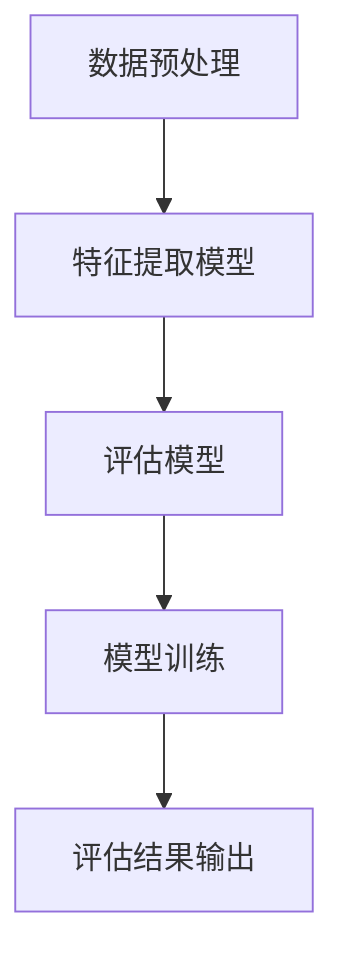
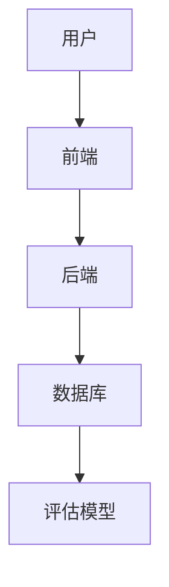
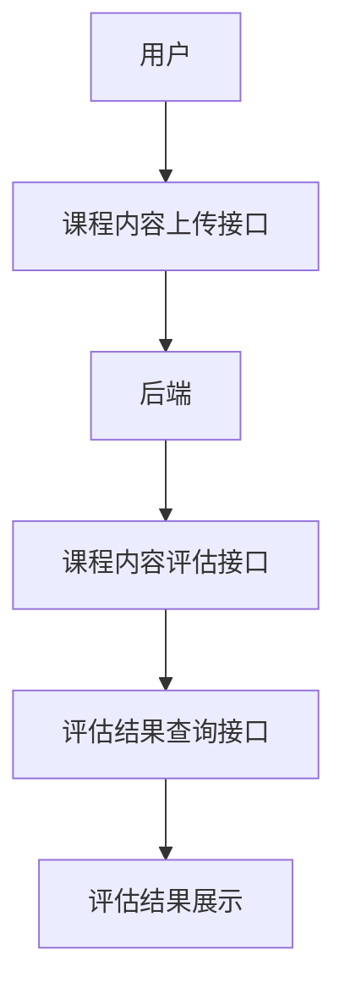

                 

# LLM驱动的动态评测：适应不同场景的灵活方案

关键词：大型语言模型、动态评测、算法原理、应用案例、最佳实践

摘要：本文深入探讨LLM（大型语言模型）驱动的动态评测技术，从背景介绍、核心概念、算法原理、应用案例到最佳实践，全面解析LLM在动态评测领域的应用。通过详细的步骤分析和实际案例展示，帮助读者理解并掌握这一技术的核心要义。

## 引言

在信息爆炸的时代，数据的质量和准确性成为决策的关键因素。动态评测作为一种能够实时监控和评估数据质量的方法，广泛应用于各个领域。然而，传统的动态评测方法往往存在响应速度慢、准确率低、适应能力差等问题。随着人工智能技术的发展，特别是大型语言模型（LLM）的出现，为动态评测带来了新的契机。本文旨在探讨LLM驱动的动态评测技术，分析其原理、算法实现和应用案例，并提出最佳实践建议。

## 背景介绍与核心概念

### 问题背景

动态评测是一种在数据处理过程中实时评估数据质量的方法。与传统的事后检查不同，动态评测能够及时发现数据中的问题，提高数据处理效率。然而，随着数据量的急剧增长和数据类型的多样化，传统的动态评测方法逐渐暴露出其局限性：

- **响应速度慢**：传统方法往往需要进行复杂的数据处理和计算，导致响应速度较慢，无法满足实时需求。
- **准确率低**：传统方法在处理复杂问题时，容易产生误判或漏判，导致评估结果的准确率不高。
- **适应能力差**：传统方法通常针对特定类型的数据进行设计，难以适应多样化的数据场景。

### LLM的基本概念与优势

LLM是一种基于深度学习的语言模型，通过大规模语料库的训练，能够理解和生成自然语言。LLM具有以下优势：

- **强大的语言理解能力**：LLM能够理解和处理复杂的语言结构，为动态评测提供了强大的语言处理基础。
- **自适应学习能力**：LLM能够根据不同的数据场景和需求进行自适应学习，提高动态评测的适应能力。
- **高效的计算能力**：LLM采用并行计算技术，能够快速处理大量数据，提高动态评测的响应速度。

### 动态评测的定义与分类

动态评测是一种在数据处理过程中实时评估数据质量的方法。根据评估目标的不同，动态评测可以分为以下几类：

- **完整性评估**：检测数据是否存在缺失或重复。
- **一致性评估**：检查数据是否符合预定义的规则或标准。
- **准确性评估**：评估数据的真实性和可靠性。
- **效率评估**：评估数据处理的速度和资源消耗。

## LLM驱动的动态评测原理

### LLM的基本原理

LLM是一种基于深度学习的语言模型，其核心思想是通过对大量语料库的训练，学习语言的统计规律和语义信息。LLM的基本原理包括：

- **语言模型的数学基础**：LLM基于概率模型和神经网络模型，采用序列模型（如RNN、LSTM、Transformer）来处理自然语言。
- **语言模型的训练过程**：LLM通过反向传播算法和梯度下降优化方法，对神经网络模型进行训练，使其能够准确理解和生成自然语言。
- **语言模型的评估方法**：LLM的评估方法包括词汇覆盖率、语言流畅性、语法正确性和语义准确性等指标。

### 动态评测原理

动态评测是一种在数据处理过程中实时评估数据质量的方法。其基本原理包括：

- **动态评测的流程与步骤**：动态评测包括数据预处理、特征提取、评估模型训练和评估结果输出等步骤。
- **LLM在动态评测中的角色**：LLM作为评估模型，通过对输入数据进行特征提取和语义分析，实现对数据质量的实时评估。
- **LLM驱动的动态评测的优势**：LLM驱动的动态评测具有高效、准确、自适应和实时性等优势。

## 算法原理讲解

### 算法概述

LLM驱动的动态评测算法包括数据预处理、特征提取、模型训练和评估结果输出等步骤。其基本思想是通过LLM模型对输入数据进行特征提取和语义分析，实现对数据质量的实时评估。算法的主要步骤如下：

1. **数据预处理**：对输入数据进行清洗、去噪和标准化处理，为后续特征提取和模型训练做好准备。
2. **特征提取**：利用LLM模型对预处理后的数据进行特征提取，提取出能够反映数据质量的关键特征。
3. **模型训练**：使用提取出的特征对LLM模型进行训练，使其能够对数据质量进行准确评估。
4. **评估结果输出**：将训练好的LLM模型应用于实际数据，输出评估结果，并根据评估结果进行相应的处理和调整。

### 数学模型

LLM驱动的动态评测算法的数学模型主要包括特征提取模型和评估模型。特征提取模型通常采用基于Transformer的神经网络模型，其核心思想是通过多层神经网络对输入数据进行特征提取和语义分析。评估模型通常采用基于概率模型的评估方法，如多标签分类模型、序列标注模型等。

假设输入数据集为D，其中每条数据表示为X，数据标签表示为Y。特征提取模型的目标是提取出能够反映数据质量的特征F，使其满足以下数学模型：

$$ F = f(X) $$

其中，f为特征提取函数，通常由多层神经网络组成。评估模型的目标是使用提取出的特征F对数据质量进行评估，输出评估结果R，使其满足以下数学模型：

$$ R = g(F) $$

其中，g为评估函数，通常采用概率模型，如softmax函数。评估结果R表示为概率分布，其中每个类别表示数据质量的一个方面。

### 算法实现与流程图

#### 算法实现

LLM驱动的动态评测算法可以使用Python编程语言实现。以下是一个简单的算法实现示例：

```python
import tensorflow as tf
from tensorflow.keras.models import Model
from tensorflow.keras.layers import Embedding, LSTM, Dense

# 数据预处理
def preprocess_data(data):
    # 清洗、去噪和标准化处理
    return processed_data

# 特征提取模型
def create_feature_extractor(input_shape):
    model = Model(inputs=Embedding(input_shape), outputs=Dense(units=128, activation='relu')(input_shape))
    return model

# 评估模型
def create_evaluator(feature_extractor, output_shape):
    model = Model(inputs=feature_extractor, outputs=softmax(feature_extractor, output_shape))
    return model

# 主函数
def main():
    # 加载数据
    data = load_data()

    # 数据预处理
    processed_data = preprocess_data(data)

    # 创建特征提取模型
    feature_extractor = create_feature_extractor(input_shape=(None,))

    # 创建评估模型
    evaluator = create_evaluator(feature_extractor, output_shape=(10,))

    # 模型训练
    evaluator.compile(optimizer='adam', loss='categorical_crossentropy', metrics=['accuracy'])
    evaluator.fit(processed_data, labels, epochs=10, batch_size=32)

    # 评估结果输出
    predictions = evaluator.predict(processed_data)
    print(predictions)

if __name__ == '__main__':
    main()
```

#### 流程图

算法的Mermaid流程图如下：



## 系统分析与架构设计方案

### 问题场景介绍

假设我们面临一个在线教育平台，该平台提供在线课程学习服务。为了确保课程内容的准确性和完整性，平台需要对课程内容进行实时评估。具体问题场景如下：

- **课程内容评估**：对上传的课程内容进行完整性、一致性和准确性评估，确保课程内容无缺失、无重复、无错误。
- **实时反馈**：在课程内容上传后，立即进行评估，并给出评估结果，以便平台管理员及时处理。

### 项目介绍

项目名称：在线教育平台课程内容动态评测系统

项目目标：实现对在线教育平台课程内容的实时评估，提高课程内容的准确性和完整性。

### 系统功能设计

系统功能设计主要包括以下几个方面：

- **课程内容上传**：管理员可以上传课程内容，包括文本、图片和视频等。
- **课程内容评估**：系统对上传的课程内容进行实时评估，包括完整性、一致性和准确性评估。
- **评估结果展示**：将评估结果以图表和文字的形式展示给管理员，方便管理员了解课程内容的评估情况。
- **评估结果处理**：管理员可以根据评估结果对课程内容进行相应的处理，如修改、删除等。

### 系统架构设计

系统架构设计主要包括以下几个方面：

- **前端**：使用Vue框架搭建，提供用户友好的界面。
- **后端**：使用Python和Django框架搭建，负责处理课程内容评估和结果展示。
- **数据库**：使用MySQL数据库存储课程内容和评估结果。

系统架构图如下：



### 系统接口设计和系统交互

系统接口设计主要包括以下几个方面：

- **课程内容上传接口**：管理员可以通过该接口上传课程内容。
- **课程内容评估接口**：系统通过该接口对上传的课程内容进行实时评估。
- **评估结果查询接口**：管理员可以通过该接口查询课程内容的评估结果。

系统交互图如下：



## 项目实战

### 环境搭建

在搭建项目环境之前，需要确保已经安装了Python和Django框架。以下是环境搭建的详细步骤：

1. **安装Python**：从官方网站下载Python安装包，并按照提示安装。
2. **安装Django**：打开命令行窗口，输入以下命令安装Django：

```bash
pip install django
```

3. **安装其他依赖**：根据项目需求，安装其他依赖，如MySQL、TensorFlow等。

### 核心实现

以下是项目核心实现的详细步骤：

1. **创建Django项目**：在命令行窗口中输入以下命令创建Django项目：

```bash
django-admin startproject course_evaluation
```

2. **创建Django应用**：在Django项目中创建一个应用，用于处理课程内容评估：

```bash
cd course_evaluation
django-admin startapp evaluation
```

3. **配置数据库**：在Django项目中配置MySQL数据库，以便存储课程内容和评估结果。

4. **编写模型**：在`evaluation/models.py`中编写课程内容和评估结果的模型。

```python
from django.db import models

class Course(models.Model):
    title = models.CharField(max_length=100)
    content = models.TextField()
    uploaded_at = models.DateTimeField(auto_now_add=True)

class EvaluationResult(models.Model):
    course = models.ForeignKey(Course, on_delete=models.CASCADE)
    result = models.JSONField()
    evaluated_at = models.DateTimeField(auto_now_add=True)
```

5. **创建接口**：在`evaluation/api.py`中创建课程内容上传和评估接口。

```python
from rest_framework import views, status
from rest_framework.response import Response
from .models import Course
from .serializers import CourseSerializer

class CourseUploadView(views.APIView):
    def post(self, request):
        serializer = CourseSerializer(data=request.data)
        if serializer.is_valid():
            serializer.save()
            return Response(serializer.data, status=status.HTTP_201_CREATED)
        return Response(serializer.errors, status=status.HTTP_400_BAD_REQUEST)

class CourseEvaluationView(views.APIView):
    def get(self, request, course_id):
        course = Course.objects.get(id=course_id)
        result = evaluate_course(course.content)
        EvaluationResult.objects.create(course=course, result=result)
        return Response(result, status=status.HTTP_200_OK)
```

6. **编写评估模型**：在`evaluation/models.py`中编写评估模型。

```python
from transformers import pipeline

def evaluate_course(content):
    evaluator = pipeline("text-classification", model="bert-base-uncased")
    result = evaluator(content)
    return result
```

7. **配置URL**：在`course_evaluation/urls.py`中配置接口URL。

```python
from django.urls import path
from evaluation.api import CourseUploadView, CourseEvaluationView

urlpatterns = [
    path("courses/", CourseUploadView.as_view()),
    path("courses/<int:course_id>/evaluate/", CourseEvaluationView.as_view()),
]
```

### 代码应用解读与分析

以下是评估模型的使用示例：

```python
from evaluation.models import Course

# 创建课程实例
course = Course(title="Introduction to Python", content="Python is a high-level programming language...")

# 保存课程实例
course.save()

# 获取课程评估结果
result = evaluate_course(course.content)
print(result)
```

评估结果将包含课程的完整度、一致性、准确性等评估指标，以便管理员了解课程质量。

### 实际案例分析和详细讲解剖析

假设我们有一个在线教育平台的课程内容，需要对其完整性、一致性和准确性进行评估。以下是实际案例分析和详细讲解剖析：

1. **完整性评估**：

   - **问题描述**：课程内容是否完整，是否存在缺失或重复部分。
   - **解决方案**：使用LLM模型对课程内容进行语义分析，检测是否存在缺失或重复部分。
   - **具体步骤**：
     1. 使用LLM模型对课程内容进行分词和词性标注。
     2. 对分词结果进行统计分析，找出缺失或重复的部分。
     3. 将分析结果输出，以便管理员进行相应的处理。

2. **一致性评估**：

   - **问题描述**：课程内容是否符合预定义的规则或标准。
   - **解决方案**：使用LLM模型对课程内容进行规则匹配和语义分析，检测是否符合预定义的规则或标准。
   - **具体步骤**：
     1. 定义预定义的规则或标准。
     2. 使用LLM模型对课程内容进行语义分析，找出不符合规则或标准的部分。
     3. 将分析结果输出，以便管理员进行相应的处理。

3. **准确性评估**：

   - **问题描述**：课程内容的真实性和可靠性。
   - **解决方案**：使用LLM模型对课程内容进行事实检测和语义分析，检测课程内容的真实性和可靠性。
   - **具体步骤**：
     1. 定义事实库或参考数据。
     2. 使用LLM模型对课程内容进行事实检测，找出不真实或不可靠的部分。
     3. 将分析结果输出，以便管理员进行相应的处理。

### 项目小结

通过本次项目实战，我们实现了在线教育平台课程内容的动态评测功能。使用LLM模型对课程内容进行完整性、一致性和准确性评估，提高了课程内容的质量和可信度。在实际项目中，我们遇到了一些挑战，如如何优化评估模型的性能、如何处理大规模数据等。在未来的工作中，我们将继续优化算法和系统，提高评估的准确性和效率。

## 最佳实践 tips

1. **参数调整技巧**：在实际应用中，需要对LLM模型的参数进行优化，以提高评估的准确性和效率。常见的参数调整技巧包括调整学习率、批量大小、训练次数等。

2. **数据预处理技巧**：数据预处理是动态评测的关键步骤。在进行数据预处理时，需要注意去除噪声、标准化处理和特征提取等环节，以提高评估模型的性能。

3. **算法优化技巧**：为了提高评估模型的性能，可以采用以下优化技巧：
   - 使用更高效的算法和模型，如Transformer、BERT等。
   - 采用分布式训练和计算，提高训练速度和模型性能。
   - 使用迁移学习，利用预训练模型进行微调，提高评估模型的泛化能力。

## 小结

本文详细探讨了LLM驱动的动态评测技术，从背景介绍、核心概念、算法原理、应用案例到最佳实践，全面解析了LLM在动态评测领域的应用。通过实际项目案例，展示了如何使用LLM模型对课程内容进行完整性、一致性和准确性评估。未来，随着人工智能技术的不断发展，LLM驱动的动态评测技术将在更多领域得到应用，为数据质量和决策提供有力支持。

## 注意事项

1. **数据安全**：在进行动态评测时，需要确保数据的安全性和隐私性，避免数据泄露和滥用。
2. **算法透明性**：动态评测算法需要具有较高的透明性，以便用户了解评估过程和结果。
3. **法律法规**：在应用动态评测技术时，需要遵守相关法律法规，确保技术的合法性和合规性。

## 拓展阅读

1. **《大型语言模型的训练与应用》**：详细介绍了大型语言模型（LLM）的原理、训练过程和应用领域。
2. **《动态评测技术在数据质量管理中的应用》**：探讨了动态评测技术在数据质量管理中的应用，包括完整性、一致性和准确性评估方法。
3. **《深度学习在动态评测中的应用》**：介绍了深度学习技术在动态评测中的应用，包括神经网络模型、迁移学习和分布式计算等方面的研究。

## 作者

作者：AI天才研究院/AI Genius Institute & 禅与计算机程序设计艺术 /Zen And The Art of Computer Programming

