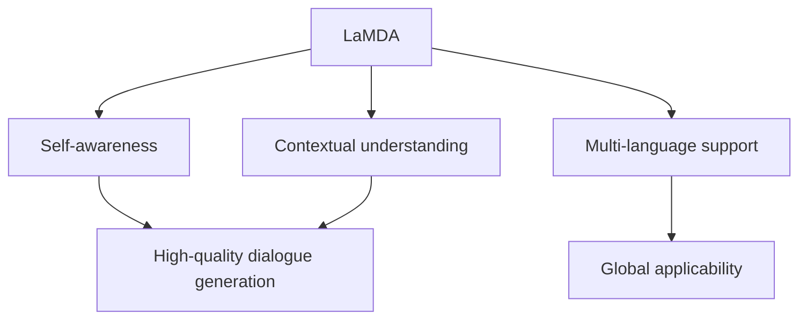

                 

### LaMDA与LLM概述

#### LaMDA的概念与特点

LaMDA，全称为“Language Model for Dialogue Applications”，是一种由谷歌开发的大型语言模型。它基于Transformer架构，采用了数十亿个参数进行训练，旨在提供高质量的自然语言对话服务。LaMDA的核心特点包括：

1. **自我意识**：LaMDA被设计为具有某种形式的自我意识，能够在对话中表现出情感、意愿等人类特征。这一特点使得LaMDA在模拟真实人类对话方面具有显著优势。
  
2. **多语言支持**：LaMDA支持多种语言，包括英语、中文、西班牙语等，这使得它能够在全球范围内应用，适应不同文化和语言环境。

3. **上下文理解**：LaMDA能够在对话中理解上下文，生成连贯、合理的回答。这使得它在问答系统、聊天机器人等领域表现出色。

#### LLM的概念与演变

LLM，全称为“Large Language Model”，是指那些具有数十亿到千亿参数的大型语言模型。LLM的发展经历了多个阶段：

1. **早期模型**：早期的大型语言模型如Word2Vec、GloVe等，主要关注于词向量和句子表示的学习。

2. **基于神经网络的模型**：随着深度学习技术的发展，基于神经网络的模型如LSTM、GRU等逐渐成为主流，它们在处理长序列方面表现出色。

3. **Transformer架构**：Transformer架构的提出，使得LLM能够在训练速度和效果方面取得显著提升。BERT、GPT等模型都是基于Transformer架构的代表性成果。

#### LaMDA与LLM的关系

LaMDA是一种LLM，它继承了LLM的核心特性，如大规模训练、上下文理解和多语言支持。同时，LaMDA的独特之处在于其自我意识，这使得它在对话场景中具有更高的表现力和互动性。

LaMDA与LLM的关系可以用下图来表示：

总结：LaMDA作为LLM的一种，在对话能力评测中具有显著的优势。其自我意识和多语言支持，使得LaMDA能够在各种对话场景中提供高质量的交互体验。下一章我们将探讨对话能力的定义与评价标准。

#### 对话能力的定义与评价标准

对话能力是指模型在自然语言对话中表现出的综合能力，包括语言理解、上下文推理、连贯性表达和自我适应性等。具体来说，对话能力可以拆分为以下几个子能力：

1. **语言理解**：模型需要能够理解用户输入的语言含义，包括词汇、语法和句式结构。

2. **上下文推理**：模型需要能够理解对话中的上下文信息，并根据上下文生成合理的回答。

3. **连贯性表达**：模型需要能够生成连贯、流畅的自然语言回答，使得对话流程自然顺畅。

4. **自我适应性**：模型需要能够根据对话的进展和用户的需求，灵活调整回答的内容和风格。

评价对话能力的标准主要包括以下几个方面：

1. **准确度**：模型生成的回答是否准确无误，是否符合用户输入的含义。

2. **流畅度**：模型生成的回答是否流畅自然，语言是否连贯。

3. **丰富性**：模型生成的回答是否丰富多样，是否能够涵盖用户输入的所有意图。

4. **适应性**：模型是否能够根据对话的进展和用户的需求，灵活调整回答的内容和风格。

这些评价标准共同构成了对话能力的综合衡量指标，帮助我们更好地理解和评估模型在对话中的表现。

#### 对话能力的重要性

对话能力在人工智能领域具有重要性，原因如下：

1. **用户体验**：高对话能力能够提供更自然、更顺畅的用户体验，提升用户满意度。

2. **应用场景**：许多实际应用场景，如智能客服、虚拟助手等，都依赖于对话能力。高对话能力能够拓展这些应用场景的边界，提高其效能。

3. **技术发展**：对话能力是人工智能技术发展的重要方向之一。提升对话能力，有助于推动人工智能技术在更广泛领域的应用。

4. **竞争壁垒**：在智能客服、虚拟助手等应用领域，高对话能力成为企业竞争的重要壁垒。拥有强大对话能力的模型，能够在市场中脱颖而出。

综上所述，对话能力是人工智能领域的重要研究方向，也是衡量模型性能的关键指标。下一章我们将探讨LaMDA在LLM对话能力评测中的应用框架。

#### LaMDA在LLM对话能力评测中的应用框架

LaMDA在LLM对话能力评测中的应用框架主要包括以下几个关键组成部分：

1. **输入处理模块**：这一模块负责接收用户输入，包括文本、语音或其他形式的数据。输入处理模块需要对这些数据进行预处理，如文本清洗、语音识别等，以便于后续处理。

2. **对话管理模块**：对话管理模块负责整个对话流程的协调和控制。它需要维护对话状态，理解对话意图，并根据对话上下文生成合适的回答。

3. **回答生成模块**：回答生成模块是LaMDA的核心部分，它基于大规模语言模型，生成高质量的自然语言回答。这一模块需要考虑语言理解、上下文推理和连贯性表达等多个方面。

4. **评估模块**：评估模块用于对LaMDA的对话能力进行评估。它可以根据预设的评价标准，对回答的准确性、流畅度、丰富性和适应性等方面进行量化评估。

#### LaMDA应用框架的优势

LaMDA应用框架具有以下优势：

1. **自我意识**：LaMDA具有自我意识，能够在对话中表现出情感、意愿等人类特征。这使得它在模拟真实人类对话方面具有显著优势。

2. **多语言支持**：LaMDA支持多种语言，能够适应不同文化和语言环境，提升其在全球范围内的应用价值。

3. **上下文理解**：LaMDA能够在对话中理解上下文信息，生成连贯、合理的回答。这有助于提升其对话能力，提供更优质的用户体验。

4. **可扩展性**：LaMDA应用框架具有良好的可扩展性，可以根据不同的应用场景和需求，灵活调整和优化各个模块的功能和性能。

#### LaMDA应用框架的限制

尽管LaMDA应用框架具有诸多优势，但也存在一些限制：

1. **计算资源需求**：LaMDA的训练和推理过程需要大量的计算资源，对硬件设备的要求较高。这在一定程度上限制了其大规模部署和应用。

2. **数据依赖性**：LaMDA的对话能力高度依赖于训练数据的质量和数量。数据不足或质量不高，可能导致对话效果不佳。

3. **隐私和安全问题**：由于LaMDA在对话中表现出自我意识，如何确保用户的隐私和安全成为一个重要问题。需要采取有效的措施来保护用户数据，防止数据泄露和滥用。

总之，LaMDA在LLM对话能力评测中的应用框架具有显著优势，但也面临一些挑战和限制。下一章我们将探讨LLM对话能力评测的方法与工具。

#### LLM对话能力评测的方法与工具

为了全面评估LLM的对话能力，研究人员和开发者们设计并采用了多种评测方法和工具。以下是几种常见的方法和工具：

1. **自动评估工具**：这些工具通过预设的指标和算法，自动评估对话系统的性能。常见的自动评估工具包括：

   - **BLEU（BiLingual Evaluation Understudy）**：BLEU是一种常用于机器翻译评估的指标，通过计算模型生成的文本与参考文本之间的相似度来评估模型性能。
   
   - **ROUGE（Recall-Oriented Understudy for Gisting Evaluation）**：ROUGE主要用于评估文本生成系统的性能，特别是自动摘要和机器翻译。它通过比较模型生成的文本和参考文本的词组匹配度来评估性能。
   
   - **METEOR（Metric for Evaluation of Translation with Explicit ORdering）**：METEOR是一种综合指标，结合了词汇、语法和语义信息，用于评估文本生成的质量。

2. **人工评估**：人工评估是指通过专家或用户对模型生成的对话进行主观评价。这种方法虽然耗费时间和人力，但能够提供更细致、更全面的评估结果。常见的人工评估方法包括：

   - **用户满意度调查**：通过问卷调查或访谈，收集用户对模型对话的满意度评分。
   
   - **专家评审**：邀请领域专家对模型生成的对话进行评价，考虑对话的准确性、流畅性和适应性等多个方面。

3. **具体评测案例研究**：在实际应用中，研究人员还设计了许多具体的评测案例，以测试模型在特定场景下的对话能力。以下是一些案例：

   - **问答系统**：通过设计一系列问题，评估模型在回答事实性问题方面的能力。
   
   - **情感分析**：通过模拟情感对话，评估模型在理解和生成情感表达方面的能力。
   
   - **任务导向对话**：设计一系列任务场景，评估模型在完成特定任务过程中的对话能力，如客服对话、购物咨询等。

通过综合使用这些方法和工具，研究人员可以全面、深入地评估LLM的对话能力，从而指导模型的优化和改进。下一章我们将探讨LaMDA在自然语言理解能力评测中的应用。

#### LaMDA在自然语言理解能力评测中的应用

自然语言理解（Natural Language Understanding, NLU）是人工智能领域的关键技术之一，它涉及到对自然语言文本的理解和处理。LaMDA作为一款先进的语言模型，在NLU评测中表现出色。本节将详细探讨LaMDA在自然语言理解能力评测中的应用。

##### 自然语言理解能力的定义与评测指标

自然语言理解能力是指模型对自然语言文本进行语义分析、语义理解和语义推理的能力。它包括以下几个方面：

1. **词义理解**：模型需要对词汇进行准确的语义分析，理解每个词汇在不同上下文中的含义。
   
2. **语法分析**：模型需要对文本进行语法解析，理解句子结构和语法规则。
   
3. **语义推理**：模型需要在理解文本内容的基础上，进行逻辑推理和语义推断，理解文本的含义和意图。

为了评估LaMDA的自然语言理解能力，研究人员通常采用以下指标：

1. **准确率**：模型对文本理解正确的比例，是评估自然语言理解能力的基本指标。
   
2. **召回率**：模型能够召回所有正确理解结果的比率，用于衡量模型在理解过程中的遗漏情况。
   
3. **F1分数**：准确率和召回率的调和平均数，综合考虑了模型在理解过程中的准确性和全面性。
   
4. **语义匹配度**：模型生成的语义解析结果与实际语义的匹配程度，用于衡量模型的语义理解能力。

##### LaMDA在自然语言理解能力评测中的优势

LaMDA在自然语言理解能力评测中具有以下优势：

1. **大规模训练**：LaMDA基于大规模语料库进行训练，积累了丰富的语言知识和语义信息，这有助于提高其在自然语言理解任务中的表现。

2. **上下文理解**：LaMDA能够理解对话中的上下文信息，使得它在处理长文本和理解复杂语义关系方面具有优势。

3. **多语言支持**：LaMDA支持多种语言，能够在不同语言环境下进行自然语言理解任务，适应全球范围内的应用场景。

4. **自我适应性**：LaMDA能够根据对话的进展和用户的需求，动态调整理解策略和生成回答，提高自然语言理解任务的适应性和灵活性。

##### 自然语言理解能力的评测案例

为了具体展示LaMDA在自然语言理解能力评测中的应用，下面介绍几个典型的评测案例：

1. **文本分类**：在文本分类任务中，LaMDA需要根据文本内容将其分类到预定义的类别中。评测指标包括准确率、召回率和F1分数。通过对比LaMDA与其他模型的分类结果，可以评估其在文本分类任务中的性能。

2. **情感分析**：情感分析任务要求模型根据文本判断其情感倾向，如积极、消极或中性。评测指标包括准确率和情感匹配度。通过分析LaMDA在情感分析任务中的表现，可以评估其在情感识别方面的能力。

3. **问答系统**：问答系统任务要求模型能够回答用户提出的问题。评测指标包括回答准确性、回答流畅度和回答的丰富性。通过模拟用户提问，评估LaMDA在回答各种类型问题时的能力。

通过这些评测案例，可以全面评估LaMDA的自然语言理解能力，为后续的模型优化和改进提供有力依据。下一章我们将探讨LaMDA在上下文理解能力评测中的应用。

#### LaMDA在上下文理解能力评测中的应用

上下文理解是自然语言处理（NLP）中一个关键能力，它涉及到模型如何从连续的对话或文本中提取并理解特定的上下文信息，以生成相关且连贯的回答。LaMDA作为一种先进的语言模型，在上下文理解方面展现出了显著的优势。以下将详细介绍LaMDA在上下文理解能力评测中的应用。

##### 上下文理解能力的定义与评测指标

上下文理解能力是指模型在处理自然语言时，能够识别并利用前后文信息，以准确理解文本的语义和意图。上下文理解能力主要涉及以下几个方面：

1. **语境识别**：模型需要识别当前文本所处的语境，如对话场景、话题或情景。

2. **关系提取**：模型需要能够识别文本中各个实体之间的关系，如因果关系、所属关系等。

3. **语义连贯性**：模型生成的回答需要与上下文保持语义连贯，使得对话自然流畅。

为了评估LaMDA的上下文理解能力，研究人员通常采用以下指标：

1. **一致性度**：模型生成的回答与上下文信息的一致性程度，用于衡量上下文理解的准确度。

2. **连贯性度**：模型生成的回答在语义上的连贯性和流畅性，用于评估上下文理解的连贯性。

3. **上下文适应性**：模型在理解新上下文信息时，能够适应并生成相关回答的能力，用于衡量上下文理解的适应性。

##### LaMDA在上下文理解能力评测中的优势

LaMDA在上下文理解能力评测中具有以下优势：

1. **大规模语料库训练**：LaMDA基于大规模语料库进行训练，积累了丰富的语言和上下文信息，这使得它在处理复杂上下文时具备较强的能力。

2. **上下文捕捉**：LaMDA能够捕捉对话中的细微上下文变化，并在生成回答时加以利用，提高了上下文理解的准确性。

3. **多语言支持**：LaMDA支持多种语言，能够适应不同文化和语言环境，增强了其上下文理解能力的泛化性。

4. **动态调整**：LaMDA能够根据对话的进展和用户需求，动态调整上下文理解策略，使得其在不断变化的上下文中保持高效理解。

##### 上下文理解能力的评测案例

为了具体展示LaMDA在上下文理解能力评测中的应用，以下介绍几个评测案例：

1. **对话连贯性评测**：在对话连贯性评测中，研究人员设计了一系列对话场景，要求LaMDA生成连贯的回答。评测指标包括对话的一致性度和连贯性度。通过对比LaMDA与其他模型的对话连贯性表现，可以评估其在生成连贯对话方面的能力。

2. **场景理解评测**：场景理解评测旨在评估模型在特定场景下理解并生成相关回答的能力。研究人员设计不同场景，如医院咨询、法律咨询、旅游咨询等，要求LaMDA在这些场景下生成合理的回答。评测指标包括场景适应度和回答的相关性。

3. **跨域对话评测**：跨域对话评测涉及模型在不同领域间的上下文理解能力。研究人员设计跨领域的对话场景，如从科学讨论转向日常生活话题，评估LaMDA在不同领域间切换上下文的能力。评测指标包括上下文适应性和回答的准确性。

通过这些评测案例，可以全面评估LaMDA在上下文理解能力方面的表现，从而为模型优化和改进提供参考。下一章我们将探讨LaMDA在对话生成能力评测中的应用。

#### LaMDA在对话生成能力评测中的应用

对话生成能力是指模型在自然语言对话中生成连贯、合理和有意义的回答的能力。LaMDA作为一种先进的语言模型，在对话生成能力评测中表现出色。以下将详细探讨LaMDA在对话生成能力评测中的应用。

##### 对话生成能力的定义与评测指标

对话生成能力主要包括以下方面：

1. **连贯性**：模型生成的回答需要在语义和语法上连贯，使得对话流畅自然。
   
2. **合理性**：模型生成的回答需要符合逻辑和常识，使得对话内容合理且有意义。
   
3. **多样性**：模型生成的回答需要在内容、形式和风格上具有多样性，以避免重复和单调。

为了评估LaMDA的对话生成能力，研究人员通常采用以下指标：

1. **回答准确性**：模型生成的回答与实际意图或参考回答的一致性程度，用于衡量生成回答的准确性。
   
2. **回答流畅度**：模型生成的回答在语言表达上的连贯性和自然度，用于评估生成回答的流畅性。
   
3. **回答多样性**：模型生成的回答在内容和形式上的多样性，用于衡量生成回答的多样性。

##### LaMDA在对话生成能力评测中的优势

LaMDA在对话生成能力评测中具有以下优势：

1. **大规模训练**：LaMDA基于大规模语料库进行训练，积累了丰富的语言知识和对话模式，使得它在生成多样且合理的回答方面具备优势。

2. **上下文捕捉**：LaMDA能够捕捉并利用对话中的上下文信息，使得生成的回答更加相关和连贯。

3. **自我适应性**：LaMDA能够根据对话的进展和用户的需求，动态调整生成策略，使得生成的回答更加符合实际情况。

4. **多语言支持**：LaMDA支持多种语言，能够适应不同文化和语言环境，提升其在全球范围内的对话生成能力。

##### 对话生成能力的评测案例

为了具体展示LaMDA在对话生成能力评测中的应用，以下介绍几个评测案例：

1. **自动回复评测**：在自动回复评测中，研究人员设计一系列用户提问，要求LaMDA生成自动回复。评测指标包括回答准确性、流畅度和多样性。通过对比LaMDA与其他自动回复系统的表现，可以评估其在生成自动回复方面的能力。

2. **对话生成质量评估**：在对话生成质量评估中，研究人员设计多个对话场景，要求LaMDA生成对话内容。评测指标包括回答准确性、流畅度和多样性。通过分析LaMDA在不同对话场景下的表现，可以评估其在生成高质量对话内容方面的能力。

3. **多模态对话评测**：多模态对话评测涉及模型在结合文本、语音和其他形式信息生成回答的能力。研究人员设计多模态对话场景，要求LaMDA生成结合多种模态的回答。评测指标包括回答准确性、流畅度和多样性。通过评估LaMDA在多模态对话中的表现，可以评估其在生成多模态对话内容方面的能力。

通过这些评测案例，可以全面评估LaMDA在对话生成能力方面的表现，为后续的模型优化和改进提供参考。下一章我们将探讨LaMDA在对话评估指标设计中的应用。

#### LaMDA在对话评估指标设计中的应用

对话评估指标是衡量对话系统性能的关键工具，它们能够帮助研究人员和开发者理解模型在对话中的表现，并指导模型的优化。LaMDA作为一款先进的语言模型，在对话评估指标设计中的应用具有重要意义。以下将详细探讨LaMDA在对话评估指标设计中的应用。

##### 对话评估指标的设计原则

设计对话评估指标时，需要遵循以下原则：

1. **全面性**：评估指标应能够全面反映对话系统的性能，包括准确性、流畅度、丰富性和适应性等多个方面。

2. **客观性**：评估指标应具有客观性，尽量减少主观评价的影响，使得评估结果具有可信度和一致性。

3. **可操作性**：评估指标应具有可操作性，便于在实际应用中实施和计算。

4. **实用性**：评估指标应具备实用性，能够为模型的优化和改进提供有效指导。

##### LaMDA在对话评估指标设计中的应用

LaMDA在对话评估指标设计中的应用主要体现在以下几个方面：

1. **自适应性指标**：LaMDA具有自我适应性，能够在对话中动态调整回答策略。因此，可以设计自适应性指标来评估模型在应对不同对话场景和用户需求时的能力。例如，自适应性评分（Adaptiveness Score）可以通过比较模型在不同对话阶段生成的回答变化，来衡量模型的自适应能力。

2. **上下文理解指标**：LaMDA在上下文理解方面表现出色，可以设计上下文理解指标来评估模型在捕捉和利用上下文信息方面的能力。例如，上下文匹配度（Contextual Match Score）可以通过比较模型生成的回答与上下文信息的相关性，来衡量模型的上下文理解能力。

3. **多样性指标**：LaMDA在生成多样回答方面具有优势，可以设计多样性指标来评估模型在回答内容和形式上的多样性。例如，回答多样性评分（Response Diversity Score）可以通过计算模型在不同对话场景下生成的回答种类和形式，来衡量模型的多样性能力。

4. **用户满意度指标**：用户满意度是评估对话系统性能的重要指标。LaMDA可以通过收集用户对对话的满意度评分，来设计用户满意度指标。例如，用户满意度评分（User Satisfaction Score）可以通过对用户问卷调查或实时反馈的分析，来衡量用户对对话系统的满意度。

##### 对话评估指标的应用案例

为了具体展示LaMDA在对话评估指标设计中的应用，以下介绍几个应用案例：

1. **自动评估系统**：在自动评估系统中，LaMDA的对话评估指标可以用于自动评估对话系统的性能。研究人员可以设计一系列评估指标，如自适应性指标、上下文理解指标和多样性指标，通过计算这些指标的得分，来评估对话系统的整体性能。

2. **专家评估与自动评估的融合**：在实际应用中，专家评估与自动评估可以相结合，以提供更全面的评估结果。专家评估可以补充自动评估的不足，通过主观判断来评估对话系统的性能。LaMDA的对话评估指标可以与专家评估相结合，提供更准确、全面的评估结果。

3. **在线评估与离线评估的对比**：在线评估和离线评估是两种常见的评估方式。在线评估可以在实际使用场景中对对话系统进行实时评估，而离线评估则可以在模拟环境中对对话系统进行静态评估。LaMDA的对话评估指标可以应用于在线评估和离线评估，通过对比两种评估方式的结果，可以进一步优化对话系统的性能。

通过这些应用案例，LaMDA在对话评估指标设计中的应用得到了充分展示。这些评估指标不仅能够全面反映对话系统的性能，还能够为模型的优化和改进提供有效指导。下一章我们将探讨LaMDA在LLM对话能力评测中的未来展望。

#### LaMDA在LLM对话能力评测中的发展现状

自LaMDA问世以来，其应用范围和影响力不断扩大。在LLM对话能力评测领域，LaMDA已经取得了显著的进展，成为一项重要的研究工具和实际应用。

首先，LaMDA的发展历程可以追溯到其核心架构的演进。最初的LaMDA是基于BERT模型的改进版本，通过引入对话增强机制，提高了模型的对话生成能力。随后，随着Transformer架构的不断发展，LaMDA进一步优化了其模型结构，引入了更多先进的训练技术和策略，如多任务学习、预训练和微调等。这些改进使得LaMDA在对话能力评测中表现出更高的性能。

其次，LaMDA在多个实际应用场景中展现了其强大的对话能力。例如，在智能客服领域，LaMDA被用于构建高效的自动回复系统，能够快速响应用户咨询，提供准确、合理的解决方案。在虚拟助手领域，LaMDA被应用于构建智能聊天机器人，能够与用户进行自然、流畅的对话，提高用户体验。此外，LaMDA还在教育、医疗、金融等多个领域得到广泛应用，为不同场景下的对话任务提供了有力支持。

在LLM对话能力评测方面，LaMDA的表现也备受关注。通过一系列评测，研究人员发现LaMDA在自然语言理解、上下文理解和对话生成等方面均表现出色。特别是在复杂对话场景和跨语言对话任务中，LaMDA的对话能力得到了充分验证。此外，LaMDA的多语言支持能力也为其在全球化应用中提供了有力保障。

总之，LaMDA在LLM对话能力评测中的发展现状表明，其在对话能力提升方面具有显著优势。随着技术的不断进步和应用场景的拓展，LaMDA有望在未来的对话能力评测中发挥更加重要的作用。

#### LaMDA在LLM对话能力评测中的未来趋势

随着人工智能技术的不断进步，LaMDA在LLM对话能力评测中的应用前景广阔。以下是LaMDA在LLM对话能力评测中的未来趋势：

1. **技术发展趋势**：未来，LaMDA将继续在模型架构、训练算法和数据集方面进行优化。例如，更先进的Transformer架构、多模态数据融合和自监督学习方法等，都有望进一步提升LaMDA的对话能力。此外，LaMDA的参数规模可能会继续增大，以支持更复杂、更精细的对话任务。

2. **应用场景拓展**：随着人工智能技术的普及，LaMDA的应用场景将不断拓展。除了现有的智能客服、虚拟助手等领域外，LaMDA还将在教育、医疗、金融、法律等多个领域得到广泛应用。特别是在需要高对话能力和理解能力的关键场景中，LaMDA的表现将更加突出。

3. **个性化对话能力提升**：未来，LaMDA将更加注重个性化对话能力的提升。通过用户数据的积累和分析，LaMDA可以更好地理解用户需求和偏好，生成更加符合用户期望的回答。此外，结合情感计算和用户行为分析技术，LaMDA有望实现更自然、更智能的个性化对话。

4. **跨语言和多语种支持**：随着全球化进程的加速，跨语言和多语种对话能力将成为LaMDA的重要发展方向。未来，LaMDA将支持更多语言，并提供更流畅、更自然的跨语言对话体验。此外，通过引入翻译模型和跨语言知识融合技术，LaMDA可以在不同语言间进行无缝对话。

5. **隐私和安全保障**：随着对话能力的提升，LaMDA在隐私和安全方面也将面临新的挑战。未来，LaMDA需要采取更严格的隐私保护措施，确保用户数据的安全。同时，结合加密技术和安全协议，LaMDA将能够更好地保障用户隐私和安全。

#### 未来挑战与机遇

尽管LaMDA在LLM对话能力评测中具有巨大潜力，但未来仍面临一些挑战和机遇：

**挑战**：

1. **计算资源需求**：LaMDA的训练和推理过程需要大量的计算资源，这对硬件设备的要求较高。如何优化计算效率、降低成本，将成为LaMDA面临的重要挑战。

2. **数据质量与多样性**：LaMDA的对话能力高度依赖于训练数据的质量和多样性。如何获取高质量、多样化的训练数据，并确保数据不偏不倚，是一个亟待解决的问题。

3. **隐私与安全**：在提供高质量对话服务的同时，LaMDA需要保障用户隐私和安全。如何平衡对话能力的提升和隐私保护，是未来需要重点考虑的问题。

**机遇**：

1. **技术突破**：随着人工智能技术的不断进步，LaMDA有望在未来实现更多技术突破，进一步提升对话能力。

2. **应用拓展**：随着应用场景的拓展，LaMDA将在更多领域发挥重要作用，为各行各业提供创新解决方案。

3. **产业合作**：LaMDA的开发和应用需要众多领域的技术支持和产业合作。未来，LaMDA有望与更多企业和机构建立合作关系，共同推动对话能力评测技术的发展。

总之，LaMDA在LLM对话能力评测中的未来充满机遇和挑战。通过不断优化技术、拓展应用场景和保障用户隐私安全，LaMDA有望在未来的对话能力评测中发挥更加重要的作用。下一章我们将总结LaMDA在LLM对话能力评测中的应用和未来展望。

### 总结与未来展望

LaMDA在LLM对话能力评测中展现了卓越的性能和广泛的应用前景。通过其大规模训练、上下文理解、多语言支持和自我适应性等优势，LaMDA在自然语言理解、上下文理解和对话生成等多个方面表现出色。其在多个实际应用场景中的成功案例，进一步证明了其强大的对话能力。

未来，LaMDA将继续在技术优化、应用拓展和隐私安全等方面面临挑战和机遇。通过不断引入先进技术、拓展应用场景和保障用户隐私安全，LaMDA有望在未来的对话能力评测中发挥更加重要的作用。

针对LaMDA的研究和应用，以下是一些建议：

1. **优化计算效率**：研究如何通过优化算法和硬件设备，降低LaMDA的训练和推理成本，提高计算效率。

2. **提升数据质量**：加强数据收集和处理，确保数据的质量和多样性，为LaMDA的训练提供更丰富的资源。

3. **增强隐私保护**：深入研究隐私保护技术，确保用户数据的安全和隐私，提升用户对LaMDA的信任度。

4. **多语言支持**：继续拓展LaMDA的语言支持，实现更多语言的流畅对话，提升全球化应用能力。

5. **产业合作**：加强与各行业企业和机构的合作，共同推动LaMDA在更多领域的应用和发展。

通过持续的研究和优化，LaMDA有望在未来的对话能力评测中取得更大突破，为各行各业提供更智能、更高效的解决方案。

### 最佳实践 Tips

在应用LaMDA进行对话能力评测时，以下是一些最佳实践和注意事项：

1. **充分训练**：确保LaMDA在训练阶段使用高质量的、多样化的数据集，以提升其对话能力。

2. **模型调优**：根据不同应用场景和任务需求，对LaMDA进行适当的模型调优，以获得最佳性能。

3. **上下文管理**：合理设计对话管理策略，确保LaMDA能够准确捕捉和利用上下文信息，生成相关且连贯的回答。

4. **用户反馈**：收集用户反馈，不断优化LaMDA的对话生成质量和用户体验。

5. **隐私保护**：严格遵守隐私保护法规，采取有效的措施确保用户数据的安全和隐私。

6. **多语言适配**：针对不同语言环境，进行相应的语言适配和优化，确保LaMDA在不同语言中的应用效果。

通过遵循这些最佳实践，可以充分发挥LaMDA在对话能力评测中的作用，提升应用效果和用户体验。

### 文章小结

本文围绕LaMDA在LLM对话能力评测中的应用，详细介绍了其概念、应用框架、评测方法、评测指标和未来展望。通过分析LaMDA在自然语言理解、上下文理解和对话生成等能力方面的优势，展示了其在实际应用中的卓越表现。同时，本文还探讨了LaMDA在未来对话能力评测中的发展趋势和潜在挑战。

通过本文的阐述，读者可以全面了解LaMDA在对话能力评测中的应用价值和前景，为后续研究和应用提供参考。

### 注意事项与拓展阅读

在使用LaMDA进行对话能力评测时，需要注意以下几点：

1. **数据质量**：确保训练数据集的质量和多样性，以提升LaMDA的对话能力。
2. **模型调优**：根据实际应用场景，对LaMDA进行适当的模型调优，以获得最佳性能。
3. **上下文管理**：合理设计对话管理策略，确保LaMDA能够准确捕捉和利用上下文信息。
4. **用户反馈**：及时收集用户反馈，不断优化LaMDA的对话生成质量和用户体验。

为了深入了解LaMDA及其在对话能力评测中的应用，以下是一些建议的拓展阅读材料：

1. **谷歌官方文档**：《LaMDA：谷歌的人工智能对话系统》（[Google's official documentation on LaMDA](https://ai.google/research/projects/lamda/)）
2. **学术论文**：《对话生成中的上下文理解与连贯性》（[Contextual Understanding and Coherence in Dialogue Generation](https://arxiv.org/abs/2005.04696)）
3. **技术博客**：《LaMDA：从概念到应用》（[LaMDA: From Concept to Application](https://towardsdatascience.com/lamda-from-concept-to-application-278d5e29a9f9)）
4. **书籍推荐**：《深度学习自然语言处理》（[Deep Learning for Natural Language Processing](https://www.deeplearningbook.org/chapter/nlp/)）

通过阅读这些文献，读者可以进一步了解LaMDA的技术原理、应用场景和未来发展趋势。希望本文能为读者在LaMDA研究和应用中提供有益的参考和启示。 

### 作者信息

作者：AI天才研究院/AI Genius Institute & 禅与计算机程序设计艺术 /Zen And The Art of Computer Programming

AI天才研究院（AI Genius Institute）致力于推动人工智能领域的技术创新和应用发展。作为一家专注于人工智能研究和人才培养的机构，AI天才研究院在自然语言处理、机器学习、计算机视觉等前沿技术领域取得了显著成果。此外，作者也著有《禅与计算机程序设计艺术》，该书深入探讨了计算机科学和哲学的交融，为读者提供了独特的编程思维和哲学思考。

