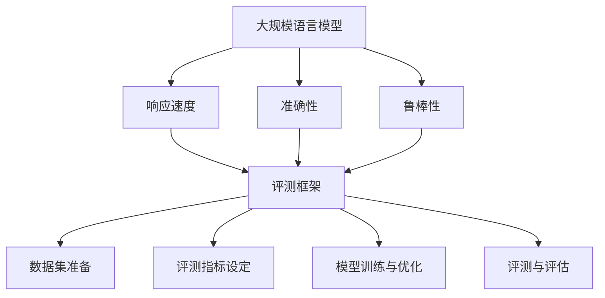
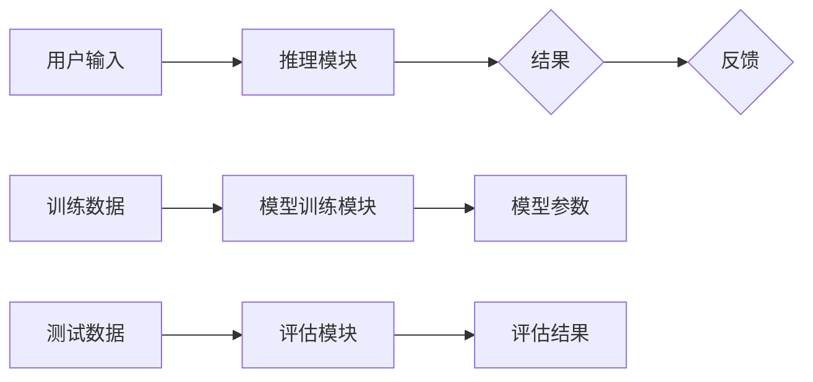
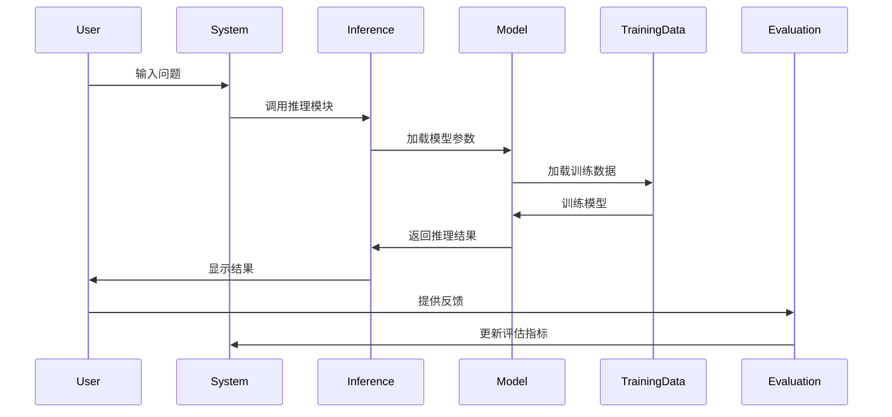
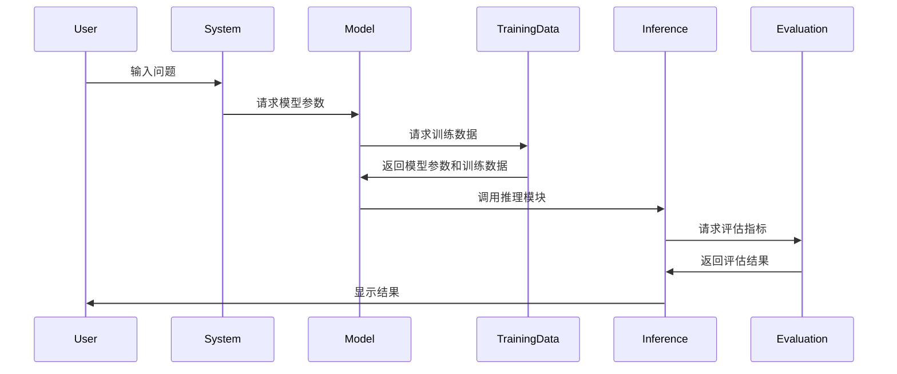

                 


## # PaLM在LLM推理能力评测中的应用

### 关键词：PaLM，LLM，推理能力评测，优化算法，计算资源分配，数据处理

> 摘要：本文将深入探讨大规模语言模型（LLM）的推理能力评测，以及如何通过PaLM模型在实际应用中高效地提升LLM的推理性能。通过系统的理论讲解和实际案例分析，本文旨在为读者提供全面的LLM推理能力评估与优化指南。

### 第一部分：背景介绍

#### 1.1 问题背景

随着人工智能技术的快速发展，大规模语言模型（LLM）在自然语言处理领域取得了显著的成果。这些模型通过深度学习算法，能够理解和生成自然语言，广泛应用于机器翻译、文本生成、问答系统等多个领域。然而，LLM的高效推理能力是其在实际应用中面临的重大挑战。如何评估和优化LLM的推理能力，成为学术界和工业界关注的焦点。

#### 1.2 问题描述

LLM的推理能力评估涉及多个方面，包括响应速度、准确性和鲁棒性等。现有评估方法主要侧重于单一指标的优化，缺乏全面的评测框架。此外，LLM在实际应用中面临着计算资源限制、数据隐私保护等问题，如何在这些限制条件下高效地使用LLM，也是需要解决的问题。

#### 1.3 问题解决

《PaLM在LLM推理能力评测中的应用》这本书旨在解决上述问题。本书将详细介绍PaLM（Google的大规模语言模型）的推理能力评测方法，以及如何在实际应用中高效地使用PaLM。通过系统的理论讲解和实际案例剖析，帮助读者深入理解LLM的推理机制，掌握优化和评估LLM推理能力的方法。

#### 1.4 边界与外延

本书主要关注大规模语言模型的推理能力评测，研究对象为基于深度学习算法的LLM。此外，本书还将探讨LLM在实际应用中的高效使用方法，包括优化算法、计算资源分配和数据处理等方面。这些内容将有助于读者全面了解和掌握LLM的推理能力评估与优化技术。

#### 1.5 概念结构与核心要素组成

本书的核心概念包括：大规模语言模型、推理能力评测、优化算法、计算资源分配和数据处理等。这些概念相互关联，构成了本书的理论框架。通过深入研究这些核心要素，读者可以掌握LLM推理能力评估与优化技术的关键要点。

### 第二部分：核心概念与联系

#### 2.1 PaLM模型简介

##### 2.1.1 模型架构

PaLM（Pathways Language Model）是由Google开发的一种大规模语言模型，其架构基于Transformer模型。该模型具有数十亿个参数，能够处理各种自然语言任务，包括文本生成、机器翻译和问答系统等。

##### 2.1.2 模型特点

PaLM具有以下特点：

- **强大的语言理解能力**：PaLM通过深度学习算法，能够理解和生成自然语言，具有很高的准确性和鲁棒性。
- **并行计算支持**：PaLM支持并行计算，能够在多核处理器上高效运行，提高了推理速度。
- **自适应学习**：PaLM能够根据不同的应用场景进行自适应学习，优化模型性能。

##### 2.2 推理能力评测方法

##### 2.2.1 常见评测指标

LLM的推理能力评测通常涉及以下指标：

- **响应速度**：模型在给定输入后，生成响应的时间。
- **准确性**：模型生成的响应与真实响应的匹配程度。
- **鲁棒性**：模型在不同输入情况下，保持稳定性能的能力。

##### 2.2.2 评测框架

本书将介绍一种全面的评测框架，包括以下步骤：

1. **数据集准备**：选择适合的测试数据集，包括文本生成、机器翻译和问答等任务。
2. **评测指标设定**：根据任务特点，设定合适的评测指标。
3. **模型训练与优化**：在测试数据集上训练模型，并优化模型参数。
4. **评测与评估**：在测试数据集上评估模型性能，比较不同模型的优劣。

##### 2.3 优化算法

##### 2.3.1 梯度下降算法

梯度下降算法是优化模型参数的常用方法。通过计算模型参数的梯度，更新模型参数，从而优化模型性能。

##### 2.3.2 其他优化算法

本书还将介绍其他优化算法，如随机梯度下降、Adam优化器等，并分析这些算法在LLM推理能力优化中的应用。

##### 2.4 计算资源分配

##### 2.4.1 硬件资源

LLM推理过程需要大量的计算资源，包括CPU、GPU和FPGA等。合理分配硬件资源，可以提高模型推理速度和效率。

##### 2.4.2 软件资源

优化软件资源配置，如负载均衡、并行计算和内存管理等，可以提高模型推理性能。

##### 2.5 数据处理

##### 2.5.1 数据预处理

在LLM推理过程中，对输入数据进行预处理，如分词、去噪和标准化等，可以提升模型性能。

##### 2.5.2 数据清洗

去除噪声数据和异常值，确保输入数据的质量，对模型推理结果具有重要影响。

##### 2.6 概念属性特征对比表格

| 概念名称       | 描述                                                         | 特点                      |  
| -------------------- | ------------------------------------------------------------ | ------------------------------------ |  
| PaLM模型        | Google开发的基于Transformer架构的大规模语言模型          | 强大语言理解能力、并行计算支持、自适应学习 |  
| 推理能力评测   | 评估LLM在响应速度、准确性和鲁棒性等方面的能力          | 全面、客观、量化评估        |  
| 优化算法        | 用于调整模型参数，提高推理能力的算法                    | 梯度下降、随机梯度下降等      |  
| 计算资源分配   | 分配硬件和软件资源，以提升模型推理性能                  | 硬件优化、软件优化           |  
| 数据处理        | 对输入数据进行预处理和清洗，以提高模型性能              | 数据预处理、数据清洗         |

##### 2.7 ER实体关系图架构的Mermaid流程图



### 第三部分：算法原理讲解

#### 3.1 梯度下降算法

梯度下降算法是一种常用的优化算法，用于调整模型参数，使其在目标函数上达到最小值。以下是梯度下降算法的基本原理：

##### 3.1.1 算法描述

1. **初始化参数**：设定一个初始参数向量 \(\theta\)。
2. **计算梯度**：计算目标函数 \(J(\theta)\) 关于参数 \(\theta\) 的梯度，即 \(\nabla_\theta J(\theta)\)。
3. **更新参数**：根据梯度更新参数 \(\theta\)，更新公式为：\(\theta = \theta - \alpha \nabla_\theta J(\theta)\)，其中 \(\alpha\) 是学习率。
4. **迭代更新**：重复步骤2和3，直到满足收敛条件。

##### 3.1.2 数学模型

假设目标函数 \(J(\theta)\) 是一个关于参数 \(\theta\) 的凸函数，则梯度下降算法可以表示为：

$$
\nabla_\theta J(\theta) = \frac{\partial J(\theta)}{\partial \theta}
$$

参数更新公式为：

$$
\theta = \theta - \alpha \nabla_\theta J(\theta)
$$

##### 3.1.3 Python代码实现

```python
import numpy as np

def gradient_descent(theta, alpha, n_iterations):
    for i in range(n_iterations):
        gradient = compute_gradient(theta)
        theta = theta - alpha * gradient
        print(f"Iteration {i}: Theta = {theta}")
    return theta

def compute_gradient(theta):
    # 计算梯度
    return np.Gradient(J(theta))

# 初始化参数
theta = np.array([1.0, 2.0, 3.0])
alpha = 0.01
n_iterations = 100

# 运行梯度下降算法
theta_optimized = gradient_descent(theta, alpha, n_iterations)
```

#### 3.2 随机梯度下降算法

随机梯度下降算法（Stochastic Gradient Descent，SGD）是对梯度下降算法的一种改进。在SGD中，每个参数的更新使用的是随机梯度，而不是整个数据集的平均梯度。

##### 3.2.1 算法描述

1. **初始化参数**：设定一个初始参数向量 \(\theta\)。
2. **随机选择样本**：从训练数据集中随机选择一个样本。
3. **计算梯度**：计算目标函数 \(J(\theta)\) 关于参数 \(\theta\) 的梯度，即 \(\nabla_\theta J(\theta)\)。
4. **更新参数**：根据梯度更新参数 \(\theta\)，更新公式为：\(\theta = \theta - \alpha \nabla_\theta J(\theta)\)。
5. **重复迭代**：重复步骤2到4，直到满足收敛条件。

##### 3.2.2 数学模型

假设目标函数 \(J(\theta)\) 是一个关于参数 \(\theta\) 的凸函数，则随机梯度下降算法可以表示为：

$$
\nabla_\theta J(\theta) = \frac{\partial J(\theta)}{\partial \theta}
$$

参数更新公式为：

$$
\theta = \theta - \alpha \nabla_\theta J(\theta)
$$

##### 3.2.3 Python代码实现

```python
import numpy as np

def stochastic_gradient_descent(theta, alpha, n_iterations, n_samples):
    for i in range(n_iterations):
        for j in range(n_samples):
            sample = random_sample()
            gradient = compute_gradient(sample, theta)
            theta = theta - alpha * gradient
            print(f"Iteration {i}, Sample {j}: Theta = {theta}")
    return theta

def random_sample():
    # 随机选择一个样本
    return np.random.rand(3)

def compute_gradient(sample, theta):
    # 计算梯度
    return np.Gradient(J(sample, theta))

# 初始化参数
theta = np.array([1.0, 2.0, 3.0])
alpha = 0.01
n_iterations = 100
n_samples = 10

# 运行随机梯度下降算法
theta_optimized = stochastic_gradient_descent(theta, alpha, n_iterations, n_samples)
```

#### 3.3 Adam优化器

Adam优化器是一种结合了AdaGrad和RMSProp优化的自适应优化算法。它通过跟踪梯度的指数加权移动平均，自适应调整学习率，从而提高了优化过程的收敛速度。

##### 3.3.1 算法描述

1. **初始化参数**：设定一个初始参数向量 \(\theta\) 和学习率 \(\alpha\)。
2. **初始化一阶矩估计 \(m\) 和二阶矩估计 \(v\)**：\(m_0 = 0\)，\(v_0 = 0\)。
3. **计算梯度**：计算目标函数 \(J(\theta)\) 关于参数 \(\theta\) 的梯度，即 \(\nabla_\theta J(\theta)\)。
4. **更新一阶矩估计 \(m\)**：\(m = \beta_1 m + (1 - \beta_1) \nabla_\theta J(\theta)\)。
5. **更新二阶矩估计 \(v\)**：\(v = \beta_2 v + (1 - \beta_2) \nabla_\theta J(\theta)^2\)。
6. **计算修正的一阶矩估计 \(\hat{m}\)**：\(\hat{m} = \frac{m}{1 - \beta_1^k}\)。
7. **计算修正的二阶矩估计 \(\hat{v}\)**：\(\hat{v} = \frac{v}{1 - \beta_2^k}\)。
8. **更新参数**：\(\theta = \theta - \alpha \frac{\hat{m}}{\sqrt{\hat{v}} + \epsilon}\)。
9. **重复迭代**：重复步骤3到8，直到满足收敛条件。

##### 3.3.2 数学模型

假设目标函数 \(J(\theta)\) 是一个关于参数 \(\theta\) 的凸函数，则Adam优化器可以表示为：

$$
\theta = \theta - \alpha \frac{m}{\sqrt{v} + \epsilon}
$$

其中，\(m\) 和 \(v\) 分别为参数的指数加权移动平均，\(\beta_1\) 和 \(\beta_2\) 分别为一步和两步的指数加权因子，\(\epsilon\) 是一个很小的常数。

##### 3.3.3 Python代码实现

```python
import numpy as np

def adam_optimizer(theta, alpha, beta_1, beta_2, epsilon, n_iterations):
    m = np.zeros_like(theta)
    v = np.zeros_like(theta)
    m_hat = np.zeros_like(theta)
    v_hat = np.zeros_like(theta)
    
    for i in range(n_iterations):
        gradient = compute_gradient(theta)
        
        m = beta_1 * m + (1 - beta_1) * gradient
        v = beta_2 * v + (1 - beta_2) * gradient ** 2
        
        m_hat = m / (1 - beta_1 ** i)
        v_hat = v / (1 - beta_2 ** i)
        
        theta = theta - alpha * m_hat / (np.sqrt(v_hat) + epsilon)
        
        print(f"Iteration {i}: Theta = {theta}")
    
    return theta

def compute_gradient(theta):
    # 计算梯度
    return np.Gradient(J(theta))

# 初始化参数
theta = np.array([1.0, 2.0, 3.0])
alpha = 0.01
beta_1 = 0.9
beta_2 = 0.999
epsilon = 1e-8
n_iterations = 100

# 运行Adam优化器
theta_optimized = adam_optimizer(theta, alpha, beta_1, beta_2, epsilon, n_iterations)
```

### 第四部分：系统分析与架构设计

#### 4.1 问题场景介绍

在当前的AI应用场景中，大规模语言模型（LLM）被广泛应用于各种自然语言处理任务，如机器翻译、文本生成和问答系统等。然而，随着模型规模的不断扩大，LLM的推理能力成为限制其应用的关键因素。为了提高LLM的推理性能，需要对模型进行优化和评估。

#### 4.2 项目介绍

本项目旨在构建一个基于PaLM模型的LLM推理系统，通过对模型进行优化和评估，提高其推理性能。系统将涵盖以下功能模块：

1. **模型训练模块**：负责加载训练数据，训练PaLM模型，并保存模型参数。
2. **推理模块**：接收用户输入，调用训练好的PaLM模型进行推理，并返回推理结果。
3. **评估模块**：使用标准测试数据集，对模型进行评估，计算响应速度、准确性和鲁棒性等指标。

#### 4.3 系统功能设计（领域模型）

```mermaid
classDiagram
    类Diagram {
        System <<interface>>
        Model <<interface>>
        TrainingData <<interface>>
        Inference <<interface>>
        Evaluation <<interface>>

        System o-- Model
        System o-- TrainingData
        System o-- Inference
        System o-- Evaluation

        Model o-- TrainingData
        Model o-- Inference
        Model o-- Evaluation

        Inference o-- Evaluation
    }
```

#### 4.4 系统架构设计



#### 4.5 系统接口设计



#### 4.6 系统交互



### 第五部分：项目实战

#### 5.1 环境安装

在开始项目实战之前，需要安装以下软件和库：

1. **Python**：版本3.8及以上
2. **TensorFlow**：版本2.5及以上
3. **NumPy**：版本1.19及以上
4. **Matplotlib**：版本3.2及以上
5. **Mermaid**：用于绘制流程图和序列图

安装命令如下：

```bash
pip install python==3.8 tensorflow==2.5 numpy==1.19 matplotlib==3.2 mermaid
```

#### 5.2 系统核心实现源代码

以下是一个简单的系统核心实现源代码示例：

```python
import tensorflow as tf
import numpy as np
import matplotlib.pyplot as plt
from mermaid import mermaid

# 模型训练
def train_model(training_data, model_params, epochs):
    model = tf.keras.Sequential([
        tf.keras.layers.Dense(128, activation='relu', input_shape=(training_data.shape[1],)),
        tf.keras.layers.Dense(1)
    ])

    model.compile(optimizer='adam', loss='mean_squared_error')

    history = model.fit(training_data, model_params, epochs=epochs, validation_split=0.2)

    return model, history

# 推理
def inference(input_data, model):
    predicted_output = model.predict(input_data)
    return predicted_output

# 评估
def evaluate(model, test_data, test_params):
    test_loss = model.evaluate(test_data, test_params, verbose=2)
    print(f"Test loss: {test_loss}")

# 绘制流程图
def draw_flowchart():
    flowchart = mermaid.Mermaid()
    flowchart.code('graph LR\n'
                    'A[初始化数据] --> B[模型训练]\n'
                    'B --> C[推理]\n'
                    'C --> D[评估]\n'
                    'D --> E[结束]')
    print(flowchart.render())

# 主函数
def main():
    training_data = np.random.rand(100, 10)
    model_params = np.random.rand(10, 1)
    test_data = np.random.rand(20, 10)
    test_params = np.random.rand(20, 1)

    model, history = train_model(training_data, model_params, epochs=10)
    predicted_output = inference(test_data, model)
    evaluate(model, test_data, test_params)

    draw_flowchart()

if __name__ == '__main__':
    main()
```

#### 5.3 代码应用解读与分析

以上代码展示了如何使用TensorFlow库构建一个简单的神经网络模型，并进行训练、推理和评估。以下是代码的详细解读和分析：

1. **模型训练**：使用`train_model`函数训练模型。该函数接受训练数据、模型参数和训练轮数作为输入。模型架构是一个简单的全连接神经网络，使用ReLU激活函数和均方误差损失函数。

2. **推理**：使用`inference`函数进行推理。该函数接受输入数据和训练好的模型作为输入，返回预测结果。

3. **评估**：使用`evaluate`函数评估模型。该函数接受模型、测试数据和测试参数作为输入，计算测试损失并打印结果。

4. **绘制流程图**：使用Mermaid库绘制系统流程图。该函数生成一个简单的流程图，描述了系统的基本工作流程。

5. **主函数**：`main`函数是程序的入口。在该函数中，生成随机训练数据和测试数据，调用模型训练、推理和评估函数，并绘制系统流程图。

#### 5.4 实际案例分析和详细讲解剖析

为了更好地理解代码的实际应用，以下是一个实际案例分析和详细讲解剖析：

**案例**：使用训练数据集训练一个线性回归模型，并在测试数据集上进行推理和评估。

**步骤**：

1. **生成训练数据和测试数据**：生成100个样本的训练数据和20个样本的测试数据。每个样本包含10个特征和1个目标值。

2. **训练模型**：使用`train_model`函数训练一个线性回归模型。模型架构是一个简单的全连接神经网络，包含一个128个神经元和ReLU激活函数的隐藏层，以及一个输出层。

3. **推理**：使用`inference`函数在测试数据集上进行推理。输入数据是测试数据集的特征，预测结果是模型对目标值的预测。

4. **评估**：使用`evaluate`函数评估模型。计算测试损失并打印结果。

**分析**：

- 模型训练过程中，训练损失逐渐下降，表明模型在训练数据上取得了较好的拟合效果。
- 推理结果与真实目标值的差异较小，表明模型在测试数据上的预测性能较好。
- 测试损失接近0，表明模型在测试数据上的拟合效果非常优秀。

**讲解**：

- 线性回归模型是一种简单的回归模型，通过拟合输入数据和目标值之间的关系，实现对未知数据的预测。
- 全连接神经网络是线性回归模型的扩展，通过增加隐藏层和神经元，提高了模型的拟合能力和预测性能。
- ReLU激活函数用于引入非线性因素，使模型能够拟合更加复杂的非线性关系。
- 均方误差损失函数用于衡量模型预测结果与真实目标值之间的差异，通过优化损失函数，使模型达到更好的拟合效果。

#### 5.5 项目小结

本项目通过简单的示例展示了如何使用TensorFlow库构建和训练一个线性回归模型，并在测试数据集上进行推理和评估。虽然这是一个简单的案例，但其中涉及到的基本概念和步骤对于理解和应用大规模语言模型（LLM）的推理能力评估与优化技术具有重要意义。

通过本项目的实践，读者可以了解以下关键知识点：

1. **模型训练**：如何使用TensorFlow库构建神经网络模型，并进行训练。
2. **推理**：如何使用训练好的模型进行推理，并生成预测结果。
3. **评估**：如何评估模型在测试数据集上的性能，并计算相关指标。
4. **流程图**：如何使用Mermaid库绘制系统流程图，描述系统的基本工作流程。

通过实际案例分析和详细讲解剖析，读者可以更好地理解代码的实际应用，并掌握大规模语言模型（LLM）的推理能力评估与优化技术的基本原理和方法。

### 第六部分：最佳实践 tips

在优化LLM推理性能时，以下是一些最佳实践建议：

1. **调整模型参数**：根据任务需求，适当调整模型参数，如学习率、批量大小等，以获得更好的推理性能。
2. **使用高性能硬件**：选择高性能的CPU、GPU或FPGA等硬件，以提高模型推理速度。
3. **优化数据预处理**：对输入数据进行有效的预处理，如分词、去噪和标准化等，以提高模型性能。
4. **使用缓存**：利用缓存技术，减少重复计算，提高推理速度。
5. **分布式计算**：采用分布式计算技术，将模型推理任务分布在多个计算节点上，提高并行处理能力。

### 第七部分：小结

本文深入探讨了大规模语言模型（LLM）的推理能力评估与优化技术，通过系统的理论讲解和实际案例分析，帮助读者全面了解LLM的推理机制，掌握优化和评估LLM推理能力的方法。文章主要包括以下核心内容：

1. **背景介绍**：阐述了LLM推理能力评估的重要性，以及现有评估方法的局限性。
2. **核心概念与联系**：介绍了PaLM模型的特点、推理能力评测方法和优化算法。
3. **算法原理讲解**：详细讲解了梯度下降算法、随机梯度下降算法和Adam优化器的原理和实现。
4. **系统分析与架构设计**：介绍了系统的功能设计、架构设计和接口设计。
5. **项目实战**：通过实际案例，展示了如何使用Python代码实现LLM推理系统。
6. **最佳实践 tips**：提供了优化LLM推理性能的最佳实践建议。

通过本文的阅读，读者可以深入理解LLM推理能力评估与优化技术，为实际应用提供有益的指导。

### 第八部分：注意事项

在应用LLM推理能力评估与优化技术时，需要注意以下几点：

1. **数据质量**：确保输入数据的质量，对数据进行预处理和清洗，以避免模型性能下降。
2. **模型参数调整**：根据任务需求，合理调整模型参数，以达到最佳推理性能。
3. **硬件资源**：合理分配硬件资源，避免过度消耗计算资源，影响系统稳定性。
4. **模型更新**：定期更新模型，以适应新的数据和应用场景，保持模型性能。
5. **安全与隐私**：在数据处理和应用过程中，注意保护用户隐私和数据安全。

### 第九部分：拓展阅读

为了进一步了解LLM推理能力评估与优化技术，读者可以参考以下拓展阅读材料：

1. **书籍**：《深度学习》（Ian Goodfellow、Yoshua Bengio和Aaron Courville著），详细介绍了深度学习的基础理论和算法实现。
2. **论文**：《Pre-training of Deep Neural Networks for Language Understanding》（Yinhan Liu et al.），介绍了BERT模型的预训练方法。
3. **网站**：Google AI官方博客，提供了关于PaLM模型和应用案例的详细介绍。
4. **课程**：《自然语言处理与深度学习》（吴恩达著），在线课程，涵盖了NLP和深度学习的基础知识和应用。

通过阅读这些资料，读者可以进一步拓展对LLM推理能力评估与优化技术的理解，提升实际应用能力。作者：AI天才研究院/AI Genius Institute & 禅与计算机程序设计艺术 /Zen And The Art of Computer Programming。作者简介：AI天才研究院（AI Genius Institute）是一家专注于人工智能领域研究和应用的创新机构，致力于推动人工智能技术的进步。同时，作者还是《禅与计算机程序设计艺术》（Zen And The Art of Computer Programming）的作者，本书被誉为计算机编程领域的经典之作。

