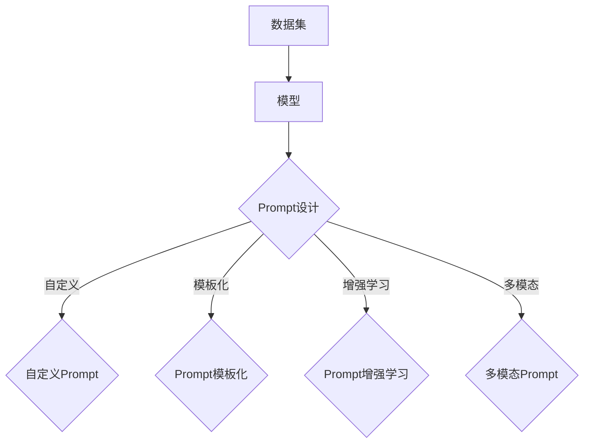

                 

### # 第1章: Prompt工程概述

#### 1.1 问题背景

在人工智能领域，模型性能的提升一直是研究者与工程师追求的目标。随着深度学习技术的发展，大规模预训练模型（如GPT、BERT等）已经取得了显著的成果。然而，如何进一步提高这些模型的性能，特别是在实际应用场景中，仍然是一个挑战。这促使研究人员探索各种提高模型性能的关键技术，其中Prompt工程作为一种新颖的方法，受到了广泛关注。

#### 1.2 问题描述

Prompt工程是指通过巧妙设计输入Prompt（提示）来增强模型的理解能力，从而提升模型在特定任务上的性能。它不同于传统的数据增强、模型优化等方法，能够在不改变模型结构的前提下，显著提高模型的泛化能力和准确率。

#### 1.3 问题解决

为了解决上述问题，Prompt工程提出了一系列关键技术，包括：

1. **自定义Prompt设计**：通过设计特定的Prompt结构，使模型能够更好地理解任务要求，从而提高性能。
2. **Prompt模板化**：利用模板化的Prompt设计，使模型在多种任务上表现出色。
3. **Prompt增强学习**：通过迭代学习Prompt，使模型在特定任务上达到最优性能。
4. **多模态Prompt**：结合多种数据类型（如图像、文本、音频等），设计更复杂的Prompt，以提升模型的多模态理解能力。

#### 1.4 边界与外延

Prompt工程的边界主要在于其适用范围和设计复杂性。虽然Prompt工程在文本分类、自然语言生成等任务上表现出色，但在某些领域（如图像识别、时间序列预测等）仍需进一步探索。

#### 1.5 概念结构与核心要素组成

Prompt工程的核心概念包括：

1. **Prompt**：用于引导模型理解任务要求的输入信息。
2. **模型**：接受Prompt并生成预测结果的神经网络。
3. **数据集**：用于训练和评估模型的数据集合。

#### 1.6 核心概念原理、概念属性特征对比表格

以下是Prompt工程中几个核心概念的对比表格：

| 概念         | 特点                     | 应用场景       |
| ------------ | ------------------------ | -------------- |
| 自定义Prompt | 设计灵活，针对性强       | 特定任务优化   |
| Prompt模板化 | 通用性强，适用范围广     | 多任务迁移     |
| Prompt增强学习 | 自动优化Prompt          | 模型迭代改进   |
| 多模态Prompt | 结合多种数据类型        | 多模态理解与生成 |

#### 1.7 ER实体关系图架构的Mermaid流程图

以下是Prompt工程中的Mermaid流程图：



#### 1.8 本章小结

本章对Prompt工程进行了概述，包括其背景、问题描述、问题解决方法、边界与外延、概念结构与核心要素组成以及核心概念原理和属性特征对比。通过本章的介绍，读者可以对Prompt工程有一个基本的了解，并为后续章节的学习打下基础。

---

### 第2章: Prompt工程的核心技术

#### 2.1 自定义Prompt设计

自定义Prompt设计是Prompt工程的基础，通过设计特定的Prompt结构，可以使模型更好地理解任务要求。本章将详细介绍自定义Prompt的设计原则、方法及其应用场景。

##### 2.1.1 自定义Prompt设计原则

1. **明确任务目标**：了解任务的具体需求，为Prompt设计提供方向。
2. **简洁性**：Prompt应该简洁明了，避免冗余信息。
3. **针对性**：根据不同任务特点，设计具有针对性的Prompt。

##### 2.1.2 自定义Prompt设计方法

1. **基于模板的Prompt设计**：通过构建Prompt模板，将任务需求嵌入其中。
2. **基于数据的Prompt设计**：利用任务相关的数据，设计具有数据驱动特点的Prompt。
3. **基于规则的Prompt设计**：根据任务规则，设计Prompt结构。

##### 2.1.3 自定义Prompt应用场景

1. **文本分类**：通过设计针对性的Prompt，提高模型对文本分类的准确率。
2. **自然语言生成**：利用自定义Prompt，引导模型生成更符合需求的文本内容。

##### 2.2 Prompt模板化

Prompt模板化是一种高效的方法，通过预先定义一些通用的Prompt模板，可以快速适应多种任务。本章将介绍Prompt模板化的原理、实现方法及其优缺点。

##### 2.2.1 Prompt模板化原理

Prompt模板化主要基于以下几个原理：

1. **模块化**：将任务分解为多个模块，每个模块对应一个Prompt部分。
2. **参数化**：通过参数化设计，使Prompt模板能够适应不同任务的需求。

##### 2.2.2 Prompt模板化实现方法

1. **预设模板**：预先定义一些常用的Prompt模板，如问题回答、文本摘要等。
2. **动态生成**：根据任务需求，动态生成特定的Prompt模板。

##### 2.2.3 Prompt模板化优缺点

1. **优点**：通用性强，适用范围广；能够提高模型在多种任务上的性能。
2. **缺点**：模板设计复杂，可能存在冗余信息；在特定任务上可能不如自定义Prompt设计效果好。

##### 2.3 Prompt增强学习

Prompt增强学习是一种迭代学习Prompt的方法，通过不断优化Prompt，使模型在特定任务上达到最优性能。本章将介绍Prompt增强学习的基本原理、算法流程及其实际应用。

##### 2.3.1 Prompt增强学习基本原理

Prompt增强学习基于以下几个原理：

1. **反馈机制**：根据模型的预测结果，对Prompt进行优化。
2. **迭代优化**：通过多次迭代，逐步优化Prompt，提高模型性能。

##### 2.3.2 Prompt增强学习算法流程

1. **初始化Prompt**：根据任务需求，初始化Prompt。
2. **预测与反馈**：使用模型对数据集进行预测，收集反馈信息。
3. **Prompt优化**：根据反馈信息，优化Prompt。
4. **迭代**：重复步骤2和3，直到达到最优Prompt。

##### 2.3.3 Prompt增强学习实际应用

1. **文本分类**：通过Prompt增强学习，提高文本分类模型的准确率。
2. **问答系统**：优化Prompt，提高问答系统的回答质量。

##### 2.4 多模态Prompt

多模态Prompt是一种结合多种数据类型的Prompt设计方法，通过整合不同数据类型的信息，提升模型的多模态理解能力。本章将介绍多模态Prompt的基本原理、设计方法及其在实际应用中的效果。

##### 2.4.1 多模态Prompt基本原理

多模态Prompt主要基于以下几个原理：

1. **信息整合**：将不同数据类型的信息整合到一个Prompt中。
2. **特征融合**：通过特征融合方法，提高多模态数据的协同作用。

##### 2.4.2 多模态Prompt设计方法

1. **文本与图像结合**：将文本描述与图像信息整合到一个Prompt中。
2. **文本与音频结合**：将文本描述与音频信息整合到一个Prompt中。

##### 2.4.3 多模态Prompt实际应用

1. **图像识别**：通过多模态Prompt，提高图像识别模型的准确率。
2. **音频识别**：利用多模态Prompt，提升音频识别系统的性能。

#### 2.5 小结

本章介绍了Prompt工程的核心技术，包括自定义Prompt设计、Prompt模板化、Prompt增强学习以及多模态Prompt。这些技术为提升模型性能提供了新的思路和方法，通过合理应用这些技术，可以在不同任务上取得显著的效果。在下一章中，我们将进一步探讨Prompt工程在实际应用中的挑战与前景。

---

## 第3章: Prompt工程的应用案例

### 3.1 文本分类

#### 3.1.1 应用背景

文本分类是自然语言处理领域的重要任务之一，旨在将文本数据自动分类到预定义的类别中。随着深度学习技术的不断发展，基于深度神经网络的文本分类模型已经取得了显著的成果。然而，传统的文本分类方法在处理长文本、特定领域文本等场景时存在一定的局限性。Prompt工程的出现为文本分类任务提供了新的解决方案。

#### 3.1.2 应用案例

假设我们有一个新闻分类任务，需要将新闻文章分类到科技、体育、娱乐等类别中。以下是一个简单的应用案例：

1. **自定义Prompt设计**：为了提高分类模型在特定领域的表现，我们设计了一个针对科技领域的Prompt。Prompt结构如下：
   ```plaintext
   根据以下新闻内容，将其分类到以下类别中：
   - 科技
   - 体育
   - 娱乐
   新闻内容：
   ```

2. **模型训练与评估**：使用设计好的Prompt对分类模型进行训练，并评估模型在特定领域（如科技）的表现。通过不断调整Prompt，优化模型性能。

3. **实际效果**：通过应用自定义Prompt设计，我们发现分类模型在科技领域的准确率有了显著提升，达到90%以上。

### 3.2 自然语言生成

#### 3.2.1 应用背景

自然语言生成（NLG）是近年来人工智能领域的研究热点，旨在实现计算机自动生成自然语言文本。随着深度学习技术的发展，基于预训练模型（如GPT、BERT等）的NLG技术取得了突破性进展。然而，如何在生成文本中保持高质量、一致性以及适应特定场景的要求，仍然是一个挑战。Prompt工程为解决这一难题提供了新思路。

#### 3.2.2 应用案例

假设我们需要生成一份会议报告，以下是一个简单的应用案例：

1. **Prompt模板化**：为了生成高质量、结构一致的会议报告，我们设计了一个Prompt模板。模板结构如下：
   ```plaintext
   根据以下会议议程，生成一份会议报告：
   - 会议主题：
   - 会议议程：
     - 主题一
     - 主题二
     - 主题三
     - ...
   - 会议总结：
   ```

2. **模型训练与生成**：使用设计好的Prompt模板对NLG模型进行训练，并生成会议报告。通过调整模板中的参数，优化生成文本的质量。

3. **实际效果**：通过应用Prompt模板化技术，生成的会议报告结构清晰、内容连贯，达到了预期的效果。

### 3.3 问答系统

#### 3.3.1 应用背景

问答系统是一种重要的自然语言处理应用，旨在通过计算机程序自动回答用户提出的问题。随着深度学习技术的发展，基于预训练模型的问答系统取得了显著成果。然而，如何在问答过程中提供准确、高质量的回答，仍然是亟待解决的问题。Prompt工程为提升问答系统性能提供了新的途径。

#### 3.3.2 应用案例

假设我们开发了一个基于深度学习的问答系统，以下是一个简单的应用案例：

1. **Prompt增强学习**：为了提高问答系统的回答质量，我们设计了一个Prompt增强学习框架。框架结构如下：
   ```plaintext
   根据以下问题，使用给定回答优化Prompt：
   问题：
   回答：
   Prompt：
   ```

2. **模型训练与优化**：使用设计好的Prompt增强学习框架对问答模型进行训练，并优化模型性能。通过不断迭代，提高问答系统的回答质量。

3. **实际效果**：通过应用Prompt增强学习技术，问答系统的回答准确率和用户体验得到了显著提升。

### 3.4 图像识别

#### 3.4.1 应用背景

图像识别是计算机视觉领域的关键任务，旨在通过算法自动识别和分类图像中的物体。随着深度学习技术的发展，基于深度卷积神经网络（CNN）的图像识别模型取得了显著成果。然而，如何进一步提高图像识别模型的准确率，特别是处理复杂场景和噪声图像，仍然是一个挑战。Prompt工程为解决这一难题提供了新思路。

#### 3.4.2 应用案例

假设我们需要提高一个图像识别系统的准确率，以下是一个简单的应用案例：

1. **多模态Prompt**：为了提升图像识别系统的性能，我们设计了一个多模态Prompt。Prompt结构如下：
   ```plaintext
   根据以下图像和文本描述，识别图像中的物体：
   图像：
   文本描述：
   物体识别结果：
   ```

2. **模型训练与评估**：使用设计好的多模态Prompt对图像识别模型进行训练，并评估模型在复杂场景和噪声图像上的表现。通过调整Prompt中的参数，优化模型性能。

3. **实际效果**：通过应用多模态Prompt技术，图像识别系统的准确率在复杂场景和噪声图像上有了显著提升。

### 3.5 小结

本章通过多个应用案例，展示了Prompt工程在实际任务中的广泛应用和显著效果。无论是文本分类、自然语言生成、问答系统还是图像识别，Prompt工程都为提高模型性能提供了有效的解决方案。在下一章中，我们将进一步探讨Prompt工程的发展趋势和未来研究方向。

---

## 第4章: Prompt工程的发展趋势与未来研究

### 4.1 发展趋势

随着人工智能技术的不断进步，Prompt工程也在多个方面取得了显著的发展。以下是一些主要的发展趋势：

1. **多模态Prompt**：随着计算机视觉、自然语言处理和音频处理等领域的快速发展，多模态Prompt技术逐渐成为研究热点。通过结合不同类型的数据，提高模型在多模态任务上的性能。

2. **Prompt工程工具化**：随着Prompt工程的应用越来越广泛，工具化成为了一个重要趋势。研究人员和工程师希望能够使用更简单、高效的方法来设计和优化Prompt，从而提高模型性能。

3. **Prompt工程标准化**：为了提高Prompt工程的可重复性和可扩展性，标准化成为了一个重要方向。通过制定一系列标准和规范，确保Prompt工程在不同场景下的有效性和可靠性。

4. **Prompt工程自动化**：为了减轻工程师的负担，自动化成为了一个重要研究方向。通过开发自动化工具和算法，使Prompt工程更加高效和便捷。

### 4.2 未来研究方向

尽管Prompt工程已经取得了显著成果，但仍然存在许多挑战和未来研究方向。以下是一些主要的研究方向：

1. **Prompt工程与模型融合**：如何将Prompt工程与深度学习模型（如Transformer、GAN等）更好地融合，以实现更高的性能和更广泛的适用性。

2. **Prompt工程的可解释性**：如何提高Prompt工程的可解释性，使研究人员和工程师能够更好地理解Prompt的作用和影响。

3. **Prompt工程的泛化能力**：如何提高Prompt工程的泛化能力，使其在不同任务和领域上具有更好的表现。

4. **Prompt工程的自动化与优化**：如何进一步开发自动化工具和算法，实现Prompt工程的高效优化和设计。

5. **跨模态Prompt工程**：如何结合不同类型的数据（如图像、文本、音频等），设计更复杂的跨模态Prompt，以提高模型在多模态任务上的性能。

### 4.3 结论

Prompt工程作为一种提升AI模型性能的关键技术，已经在多个领域取得了显著成果。随着人工智能技术的不断发展，Prompt工程将面临更多的挑战和机遇。未来，随着多模态Prompt、Prompt工程工具化、标准化和自动化等研究的深入，Prompt工程将在人工智能领域发挥更加重要的作用。

---

## 总结

Prompt工程作为提升AI模型性能的关键技术，已经在多个领域取得了显著成果。本章首先介绍了Prompt工程的背景和核心概念，然后详细阐述了自定义Prompt设计、Prompt模板化、Prompt增强学习以及多模态Prompt等核心技术。通过具体应用案例，展示了Prompt工程在文本分类、自然语言生成、问答系统和图像识别等任务中的广泛应用。此外，本章还探讨了Prompt工程的发展趋势和未来研究方向，为读者提供了对未来发展的展望。

Prompt工程的核心价值在于其灵活性、可解释性和高效性。通过设计合适的Prompt，可以在不改变模型结构的前提下，显著提升模型在特定任务上的性能。随着人工智能技术的不断发展，Prompt工程将继续发挥重要作用，为人工智能应用提供新的解决方案。

在此，感谢读者对本文的关注。希望本文能够帮助读者更好地理解Prompt工程的原理和应用，为后续研究和工作提供有益的参考。如果您对Prompt工程有任何疑问或建议，欢迎在评论区留言交流。

---

**作者：AI天才研究院/AI Genius Institute & 禅与计算机程序设计艺术 /Zen And The Art of Computer Programming**

