                 

### 1.1 Background and Importance of Prompt Engineering

**背景介绍**

Prompt Engineering，即提示工程，是近年来在人工智能领域兴起的一个重要研究方向。随着深度学习技术的飞速发展，特别是大型语言模型（LLM，Large Language Models）的出现，人类对于机器生成文本的能力有了前所未有的提升。然而，如何有效地利用这些模型生成高质量的文本，仍是一个亟待解决的问题。

Prompt Engineering 的核心思想是通过精心设计的提示（prompts），引导语言模型生成所需的内容。提示不仅决定了模型输出的方向和内容，还在很大程度上影响了模型的生成效率。因此，Prompt Engineering 在提升 LLM 应用效率方面具有至关重要的作用。

**问题背景**

在传统的机器学习应用中，数据驱动的方法往往依赖于大量标注数据。然而，在自然语言处理领域，尤其是大规模语言模型的应用中，这一方法面临巨大的挑战。首先，高质量标注数据的获取成本极高，且存在数据稀缺的问题。其次，自然语言的多样性和复杂性使得完全依赖数据标注难以实现模型的广泛适应性。

为了克服这些挑战，研究者们开始探索如何通过外部提示来引导模型生成。提示工程的方法应运而生，它通过提供明确的指导信息，帮助模型理解任务目标，从而在生成文本时具备更高的准确性和灵活性。

**问题描述**

Prompt Engineering 面临的主要问题包括：

1. **提示设计的有效性**：如何设计有效的提示，使得模型能够准确理解和执行任务指令。
2. **模型的适应性**：如何在不同的应用场景中，调整和优化提示，以适应特定的任务需求。
3. **生成效率**：如何在保证生成质量的同时，提高模型处理的效率，减少计算资源的使用。

**问题解决**

为了解决上述问题，Prompt Engineering 提出了一系列设计原则和技术手段：

1. **明确性和具体性**：提示应尽可能明确和具体，避免模糊和宽泛的描述，以便模型能够准确理解任务目标。
2. **可扩展性**：提示设计应具有可扩展性，便于在不同应用场景中进行调整和优化。
3. **适应性**：提示应能够根据不同的任务需求和环境动态调整，以提高模型的适应性。
4. **优化策略**：通过调整提示内容和格式，优化模型生成的效率和质量。

**边界与外延**

Prompt Engineering 的边界主要包括：

- **应用范围**：Prompt Engineering 适用于各类自然语言处理任务，如文本生成、问答系统、对话系统等。
- **技术范畴**：涉及提示设计、模型优化、任务导向的生成策略等多个技术领域。
- **研究领域**：与自然语言处理、机器学习、人工智能等多个学科密切相关。

**概念结构与核心要素组成**

Prompt Engineering 的概念结构主要包括以下核心要素：

- **提示**：设计的核心对象，用于引导模型生成。
- **模型**：接受提示并生成文本的对象，如大型语言模型。
- **任务**：Prompt Engineering 的目标，包括文本生成、问答、对话等。
- **数据**：用于训练模型和设计提示的数据源。

### 1.2 The Role of Prompts in LLM Applications

**核心概念与联系**

**核心概念**：Prompt 是指提供给语言模型的一段输入文本，用于引导模型生成相应的输出。在 LLM 应用中，Prompt 的设计至关重要，它不仅决定了模型的输出内容，还影响了模型的生成效率。

**概念属性特征对比表格**：

| 特征         | 描述                                                         | 对比               |
| ------------ | ------------------------------------------------------------ | ------------------ |
| **明确性**   | 提示应明确表达任务目标，避免模糊和宽泛的描述。               | 确定性提示 vs. 模糊提示 |
| **具体性**   | 提示应提供具体的信息，以便模型能够准确地生成内容。           | 概括性提示 vs. 具体提示 |
| **适应性**   | 提示应具备灵活性，能够适应不同的应用场景和任务需求。         | 固定型提示 vs. 适应性提示 |
| **有效性**   | 提示应有效引导模型生成高质量的内容，提高生成效率。           | 低效提示 vs. 高效提示 |

**ER实体关系图架构**：

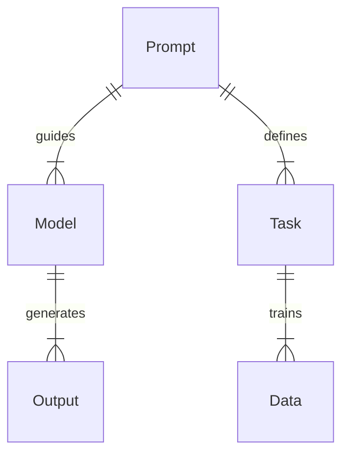

**算法原理讲解**

Prompt Engineering 的核心在于如何设计有效的提示。以下是一个基本的算法原理流程图：

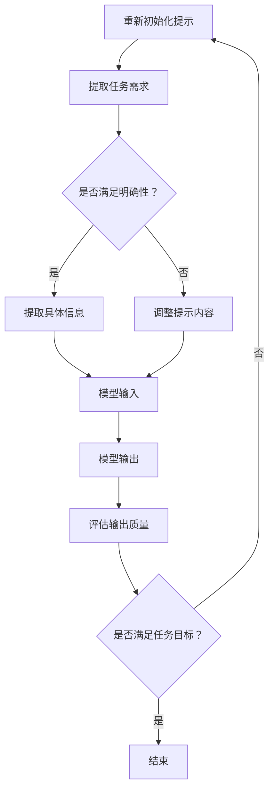

### 1.3 Types of Prompts and Their Applications

**核心概念与联系**

**核心概念**：Prompt 类型是指在不同的应用场景中，用于引导语言模型生成内容的不同形式的提示。常见的 Prompt 类型包括开放性提示、封闭性提示、上下文提示等。

**概念属性特征对比表格**：

| 提示类型     | 特征描述                                                       | 适用场景               |
| ------------ | ------------------------------------------------------------ | ---------------------- |
| **开放性提示** | 不提供具体的回答，鼓励模型自由生成多种可能的输出。           | 故事生成、创意写作     |
| **封闭性提示** | 提供具体的回答框架，限制模型的生成范围。                     | 数据标注、自动问答     |
| **上下文提示** | 提供与任务相关的背景信息，帮助模型更好地理解任务上下文。     | 对话系统、内容审核     |

**ER实体关系图架构**：

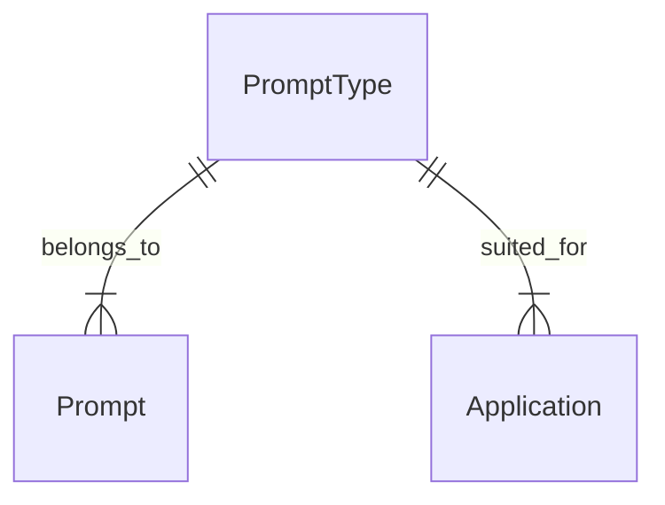

**算法原理讲解**

不同类型的 Prompt 对于模型生成的影响是不同的。以下是一个简单的算法原理流程图，展示了不同类型 Prompt 的应用：

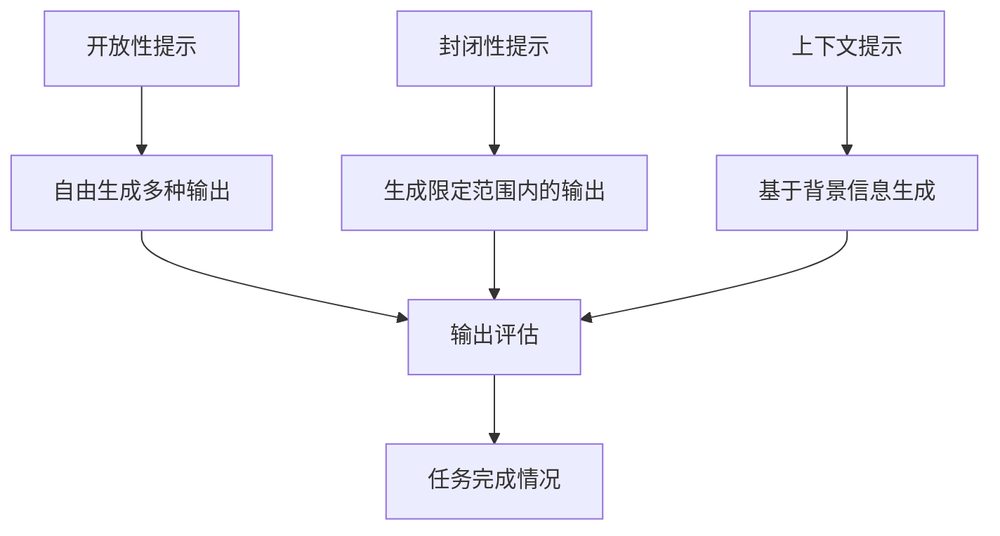

### 1.4 Design Principles of Effective Prompts

**核心概念与联系**

**核心概念**：Effective Prompt Design 是指通过一系列设计原则，创造出能够有效引导模型生成高质量内容的提示。有效的 Prompt 设计不仅能够提高模型的生成效率，还能确保生成文本的准确性和多样性。

**概念属性特征对比表格**：

| 设计原则 | 特征描述 | 对比 |
| -------- | -------- | ---- |
| **明确性** | 提示应清晰表达任务目标，避免模糊和宽泛的描述。 | 确定性提示 vs. 模糊提示 |
| **具体性** | 提示应提供具体的信息，使模型能够准确生成内容。 | 概括性提示 vs. 具体提示 |
| **适应性** | 提示应具备灵活性，能够适应不同应用场景的需求。 | 固定型提示 vs. 适应性提示 |
| **多样性** | 提示应鼓励模型生成多样性的输出，避免单调和重复。 | 单调提示 vs. 多样性提示 |
| **优化性** | 提示应不断优化，以提高模型生成效率和生成质量。 | 低效提示 vs. 高效提示 |

**ER实体关系图架构**：

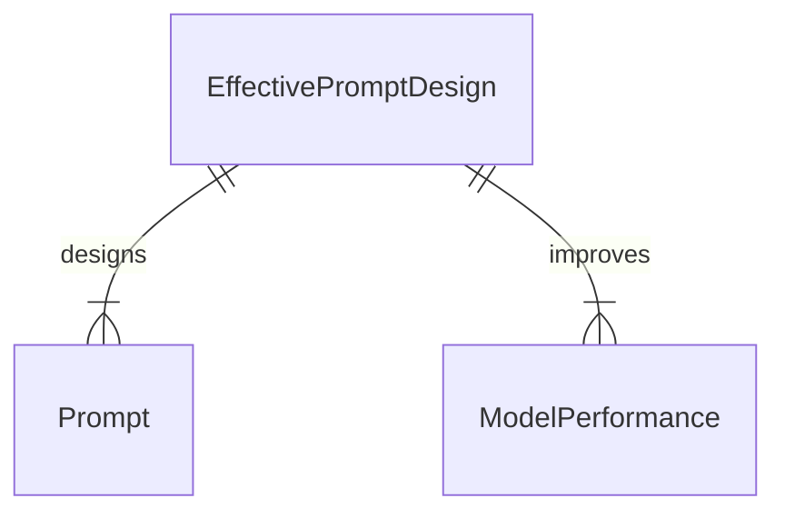

**算法原理讲解**

Effective Prompt Design 的核心在于如何根据任务需求和环境动态调整提示。以下是一个基本的算法原理流程图：

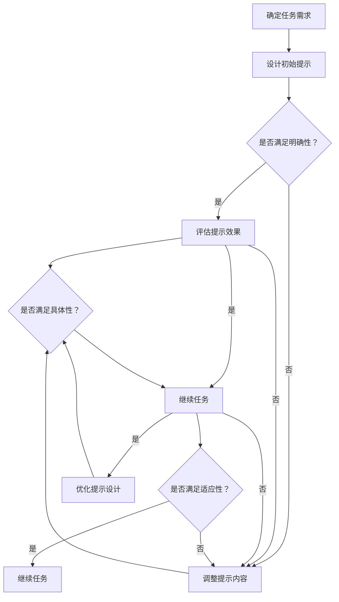

通过以上设计原则和算法原理，可以创造出更加有效的 Prompt，从而提升 LLM 应用的整体效率。

### 1.5 Techniques for Enhancing Prompt Engineering Efficiency

**核心概念与联系**

**核心概念**：Prompt Engineering Efficiency 是指通过一系列技术和方法，提升 Prompt 设计和应用的效率。有效的 Prompt Engineering 不但能够节省开发时间，还能提高模型的生成质量。

**概念属性特征对比表格**：

| 技术方法 | 特征描述 | 对比 |
| -------- | -------- | ---- |
| **自动化工具** | 使用工具自动生成和优化提示，减少手动设计的工作量。 | 手动设计 vs. 自动化工具 |
| **模板化设计** | 预先设计好模板，根据任务需求进行快速填充，提高设计效率。 | 手动填充 vs. 模板化设计 |
| **数据增强** | 使用数据增强技术，生成更多样化的提示数据，提高模型的适应性。 | 纯数据 vs. 数据增强 |
| **模型微调** | 在特定任务上对模型进行微调，使其更适应特定场景。 | 一致模型 vs. 微调模型 |

**ER实体关系图架构**：

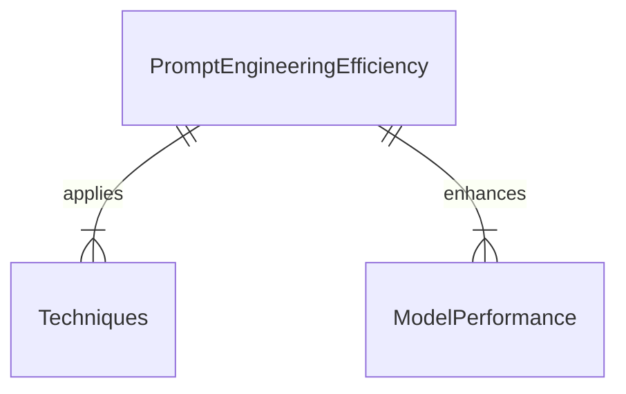

**算法原理讲解**

以下是提升 Prompt Engineering 效率的几个关键技术和算法原理：

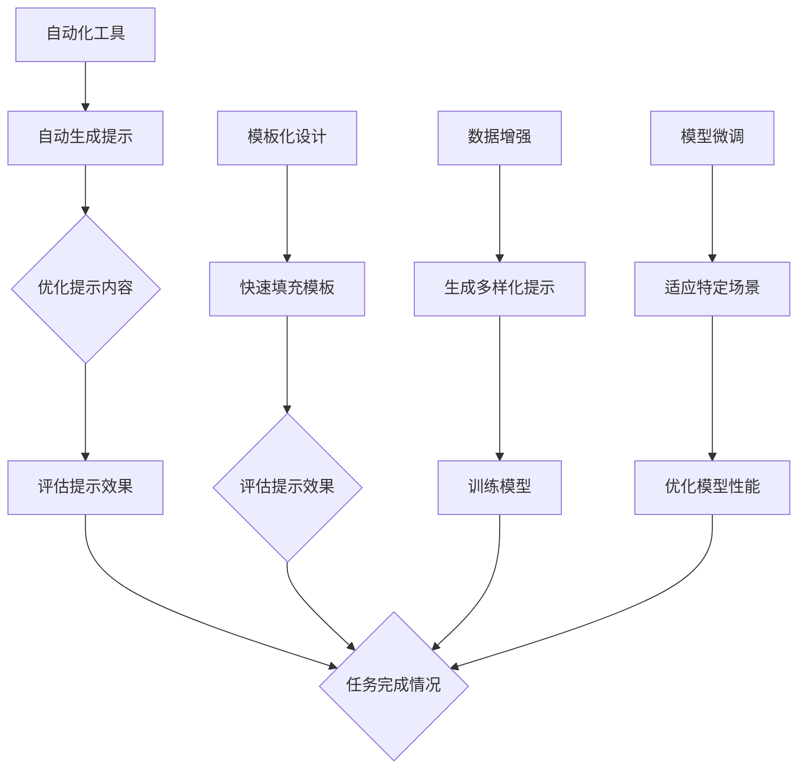

通过自动化工具、模板化设计、数据增强和模型微调等技术，可以显著提升 Prompt Engineering 的效率，从而在保证质量的同时提高生产效率。

### 1.6 Application Scenarios of Prompt Engineering in Real-World Projects

**核心概念与联系**

**核心概念**：Prompt Engineering 在实际应用场景中的使用，指的是如何将精心设计的提示应用于具体的工业项目和任务中，以达到提升模型性能和优化生成效果的目标。

**概念属性特征对比表格**：

| 应用场景        | 特征描述                                           | 对比                          |
| --------------- | --------------------------------------------------- | ----------------------------- |
| **文本生成**    | 使用提示引导模型生成高质量、多样化的文本。           | 数据驱动生成 vs. 提示驱动生成 |
| **问答系统**    | 通过提示优化问题理解和答案生成过程，提高系统的准确性。 | 数据集驱动 vs. 提示优化驱动   |
| **对话系统**    | 利用上下文提示提升对话的连贯性和交互质量。           | 单轮对话 vs. 多轮对话优化     |
| **内容审核**    | 设计提示帮助模型更准确地识别和过滤不良内容。           | 完全依赖规则 vs. 提示辅助决策 |

**ER实体关系图架构**：

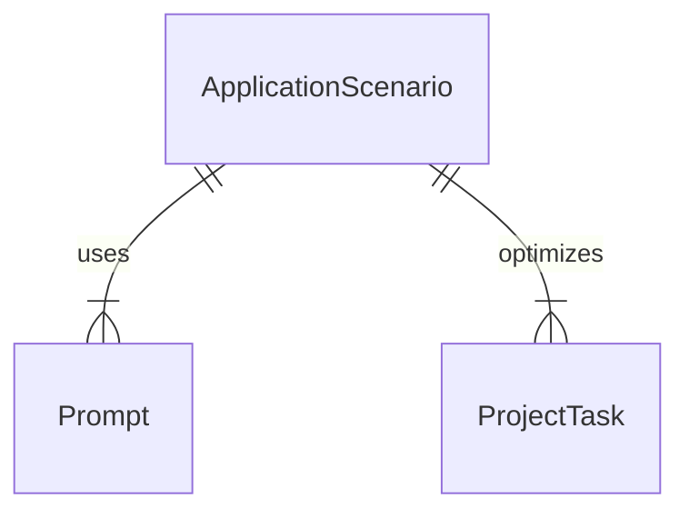

**算法原理讲解**

以下是 Prompt Engineering 在几个典型应用场景中的具体算法原理讲解：

1. **文本生成**：

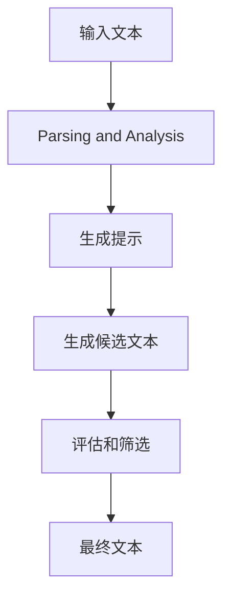

在文本生成过程中，通过解析和分析输入文本，设计相应的提示，然后生成多个候选文本，最后评估和筛选出最优文本。

2. **问答系统**：

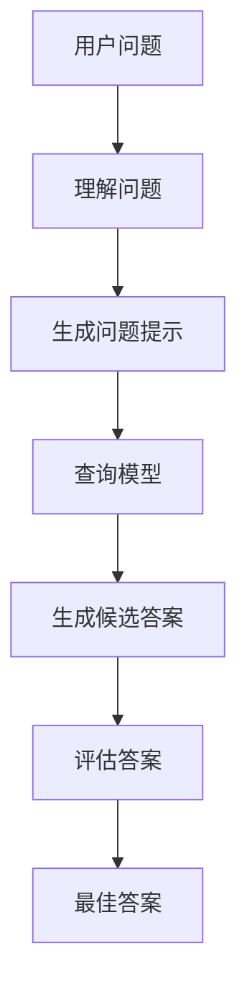

在问答系统中，首先理解用户提出的问题，通过设计问题提示引导模型生成答案，然后评估和筛选出最佳答案。

3. **对话系统**：

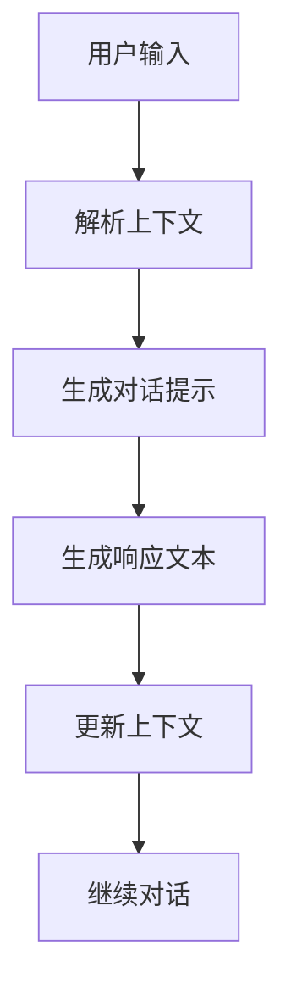

在对话系统中，通过解析用户输入和上下文，设计对话提示，生成响应文本，并更新上下文，以维持连贯的对话。

通过这些具体的算法原理讲解，可以看出 Prompt Engineering 在不同应用场景中的关键作用，帮助实现任务优化和性能提升。

### 1.7 Conclusion and Future Directions of Prompt Engineering

**总结**

Prompt Engineering 是提升大型语言模型（LLM）应用效率的关键技术。通过设计有效的提示，可以显著提高模型生成文本的质量和效率，满足多样化的应用需求。本文从背景介绍、核心概念、类型分析、设计原则、技术手段和实际应用等多个角度，系统阐述了 Prompt Engineering 的理论和实践。

**未来方向**

1. **更精细化的提示设计**：随着对 LLM 理解的深入，未来可以开发更加精细化的提示设计方法，以提高模型的生成质量和效率。
2. **跨模态提示工程**：探索将文本提示扩展到其他模态（如图像、音频等），实现跨模态生成和交互。
3. **自动化和智能化**：开发更先进的自动化工具和算法，实现提示生成的自动化和智能化，降低人工干预的成本。
4. **隐私保护和安全性**：在提升模型性能的同时，关注提示工程中的隐私保护和安全性问题，确保数据安全。
5. **行业定制化**：针对不同行业的特定需求，设计定制化的提示工程解决方案，提升行业应用效率。

通过持续的研究和实践，Prompt Engineering 将在人工智能领域发挥更加重要的作用，推动自然语言处理和智能对话系统的发展。

