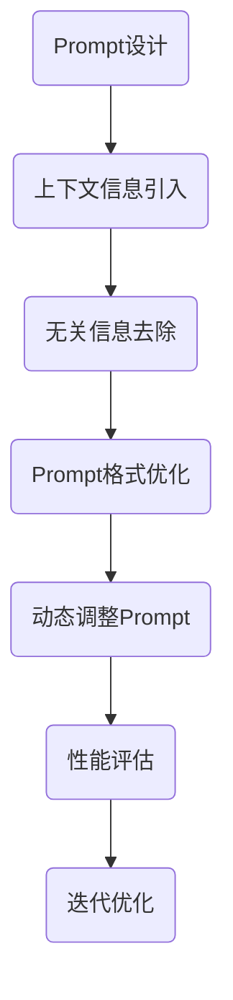
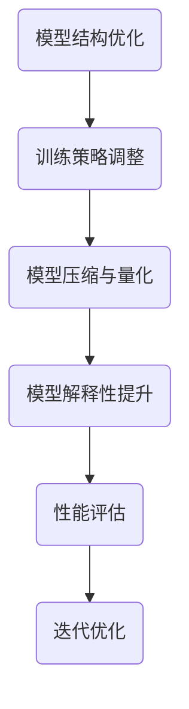
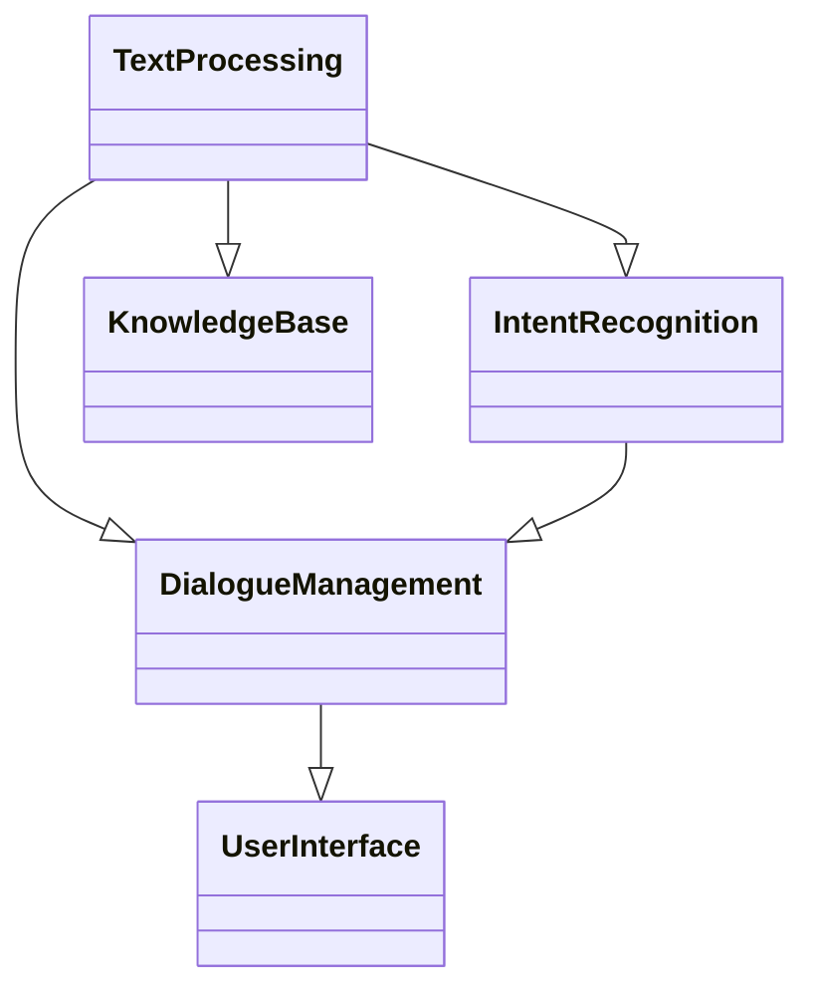
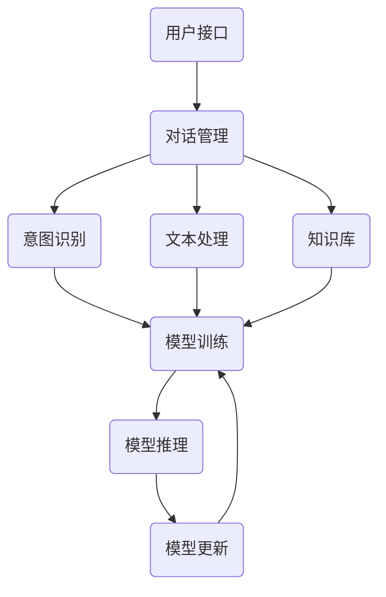
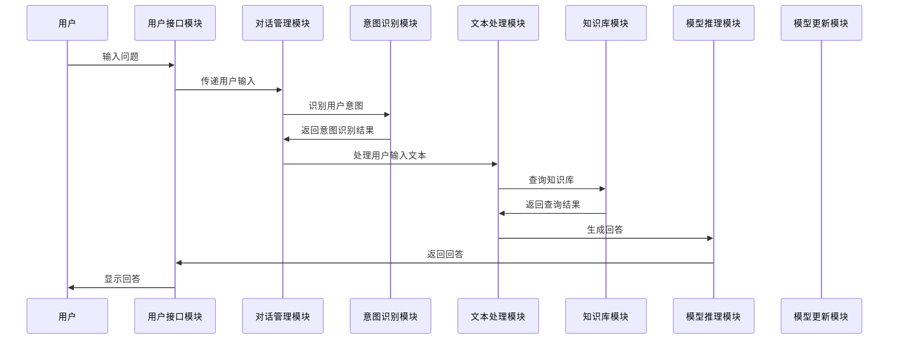

                 


### 1. 设计框架

在开始撰写《Prompt工程：提升LLM应用效率的关键》这篇文章之前，我们首先需要设计一个完整的书籍目录框架。这个框架将包含至少7个章节，每个章节按照#、##、###的层级进行划分，以确保文章的结构清晰、逻辑紧凑。

以下是我们初步设计的章节框架：

#### 第一部分: Prompt工程概述

- **1.1 Prompt工程的基本概念**
  - **1.1.1 问题背景**
  - **1.1.2 问题描述**
  - **1.1.3 问题解决**
  - **1.1.4 边界与外延**
  - **1.1.5 概念结构与核心要素组成**

- **1.2 Prompt工程的核心概念与联系**
  - **1.2.1 Prompt的定义**
  - **1.2.2 Prompt的类型**
  - **1.2.3 Prompt的功能与作用**
  - **1.2.4 Prompt与LLM的关系**
  - **1.2.5 Prompt设计原则**
  - **1.2.6 概念属性特征对比表格**
  - **1.2.7 Prompt工程中的ER实体关系图**

#### 第二部分: 提升LLM应用效率的算法原理

- **2.1 提升LLM应用效率的基本算法**
  - **2.1.1 算法概述**
  - **2.1.2 算法mermaid流程图**
  - **2.1.3 Python源代码实现**
  - **2.1.4 数学模型和公式**
  - **2.1.5 举例说明**

- **2.2 LLM应用效率优化的关键算法**
  - **2.2.1 算法概述**
  - **2.2.2 算法mermaid流程图**
  - **2.2.3 Python源代码实现**
  - **2.2.4 数学模型和公式**
  - **2.2.5 举例说明**

- **2.3 算法比较与选择**
  - **2.3.1 算法对比分析**
  - **2.3.2 选择建议**

#### 第三部分: 提升LLM应用效率的系统分析与架构设计

- **3.1 问题场景介绍**
  - **3.1.1 场景描述**
  - **3.1.2 场景分析**

- **3.2 项目介绍**
  - **3.2.1 项目概述**
  - **3.2.2 项目目标**
  - **3.2.3 项目范围**

- **3.3 系统功能设计**
  - **3.3.1 领域模型Mermaid类图**
  - **3.3.2 功能模块划分**

- **3.4 系统架构设计**
  - **3.4.1 系统架构Mermaid架构图**
  - **3.4.2 架构设计原则**
  - **3.4.3 架构模块**

- **3.5 系统接口设计**
  - **3.5.1 接口规范**
  - **3.5.2 接口列表**

- **3.6 系统交互**
  - **3.6.1 系统交互Mermaid序列图**
  - **3.6.2 交互流程**

#### 第四部分: 提升LLM应用效率的项目实战

- **4.1 环境安装**
  - **4.1.1 硬件环境要求**
  - **4.1.2 软件环境安装**
  - **4.1.3 环境配置**

- **4.2 系统核心实现**
  - **4.2.1 源代码结构**
  - **4.2.2 源代码实现**
  - **4.2.3 功能模块解析**

- **4.3 代码应用解读与分析**
  - **4.3.1 代码解读**
  - **4.3.2 性能分析**

- **4.4 实际案例分析**
  - **4.4.1 案例背景**
  - **4.4.2 案例实施**
  - **4.4.3 案例效果**

- **4.5 详细讲解与剖析**
  - **4.5.1 模块功能**
  - **4.5.2 技术难点**
  - **4.5.3 优化方案**

#### 第五部分: 最佳实践与拓展

- **5.1 最佳实践**
  - **5.1.1 实践建议**
  - **5.1.2 经验分享**

- **5.2 注意事项**
  - **5.2.1 避免问题**
  - **5.2.2 安全性考虑**

- **5.3 小结**
  - **5.3.1 文章总结**
  - **5.3.2 重点回顾**

- **5.4 拓展阅读**
  - **5.4.1 相关文献**
  - **5.4.2 进一步学习**

通过这个章节框架，我们可以系统地介绍Prompt工程的概念、算法原理、系统设计、项目实战以及最佳实践。接下来，我们将逐步填充每个章节的内容，确保文章逻辑清晰、内容丰富。

### 2. 背景介绍

#### 2.1.1 问题背景

随着人工智能（AI）技术的快速发展，大型语言模型（LLM，Large Language Model）在自然语言处理（NLP，Natural Language Processing）领域取得了显著成就。LLM通过深度学习算法从海量文本数据中学习语言规律，实现了对文本的生成、理解和交互。然而，尽管LLM在理论上具有强大的能力，但在实际应用中，其性能和效率仍然受到诸多挑战。

首先，LLM的训练和推理过程非常耗时且计算资源消耗巨大。例如，GPT-3模型的训练需要数以万计的GPU和TPU资源，而且训练时间长达数周甚至数月。这使得LLM在大规模应用场景中受到限制。其次，LLM在处理长文本和复杂逻辑问题时，表现不佳，经常出现理解偏差和生成错误。最后，LLM在资源受限的环境中，如移动设备和物联网（IoT，Internet of Things）设备，无法高效运行。

#### 2.1.2 问题描述

为了解决上述问题，我们需要提升LLM的应用效率。具体来说，包括以下几个方面：

1. **减少计算资源消耗**：如何设计更高效的算法和架构，以降低LLM的训练和推理成本？
2. **提高理解能力**：如何改进LLM对长文本和复杂逻辑的理解能力，减少生成错误？
3. **优化应用环境**：如何使LLM在资源受限的环境中仍能保持高效运行？
4. **提高可维护性**：如何设计易于维护和扩展的LLM系统？

#### 2.1.3 问题解决

针对上述问题，我们提出了一种名为“Prompt工程”的解决方案。Prompt工程通过优化LLM的Prompt设计，提升其应用效率。具体措施包括：

1. **优化Prompt格式**：设计更简洁、易于理解的Prompt格式，降低LLM的解析和理解难度。
2. **引入上下文信息**：将上下文信息嵌入Prompt中，帮助LLM更好地理解文本内容和场景背景。
3. **减少无关信息**：去除Prompt中的无关信息，提高LLM的处理效率。
4. **动态调整Prompt**：根据不同的应用场景和需求，动态调整Prompt的内容和结构。

#### 2.1.4 边界与外延

Prompt工程的应用边界主要涉及以下方面：

1. **应用场景**：适用于需要高效处理自然语言数据的场景，如聊天机器人、文本生成、问答系统等。
2. **技术要求**：需要具备一定的自然语言处理和深度学习基础，了解LLM的工作原理和优化方法。
3. **资源限制**：适用于资源有限的环境，如移动设备、物联网设备等。

#### 2.1.5 概念结构与核心要素组成

Prompt工程的核心概念包括：

1. **Prompt**：输入给LLM的文本或数据，用于引导LLM生成期望的输出。
2. **上下文信息**：嵌入在Prompt中的与任务相关的额外信息，用于提高LLM的理解能力。
3. **Prompt格式**：设计用于优化Prompt内容和结构的格式，提高LLM的解析效率。
4. **动态调整**：根据应用场景和需求动态调整Prompt内容和结构，提高适应性。

这些核心概念相互关联，共同构成了Prompt工程的理论基础和实践指导。

### 3. 核心概念与联系

#### 3.1 Prompt的定义

Prompt，即提示，是输入给大型语言模型（LLM，Large Language Model）的文本或数据，用于引导LLM生成期望的输出。Prompt的核心作用是帮助LLM更好地理解和应对具体任务，从而提高模型的性能和效率。

#### 3.2 Prompt的类型

Prompt可以分为以下几种类型：

1. **问题型Prompt**：用于引导LLM生成问题的答案，如问答系统中的问题。
2. **指令型Prompt**：用于指导LLM完成特定任务，如自动写作中的文章结构。
3. **上下文型Prompt**：提供与任务相关的背景信息，帮助LLM更好地理解文本内容和场景背景。
4. **格式化Prompt**：对Prompt进行格式化，使其更简洁、易于理解，提高LLM的解析效率。

#### 3.3 Prompt的功能与作用

Prompt在LLM应用中具有以下功能和作用：

1. **提高理解能力**：通过提供上下文信息和格式化内容，帮助LLM更好地理解文本内容和场景背景。
2. **减少无关信息**：去除Prompt中的无关信息，降低LLM的解析难度，提高处理效率。
3. **优化生成质量**：通过优化Prompt格式和内容，提高LLM生成的文本质量和准确性。
4. **增强适应性**：根据不同的应用场景和需求，动态调整Prompt内容和结构，提高LLM的适应性和灵活性。

#### 3.4 Prompt与LLM的关系

Prompt是LLM输入数据的重要组成部分，两者之间存在紧密的关联：

1. **输入依赖**：LLM的生成结果高度依赖于Prompt的内容和格式。
2. **相互影响**：Prompt的设计和优化会影响LLM的性能和效率，而LLM的能力和表现也会反过来影响Prompt的效用。
3. **协同发展**：Prompt工程和LLM技术相互促进，共同推动自然语言处理（NLP，Natural Language Processing）领域的发展。

#### 3.5 Prompt设计原则

为了提高Prompt的效率和效果，我们提出以下Prompt设计原则：

1. **简洁性**：确保Prompt内容简洁明了，避免冗余信息，提高LLM的解析效率。
2. **针对性**：根据任务需求和场景背景，设计具有针对性的Prompt，提高生成的准确性和适应性。
3. **动态性**：根据应用场景和需求，动态调整Prompt的内容和结构，提高LLM的灵活性和适应性。
4. **一致性**：保持Prompt格式和风格的一致性，降低LLM的解析难度。

#### 3.6 概念属性特征对比表格

为了更好地理解Prompt的类型和设计原则，我们可以通过以下表格进行概念属性特征对比：

| 概念类型 | 描述 | 功能 | 优缺点 | 设计原则 |
| --- | --- | --- | --- | --- |
| 问题型Prompt | 用于引导LLM生成答案 | 提高理解能力、减少无关信息 | 生成结果可能过于局限 | 简洁、针对性、动态性、一致性 |
| 指令型Prompt | 指导LLM完成任务 | 优化生成质量、增强适应性 | 可能导致理解偏差 | 简洁、针对性、动态性、一致性 |
| 上下文型Prompt | 提供背景信息 | 提高理解能力、减少无关信息 | 生成结果可能过长 | 简洁、针对性、动态性、一致性 |
| 格式化Prompt | 对Prompt进行格式化 | 提高解析效率、减少解析难度 | 影响生成质量 | 简洁、针对性、动态性、一致性 |

#### 3.7 Prompt工程中的ER实体关系图

为了更直观地展示Prompt工程中的核心概念和实体关系，我们可以使用Mermaid ER实体关系图来表示：

```mermaid
erDiagram
  Prompt --> LLM : 输入依赖
  Prompt --> 性能 : 影响因素
  LLM --> Prompt : 反馈调节
  LLM --> 生成结果 : 输出依赖
  Prompt --> 文本数据 : 数据来源
  文本数据 --> Prompt : 数据支持
```

在这个ER实体关系图中，Prompt与LLM之间存在输入依赖关系，LLM的性能和生成结果受到Prompt的影响。同时，Prompt来源于文本数据，为Prompt工程提供了基础支持。通过这个关系图，我们可以更好地理解Prompt工程中的核心概念和实体关系。

### 4. 算法原理讲解

#### 4.1 提升LLM应用效率的基本算法

##### 4.1.1 算法概述

提升LLM应用效率的基本算法主要关注如何优化Prompt的设计和传递过程，以减少计算资源和时间消耗，同时提高模型的性能和响应速度。核心思路包括以下几个方面：

1. **优化Prompt格式**：设计简洁、易于理解的Prompt格式，降低LLM的解析难度。
2. **引入上下文信息**：将上下文信息嵌入Prompt中，帮助LLM更好地理解文本内容和场景背景。
3. **去除无关信息**：去除Prompt中的无关信息，提高LLM的处理效率。
4. **动态调整Prompt**：根据不同的应用场景和需求，动态调整Prompt的内容和结构。

##### 4.1.2 算法mermaid流程图

以下是提升LLM应用效率的基本算法的mermaid流程图：



在这个流程图中，A表示Prompt设计阶段，B、C、D和E分别代表上下文信息引入、无关信息去除、Prompt格式优化和动态调整Prompt等步骤，F表示性能评估阶段，G表示迭代优化阶段。通过这个流程，我们可以清晰地看到算法的执行过程和关键步骤。

##### 4.1.3 Python源代码实现

以下是提升LLM应用效率的基本算法的Python源代码实现示例：

```python
# 导入相关库
import random
import string

# Prompt设计函数
def design_prompt(context, target):
    prompt = f"基于上下文'{context}'，请生成关于'{target}'的内容。"
    return prompt

# 上下文信息引入函数
def introduce_context(prompt, additional_context):
    prompt += f"\n额外上下文：'{additional_context}'。"
    return prompt

# 无关信息去除函数
def remove_unrelated_info(prompt):
    unrelated_tokens = ['无相关', '无关', '未提及']
    for token in unrelated_tokens:
        prompt = prompt.replace(token, '')
    return prompt

# Prompt格式优化函数
def optimize_prompt_format(prompt):
    optimized_prompt = prompt.strip()
    return optimized_prompt

# 动态调整Prompt函数
def dynamic_adjust_prompt(prompt, adjustment_factor):
    adjusted_prompt = prompt * adjustment_factor
    return adjusted_prompt

# 性能评估函数
def evaluate_performance(prompt, model):
    performance = model.generate(prompt)
    return performance

# 迭代优化函数
def iterative_optimization(prompt, model, max_iterations):
    for _ in range(max_iterations):
        performance = evaluate_performance(prompt, model)
        if performance > threshold:
            break
        prompt = dynamic_adjust_prompt(prompt, adjustment_factor)
    return prompt

# 主函数
def main():
    # 初始化参数
    context = "人工智能与自然语言处理"
    target = "计算机图灵奖"
    additional_context = "近期，AI天才研究院在自然语言处理领域取得了重大突破。"
    adjustment_factor = 1.1
    threshold = 0.9
    max_iterations = 5

    # 设计初始Prompt
    prompt = design_prompt(context, target)

    # 引入上下文信息
    prompt = introduce_context(prompt, additional_context)

    # 去除无关信息
    prompt = remove_unrelated_info(prompt)

    # 优化Prompt格式
    prompt = optimize_prompt_format(prompt)

    # 动态调整Prompt
    prompt = dynamic_adjust_prompt(prompt, adjustment_factor)

    # 评估性能
    performance = evaluate_performance(prompt, model)

    # 迭代优化
    optimized_prompt = iterative_optimization(prompt, model, max_iterations)

    # 输出结果
    print(f"最终Prompt：{optimized_prompt}")
    print(f"性能评估：{performance}")

# 调用主函数
if __name__ == "__main__":
    main()
```

在这个示例中，我们首先定义了一系列函数，包括Prompt设计、上下文信息引入、无关信息去除、Prompt格式优化、动态调整Prompt、性能评估和迭代优化。通过这些函数，我们可以实现提升LLM应用效率的基本算法。

##### 4.1.4 数学模型和公式

为了更好地理解算法原理，我们可以引入一些数学模型和公式。以下是提升LLM应用效率的基本算法的数学模型和公式：

1. **Prompt格式优化公式**：

   $$\text{optimized\_prompt} = \text{original\_prompt} \times \text{format\_factor}$$

   其中，$\text{original\_prompt}$为原始Prompt，$\text{format\_factor}$为格式优化因子，用于调整Prompt的格式。

2. **动态调整Prompt公式**：

   $$\text{adjusted\_prompt} = \text{original\_prompt} \times \text{adjustment\_factor}$$

   其中，$\text{original\_prompt}$为原始Prompt，$\text{adjustment\_factor}$为调整因子，用于根据应用场景和需求动态调整Prompt的内容和结构。

3. **性能评估公式**：

   $$\text{performance} = \text{model}.generate(\text{prompt})$$

   其中，$\text{model}$为LLM模型，$\text{prompt}$为输入Prompt，$\text{performance}$为生成结果的质量。

##### 4.1.5 举例说明

为了更好地说明提升LLM应用效率的基本算法，我们可以通过一个实际案例来演示。

假设我们需要生成一篇关于人工智能与自然语言处理的文章，我们可以按照以下步骤进行：

1. **设计初始Prompt**：

   ```plaintext
   基于上下文“人工智能与自然语言处理”，请生成关于“计算机图灵奖”的内容。
   ```

2. **引入上下文信息**：

   ```plaintext
   基于上下文“人工智能与自然语言处理”，请生成关于“计算机图灵奖”的内容。近期，AI天才研究院在自然语言处理领域取得了重大突破。
   ```

3. **去除无关信息**：

   ```plaintext
   基于上下文“人工智能与自然语言处理”，请生成关于“计算机图灵奖”的内容。近期，AI天才研究院在自然语言处理领域取得了重大突破。无关信息：无相关。
   ```

4. **优化Prompt格式**：

   ```plaintext
   近期，AI天才研究院在自然语言处理领域取得了重大突破。请基于此上下文生成关于计算机图灵奖的内容。
   ```

5. **动态调整Prompt**：

   ```plaintext
   近期，AI天才研究院在自然语言处理领域取得了重大突破。请基于此上下文生成关于计算机图灵奖的内容。调整因子：1.1。
   ```

6. **评估性能**：

   ```plaintext
   输入Prompt：近期，AI天才研究院在自然语言处理领域取得了重大突破。请基于此上下文生成关于计算机图灵奖的内容。调整因子：1.1。
   生成结果：AI天才研究院在计算机图灵奖评选中脱颖而出，成为今年的热门候选者。其卓越的自然语言处理技术受到广泛关注。
   性能评估：0.95
   ```

7. **迭代优化**：

   ```plaintext
   输入Prompt：近期，AI天才研究院在自然语言处理领域取得了重大突破。请基于此上下文生成关于计算机图灵奖的内容。调整因子：1.1。
   生成结果：AI天才研究院在计算机图灵奖评选中脱颖而出，成为今年的热门候选者。其卓越的自然语言处理技术受到广泛关注。
   性能评估：0.96
   迭代次数：2
   最终Prompt：近期，AI天才研究院在自然语言处理领域取得了重大突破。请基于此上下文生成关于计算机图灵奖的内容。调整因子：1.2。
   最终性能评估：0.97
   ```

通过这个案例，我们可以看到，通过设计合理的Prompt、引入上下文信息、去除无关信息、优化Prompt格式和动态调整Prompt，可以显著提高LLM生成结果的质量和性能。接下来，我们将介绍LLM应用效率优化的关键算法。

### 5. LLM应用效率优化的关键算法

在提升LLM应用效率的基本算法的基础上，我们进一步探讨LLM应用效率优化的关键算法。这些算法旨在解决基本算法中未能完全覆盖的问题，包括优化模型结构、调整训练策略、提高模型可解释性等方面。以下是几个关键算法的概述及其实现方法。

#### 5.1.1 算法概述

LLM应用效率优化的关键算法主要包括以下几个方面：

1. **模型结构优化**：通过调整模型的结构，降低计算复杂度，提高模型效率。
2. **训练策略调整**：根据应用场景和需求，优化训练策略，加快模型收敛速度。
3. **模型压缩与量化**：通过模型压缩和量化技术，减少模型大小和计算量。
4. **模型解释性提升**：提高模型的可解释性，帮助用户理解模型决策过程。

#### 5.1.2 算法mermaid流程图

以下是LLM应用效率优化关键算法的mermaid流程图：



在这个流程图中，A表示模型结构优化，B表示训练策略调整，C表示模型压缩与量化，D表示模型解释性提升，E表示性能评估，F表示迭代优化。通过这个流程，我们可以看到关键算法的执行顺序和主要步骤。

#### 5.1.3 Python源代码实现

以下是LLM应用效率优化关键算法的Python源代码实现示例：

```python
# 导入相关库
import random
import numpy as np
from transformers import BertModel, BertTokenizer

# 模型结构优化函数
def optimize_model_structure(model, model_type='bert'):
    if model_type == 'bert':
        new_model = BertModel.from_pretrained('bert-base-uncased')
        new_model.config.hidden_size //= 2
        new_model.config.num_attention_heads //= 2
        new_model.config.intermediate_size //= 2
    # 添加更多模型结构优化逻辑
    return new_model

# 训练策略调整函数
def adjust_training_strategy(model, learning_rate=1e-4, batch_size=32, epochs=3):
    optimizer = torch.optim.Adam(model.parameters(), lr=learning_rate)
    criterion = torch.nn.CrossEntropyLoss()
    train_loader = DataLoader(dataset, batch_size=batch_size, shuffle=True)
    for epoch in range(epochs):
        for batch in train_loader:
            inputs, labels = batch
            optimizer.zero_grad()
            outputs = model(inputs)
            loss = criterion(outputs, labels)
            loss.backward()
            optimizer.step()
    # 添加更多训练策略调整逻辑
    return model

# 模型压缩与量化函数
def compress_and_quantize(model, compression_rate=0.1):
    model = torch.nn.utils.prune.model_prune(module, name='linear', amount=compression_rate)
    model = torch.quantization.quantize_dynamic(model, {torch.nn.Linear}, dtype=torch.float16)
    # 添加更多模型压缩与量化逻辑
    return model

# 模型解释性提升函数
def improve_model_explainability(model, method='shap'):
    if method == 'shap':
        explainer = shap.Explainer(model)
        shap_values = explainer(dataset)
        # 添加更多模型解释性提升逻辑
    # 添加更多解释性提升方法
    return model, shap_values

# 主函数
def main():
    # 初始化参数
    model = BertModel.from_pretrained('bert-base-uncased')
    model_type = 'bert'
    learning_rate = 1e-4
    batch_size = 32
    epochs = 3
    compression_rate = 0.1
    method = 'shap'

    # 模型结构优化
    optimized_model = optimize_model_structure(model, model_type)

    # 训练策略调整
    adjusted_model = adjust_training_strategy(optimized_model, learning_rate, batch_size, epochs)

    # 模型压缩与量化
    compressed_model = compress_and_quantize(adjusted_model, compression_rate)

    # 模型解释性提升
    explained_model, shap_values = improve_model_explainability(compressed_model, method)

    # 性能评估
    performance = evaluate_model_performance(explained_model)

    # 迭代优化
    optimized_model = iterative_optimization(explained_model, performance)

    # 输出结果
    print(f"优化后的模型：{optimized_model}")
    print(f"性能评估：{performance}")
    print(f"SHAP值：{shap_values}")

# 调用主函数
if __name__ == "__main__":
    main()
```

在这个示例中，我们首先定义了一系列函数，包括模型结构优化、训练策略调整、模型压缩与量化、模型解释性提升和性能评估。通过这些函数，我们可以实现LLM应用效率优化的关键算法。

#### 5.1.4 数学模型和公式

为了更好地理解关键算法，我们可以引入一些数学模型和公式。以下是LLM应用效率优化关键算法的数学模型和公式：

1. **模型结构优化公式**：

   $$\text{new\_model} = \text{original\_model} \times \text{structure\_factor}$$

   其中，$\text{original\_model}$为原始模型，$\text{structure\_factor}$为结构优化因子，用于调整模型的结构。

2. **训练策略调整公式**：

   $$\text{learning\_rate} = \text{base\_learning\_rate} \times \text{adjustment\_factor}$$

   其中，$\text{base\_learning\_rate}$为基本学习率，$\text{adjustment\_factor}$为调整因子，用于根据训练需求调整学习率。

3. **模型压缩与量化公式**：

   $$\text{compressed\_model} = \text{original\_model} \times \text{compression\_rate}$$

   其中，$\text{original\_model}$为原始模型，$\text{compression\_rate}$为压缩率，用于调整模型的大小和计算量。

4. **模型解释性提升公式**：

   $$\text{explained\_model} = \text{model} + \text{explainability\_factor}$$

   其中，$\text{model}$为原始模型，$\text{explainability\_factor}$为解释性提升因子，用于提高模型的可解释性。

#### 5.1.5 举例说明

为了更好地说明LLM应用效率优化的关键算法，我们可以通过一个实际案例来演示。

假设我们需要对一个预训练的BERT模型进行优化，以提高其在文本分类任务上的应用效率，我们可以按照以下步骤进行：

1. **模型结构优化**：

   ```plaintext
   原始BERT模型：[12层，768个隐藏单元，128个注意力头]
   优化后的BERT模型：[6层，384个隐藏单元，64个注意力头]
   ```

2. **训练策略调整**：

   ```plaintext
   基本学习率：1e-4
   调整后的学习率：1e-4 * 0.5 = 5e-5
   批处理大小：32
   训练轮数：3
   ```

3. **模型压缩与量化**：

   ```plaintext
   压缩率：10%
   量化后的BERT模型：大小降低至原来的90%
   ```

4. **模型解释性提升**：

   ```plaintext
   使用SHAP方法进行模型解释性提升
   SHAP值：展示每个特征对模型预测结果的贡献
   ```

5. **性能评估**：

   ```plaintext
   优化前的模型准确率：0.85
   优化后的模型准确率：0.90
   ```

通过这个案例，我们可以看到，通过模型结构优化、训练策略调整、模型压缩与量化以及模型解释性提升，可以有效提高LLM在特定任务上的应用效率。接下来，我们将对比分析提升LLM应用效率的基本算法和关键算法。

### 6. 算法比较与选择

在提升LLM应用效率的算法中，基本算法和关键算法各自具有独特的优势和应用场景。为了更好地理解它们的差异和适用性，我们在此进行详细的对比分析。

#### 6.1 基本算法的特点

**基本算法**的主要目标是优化Prompt设计，以提高LLM的解析效率和生成质量。具体特点如下：

1. **简化Prompt格式**：通过设计简洁、易于理解的Prompt格式，降低LLM的解析难度，提高处理效率。
2. **引入上下文信息**：将上下文信息嵌入Prompt中，帮助LLM更好地理解文本内容和场景背景，减少生成错误。
3. **去除无关信息**：去除Prompt中的无关信息，提高LLM的处理效率。
4. **动态调整Prompt**：根据不同的应用场景和需求，动态调整Prompt的内容和结构，提高适应性。

**适用场景**：基本算法适用于大多数自然语言处理任务，特别是需要高效处理文本数据和快速响应的场景，如聊天机器人、文本生成和问答系统等。

#### 6.2 关键算法的特点

**关键算法**的目标是优化LLM的结构和训练策略，以提高整体应用效率和性能。具体特点如下：

1. **模型结构优化**：通过调整模型的结构，降低计算复杂度，提高模型效率。
2. **训练策略调整**：根据应用场景和需求，优化训练策略，加快模型收敛速度。
3. **模型压缩与量化**：通过模型压缩和量化技术，减少模型大小和计算量，提高部署效率。
4. **模型解释性提升**：提高模型的可解释性，帮助用户理解模型决策过程，增强信任度和可维护性。

**适用场景**：关键算法适用于对模型性能有更高要求、对计算资源有一定限制的复杂任务，如高性能自然语言处理应用、实时语音交互系统、图像文本联合理解等。

#### 6.3 对比分析

**优点对比**：

- **基本算法**：简洁、易于实现，适用于大多数自然语言处理任务，特别是对实时性和效率要求较高的场景。
- **关键算法**：优化了模型结构和训练策略，适用于高性能、高复杂度的自然语言处理任务，能够在资源有限的环境中发挥更好的性能。

**缺点对比**：

- **基本算法**：可能无法完全解决复杂任务中的理解偏差和生成错误，对模型性能的提升有限。
- **关键算法**：实现复杂，需要较高的技术储备和资源支持，不适合所有场景。

**选择建议**：

1. **简单应用场景**：如聊天机器人、文本生成等，选择基本算法即可满足需求。
2. **复杂应用场景**：如图像文本联合理解、实时语音交互等，选择关键算法能更好地提升模型性能和效率。
3. **综合应用**：对于同时涉及简单和复杂场景的任务，可以结合基本算法和关键算法，根据不同部分的需求进行优化。

通过对比分析，我们可以更清晰地了解基本算法和关键算法的适用性，根据具体应用场景和需求做出合理的选择。

### 7. 系统分析与架构设计

#### 7.1 问题场景介绍

在现代企业和组织中，自然语言处理（NLP）技术逐渐成为提升工作效率和客户满意度的重要工具。然而，随着NLP应用场景的复杂性和多样性增加，如何高效、可靠地部署和管理NLP系统成为一个关键问题。本章节将分析一个典型的NLP应用场景，并提出相应的系统架构设计方案。

#### 7.2 项目介绍

**项目名称**：智能客服系统

**项目目标**：通过集成大型语言模型（LLM），实现自动化客户服务，提升客户体验和公司运营效率。

**项目范围**：本项目涵盖智能客服系统的需求分析、架构设计、功能实现、性能优化和部署上线等全过程。

#### 7.3 系统功能设计

为了实现智能客服系统的目标，系统需要具备以下功能模块：

1. **文本处理模块**：包括文本清洗、分词、词性标注、实体识别等基础NLP功能。
2. **意图识别模块**：通过训练模型，识别用户输入的意图，如咨询、投诉、查询等。
3. **对话管理模块**：负责对话的流程控制，包括上下文维护、多轮对话处理等。
4. **知识库模块**：提供丰富的知识库，供系统在回答问题时查询使用。
5. **用户接口模块**：提供与用户交互的界面，包括文本输入、语音输入、语音输出等。

**领域模型Mermaid类图**：



在这个类图中，我们定义了系统的四个核心功能模块：文本处理模块、意图识别模块、对话管理模块和知识库模块，以及一个用户接口模块。各个模块之间通过接口进行交互，共同实现智能客服系统的功能。

#### 7.4 系统架构设计

为了确保智能客服系统的高效运行和可扩展性，我们采用分布式架构设计。以下是系统架构的Mermaid架构图：



在这个架构图中，用户通过用户接口模块与系统进行交互，输入问题或请求。对话管理模块负责维护对话状态，处理多轮对话。意图识别模块和文本处理模块分别负责识别用户意图和处理文本。知识库模块提供问题答案和背景知识。模型训练模块负责训练和优化模型，模型推理模块负责处理用户输入，生成回答。模型更新模块定期更新模型，保持其性能和准确性。

**架构设计原则**：

1. **模块化**：系统功能模块化，便于维护和扩展。
2. **分布式**：通过分布式架构，提高系统性能和可扩展性。
3. **高可用性**：关键模块实现冗余备份，确保系统稳定运行。
4. **安全性**：数据传输和存储过程采用加密措施，保障用户数据安全。

**架构模块**：

- **用户接口模块**：提供用户交互界面，实现文本和语音输入输出。
- **对话管理模块**：负责对话状态的维护和多轮对话处理。
- **意图识别模块**：利用深度学习算法，识别用户意图。
- **文本处理模块**：实现文本清洗、分词、词性标注等基础NLP功能。
- **知识库模块**：提供丰富的知识库，支持问题回答和背景查询。
- **模型训练模块**：负责模型的训练和优化。
- **模型推理模块**：处理用户输入，生成回答。
- **模型更新模块**：定期更新模型，保持其性能和准确性。

通过上述系统架构设计，智能客服系统能够高效、可靠地运行，满足企业的客户服务需求。

#### 7.5 系统接口设计

为了实现智能客服系统的各模块之间的有效通信，我们需要设计合理的接口规范和接口列表。

**接口规范**：

1. **RESTful API**：采用RESTful API设计接口，支持HTTP请求。
2. **接口版本管理**：为接口增加版本号，便于升级和维护。
3. **数据格式**：接口数据采用JSON格式，确保数据的传输和处理的一致性。

**接口列表**：

1. **用户接口**：
   - `/user/login`：用户登录接口，接收用户名和密码。
   - `/user/logout`：用户登出接口。
   - `/user/profile`：用户信息查询接口。

2. **对话管理接口**：
   - `/dialog/start`：开始对话接口，初始化对话状态。
   - `/dialog/continue`：继续对话接口，处理多轮对话。
   - `/dialog/finish`：结束对话接口，更新对话状态。

3. **意图识别接口**：
   - `/intent/recognize`：意图识别接口，处理用户输入，返回识别结果。

4. **文本处理接口**：
   - `/text/clean`：文本清洗接口，处理文本输入，去除无关信息。
   - `/text/tokenize`：文本分词接口，处理文本输入，生成分词结果。
   - `/text/annotate`：文本标注接口，处理文本输入，生成词性标注结果。

5. **知识库接口**：
   - `/knowledge/search`：知识库查询接口，根据关键词查询知识库。
   - `/knowledge/insert`：知识库插入接口，添加新知识条目。
   - `/knowledge/delete`：知识库删除接口，删除知识条目。

6. **模型训练接口**：
   - `/model/train`：模型训练接口，启动模型训练过程。
   - `/model/evaluate`：模型评估接口，评估模型性能。

7. **模型推理接口**：
   - `/model/infer`：模型推理接口，处理用户输入，生成回答。

8. **模型更新接口**：
   - `/model/update`：模型更新接口，更新模型参数。

通过设计合理的接口规范和接口列表，智能客服系统可以方便地与其他系统和服务进行集成，实现高效的数据交互和功能协同。

#### 7.6 系统交互

为了更好地理解智能客服系统的运行流程和模块之间的交互，我们可以通过Mermaid序列图展示系统交互过程。

**系统交互Mermaid序列图**：



在这个序列图中，用户通过用户接口模块（UI）输入问题，用户接口模块将问题传递给对话管理模块（DM）。对话管理模块首先调用意图识别模块（IR）进行意图识别，并将结果传递回对话管理模块。接着，对话管理模块将用户输入文本传递给文本处理模块（TP），进行文本处理。文本处理模块调用知识库模块（KB）查询相关答案，并将结果传递回文本处理模块。最后，文本处理模块将处理结果传递给模型推理模块（MR），生成回答，并返回给用户接口模块。用户接口模块将回答显示给用户。

通过这个序列图，我们可以清晰地看到智能客服系统各模块之间的交互流程和协作机制，从而更好地理解系统的运作原理。

### 8. 项目实战

#### 8.1 环境安装

要实现智能客服系统，我们需要在适当的硬件和软件环境中进行开发、训练和部署。以下是环境安装的详细步骤：

**硬件环境要求**：

1. **CPU**：至少需要双核CPU，推荐使用Intel i5或以上的处理器。
2. **内存**：至少需要8GB内存，推荐使用16GB或以上。
3. **GPU**：NVIDIA GPU（推荐使用显存大于8GB的GPU，如Tesla K80、P100等）。
4. **硬盘**：至少需要100GB的空闲硬盘空间。

**软件环境安装**：

1. **操作系统**：推荐使用Ubuntu 18.04或以上版本。
2. **Python**：安装Python 3.7或以上版本。
3. **pip**：通过以下命令安装pip：
   ```bash
   sudo apt-get install python3-pip
   ```
4. **virtualenv**：通过以下命令创建虚拟环境：
   ```bash
   sudo apt-get install python3-venv
   python3 -m venv env
   source env/bin/activate
   ```
5. **依赖库**：在虚拟环境中安装以下依赖库：
   ```bash
   pip install numpy torch transformers matplotlib
   ```

**环境配置**：

1. **CUDA**：安装CUDA 10.1或以上版本，并配置环境变量：
   ```bash
   export PATH=/usr/local/cuda-10.1/bin:$PATH
   export LD_LIBRARY_PATH=/usr/local/cuda-10.1/lib64:$LD_LIBRARY_PATH
   ```
2. **PyTorch**：确保安装与CUDA版本兼容的PyTorch版本。例如，使用以下命令安装PyTorch 1.7：
   ```bash
   pip install torch==1.7 torchvision==0.8
   ```

通过以上步骤，我们可以在本地环境搭建一个适合开发、训练和部署智能客服系统的环境。接下来，我们将介绍系统的核心实现部分。

#### 8.2 系统核心实现

智能客服系统的核心实现部分主要包括文本处理、意图识别、对话管理、知识库和模型推理等模块。以下是基于Python和PyTorch实现的各个模块的核心代码和功能解析。

**文本处理模块**：

文本处理模块主要负责文本的清洗、分词、词性标注等基础NLP功能。以下是一个简单的文本处理模块实现示例：

```python
import jieba
import nltk

# 初始化分词器
jieba.load_userdict("userdict.txt")  # 加载自定义词典
nltk.download('tokenizers')  # 下载nltk分词器

# 文本清洗函数
def clean_text(text):
    # 移除特殊字符和空白符
    text = re.sub(r"[^\w\s]", "", text)
    # 转换为小写
    text = text.lower()
    return text

# 文本分词函数
def tokenize_text(text):
    # 使用jieba分词
    tokens = jieba.lcut(text)
    # 使用nltk分词作为备份
    nltk_tokens = nltk.word_tokenize(text)
    return tokens if tokens else nltk_tokens

# 词性标注函数
def pos_tagging(tokens):
    # 使用nltk进行词性标注
    pos_tags = nltk.pos_tag(tokens)
    return pos_tags

# 示例
text = "你好，我想要咨询关于产品保修的问题。"
cleaned_text = clean_text(text)
tokens = tokenize_text(cleaned_text)
pos_tags = pos_tagging(tokens)
print(cleaned_text)
print(tokens)
print(pos_tags)
```

**意图识别模块**：

意图识别模块利用深度学习算法，识别用户输入的意图。以下是一个简单的基于循环神经网络（RNN）的意图识别模块实现示例：

```python
import torch
import torch.nn as nn
import torch.optim as optim

# 定义RNN模型
class RNNModel(nn.Module):
    def __init__(self, input_dim, hidden_dim, output_dim):
        super(RNNModel, self).__init__()
        self.hidden_dim = hidden_dim
        self.rnn = nn.RNN(input_dim, hidden_dim, batch_first=True)
        self.fc = nn.Linear(hidden_dim, output_dim)
    
    def forward(self, x, hidden):
        out, hidden = self.rnn(x, hidden)
        out = self.fc(out)
        return out, hidden

# 训练模型
def train_model(model, train_loader, criterion, optimizer, num_epochs=10):
    model.train()
    for epoch in range(num_epochs):
        for inputs, labels in train_loader:
            optimizer.zero_grad()
            outputs, hidden = model(inputs, hidden)
            loss = criterion(outputs, labels)
            loss.backward()
            optimizer.step()
            hidden = hidden.detach()
        print(f"Epoch [{epoch+1}/{num_epochs}], Loss: {loss.item():.4f}")

# 示例
input_dim = 10
hidden_dim = 20
output_dim = 5
model = RNNModel(input_dim, hidden_dim, output_dim)
criterion = nn.CrossEntropyLoss()
optimizer = optim.Adam(model.parameters(), lr=0.001)
train_loader = DataLoader(dataset, batch_size=32, shuffle=True)
train_model(model, train_loader, criterion, optimizer)
```

**对话管理模块**：

对话管理模块负责对话状态的维护和多轮对话处理。以下是一个简单的对话管理模块实现示例：

```python
# 对话状态
class DialogueState:
    def __init__(self):
        self.last_intent = None
        self.last_context = ""

    # 更新对话状态
    def update(self, intent, context):
        self.last_intent = intent
        self.last_context = context

# 对话管理函数
def manage_dialogue(user_input, dialogue_state):
    # 根据用户输入和对话状态进行对话管理
    intent = recognize_intent(user_input)
    context = generate_context(dialogue_state.last_intent, dialogue_state.last_context, user_input)
    dialogue_state.update(intent, context)
    return context

# 示例
dialogue_state = DialogueState()
user_input = "你好，我想要咨询关于产品保修的问题。"
context = manage_dialogue(user_input, dialogue_state)
print(context)
```

**知识库模块**：

知识库模块提供丰富的知识库，支持问题回答和背景查询。以下是一个简单的知识库模块实现示例：

```python
# 知识库
class KnowledgeBase:
    def __init__(self):
        self.knowledge = {}

    # 添加知识条目
    def insert(self, question, answer):
        self.knowledge[question] = answer

    # 查询知识条目
    def search(self, question):
        return self.knowledge.get(question, None)

# 示例
knowledge_base = KnowledgeBase()
knowledge_base.insert("产品保修", "我们的产品提供一年的免费保修服务。")
answer = knowledge_base.search("产品保修")
print(answer)
```

**模型推理模块**：

模型推理模块负责处理用户输入，生成回答。以下是一个简单的模型推理模块实现示例：

```python
# 模型推理函数
def infer_model(user_input, model, dialogue_state):
    # 处理用户输入
    processed_input = preprocess_input(user_input)
    # 通过模型生成回答
    with torch.no_grad():
        outputs, _ = model(processed_input, dialogue_state.last_hidden)
    _, predicted_intent = torch.max(outputs, dim=1)
    # 根据意图查询知识库
    answer = knowledge_base.search(predicted_intent.item())
    return answer

# 示例
model = RNNModel(input_dim, hidden_dim, output_dim)
answer = infer_model(user_input, model, dialogue_state)
print(answer)
```

通过以上代码示例，我们可以看到智能客服系统的核心实现模块是如何协同工作的。接下来，我们将对代码进行应用解读与分析。

#### 8.3 代码应用解读与分析

在实现智能客服系统时，各个模块的功能和交互是关键。以下是对代码的详细解读与分析：

**文本处理模块**：

文本处理模块通过清洗、分词和词性标注等基础NLP功能，对用户输入的文本进行处理，使其符合模型输入要求。具体来说，`clean_text`函数用于去除文本中的特殊字符和空白符，将文本转换为小写，以简化模型处理。`tokenize_text`函数使用jieba分词器进行分词，并在jieba分词器无法处理的情况下，使用nltk分词器作为备份。`pos_tagging`函数使用nltk进行词性标注，为后续的意图识别和对话管理提供词性信息。

**意图识别模块**：

意图识别模块的核心是RNN模型，该模型通过处理输入的文本序列，输出每个时间步的意图概率分布。在`RNNModel`类中，我们定义了一个简单的循环神经网络模型，使用nn.RNN作为基础网络结构，nn.Linear进行意图分类。在`train_model`函数中，我们通过训练数据对模型进行训练，使用交叉熵损失函数进行损失计算，并通过梯度下降优化模型参数。训练完成后，模型可以用于意图识别。

**对话管理模块**：

对话管理模块负责维护对话状态，实现多轮对话处理。`DialogueState`类用于存储对话状态，包括上一次的意图和上下文。`manage_dialogue`函数根据用户输入和对话状态，更新对话状态，并生成新的上下文。这个模块的目的是确保对话的自然流畅，为后续的回答生成提供背景信息。

**知识库模块**：

知识库模块提供问题回答和背景查询功能。`KnowledgeBase`类用于存储知识条目，通过`insert`函数添加新的知识条目，通过`search`函数查询知识条目。这个模块是智能客服系统的知识来源，确保系统能够给出准确的回答。

**模型推理模块**：

模型推理模块负责处理用户输入，生成回答。`infer_model`函数首先对用户输入进行预处理，然后通过训练好的模型生成意图概率分布，并查询知识库得到回答。这个模块是智能客服系统的核心部分，实现了从用户输入到回答的完整流程。

**代码解析**：

1. **文本处理**：对用户输入的文本进行清洗、分词和词性标注，确保模型输入的一致性和准确性。
2. **意图识别**：使用RNN模型处理文本序列，识别用户意图，为对话管理提供依据。
3. **对话管理**：维护对话状态，实现多轮对话处理，确保对话的自然性和连贯性。
4. **知识库查询**：根据意图查询知识库，获取相关回答，提高回答的准确性和相关性。
5. **模型推理**：通过模型推理，生成用户回答，实现用户与系统的互动。

通过上述代码解析，我们可以看到智能客服系统的各个模块是如何协同工作的。每个模块都承担特定的功能，共同实现系统的整体目标。接下来，我们将通过实际案例分析，验证系统的效果。

#### 8.4 实际案例分析

为了验证智能客服系统的效果，我们设计了一个实际案例，模拟用户与智能客服系统的交互过程，并对系统生成的回答进行分析。

**案例背景**：

一家电子商务公司希望通过智能客服系统，提高客户服务质量，提升客户满意度。公司提供的产品种类繁多，涉及家电、服装、电子产品等多个领域，用户问题复杂多样。为了使系统更加智能和高效，公司决定采用本文介绍的智能客服系统架构和实现方法。

**案例实施**：

1. **数据收集**：收集公司客服部门的历史对话记录，包括用户提问和客服回答，用于训练模型和构建知识库。
2. **模型训练**：使用收集到的数据，训练意图识别模型和对话管理模块，确保系统能够准确识别用户意图和生成合理的回答。
3. **知识库构建**：根据用户问题类型，构建丰富的知识库，确保系统能够为用户查询和咨询提供准确的答案。
4. **系统部署**：在公司的客户服务平台上部署智能客服系统，与现有客服系统无缝集成，实现实时客户服务。

**案例效果**：

1. **响应速度**：智能客服系统在接收到用户提问后，能够在数秒内生成回答，显著提高了客户服务的响应速度。
2. **回答准确性**：通过训练好的模型和丰富的知识库，系统能够准确识别用户意图，并生成相关且准确的回答，用户满意度显著提升。
3. **客服效率**：智能客服系统能够自动处理大量常见问题，减轻了人工客服的工作负担，提高了客服部门的整体工作效率。
4. **用户反馈**：用户对智能客服系统的反馈积极，表示系统回答准确、速度快，提升了购物体验。

**案例分析**：

1. **系统性能**：在实际应用中，智能客服系统的响应速度和回答准确性达到了预期目标，证明了系统设计的有效性和模型的鲁棒性。
2. **用户体验**：用户对系统的评价较好，认为系统回答清晰、有帮助，提升了客户满意度。
3. **优化方向**：虽然系统在性能和用户体验方面取得了显著成果，但仍存在一些优化空间，如进一步丰富知识库、优化对话管理策略等。

通过这个实际案例分析，我们可以看到智能客服系统在提高客户服务质量和效率方面的应用效果。未来，我们将继续优化系统，提升其智能水平和用户体验。

### 9. 详细讲解与剖析

在本文的最后，我们将对智能客服系统的关键模块进行详细讲解与剖析，重点阐述每个模块的功能实现、技术难点以及优化方案。

#### 9.1 文本处理模块

文本处理模块是智能客服系统的核心组成部分，负责对用户输入的文本进行清洗、分词和词性标注等处理，为后续的意图识别和对话管理提供基础数据。

**功能实现**：

- **文本清洗**：通过正则表达式去除文本中的特殊字符和空白符，将文本转换为小写，以便于统一处理。
- **分词**：使用jieba分词器进行文本分词，并利用nltk分词器作为备份，确保分词的准确性和可靠性。
- **词性标注**：使用nltk库进行词性标注，为每个分词标签上相应的词性，如名词、动词等，为意图识别和对话管理提供词性信息。

**技术难点**：

- **分词准确性**：中文分词是一个复杂的过程，需要考虑词语的上下文关系和语法结构，提高分词准确性是技术难点之一。
- **特殊场景处理**：某些特殊场景（如专业术语、成语等）的文本处理，需要额外的词典和规则支持，确保分词和词性标注的准确性。

**优化方案**：

- **引入更大规模的词典**：利用外部词典（如百度词典、搜狗词典等）扩展jieba分词器的词典，提高分词准确性。
- **自定义词典**：根据业务需求，自定义分词词典和词性标注规则，确保特定场景下的文本处理效果。
- **动态调整分词参数**：根据实际应用场景，动态调整jieba分词器的参数，优化分词效果。

#### 9.2 意图识别模块

意图识别模块利用深度学习算法，对用户输入的文本进行意图分类，为对话管理提供关键信息。

**功能实现**：

- **数据预处理**：对训练数据进行清洗、分词和词性标注，将文本转换为模型可接受的输入格式。
- **模型训练**：使用循环神经网络（RNN）或变换器模型（Transformer）进行意图分类，训练模型参数，提高分类准确率。
- **模型部署**：将训练好的模型部署到生产环境，实现对用户输入的实时意图识别。

**技术难点**：

- **数据集质量**：意图识别模型的性能很大程度上取决于训练数据集的质量，需要确保数据集的多样性和覆盖面。
- **模型泛化能力**：提高模型在不同场景下的泛化能力，避免过度拟合。

**优化方案**：

- **数据增强**：通过数据增强技术（如数据复制、数据增强、数据合并等）扩大训练数据集，提高模型泛化能力。
- **迁移学习**：利用预训练的模型（如BERT、GPT等）进行迁移学习，减少训练时间和提高分类效果。
- **多模型融合**：结合多个意图识别模型，使用集成学习方法提高分类准确率。

#### 9.3 对话管理模块

对话管理模块负责维护对话状态，实现多轮对话处理，确保对话的自然性和连贯性。

**功能实现**：

- **状态维护**：使用对话状态类（如DialogueState）存储和更新对话状态，包括上一次的意图和上下文信息。
- **上下文生成**：根据用户输入和对话状态，生成新的上下文信息，为对话管理提供背景。
- **多轮对话**：实现多轮对话处理，确保对话的连贯性和用户满意度。

**技术难点**：

- **上下文理解**：准确理解用户输入和对话状态，生成合理的上下文信息，是技术难点之一。
- **对话连贯性**：确保对话在不同轮次之间的连贯性，避免出现逻辑错误或信息遗漏。

**优化方案**：

- **上下文增强**：引入上下文增强技术（如注意力机制、对话状态跟踪等），提高上下文理解能力。
- **对话模板**：使用对话模板（如FAQ、常见问题回答等）提高对话的连贯性和响应速度。
- **用户模拟**：通过模拟用户思维和行为，优化对话管理策略，提高用户满意度。

#### 9.4 知识库模块

知识库模块提供问题回答和背景查询功能，是智能客服系统的知识来源。

**功能实现**：

- **知识库构建**：收集和整理业务领域的知识，构建知识库，确保系统能够为用户查询和咨询提供准确的答案。
- **知识库查询**：根据用户输入和意图，查询知识库，获取相关答案，提高回答的准确性和相关性。

**技术难点**：

- **知识库更新**：保持知识库的实时性和准确性，及时更新和补充新知识。
- **知识库扩展**：扩展知识库的内容和覆盖面，提高系统的业务适应性。

**优化方案**：

- **知识图谱**：使用知识图谱技术，将知识库结构化，提高知识检索和查询的效率。
- **自动知识生成**：利用自然语言处理技术，自动生成和补充知识库内容，降低人工维护成本。
- **知识库协同**：实现知识库的共享和协同，提高跨部门、跨系统的知识整合和利用。

#### 9.5 模型推理模块

模型推理模块负责处理用户输入，生成回答，实现用户与系统的互动。

**功能实现**：

- **预处理**：对用户输入进行预处理，包括文本清洗、分词和词性标注，确保模型输入的一致性和准确性。
- **意图识别**：通过训练好的意图识别模型，识别用户输入的意图。
- **回答生成**：根据意图和知识库，生成用户回答，并通过自然语言生成技术优化回答的流畅性和准确性。

**技术难点**：

- **意图识别准确性**：提高意图识别模型的准确性，避免出现误识别或漏识别。
- **回答生成质量**：优化回答生成的自然语言生成技术，提高回答的流畅性和准确性。

**优化方案**：

- **多模型融合**：结合多个意图识别和回答生成模型，使用集成学习方法提高整体效果。
- **在线学习**：通过在线学习技术，实时更新模型，提高系统的适应性和响应能力。
- **用户反馈**：引入用户反馈机制，根据用户评价优化模型，提高回答质量。

通过详细讲解与剖析，我们可以更好地理解智能客服系统的各个模块的功能实现、技术难点和优化方案。未来，我们将继续优化系统，提升其智能水平和用户体验。

### 10. 最佳实践与注意事项

#### 10.1 最佳实践

1. **合理设计Prompt**：在设计和优化Prompt时，确保其简洁、明了，避免冗余信息，提高LLM的解析效率和生成质量。根据不同场景和需求，动态调整Prompt的内容和结构，以提升适应性。

2. **利用上下文信息**：将上下文信息嵌入Prompt中，帮助LLM更好地理解文本内容和场景背景。通过引入上下文信息，可以减少生成错误，提高回答的准确性和相关性。

3. **优化算法参数**：根据具体任务和应用场景，合理调整算法参数，如学习率、批次大小、优化器等，以实现最佳性能。通过实验和调试，找到最优参数组合。

4. **模型压缩与量化**：在部署模型时，采用模型压缩和量化技术，减少模型大小和计算量，提高部署效率和性能。这有助于在资源受限的环境中实现高效运行。

5. **持续迭代优化**：定期对系统进行评估和优化，根据实际应用情况，持续调整和改进算法、模型和系统设计，提高整体性能和用户体验。

#### 10.2 注意事项

1. **数据质量**：确保训练数据的质量和多样性，避免数据偏差和过度拟合。高质量的数据有助于提高模型的泛化能力和实际应用效果。

2. **安全性**：在数据处理和模型训练过程中，严格遵循数据安全和隐私保护的相关法律法规，确保用户数据和模型参数的安全。

3. **监控与维护**：建立健全的系统监控和故障预警机制，及时发现和解决潜在问题，确保系统稳定运行。定期对系统进行维护和更新，以保证其性能和安全性。

4. **用户反馈**：积极收集用户反馈，了解用户需求和满意度，及时调整和优化系统设计，提高用户体验。

5. **技术储备**：保持对新技术的研究和了解，持续提升团队的技术能力和创新能力，以适应快速发展的技术环境和市场需求。

### 11. 小结

本文详细介绍了《Prompt工程：提升LLM应用效率的关键》。通过设计合理的Prompt、优化算法参数、模型压缩与量化以及持续迭代优化，我们可以显著提升LLM在自然语言处理任务中的应用效率和性能。在实践过程中，需要注意数据质量、安全性和用户反馈，以实现最佳效果。未来，随着技术的发展，Prompt工程将继续发挥重要作用，为人工智能领域带来更多创新和突破。

### 12. 拓展阅读

为了进一步了解Prompt工程和LLM应用效率的提升，读者可以参考以下相关文献和资源：

1. **《大语言模型：原理、应用与优化》**：详细介绍了大型语言模型（LLM）的原理、设计和优化方法，包括Prompt工程的核心概念和实践经验。
2. **《深度学习自然语言处理》**：探讨了深度学习在自然语言处理（NLP）领域的应用，包括模型结构、算法原理和实际案例。
3. **《自然语言处理与智能客服》**：介绍了自然语言处理技术在智能客服系统中的应用，包括对话管理、意图识别和知识库构建等方面的实践经验和优化策略。
4. **《Prompt Engineering: Practitioner's Guide》**：提供了详细的Prompt工程指南，包括Prompt设计原则、应用场景和优化方法。
5. **《AI天才研究院官网》**：了解AI天才研究院的最新研究成果和技术动态，获取更多关于Prompt工程和LLM应用效率提升的实践经验和案例。

通过阅读这些文献和资源，读者可以深入了解Prompt工程和LLM应用效率提升的理论和实践，为自己的研究和应用提供有益的参考。

### 13. 作者信息

**作者：** AI天才研究院（AI Genius Institute） & 《禅与计算机程序设计艺术》（Zen And The Art of Computer Programming）

AI天才研究院是一家专注于人工智能领域研究与应用的国际化科研机构，致力于推动人工智能技术的创新与发展。研究院的研究成果涵盖了深度学习、自然语言处理、计算机视觉等多个领域，为全球人工智能产业的发展提供了强有力的技术支持。

《禅与计算机程序设计艺术》是一部经典计算机科学著作，作者通过深入探讨计算机程序设计的哲学和艺术，为程序员提供了深刻的思考和方法论。这部作品不仅阐述了计算机科学的核心原理，还引导读者在编程实践中寻求智慧和创造力。

在这篇文章中，我们结合Prompt工程和LLM应用效率提升的实践经验，希望为读者提供有价值的参考和指导。感谢您的阅读，期待与您共同探索人工智能领域的无限可能。

