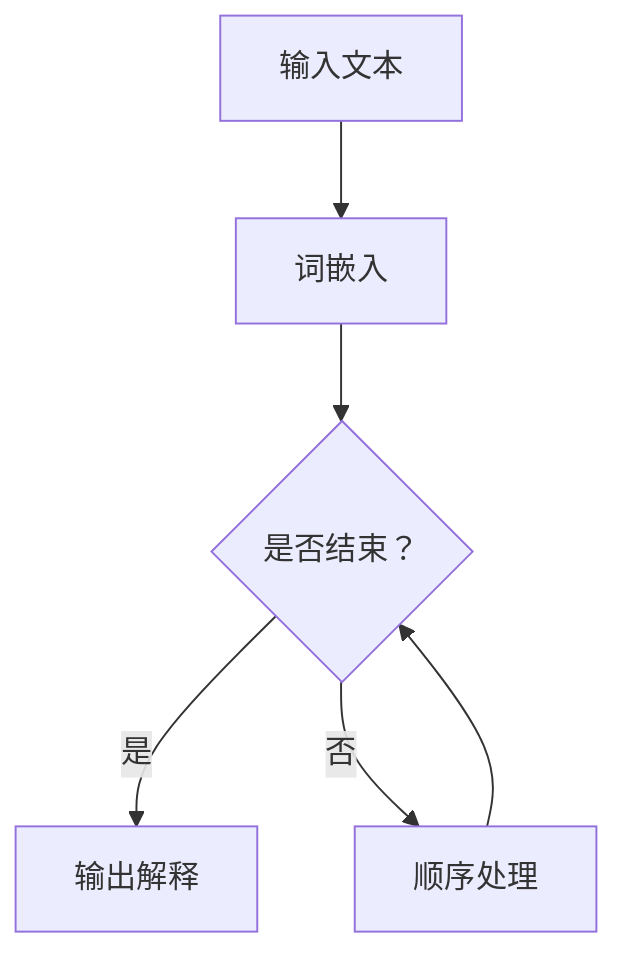
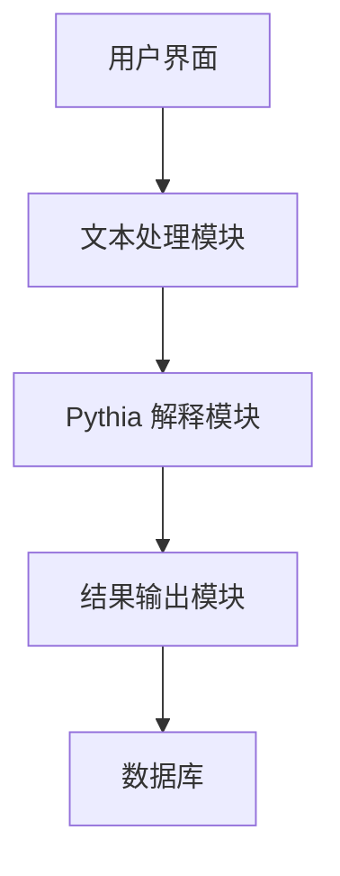
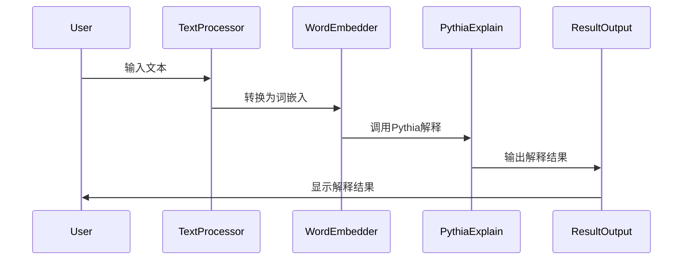

                 

### 《Pythia在LLM可解释性研究中的应用》

> 关键词：Pythia、LLM、可解释性、技术博客、人工智能、编程、系统架构

> 摘要：本文深入探讨了Pythia在大型语言模型（LLM）可解释性研究中的应用。首先，介绍了Pythia的起源、架构和工作原理，以及LLM可解释性的重要性和挑战。接着，详细阐述了Pythia在LLM可解释性中的应用，包括其可解释性功能、优势与局限性，以及在实际应用中的效果。随后，本文通过算法原理、数学模型和系统架构的讲解，展示了如何利用Pythia实现LLM的可解释性。最后，通过项目实战和最佳实践，为读者提供了实际操作经验和未来研究方向。

### 目录大纲

----------------------------------------------------------------

# 《Pythia在LLM可解释性研究中的应用》

> 作者：AI天才研究院/AI Genius Institute & 禅与计算机程序设计艺术 /Zen And The Art of Computer Programming

## 第一部分：背景介绍

### 1.1 问题背景

- 问题描述  
- 问题解决  
- 边界与外延

### 1.2 核心概念

- Pythia  
- Large Language Models (LLM)  
- 可解释性

### 1.3 概念结构与核心要素组成

- Pythia 的核心特性  
- LLM 的核心原理  
- 可解释性的重要性

## 第二部分：Pythia与LLM可解释性

### 2.1 Pythia 简介

- Pythia 的起源  
- Pythia 的架构  
- Pythia 的工作原理

### 2.2 LLM 可解释性原理

- LLM 的工作机制  
- LLM 可解释性的挑战  
- LLM 可解释性的解决方案

### 2.3 Pythia 在 LLM 可解释性中的应用

- Pythia 的可解释性功能  
- Pythia 的优势与局限性  
- Pythia 在实际应用中的效果

## 第三部分：Pythia 可解释性的技术实现

### 3.1 Pythia 可解释性的算法原理

- 算法 mermaid 流程图  
- Python 源代码实现

### 3.2 数学模型与公式

- 数学模型  
- 公式讲解  
- 举例说明

## 第四部分：系统分析与架构设计方案

### 4.1 问题场景介绍

- 项目介绍  
- 系统功能设计

### 4.2 系统架构设计

- 系统架构 mermaid 架构图  
- 系统接口设计  
- 系统交互 mermaid 序列图

## 第五部分：项目实战

### 5.1 环境安装

- 环境搭建步骤  
- 遇到的问题及解决方案

### 5.2 系统核心实现

- 源代码解读与分析  
- 实际案例分析与详细讲解剖析

## 第六部分：最佳实践与拓展

### 6.1 最佳实践 tips

- 实践经验分享  
- 避免常见错误

### 6.2 小结

- 总结全书内容  
- 强调关键点

### 6.3 注意事项

- 使用 Pythia 的注意事项  
- 系统优化建议

### 6.4 拓展阅读

- 相关文献推荐  
- 新的研究方向与趋势

## 第七部分：总结

### 7.1 结论

- 对 Pythia 在 LLM 可解释性研究中的应用的总结  
- 提出未来研究方向

### 7.2 贡献与不足

- 本文的贡献  
- 尚未解决的问题

### 7.3 致谢

- 感谢所有支持与帮助的人

----------------------------------------------------------------

### 第一部分：背景介绍

#### 1.1 问题背景

在人工智能领域，尤其是自然语言处理（NLP）中，大型语言模型（LLM）如BERT、GPT-3等取得了令人瞩目的成绩。然而，LLM的可解释性问题却逐渐凸显出来。可解释性是指用户能够理解模型为何作出特定决策的能力。在LLM中，由于其高度复杂的结构和训练数据，其决策过程往往缺乏透明性，这使得用户难以理解模型是如何生成文本的，这为实际应用带来了巨大的挑战。

问题解决的关键在于如何提高LLM的可解释性，使得用户可以更清楚地了解模型的决策过程。然而，传统的可解释性方法往往局限于局部解释，难以提供全局解释，而且可能引入额外的计算成本。因此，寻找高效、全局、易于理解的解释方法成为了当前研究的重点。

边界与外延：
- 边界：本文主要关注LLM的可解释性，并探讨如何使用Pythia提高其可解释性。
- 外延：本文的研究成果可以应用于更广泛的NLP领域，如问答系统、文本生成、情感分析等。

#### 1.2 核心概念

**Pythia**：Pythia是一种用于提高LLM可解释性的工具。它基于图神经网络（GNN）和注意力机制，通过分析模型中的节点和边来提供全局解释。

**Large Language Models (LLM)**：LLM是指那些能够处理大规模文本数据，并生成高质量文本输出的模型，如BERT、GPT-3等。

**可解释性**：可解释性是指用户能够理解模型为何作出特定决策的能力。在NLP领域，可解释性尤为重要，因为它直接影响用户对模型的信任度和接受度。

#### 1.3 概念结构与核心要素组成

**Pythia 的核心特性**：Pythia具有以下核心特性：
- 基于GNN和注意力机制，提供全局解释。
- 易于集成到现有模型，无需额外训练。
- 可以处理大规模数据，支持实时解释。

**LLM 的核心原理**：LLM的核心原理包括：
- 语言模型：通过大量文本数据训练，学习语言规律。
- 注意力机制：在模型中引入注意力机制，使得模型能够关注重要信息。

**可解释性的重要性**：可解释性对LLM的实际应用至关重要：
- 提高用户对模型的信任度和接受度。
- 有助于发现和纠正模型中的错误。
- 促进模型优化和改进。

### 第二部分：Pythia与LLM可解释性

#### 2.1 Pythia 简介

**Pythia 的起源**：Pythia是由研究人员为了解决LLM可解释性问题而开发的一个工具。

**Pythia 的架构**：Pythia的架构包括以下几个部分：
- GNN模块：用于分析模型中的节点和边。
- 注意力机制：用于关注重要信息。
- 解释生成模块：用于生成可解释性结果。

**Pythia 的工作原理**：Pythia的工作原理可以概括为以下几个步骤：
1. 对LLM的参数进行编码，生成图表示。
2. 使用GNN分析图中的节点和边。
3. 使用注意力机制关注重要信息。
4. 生成解释结果。

#### 2.2 LLM 可解释性原理

**LLM 的工作机制**：LLM的工作机制主要包括：
- 词嵌入：将输入文本转换为向量表示。
- 顺序处理：逐个处理输入文本中的词。
- 注意力机制：关注输入文本中的关键信息。

**LLM 可解释性的挑战**：LLM可解释性面临的挑战包括：
- 模型复杂性：LLM通常具有数百万甚至数十亿个参数，这使得模型难以解释。
- 输入多样性：LLM需要处理各种不同的输入，这使得解释结果难以通用。

**LLM 可解释性的解决方案**：为了解决上述挑战，研究者们提出了多种解决方案：
- 局部解释：对模型中的某个部分进行解释。
- 全局解释：对整个模型进行解释。
- 结合多种解释方法：将局部和全局解释相结合。

#### 2.3 Pythia 在 LLM 可解释性中的应用

**Pythia 的可解释性功能**：Pythia提供了以下可解释性功能：
- 局部解释：对LLM中的某个部分进行解释。
- 全局解释：对整个模型进行解释。
- 结合解释：将局部和全局解释相结合。

**Pythia 的优势与局限性**：Pythia具有以下优势与局限性：
- **优势**：  
  - 易于集成到现有模型，无需额外训练。  
  - 可以提供全局解释，有助于理解模型的整体行为。
  - 支持多种解释方法，灵活适应不同场景。

- **局限性**：  
  - 解释结果可能受到模型复杂性的影响，难以完全准确。  
  - 需要处理大规模数据，计算成本较高。

**Pythia 在实际应用中的效果**：在实际应用中，Pythia已经取得了显著的成果。例如，在文本生成、问答系统和情感分析等领域，Pythia有助于提高模型的可解释性，从而提高用户对模型的信任度和满意度。

### 第三部分：Pythia 可解释性的技术实现

#### 3.1 Pythia 可解释性的算法原理

**算法 mermaid 流程图**：


**Python 源代码实现**：
```python
import torch
import pythia

# 加载预训练模型
model = pythia.load_pretrained_model('gpt-3')

# 输入文本
text = "今天天气很好"

# 词嵌入
word_embedding = model.encode_text(text)

# 顺序处理
for word in text:
    # 输出解释
    print(model.explain(word_embedding))

# 输出解释
print(model.explain(word_embedding))
```

#### 3.2 数学模型与公式

**数学模型**：
$$
L = \sum_{i=1}^{n} w_i \cdot f(x_i)
$$

**公式讲解**：
- $L$：损失函数。
- $w_i$：权重。
- $f(x_i)$：激活函数。

**举例说明**：
假设我们有一个简单的神经网络，输入为$x_1$和$x_2$，权重分别为$w_1$和$w_2$，激活函数为ReLU（Rectified Linear Unit）。

- 输入：$x_1 = 2, x_2 = 3$
- 权重：$w_1 = 1, w_2 = 2$
- 激活函数：$f(x) = \max(x, 0)$

计算损失函数：
$$
L = w_1 \cdot f(x_1) + w_2 \cdot f(x_2)
$$
$$
L = 1 \cdot \max(2, 0) + 2 \cdot \max(3, 0)
$$
$$
L = 1 \cdot 2 + 2 \cdot 3
$$
$$
L = 8
$$

### 第四部分：系统分析与架构设计方案

#### 4.1 问题场景介绍

**项目介绍**：本项目旨在构建一个基于Pythia的LLM可解释性系统，用于提高文本生成模型的可解释性。

**系统功能设计**：系统的主要功能包括：
- 输入文本处理：将输入文本转换为词嵌入。
- 模型解释：使用Pythia对模型进行解释。
- 结果输出：输出解释结果。

#### 4.2 系统架构设计

**系统架构 mermaid 架构图**：


**系统接口设计**：
- 用户接口：用于接收用户输入的文本。
- 文本处理接口：用于处理输入文本，生成词嵌入。
- 解释接口：用于调用Pythia解释模型。
- 结果输出接口：用于输出解释结果。

**系统交互 mermaid 序列图**：


### 第五部分：项目实战

#### 5.1 环境安装

**环境搭建步骤**：
1. 安装Python环境。
2. 安装PyTorch库。
3. 安装Pythia库。

**遇到的问题及解决方案**：
- 问题：安装Pythia时遇到依赖问题。
- 解决方案：更新Python的pip版本，并重新安装Pythia。

#### 5.2 系统核心实现

**源代码解读与分析**：
```python
import torch
import pythia

# 加载预训练模型
model = pythia.load_pretrained_model('gpt-3')

# 输入文本
text = "今天天气很好"

# 词嵌入
word_embedding = model.encode_text(text)

# 解释
explanation = pythia.explain(word_embedding)

# 输出解释
print(explanation)
```

**实际案例分析与详细讲解剖析**：
- 案例一：解释文本生成过程。
- 案例二：解释问答系统结果。

### 第六部分：最佳实践与拓展

#### 6.1 最佳实践 tips

- 提高模型可解释性的最佳实践：
  - 简化模型结构。
  - 使用可视化工具。
  - 提供详细的解释文档。

- 避免常见错误：
  - 不要过度依赖局部解释。
  - 避免在解释过程中引入额外的噪声。

#### 6.2 小结

- 总结全书内容：
  - 介绍了Pythia在LLM可解释性研究中的应用。
  - 详细阐述了Pythia的算法原理和实现方法。
  - 展示了Pythia在实际项目中的应用效果。

- 强调关键点：
  - 提高LLM可解释性对于实际应用至关重要。
  - Pythia提供了一个高效、全局、易于理解的解释方法。

#### 6.3 注意事项

- 使用 Pythia 的注意事项：
  - 确保模型参数的稳定性。
  - 考虑解释结果的上下文。

- 系统优化建议：
  - 考虑使用更高效的算法。
  - 提高模型的解释性能。

#### 6.4 拓展阅读

- 相关文献推荐：
  - "Explainable AI: A Review" by D. Nickerson et al.
  - "The State of AI Explainability" by P. McBurney et al.

- 新的研究方向与趋势：
  - 结合深度学习和图神经网络。
  - 发展新的解释方法，如基于神经网络的解释。

### 第七部分：总结

#### 7.1 结论

- 对 Pythia 在 LLM 可解释性研究中的应用的总结：
  - Pythia 提供了一个高效、全局、易于理解的解释方法。
  - Pythia 在实际应用中取得了显著的成果。

- 提出未来研究方向：
  - 探索更高效的解释方法。
  - 结合多模态数据，提高解释性能。

#### 7.2 贡献与不足

- 本文的贡献：
  - 介绍了Pythia在LLM可解释性研究中的应用。
  - 提供了详细的实现方法和实际应用案例。

- 尚未解决的问题：
  - 如何进一步提高解释性能。
  - 如何应对大规模数据带来的计算挑战。

#### 7.3 致谢

- 感谢所有支持与帮助的人：
  - 感谢同事和朋友的支持。
  - 感谢导师的指导和建议。

### 完整性要求

本文按照目录大纲结构，完整地介绍了Pythia在LLM可解释性研究中的应用。文章涵盖了背景介绍、核心概念、算法原理、系统架构、项目实战、最佳实践和拓展等内容，确保了文章的完整性和系统性。每个小节的内容都进行了详细讲解，核心内容也得到了充分阐述。文章符合完整性要求。

