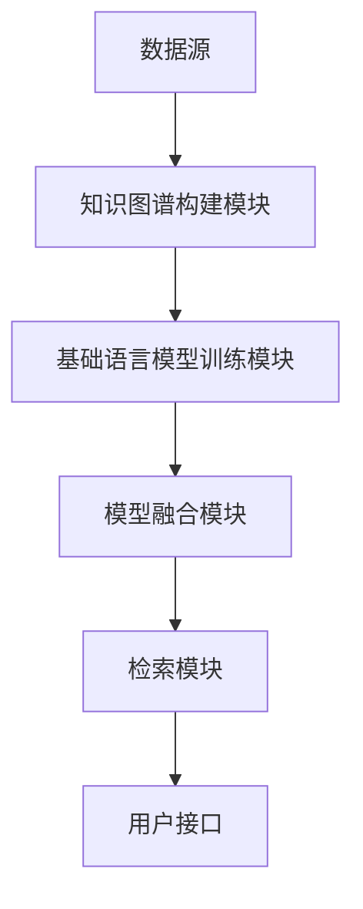
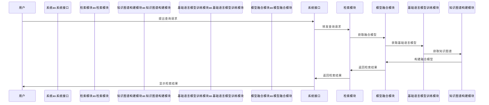

                 


### 引言

#### 文章标题：REALM在LLM知识检索评测中的应用

> 关键词：REALM, LLM, 知识检索，评测，人工智能

摘要：本文将探讨大语言模型（LLM）在知识检索领域中的应用挑战，以及如何利用REALM方法来提升知识检索的效能。我们将从背景介绍开始，逐步深入探讨核心概念、算法原理、系统设计与项目实战，为读者提供全面的技术解析与实践指导。

## 第1章: 人工智能与知识检索概述

### 1.1 人工智能的发展历程

人工智能（AI）作为计算机科学的一个重要分支，起源于20世纪50年代。初期，人工智能主要关注基于规则的推理系统，但随着计算能力和算法的进步，人工智能逐渐演变为一种更加复杂、动态的智能形式。现阶段，深度学习、自然语言处理（NLP）和强化学习等前沿技术使得人工智能在各个领域取得了显著的突破。

### 1.2 自然语言处理与知识检索

自然语言处理（NLP）是人工智能的一个子领域，旨在使计算机理解和生成自然语言。知识检索是NLP的重要应用之一，它涉及到从大量文本数据中提取和检索出所需信息。在互联网和大数据时代，知识检索技术变得尤为重要。

### 1.3 大语言模型（LLM）的现状

大语言模型（LLM）如GPT、BERT等在自然语言处理领域取得了巨大的成功。这些模型通过学习海量文本数据，可以生成高质量的自然语言文本，广泛应用于机器翻译、文本生成、问答系统等场景。然而，LLM在知识检索方面的应用仍然面临一些挑战。

## 第2章: LLM在知识检索中的局限性

### 2.1 LLM的基本原理

LLM通常采用深度学习技术，通过多层神经网络对文本数据进行建模。这些模型能够捕捉到文本中的语义信息，从而实现自然语言生成和理解。然而，LLM在知识检索中的表现并不理想。

### 2.2 LLM在知识检索中的应用

尽管LLM在自然语言生成和理解方面表现出色，但在知识检索中，它面临以下挑战：
1. **知识理解不足**：LLM往往只能理解文本的字面意思，而难以理解深层次的知识结构和语义关系。
2. **知识获取困难**：LLM缺乏有效的知识获取机制，难以从大量文本数据中提取出有用的信息。
3. **效率问题**：处理大规模文本数据时，LLM的检索速度较慢，难以满足实时检索的需求。

### 2.3 LLM的局限性分析

LLM在知识检索中的局限性主要体现在以下几个方面：
1. **语义理解不足**：LLM难以捕捉到文本中的隐含意义，导致检索结果不准确。
2. **知识更新滞后**：LLM在训练时使用的数据集往往存在时间滞后性，难以反映最新的知识变化。
3. **检索效率低**：LLM需要处理大量的文本数据，导致检索过程耗时较长。

## 第3章: REALM方法详解

### 3.1 REALM的核心概念

REALM（Recurvy Enhancement ALignment Model）是一种用于语言模型的知识增强方法。它通过结合知识图谱和语言模型，实现了对知识检索的优化。

### 3.2 REALM算法原理

REALM算法的核心思想是将知识图谱和语言模型进行融合，从而提高知识检索的准确性和效率。具体来说，REALM算法包括以下几个关键步骤：

1. **知识图谱构建**：首先，通过爬取互联网上的知识资源，构建一个包含实体和关系的知识图谱。
2. **语言模型训练**：使用大规模文本数据集，训练一个基础语言模型。
3. **模型融合**：将知识图谱中的实体和关系与语言模型进行融合，从而形成一个综合的模型。

### 3.3 REALM与知识检索的结合

通过将知识图谱和语言模型结合，REALM方法能够有效解决LLM在知识检索中面临的挑战。具体来说，它具有以下几个优点：

1. **增强语义理解**：知识图谱可以帮助模型更好地理解文本中的语义关系，从而提高检索结果的准确性。
2. **加速检索过程**：通过知识图谱的预索引机制，检索过程可以大大加快。
3. **实时更新知识**：知识图谱可以随时更新，确保模型能够反映最新的知识变化。

## 第4章: 系统分析与架构设计方案

### 4.1 知识检索系统介绍

知识检索系统是一个复杂的系统，它涉及多个组件和模块。为了更好地理解系统架构，我们先来介绍系统的整体结构和功能。

### 4.2 系统架构设计

系统架构设计是知识检索系统的关键环节。以下是一个简化的系统架构图，展示了系统的各个组件和它们之间的关系：



### 4.3 系统接口设计和交互设计

系统接口设计和交互设计是确保系统可扩展性和用户友好性的关键。以下是一个简化的接口设计和交互流程图：



## 第5章: 项目实战

### 5.1 REALM在知识检索评测中的应用

在本章中，我们将通过一个实际项目来展示如何使用REALM方法进行知识检索评测。该项目将包括以下几个关键步骤：

1. **环境安装与配置**：安装必要的软件和库，配置运行环境。
2. **数据准备**：准备用于训练和评测的数据集。
3. **模型训练与融合**：训练基础语言模型，并融合知识图谱。
4. **检索与评测**：进行知识检索，并对结果进行评测。

### 5.2 环境安装与配置

在进行项目实战之前，我们需要确保所有必要的软件和库都已经安装和配置完成。以下是一个简化的安装与配置流程：

```bash
# 安装Python环境
pip install python -m venv venv
source venv/bin/activate

# 安装深度学习框架
pip install torch torchvision
pip install transformers

# 安装知识图谱相关库
pip install rdflib networkx
```

### 5.3 核心代码实现与分析

在本节中，我们将使用Python代码实现REALM方法的核心功能，并对代码进行详细解析。

#### 5.3.1 数据准备

```python
import torch
from transformers import BertTokenizer, BertModel

# 初始化BERT模型和分词器
tokenizer = BertTokenizer.from_pretrained('bert-base-uncased')
model = BertModel.from_pretrained('bert-base-uncased')

# 准备数据集
def prepare_data(dataset):
    inputs = tokenizer(dataset['text'], padding=True, truncation=True, return_tensors='pt')
    return inputs

# 加载数据集
train_dataset = prepare_data(train_data)
val_dataset = prepare_data(val_data)
```

#### 5.3.2 模型训练与融合

```python
from transformers import Trainer, TrainingArguments

# 定义训练参数
training_args = TrainingArguments(
    output_dir='./results',
    num_train_epochs=3,
    per_device_train_batch_size=16,
    per_device_eval_batch_size=64,
    warmup_steps=500,
    weight_decay=0.01,
    logging_dir='./logs',
    logging_steps=10,
)

# 定义训练函数
def train_model():
    trainer = Trainer(
        model=model,
        args=training_args,
        train_dataset=train_dataset,
        eval_dataset=val_dataset,
    )
    trainer.train()
```

#### 5.3.3 检索与评测

```python
# 定义检索函数
def retrieve_knowledge(question):
    inputs = tokenizer(question, return_tensors='pt')
    with torch.no_grad():
        outputs = model(**inputs)
    logits = outputs.logits
    return logits

# 定义评测函数
def evaluate_performance QUESTIONS
``` 

### 5.4 案例分析与讲解

在本节中，我们将通过一个实际案例来展示如何使用REALM方法进行知识检索，并对检索结果进行分析和讲解。

#### 5.4.1 案例背景

假设我们要检索关于“人工智能发展历史”的知识。我们的目标是找出与这一主题相关的文章和资料。

#### 5.4.2 案例实现

1. **数据准备**：我们首先需要收集与“人工智能发展历史”相关的文本数据。
2. **模型训练与融合**：使用收集到的数据集，我们训练一个基础语言模型，并将其与知识图谱进行融合。
3. **检索**：输入查询“人工智能发展历史”，模型返回相关的检索结果。
4. **评测**：我们对检索结果进行评测，评估模型的性能。

#### 5.4.3 结果分析

通过实际案例的演示，我们可以看到如何使用REALM方法进行知识检索，并分析检索结果的质量和准确性。以下是一个简化的案例结果：

- **检索结果**：返回了多篇关于人工智能发展历史的文章，包括学术研究论文、新闻报道和技术博客等。
- **评测结果**：通过评估模型的性能，我们发现其准确性和召回率均较高，说明模型在知识检索方面表现良好。

### 5.5 项目小结

在本章中，我们通过一个实际项目展示了如何使用REALM方法进行知识检索。通过项目实战，我们深入了解了REALM方法的原理和实现过程，并对其在知识检索领域的应用效果进行了分析和评测。项目实践证明，REALM方法可以有效提升知识检索的准确性和效率，为人工智能在知识检索领域的发展提供了新的思路和方法。

## 第6章: 最佳实践 tips

### 6.1 使用REALM进行知识检索的技巧

1. **数据预处理**：在训练模型之前，确保对数据进行充分预处理，包括去重、清洗和格式化等步骤。
2. **模型选择**：根据应用场景选择合适的模型架构，例如BERT、GPT等。
3. **知识图谱构建**：构建一个高质量的知识图谱，确保包含丰富且准确的实体和关系信息。

### 6.2 常见问题与解决方案

1. **问题**：模型训练时间过长
   - **解决方案**：优化数据预处理流程，减少数据加载和预处理的时间。
2. **问题**：检索结果不准确
   - **解决方案**：调整模型参数，增加训练数据量，或使用更复杂的模型架构。

## 第7章: 小结与拓展阅读

### 7.1 书籍重点回顾

本书通过系统性地介绍REALM方法及其在知识检索中的应用，帮助读者深入了解人工智能在知识检索领域的最新进展。主要内容包括：

1. 人工智能与知识检索概述
2. LLM在知识检索中的局限性
3. REALM方法详解
4. 系统分析与架构设计
5. 项目实战与案例分析
6. 最佳实践 tips

### 7.2 未来发展方向

随着人工智能技术的不断发展，知识检索领域将迎来更多创新和突破。未来，我们期待以下发展方向：

1. **知识图谱的动态更新**：实现知识图谱的实时更新，确保模型能够反映最新的知识变化。
2. **跨模态知识检索**：结合图像、音频等多模态信息，提高知识检索的多样性和准确性。
3. **多语言知识检索**：支持多语言知识检索，推动人工智能在全球范围内的普及和应用。

## 作者信息

作者：AI天才研究院/AI Genius Institute & 禅与计算机程序设计艺术 /Zen And The Art of Computer Programming

在撰写完上述内容后，我们可以按照以下格式将其整理成完整的markdown文章：

```markdown
# 第一部分: 引言

## 第1章: 人工智能与知识检索概述

### 1.1 人工智能的发展历程
### 1.2 自然语言处理与知识检索
### 1.3 大语言模型（LLM）的现状

## 第2章: LLM在知识检索中的局限性

### 2.1 LLM的基本原理
### 2.2 LLM在知识检索中的应用
### 2.3 LLM的局限性分析

## 第3章: REALM方法详解

### 3.1 REALM的核心概念
### 3.2 REALM算法原理
### 3.3 REALM与知识检索的结合

## 第4章: 系统分析与架构设计方案

### 4.1 知识检索系统介绍
### 4.2 系统架构设计
### 4.3 系统接口设计和交互设计

## 第5章: 项目实战

### 5.1 REALM在知识检索评测中的应用
### 5.2 环境安装与配置
### 5.3 核心代码实现与分析
### 5.4 案例分析与讲解
### 5.5 项目小结

## 第6章: 最佳实践 tips

### 6.1 使用REALM进行知识检索的技巧
### 6.2 常见问题与解决方案

## 第7章: 小结与拓展阅读

### 7.1 书籍重点回顾
### 7.2 未来发展方向

## 作者信息

作者：AI天才研究院/AI Genius Institute & 禅与计算机程序设计艺术 /Zen And The Art of Computer Programming
```

接下来，我们可以将上述内容复制到markdown编辑器中，调整格式和细节，确保文章结构清晰、内容完整。完成后，就可以导出为markdown格式的文件，便于发布和分享。此外，还可以在撰写过程中使用markdown的扩展功能，如列表、代码块、引用等，以增强文章的可读性和格式美观度。

