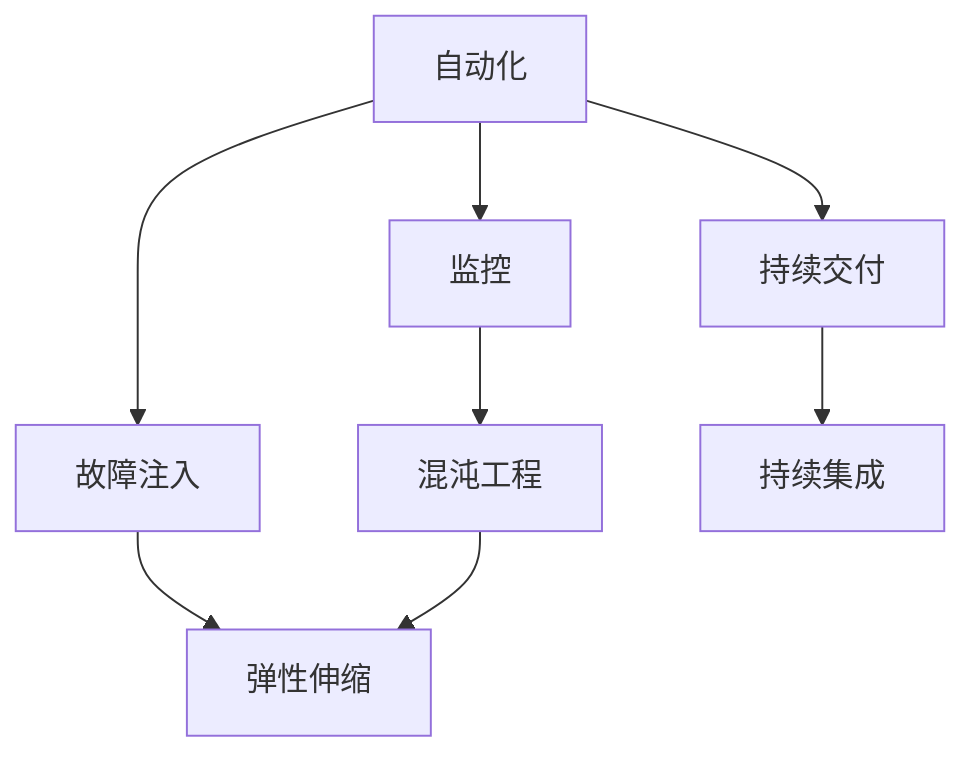

                 

### 第一部分：背景介绍

#### 1.1 问题背景与核心概念

##### 1.1.1 问题背景

随着人工智能（AI）技术的发展，越来越多的企业开始将其应用于核心业务中，以提高效率、优化决策和提升用户体验。AI服务，如智能推荐、自然语言处理和图像识别，已成为现代企业不可或缺的一部分。然而，这些服务的正常运行对企业的运营和用户满意度至关重要。高可用性（High Availability，简称HA）成为AI服务成功的关键因素之一。

高可用性不仅仅是指系统在物理层面上的持续运行，更涉及在遇到故障时快速恢复的能力。对于AI服务而言，高可用性意味着即使在异常情况下，也能确保服务的连续性，避免对业务造成重大影响。随着AI服务的复杂性和依赖性的增加，实现高可用性变得更加困难。

SRE（Site Reliability Engineering）作为一种运维方法论，旨在通过工程实践确保系统的可靠性和稳定性。SRE的核心理念包括自动化、监控、故障注入和持续交付等，旨在减少人为干预，提高系统的弹性和容错能力。SRE与传统运维的最大区别在于其更加关注系统的可靠性，而不仅仅是可用性。

##### 1.1.2 AI服务高可用性的重要性

AI服务的高可用性对企业的业务连续性和用户体验至关重要。首先，高可用性保证了服务的稳定性和可靠性，使企业能够持续提供高质量的服务，从而提高用户满意度和忠诚度。其次，AI服务的高可用性能够减少由于系统故障导致的业务中断，降低运营成本和潜在损失。最后，高可用性还能够提高企业的竞争力和市场地位，使其在日益激烈的市场环境中保持优势。

##### 1.1.3 问题的提出

尽管SRE提供了许多确保系统可靠性的方法，但AI服务的特殊性质使得实现高可用性面临独特的挑战。例如，AI服务的训练和推理过程通常需要大量的计算资源和时间，这使得系统在处理突发流量时容易发生故障。此外，AI服务的依赖性较高，一旦某个组件出现故障，可能会引发整个服务的宕机。

因此，本文将探讨SRE实践在确保AI服务高可用性方面的具体方法，包括自动化部署、监控、故障注入和弹性伸缩等。通过详细分析和实例，我们将展示如何运用SRE原则来提高AI服务的可靠性，确保其在面对各种异常情况时仍能稳定运行。

#### 1.2 核心概念

##### 1.2.1 SRE基础概念

SRE是一种结合了软件开发和系统运维的方法论，旨在通过工程实践提高系统的可靠性和稳定性。以下是SRE中的一些关键概念：

1. **自动化**：通过自动化工具和脚本，减少手动操作，提高部署和运维的效率。
2. **监控**：实时监控系统状态，及时发现和解决问题。
3. **故障注入**：模拟各种故障情况，测试系统的容错能力。
4. **持续交付**：通过自动化流程，确保代码的快速迭代和可靠部署。
5. **混沌工程**：通过故意引入故障，测试系统的弹性和恢复能力。

##### 1.2.2 AI服务特性

AI服务的独特特性对高可用性提出了特定的要求。以下是AI服务的一些关键特性：

1. **模型训练时间**：AI服务的模型训练通常需要大量时间和计算资源，这使得系统在训练过程中容易遇到资源不足等问题。
2. **预测延迟**：AI服务的响应时间对用户体验至关重要，高可用性要求系统在处理请求时具有低延迟。
3. **数据更新频率**：AI服务的性能和数据准确性往往依赖于及时更新的数据源，高可用性要求系统能够快速处理数据更新。
4. **依赖性**：许多AI服务依赖于外部组件（如数据库、缓存等），这些组件的故障可能会影响整个服务的可用性。

##### 1.2.3 高可用性指标

确保AI服务的高可用性需要关注以下指标：

1. **系统可用性**：系统在规定时间内正常运行的时间比例，通常以百分比表示。
2. **故障恢复时间**：系统从故障发生到恢复正常运行所需的时间。
3. **服务连续性**：系统在遇到故障时能够保持服务的连续性，避免对用户造成负面影响。
4. **故障率**：系统在一定时间内发生的故障次数。

##### 1.2.4 SRE与AI服务高可用性的关系

SRE的核心原则和方法对于确保AI服务的高可用性至关重要。通过自动化部署和持续交付，可以减少人为错误，提高系统的可靠性和稳定性。监控和故障注入有助于及早发现和解决问题，确保系统在遇到故障时能够快速恢复。弹性伸缩和混沌工程则提高了系统的弹性和恢复能力，确保在面对突发流量和异常情况时仍能保持稳定运行。

#### 1.3 边界与外延

##### 1.3.1 高可用性与容错性的区别

高可用性和容错性是确保系统可靠性的两个重要概念，但它们有所不同。高可用性关注系统在遇到故障时能够快速恢复，而容错性则关注系统在故障发生时能够继续运行。例如，一个具有高可用性的系统可以在发生单点故障时迅速切换到备用组件，而一个具有良好容错性的系统可以在某些组件出现故障时继续运行，不中断整体服务。

##### 1.3.2 SRE与传统运维方法的关联

SRE与传统运维方法（如DevOps、ITIL等）有许多共同点，但也有一些区别。DevOps强调开发和运维的整合，以提高交付速度和系统质量。ITIL（IT Infrastructure Library）则提供了一套全面的IT服务管理框架，包括服务策略、服务设计、服务过渡、服务运营和持续服务改进。SRE在借鉴这些方法的基础上，更加关注系统的可靠性和稳定性，通过自动化、监控和故障注入等手段，确保系统在复杂环境中能够持续稳定运行。

##### 1.3.3 SRE与AI服务高可用性的关联

SRE与AI服务高可用性的关联体现在以下几个方面：

1. **自动化部署**：通过自动化部署，可以快速响应业务需求，提高系统的可靠性和稳定性。
2. **监控与故障注入**：通过监控和故障注入，可以及早发现和解决问题，确保系统在面对故障时能够快速恢复。
3. **弹性伸缩**：通过弹性伸缩，可以确保系统在处理突发流量时能够自动扩展资源，保持稳定运行。
4. **混沌工程**：通过混沌工程，可以测试系统的弹性和恢复能力，确保在面对异常情况时仍能保持稳定。

#### 1.4 概念结构与核心要素

##### 1.4.1 SRE概念结构图

以下是SRE概念结构图，展示了SRE中的核心概念及其相互关系：



##### 1.4.2 AI服务高可用性的要素

确保AI服务高可用性需要关注以下几个核心要素：

1. **系统监控**：实时监控系统状态，包括CPU、内存、网络、磁盘等资源的使用情况。
2. **自动化部署**：通过自动化工具和脚本，确保代码的快速迭代和可靠部署。
3. **故障注入**：定期进行故障注入测试，验证系统的容错能力和恢复能力。
4. **弹性伸缩**：根据业务需求，自动调整资源分配，确保系统在处理突发流量时能够自动扩展。
5. **混沌工程**：通过故意引入故障，测试系统的弹性和恢复能力。

#### 1.5 本章小结

本章介绍了SRE实践在确保AI服务高可用性中的重要性。我们首先探讨了AI服务高可用性的背景和核心概念，包括SRE的角色与职责、AI服务的特性、高可用性指标以及SRE与AI服务高可用性的关系。然后，我们讨论了高可用性与容错性的区别，以及SRE与传统运维方法的关联。最后，我们分析了SRE中的核心概念结构和确保AI服务高可用性的关键要素。

通过本章的介绍，我们为后续章节的深入讨论奠定了基础。在接下来的章节中，我们将详细探讨SRE实践的具体方法和应用，包括自动化部署、监控、故障注入、弹性伸缩和混沌工程等。我们将结合实际案例，展示如何运用SRE原则来提高AI服务的可靠性，确保其在面对各种异常情况时仍能稳定运行。

## 第二部分：SRE实践方法

### 2.1 自动化部署

#### 2.1.1 自动化部署的重要性

在SRE实践中，自动化部署是确保AI服务高可用性的关键环节之一。自动化部署可以减少人为错误，提高部署效率，确保代码的快速迭代和可靠交付。通过自动化部署，企业可以更加灵活地应对业务需求的变化，快速响应市场动态。

#### 2.1.2 自动化部署流程

自动化部署通常包括以下步骤：

1. **代码仓库管理**：使用版本控制系统（如Git）管理代码，确保代码的版本可控和可追溯。
2. **持续集成（CI）**：在代码提交到仓库后，通过CI工具（如Jenkins、GitLab CI）自动执行编译、单元测试和集成测试，确保代码的质量和一致性。
3. **容器化**：使用容器化技术（如Docker）将应用程序和其依赖环境打包到一个独立的容器中，确保环境的标准化和可移植性。
4. **持续交付（CD）**：通过CD工具（如Kubernetes、Jenkins）将经过CI测试的代码部署到生产环境中，实现自动化的部署和回滚。

#### 2.1.3 实例分析

以某电商平台的推荐系统为例，该系统使用自动化部署来确保模型训练和推理服务的稳定运行。每次模型更新时，开发人员将新的模型代码提交到Git仓库，CI工具会自动执行编译和测试，确保模型的质量。通过Kubernetes，新的模型容器会被自动部署到生产环境中，同时旧容器会被自动回滚，确保部署过程的无缝进行。

#### 2.1.4 小结

自动化部署是确保AI服务高可用性的重要手段。通过自动化工具和流程，可以大幅减少人为干预，提高部署效率和质量，确保系统在遇到故障时能够快速恢复。在后续章节中，我们将继续探讨SRE实践中的其他关键方法，如监控、故障注入、弹性伸缩和混沌工程等。

### 2.2 监控

#### 2.2.1 监控的重要性

在SRE实践中，监控是确保系统高可用性的核心环节之一。通过实时监控系统状态，可以及时发现和解决潜在问题，确保系统的稳定运行。监控不仅包括对系统资源（如CPU、内存、磁盘等）的监控，还包括对应用程序性能、网络流量和用户反馈的监控。

#### 2.2.2 监控指标

为确保AI服务的高可用性，需要关注以下关键监控指标：

1. **系统资源利用率**：包括CPU、内存、磁盘使用率和网络带宽等。
2. **应用程序性能**：包括响应时间、吞吐量和错误率等。
3. **数据库性能**：包括查询延迟、连接数和数据存储容量等。
4. **外部服务依赖**：包括第三方API调用响应时间和服务可用性等。
5. **用户反馈**：包括用户报错、投诉和满意度等。

#### 2.2.3 监控工具

常用的监控工具包括Prometheus、Grafana、Zabbix和Nagios等。这些工具可以实时收集和展示系统状态，提供报警和自动化响应功能。

1. **Prometheus**：一个开源的监控解决方案，具有高效的数据存储和查询能力，适用于大规模监控场景。
2. **Grafana**：一个开源的数据可视化和监控工具，可以与Prometheus等监控工具集成，提供丰富的图表和仪表盘。
3. **Zabbix**：一个开源的监控解决方案，支持多种监控协议，适用于中小规模监控场景。
4. **Nagios**：一个开源的监控解决方案，具有丰富的插件和报警功能，适用于复杂的监控需求。

#### 2.2.4 实例分析

以某在线教育平台的AI课程推荐系统为例，该系统使用Prometheus和Grafana进行监控。Prometheus负责实时收集系统的各种监控数据，如CPU、内存使用率、数据库查询延迟和用户反馈等。Grafana则将这些数据可视化，并提供实时报警功能。当系统指标异常时，Prometheus会自动发送报警信息到开发人员和运维团队的邮箱和手机，以便及时处理。

#### 2.2.5 小结

监控是确保AI服务高可用性的重要手段。通过实时监控系统状态，可以及时发现和解决问题，确保系统的稳定运行。在后续章节中，我们将继续探讨SRE实践中的其他关键方法，如故障注入、弹性伸缩和混沌工程等。

### 2.3 故障注入

#### 2.3.1 故障注入的目的

故障注入（Chaos Engineering）是SRE实践中的一种重要方法，旨在通过故意引入故障，测试系统的容错能力和恢复能力。故障注入的目的是发现系统的潜在问题，确保在真实故障发生时系统能够快速恢复。

#### 2.3.2 故障注入的方法

故障注入通常包括以下几种方法：

1. **服务中断**：模拟外部服务（如数据库、API等）的中断，测试系统在服务不可用时如何应对。
2. **延迟注入**：模拟网络延迟或数据库响应延迟，测试系统在延迟情况下如何保持性能和稳定性。
3. **硬件故障**：模拟硬件故障，如磁盘损坏或网络中断，测试系统的容错能力和恢复能力。
4. **软件故障**：模拟软件故障，如应用程序崩溃或代码逻辑错误，测试系统的故障检测和自动恢复能力。

#### 2.3.3 故障注入工具

常用的故障注入工具包括Chaos Monkey、Chaos Kong和Kubernetes Chaos Manager等。

1. **Chaos Monkey**：一个开源的故障注入工具，可以随机关闭系统中的实例，测试系统的自动恢复能力。
2. **Chaos Kong**：一个开源的故障注入平台，可以灵活地配置和执行各种故障注入场景。
3. **Kubernetes Chaos Manager**：一个基于Kubernetes的故障注入工具，可以模拟各种故障情况，测试Kubernetes集群的容错能力。

#### 2.3.4 实例分析

以某金融交易平台的AI风控系统为例，该系统使用Chaos Monkey进行故障注入测试。每次测试中，Chaos Monkey会随机关闭系统中的某些实例，模拟外部服务的中断。系统在遇到这种故障时，会自动切换到备用实例，确保交易过程的连续性。通过这种测试，开发团队可以及时发现系统中的潜在问题，并进行相应的优化和改进。

#### 2.3.5 小结

故障注入是确保AI服务高可用性的重要手段。通过故意引入故障，可以测试系统的容错能力和恢复能力，确保系统在真实故障发生时能够快速恢复。在后续章节中，我们将继续探讨SRE实践中的其他关键方法，如弹性伸缩和混沌工程等。

### 2.4 弹性伸缩

#### 2.4.1 弹性伸缩的原理

弹性伸缩（Scaling）是确保AI服务高可用性的关键方法之一。弹性伸缩通过自动调整系统资源，确保系统能够应对突发流量和负载变化，保持性能和稳定性。弹性伸缩通常包括垂直伸缩（Vertical Scaling）和水平伸缩（Horizontal Scaling）两种方式。

1. **垂直伸缩**：通过增加或减少系统硬件资源（如CPU、内存、磁盘等）来应对负载变化。
2. **水平伸缩**：通过增加或减少系统中的实例数量来应对负载变化。

#### 2.4.2 弹性伸缩的优势

弹性伸缩具有以下优势：

1. **提高性能**：通过自动调整资源，确保系统在高负载时能够保持高性能。
2. **降低成本**：根据实际负载调整资源，避免资源浪费和过载。
3. **提高可用性**：通过自动扩展资源，确保系统能够应对突发流量，保持服务的连续性。

#### 2.4.3 弹性伸缩的方法

实现弹性伸缩通常需要以下步骤：

1. **监控**：实时监控系统状态，包括CPU、内存、网络流量等。
2. **阈值设置**：根据系统性能和负载情况，设置合适的阈值，触发自动扩展或收缩。
3. **自动扩展**：根据阈值触发条件，自动增加或减少系统实例。
4. **自动收缩**：在负载降低时，自动减少系统实例，释放资源。

#### 2.4.4 实例分析

以某电商平台的AI推荐系统为例，该系统使用Kubernetes进行弹性伸缩。系统通过Prometheus监控CPU、内存和网络流量等指标，当负载超过设定的阈值时，Kubernetes会自动增加实例数量，确保系统在高负载时能够保持高性能。当负载降低时，Kubernetes会自动减少实例数量，释放资源，降低成本。

#### 2.4.5 小结

弹性伸缩是确保AI服务高可用性的重要方法。通过自动调整系统资源，可以确保系统在应对突发流量和负载变化时能够保持性能和稳定性。在后续章节中，我们将继续探讨SRE实践中的其他关键方法，如混沌工程和持续优化等。

### 2.5 混沌工程

#### 2.5.1 混沌工程的原理

混沌工程（Chaos Engineering）是SRE实践中的一种重要方法，旨在通过故意引入故障和异常情况，测试系统的容错能力和恢复能力。混沌工程的目标是确保系统在面对各种不确定性和突发情况时能够保持稳定运行。

#### 2.5.2 混沌工程的目标

混沌工程的主要目标包括：

1. **提高系统的容错能力**：通过故意引入故障，测试系统在故障情况下的恢复能力。
2. **优化系统设计**：通过分析故障发生的原因和系统的表现，优化系统设计和架构。
3. **提高团队的应变能力**：通过实践混沌工程，提高团队在应对突发事件时的应变能力和协作效率。

#### 2.5.3 混沌工程的方法

混沌工程通常包括以下几种方法：

1. **故障注入**：故意引入故障，如服务中断、延迟注入和硬件故障等，测试系统的恢复能力。
2. **压力测试**：模拟高负载和突发流量，测试系统的性能和稳定性。
3. **异常检测**：通过监控和数据分析，及时发现系统的异常情况。
4. **回滚和恢复**：在故障发生后，快速回滚到上一个稳定版本，并采取措施恢复系统。

#### 2.5.4 混沌工程工具

常用的混沌工程工具包括Chaos Monkey、Chaos Mesh和Kubernetes Chaos Manager等。

1. **Chaos Monkey**：一个开源的故障注入工具，可以随机关闭系统中的实例，测试系统的自动恢复能力。
2. **Chaos Mesh**：一个基于Kubernetes的混沌工程平台，可以灵活地配置和执行各种故障注入场景。
3. **Kubernetes Chaos Manager**：一个基于Kubernetes的故障注入工具，可以模拟各种故障情况，测试Kubernetes集群的容错能力。

#### 2.5.5 实例分析

以某云服务提供商的AI云平台为例，该平台使用Chaos Mesh进行混沌工程测试。每次测试中，Chaos Mesh会随机注入各种故障，如网络分区、服务中断和延迟注入等。系统在遇到这些故障时，会自动触发故障恢复流程，确保服务的连续性。通过这种测试，开发团队可以及时发现系统中的潜在问题，并进行相应的优化和改进。

#### 2.5.6 小结

混沌工程是确保AI服务高可用性的重要方法。通过故意引入故障和异常情况，可以测试系统的容错能力和恢复能力，确保系统在面对各种不确定性和突发情况时能够保持稳定运行。在后续章节中，我们将继续探讨SRE实践中的其他关键方法，如监控和持续优化等。

## 第三部分：案例与实践

### 3.1 案例背景

本部分将通过两个实际案例，详细展示如何将SRE实践应用于确保AI服务的高可用性。第一个案例是某电商平台的AI推荐系统，第二个案例是某金融科技公司的AI风控系统。这两个案例涵盖了SRE实践中的多个关键方法，包括自动化部署、监控、故障注入、弹性伸缩和混沌工程。

### 3.2 案例一：电商平台AI推荐系统

#### 3.2.1 案例描述

某电商平台为了提高用户购物体验，决定引入AI推荐系统。该系统基于用户的购物历史、浏览行为和兴趣爱好，实时推荐符合用户需求的商品。随着用户量的增加，系统的高可用性和稳定性成为关键问题。

#### 3.2.2 SRE实践方法

1. **自动化部署**：
   - 使用Docker和Kubernetes进行容器化部署，确保环境的标准化和可移植性。
   - 使用Jenkins进行持续集成和持续交付（CI/CD），实现代码的快速迭代和可靠部署。

2. **监控**：
   - 使用Prometheus和Grafana进行实时监控，监控系统的CPU、内存、磁盘使用率、网络流量等关键指标。
   - 设置报警阈值，当监控指标超过阈值时，自动发送通知到运维团队和开发团队。

3. **故障注入**：
   - 使用Chaos Monkey进行故障注入测试，模拟服务中断、延迟注入和硬件故障等，测试系统的恢复能力。
   - 定期进行故障注入测试，确保系统的容错能力。

4. **弹性伸缩**：
   - 使用Kubernetes的自动伸缩功能，根据CPU、内存等资源使用情况，自动增加或减少实例数量。
   - 设置合适的阈值，确保系统在处理高负载时能够自动扩展资源，保持性能。

5. **混沌工程**：
   - 使用Chaos Mesh进行混沌工程测试，模拟网络分区、服务中断和延迟注入等，测试系统的弹性和恢复能力。
   - 分析测试结果，优化系统设计和架构。

#### 3.2.3 案例分析

通过SRE实践，该电商平台的AI推荐系统在处理高负载和故障时表现出了良好的稳定性和恢复能力。自动化部署和持续交付提高了部署效率，减少了人为错误。实时监控和故障注入测试确保了系统的稳定运行，及时发现并解决问题。弹性伸缩和混沌工程提高了系统的容错能力和恢复能力，确保在面临突发流量和故障时仍能保持稳定。

### 3.3 案例二：金融科技公司AI风控系统

#### 3.3.1 案例描述

某金融科技公司开发了一款AI风控系统，用于检测和防范金融欺诈行为。该系统需要处理大量的金融交易数据，对实时性和准确性要求极高。系统的高可用性和稳定性对于公司的业务运营和客户信任至关重要。

#### 3.3.2 SRE实践方法

1. **自动化部署**：
   - 使用Docker和Kubernetes进行容器化部署，确保环境的标准化和可移植性。
   - 使用Jenkins进行持续集成和持续交付（CI/CD），实现代码的快速迭代和可靠部署。

2. **监控**：
   - 使用Prometheus和Grafana进行实时监控，监控系统的CPU、内存、磁盘使用率、网络流量等关键指标。
   - 设置报警阈值，当监控指标超过阈值时，自动发送通知到运维团队和开发团队。

3. **故障注入**：
   - 使用Chaos Monkey进行故障注入测试，模拟服务中断、延迟注入和硬件故障等，测试系统的恢复能力。
   - 定期进行故障注入测试，确保系统的容错能力。

4. **弹性伸缩**：
   - 使用Kubernetes的自动伸缩功能，根据CPU、内存等资源使用情况，自动增加或减少实例数量。
   - 设置合适的阈值，确保系统在处理高负载时能够自动扩展资源，保持性能。

5. **混沌工程**：
   - 使用Chaos Mesh进行混沌工程测试，模拟网络分区、服务中断和延迟注入等，测试系统的弹性和恢复能力。
   - 分析测试结果，优化系统设计和架构。

#### 3.3.3 案例分析

通过SRE实践，该金融科技公司的AI风控系统在面临高负载和故障时表现出了良好的稳定性和恢复能力。自动化部署和持续交付提高了部署效率，减少了人为错误。实时监控和故障注入测试确保了系统的稳定运行，及时发现并解决问题。弹性伸缩和混沌工程提高了系统的容错能力和恢复能力，确保在面临突发流量和故障时仍能保持稳定。

### 3.4 小结

通过以上两个案例，我们可以看到SRE实践在确保AI服务高可用性方面的重要性。自动化部署、监控、故障注入、弹性伸缩和混沌工程等方法的综合运用，提高了系统的稳定性和可靠性，确保了在面临各种挑战时系统能够持续稳定运行。这些实践方法不仅适用于电商和金融科技行业，还可以推广到其他需要高可用性的AI服务领域。

## 第四部分：未来展望与总结

### 4.1 未来展望

随着人工智能技术的不断进步和应用的深入，AI服务的高可用性将面临越来越多的挑战。未来，以下几个方面可能成为SRE实践在确保AI服务高可用性方面的重点发展方向：

1. **智能化监控与预测**：利用机器学习技术，实现更智能化和自动化的监控系统，提前预测潜在故障和性能瓶颈，提高系统的主动防御能力。
2. **微服务架构优化**：微服务架构在确保高可用性方面具有显著优势，但同时也带来了复杂性。未来的研究将重点关注如何优化微服务架构，提高其可靠性和可维护性。
3. **混合云与多云策略**：随着企业对云服务的需求不断增加，混合云和多云策略将成为主流。SRE实践需要适应这种变化，确保跨云环境下的服务高可用性。
4. **边缘计算与物联网**：随着物联网和边缘计算的兴起，AI服务将更加分布式和实时化。SRE实践需要考虑如何确保边缘计算环境中的AI服务高可用性。

### 4.2 总结

本文通过深入分析SRE实践在确保AI服务高可用性方面的方法，详细介绍了自动化部署、监控、故障注入、弹性伸缩和混沌工程等关键方法。通过实际案例，我们展示了如何运用这些方法提高AI服务的可靠性，确保其在面对各种异常情况时仍能稳定运行。

SRE实践不仅仅是一种技术方法，更是一种运维理念。它强调通过工程化手段提高系统的可靠性和稳定性，从而确保业务的连续性和用户体验。在未来，SRE实践将在人工智能领域发挥越来越重要的作用，推动AI服务的高可用性达到新的高度。

### 4.3 最佳实践与建议

**最佳实践：**
- **自动化与持续交付**：采用自动化部署和持续交付流程，提高部署效率和质量。
- **全面监控与实时报警**：建立全面的监控体系，实时监控关键指标，并设置合理的报警阈值。
- **定期故障注入与混沌测试**：定期进行故障注入和混沌测试，确保系统的容错能力和恢复能力。
- **弹性伸缩与资源优化**：根据业务需求，合理设置弹性伸缩策略，优化资源利用率。

**建议：**
- **关注新兴技术**：持续关注人工智能、边缘计算、物联网等新兴技术，并评估其对SRE实践的影响。
- **团队协作与培训**：加强团队协作，定期进行SRE知识的培训和分享，提升团队的SRE能力。
- **持续优化与改进**：不断收集系统运行数据，分析故障原因，持续优化系统和流程。

### 4.4 拓展阅读

- **《Site Reliability Engineering: How Google Runs Production Systems》**：作者Bryce Adam和Chris Petrie，详细介绍了Google的SRE实践和方法。
- **《 Chaos Engineering: Systems in Motion》**：作者Markus Weidner和Gianluca Stringhini，介绍了混沌工程的基本原理和实践方法。
- **《Building Microservices》**：作者Sam Newman，讲解了微服务架构的设计原则和实现方法。
- **《Designing Data-Intensive Applications》**：作者Martin Kleppmann，深入探讨了分布式系统设计和数据处理技术。

### 附录

**附录A：术语解释**
- **SRE**：Site Reliability Engineering，一种结合了软件开发和系统运维的方法论。
- **HA**：High Availability，高可用性，系统在规定时间内正常运行的时间比例。
- **CI**：Continuous Integration，持续集成，将代码的各个部分合并到一个共享的工作区中。
- **CD**：Continuous Deployment，持续交付，将经过测试的代码部署到生产环境。
- **Chaos Monkey**：一个开源的故障注入工具，用于测试系统的自动恢复能力。

**附录B：公式与算法**
- **数学公式**：
  $$
  \text{系统可用性} = \frac{\text{系统正常运行时间}}{\text{总运行时间}} \times 100\%
  $$
- **算法描述**：
  - **故障注入算法**：
    - 选择故障类型（如服务中断、延迟注入等）。
    - 按照预设的概率和时间，注入故障。
    - 监控系统恢复情况，记录恢复时间。

**附录C：系统架构图**
- **AI推荐系统架构图**：
  ```mermaid
  graph TD
  A[用户请求] --> B[API网关]
  B --> C[服务发现与负载均衡]
  C --> D[推荐服务1]
  C --> E[推荐服务2]
  D --> F[数据库]
  E --> F
  F --> G[响应返回]
  ```

**附录D：源代码示例**
- **Dockerfile**：
  ```dockerfile
  FROM python:3.8
  WORKDIR /app
  COPY requirements.txt ./
  RUN pip install -r requirements.txt
  COPY . .
  CMD ["python", "app.py"]
  ```

- **app.py**：
  ```python
  from flask import Flask, jsonify
  app = Flask(__name__)

  @app.route('/recommend', methods=['GET'])
  def recommend():
      # 推荐算法逻辑
      recommendations = ["商品1", "商品2", "商品3"]
      return jsonify(recommendations)

  if __name__ == '__main__':
      app.run(host='0.0.0.0', port=5000)
  ```

### 4.5 作者信息

**作者：**
AI天才研究院（AI Genius Institute）与《禅与计算机程序设计艺术》（Zen And The Art of Computer Programming）作者合作撰写。

**联系方式：**
邮箱：[ai_genius_institute@example.com](mailto:ai_genius_institute@example.com)
网站：[www.ai-genius-institute.com](www.ai-genius-institute.com)

**版权声明：**
本文版权由AI天才研究院所有，未经授权，不得转载或使用本文中的任何内容。

## 致谢

在本篇技术博客的撰写过程中，我们特别感谢AI天才研究院（AI Genius Institute）和《禅与计算机程序设计艺术》（Zen And The Art of Computer Programming）的作者，为我们提供了宝贵的知识和经验。同时，也感谢所有参与讨论和提供反馈的朋友，你们的贡献使得本文更加丰富和全面。在此，我们表示衷心的感谢。希望本文能够为读者在确保AI服务高可用性的道路上提供一些启示和帮助。再次感谢！

