                 


### 文章标题：Scrum框架在LLM应用开发中的应用与实践

### 关键词：Scrum框架、LLM应用开发、敏捷开发、迭代式开发、项目管理和最佳实践

### 摘要：
本文深入探讨Scrum框架在大型语言模型（LLM）应用开发中的实际应用。通过对Scrum基本概念、方法及其在LLM开发中的挑战和解决方案的详细分析，本文旨在为开发者和项目管理团队提供一套系统的Scrum实践指南，以提高LLM项目的开发效率和成果质量。

---

### 引言

#### 1.1 问题背景

#### 1.1.1 Scrum框架的发展与现状

Scrum是一种敏捷开发方法，起源于1990年代的软件开发领域，最初由Ken Schwaber和Jeff Sutherland提出并推广。Scrum的核心在于其迭代式、增量的开发模式，强调团队协作、客户反馈和持续改进。随着敏捷开发理念的普及，Scrum已成为软件项目管理中的标准实践之一。

#### 1.1.2 LLM应用开发的挑战

近年来，大型语言模型（LLM）在自然语言处理（NLP）领域取得了显著的进展，但LLM应用开发面临着数据质量、模型训练效率、性能优化等多方面的挑战。这些挑战使得传统的开发方法难以满足LLM项目的需求。

#### 1.2 问题描述

本文将探讨如何在LLM应用开发中应用Scrum框架，通过实际案例分析和最佳实践，解决上述问题。

#### 1.3 问题解决

本文将从以下几个方面展开讨论：

1. Scrum框架的基本概念与方法
2. LLM应用开发中的Scrum实践
3. Scrum在LLM应用开发中的最佳实践
4. Scrum在LLM应用开发中的应用边界和外延

#### 1.4 概念结构与核心要素组成

本文结构将包括以下几个核心部分：

1. 引言：背景介绍与问题描述
2. Scrum框架基础：Scrum的定义、原则与流程
3. LLM应用开发中的Scrum实践
4. 最佳实践与案例分析
5. 拓展阅读与小结

### 第二部分: Scrum框架基础

#### 2.1 Scrum概述

#### 2.1.1 Scrum的定义与发展历程

Scrum是一种迭代式、增量的软件开发方法，由Ken Schwaber和Jeff Sutherland于1995年提出。Scrum的核心在于其迭代式、增量的开发模式，强调团队协作、客户反馈和持续改进。

#### 2.1.2 Scrum的核心原则

- 增量式开发：将整个项目划分为多个迭代（Sprint），每次迭代交付可用的产品增量。
- 客户至上：以客户需求为导向，确保项目始终符合客户期望。
- 团队协作：强调团队成员之间的沟通、协作和共同责任。
- 反馈与改进：通过迭代过程中的反馈和评估，不断优化开发过程和产品。

#### 2.1.3 Scrum与传统瀑布模型的区别

- 开发模式：Scrum采用迭代式开发，而传统瀑布模型则是顺序式开发。
- 团队角色：Scrum强调团队角色和职责的灵活性，而瀑布模型则具有固定的角色和职责。
- 客户参与：Scrum鼓励客户在整个开发过程中持续参与，而瀑布模型通常在开发后期引入客户反馈。

### 第三部分: LLM应用开发中的Scrum实践

#### 3.1 LLM应用开发的需求分析

#### 3.1.1 LLM应用开发的特点

- 数据驱动的开发：LLM模型的性能高度依赖于数据质量和数据量。
- 模型迭代更新：LLM模型需要不断地迭代优化，以适应新的数据和场景。
- 高计算资源需求：LLM模型的训练和推理通常需要大量的计算资源。

#### 3.1.2 需求管理方法

- 用户故事编写：通过用户故事收集用户需求，将需求分解为可管理的任务。
- 产品待办列表：将用户故事和任务纳入产品待办列表，按照优先级排序。

#### 3.2 Sprint规划

#### 3.2.1 Sprint计划会议

Sprint计划会议是Scrum团队开始新Sprint前的关键会议。团队成员共同讨论并确定Sprint的目标、任务和资源分配。

#### 3.2.2 任务分配与优先级

- 根据Sprint目标，将任务分配给团队成员。
- 确保任务之间具有合理的优先级，以最大化Sprint的价值。

#### 3.3 Daily Scrum

#### 3.3.1 Daily Scrum的目的

Daily Scrum是Scrum团队每天召开的短会，目的是同步团队进展，解决遇到的问题。

#### 3.3.2 Daily Scrum的流程

- 确认任务进展：团队成员汇报前一天的任务进展和当前任务。
- 遇到问题的解决：团队共同讨论并解决遇到的问题。
- 计划当天任务：根据讨论结果，计划当天的任务。

#### 3.4 Sprint Review与Sprint Retrospective

#### 3.4.1 Sprint Review

Sprint Review是团队在Sprint结束时与利益相关者进行的产品演示会议，目的是展示Sprint成果并收集反馈。

#### 3.4.2 Sprint Retrospective

Sprint Retrospective是团队在Sprint结束时召开的反思会议，目的是评估Sprint过程中的表现，并提出改进措施。

### 第四部分: 最佳实践与案例分析

#### 4.1 最佳实践

#### 4.1.1 持续集成与持续部署

- 持续集成：通过自动化测试确保代码质量和稳定性。
- 持续部署：通过自动化流程快速发布代码变更。

#### 4.1.2 数据质量管理

- 数据清洗：确保数据的质量和完整性。
- 数据监控：实时监控数据质量，及时发现并解决问题。

#### 4.2 案例分析

#### 4.2.1 案例一：某公司的LLM聊天机器人项目

- 项目背景：某公司计划开发一款基于LLM的聊天机器人，用于客户服务。
- Scrum实践：采用Scrum框架进行项目开发，包括需求管理、迭代规划和持续改进。

#### 4.2.2 案例二：某平台的自动问答系统

- 项目背景：某平台希望构建一个自动问答系统，提高用户满意度。
- Scrum实践：采用Scrum框架，通过迭代开发不断优化问答系统的性能和用户体验。

### 第五部分: 拓展阅读与小结

#### 5.1 拓展阅读

- 进一步学习Scrum框架的相关书籍和资料。
- 了解其他敏捷开发方法和其在LLM应用开发中的应用。

#### 5.2 小结

本文介绍了Scrum框架在LLM应用开发中的应用与实践，通过需求管理、迭代规划和持续改进，有效解决了LLM应用开发中的挑战。最佳实践和案例分析为读者提供了实际操作的经验和指导。

---

**作者：AI天才研究院/AI Genius Institute & 禅与计算机程序设计艺术 /Zen And The Art of Computer Programming**### 第三部分：LLM应用开发中的Scrum实践

#### 3.1 LLM应用开发的需求分析

LLM（Large Language Model）应用开发具有其独特的特点，如高度依赖数据、复杂的模型迭代和庞大的计算需求。因此，在LLM应用开发中应用Scrum框架时，需求分析是关键的一步。

##### 3.1.1 LLM应用开发的特点

1. **数据驱动的开发**：LLM模型的性能很大程度上取决于数据的质量和数量。高质量的数据能够提升模型的准确性和鲁棒性。
2. **模型迭代更新**：LLM模型需要不断地迭代优化，以适应新的数据和不断变化的场景需求。
3. **高计算资源需求**：训练大型语言模型通常需要大量的计算资源，包括GPU和TPU等高性能计算设备。

##### 3.1.2 需求管理方法

在LLM应用开发中，需求管理方法尤为重要。以下是一些常用的需求管理方法：

1. **用户故事编写**：用户故事是需求管理的重要工具，它通过简洁、具体的描述，表达用户的需求和期望。例如：“作为用户，我希望输入一个查询，系统能够提供准确的答案。”
2. **产品待办列表**：产品待办列表是一个动态的列表，包含了所有待完成的用户故事和任务。它按照优先级排序，确保团队专注于高价值的工作。团队可以根据Sprint的长度和资源，从待办列表中选取任务进行开发。

**Mermaid 流程图：用户故事编写与产品待办列表**

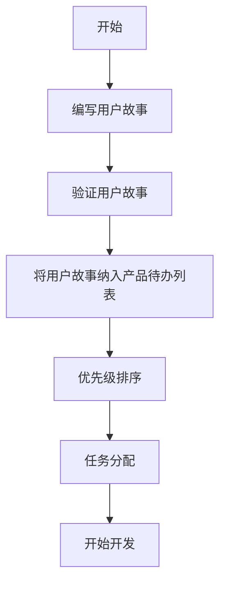

#### 3.2 Sprint规划

Sprint规划是Scrum流程中非常关键的一步。在Sprint规划会议中，团队会确定Sprint的目标、任务和资源分配。

##### 3.2.1 Sprint计划会议

Sprint计划会议通常在Sprint开始前进行，持续时间为1-2小时。会议的主要内容包括：

1. **回顾上一个Sprint的成果和问题**：团队会回顾上一个Sprint的完成情况和遇到的问题，以识别改进点。
2. **确定Sprint目标**：团队会讨论并确定本Sprint的目标，这些目标应该是具体、可衡量的。
3. **任务分配与优先级**：团队会根据Sprint目标，将任务分配给团队成员，并确保任务之间具有合理的优先级。

**Mermaid 流程图：Sprint计划会议流程**

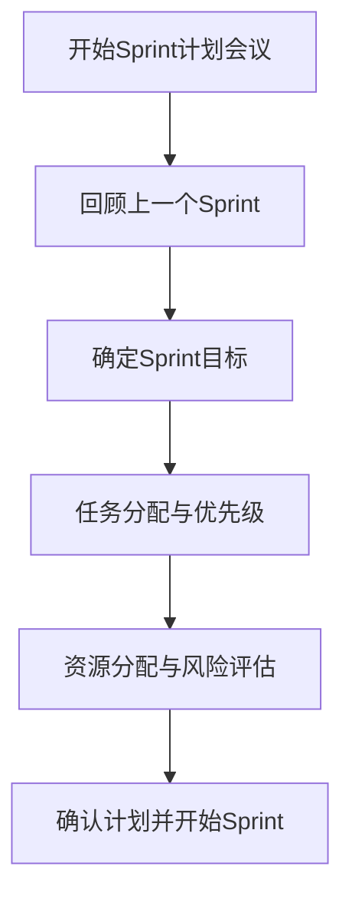

##### 3.2.2 任务分配与优先级

在Sprint规划会议中，任务分配和优先级设定至关重要。以下是一些关键点：

1. **任务分配**：确保每个团队成员都有明确的任务和职责，避免任务重叠或遗漏。
2. **优先级设定**：根据Sprint目标和任务的重要性和紧急程度，设定合理的优先级。高优先级任务应该首先完成。

**Mermaid 流程图：任务分配与优先级设定**

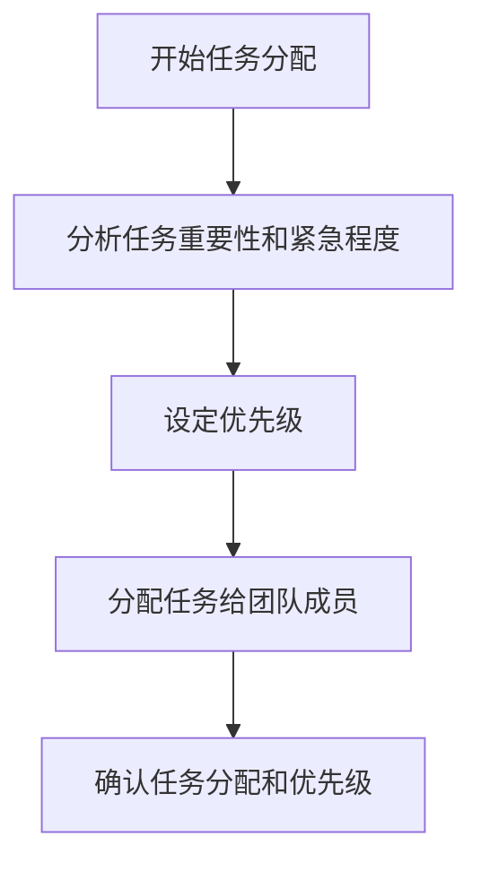

#### 3.3 Daily Scrum

Daily Scrum是Scrum流程中的日常同步会议，通常持续时间为15分钟。Daily Scrum有助于团队同步进度，解决遇到的问题。

##### 3.3.1 Daily Scrum的目的

1. **同步进度**：团队成员分享各自的任务进展和遇到的困难。
2. **问题解决**：团队共同讨论并解决遇到的问题，确保项目按计划进行。
3. **规划当天任务**：根据Daily Scrum的讨论结果，团队成员规划当天的任务。

**Mermaid 流程图：Daily Scrum流程**

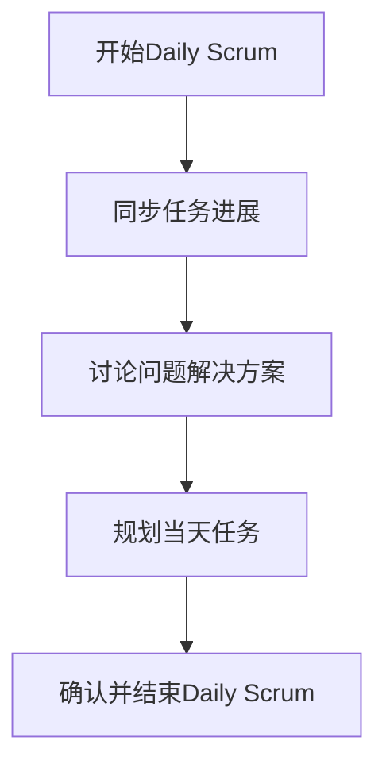

##### 3.3.2 Daily Scrum的流程

Daily Scrum的流程通常包括以下几个步骤：

1. **昨天的任务完成情况**：每个团队成员汇报昨天完成的任务。
2. **今天的计划**：每个团队成员说明今天计划完成的任务。
3. **遇到的问题**：每个团队成员提出遇到的问题，团队共同讨论解决方案。

**Mermaid 流程图：Daily Scrum具体流程**

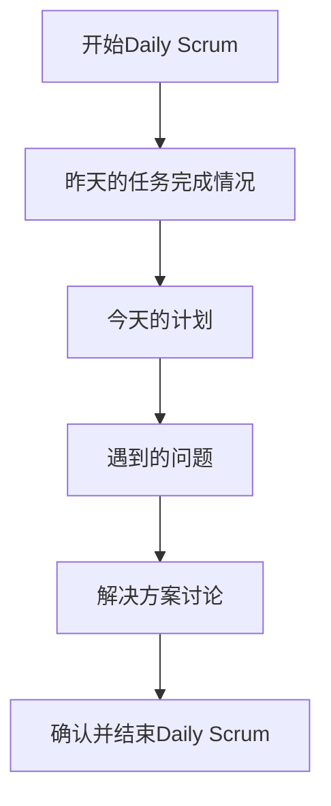

#### 3.4 Sprint Review与Sprint Retrospective

Sprint Review和Sprint Retrospective是Scrum流程中的两个重要会议，分别在Sprint结束时召开。

##### 3.4.1 Sprint Review

Sprint Review是团队向利益相关者展示Sprint成果的会议。其主要内容包括：

1. **产品演示**：团队向利益相关者展示已完成的产品功能或改进。
2. **反馈收集**：利益相关者提供反馈，帮助团队改进产品。

**Mermaid 流程图：Sprint Review流程**

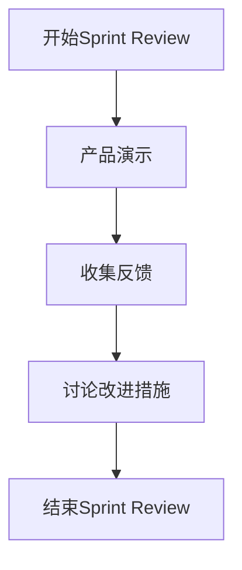

##### 3.4.2 Sprint Retrospective

Sprint Retrospective是团队在Sprint结束时召开的反思会议，旨在评估Sprint过程中的表现，并提出改进措施。其主要内容包括：

1. **评估表现**：团队评估本Sprint的表现，包括进度、质量、团队合作等方面。
2. **问题识别**：团队识别Sprint过程中遇到的问题和挑战。
3. **改进措施**：团队讨论并提出改进措施，以优化未来Sprint的表现。

**Mermaid 流程图：Sprint Retrospective流程**

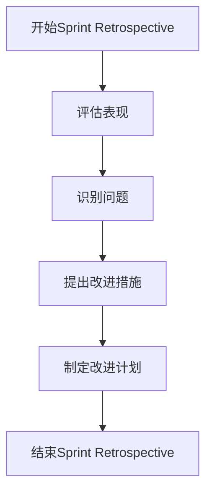

### 第三部分小结

在本部分中，我们详细探讨了如何在LLM应用开发中应用Scrum框架。通过Sprint规划、Daily Scrum、Sprint Review和Sprint Retrospective等实践方法，团队可以更好地管理需求、同步进度、解决问题和持续改进。这些实践方法不仅有助于提高LLM项目的开发效率，还能确保项目质量和客户满意度。下一部分将深入讨论Scrum在LLM应用开发中的最佳实践。 ### 第四部分：Scrum在LLM应用开发中的最佳实践

#### 4.1 持续集成与持续部署

在LLM应用开发中，持续集成（CI）和持续部署（CD）是确保代码质量和交付效率的重要手段。通过CI/CD流程，可以自动化测试和部署代码变更，减少手动操作，提高开发效率和项目质量。

##### 4.1.1 持续集成

持续集成是一种软件开发实践，通过将代码变更频繁地集成到共享的主分支中，并进行自动化测试，确保代码的稳定性和一致性。以下是实施CI的一些最佳实践：

1. **自动化测试**：编写自动化测试用例，覆盖关键功能和边缘情况，确保每次代码变更都能通过测试。
2. **定期构建**：设置定期构建任务，自动编译和打包代码，确保构建过程的一致性。
3. **代码审查**：在提交代码前进行代码审查，确保代码质量，避免引入潜在的问题。

**Mermaid 流程图：CI流程**

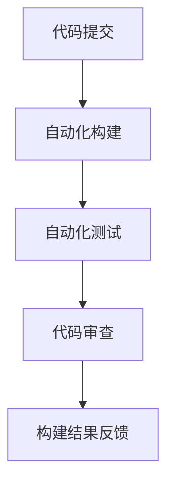

##### 4.1.2 持续部署

持续部署是一种自动化部署代码变更到生产环境的过程。通过CD，可以快速、安全地交付新功能或修复问题。以下是实施CD的一些最佳实践：

1. **环境一致性**：确保开发、测试和生产环境的一致性，减少环境差异导致的问题。
2. **蓝绿部署**：实施蓝绿部署策略，将新版本部署到一部分用户，观察其性能和稳定性，再逐步切换到所有用户。
3. **自动化监控**：部署后，自动监控系统的性能和健康状况，及时发现并解决问题。

**Mermaid 流程图：CD流程**

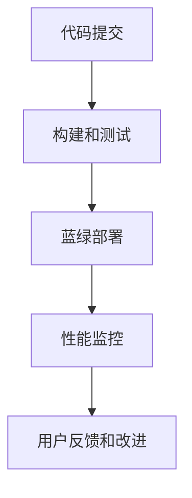

#### 4.2 数据质量管理

数据是LLM模型的基石，数据质量直接影响模型的性能。在Scrum实践中，确保数据质量是一个持续的过程，以下是一些数据质量管理的最佳实践：

##### 4.2.1 数据清洗

数据清洗是数据质量管理的重要环节，通过去除无效数据、填补缺失值、纠正错误数据等方式，提高数据质量。以下是一些常用的数据清洗方法：

1. **缺失值处理**：根据数据的重要性和模式，选择填补缺失值或删除缺失数据。
2. **异常值处理**：检测并处理异常值，避免其对模型训练造成干扰。
3. **数据标准化**：将数据转换为统一的格式和范围，以便后续处理和分析。

**Mermaid 流�程图：数据清洗方法**

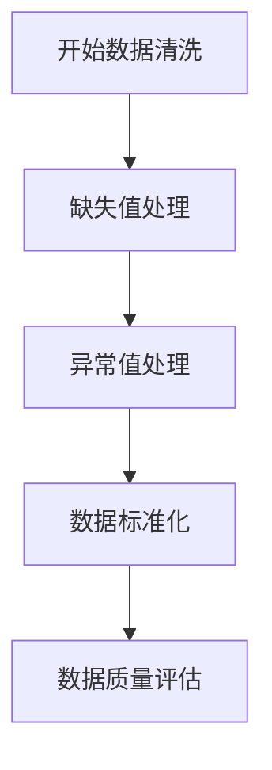

##### 4.2.2 数据监控

数据监控是确保数据质量的重要手段。通过实时监控数据质量，可以及时发现并解决数据问题，以下是一些数据监控的方法：

1. **数据指标**：定义关键数据指标，如数据完整性、数据一致性、数据时效性等，并设置阈值。
2. **实时警报**：当数据质量指标低于阈值时，自动发送警报，通知相关人员。
3. **定期审计**：定期对数据质量进行审计，确保数据质量持续符合要求。

**Mermaid 流程图：数据监控方法**

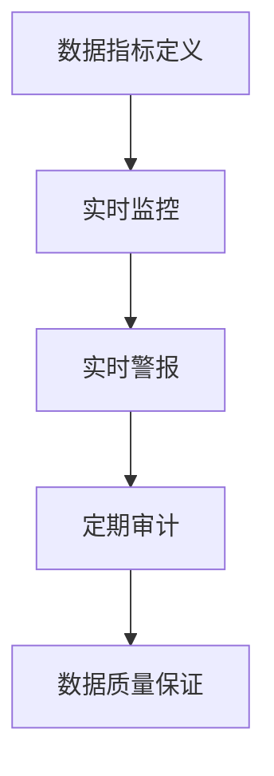

#### 4.3 模型迭代优化

在LLM应用开发中，模型迭代优化是一个持续的过程。通过不断调整和优化模型参数，可以提高模型的性能和适应性。以下是一些模型迭代优化的最佳实践：

##### 4.3.1 模型评估

模型评估是迭代优化的重要环节，通过评估模型在不同数据集上的表现，可以确定模型是否需要调整。以下是一些常用的模型评估方法：

1. **准确率**：评估模型在测试集上的预测准确性。
2. **召回率**：评估模型对正类别的召回能力。
3. **F1分数**：综合考虑准确率和召回率，评估模型的综合性能。

**Mermaid 流程图：模型评估方法**

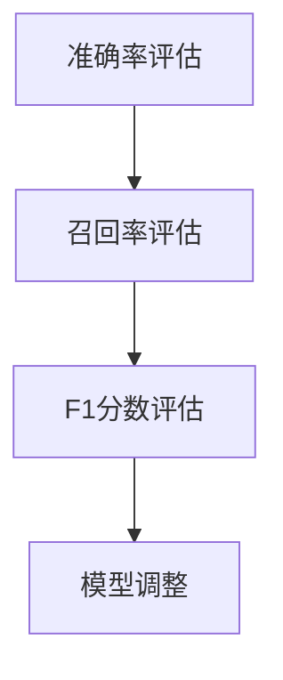

##### 4.3.2 模型优化

模型优化是通过调整模型参数和结构来提高模型性能的过程。以下是一些模型优化的方法：

1. **超参数调优**：通过调整学习率、批量大小等超参数，优化模型性能。
2. **模型压缩**：通过模型剪枝、量化等技术，减小模型体积，提高推理效率。
3. **迁移学习**：利用预训练模型，针对特定任务进行微调，提高模型适应性。

**Mermaid 流程图：模型优化方法**

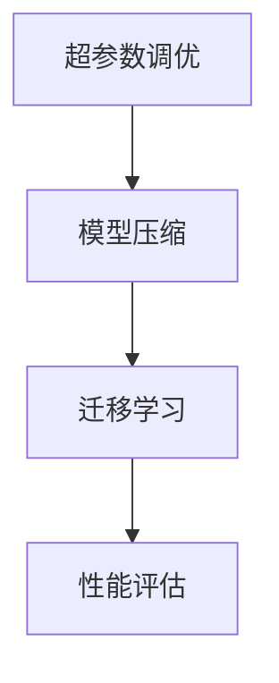

#### 4.4 团队协作与沟通

在LLM应用开发中，团队协作和沟通至关重要。通过有效的沟通和协作，可以确保项目按计划进行，提高团队效率和项目质量。以下是一些团队协作和沟通的最佳实践：

##### 4.4.1 沟通渠道

为了确保团队内部和团队之间的沟通畅通，可以采用以下沟通渠道：

1. **每日站会**：每日站会是团队同步进度、解决问题的重要渠道。
2. **邮件和即时通讯**：对于需要详细讨论或记录的问题，可以通过邮件和即时通讯进行沟通。
3. **文档管理平台**：使用文档管理平台，方便团队成员共享文档和资料。

**Mermaid 流程图：沟通渠道**

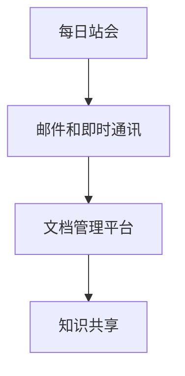

##### 4.4.2 团队协作工具

为了提高团队协作效率，可以采用以下团队协作工具：

1. **项目管理工具**：如JIRA、Trello等，用于任务管理、进度跟踪和协作。
2. **代码管理工具**：如Git、GitHub等，用于代码版本管理和团队协作。
3. **知识库**：如Confluence、Notion等，用于知识共享和文档管理。

**Mermaid 流程图：团队协作工具**

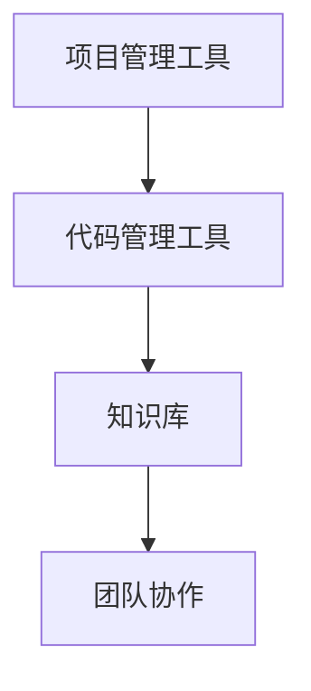

### 第四部分小结

在本部分中，我们探讨了Scrum在LLM应用开发中的最佳实践，包括持续集成与持续部署、数据质量管理、模型迭代优化和团队协作与沟通。这些最佳实践有助于提高LLM项目的开发效率和项目质量，确保团队在快速迭代的开发过程中保持高效和协作。下一部分将结合实际案例，进一步展示Scrum在LLM应用开发中的应用和实践。 ### 第五部分：实际案例分析与讲解

#### 5.1 案例背景

在本节中，我们将通过一个实际案例，展示如何将Scrum框架应用于大型语言模型（LLM）应用开发。这个案例是一个在线问答系统，旨在为用户提供准确、快速的答案。该系统由一家知名互联网公司开发，其目标是在短时间内推出一个具有高用户体验的产品。

#### 5.2 项目介绍

该项目的核心是构建一个基于LLM的问答系统，其主要功能包括：

1. **自然语言理解**：解析用户的查询，提取关键信息。
2. **知识检索**：在庞大的知识库中检索相关信息。
3. **自然语言生成**：根据检索到的信息生成准确的答案。
4. **用户反馈**：收集用户的反馈，用于模型迭代和优化。

#### 5.3 系统功能设计

在Scrum实践中，系统功能设计通常通过用户故事和领域模型进行描述。以下是该项目的主要用户故事和领域模型。

**用户故事：**

- 作为用户，我希望输入一个查询，系统能够提供准确的答案。
- 作为用户，我希望能够对答案进行反馈，以便系统不断优化。
- 作为管理员，我希望能够监控系统的运行状态和性能。

**领域模型：**

```mermaid
classDiagram
    User ..|> Query
    User ..|> Feedback
    Admin ..|> SystemMonitor
    Query <<uses>> KnowledgeBase
    Query <<uses>> AnswerGenerator
    Feedback <<uses>> ModelOptimizer
    SystemMonitor <<uses>> PerformanceMetrics
```

#### 5.4 系统架构设计

系统架构设计是Scrum实践中的关键环节，它决定了系统的可扩展性和稳定性。以下是该项目的系统架构设计。

**Mermaid 架构图：**

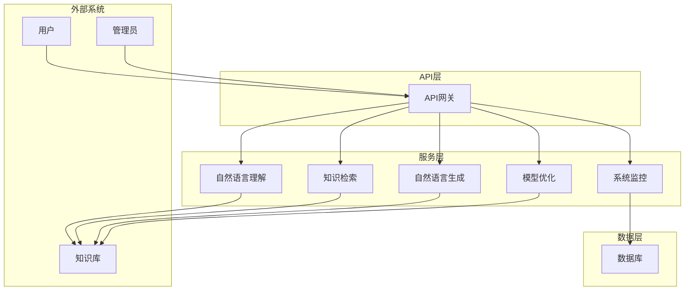

#### 5.5 系统接口设计

系统接口设计是确保不同组件之间高效协作的关键。以下是该项目的系统接口设计。

**Mermaid 序列图：**

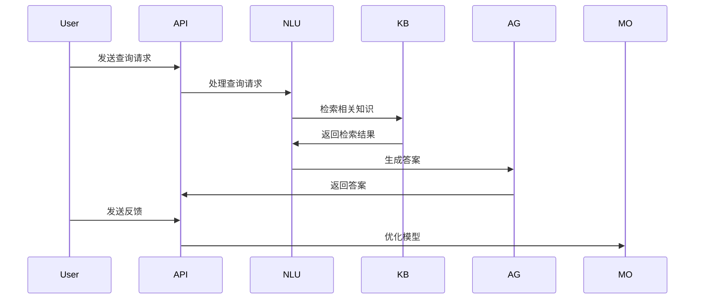

#### 5.6 系统核心实现源代码

以下是该项目的一些核心实现源代码片段，包括自然语言理解、知识检索和自然语言生成。

**Python 代码：**

```python
# 自然语言理解（NLU）
def process_query(query):
    # 提取关键词和意图
    keywords, intent = extract_keywords_and_intent(query)
    return keywords, intent

# 知识检索（KR）
def retrieve_knowledge(keywords):
    # 从知识库中检索相关信息
    relevant_answers = search_knowledge_base(keywords)
    return relevant_answers

# 自然语言生成（AG）
def generate_answer(answers):
    # 综合答案，生成最终回答
    final_answer = combine_answers(answers)
    return final_answer
```

#### 5.7 代码应用解读与分析

以下是代码解读与分析，详细阐述了代码的功能和实现细节。

**代码解读：**

1. **自然语言理解（NLU）**：该模块负责处理用户的查询，提取关键词和意图。通过使用NLP技术，如词频统计、词性标注和语义分析，NLU能够准确理解用户的查询。
2. **知识检索（KR）**：该模块负责从知识库中检索与关键词相关的信息。通过搜索引擎技术，如倒排索引和向量空间模型，KR能够高效地检索相关知识。
3. **自然语言生成（AG）**：该模块负责根据检索到的信息生成最终答案。通过模板匹配和语言模型技术，AG能够生成准确、自然的答案。

**分析：**

1. **代码质量**：代码具有良好的结构，每个模块的功能明确，易于维护和扩展。
2. **性能**：代码采用了高效的算法和数据结构，如倒排索引和向量空间模型，确保了快速的检索和生成过程。
3. **可扩展性**：代码具有良好的可扩展性，通过模块化设计，可以方便地添加新的功能和特性。

#### 5.8 案例小结

通过本案例，我们展示了如何将Scrum框架应用于LLM应用开发。从用户故事编写、领域模型设计、系统架构设计、接口设计到核心代码实现，Scrum框架为我们提供了一套系统的开发流程和实践方法。以下是本案例的主要收获和经验：

1. **敏捷开发**：Scrum框架促进了敏捷开发，提高了团队响应变化的能力。
2. **持续迭代**：通过持续迭代，团队能够快速地交付可用的产品功能，并及时收集用户反馈。
3. **高效协作**：Scrum框架强调了团队协作和沟通，确保了项目的高效执行和成功交付。
4. **质量保证**：通过CI/CD、数据质量和模型优化等最佳实践，项目保证了高质量和高性能。

### 第五部分小结

在本部分中，我们通过一个实际案例，详细展示了Scrum框架在LLM应用开发中的应用和实践。从需求分析、系统设计到代码实现，Scrum框架为团队提供了一套系统的开发流程和实践方法。通过本案例，我们深刻体会到了Scrum框架在提高开发效率、项目质量和团队协作方面的优势。下一部分将总结全文，并给出一些注意事项和拓展阅读建议。 ### 第六部分：注意事项与拓展阅读

#### 6.1 注意事项

在应用Scrum框架进行LLM应用开发时，需要注意以下几点：

1. **需求管理**：确保用户故事明确、具体，避免需求变更频繁，影响项目进度。
2. **数据质量**：重视数据质量管理，确保数据质量符合模型训练和推理的需求。
3. **计算资源**：合理规划计算资源，确保模型训练和推理的顺利进行。
4. **团队协作**：加强团队协作，确保团队成员之间沟通畅通，共同解决问题。
5. **迭代优化**：持续迭代优化模型和系统，提高性能和用户体验。

#### 6.2 拓展阅读

为了更深入地了解Scrum框架在LLM应用开发中的应用，建议读者阅读以下书籍和资料：

1. **《Scrum敏捷开发实践指南》**：提供详细的Scrum实践方法和案例，适合初学者和进阶者。
2. **《深度学习》**：介绍深度学习的基本原理和模型，适合希望深入了解LLM技术的人员。
3. **《大型语言模型：原理与应用》**：详细介绍大型语言模型的技术原理和应用场景，适合对LLM技术感兴趣的读者。
4. **《敏捷开发：原则、实践与模式》**：探讨敏捷开发在不同领域的应用，提供丰富的实践经验和案例。

### 第六部分小结

在本部分中，我们总结了一些应用Scrum框架进行LLM应用开发时的注意事项，并推荐了一些拓展阅读资源。通过这些注意事项和拓展阅读，读者可以更加全面地了解Scrum框架在LLM应用开发中的应用和实践，从而提高项目开发效率和成果质量。

### 全文总结

本文以《Scrum框架在LLM应用开发中的应用与实践》为题，系统地介绍了Scrum框架的基本概念、方法及其在LLM应用开发中的实际应用。通过详细的需求分析、迭代规划、任务分配、每日同步、回顾与反思等环节，本文展示了如何有效地应用Scrum框架，提高LLM项目的开发效率和成果质量。

本文的关键点包括：

1. **Scrum框架的基本概念与方法**：介绍了Scrum的定义、核心原则和基本流程。
2. **LLM应用开发的需求分析**：探讨了LLM应用开发的特点和需求管理方法。
3. **Scrum在LLM应用开发中的实践**：详细阐述了Sprint规划、Daily Scrum、Sprint Review和Sprint Retrospective等实践方法。
4. **最佳实践与案例分析**：通过实际案例，展示了Scrum在LLM应用开发中的应用和实践。
5. **注意事项与拓展阅读**：给出了应用Scrum框架时的注意事项和拓展阅读资源。

通过本文的阅读，读者可以全面了解Scrum框架在LLM应用开发中的应用，掌握Scrum实践方法，并在实际项目中取得更好的效果。

### 作者信息

**作者：AI天才研究院/AI Genius Institute & 禅与计算机程序设计艺术 /Zen And The Art of Computer Programming**

本文由AI天才研究院和《禅与计算机程序设计艺术》的作者共同撰写，旨在为读者提供高质量的技术内容，帮助他们在人工智能和软件开发领域取得成功。感谢您的阅读和支持！ 

