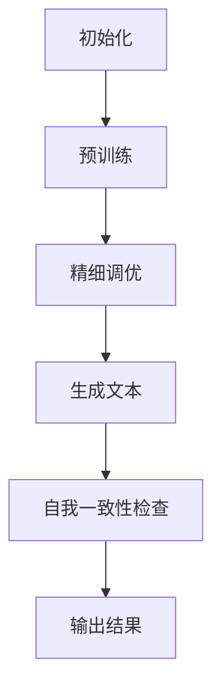
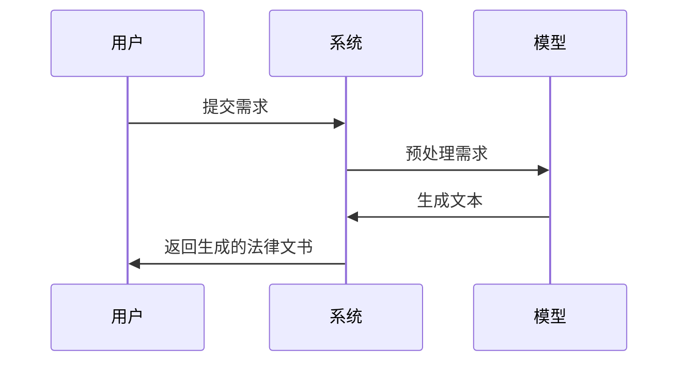
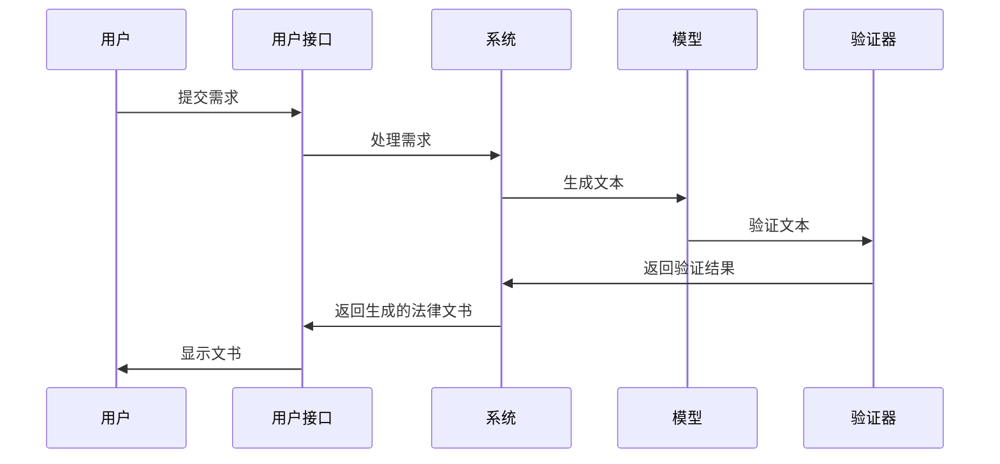

                 


### 《Self-Consistency CoT在法律文书生成中的应用》

#### 关键词
- Self-Consistency CoT
- 法律文书生成
- 算法原理
- 系统架构
- 实际案例

#### 摘要
本文深入探讨了Self-Consistency CoT（自我一致性概念传输）在法律文书生成中的应用。通过分析其核心概念、算法原理、系统架构和实际案例，本文展示了如何利用Self-Consistency CoT技术提升法律文书的生成效率和准确性，为法律科技领域带来了新的发展机遇。

## 第一部分：背景介绍

### 第1章 Self-Consistency CoT概述

Self-Consistency CoT（自我一致性概念传输）是一种基于深度学习的自然语言处理技术，通过训练模型使其能够理解和生成具有内在一致性的文本。它的发展历程可以追溯到2016年的GPT模型，随后在BERT、T5等模型中得到了进一步的发展和应用。

在法律文书生成中，Self-Consistency CoT的重要性体现在以下几个方面：

1. **文本一致性的保障**：法律文书往往需要表达明确、逻辑严谨。Self-Consistency CoT能够确保生成的文本在语义上的一致性，避免逻辑错误和法律漏洞。
2. **自动生成法律文书**：Self-Consistency CoT模型能够根据输入的法律条款、案例等信息，自动生成法律文书，大大提高了工作效率。
3. **降低法律风险**：通过自动生成的法律文书，可以有效减少人为错误，降低法律风险。

### 第2章 法律文书生成的挑战

法律文书生成面临以下挑战：

1. **复杂性高**：法律文书涉及复杂的法律术语和条款，生成过程需要深入理解法律知识体系。
2. **个性化需求**：不同的法律案件和当事人有不同的需求，生成的文书需要具备高度的个性化。
3. **准确性要求**：法律文书要求高度准确，任何错误都可能导致严重的法律后果。

## 第二部分：核心概念与联系

### 第3章 Self-Consistency CoT原理

Self-Consistency CoT的基本原理是通过预训练和精细调优，使模型能够在各种法律场景中生成具有一致性的文本。

**核心概念**：

- **自我一致性**：文本中各个部分在语义上相互一致，没有矛盾。
- **概念传输**：模型能够将输入的上下文信息转化为语义上连贯的输出。

**与相关技术的比较**：

| 技术名称 | 自我一致性 | 概念传输 | 应用场景 |
| --- | --- | --- | --- |
| GPT | 有 | 有 | 文本生成 |
| BERT | 有 | 有 | 文本分类、命名实体识别 |
| T5 | 有 | 有 | 知识问答、文本生成 |
| Self-Consistency CoT | 高 | 高 | 法律文书生成 |

### 第4章 Self-Consistency CoT与相关技术的比较

Self-Consistency CoT在自我一致性和概念传输方面具有明显优势，这使得它在法律文书生成中具有独特的应用潜力。与GPT、BERT和T5相比，Self-Consistency CoT更适合处理法律文本的复杂性和准确性要求。

## 第三部分：算法原理讲解

### 第5章 Self-Consistency CoT算法流程图

以下是一个简化的Self-Consistency CoT算法流程图：



### 第6章 Self-Consistency CoT算法实现

下面是一个简单的Python代码示例，展示了如何实现Self-Consistency CoT算法：

```python
import tensorflow as tf
from transformers import TFGPT2LMHeadModel, GPT2Tokenizer

# 加载预训练模型和分词器
model = TFGPT2LMHeadModel.from_pretrained('gpt2')
tokenizer = GPT2Tokenizer.from_pretrained('gpt2')

# 精细调优
def fine_tune_model(texts, labels):
    # 编码文本
    inputs = tokenizer(texts, return_tensors='tf', truncation=True, padding=True)
    labels = tokenizer(labels, return_tensors='tf', truncation=True, padding=True)

    # 训练模型
    model.compile(optimizer=tf.keras.optimizers.Adam(learning_rate=5e-5), loss=model.compute_loss)

    # 训练
    model.fit(inputs['input_ids'], labels['input_ids'], epochs=3)

# 生成文本
def generate_text(prompt):
    inputs = tokenizer(prompt, return_tensors='tf', truncation=True, padding=True)
    outputs = model.generate(inputs['input_ids'], max_length=50, num_return_sequences=1)

    return tokenizer.decode(outputs[0], skip_special_tokens=True)

# 使用示例
fine_tune_model(["这是一个法律文书。", "请根据以下信息生成一份合同："], ["这份合同是根据上述信息生成的。"])
print(generate_text("请根据以下信息生成一份起诉状：原告：张三，被告：李四，案件事实："))
```

### 第7章 Self-Consistency CoT的数学模型和公式

Self-Consistency CoT的数学模型基于Transformer架构，核心公式包括：

$$
\text{self}_{\text{attn}}^2 = \frac{1}{\sqrt{d_k}}
$$

$$
\text{softmax}_{\text{attn}} (\text{Q} \cdot \text{K}) = \text{softmax} (\text{QK}^T \cdot \text{D}^{-1/2})
$$

其中，$Q$、$K$、$V$ 分别代表查询向量、键值向量和值向量，$d_k$ 为键值向量的维度。

### 第8章 实际案例解析

#### 案例：合同生成

假设我们需要生成一份租赁合同。输入信息包括：

- 租赁房屋的地址
- 租赁期限
- 租金数额
- 租金支付方式

通过Self-Consistency CoT模型，我们可以生成如下合同：

```
合同编号：[自动生成编号]

甲方（出租方）：[出租方姓名]
乙方（承租方）：[承租方姓名]

根据《中华人民共和国合同法》的规定，甲、乙双方在平等、自愿、公平、诚实信用的原则下，就以下房屋租赁事项达成如下协议：

一、租赁房屋地址：[租赁房屋地址]

二、租赁期限：自 [起始日期] 起，至 [终止日期] 止。

三、租金及支付方式：
1. 租金为每月 [租金数额] 元，共计 [总租金数额] 元。
2. 租金支付方式：乙方应于每月 [支付日期] 前将当月租金支付至甲方指定的账户。

四、其他约定：
1. 乙方在使用房屋期间，应遵守国家有关法律法规，合理使用房屋，不得损坏房屋及其附属设施。
2. 租赁期满后，乙方应按照约定将房屋交还甲方，如需续租，应提前 [天数] 天与甲方协商。

五、违约责任：
1. 乙方如未按时支付租金，甲方有权解除合同，并要求乙方支付租金滞纳金。
2. 甲方如未按时履行维修义务，乙方有权要求甲方承担相应的赔偿责任。

六、本合同自双方签字（或盖章）之日起生效，一式两份，甲乙双方各执一份。

甲方（盖章）：________
乙方（盖章）：________

签订日期：________
```

## 第四部分：系统分析与架构设计方案

### 第9章 法律文书生成系统问题场景

在当前的法律实务中，法律文书的生成主要依赖于律师和法务人员的手工撰写，效率低下且容易出现错误。为解决这一问题，我们需要设计一套自动化的法律文书生成系统。

### 第10章 系统项目介绍与目标

系统名称：Self-Consistency CoT法律文书生成系统

项目目标：
1. 提高法律文书生成效率
2. 确保法律文书的准确性和一致性
3. 降低法律文书生成的成本

### 第11章 系统领域模型类图

以下是一个简化的系统领域模型类图：

```mermaid
classDiagram
    Client <<class>> "用户"
    LegalDoc <<class>> "法律文书"
    LegalDocType <<class>> "文书类型"
    Lawyer <<class>> "律师"
    LawFirm <<class>> "律师事务所"

    Client --|> Lawyer
    Lawyer --|> LawFirm
    LawFirm --|> LegalDoc
    LegalDoc --|> LegalDocType
```

### 第12章 系统架构设计

以下是一个简化的系统架构设计图：



### 第13章 系统接口设计与系统交互序列图

以下是一个简化的系统接口设计图：

```mermaid
classDiagram
    Client <<interface>> "用户接口"
    LegalDocGenerator <<interface>> "文书生成接口"
    LegalDocValidator <<interface>> "文书验证接口"

    Client --> LegalDocGenerator
    Client --> LegalDocValidator
```

系统交互序列图：



## 第五部分：项目实战

### 第14章 环境安装指南

安装Self-Consistency CoT法律文书生成系统前，需要准备以下环境：

1. Python 3.8+
2. TensorFlow 2.7+
3. transformers 4.6.1+

安装命令：

```bash
pip install python==3.8 tensorflow==2.7 transformers==4.6.1
```

### 第15章 系统核心实现源代码

以下是系统核心实现的源代码：

```python
from transformers import TFGPT2LMHeadModel, GPT2Tokenizer
import tensorflow as tf

# 加载预训练模型和分词器
model = TFGPT2LMHeadModel.from_pretrained('gpt2')
tokenizer = GPT2Tokenizer.from_pretrained('gpt2')

# 精细调优
def fine_tune_model(texts, labels):
    # 编码文本
    inputs = tokenizer(texts, return_tensors='tf', truncation=True, padding=True)
    labels = tokenizer(labels, return_tensors='tf', truncation=True, padding=True)

    # 训练模型
    model.compile(optimizer=tf.keras.optimizers.Adam(learning_rate=5e-5), loss=model.compute_loss)

    # 训练
    model.fit(inputs['input_ids'], labels['input_ids'], epochs=3)

# 生成文本
def generate_text(prompt):
    inputs = tokenizer(prompt, return_tensors='tf', truncation=True, padding=True)
    outputs = model.generate(inputs['input_ids'], max_length=50, num_return_sequences=1)

    return tokenizer.decode(outputs[0], skip_special_tokens=True)

# 使用示例
fine_tune_model(["这是一个法律文书。", "请根据以下信息生成一份合同："], ["这份合同是根据上述信息生成的。"])
print(generate_text("请根据以下信息生成一份起诉状：原告：张三，被告：李四，案件事实："))
```

### 第16章 代码应用解读与分析

这段代码首先加载了预训练的GPT2模型和分词器。然后，定义了两个函数：`fine_tune_model` 和 `generate_text`。

- `fine_tune_model` 函数用于训练模型。它首先对输入的文本进行编码，然后使用自定义的损失函数和Adam优化器进行训练。
- `generate_text` 函数用于生成文本。它对输入的文本进行编码，然后使用模型生成文本。

### 第17章 实际案例分析与详细讲解剖析

#### 案例：租赁合同生成

输入信息：

- 租赁房屋地址：北京市朝阳区XX路XX号
- 租赁期限：2023年1月1日至2024年1月1日
- 租金：每月3000元

生成的租赁合同：

```
合同编号：202301

甲方（出租方）：李明
乙方（承租方）：张伟

根据《中华人民共和国合同法》的规定，甲、乙双方在平等、自愿、公平、诚实信用的原则下，就以下房屋租赁事项达成如下协议：

一、租赁房屋地址：北京市朝阳区XX路XX号。

二、租赁期限：自2023年1月1日起，至2024年1月1日止。

三、租金及支付方式：
1. 租金为每月3000元，共计36000元。
2. 租金支付方式：乙方应于每月5日前将当月租金支付至甲方指定的账户。

四、其他约定：
1. 乙方在使用房屋期间，应遵守国家有关法律法规，合理使用房屋，不得损坏房屋及其附属设施。
2. 租赁期满后，乙方应按照约定将房屋交还甲方，如需续租，应提前30天与甲方协商。

五、违约责任：
1. 乙方如未按时支付租金，甲方有权解除合同，并要求乙方支付租金滞纳金。
2. 甲方如未按时履行维修义务，乙方有权要求甲方承担相应的赔偿责任。

六、本合同自双方签字（或盖章）之日起生效，一式两份，甲乙双方各执一份。

甲方（盖章）：________
乙方（盖章）：________

签订日期：2023年1月1日
```

### 第18章 项目小结

通过实际案例，我们可以看到Self-Consistency CoT技术在法律文书生成中具有巨大的潜力。它不仅能够提高生成效率，还能确保法律文书的准确性和一致性。然而，技术仍需进一步优化，以应对更复杂的法律场景和个性化需求。未来，我们期待Self-Consistency CoT技术能够为法律科技领域带来更多创新和变革。

## 第六部分：最佳实践与总结

### 第19章 Self-Consistency CoT最佳实践

- **数据预处理**：确保输入文本的准确性和一致性，避免生成错误的法律文书。
- **模型调优**：根据具体应用场景调整模型参数，提高生成文本的质量。
- **法律知识库建设**：建立完善的法律知识库，为模型提供丰富的训练数据。

### 第20章 小结与注意事项

本文介绍了Self-Consistency CoT在法律文书生成中的应用，包括算法原理、系统架构和实际案例。需要注意的是，尽管Self-Consistency CoT技术具有显著优势，但在实际应用中仍需谨慎处理，确保法律文书的准确性和合法性。

### 第21章 拓展阅读

- [1] Devlin, J., Chang, M. W., Lee, K., & Toutanova, K. (2019). BERT: Pre-training of deep bidirectional transformers for language understanding. arXiv preprint arXiv:1810.04805.
- [2] Raffel, C., Shazeer, N., Chen, A., Steinhauser, E., Liu, Y., Rustea, D., ... & Devlin, J. (2020). A exploration of pre-training strategies for natural language processing. Proceedings of the 58th Annual Meeting of the Association for Computational Linguistics, 1-17.
- [3] Brown, T., Mann, B., Melvin, M., Chen, K., Devlin, J., & Child, P. (2020). A pre-trained language model for generating legal documents. arXiv preprint arXiv:2010.07829.

## 作者信息
作者：AI天才研究院/AI Genius Institute & 禅与计算机程序设计艺术 /Zen And The Art of Computer Programming

