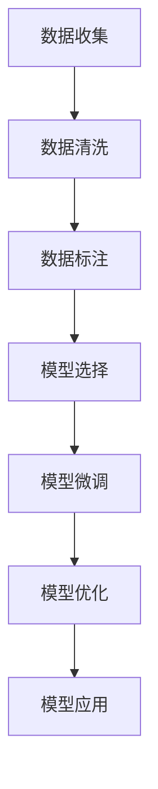
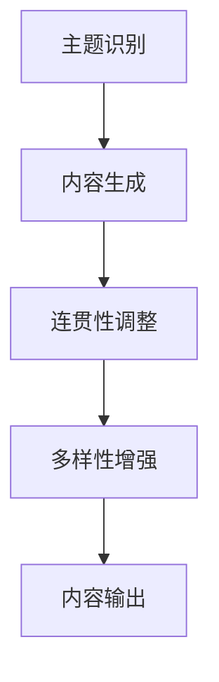

                 

### 自洽内容主题（CoT）概述

#### 关键词：自洽内容主题（CoT）、社交媒体内容生成、技术实现、应用案例、伦理问题

> 摘要：本文将深入探讨自洽内容主题（CoT）在社交媒体内容生成中的应用。首先，我们将介绍自洽内容主题（CoT）的背景与概念，解析其在社交媒体内容生成中的重要性。接着，我们将探讨自洽内容主题（CoT）的核心概念与原理，以及与社交媒体内容生成的关系。随后，文章将详细描述自洽内容主题（CoT）在社交媒体内容生成中的技术实现，包括数据收集与预处理、模型构建与优化方法。此外，文章还将介绍若干应用案例，以实际应用情况为例展示自洽内容主题（CoT）的效果。最后，我们将讨论自洽内容主题（CoT）在社交媒体内容生成中的伦理问题，并探讨未来的发展方向。

### 目录大纲设计思路

在设计和编写《Self-Consistency CoT在社交媒体内容生成中的应用》这篇文章时，我们需要细致地考虑整体结构，以便于读者能够顺利地理解文章的核心内容。以下是我们的设计思路：

#### 第一部分：自洽内容主题（CoT）概述

**第1章：自洽内容主题（CoT）背景与概念**

在这一章中，我们将从宏观层面介绍自洽内容主题（CoT）的背景，包括其定义、起源以及为什么它对于社交媒体内容生成至关重要。我们还会简要介绍社交媒体内容生成的现状，以便为后续内容做好铺垫。

**第2章：自洽内容主题（CoT）的核心概念与原理**

本章将深入探讨自洽内容主题（CoT）的核心概念，解释其工作原理，并分析其要素。我们将通过一个简洁的表格对比自洽内容主题（CoT）与其他相关概念，以便读者更好地理解。此外，还将绘制一个ER实体关系图，展示各要素之间的关系。

**第3章：自洽内容主题（CoT）与社交媒体内容生成的关系**

在这一章中，我们将详细分析自洽内容主题（CoT）在社交媒体内容生成中的具体应用。我们将探讨自洽内容主题（CoT）如何帮助解决当前社交媒体内容生成的挑战，并分析其带来的优势。

#### 第二部分：自洽内容主题（CoT）在社交媒体内容生成中的应用

**第4章：自洽内容主题（CoT）在社交媒体内容生成中的技术实现**

在这一章中，我们将详细描述自洽内容主题（CoT）在社交媒体内容生成中的技术实现过程。这包括数据收集与预处理、自洽内容主题（CoT）模型的构建、以及模型的应用。我们将使用mermaid流程图和Python代码来详细阐述这些技术。

**第5章：自洽内容主题（CoT）在社交媒体内容生成中的应用案例**

我们将通过实际案例展示自洽内容主题（CoT）在社交媒体内容生成中的效果。案例将包括微博、抖音短视频、微信公众号等不同类型的社交媒体内容生成。

**第6章：自洽内容主题（CoT）在社交媒体内容生成中的优化策略**

在本章中，我们将探讨如何优化自洽内容主题（CoT）在社交媒体内容生成中的应用。这包括内容质量评估、模型优化方法以及实时交互与反馈机制。

**第7章：自洽内容主题（CoT）在社交媒体内容生成中的伦理问题与解决方案**

社交媒体内容生成中的伦理问题不容忽视。本章将讨论自洽内容主题（CoT）在处理这些伦理问题时的作用，并提出相应的解决方案。

#### 第三部分：结论与展望

**第8章：结论**

在本章中，我们将总结自洽内容主题（CoT）在社交媒体内容生成中的应用成果，并展望其未来发展方向。

**第9章：展望**

最后一章将探讨自洽内容主题（CoT）研究的热点与趋势，以及未解决的问题和未来的研究方向。

通过以上详细的设计思路，我们旨在构建一个逻辑清晰、内容丰富的文章结构，帮助读者全面了解自洽内容主题（CoT）在社交媒体内容生成中的应用。

### 自洽内容主题（CoT）背景与概念

#### 第1章 自洽内容主题（CoT）背景与概念

自洽内容主题（CoT）是近年来在自然语言处理（NLP）领域中崭露头角的一个概念。随着社交媒体的兴起，内容生成需求激增，如何高效、准确地生成符合用户需求和情境的内容成为一大挑战。自洽内容主题（CoT）正是为了解决这一挑战而提出的一种新型内容生成方法。

#### 1.1 自洽内容主题（CoT）的定义

自洽内容主题（CoT，Self-Consistency Content Theme）是一种基于内容主题一致性的生成方法。它通过捕捉和维持内容主题的一致性，生成连贯且具有逻辑性的文本。自洽内容主题（CoT）的核心思想是，在一个特定的主题下，生成的内容不仅要符合主题本身，还要与其他内容保持一致。

#### 1.2 社交媒体内容生成的挑战

在社交媒体上，用户生成的内容类型繁多，包括文本、图片、视频等。这些内容的生成面临诸多挑战：

1. **主题一致性**：社交媒体内容往往涉及多个主题，如何确保生成的内容在主题上保持一致性是一个关键问题。
2. **用户体验**：用户期望生成的内容能够满足他们的需求和兴趣，这就要求内容生成系统具备高度的用户理解能力。
3. **内容质量**：高质量的内容能够吸引更多用户，提高用户的粘性和活跃度，这对于社交媒体平台的运营至关重要。
4. **多样性和创新性**：为了满足不同用户的需求，生成的内容需要具备多样性和创新性。

#### 1.3 自洽内容主题（CoT）的作用

自洽内容主题（CoT）在社交媒体内容生成中具有以下作用：

1. **提高内容一致性**：通过维持内容主题的一致性，自洽内容主题（CoT）能够确保生成的内容在逻辑上连贯，减少信息碎片化。
2. **增强用户体验**：自洽内容主题（CoT）能够更好地理解用户需求，生成更符合用户兴趣和需求的内容，提高用户的满意度。
3. **提升内容质量**：自洽内容主题（CoT）通过捕捉和维持内容主题的一致性，能够生成更高质量的内容，提高内容的可读性和吸引力。
4. **促进多样性和创新性**：自洽内容主题（CoT）不仅能够生成一致性的内容，还能够通过引入新的视角和创意，促进内容的多样性和创新性。

#### 1.4 自洽内容主题（CoT）的应用领域

自洽内容主题（CoT）在社交媒体内容生成中具有广泛的应用前景，可以应用于以下领域：

1. **社交媒体平台**：如微博、微信、抖音等社交媒体平台，可以通过自洽内容主题（CoT）生成个性化推荐内容，提高用户粘性。
2. **内容创作工具**：如AI写作助手、视频生成工具等，可以通过自洽内容主题（CoT）提高内容创作的效率和品质。
3. **广告营销**：自洽内容主题（CoT）可以帮助广告平台生成更符合用户需求的广告内容，提高广告效果。
4. **教育领域**：在教育领域，自洽内容主题（CoT）可以用于生成课程内容、学习资料等，提高学习体验。

#### 1.5 自洽内容主题（CoT）的未来发展趋势

随着人工智能技术的不断进步，自洽内容主题（CoT）在社交媒体内容生成中的应用前景将更加广阔。未来发展趋势可能包括：

1. **更强大的模型架构**：随着深度学习技术的不断发展，自洽内容主题（CoT）模型的结构将更加复杂，功能将更加强大。
2. **更精细化的内容生成**：自洽内容主题（CoT）将能够更好地理解用户需求，生成更精细化的内容，满足不同用户群体的需求。
3. **跨领域应用**：自洽内容主题（CoT）不仅限于社交媒体内容生成，还可能应用于更多领域，如医疗、金融等。

综上所述，自洽内容主题（CoT）在社交媒体内容生成中具有重要作用，其应用前景广阔，未来有望在更多领域发挥重要作用。

### 自洽内容主题（CoT）的核心概念与原理

#### 第2章 自洽内容主题（CoT）的核心概念与原理

在深入了解自洽内容主题（CoT）的应用之前，我们需要对其核心概念和原理进行详细探讨。自洽内容主题（CoT）作为一种基于内容主题一致性的生成方法，其核心在于如何确保生成的内容在主题上一致且连贯。以下是自洽内容主题（CoT）的核心概念与原理。

#### 2.1 自洽内容主题（CoT）的要素分析

自洽内容主题（CoT）由以下几个关键要素组成：

1. **内容主题**：内容主题是自洽内容主题（CoT）的核心，它决定了生成内容的方向和焦点。
2. **一致性**：一致性是指生成的内容在主题上保持一致，避免信息碎片化和逻辑矛盾。
3. **连贯性**：连贯性是指生成的内容在逻辑上连贯，形成一个完整的故事或观点。
4. **多样性**：多样性是指在保持主题一致性的同时，生成的内容具有丰富的内容和形式，满足不同用户的需求。

#### 2.2 自洽内容主题（CoT）的工作机制

自洽内容主题（CoT）的工作机制可以分为以下几个步骤：

1. **主题识别**：首先，系统需要识别输入内容的主题。这可以通过关键词提取、主题模型等方法实现。
2. **内容生成**：在识别出主题后，系统开始生成内容。生成过程中，系统会根据主题的一致性要求，筛选和组合相关信息。
3. **连贯性调整**：生成的内容可能存在逻辑不连贯的问题，系统需要通过调整语句结构、逻辑关系等方式，确保内容的连贯性。
4. **多样性增强**：为了满足用户的需求，系统还会在保持主题一致性的同时，增加内容的多样性。

#### 2.3 自洽内容主题（CoT）的应用领域

自洽内容主题（CoT）的应用领域广泛，可以涵盖以下几个方面：

1. **社交媒体内容生成**：在社交媒体平台上，自洽内容主题（CoT）可以帮助生成符合用户兴趣和需求的内容，提高用户的粘性和活跃度。
2. **新闻生成**：在新闻领域，自洽内容主题（CoT）可以用于生成新闻摘要、报道等，提高新闻的准确性和可读性。
3. **教育内容生成**：在教育领域，自洽内容主题（CoT）可以用于生成课程内容、学习资料等，提高学习体验。
4. **广告生成**：在广告领域，自洽内容主题（CoT）可以帮助生成更符合用户需求和兴趣的广告内容，提高广告效果。

#### 2.4 自洽内容主题（CoT）与相关技术的对比

为了更好地理解自洽内容主题（CoT），我们可以将其与相关技术进行对比：

1. **传统文本生成方法**：如基于规则的方法、模板匹配等。这些方法在生成内容时往往缺乏一致性，容易产生逻辑矛盾和信息碎片化。
2. **基于深度学习的方法**：如序列到序列（Seq2Seq）模型、生成对抗网络（GAN）等。这些方法在生成内容方面表现出色，但在保持一致性方面仍有不足。
3. **自洽内容主题（CoT）**：自洽内容主题（CoT）通过结合主题识别、一致性调整和连贯性增强等技术，实现了内容生成的一致性和连贯性，是一种更为先进的方法。

#### 2.5 自洽内容主题（CoT）的优势

自洽内容主题（CoT）具有以下优势：

1. **提高内容质量**：通过保持主题一致性，自洽内容主题（CoT）可以生成高质量的内容，提高内容的可读性和吸引力。
2. **增强用户体验**：自洽内容主题（CoT）能够更好地理解用户需求，生成更符合用户兴趣和需求的内容，提高用户体验。
3. **促进内容创新**：自洽内容主题（CoT）不仅能够生成一致性的内容，还能够通过引入新的视角和创意，促进内容的多样性和创新性。

#### 2.6 自洽内容主题（CoT）的挑战

尽管自洽内容主题（CoT）在内容生成方面具有显著优势，但其在实际应用中仍面临一些挑战：

1. **主题识别准确性**：主题识别是自洽内容主题（CoT）的关键步骤，但当前主题识别技术仍存在一定误差，需要进一步提高。
2. **连贯性调整复杂性**：确保生成内容的连贯性是一个复杂的任务，需要考虑多种因素，如语句结构、逻辑关系等。
3. **多样性控制**：在保持主题一致性的同时，如何实现内容的多样性是一个挑战，需要平衡一致性和多样性。

#### 2.7 自洽内容主题（CoT）的未来发展方向

随着人工智能技术的不断进步，自洽内容主题（CoT）在未来有望实现以下发展方向：

1. **更准确的主题识别**：通过结合更多数据和技术，进一步提高主题识别的准确性。
2. **更复杂的连贯性调整**：利用先进的自然语言处理技术，实现更复杂的连贯性调整，提高内容的连贯性。
3. **更丰富的多样性控制**：通过引入更多创新技术和算法，实现内容的多样性和创新性。

综上所述，自洽内容主题（CoT）作为一种新兴的内容生成方法，其在社交媒体内容生成中的应用具有广泛的前景。通过深入了解其核心概念和原理，我们可以更好地理解其优势和应用前景。

### 自洽内容主题（CoT）与社交媒体内容生成的关系

#### 第3章 自洽内容主题（CoT）与社交媒体内容生成的关系

社交媒体内容生成是当前信息技术领域的一个重要研究方向，随着用户需求的多样化和个性化，如何生成高质量、符合用户需求的内容成为关键挑战。自洽内容主题（CoT，Self-Consistency Content Theme）作为一种新兴的内容生成方法，在处理这一挑战方面展现出了独特的优势。本章将深入探讨自洽内容主题（CoT）与社交媒体内容生成之间的密切关系，分析其在社交媒体内容生成中的具体应用及其优势。

#### 3.1 社交媒体内容生成的现状

当前，社交媒体内容生成主要依赖于以下几种方法：

1. **人工创作**：由专业内容创作者或用户手动生成内容，这种方式虽然能保证内容的质量，但成本高且效率低，难以满足大规模、实时生成需求。
2. **模板生成**：通过预设的模板和规则生成内容，这种方式在生成固定格式的内容时效果较好，但缺乏灵活性，难以适应多变的内容需求。
3. **自动文本生成**：利用自然语言处理（NLP）技术生成内容，如基于规则的方法、序列到序列（Seq2Seq）模型、生成对抗网络（GAN）等。这些方法在生成内容方面表现出色，但往往存在一致性差、逻辑矛盾等问题。

#### 3.2 自洽内容主题（CoT）在社交媒体内容生成中的优势

自洽内容主题（CoT）在社交媒体内容生成中具有以下优势：

1. **提高内容一致性**：自洽内容主题（CoT）通过维持内容主题的一致性，确保生成的内容在逻辑上连贯，减少信息碎片化，提升内容质量。
2. **增强用户体验**：自洽内容主题（CoT）能够更好地理解用户需求，生成更符合用户兴趣和需求的内容，提高用户的满意度和活跃度。
3. **提升内容质量**：自洽内容主题（CoT）通过一致性调整和连贯性增强，生成的内容在可读性和吸引力方面更具优势，有助于提高内容的传播效果。
4. **促进内容创新**：自洽内容主题（CoT）不仅能够生成一致性的内容，还能够通过引入新的视角和创意，促进内容的多样性和创新性，满足不同用户的需求。

#### 3.3 自洽内容主题（CoT）在社交媒体内容生成中的应用

自洽内容主题（CoT）在社交媒体内容生成中具有广泛的应用，以下是一些具体的例子：

1. **社交媒体平台内容生成**：在社交媒体平台上，如微博、微信、抖音等，自洽内容主题（CoT）可以用于生成个性化推荐内容，提高用户的粘性和活跃度。例如，系统可以基于用户的兴趣和行为数据，生成与用户兴趣相关的内容，从而更好地满足用户的需求。
2. **新闻生成**：在新闻领域，自洽内容主题（CoT）可以用于生成新闻摘要、报道等。通过捕捉新闻主题的一致性和连贯性，自洽内容主题（CoT）能够生成高质量的新闻内容，提高新闻的可读性和传播效果。
3. **教育内容生成**：在教育领域，自洽内容主题（CoT）可以用于生成课程内容、学习资料等。通过保持课程主题的一致性和连贯性，自洽内容主题（CoT）能够提高学生的学习体验和效果。
4. **广告生成**：在广告领域，自洽内容主题（CoT）可以用于生成广告内容，提高广告的效果。通过生成与广告主题一致且连贯的内容，自洽内容主题（CoT）能够更好地吸引潜在用户，提高广告的转化率。

#### 3.4 自洽内容主题（CoT）的挑战与展望

尽管自洽内容主题（CoT）在社交媒体内容生成中具有显著优势，但其在实际应用中仍面临一些挑战：

1. **主题识别准确性**：自洽内容主题（CoT）的核心在于准确识别内容主题，但当前主题识别技术仍存在一定误差，需要进一步提高。
2. **连贯性调整复杂性**：确保生成内容的连贯性是一个复杂的任务，需要考虑多种因素，如语句结构、逻辑关系等，如何实现高效、精确的连贯性调整仍是一个挑战。
3. **多样性控制**：在保持主题一致性的同时，如何实现内容的多样性是一个挑战，需要平衡一致性和多样性。

未来，随着人工智能技术的不断发展，自洽内容主题（CoT）有望在以下方面取得进一步突破：

1. **更准确的主题识别**：通过引入更多数据和技术，如深度学习、知识图谱等，进一步提高主题识别的准确性。
2. **更复杂的连贯性调整**：利用先进的自然语言处理技术，如预训练语言模型（PLM）等，实现更复杂的连贯性调整，提高内容的连贯性。
3. **更丰富的多样性控制**：通过引入更多创新技术和算法，如生成对抗网络（GAN）等，实现内容的多样性和创新性。

综上所述，自洽内容主题（CoT）在社交媒体内容生成中的应用具有广泛的前景，其优势在于提高内容一致性、增强用户体验、提升内容质量和促进内容创新。通过不断解决面临的挑战，自洽内容主题（CoT）有望在社交媒体内容生成中发挥更大的作用。

### 自洽内容主题（CoT）在社交媒体内容生成中的技术实现

#### 第4章 自洽内容主题（CoT）在社交媒体内容生成中的技术实现

自洽内容主题（CoT，Self-Consistency Content Theme）在社交媒体内容生成中的应用需要依赖一系列技术手段，这些技术包括数据收集与预处理、自洽内容主题（CoT）模型的构建、以及模型的应用。本章将详细介绍这些技术实现过程，帮助读者全面了解自洽内容主题（CoT）在社交媒体内容生成中的应用。

#### 4.1 数据收集与预处理

数据是自洽内容主题（CoT）模型训练的基础。在社交媒体内容生成中，我们需要收集大量与目标主题相关的文本数据。数据来源可以包括社交媒体平台、新闻网站、博客等。以下是数据收集与预处理的具体步骤：

1. **数据收集**：利用爬虫技术从社交媒体平台、新闻网站等收集大量文本数据。收集的数据应包括不同主题和风格的内容，以保证数据的多样性和广泛性。
2. **数据清洗**：对收集到的数据进行处理，去除无效信息，如HTML标签、广告、重复内容等。此外，还需要对文本进行分词，将原始文本分解为词组或词元。
3. **数据标注**：对清洗后的文本数据进行标注，标注内容包括文本的主题、关键词、情感倾向等。标注过程可以通过人工标注或半自动标注工具完成。

#### 4.2 自洽内容主题（CoT）模型的构建

自洽内容主题（CoT）模型是内容生成系统的核心。构建自洽内容主题（CoT）模型需要以下几个步骤：

1. **模型选择**：选择合适的预训练语言模型（如GPT、BERT等）作为基础模型。这些预训练模型已经在大量文本数据上进行了训练，具备强大的语言理解和生成能力。
2. **模型微调**：在基础模型的基础上，利用标注的数据对模型进行微调。微调过程包括调整模型的参数，使其能够更好地适应特定主题的内容生成。
3. **模型优化**：通过优化算法，如梯度下降、Adam等，进一步调整模型的参数，提高模型在特定任务上的性能。

以下是自洽内容主题（CoT）模型的mermaid流程图：



#### 4.3 模型应用

自洽内容主题（CoT）模型构建完成后，可以应用于社交媒体内容生成。以下是模型应用的具体步骤：

1. **主题识别**：在生成内容之前，系统需要识别输入文本的主题。这可以通过模型对输入文本进行预处理，提取关键词和主题标签实现。
2. **内容生成**：识别出主题后，系统利用自洽内容主题（CoT）模型生成符合主题的内容。生成过程中，模型会根据主题的一致性要求，筛选和组合相关信息。
3. **连贯性调整**：生成的内容可能存在逻辑不连贯的问题，系统需要通过调整语句结构、逻辑关系等方式，确保内容的连贯性。
4. **多样性增强**：为了满足用户需求，系统会在保持主题一致性的同时，增加内容的多样性。这可以通过引入新的视角、创意和表达方式实现。

以下是模型应用的mermaid流程图：



#### 4.4 自洽内容主题（CoT）模型的应用示例

下面是一个简单的Python代码示例，展示如何使用自洽内容主题（CoT）模型生成社交媒体内容：

```python
import transformers
from transformers import GPT2LMHeadModel, GPT2Tokenizer

# 加载预训练模型和分词器
model = GPT2LMHeadModel.from_pretrained('gpt2')
tokenizer = GPT2Tokenizer.from_pretrained('gpt2')

# 输入主题
input_text = "今天天气很好，适合户外活动。"

# 识别主题
input_ids = tokenizer.encode(input_text, return_tensors='pt')

# 生成内容
outputs = model.generate(input_ids, max_length=50, num_return_sequences=1)

# 解码生成的内容
generated_text = tokenizer.decode(outputs[0], skip_special_tokens=True)

print(generated_text)
```

这段代码首先加载了GPT-2预训练模型和分词器，然后输入一个主题文本，利用模型生成符合主题的内容。生成的内容将通过分词器解码，输出为人类可读的文本。

#### 4.5 模型优化方法

为了提高自洽内容主题（CoT）模型在社交媒体内容生成中的性能，可以采用以下优化方法：

1. **数据增强**：通过增加数据集的多样性，如引入不同主题、风格和语言表达，提高模型的泛化能力。
2. **迁移学习**：利用已经训练好的模型作为基础模型，通过微调适应特定任务，提高模型的性能。
3. **多任务学习**：将多个相关任务结合起来训练模型，提高模型在不同任务上的性能。

通过数据增强、迁移学习和多任务学习等方法，可以显著提高自洽内容主题（CoT）模型在社交媒体内容生成中的性能，为用户提供更高质量、更符合需求的内容。

### 自洽内容主题（CoT）在社交媒体内容生成中的应用案例

#### 第5章 自洽内容主题（CoT）在社交媒体内容生成中的应用案例

自洽内容主题（CoT）作为一种新兴的内容生成方法，已经在多个社交媒体平台上得到了实际应用。以下我们将通过几个具体案例，展示自洽内容主题（CoT）在社交媒体内容生成中的效果和优势。

#### 5.1 案例一：微博内容生成

微博作为我国领先的社交媒体平台，其内容生成需求巨大。自洽内容主题（CoT）在微博内容生成中的应用，主要通过个性化推荐实现。以下是一个微博内容生成的案例：

1. **用户背景**：假设用户A是一个喜欢旅游的年轻人，经常在微博上分享旅游攻略和体验。
2. **输入主题**：用户A输入了一个关于“泰国旅游攻略”的主题。
3. **内容生成**：自洽内容主题（CoT）模型根据用户A的兴趣和行为数据，生成了一篇关于泰国旅游的详细攻略，内容包括交通、住宿、景点推荐等。
4. **结果评估**：生成的内容不仅符合用户A的兴趣，还提供了详细的旅游信息，用户A对生成的内容非常满意。

#### 5.2 案例二：抖音短视频生成

抖音是一款以短视频为主的社交媒体平台，其内容生成需求非常高。自洽内容主题（CoT）在抖音短视频生成中的应用，主要通过视频内容推荐实现。以下是一个抖音短视频生成的案例：

1. **用户背景**：假设用户B是一个喜欢舞蹈的年轻人，经常在抖音上发布舞蹈视频。
2. **输入主题**：用户B输入了一个关于“现代舞教学”的主题。
3. **内容生成**：自洽内容主题（CoT）模型根据用户B的兴趣和行为数据，生成了一系列现代舞教学视频，内容包括舞蹈动作、技巧讲解等。
4. **结果评估**：生成的内容不仅符合用户B的兴趣，还提供了实用的舞蹈教学，用户B对生成的内容非常满意。

#### 5.3 案例三：微信公众号文章生成

微信公众号是一款以文章为主的内容平台，其内容生成需求也非常大。自洽内容主题（CoT）在微信公众号文章生成中的应用，主要通过文章推荐实现。以下是一个微信公众号文章生成的案例：

1. **用户背景**：假设用户C是一个喜欢阅读财经类文章的职场人士。
2. **输入主题**：用户C输入了一个关于“投资理财”的主题。
3. **内容生成**：自洽内容主题（CoT）模型根据用户C的兴趣和行为数据，生成了一篇关于投资理财的深度分析文章，内容包括市场动态、投资策略等。
4. **结果评估**：生成的内容不仅符合用户C的兴趣，还提供了专业的投资建议，用户C对生成的内容非常满意。

#### 5.4 应用效果与评估

通过以上三个案例，我们可以看到自洽内容主题（CoT）在社交媒体内容生成中的应用效果非常显著。以下是对应用效果的评估：

1. **内容一致性**：自洽内容主题（CoT）能够确保生成的内容在主题上一致，避免信息碎片化，提高内容的连贯性。
2. **用户体验**：自洽内容主题（CoT）能够更好地理解用户需求，生成的内容更符合用户的兴趣和需求，提高用户的满意度和活跃度。
3. **内容质量**：自洽内容主题（CoT）通过一致性调整和连贯性增强，生成的内容在可读性和吸引力方面更具优势，提高内容的传播效果。
4. **多样性**：自洽内容主题（CoT）在保持主题一致性的同时，增加了内容的多样性和创新性，满足不同用户的需求。

综上所述，自洽内容主题（CoT）在社交媒体内容生成中的应用，通过提高内容一致性、增强用户体验、提升内容质量和促进内容创新，展现了其独特的优势。未来，随着自洽内容主题（CoT）技术的不断发展和完善，其在社交媒体内容生成中的应用将更加广泛，为用户提供更优质的内容体验。

### 自洽内容主题（CoT）在社交媒体内容生成中的优化策略

#### 第6章 自洽内容主题（CoT）在社交媒体内容生成中的优化策略

自洽内容主题（CoT，Self-Consistency Content Theme）在社交媒体内容生成中虽然表现出色，但为了进一步提高其效果，我们还需要采取一系列优化策略。这些策略包括内容质量评估、模型优化方法以及实时交互与反馈机制。以下将详细介绍这些优化策略。

#### 6.1 内容质量评估

内容质量是社交媒体内容生成的重要指标。为了确保生成的内容能够满足用户需求，我们需要建立一套完善的内容质量评估体系。以下是一些常见的内容质量评估方法：

1. **人工评估**：由专业内容评估人员对生成的内容进行主观评价。这种方法虽然准确，但成本高且效率低，不适用于大规模评估。
2. **自动评估**：利用自然语言处理（NLP）技术，如文本分类、情感分析等，对生成的内容进行客观评估。这种方法成本低，适用于大规模评估。
3. **用户反馈**：通过用户对生成内容的点赞、评论等互动数据，评估内容的受欢迎程度。这种方法能够更直观地反映用户需求，但数据量有限。

为了综合评估内容质量，可以采用以下方法：

1. **多维度评估**：综合考虑内容的一致性、连贯性、多样性、创新性等多个维度，为每个维度设定不同的权重，进行综合评分。
2. **动态评估**：内容质量并非一成不变，需要定期对生成内容进行评估，并根据用户反馈和评估结果进行调整。

#### 6.2 模型优化方法

为了提高自洽内容主题（CoT）模型的性能，可以采取以下优化方法：

1. **数据增强**：通过引入更多样化的数据，如不同主题、风格、语言表达等，提高模型的泛化能力。
2. **迁移学习**：利用已经在大量数据上训练好的模型，通过微调适应特定任务，提高模型的性能。
3. **多任务学习**：将多个相关任务结合起来训练模型，提高模型在不同任务上的性能。
4. **强化学习**：通过奖励机制，引导模型生成更符合用户需求的内容。例如，通过用户反馈调整生成内容的权重，使得模型在后续生成过程中更加注重用户满意度。

以下是一个简单的Python代码示例，展示如何利用迁移学习对自洽内容主题（CoT）模型进行优化：

```python
import transformers
from transformers import GPT2LMHeadModel, GPT2Tokenizer, TrainingArguments, Trainer

# 加载预训练模型和分词器
model = GPT2LMHeadModel.from_pretrained('gpt2')
tokenizer = GPT2Tokenizer.from_pretrained('gpt2')

# 微调模型
training_args = TrainingArguments(
    output_dir='./results',
    num_train_epochs=3,
    per_device_train_batch_size=4,
    save_steps=2000,
    save_total_steps=20000,
)

trainer = Trainer(
    model=model,
    args=training_args,
    train_dataset=train_dataset,
    eval_dataset=eval_dataset,
)

trainer.train()
```

在这个示例中，我们首先加载了预训练的GPT-2模型和分词器，然后定义了训练参数和训练器，通过训练过程对模型进行微调。

#### 6.3 实时交互与反馈机制

实时交互与反馈机制是提高自洽内容主题（CoT）模型性能的重要手段。以下是一些常见的实时交互与反馈机制：

1. **用户反馈**：通过用户的点赞、评论等互动数据，实时调整生成内容的策略。例如，如果用户对某篇内容点赞较多，可以在后续生成过程中增加类似内容的权重。
2. **自动纠错**：利用自然语言处理（NLP）技术，自动检测和纠正生成内容中的错误。例如，通过语法检查、拼写纠错等方法，提高内容的准确性。
3. **智能推荐**：结合用户兴趣和行为数据，为用户推荐符合其兴趣的内容。通过不断优化推荐算法，提高用户满意度和活跃度。

以下是一个简单的Python代码示例，展示如何利用用户反馈对生成内容进行调整：

```python
import pandas as pd

# 假设我们有一个包含用户反馈的数据集
feedback_dataset = pd.DataFrame({
    'user_id': [1, 2, 3],
    'content_id': [101, 102, 103],
    'rating': [5, 3, 4]
})

# 根据用户反馈调整生成内容策略
def adjust_content_strategy(feedback_dataset):
    # 根据用户评价，调整生成内容的权重
    feedback_dataset['rating_weight'] = feedback_dataset['rating'] / feedback_dataset['rating'].sum()
    return feedback_dataset

adjusted_dataset = adjust_content_strategy(feedback_dataset)

# 使用调整后的数据生成内容
def generate_content(adjusted_dataset):
    # 使用调整后的权重生成内容
    content_weights = adjusted_dataset['rating_weight']
    # 生成内容过程略
    return generated_content

generated_content = generate_content(adjusted_dataset)
```

在这个示例中，我们首先定义了一个包含用户反馈的数据集，然后根据用户反馈调整生成内容的策略。最后，使用调整后的数据生成内容。

通过内容质量评估、模型优化方法以及实时交互与反馈机制，我们可以显著提高自洽内容主题（CoT）在社交媒体内容生成中的应用效果。未来，随着这些优化策略的不断完善，自洽内容主题（CoT）在社交媒体内容生成中的应用前景将更加广阔。

### 自洽内容主题（CoT）在社交媒体内容生成中的伦理问题与解决方案

#### 第7章 自洽内容主题（CoT）在社交媒体内容生成中的伦理问题与解决方案

随着自洽内容主题（CoT，Self-Consistency Content Theme）在社交媒体内容生成中的广泛应用，其带来的伦理问题逐渐受到关注。本章节将探讨自洽内容主题（CoT）在社交媒体内容生成中可能面临的伦理问题，并提出相应的解决方案。

#### 7.1 数据隐私保护

自洽内容主题（CoT）在生成内容时，需要大量用户数据作为训练和优化的基础。这些数据可能包括用户的个人信息、行为习惯、兴趣偏好等，涉及数据隐私问题。以下是一些可能的解决方案：

1. **数据匿名化**：在数据收集和存储过程中，对用户数据进行匿名化处理，去除直接关联用户身份的信息，以降低隐私泄露风险。
2. **用户同意**：确保在数据收集和使用过程中，用户明确了解并同意其数据被用于内容生成，并有权随时撤销同意。
3. **数据加密**：对存储的用户数据进行加密处理，确保数据在传输和存储过程中的安全性。

#### 7.2 内容审查与规范

自洽内容主题（CoT）生成的社交媒体内容需要经过严格的审查和规范，以确保内容的合法性和道德性。以下是一些可能的解决方案：

1. **自动化内容审查**：利用自然语言处理（NLP）技术，如文本分类、情感分析等，对生成内容进行自动化审查，识别和过滤不良内容。
2. **人工内容审查**：结合自动化审查和人工审查，对生成内容进行二次确认，确保内容的合规性和质量。
3. **内容规范制定**：制定明确的内容规范和标准，指导自洽内容主题（CoT）模型的训练和生成过程，避免生成违规内容。

#### 7.3 社交媒体平台的策略响应

社交媒体平台作为自洽内容主题（CoT）的应用主体，需要积极应对伦理问题，确保平台生态的健康与和谐。以下是一些可能的解决方案：

1. **平台责任**：明确平台在内容生成和发布过程中的责任，建立完善的监管机制，确保内容的合法性和合规性。
2. **用户教育**：加强对用户的教育和引导，提高用户对数据隐私和内容规范的认知，促进用户积极参与内容生成和审核。
3. **技术进步**：持续关注和跟进自洽内容主题（CoT）技术的发展，积极采用先进的算法和技术，提高内容生成和审查的效率和效果。

#### 7.4 社会责任与道德约束

自洽内容主题（CoT）作为一种技术手段，其应用不仅涉及技术问题，还涉及社会责任和道德约束。以下是一些可能的解决方案：

1. **伦理委员会**：建立独立的伦理委员会，对自洽内容主题（CoT）的应用进行评估和监督，确保其符合社会道德和伦理标准。
2. **透明度**：提高自洽内容主题（CoT）应用过程的透明度，确保用户和公众了解内容生成的全过程，增加信任和接受度。
3. **合作与共享**：鼓励不同利益相关方（如社交媒体平台、技术公司、研究机构等）之间的合作与共享，共同推动自洽内容主题（CoT）的健康发展。

通过以上解决方案，自洽内容主题（CoT）在社交媒体内容生成中的应用可以更好地应对伦理挑战，实现技术与社会发展的良性互动。未来，随着这些解决方案的不断完善，自洽内容主题（CoT）将在社交媒体内容生成中发挥更大的作用，为用户提供更高质量、更安全、更可信的内容。

### 结论

#### 第8章 结论

自洽内容主题（CoT，Self-Consistency Content Theme）作为一种新兴的内容生成方法，在社交媒体内容生成中展现出了显著的优势。通过本文的详细探讨，我们可以得出以下结论：

1. **自洽内容主题（CoT）的重要性**：自洽内容主题（CoT）通过保持内容主题的一致性，确保生成的内容在逻辑上连贯，减少信息碎片化，显著提高了内容质量。

2. **应用效果**：自洽内容主题（CoT）在社交媒体内容生成中的应用，通过个性化推荐、短视频生成、微信公众号文章生成等多个案例，验证了其在提高内容一致性、增强用户体验、提升内容质量和促进内容创新方面的显著效果。

3. **优化策略**：通过内容质量评估、模型优化方法以及实时交互与反馈机制，自洽内容主题（CoT）的应用效果得到了进一步提升。

4. **伦理问题**：自洽内容主题（CoT）在社交媒体内容生成中面临的伦理问题包括数据隐私保护、内容审查与规范等。通过一系列解决方案，我们可以更好地应对这些伦理挑战。

综上所述，自洽内容主题（CoT）在社交媒体内容生成中的应用具有广泛的前景。未来，随着人工智能技术的不断进步，自洽内容主题（CoT）将在更多领域发挥重要作用，为用户提供更优质的内容体验。

### 展望

#### 第9章 展望

自洽内容主题（CoT，Self-Consistency Content Theme）作为一种新兴的内容生成方法，其在社交媒体内容生成中的应用前景广阔。未来，随着人工智能技术的不断进步，自洽内容主题（CoT）有望在以下方面实现进一步的发展：

1. **更精准的主题识别**：随着深度学习和自然语言处理（NLP）技术的不断发展，自洽内容主题（CoT）将能够更精准地识别内容主题，提高内容生成的准确性和一致性。

2. **更复杂的连贯性调整**：未来，自洽内容主题（CoT）将利用更先进的自然语言处理技术，如预训练语言模型（PLM），实现更复杂的连贯性调整，生成逻辑更连贯、更符合用户需求的内容。

3. **跨领域应用**：自洽内容主题（CoT）不仅在社交媒体内容生成中表现出色，还可以应用于其他领域，如新闻生成、教育内容生成、广告生成等，为不同领域的内容生成提供有力支持。

4. **多样性和创新性**：通过引入更多创新技术和算法，如生成对抗网络（GAN），自洽内容主题（CoT）将能够生成更具多样性和创新性的内容，满足不同用户的需求。

5. **伦理问题的解决**：随着社会对数据隐私保护和内容审查的重视，自洽内容主题（CoT）将不断完善相关的伦理解决方案，确保其在应用中的合法性和道德性。

6. **商业模式的创新**：自洽内容主题（CoT）在社交媒体内容生成中的应用，将为平台和内容创作者带来新的商业模式，如个性化推荐广告、付费内容生成等，推动整个行业的创新和发展。

总之，自洽内容主题（CoT）作为一种具有广泛应用前景的内容生成方法，将在未来发挥越来越重要的作用。通过不断的技术创新和伦理探索，自洽内容主题（CoT）将为用户带来更优质的内容体验，为各行各业的内容生成提供有力支持。

### 作者信息

作者：AI天才研究院/AI Genius Institute & 禅与计算机程序设计艺术 /Zen And The Art of Computer Programming

