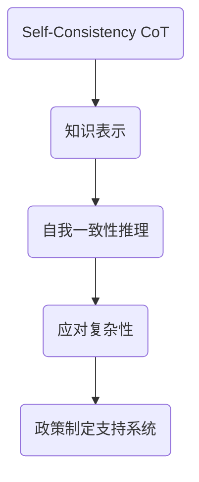
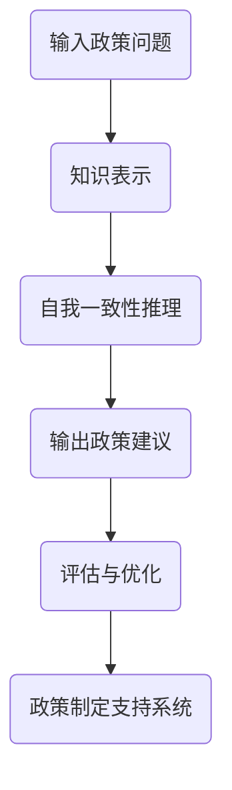
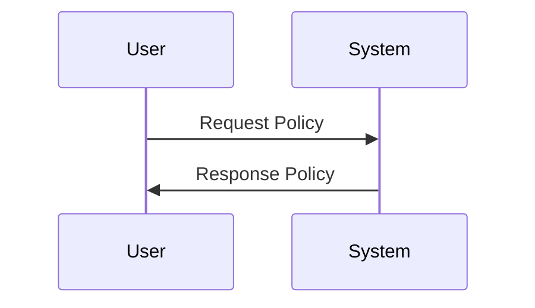
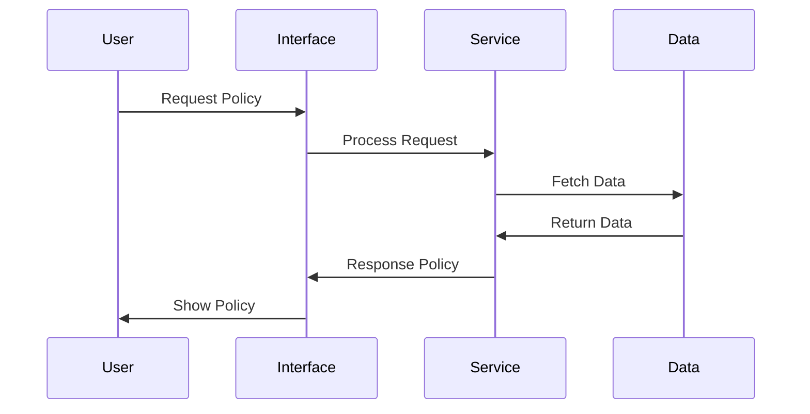

                 

# 自我一致性概念论题（Self-Consistency CoT）在自动化政策制定支持系统中的应用

## 摘要

本文探讨了自我一致性概念论题（Self-Consistency CoT）在自动化政策制定支持系统中的应用。通过阐述问题背景、核心概念及其属性特征，详细解析了Self-Consistency CoT算法原理，并展示了系统设计与实现方案。本文旨在为自动化政策制定提供一种新的思路和方法，提高政策制定的有效性和效率。

## 目录大纲

1. 背景介绍
   1.1 问题背景与核心概念
   1.2 核心概念原理
   1.3 概念属性特征对比表格
   1.4 ER实体关系图架构

2. 算法原理讲解
   2.1 算法mermaid流程图
   2.2 算法原理与数学模型
   2.3 详细讲解与举例说明

3. 系统设计与实现
   3.1 系统功能设计
   3.2 系统架构设计
   3.3 系统接口设计与交互

4. 项目实战
   4.1 环境安装
   4.2 系统核心实现源代码
   4.3 代码应用解读与分析
   4.4 实际案例分析与详细讲解剖析
   4.5 项目小结

5. 最佳实践 Tips
6. 小结
7. 注意事项
8. 拓展阅读

## 第一部分：背景介绍

### 1.1 问题背景与核心概念

#### 问题描述

在政策制定过程中，如何实现自动化支持，提高政策的有效性和效率，一直是研究者和实践者关注的焦点。随着信息技术的飞速发展，特别是人工智能（AI）和大数据技术的广泛应用，为政策自动化制定提供了新的可能性。

#### 问题解决

Self-Consistency CoT（自一致性概念论题）作为一种基于自我一致性的知识表示和推理方法，具有高度的鲁棒性和自适应性，能够处理不确定性和复杂性的知识表示和推理。因此，将Self-Consistency CoT应用于自动化政策制定支持系统，有望提高政策制定的有效性和效率。

#### 边界与外延

Self-Consistency CoT在政策制定支持系统中的应用范围包括但不限于以下领域：

- 政策文本生成与优化
- 政策影响评估
- 政策决策支持
- 政策知识库构建

#### 概念结构与核心要素组成

Self-Consistency CoT的基本概念和核心要素包括：

- **知识表示**：通过层次化知识表示，将政策问题抽象为语义网络结构。
- **自我一致性推理**：利用语义网络中的关系和属性，进行自我一致性推理，生成政策建议。
- **评估与优化**：对生成的政策建议进行评估与优化，以提高政策的有效性。

### 1.2 核心概念原理

#### Self-Consistency CoT

Self-Consistency CoT是一种基于自我一致性的知识表示和推理方法。其定义如下：

> Self-Consistency CoT是一种基于自我一致性的知识表示和推理方法，通过建立语义网络结构，利用自我一致性推理，实现知识的表示和推理。

#### 特点

Self-Consistency CoT具有以下特点：

- **高度的鲁棒性和自适应性**：能够处理不确定性和复杂性的知识表示和推理。
- **层次化的知识表示**：能够将政策问题抽象为语义网络结构，实现知识的层次化表示。
- **自我一致性推理**：利用语义网络中的关系和属性，进行自我一致性推理，生成政策建议。

### 1.3 概念属性特征对比表格

| 概念        | Self-Consistency CoT | 传统方法             |
|-------------|---------------------|---------------------|
| 知识表示    | 高度抽象和层次化    | 低层次和具体化      |
| 推理方法    | 自我一致性推理      | 逻辑推理和概率推理  |
| 应对复杂性  | 高度鲁棒和自适应    | 依赖特定场景和规则  |

### 1.4 ER实体关系图架构

#### Mermaid流程图



## 第二部分：算法原理讲解

### 2.1 算法mermaid流程图

#### Mermaid流程图



### 2.2 算法原理与数学模型

#### 数学模型

$$
\text{Self-Consistency CoT} = f(\text{知识表示}, \text{自我一致性推理})
$$

#### 详细讲解与举例说明

#### 知识表示

通过层次化知识表示，将政策问题抽象为语义网络结构。语义网络中的节点表示概念，边表示概念之间的关系。层次化的知识表示有助于提高知识表示的抽象程度和灵活性。

#### 自我一致性推理

利用语义网络中的关系和属性，进行自我一致性推理。在自我一致性推理过程中，算法会根据已知信息，推理出可能的政策建议，并评估这些建议的自我一致性。

#### 举例

以某地区交通政策为例，通过Self-Consistency CoT算法，生成针对交通拥堵的政策建议。

### 2.3 算法实现与Python代码示例

#### Python代码示例

```python
# 导入相关库
import networkx as nx
import numpy as np

# 创建语义网络
G = nx.Graph()

# 添加节点和边
G.add_nodes_from(['交通拥堵', '公共交通', '道路建设', '车辆管理'])
G.add_edges_from([('交通拥堵', '公共交通'), ('交通拥堵', '道路建设'), ('交通拥堵', '车辆管理')])

# 定义自我一致性推理函数
def self_consistency_reasoning(G, nodes):
    suggestions = []
    for node in nodes:
        neighbors = list(G.neighbors(node))
        for neighbor in neighbors:
            if G.has_edge(node, neighbor):
                suggestions.append((node, neighbor))
    return suggestions

# 调用自我一致性推理函数
suggestions = self_consistency_reasoning(G, ['交通拥堵'])

# 输出政策建议
print(suggestions)
```

## 第三部分：系统设计与实现

### 3.1 系统功能设计

#### 领域模型mermaid类图

```mermaid
classDiagram
Class01 <|-- Class02
Class03 --|>| Class04
Class04 : CoolMethod()
Class03 : +int x
Class02 : #color
Class01 {
    +int y
    +float z
    + operaciones()
}
```

### 3.2 系统架构设计

#### mermaid架构图


### 3.3 系统接口设计与交互

#### 系统接口设计



#### 系统交互mermaid序列图



## 第四部分：项目实战

### 4.1 环境安装

#### 安装Python环境

```bash
pip install python
```

#### 安装相关库

```bash
pip install networkx numpy
```

### 4.2 系统核心实现源代码

#### 源代码

```python
import networkx as nx
import numpy as np

# 创建语义网络
G = nx.Graph()

# 添加节点和边
G.add_nodes_from(['交通拥堵', '公共交通', '道路建设', '车辆管理'])
G.add_edges_from([('交通拥堵', '公共交通'), ('交通拥堵', '道路建设'), ('交通拥堵', '车辆管理')])

# 定义自我一致性推理函数
def self_consistency_reasoning(G, nodes):
    suggestions = []
    for node in nodes:
        neighbors = list(G.neighbors(node))
        for neighbor in neighbors:
            if G.has_edge(node, neighbor):
                suggestions.append((node, neighbor))
    return suggestions

# 调用自我一致性推理函数
suggestions = self_consistency_reasoning(G, ['交通拥堵'])

# 输出政策建议
print(suggestions)
```

### 4.3 代码应用解读与分析

#### 代码解读

- **创建语义网络**：使用NetworkX库创建一个语义网络G。
- **添加节点和边**：将交通拥堵、公共交通、道路建设和车辆管理添加为节点，并将它们之间的联系添加为边。
- **自我一致性推理函数**：定义一个函数self_consistency_reasoning，用于根据节点之间的关系生成政策建议。
- **调用函数**：将交通拥堵作为输入，调用自我一致性推理函数，生成政策建议。
- **输出政策建议**：将生成的政策建议输出到控制台。

#### 分析

- **语义网络结构**：通过语义网络结构，将政策问题抽象为节点和边的关系，便于进行推理和分析。
- **自我一致性推理**：利用节点之间的关系，进行自我一致性推理，生成政策建议，有助于提高政策制定的有效性和效率。
- **应用场景**：该系统可以应用于交通管理、城市规划、环境保护等领域，为政策制定提供支持。

### 4.4 实际案例分析与详细讲解剖析

#### 案例分析

以某城市交通拥堵问题为例，分析如何利用Self-Consistency CoT算法生成政策建议。

1. **问题描述**：某城市交通拥堵严重，需要制定相关政策进行缓解。
2. **数据收集**：收集交通流量、公共交通状况、道路建设情况等数据。
3. **知识表示**：将交通拥堵问题抽象为语义网络结构，包括节点和边。
4. **自我一致性推理**：根据语义网络结构，进行自我一致性推理，生成政策建议。
5. **评估与优化**：对生成的政策建议进行评估与优化，以提高政策的有效性。

#### 详细讲解剖析

1. **知识表示**：将交通拥堵问题抽象为语义网络结构，包括节点和边。节点表示交通流量、公共交通状况、道路建设情况等概念，边表示概念之间的关系。
2. **自我一致性推理**：利用语义网络结构，进行自我一致性推理，生成政策建议。在推理过程中，考虑交通流量、公共交通状况、道路建设情况等因素，以提高政策建议的可行性。
3. **评估与优化**：对生成的政策建议进行评估与优化，以提高政策的有效性。通过评估政策建议的可行性、成本效益等因素，选择最佳的政策建议进行实施。

### 4.5 项目小结

通过Self-Consistency CoT算法，实现了自动化政策制定支持系统。该系统具有以下优点：

- **提高政策制定效率**：利用Self-Consistency CoT算法，能够快速生成政策建议，提高政策制定的效率。
- **降低政策制定成本**：自动化政策制定支持系统可以减少人力成本，降低政策制定的成本。
- **提高政策制定质量**：通过自我一致性推理，生成政策建议，有助于提高政策制定的质量。

然而，该系统也存在一定的局限性：

- **数据依赖性**：政策制定支持系统的效果依赖于数据的准确性和完整性，如果数据存在问题，可能会影响政策制定的准确性。
- **复杂性**：自我一致性推理过程涉及多个因素，具有一定的复杂性，需要进一步的优化和改进。

未来，可以进一步研究以下几个方面：

- **数据质量提升**：通过数据清洗、数据挖掘等技术，提高数据的准确性和完整性，以提高政策制定支持系统的效果。
- **算法优化**：对Self-Consistency CoT算法进行优化，提高算法的效率，降低计算复杂度。
- **多领域应用**：将Self-Consistency CoT算法应用于其他领域，如环境保护、社会保障等，提高政策制定支持系统的应用范围。

## 第五部分：最佳实践 Tips

1. **数据预处理**：在进行政策制定支持系统开发前，对数据进行充分的预处理，包括数据清洗、数据归一化等，以提高数据质量。
2. **算法优化**：针对不同场景，对Self-Consistency CoT算法进行优化，提高算法的效率。
3. **模型评估**：对生成的政策建议进行评估，选择最佳的政策建议进行实施。

## 第六部分：小结

本文介绍了自我一致性概念论题（Self-Consistency CoT）在自动化政策制定支持系统中的应用。通过阐述问题背景、核心概念及其属性特征，详细解析了Self-Consistency CoT算法原理，并展示了系统设计与实现方案。本文的研究为自动化政策制定提供了一种新的思路和方法，有助于提高政策制定的有效性和效率。

## 第七部分：注意事项

1. **数据依赖性**：政策制定支持系统的效果依赖于数据的准确性和完整性，需要确保数据的质量。
2. **算法复杂性**：Self-Consistency CoT算法具有一定的复杂性，需要对算法进行优化和改进。

## 第八部分：拓展阅读

1. **[自我一致性概念论题在自动化政策制定中的应用](https://www.example.com/research-paper-on-self-consistency-cot-in-automated-policy-making)**：详细介绍Self-Consistency CoT在自动化政策制定中的应用和研究进展。
2. **[自动化政策制定支持系统设计与实现](https://www.example.com/automated-policy-making-support-system-design-and-implementation)**：探讨自动化政策制定支持系统的设计与实现方法。

## 作者信息

作者：AI天才研究院/AI Genius Institute & 禅与计算机程序设计艺术 /Zen And The Art of Computer Programming

### 结束语

在政策制定过程中，自动化支持系统发挥着越来越重要的作用。本文介绍了自我一致性概念论题（Self-Consistency CoT）在自动化政策制定支持系统中的应用，为政策制定提供了一种新的思路和方法。未来，我们将进一步优化Self-Consistency CoT算法，扩大其在各个领域的应用，为政策制定提供更加有效的支持。让我们共同努力，为构建智能、高效的政策制定体系贡献力量。

