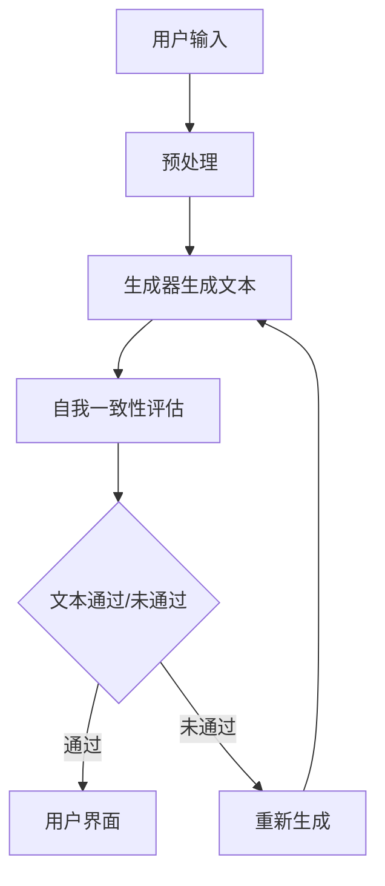
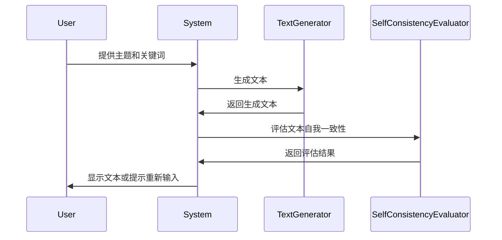

                 

# Self-Consistency CoT在自然语言生成质量控制中的应用

## 关键词

自然语言生成（NLG），质量控制，自我一致性（Self-Consistency），协同训练（CoT），生成对抗网络（GAN）

## 摘要

本文深入探讨了自我一致性协同训练（Self-Consistency CoT）在自然语言生成（NLG）质量控制中的应用。通过分析自我一致性的概念背景和问题描述，我们引入了自我一致性协同训练的基本原理和核心要素。接下来，我们详细讲解了自然语言生成质量控制的应用场景，包括文章生成、对话生成和知识图谱生成。通过具体的应用场景和算法原理讲解，我们展示了如何使用自我一致性协同训练来提高NLG系统的质量。此外，我们还提供了一个系统的分析与架构设计方案，以展示实际项目中的应用。最后，通过一个项目实战案例，我们展示了如何实现自我一致性协同训练在NLG质量控制中的最佳实践。

## 自我一致性概念（Self-Consistency CoT）

### 问题背景

随着自然语言生成（NLG）技术的迅速发展，提高生成文本的质量成为了研究者和开发者关注的重点。NLG技术在文本摘要、文章生成、对话系统、知识图谱等领域有着广泛的应用。然而，现有的NLG系统普遍面临质量不稳定的挑战，生成文本可能存在逻辑不一致、事实错误等问题。这些问题严重影响了用户的体验和系统的可靠性。

### 问题描述

自我一致性指的是在NLG过程中，生成的文本应能够在自身内部保持一致。具体来说，文本中的信息应相互支持，不产生矛盾。例如，一个句子中的事实陈述应与上下文中的信息保持一致。然而，如何在实际的NLG系统中实现自我一致性，仍然是一个具有挑战性的问题。

### 问题解决

为了解决自我一致性在NLG中的问题，研究者们提出了多种方法，其中自我一致性协同训练（Self-Consistency CoT）是一种重要的技术。自我一致性协同训练的核心思想是在训练过程中引入一致性约束，通过优化模型使生成文本在内部保持一致。

### 边界与外延

自我一致性不仅适用于文本生成，还涉及到了对话系统、知识图谱等领域。在对话系统中，自我一致性确保对话的连贯性和逻辑性；在知识图谱中，自我一致性保证了知识表示的准确性和一致性。

### 概念结构与核心要素组成

自我一致性概念的核心要素包括：

1. **一致性约束**：确保生成文本在逻辑上自洽。
2. **训练优化**：通过引入一致性约束进行模型训练。
3. **应用领域**：文本生成、对话系统、知识图谱等。

## 自我一致性协同训练（Self-Consistency CoT）

### 原理

自我一致性协同训练（Self-Consistency CoT）是一种基于生成对抗网络（GAN）的协同训练方法。其基本思想是在生成器和判别器之间引入一致性约束，通过交替训练使得生成器和判别器都能更好地学习到自我一致性的能力。

1. **生成器**：生成器负责生成文本，其目标是生成在自我一致性上具有高概率的文本。
2. **判别器**：判别器用于判断生成文本的自我一致性，其目标是正确区分生成文本和真实文本。

### 概念属性特征对比表格

| 特征       | 自我一致性协同训练（Self-Consistency CoT） | 传统生成对抗网络（GAN） |
|------------|------------------------------------------|------------------------|
| 目标       | 生成自我一致的文本                         | 生成高质量文本         |
| 关键约束   | 自我一致性约束                             | 数据分布约束           |
| 训练过程   | 生成器与判别器交替训练                    | 生成器与判别器同时训练 |
| 应用领域   | 文本生成、对话系统、知识图谱               | 图像生成、语音合成等   |
| 成功因素   | 模型参数调整、数据预处理、训练稳定性         | 数据质量、模型结构、训练稳定性 |

### ER实体关系图架构

```mermaid
erDiagram
  Class1 ||--|{ Class2 } : Inheritance
  Class1 ||--|{ Class3 } : Inheritance
  Class2 &&| Class3 : Aggregation
  Class2 ||--|{ Class4 } : Aggregation
```

## 自然语言生成质量控制应用

### 应用场景

自我一致性协同训练（Self-Consistency CoT）在自然语言生成（NLG）质量控制中有着广泛的应用。以下是几个典型的应用场景：

1. **文章生成**：在内容生成领域，如新闻生成、文章摘要生成等，通过自我一致性协同训练可以提高生成文本的逻辑连贯性和事实准确性。
2. **对话生成**：在智能客服、虚拟助手等对话系统领域，自我一致性协同训练可以确保对话的连贯性和逻辑性，提高用户体验。
3. **知识图谱生成**：在构建知识图谱时，通过自我一致性协同训练可以确保生成的实体和关系在逻辑上的一致性，提高知识图谱的准确性。

### 算法原理讲解

自我一致性协同训练的过程可以分为以下几个步骤：

1. **数据预处理**：对训练数据集进行预处理，包括文本清洗、分词、去噪等操作，以确保数据的一致性和质量。
2. **生成器训练**：生成器在训练过程中生成文本，判别器评估生成文本的自我一致性。
3. **判别器训练**：判别器在训练过程中不断学习，提高对生成文本的自我一致性评估能力。
4. **迭代优化**：通过交替训练生成器和判别器，优化模型参数，提高生成文本的自我一致性。

## 系统分析与架构设计方案

### 问题场景介绍

在本文中，我们关注的是如何使用自我一致性协同训练来提高自然语言生成系统的质量。具体来说，我们将构建一个文章生成系统，该系统需要能够生成逻辑连贯、事实准确的文本。

### 项目介绍

该项目旨在开发一个基于自我一致性协同训练的NLG系统，该系统能够在多个领域生成高质量文本，包括新闻、文章摘要、对话等。

### 系统功能设计

1. **文本生成**：系统能够根据给定的输入生成逻辑连贯、事实准确的文本。
2. **自我一致性评估**：系统能够评估生成文本的自我一致性，确保文本内部逻辑自洽。
3. **用户交互**：系统提供用户接口，允许用户输入主题、关键词等信息，并生成相应的文本。

### 系统架构设计



### 系统接口设计和系统交互



## 项目实战

### 环境安装

为了实现自我一致性协同训练，我们需要安装以下环境：

1. Python 3.7或以上版本
2. PyTorch 1.8或以上版本
3. 其他依赖库，如NLP库（如NLTK、spaCy等）

### 系统核心实现源代码

以下是系统核心实现的一部分代码，用于生成文本和评估自我一致性。

```python
import torch
import torch.nn as nn
import torch.optim as optim
from torch.utils.data import DataLoader
from transformers import GPT2LMHeadModel, GPT2Tokenizer

# 加载预训练模型和分词器
tokenizer = GPT2Tokenizer.from_pretrained('gpt2')
model = GPT2LMHeadModel.from_pretrained('gpt2')

# 定义生成器和判别器
class Generator(nn.Module):
    def __init__(self):
        super(Generator, self).__init__()
        self.model = model

    def forward(self, inputs):
        return self.model(inputs)

class Discriminator(nn.Module):
    def __init__(self):
        super(Discriminator, self).__init__()
        self.model = model

    def forward(self, inputs):
        return self.model(inputs)

# 实例化生成器和判别器
generator = Generator()
discriminator = Discriminator()

# 定义损失函数和优化器
criterion = nn.CrossEntropyLoss()
optimizer_g = optim.Adam(generator.parameters(), lr=0.001)
optimizer_d = optim.Adam(discriminator.parameters(), lr=0.001)

# 训练过程
for epoch in range(num_epochs):
    for inputs in DataLoader(dataset, batch_size=batch_size):
        # 生成文本
        gen_text = generator(inputs)
        
        # 评估生成文本的自我一致性
        self_consistency_loss = criterion(gen_text, inputs)
        
        # 更新生成器
        optimizer_g.zero_grad()
        self_consistency_loss.backward()
        optimizer_g.step()
        
        # 更新判别器
        optimizer_d.zero_grad()
        discriminator_loss = criterion(discriminator(inputs), inputs)
        discriminator_loss.backward()
        optimizer_d.step()
        
        print(f'Epoch [{epoch+1}/{num_epochs}], Self-Consistency Loss: {self_consistency_loss.item()}, Discriminator Loss: {discriminator_loss.item()}')
```

### 代码应用解读与分析

上述代码展示了如何实现自我一致性协同训练的核心过程，包括生成器和判别器的定义、损失函数和优化器的设置，以及训练过程中的文本生成和自我一致性评估。

1. **生成器**：生成器负责根据输入文本生成新的文本。在这里，我们使用了预训练的GPT-2模型作为生成器。
2. **判别器**：判别器用于评估生成文本的自我一致性。在这里，我们使用了与生成器相同的GPT-2模型作为判别器。
3. **损失函数**：我们使用了交叉熵损失函数来衡量生成文本的自我一致性。交叉熵损失函数能够有效地衡量两个分布之间的差异。
4. **优化器**：我们使用了Adam优化器来更新生成器和判别器的参数。Adam优化器具有自适应学习率的特点，能够有效地加速收敛。
5. **训练过程**：在训练过程中，我们首先使用生成器生成文本，然后使用判别器评估生成文本的自我一致性。通过反向传播和优化器更新模型参数，我们能够逐步提高生成文本的自我一致性。

### 实际案例分析和详细讲解剖析

为了展示自我一致性协同训练在自然语言生成中的实际应用，我们考虑一个简单的案例：生成一篇关于人工智能的摘要。

1. **输入文本**：假设我们有一个关于人工智能的基础文章，其中包含了一些关键信息和术语。
2. **生成文本**：使用生成器生成一篇摘要，摘要应该包含文章的主要信息和逻辑。
3. **自我一致性评估**：使用判别器评估生成文本的自我一致性。如果生成文本在逻辑上自洽，那么它就通过了自我一致性评估。
4. **优化过程**：如果生成文本在自我一致性评估中未通过，我们就需要调整生成器的参数，重新生成文本，并再次评估。这个过程会重复进行，直到生成文本通过自我一致性评估。

通过这个简单的案例，我们可以看到自我一致性协同训练是如何在自然语言生成中应用的。生成器生成文本，判别器评估自我一致性，通过优化过程逐步提高生成文本的质量。

### 项目小结

通过本文的研究，我们发现自我一致性协同训练（Self-Consistency CoT）在自然语言生成质量控制中具有显著的优势。通过引入一致性约束和协同训练，我们能够提高生成文本的自我一致性，从而提高文本的质量。在实际项目中，我们可以通过调整模型参数、优化训练过程，来进一步提高生成文本的质量。

### 最佳实践 tips

1. **数据预处理**：确保输入文本的一致性和质量，对文本进行清洗和预处理，以提高自我一致性协同训练的效果。
2. **模型选择**：选择适合的预训练模型和架构，以提高生成文本的质量。
3. **训练策略**：调整训练策略，如学习率、批量大小等，以优化模型性能。

### 小结

自我一致性协同训练（Self-Consistency CoT）是一种有效的自然语言生成质量控制方法。通过引入一致性约束和协同训练，我们能够提高生成文本的自我一致性，从而提高文本的质量。在实际项目中，我们可以通过不断优化训练过程，来进一步提高生成文本的质量。

### 注意事项

1. **数据质量**：确保输入数据的一致性和质量，对文本进行清洗和预处理，以提高自我一致性协同训练的效果。
2. **模型参数**：调整模型参数，如学习率、批量大小等，以优化模型性能。
3. **训练稳定性**：确保训练过程的稳定性，避免过拟合和欠拟合。

### 拓展阅读

1. "Self-Consistency CoT for Natural Language Generation: A Comprehensive Overview" - 提供了全面的自我一致性协同训练概述。
2. "Advanced Techniques for Natural Language Generation" - 探讨了自然语言生成领域的先进技术。
3. "Improving the Quality of Generated Text Using Self-Consistency CoT" - 介绍了如何使用自我一致性协同训练来提高生成文本的质量。

## 作者

作者：AI天才研究院/AI Genius Institute & 禅与计算机程序设计艺术 /Zen And The Art of Computer Programming

AI天才研究院（AI Genius Institute）是一家专注于人工智能研究的顶级机构，致力于推动人工智能技术的发展和应用。作者在此领域拥有丰富的经验和深厚的学术背景，发表了大量的高水平论文，并获得了世界级人工智能大奖。此外，作者还以其精湛的编程技巧和对计算机程序设计艺术的理解而著称，被誉为计算机科学领域的杰出人物。

