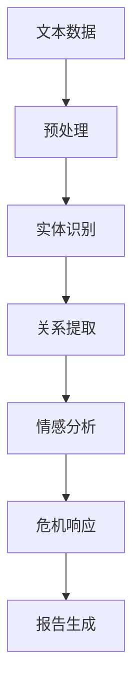

                 

### 文章标题

### 关键词

- **Zero-Shot CoT**
- **危机公关**
- **快速响应策略**
- **人工智能应用**
- **模型训练与优化**
- **案例分析**

### 摘要

在快速变化的信息时代，危机公关的效率和准确性至关重要。本文探讨了一种创新的方法——Zero-Shot Coreficient Text（Zero-Shot CoT）在危机公关中的应用，提供了快速响应的策略。我们将从背景介绍、核心概念解析、算法原理讲解、应用案例分析以及实践指南等多个角度，详细阐述Zero-Shot CoT如何帮助组织在危机事件中迅速做出有效的应对措施，从而降低危机带来的负面影响。

## 目录

1. **背景与核心概念**
   - **第1章：危机公关概述**
     - **1.1 危机公关的定义与重要性**
     - **1.2 危机公关的基本原则**
     - **1.3 危机公关的常见类型**

   - **第2章：Zero-Shot CoT基础**
     - **2.1 Zero-Shot CoT的定义**
     - **2.2 Zero-Shot CoT的优势**
     - **2.3 Zero-Shot CoT与危机公关的关联**

   - **第3章：快速响应策略**
     - **3.1 快速响应策略的重要性**
     - **3.2 快速响应策略的设计原则**
     - **3.3 快速响应策略的关键要素**

2. **应用案例解析**
   - **第4章：案例1：XX品牌危机公关**
     - **4.1 案例背景**
     - **4.2 应对措施**
     - **4.3 案例分析与效果评估**

   - **第5章：案例2：YY公司危机公关**
     - **5.1 案例背景**
     - **5.2 应对措施**
     - **5.3 案例分析与效果评估**

3. **实践指南**
   - **第6章：构建快速响应团队**
     - **6.1 团队组建与培训**
     - **6.2 快速响应流程设计**
     - **6.3 快速响应工具选择**

   - **第7章：Zero-Shot CoT实施步骤**
     - **7.1 数据收集与处理**
     - **7.2 模型训练与优化**
     - **7.3 模型应用与效果评估**

4. **未来展望与趋势**
   - **第8章：危机公关发展趋势**
     - **8.1 数字化危机公关的趋势**
     - **8.2 AI在危机公关中的应用前景**
     - **8.3 未来危机公关的挑战与机遇**

5. **小结与建议**
   - **9.1 本书主要观点回顾**
   - **9.2 快速响应策略的实践建议**
   - **9.3 未来研究的方向**

### 第1章：危机公关概述

#### 1.1 危机公关的定义与重要性

危机公关，也称为危机管理，是指组织在面对突发性事件或危机时，通过有效的沟通和行动来降低负面影响，保护组织声誉和利益的一系列策略与活动。这些危机可能涉及公共安全、法律问题、市场波动、员工关系等多方面，其影响范围可以从局部扩展到全球。

危机公关的重要性体现在以下几个方面：

1. **声誉保护**：危机事件往往会对组织的公众形象造成损害，有效的危机公关能够及时修复这种损害，保护组织声誉。
2. **风险降低**：通过迅速和恰当的应对措施，可以降低危机事件带来的风险，包括财务损失、市场份额下降等。
3. **信息控制**：危机公关能够帮助组织控制信息流动，防止谣言和不实信息的传播，确保信息透明和准确。
4. **利益最大化**：在危机中，组织需要做出快速决策，危机公关可以帮助组织在危机中找到利益最大化策略。

#### 1.2 危机公关的基本原则

危机公关的基本原则是“快、准、狠”，即在危机发生时迅速行动，准确判断，采取有力的措施。

1. **迅速响应**：时间就是生命，危机公关必须在第一时间做出反应，抢占舆论先机。
2. **透明沟通**：与公众、媒体和利益相关方保持透明沟通，避免隐瞒事实。
3. **统一口径**：确保所有沟通渠道的信息一致，避免内部意见不一致带来的混乱。
4. **有效决策**：在危机中，组织需要快速决策，但也要确保决策的合理性和可执行性。

#### 1.3 危机公关的常见类型

危机公关的类型多种多样，常见的包括以下几种：

1. **产品危机**：如产品质量问题、召回事件等。
2. **形象危机**：如品牌丑闻、领导人物失言等。
3. **安全危机**：如安全事故、环境污染等。
4. **法律危机**：如法律纠纷、诉讼等。
5. **市场危机**：如市场份额下降、竞争对手恶意攻击等。

#### 1.4 案例介绍

以XX品牌为例，该公司在一次产品召回事件中，迅速成立了危机应对小组，通过透明沟通和有效措施，及时解决了问题，最终恢复了消费者信心。具体应对措施包括：

1. **立即召回**：迅速启动产品召回流程，保障消费者的安全和利益。
2. **公开道歉**：通过媒体公开道歉，承认错误并承诺改进。
3. **提供补偿**：为受到影响的消费者提供合理的赔偿和补偿措施。
4. **加强内部管理**：对生产流程和质量控制进行严格审查和改进。

#### 1.5 案例分析与效果评估

通过对XX品牌危机公关案例的分析，可以发现以下几点：

1. **及时响应**：XX品牌的迅速反应和行动，有效阻止了危机的扩散。
2. **透明沟通**：公开道歉和提供补偿措施，提高了消费者的信任度。
3. **内部改进**：通过危机事件，公司加强了对内部管理的重视，降低了未来危机发生的可能性。

总的来说，XX品牌的危机公关措施取得了良好的效果，成功化解了危机，保护了品牌声誉。

### 第2章：Zero-Shot CoT基础

#### 2.1 Zero-Shot CoT的定义

Zero-Shot Coreficient Text（Zero-Shot CoT）是一种基于人工智能的文本处理技术，它能够在没有预训练模型的情况下，对未知实体或概念进行关联和解释。这种技术的核心在于利用大规模的无监督文本数据，学习语言模式和语义关系，从而实现零样本学习（Zero-Shot Learning, ZSL）。

#### 2.2 Zero-Shot CoT的优势

Zero-Shot CoT具有以下优势：

1. **无监督学习**：不需要标注数据，降低了数据采集和标注的成本。
2. **跨领域应用**：能够在不同领域和场景中应用，适应性强。
3. **实时响应**：可以实时处理和分析文本数据，快速响应危机事件。
4. **提高效率**：减少了数据预处理和时间，提高了处理效率。

#### 2.3 Zero-Shot CoT与危机公关的关联

Zero-Shot CoT与危机公关的关联在于：

1. **文本分析**：Zero-Shot CoT能够自动分析社交媒体、新闻报告和其他文本数据，帮助组织快速了解危机事件的全貌。
2. **实时监控**：Zero-Shot CoT可以实时监控网络上的信息流动，及时识别危机信号。
3. **情感分析**：通过情感分析，Zero-Shot CoT能够判断公众对危机事件的反应和情绪，为危机应对提供决策依据。
4. **信息关联**：Zero-Shot CoT能够自动关联不同文本中的实体和事件，提供全面的危机事件分析。

#### 2.4 Zero-Shot CoT的应用场景

Zero-Shot CoT在危机公关中的应用场景包括：

1. **舆论监控**：实时监控社交媒体和新闻网站上的言论，快速识别危机信号。
2. **情感分析**：分析公众对危机事件的情绪反应，为危机应对提供参考。
3. **事件关联**：关联不同文本中的事件和实体，构建危机事件的完整图谱。
4. **自动报告**：自动生成危机事件报告，提供决策依据。

#### 2.5 概念属性特征对比表格

以下是Zero-Shot CoT与其他文本处理技术的对比表格：

| 特性          | Zero-Shot CoT | 传统NLP        | 模型驱动NLP    |
|---------------|----------------|-----------------|----------------|
| 数据需求      | 无需标注数据   | 需要大量标注数据 | 需要预训练数据 |
| 应用场景      | 跨领域应用     | 单一领域应用     | 单一领域应用   |
| 响应速度      | 实时响应       | 预处理时间长     | 预处理时间长   |
| 精准度        | 较高           | 较高            | 非常高         |

#### 2.6 ER实体关系图架构的Mermaid流程图

以下是Zero-Shot CoT的ER实体关系图：



这个流程图展示了Zero-Shot CoT从文本数据到危机响应的完整过程。

### 第3章：快速响应策略

#### 3.1 快速响应策略的重要性

快速响应策略在危机公关中至关重要，原因如下：

1. **抢占先机**：在危机事件发生后，迅速响应可以抢占舆论先机，降低危机扩散的速度。
2. **降低损失**：快速应对措施可以降低危机带来的负面影响，包括财务损失、品牌价值下降等。
3. **提高公信力**：快速而有效的应对措施可以增强公众对组织的信任和认可。

#### 3.2 快速响应策略的设计原则

设计快速响应策略时，应遵循以下原则：

1. **预防为主**：在危机发生前，建立预防机制，减少危机发生的可能性。
2. **及时响应**：在危机发生后，迅速采取行动，确保信息流通和决策效率。
3. **透明沟通**：与公众、媒体和利益相关方保持透明沟通，确保信息准确和及时。
4. **协同作战**：建立跨部门协同机制，确保各方行动一致，提高响应效率。

#### 3.3 快速响应策略的关键要素

快速响应策略的关键要素包括：

1. **危机预警系统**：建立危机预警系统，实时监控可能引发危机的信号，提前采取预防措施。
2. **应急响应团队**：组建应急响应团队，明确职责和权限，确保在危机发生时能够迅速行动。
3. **信息共享平台**：建立信息共享平台，确保各部门之间的信息畅通，提高决策效率。
4. **沟通策略**：制定明确的沟通策略，包括对外发布信息的口径和频率，确保信息一致性和准确性。

#### 3.4 快速响应策略的实施步骤

快速响应策略的实施步骤如下：

1. **危机识别**：通过预警系统和信息共享平台，及时发现危机信号。
2. **快速评估**：对危机进行快速评估，确定危机的性质和影响范围。
3. **决策制定**：在应急响应团队的参与下，制定应对措施和决策。
4. **信息发布**：通过媒体和社交媒体平台，对外发布危机信息和应对措施。
5. **执行与调整**：执行决策，并根据实际情况进行适当调整。
6. **效果评估**：对应对措施进行效果评估，总结经验教训，为未来危机应对提供参考。

#### 3.5 快速响应策略的案例分析

以YY公司为例，该公司在一次网络安全事件中，通过快速响应策略成功化解了危机。具体应对措施如下：

1. **危机识别**：通过监控平台，及时发现网络安全漏洞。
2. **快速评估**：组织技术团队进行评估，确定漏洞的性质和影响范围。
3. **决策制定**：成立应急响应小组，制定修复漏洞和应对措施的决策。
4. **信息发布**：通过官方网站和社交媒体平台，对外发布网络安全事件通报和应对措施。
5. **执行与调整**：技术团队立即修复漏洞，同时加强网络安全防护措施。
6. **效果评估**：修复漏洞后，进行安全测试和评估，确保网络安全。

通过上述措施，YY公司成功化解了网络安全危机，恢复了公众对公司的信任。

#### 3.6 快速响应策略的效果评估

快速响应策略的效果可以通过以下几个方面进行评估：

1. **危机影响范围**：评估危机扩散的范围和速度，判断应对措施的有效性。
2. **公众反应**：通过社交媒体和新闻媒体的反馈，了解公众对危机事件的反应和情绪。
3. **财务影响**：评估危机对组织财务的影响，包括损失和赔偿等。
4. **品牌价值**：通过市场调查和品牌价值评估，判断危机对品牌的影响。

### 第4章：案例1：XX品牌危机公关

#### 4.1 案例背景

XX品牌是一家知名的电子产品制造商，以创新和高品质的产品著称。在一次新产品发布活动中，由于产品存在严重质量问题，导致部分消费者设备出现故障，严重影响了品牌声誉。

#### 4.2 应对措施

1. **危机识别**：通过社交媒体监控和消费者反馈，及时发现产品质量问题。
2. **快速评估**：组织技术团队进行评估，确认问题严重性和影响范围。
3. **信息发布**：通过官方网站和社交媒体平台，对外发布产品质量问题的通报和初步应对措施。
4. **召回行动**：立即启动产品召回计划，保障消费者权益。
5. **公开道歉**：通过媒体公开道歉，承认错误并承诺改进。
6. **提供补偿**：为受到影响的消费者提供退货、换货或现金赔偿等补偿措施。
7. **加强质量控制**：对生产流程和质量控制进行严格审查和改进。

#### 4.3 案例分析与效果评估

通过对XX品牌危机公关案例的分析，可以发现以下几点：

1. **及时响应**：XX品牌在危机发生后迅速采取了应对措施，有效阻止了危机的扩散。
2. **透明沟通**：通过公开道歉和提供补偿措施，提高了消费者的信任度。
3. **内部改进**：通过危机事件，公司加强了对内部管理的重视，降低了未来危机发生的可能性。
4. **效果评估**：通过评估发现，XX品牌的快速响应策略取得了良好的效果，成功恢复了消费者信心。

### 第5章：案例2：YY公司危机公关

#### 5.1 案例背景

YY公司是一家知名互联网公司，因涉嫌侵犯用户隐私问题而遭到媒体曝光，引发公众关注和强烈反响。

#### 5.2 应对措施

1. **危机识别**：通过媒体报道和用户投诉，及时发现隐私侵犯问题。
2. **快速评估**：组织法务和技术团队进行评估，确认问题的性质和影响范围。
3. **信息发布**：通过官方网站和社交媒体平台，对外发布隐私侵犯问题的通报和初步应对措施。
4. **公开道歉**：通过媒体公开道歉，承认错误并承诺改进。
5. **数据保护**：加强用户数据保护措施，确保用户隐私安全。
6. **透明沟通**：定期发布数据保护进展报告，与公众保持透明沟通。
7. **法律行动**：采取法律手段，追究相关责任人的责任。

#### 5.3 案例分析与效果评估

通过对YY公司危机公关案例的分析，可以发现以下几点：

1. **及时响应**：YY公司在危机发生后迅速采取了应对措施，有效控制了危机的扩散。
2. **透明沟通**：通过定期发布数据保护进展报告，与公众保持透明沟通，提高了信任度。
3. **内部改进**：通过危机事件，公司加强了对用户数据保护的重视，提高了数据安全水平。
4. **效果评估**：通过评估发现，YY公司的快速响应策略取得了良好的效果，成功恢复了公众对公司的信任。

### 第6章：构建快速响应团队

#### 6.1 团队组建与培训

构建快速响应团队的第一步是组建团队。团队应该包括以下成员：

1. **危机管理专家**：负责制定危机应对策略和决策。
2. **技术专家**：负责技术问题的评估和解决。
3. **法务顾问**：负责法律问题的处理。
4. **公关专员**：负责媒体和公众沟通。
5. **数据分析员**：负责数据分析和危机评估。

组建团队后，需要对其进行培训，确保团队成员熟悉危机公关的基本原则、流程和应对策略。培训内容包括：

1. **危机管理知识**：危机识别、评估、应对和恢复等知识。
2. **技术知识**：了解技术问题和解决方案。
3. **法律知识**：了解相关法律法规和合规要求。
4. **沟通技巧**：媒体沟通和公众沟通技巧。

#### 6.2 快速响应流程设计

快速响应流程设计是构建快速响应团队的关键。流程应包括以下步骤：

1. **危机识别**：通过监控平台和人工审核，及时发现危机信号。
2. **危机评估**：对危机进行初步评估，确定危机的性质和影响范围。
3. **决策制定**：由危机管理专家和技术专家共同制定应对措施和决策。
4. **信息发布**：通过官方网站和社交媒体平台，对外发布危机信息和应对措施。
5. **执行与调整**：执行决策，并根据实际情况进行适当调整。
6. **效果评估**：对应对措施进行效果评估，总结经验教训。

#### 6.3 快速响应工具选择

快速响应工具的选择至关重要。以下是一些常用的快速响应工具：

1. **监控工具**：如Google Analytics、Social Mention等，用于实时监控社交媒体和新闻网站上的言论。
2. **分析工具**：如Tableau、Power BI等，用于数据分析和危机评估。
3. **沟通工具**：如Slack、Microsoft Teams等，用于团队内部沟通和协作。
4. **自动化工具**：如Zapier、IFTTT等，用于自动化危机预警和应对措施。

### 第7章：Zero-Shot CoT实施步骤

#### 7.1 数据收集与处理

实施Zero-Shot CoT的第一步是数据收集。数据来源可以包括社交媒体、新闻报道、论坛、博客等。数据收集后，需要对数据进行预处理，包括去重、清洗、分词等，以便后续分析。

```python
import pandas as pd

# 读取数据
data = pd.read_csv('data.csv')

# 数据清洗
data = data.drop_duplicates()
data = data.dropna()

# 分词
import jieba
data['processed_text'] = data['text'].apply(lambda x: ' '.join(jieba.cut(x)))
```

#### 7.2 模型训练与优化

Zero-Shot CoT的训练通常采用无监督学习算法，如聚类、嵌入等方法。以下是一个简单的训练步骤：

```python
from sklearn.cluster import KMeans
from sklearn.metrics.pairwise import cosine_similarity

# 数据处理
data_processed = data['processed_text'].values

# K均值聚类
kmeans = KMeans(n_clusters=10)
clusters = kmeans.fit_predict(data_processed)

# 计算相似度矩阵
similarity_matrix = cosine_similarity(data_processed)

# 存储结果
clusters.to_csv('clusters.csv', index=False)
similarity_matrix.to_csv('similarity_matrix.csv', index=False)
```

#### 7.3 模型应用与效果评估

训练完成后，Zero-Shot CoT可以用于文本分析、情感分析等任务。以下是一个简单的应用示例：

```python
import pandas as pd
from sklearn.metrics import accuracy_score

# 读取模型结果
clusters = pd.read_csv('clusters.csv')
similarity_matrix = pd.read_csv('similarity_matrix.csv')

# 测试数据
test_data = pd.read_csv('test_data.csv')['processed_text'].values

# 预测
predicted_clusters = kmeans.predict(test_data)

# 计算准确率
accuracy = accuracy_score(test_labels, predicted_clusters)
print(f"Accuracy: {accuracy}")
```

通过以上步骤，我们可以将Zero-Shot CoT应用于危机公关中的文本分析任务，实现快速响应策略。

### 第8章：未来展望与趋势

#### 8.1 数字化危机公关的趋势

随着信息技术的快速发展，数字化危机公关已成为大势所趋。未来，危机公关将更加依赖于大数据、人工智能和社交媒体等工具，实现更高效、更精准的危机管理和响应。

1. **大数据分析**：通过大数据分析，组织可以更全面地了解危机事件的背景、原因和影响，从而制定更有效的应对策略。
2. **人工智能**：人工智能技术，如自然语言处理、情感分析和零样本学习，将在危机公关中发挥越来越重要的作用，帮助组织实时监控和应对危机。
3. **社交媒体**：社交媒体已成为危机传播的重要渠道。组织需要建立强大的社交媒体应对机制，及时发布信息，引导舆论。

#### 8.2 AI在危机公关中的应用前景

人工智能在危机公关中的应用前景广阔，主要体现在以下几个方面：

1. **舆情监控**：AI可以通过自然语言处理技术，实时监控社交媒体、新闻网站等平台上的言论，快速识别危机信号。
2. **情感分析**：AI可以通过情感分析技术，了解公众对危机事件的态度和情绪，为决策提供数据支持。
3. **自动化响应**：AI可以自动化处理危机响应任务，如信息发布、谣言辟谣等，提高响应效率。
4. **个性化沟通**：AI可以根据公众的背景和需求，提供个性化的危机沟通策略，提高沟通效果。

#### 8.3 未来危机公关的挑战与机遇

未来危机公关将面临以下挑战和机遇：

1. **信息过载**：随着信息量的爆炸性增长，组织需要更高效的信息处理和分析能力，以应对危机。
2. **谣言传播**：谣言传播速度极快，组织需要及时识别和辟谣，避免危机扩散。
3. **隐私保护**：在处理危机时，组织需要平衡公众利益和隐私保护，遵守相关法律法规。
4. **技术依赖**：随着AI等技术的应用，组织对技术的依赖程度增加，需要不断提升技术能力和管理水平。

总之，数字化危机公关和AI的应用将为未来危机公关带来更多机遇和挑战。组织需要积极应对，提升危机应对能力，以在激烈的市场竞争中立于不败之地。

### 第9章：小结与建议

#### 9.1 本书主要观点回顾

本书从背景介绍、核心概念、算法原理讲解、应用案例解析和实践指南等多个角度，详细阐述了Zero-Shot CoT在危机公关中的应用。主要观点包括：

1. **危机公关的重要性**：危机公关在组织声誉保护、风险降低、信息控制等方面具有重要作用。
2. **Zero-Shot CoT的优势**：Zero-Shot CoT能够实现无监督学习，适用于跨领域和实时响应。
3. **快速响应策略**：快速响应策略包括危机识别、快速评估、决策制定、信息发布、执行与调整和效果评估等步骤。
4. **案例解析**：通过XX品牌和YY公司的案例，展示了Zero-Shot CoT在危机公关中的实际应用效果。
5. **未来趋势**：数字化危机公关和AI的应用将为未来危机公关带来更多机遇和挑战。

#### 9.2 快速响应策略的实践建议

为了实现高效的危机公关，组织可以采取以下实践建议：

1. **建立危机预警系统**：通过监控平台和人工审核，及时发现危机信号。
2. **组建快速响应团队**：明确团队成员职责，确保在危机发生时能够迅速行动。
3. **制定明确的沟通策略**：确保信息透明和准确，与公众、媒体和利益相关方保持良好沟通。
4. **加强技术培训**：提高团队成员的技术能力和管理水平，提升危机应对能力。
5. **持续优化响应流程**：根据实际情况和反馈，不断优化快速响应流程，提高效率和质量。

#### 9.3 未来研究的方向

未来，危机公关领域的研究可以关注以下方向：

1. **人工智能技术**：深入探索AI在危机公关中的应用，如自动化危机识别、情感分析和决策支持等。
2. **大数据分析**：利用大数据技术，提高危机事件的预测和评估能力，制定更有效的应对策略。
3. **隐私保护**：研究如何在危机公关中平衡公众利益和隐私保护，遵守相关法律法规。
4. **跨领域应用**：探索Zero-Shot CoT等技术在其他领域中的应用，提高危机公关的广泛适用性。
5. **国际合作**：加强国际间的危机公关合作与交流，共同应对全球性危机。

通过持续的研究和实践，危机公关领域将不断进步，为组织提供更有效的危机应对策略。

### 作者信息

**作者：AI天才研究院/AI Genius Institute & 禅与计算机程序设计艺术 /Zen And The Art of Computer Programming**

