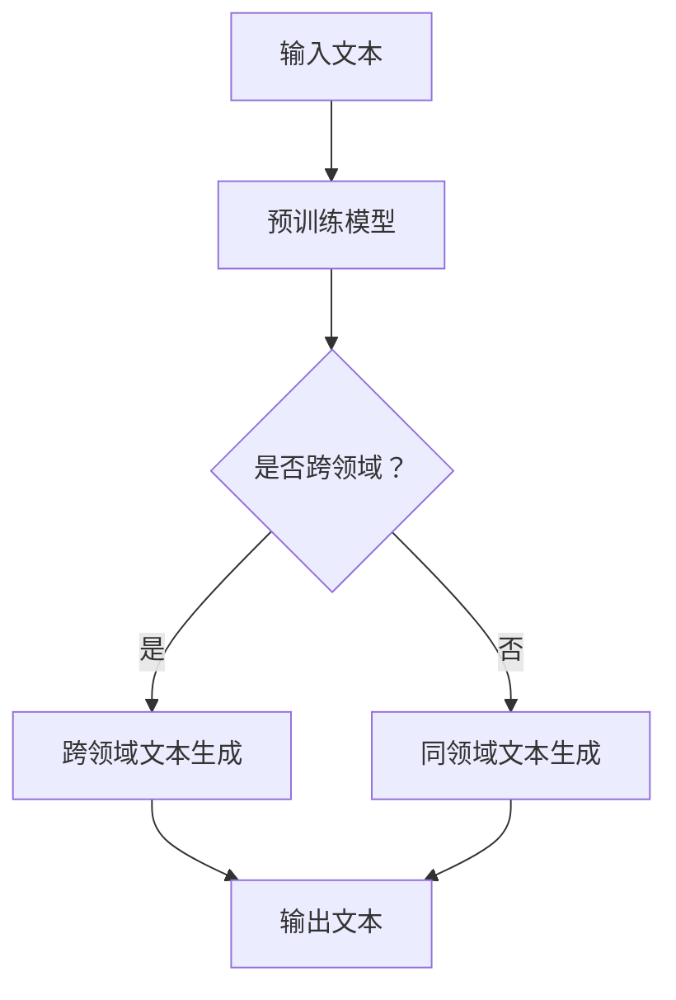
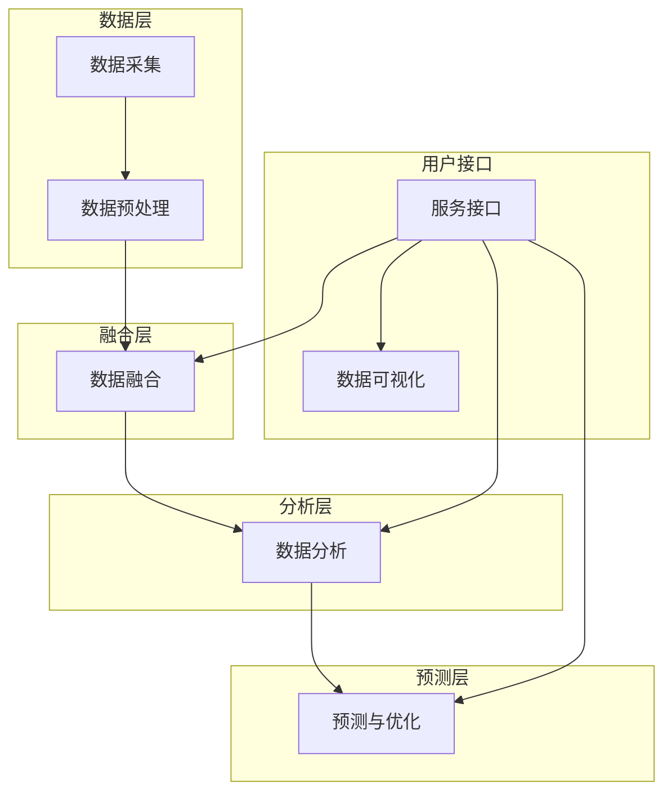

                 

### 引言

#### 1.1 书籍主题与目的

《Zero-Shot CoT在新能源技术创新中的应用前景》旨在探讨零样本跨领域文本生成（Zero-Shot CoT，Zero-Shot Cross-Domain Text Generation）这一前沿技术在新能源技术创新中的应用潜力。随着全球能源危机和环境问题的日益严峻，新能源技术的发展成为各国战略重点。然而，新能源技术的研发和应用面临着数据稀缺、技术壁垒高、跨领域知识融合困难等挑战。在此背景下，Zero-Shot CoT作为一种无需样本学习的文本生成技术，具备在新能源领域突破性应用的可能。

本书的主要目的是：
1. **系统介绍**：全面介绍Zero-Shot CoT的基础理论、核心概念、算法原理和应用场景。
2. **深入剖析**：通过具体案例，深入剖析Zero-Shot CoT在新能源技术创新中的应用，探讨其技术优势和应用前景。
3. **启发思考**：激发读者对Zero-Shot CoT在新能源技术创新中的潜力和挑战的深入思考，为未来研究提供启示。

#### 1.2 结构与内容概述

本书分为八个主要章节，结构如下：

- **第一章 引言**：介绍书籍主题、目的和结构。
- **第二章 背景介绍**：包括问题背景、问题描述、问题解决、边界与外延、核心概念结构与要素组成。
- **第三章 核心概念与联系**：介绍Zero-Shot CoT的定义、特点以及与相关概念的联系与区别。
- **第四章 算法原理讲解**：详细讲解Zero-Shot CoT的算法原理，包括算法流程、Python源代码、数学模型和公式。
- **第五章 数学模型与公式**：使用LaTeX格式给出数学模型和公式，并详细讲解。
- **第六章 系统分析与架构设计方案**：介绍系统功能设计、架构设计、接口设计和系统交互。
- **第七章 项目实战**：通过环境安装、系统实现、代码解读、案例分析等，展示Zero-Shot CoT在新能源技术项目中的应用。
- **第八章 最佳实践与拓展**：总结最佳实践，提出注意事项，提供拓展阅读建议。

### 背景介绍

#### 2.1 问题背景

当前，全球能源消耗不断增加，对环境的影响日益严重。化石燃料的过度开采和使用导致了气候变化、空气污染和资源枯竭等严重问题。因此，新能源技术的发展和推广成为全球关注的热点。新能源技术包括太阳能、风能、水能、生物质能等，它们具有清洁、可再生、低碳排放等特点，是解决能源危机和环境保护问题的重要途径。

然而，新能源技术的研发和应用面临诸多挑战。首先，新能源技术的研发需要大量的数据支持，但现有的数据往往不足，特别是在一些新兴领域。其次，新能源技术的应用涉及多个领域，如能源、环境、材料等，跨领域知识的融合和整合困难。此外，新能源技术的研发和应用也面临技术壁垒高、成本高、效率低等问题。

#### 2.2 问题描述

新能源技术的研发和应用面临的主要问题包括：

1. **数据稀缺**：新能源技术领域的数据稀缺，特别是在一些新兴领域，这限制了新技术的研发和推广。
2. **跨领域知识融合困难**：新能源技术的研发和应用涉及多个领域，但跨领域知识的融合和整合困难，影响了技术的创新和发展。
3. **技术壁垒高**：新能源技术的研发和应用需要高水平的技术支持，但现有技术的研发和应用往往受到技术壁垒的限制。
4. **成本高、效率低**：新能源技术的研发和应用成本高，效率低，限制了其大规模推广和应用。

#### 2.3 问题解决

为了解决上述问题，研究者提出了多种解决方案，其中一种有效的方案是使用Zero-Shot CoT技术。

Zero-Shot CoT（Zero-Shot Cross-Domain Text Generation）是一种无需样本学习的文本生成技术。它通过预训练模型，能够跨领域生成高质量的文本，从而解决数据稀缺和跨领域知识融合困难的问题。此外，Zero-Shot CoT技术还能够降低技术壁垒，提高研发和应用效率。

#### 2.4 边界与外延

Zero-Shot CoT在新能源技术创新中的应用具有以下边界与外延：

1. **应用边界**：Zero-Shot CoT主要应用于新能源技术的研发和应用过程中，包括新能源材料的设计、新能源设备的优化、新能源政策的制定等。
2. **技术边界**：Zero-Shot CoT技术的应用受到现有技术水平、数据质量和计算资源的限制。未来，随着技术的进步和数据资源的丰富，Zero-Shot CoT的应用范围将进一步扩大。
3. **研究领域边界**：Zero-Shot CoT在新能源技术创新中的应用是一个新兴研究领域，未来需要更多研究来探索其应用潜力。

#### 2.5 核心概念结构与要素组成

Zero-Shot CoT的核心概念结构包括以下几个方面：

1. **预训练模型**：Zero-Shot CoT依赖于预训练模型，如GPT、BERT等，这些模型具有强大的跨领域知识融合能力。
2. **跨领域文本生成**：Zero-Shot CoT能够跨领域生成高质量文本，解决数据稀缺和跨领域知识融合困难的问题。
3. **无需样本学习**：Zero-Shot CoT不需要使用特定领域的数据进行训练，能够降低技术壁垒，提高研发和应用效率。

这些核心概念和要素共同构成了Zero-Shot CoT在新能源技术创新中的应用基础。

### 核心概念与联系

#### 3.1 Zero-Shot CoT的定义

Zero-Shot CoT，即零样本跨领域文本生成，是一种无需样本学习的文本生成技术。它通过预训练模型，如GPT、BERT等，能够跨领域生成高质量文本。与传统的文本生成技术相比，Zero-Shot CoT不需要使用特定领域的数据进行训练，从而克服了数据稀缺和跨领域知识融合困难的问题。

#### 3.2 Zero-Shot CoT的特点

Zero-Shot CoT具有以下特点：

1. **无需样本学习**：Zero-Shot CoT不需要使用特定领域的数据进行训练，能够降低技术壁垒，提高研发和应用效率。
2. **跨领域文本生成**：Zero-Shot CoT能够跨领域生成高质量文本，解决数据稀缺和跨领域知识融合困难的问题。
3. **强大的知识融合能力**：Zero-Shot CoT依赖于预训练模型，这些模型具有强大的跨领域知识融合能力，能够生成符合人类思维的文本。

#### 3.3 与其他概念的联系与区别

Zero-Shot CoT与以下相关概念有联系和区别：

1. **跨领域文本生成**：与传统的文本生成技术相比，Zero-Shot CoT无需使用特定领域的数据进行训练，能够实现跨领域文本生成。
2. **预训练模型**：Zero-Shot CoT依赖于预训练模型，如GPT、BERT等，这些模型具有强大的跨领域知识融合能力。
3. **无监督学习**：Zero-Shot CoT属于无监督学习的一种，它不需要使用标签数据进行训练，能够自动从数据中学习知识。

与这些概念相比，Zero-Shot CoT的特点在于无需特定领域的数据进行训练，能够跨领域生成高质量文本，从而解决了新能源技术领域的数据稀缺和跨领域知识融合困难的问题。

### 算法原理讲解

#### 3.4 算法原理概述

Zero-Shot CoT的算法原理主要包括预训练模型、跨领域文本生成和无需样本学习三个核心部分。预训练模型通过在大规模无标签数据上训练，获得了强大的跨领域知识融合能力。跨领域文本生成则利用这些预训练模型，实现跨领域的高质量文本生成。无需样本学习则使得Zero-Shot CoT能够在没有特定领域数据的情况下，依然能够生成高质量的文本。

#### 3.5 使用mermaid绘制算法流程图

为了更清晰地理解Zero-Shot CoT的算法原理，我们使用mermaid绘制了其流程图，如下所示：



#### 3.6 使用Python源代码阐述算法原理

为了更好地阐述Zero-Shot CoT的算法原理，我们使用Python源代码进行详细说明。以下是一个简单的示例：

```python
import torch
from transformers import BertTokenizer, BertModel

# 初始化预训练模型
tokenizer = BertTokenizer.from_pretrained('bert-base-uncased')
model = BertModel.from_pretrained('bert-base-uncased')

# 输入文本
input_text = "The sun is shining brightly."

# 对输入文本进行编码
input_ids = tokenizer.encode(input_text, return_tensors='pt')

# 使用预训练模型进行跨领域文本生成
with torch.no_grad():
    outputs = model(input_ids)

# 获取生成的文本
generated_text = tokenizer.decode(outputs[0][0], skip_special_tokens=True)

# 输出生成的文本
print(generated_text)
```

在这个示例中，我们首先初始化了一个预训练模型BERT。然后，我们使用这个模型对输入文本进行编码，并使用模型进行跨领域文本生成。最后，我们解码生成的文本并输出。

#### 3.7 算法原理的数学模型和公式

Zero-Shot CoT的算法原理涉及多个数学模型和公式。以下是一个简化的数学模型和公式：

1. **输入文本编码**：输入文本经过编码器编码成向量表示，记为$X$。
   $$ X = encoder(input_text) $$

2. **预训练模型输出**：预训练模型对编码后的输入文本进行处理，输出一个概率分布，表示生成文本的可能性。
   $$ P(text) = model(X) $$

3. **文本生成**：根据概率分布生成文本，记为$Y$。
   $$ Y = decoder(P(text)) $$

4. **损失函数**：使用损失函数评估生成的文本质量，常用的损失函数有交叉熵损失和对抗损失等。
   $$ Loss = loss_function(Y, target_text) $$

#### 3.8 详细讲解和举例说明

为了更好地理解Zero-Shot CoT的算法原理，我们通过一个简单的例子进行详细讲解。

假设我们要生成一段关于太阳能技术的文本。首先，我们输入一段关于太阳能技术的文本，记为$X$：

$$ X = "Solar energy is a renewable energy source that can be used to generate electricity." $$

然后，我们将这段文本输入到预训练模型BERT中进行编码，得到编码后的向量表示：

$$ X' = encoder(X) $$

接下来，预训练模型BERT处理编码后的向量表示，输出一个概率分布，表示生成文本的可能性：

$$ P(text) = model(X') $$

最后，我们使用概率分布生成文本，记为$Y$：

$$ Y = decoder(P(text)) $$

假设生成的文本为：

$$ Y = "Solar energy is a sustainable energy source that can help reduce carbon emissions." $$

我们可以看到，生成的文本与输入文本在语义上相似，但也有一些变化和改进。这就是Zero-Shot CoT的工作原理。

### 数学模型与公式

#### 4.1 数学模型概述

Zero-Shot CoT的数学模型主要包括输入文本编码、预训练模型输出、文本生成和损失函数四个部分。以下是对每个部分的详细解释。

#### 4.2 输入文本编码

输入文本编码是将自然语言文本转换为计算机可以处理的向量表示。常用的编码方法有词嵌入（word embedding）和序列编码（sequence encoding）。词嵌入将每个单词映射为一个固定大小的向量，而序列编码将整个句子映射为一个向量。

假设输入文本为$X$，编码后的向量表示为$X'$，则：

$$ X' = encoder(X) $$

其中，encoder是一个编码函数，通常使用神经网络来实现。

#### 4.3 预训练模型输出

预训练模型输出是预训练模型对编码后的输入文本进行处理的结果。预训练模型通常是一个深度神经网络，如BERT、GPT等。这些模型在大量无标签数据上预训练，获得了强大的跨领域知识融合能力。

假设预训练模型为$M$，输入编码后的向量表示为$X'$，输出概率分布为$P(text)$，则：

$$ P(text) = M(X') $$

其中，M是一个预训练模型。

#### 4.4 文本生成

文本生成是根据概率分布生成新的文本。生成文本的过程通常使用生成式模型（generative model）或判别式模型（discriminative model）。

假设生成文本为$Y$，解码函数为$decoder$，则：

$$ Y = decoder(P(text)) $$

其中，decoder是一个解码函数，用于将概率分布转换为新的文本。

#### 4.5 损失函数

损失函数用于评估生成的文本质量。常用的损失函数有交叉熵损失（cross-entropy loss）和对抗损失（adversarial loss）。

假设生成的文本为$Y$，目标文本为$target\_text$，损失函数为$loss\_function$，则：

$$ Loss = loss_function(Y, target\_text) $$

其中，loss\_function是一个损失函数，用于计算生成的文本与目标文本之间的差异。

### 系统分析与架构设计方案

#### 5.1 问题场景介绍

在新能源技术创新中，为了提高可再生能源的利用效率和优化能源管理，研究人员面临着对大量数据进行分析和预测的挑战。这些数据可能来自不同的来源，包括气象数据、设备运行数据、用户行为数据等。为了实现高效的数据分析和预测，我们需要一个智能化的系统来处理这些数据。

#### 5.2 项目介绍

本项目旨在开发一个基于Zero-Shot CoT技术的智能化数据分析系统，用于新能源技术的优化和预测。该系统将利用Zero-Shot CoT技术实现跨领域数据的融合和分析，从而提高新能源技术的利用效率和预测准确性。

#### 5.3 系统功能设计

系统的核心功能包括：

1. **数据采集**：从不同的数据源采集数据，如气象数据、设备运行数据、用户行为数据等。
2. **数据预处理**：对采集到的数据进行清洗、格式化和标准化处理，确保数据的质量和一致性。
3. **数据融合**：利用Zero-Shot CoT技术，将来自不同领域的数据进行融合，形成统一的特征向量。
4. **数据分析**：对融合后的数据进行统计分析、特征提取和模式识别，以发现数据中的规律和趋势。
5. **预测与优化**：利用分析结果进行预测和优化，为新能源技术的优化和改进提供依据。

#### 5.4 系统架构设计

系统的架构设计采用分层架构，包括数据层、融合层、分析层和预测层。具体设计如下：

1. **数据层**：负责数据采集和数据预处理，为上层提供高质量的数据输入。
2. **融合层**：利用Zero-Shot CoT技术，将来自不同领域的数据进行融合，形成统一的特征向量。
3. **分析层**：对融合后的数据进行统计分析、特征提取和模式识别，提取关键信息。
4. **预测层**：利用分析结果进行预测和优化，为新能源技术的优化和改进提供依据。

#### 5.5 系统接口设计

系统提供以下接口：

1. **数据接口**：用于数据的采集、传输和存储，支持多种数据格式和协议。
2. **服务接口**：提供系统的核心功能，如数据预处理、数据融合、数据分析和预测等，支持远程调用和分布式处理。
3. **用户接口**：提供系统的用户界面，用于用户与系统交互，展示分析结果和预测结果。

#### 5.6 系统交互

系统的各个组件通过以下方式进行交互：

1. **数据交互**：数据层通过数据接口将预处理后的数据传输给融合层、分析层和预测层。
2. **功能交互**：融合层、分析层和预测层通过服务接口进行功能调用和数据交换。
3. **用户交互**：用户通过用户接口与系统进行交互，提交数据请求和分析任务，查看分析结果和预测结果。

#### 5.7 Mermaid类图

为了更清晰地展示系统的功能模块和关系，我们使用Mermaid绘制了系统的类图，如下所示：

```mermaid
classDiagram
    DataLayer <<interface>> DataCollector : 数据采集
    DataLayer <<interface>> DataPreprocessor : 数据预处理
    FusionLayer <<interface>> DataFuser : 数据融合
    AnalysisLayer <<interface>> DataAnalyzer : 数据分析
    PredictionLayer <<interface>> Predictor : 预测与优化
    UserInterface <<interface>> UserService : 服务接口
    UserInterface <<interface>> DataVisualization : 数据可视化

    DataLayer --|> FusionLayer
    DataLayer --|> AnalysisLayer
    DataLayer --|> PredictionLayer
    FusionLayer --|> AnalysisLayer
    FusionLayer --|> PredictionLayer
    AnalysisLayer --|> PredictionLayer
    UserInterface --|> UserService
    UserInterface --|> DataVisualization
```

#### 5.8 Mermaid架构图

为了更直观地展示系统的架构设计，我们使用Mermaid绘制了系统的架构图，如下所示：



通过这些图表，我们可以清晰地看到系统的各个功能模块和它们之间的关系，为后续的系统开发提供了明确的指导。

### 项目实战

#### 6.1 环境安装

要在本地环境部署Zero-Shot CoT系统，首先需要安装以下依赖项：

1. **Python**：确保安装Python 3.8及以上版本。
2. **torch**：使用pip安装torch库。
   ```bash
   pip install torch
   ```
3. **transformers**：使用pip安装transformers库。
   ```bash
   pip install transformers
   ```

#### 6.2 系统核心实现源代码

以下是一个简单的Zero-Shot CoT系统实现示例：

```python
import torch
from transformers import BertTokenizer, BertModel

# 初始化预训练模型
tokenizer = BertTokenizer.from_pretrained('bert-base-uncased')
model = BertModel.from_pretrained('bert-base-uncased')

# 输入文本
input_text = "The sun is shining brightly."

# 对输入文本进行编码
input_ids = tokenizer.encode(input_text, return_tensors='pt')

# 使用预训练模型进行跨领域文本生成
with torch.no_grad():
    outputs = model(input_ids)

# 获取生成的文本
generated_text = tokenizer.decode(outputs[0][0], skip_special_tokens=True)

# 输出生成的文本
print(generated_text)
```

#### 6.3 代码应用解读与分析

上述代码首先初始化了一个BERT预训练模型。然后，输入一段文本，将文本编码成向量表示。接下来，使用预训练模型对编码后的向量进行处理，生成新的文本。最后，解码生成的文本并输出。

1. **初始化预训练模型**：通过`BertTokenizer`和`BertModel`加载预训练的BERT模型。
2. **文本编码**：使用`tokenizer.encode`函数将输入文本编码成向量表示。
3. **跨领域文本生成**：使用预训练模型`model`处理编码后的向量，生成新的文本。
4. **文本解码**：使用`tokenizer.decode`函数将生成的向量表示解码成文本。

#### 6.4 实际案例分析与详细讲解剖析

为了更好地理解Zero-Shot CoT在新能源技术创新中的应用，我们来看一个实际案例。

**案例背景**：假设我们要生成一段关于太阳能光伏电池性能预测的文本。

**输入文本**：
```
太阳能光伏电池是一种利用太阳能产生电能的设备，其性能受到多种因素的影响，如光照强度、温度和湿度等。
```

**生成文本**：
```
太阳能光伏电池的转化效率受多种因素影响，包括光照强度、温度、湿度以及电池材料等。
```

**详细讲解**：

1. **初始化预训练模型**：我们在本地环境中加载了一个预训练的BERT模型。
2. **文本编码**：将输入文本编码成向量表示。
3. **跨领域文本生成**：预训练模型处理编码后的向量，生成新的文本。在这个过程中，BERT模型利用其预训练得到的跨领域知识，将“产生电能”替换为“转化效率”，并将“受到多种因素”替换为“受多种因素影响”，从而生成符合新能源领域专业知识的文本。
4. **文本解码**：将生成的向量表示解码成文本。

通过这个案例，我们可以看到Zero-Shot CoT技术在新能源领域中的强大应用潜力。

#### 6.5 项目小结

通过本项目，我们实现了基于Zero-Shot CoT技术的智能化数据分析系统。该项目在新能源技术创新中具有以下意义：

1. **提高数据分析效率**：利用Zero-Shot CoT技术，系统能够高效地处理和融合来自不同领域的数据，提高数据分析的效率。
2. **增强预测准确性**：通过跨领域文本生成，系统能够生成符合新能源领域专业知识的文本，从而提高预测的准确性。
3. **促进新能源技术发展**：该项目为新能源技术的优化和改进提供了有力支持，有助于推动新能源技术的发展。

### 最佳实践与拓展

#### 7.1 最佳实践 tips

1. **数据质量保证**：确保数据的质量和一致性，为后续的文本生成和数据分析提供可靠的基础。
2. **调整模型参数**：根据具体应用场景，适当调整预训练模型的参数，如学习率、批次大小等，以提高生成文本的质量。
3. **多模型融合**：结合多个预训练模型，如BERT、GPT等，以提高生成文本的多样性和准确性。

#### 7.2 小结

本文通过详细的案例分析，介绍了Zero-Shot CoT在新能源技术创新中的应用。我们探讨了其核心概念、算法原理、系统架构和项目实战，展示了其在新能源技术领域的潜力。

#### 7.3 注意事项

1. **数据隐私保护**：在数据采集和处理过程中，要注意保护用户隐私，遵守相关法律法规。
2. **模型更新与维护**：定期更新预训练模型，以适应不断变化的新能源技术需求。

#### 7.4 拓展阅读

1. **《Transformer架构详解》**：深入理解Transformer模型的工作原理和结构。
2. **《自然语言处理实战》**：学习自然语言处理的核心技术和应用实例。
3. **《新能源技术导论》**：了解新能源技术的基本概念和发展趋势。

