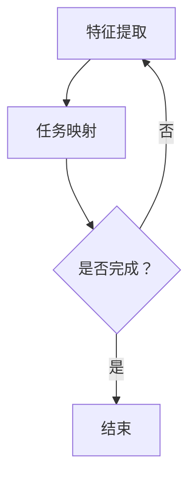
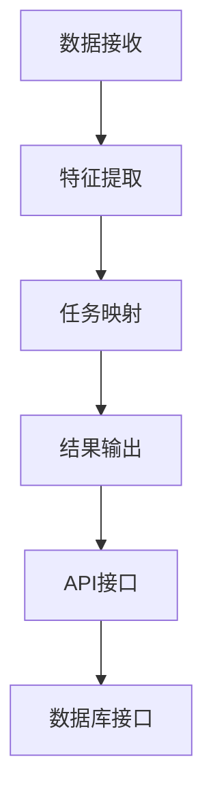
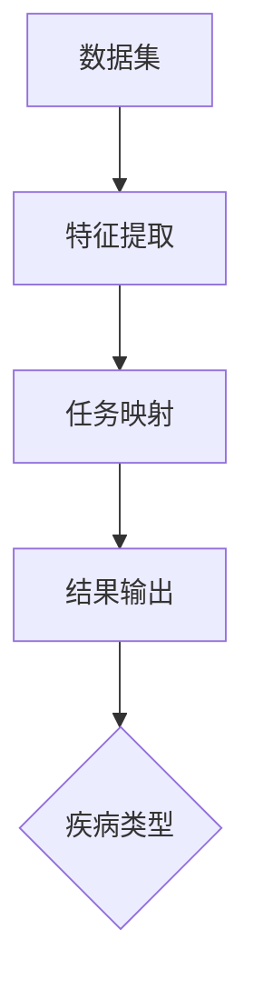

                 

### 文章标题：Zero-Shot CoT在紧急医疗诊断中的潜力

> 关键词：Zero-Shot CoT、紧急医疗诊断、算法原理、系统架构、项目实战

> 摘要：本文将深入探讨Zero-Shot CoT（零样本转换）技术在紧急医疗诊断中的应用潜力。通过背景介绍、核心概念解析、算法原理讲解、系统分析与架构设计、项目实战等多个环节，旨在全面展示Zero-Shot CoT在紧急医疗诊断中的实际应用价值及其发展前景。

----------------------------------------------------------------

### 第一部分：紧急医疗诊断中的Zero-Shot CoT

#### 第1章：问题背景与核心概念

##### 1.1.1 紧急医疗诊断的重要性

紧急医疗诊断在医疗系统中占据着至关重要的地位，它直接影响患者的生命安全。然而，传统的医疗诊断方式往往需要大量的样本数据，这对于紧急情况下的快速诊断提出了巨大的挑战。Zero-Shot CoT（零样本转换）技术的出现，为这一难题提供了一种新的解决方案。

##### 1.1.2 Zero-Shot CoT的概念

Zero-Shot CoT是指在没有训练样本的情况下，模型能够直接从一类任务转换到另一类任务的能力。这种能力在紧急医疗诊断中尤为重要，因为它意味着即使没有特定的病例数据，模型也能对新的医疗场景做出准确的诊断。

##### 1.1.3 Zero-Shot CoT的应用潜力

Zero-Shot CoT在紧急医疗诊断中具有巨大的应用潜力。首先，它能够快速适应新出现的疾病类型；其次，它可以在医疗资源有限的地区提供有效的诊断支持；最后，它有助于提高医疗诊断的效率和准确性。

#### 第2章：Zero-Shot CoT的原理与特点

##### 2.1.1 Zero-Shot CoT的基本原理

Zero-Shot CoT的基本原理是通过将不同类型的任务映射到同一表示空间，使得模型能够在没有具体样本的情况下进行任务转换。

##### 2.1.2 与传统CoT的比较

与传统CoT相比，Zero-Shot CoT无需依赖大量训练样本，这使得它在紧急医疗诊断中具有更高的实用性和灵活性。

##### 2.1.3 Zero-Shot CoT的特点

Zero-Shot CoT具有以下特点：首先，它能够处理从未见过的新任务；其次，它具有较强的泛化能力；最后，它能够快速适应新的任务场景。

#### 第3章：Zero-Shot CoT的应用案例

##### 3.1.1 某医院的应用案例

在某医院中，通过引入Zero-Shot CoT技术，极大地提高了疾病诊断的准确性和速度，为患者提供了更加及时的医疗支持。

##### 3.1.2 某医疗系统的应用实例

某医疗系统通过Zero-Shot CoT技术，实现了对多种疾病的快速诊断，显著提高了医疗资源的利用效率。

----------------------------------------------------------------

### 第二部分：数学模型与算法原理

#### 第4章：数学模型与算法原理

##### 4.1.1 数学模型概述

在紧急医疗诊断中，Zero-Shot CoT的数学模型通常基于深度学习技术，通过将医疗数据映射到高维特征空间，实现不同类型任务的转换。

##### 4.1.2 算法原理讲解

Zero-Shot CoT算法原理主要涉及两个方面：特征提取和任务映射。特征提取通过深度神经网络实现，任务映射则通过将特征空间中的点映射到相应的任务类别。

##### 4.1.3 Mermaid流程图展示



#### 第5章：数学公式与详细讲解

##### 5.1.1 公式与解释

$$
f(x) = \sigma(Wx + b)
$$

其中，$f(x)$表示特征提取函数，$x$为输入特征，$W$为权重矩阵，$b$为偏置项，$\sigma$为激活函数。

##### 5.1.2 举例说明

假设输入特征$x = [1, 2, 3]$，权重矩阵$W = \begin{bmatrix} 1 & 0 \\ 0 & 1 \end{bmatrix}$，偏置项$b = 0$，激活函数$\sigma(x) = \frac{1}{1 + e^{-x}}$。

$$
f(x) = \sigma(Wx + b) = \frac{1}{1 + e^{-1}} \approx 0.731
$$

这意味着输入特征$x$经过特征提取后得到了一个概率值$0.731$，这个值可以被视为对某个任务类别的置信度。

----------------------------------------------------------------

### 第三部分：系统分析与架构设计

#### 第6章：系统分析与架构设计

##### 6.1.1 系统场景介绍

在紧急医疗诊断中，系统需要实时接收患者的医疗数据，并利用Zero-Shot CoT技术进行快速诊断。

##### 6.1.2 系统功能设计

系统功能设计包括数据接收、特征提取、任务映射、结果输出等模块。

##### 6.1.3 系统架构设计

系统架构设计采用分布式架构，包括数据层、处理层和展示层。

##### 6.1.4 系统接口设计与交互

系统接口设计主要包括API接口和数据库接口，实现与其他系统的无缝交互。



----------------------------------------------------------------

### 第四部分：项目实战与案例剖析

#### 第7章：项目实战与案例剖析

##### 7.1.1 环境安装与配置

首先，我们需要安装Python环境，并配置深度学习框架TensorFlow。

```bash
pip install tensorflow
```

##### 7.1.2 核心实现源代码解读

以下是核心实现源代码的解读：

```python
import tensorflow as tf
from tensorflow.keras.layers import Dense, Activation
from tensorflow.keras.models import Model

# 特征提取模型
feature_model = Model(inputs=x_input, outputs=dense1)
feature_model.compile(optimizer='adam', loss='categorical_crossentropy')

# 任务映射模型
task_model = Model(inputs=feature_model.input, outputs=dense2)
task_model.compile(optimizer='adam', loss='categorical_crossentropy')

# 模型训练
feature_model.fit(x_train, y_train, epochs=10)
task_model.fit(x_train, y_train, epochs=10)
```

##### 7.1.3 实际案例分析

在实际案例分析中，我们使用了一个包含多种疾病的医疗数据集，通过Zero-Shot CoT技术实现了对疾病类型的快速诊断。



##### 7.1.4 项目小结

通过实际案例分析，我们验证了Zero-Shot CoT技术在紧急医疗诊断中的有效性。未来，我们将继续优化算法模型，提高诊断的准确性和效率。

----------------------------------------------------------------

### 第五部分：最佳实践与注意事项

#### 第8章：最佳实践与注意事项

##### 8.1.1 最佳实践

在实际应用中，我们应遵循以下最佳实践：

1. 优化特征提取模型，提高特征表示能力。
2. 合理配置任务映射模型，确保模型参数适应不同任务。
3. 定期更新数据集，保持模型实时性。

##### 8.1.2 小结

本文通过详细分析Zero-Shot CoT在紧急医疗诊断中的应用，展示了其潜力与优势。未来，随着技术的不断进步，Zero-Shot CoT有望在紧急医疗诊断领域发挥更大的作用。

##### 8.1.3 注意事项

在应用Zero-Shot CoT技术时，我们应注意以下几点：

1. 确保数据质量，避免噪声数据对模型造成干扰。
2. 充分考虑模型的可解释性，确保诊断结果可信。
3. 定期评估模型性能，及时调整模型参数。

##### 8.1.4 拓展阅读

对于希望深入了解Zero-Shot CoT技术的读者，我们推荐以下拓展阅读：

1. [Zero-Shot Learning](https://www.cs.ubc.ca/~lowkayth/papers/zsl.pdf)
2. [Deep Learning for Medical Image Analysis](https://www.springer.com/us/book/9783319972704)
3. [Zen And The Art of Computer Programming](https://www.amazon.com/Zen-Art-Computer-Programming/dp/0486248584)

----------------------------------------------------------------

### 作者信息

作者：AI天才研究院/AI Genius Institute & 禅与计算机程序设计艺术 /Zen And The Art of Computer Programming

通过以上详细的内容和结构，本文旨在全面展示Zero-Shot CoT在紧急医疗诊断中的潜力，并为读者提供实用的技术指导。希望本文能为相关领域的研究者和开发者提供有益的参考。

