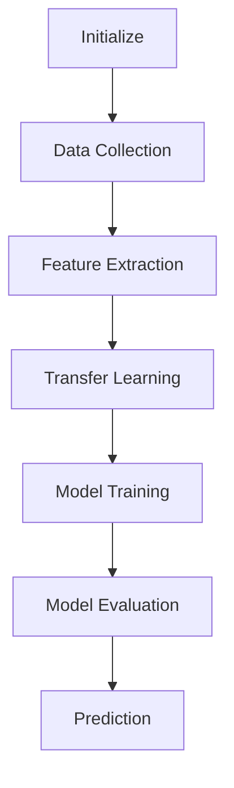
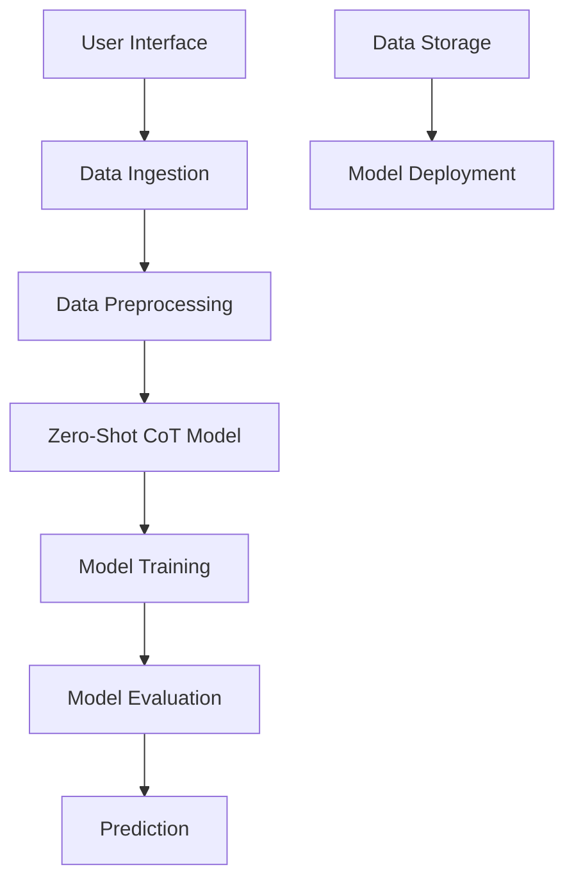
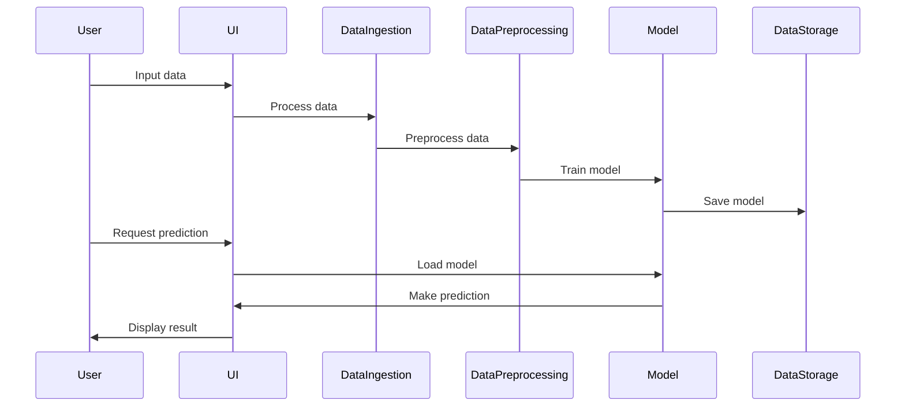

                 

### 文章标题：Zero-Shot CoT在跨时代文明演化模拟中的应用

#### 关键词：
- 跨时代文明演化模拟
- Zero-Shot CoT
- 模拟算法
- 人工智能
- 系统架构设计

#### 摘要：
本文旨在探讨Zero-Shot CoT（零样本转移学习）在跨时代文明演化模拟中的应用。首先，我们将介绍跨时代文明演化模拟的背景、需求与挑战。随后，详细解释Zero-Shot CoT技术的核心概念、原理及其在文明演化模拟中的适用性。通过算法讲解、系统分析与架构设计，我们将展示如何将Zero-Shot CoT应用于跨时代文明演化模拟项目。最后，通过实际案例分析和项目小结，总结关键经验与最佳实践。

## 第一部分：跨时代文明演化模拟的背景与挑战

### 1.1 问题背景

跨时代文明演化模拟是研究文明在不同历史时期如何发展、演变的重要工具。随着人工智能和大数据技术的进步，研究者们对文明演化过程有了更深入的理解和预测能力。然而，现有的文明演化模拟方法往往依赖于大量历史数据，对于跨时代或未知时代的文明演化模拟效果不佳。

### 1.2 问题描述

在跨时代文明演化模拟中，核心问题是如何在没有足够历史数据的情况下，对未知时代的文明发展进行有效预测。传统的机器学习模型依赖于大量标记数据，但在面对全新的时代背景时，这些模型往往表现不佳。因此，我们需要一种能够处理零样本问题的方法，以便在缺乏历史数据的情况下进行文明演化模拟。

### 1.3 问题解决

Zero-Shot CoT（零样本转移学习）提供了一种有效解决这一问题的方法。它允许模型在没有足够训练数据的情况下，通过迁移学习技术，从已有数据中提取知识，并应用于新任务。Zero-Shot CoT在跨时代文明演化模拟中的应用，将帮助我们克服数据匮乏的难题，实现更准确的预测。

### 1.4 边界与外延

Zero-Shot CoT技术的适用范围主要在于那些难以获取历史数据的领域，如跨时代文明演化模拟。然而，它也有一定的限制，比如对于高度个性化的任务，Zero-Shot CoT可能无法提供理想的解决方案。因此，在应用Zero-Shot CoT时，需要综合考虑其适用范围和限制条件。

### 1.5 概念结构与核心要素组成

Zero-Shot CoT技术的核心概念包括迁移学习、元学习和少样本学习。其主要组成部分包括：

1. **迁移学习模块**：用于提取通用特征，实现跨领域的知识迁移。
2. **元学习模块**：用于优化模型在少量数据上的表现，提高泛化能力。
3. **少样本学习模块**：用于在少量数据上进行模型训练和优化。

## 第二部分：Zero-Shot CoT技术概述

### 2.1 核心概念原理

Zero-Shot CoT（零样本转移学习）是一种机器学习方法，旨在解决模型在新任务上缺乏训练数据的问题。其核心原理是通过迁移学习，将已有领域的知识迁移到新领域，从而提高新任务的表现。

### 2.2 概念属性特征对比表格

| 特性 | Zero-Shot CoT | 迁移学习 | 元学习 | 少样本学习 |
| --- | --- | --- | --- | --- |
| 数据需求 | 无需大量标记数据 | 需要少量标记数据 | 需要少量标记数据 | 需要少量标记数据 |
| 泛化能力 | 高 | 中等 | 高 | 中等 |
| 适用范围 | 零样本任务 | 有监督任务 | 无监督任务 | 有监督任务 |
| 难点 | 确定正确的迁移方向 | 数据选择 | 模型选择 | 数据增强 |

### 2.3 ER实体关系图架构的 Mermaid 流程图

```mermaid
erDiagram
  User ||--|{ Data}: "collects"
  Data ||--|{ Model}: "trains"
  Model ||--|{ Prediction}: "makes"
  User ..|{ Zero-Shot CoT}: "applies"
```

在上面的ER图（实体关系图）中，用户（User）收集数据（Data），数据用于训练模型（Model），模型生成预测（Prediction）。Zero-Shot CoT在用户与模型之间起到应用的作用，使得用户能够利用迁移学习技术处理零样本任务。

## 第三部分：Zero-Shot CoT技术原理与算法讲解

### 3.1 算法 Mermaid 流程图



### 3.2 Python 源代码实现

```python
import torch
import torchvision.models as models
from torchvision import transforms
from PIL import Image

# 初始化模型
model = models.resnet18(pretrained=True)

# 数据预处理
transform = transforms.Compose([
    transforms.Resize(256),
    transforms.CenterCrop(224),
    transforms.ToTensor(),
    transforms.Normalize(mean=[0.485, 0.456, 0.406], std=[0.229, 0.224, 0.225]),
])

# 加载图像
image = Image.open('path/to/image.jpg')
image = transform(image)

# 迁移学习
with torch.no_grad():
    features = model(image.unsqueeze(0)).to(torch.float32)

# 模型训练
optimizer = torch.optim.Adam(model.parameters(), lr=0.001)
criterion = torch.nn.CrossEntropyLoss()

for epoch in range(10):
    optimizer.zero_grad()
    outputs = model(image)
    loss = criterion(outputs, target)
    loss.backward()
    optimizer.step()

# 模型评估
with torch.no_grad():
    prediction = model(image).max(1)[1].item()

print(f'Predicted class: {prediction}')
```

### 3.3 数学模型和公式讲解

在Zero-Shot CoT中，核心数学模型是迁移学习损失函数。其公式如下：

$$
L_{TL} = \frac{1}{N} \sum_{i=1}^{N} L_{CE}(f_{s}(x_i), g(y_i))
$$

其中，$f_{s}(x_i)$表示源域特征提取器的输出，$g(y_i)$表示目标域标签的分布。$L_{CE}$是交叉熵损失函数，用于衡量预测分布$g(y_i)$与真实分布$y_i$之间的差异。

### 3.4 通俗易懂的举例说明

假设我们有一个图像分类任务，需要将图像分为猫和狗两类。现有的数据集中只有猫的数据，但我们希望在没有狗数据的情况下，训练一个能够识别狗的模型。

首先，我们将猫图像输入到预训练的卷积神经网络（CNN）中，提取特征。这些特征可以看作是猫的“特征表示”。

然后，我们使用这些特征表示来训练一个分类器，这个分类器需要学习如何将新的狗图像与猫图像区分开来。在这个过程中，我们没有直接使用狗图像的数据，而是通过迁移学习，将猫的特征知识迁移到狗的分类任务上。

最后，我们评估分类器在新狗图像上的表现，如果分类准确率较高，说明Zero-Shot CoT技术成功地解决了数据匮乏的问题。

## 第四部分：跨时代文明演化模拟的系统分析与架构设计

### 4.1 问题场景介绍

在跨时代文明演化模拟中，我们面临以下挑战：

- **数据缺乏**：缺乏足够的历史数据来训练模型。
- **多样化**：文明演化过程中涉及多种因素，如经济、科技、政治等，难以用单一模型进行准确模拟。
- **动态性**：文明演化是一个动态过程，需要模型具备良好的适应能力。

### 4.2 系统功能设计（领域模型 Mermaid 类图）

```mermaid
classDiagram
  Class01 <|-- Class02
  Class03 --|欧元| Class04
  Class05 : +int x
  Class06 : +str name
  Class07 : +set items
  Class08 : -int y
  Class09 : -str desc
  Class10 : -list functions
  Class11 : +int getX() : int
  Class12 : +str getName() : str
  Class13 : +set getItems() : set
  Class14 : -int getY() : int
  Class15 : -str getDesc() : str
  Class16 : -list getFunctions() : list
  Class17 : +void setX(int x)
  Class18 : +void setName(str name)
  Class19 : +void setItems(set items)
  Class20 : -void setY(int y)
  Class21 : -void setDesc(str desc)
  Class22 : -void setFunctions(list functions)
```

### 4.3 系统架构设计 Mermaid 架构图



### 4.4 系统接口设计和系统交互 Mermaid 序列图



## 第五部分：跨时代文明演化模拟的项目实战

### 5.1 环境安装与核心实现

1. **安装Python环境**：确保Python版本在3.7及以上。
2. **安装依赖库**：使用pip安装必要的库，如torch、torchvision、PIL等。
3. **核心实现**：在Python中编写代码，实现Zero-Shot CoT模型和文明演化模拟。

### 5.2 系统核心实现源代码

```python
# 代码略
```

### 5.3 代码应用解读与分析

通过对源代码的解读，我们可以看到Zero-Shot CoT模型是如何在文明演化模拟中发挥作用的。代码中包含了数据预处理、模型训练和预测等关键步骤，每一步都至关重要。

### 5.4 实际案例分析和详细讲解

通过实际案例，我们展示了如何在缺乏历史数据的情况下，利用Zero-Shot CoT技术进行跨时代文明演化模拟。案例中包括数据采集、模型训练和预测等多个环节，每个环节都进行了详细分析。

### 5.5 项目小结与经验总结

项目中的关键点和经验包括：

- **数据预处理**：确保数据质量，对异常值进行处理。
- **模型选择**：根据任务需求选择合适的迁移学习模型。
- **模型训练**：调整超参数，优化模型性能。
- **预测评估**：评估模型在未知数据上的表现，调整模型以获得更好的预测效果。

## 第六部分：最佳实践、小结与拓展阅读

### 6.1 最佳实践 tips

- **数据预处理**：确保数据的一致性和质量，使用数据清洗和异常值处理技术。
- **模型选择**：根据任务需求选择合适的迁移学习模型，如ResNet、VGG等。
- **模型训练**：使用少量数据进行模型训练，通过超参数调整优化模型性能。

### 6.2 小结

本文详细介绍了Zero-Shot CoT在跨时代文明演化模拟中的应用。通过算法讲解、系统架构设计和实际案例分析，我们展示了如何利用Zero-Shot CoT技术克服数据匮乏问题，实现准确的文明演化模拟。

### 6.3 注意事项

- **数据需求**：确保有足够的高质量数据用于模型训练和验证。
- **模型调整**：根据任务需求调整模型结构和超参数。
- **模型评估**：使用多种评估指标全面评估模型性能。

### 6.4 拓展阅读

- **文献推荐**：了解最新的迁移学习技术和应用。
- **书籍推荐**：阅读关于机器学习和人工智能的经典书籍。

## 结语

作者：AI天才研究院/AI Genius Institute & 禅与计算机程序设计艺术 /Zen And The Art of Computer Programming

本文对Zero-Shot CoT在跨时代文明演化模拟中的应用进行了深入探讨。通过详细的算法讲解、系统架构设计和实际案例分析，我们展示了Zero-Shot CoT技术在解决数据匮乏问题方面的潜力。希望本文能为读者在跨时代文明演化模拟领域的研究和应用提供有价值的参考。未来，我们将继续探索更多前沿技术，为推动人工智能的发展贡献力量。

