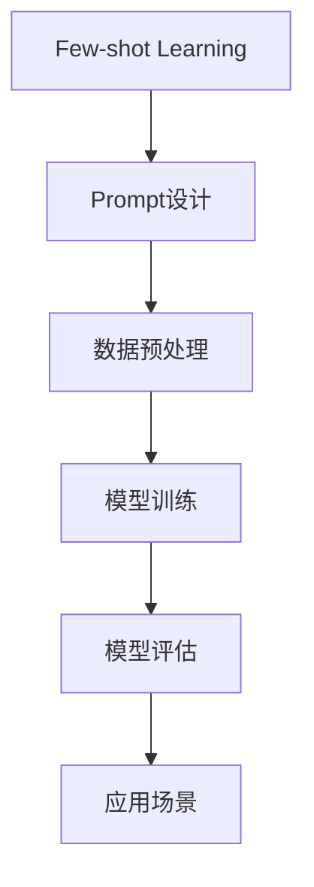
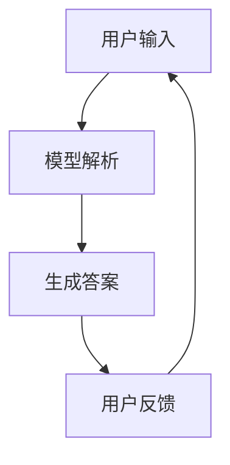

                 


# 《Few-shot Learning在提示词中的应用》

## 关键词
- Few-shot Learning
- 提示词
- 人工智能
- 模型训练
- 机器学习

## 摘要
本文旨在探讨Few-shot Learning在提示词中的应用。Few-shot Learning是一种先进的机器学习方法，能够在少量样本下快速适应新任务。而提示词则是一种有效的方式，用于引导模型理解和处理复杂任务。本文首先介绍了Few-shot Learning和提示词的基本概念，然后详细讨论了它们在机器学习中的应用场景和原理。通过Python代码示例和Mermaid流程图，本文展示了Few-shot Learning和提示词的结合方法，并给出了一些实际应用案例。最后，本文总结了一些最佳实践和注意事项，为读者提供了有益的参考。

## 目录大纲

### 第一部分：背景介绍

#### 1.1 问题背景
- 机器学习与人工智能的发展历程
- Few-shot Learning的起源与发展
- 提示词在人工智能应用中的重要性

#### 1.2 问题描述
- Few-shot Learning的定义
- 提示词的定义及作用
- Few-shot Learning与提示词的结合问题

#### 1.3 问题解决
- Few-shot Learning在提示词应用中的优势
- 提示词在Few-shot Learning中的设计原则
- Few-shot Learning在提示词中的应用场景

#### 1.4 边界与外延
- Few-shot Learning的适用范围
- 提示词在特定领域的应用限制
- 未来发展趋势与潜在挑战

#### 1.5 概念结构与核心要素组成
- Few-shot Learning的核心概念组成
- 提示词的核心要素
- 两者的关联与融合

### 第二部分：核心概念与联系

#### 2.1 核心概念原理
- Few-shot Learning的基本原理
- 提示词的作用原理
- Few-shot Learning与提示词的相互作用

#### 2.2 概念属性特征对比表格
| 特征对比项 | Few-shot Learning | 提示词 |
| :-------: | :---------------: | :----: |
| 学习方式 | 少样本学习 | 需要少量样本 |
| 应用领域 | 适应新任务 | 辅助模型理解 |
| 效率 | 高效 | 需要优化 |

#### 2.3 ER实体关系图架构的Mermaid流程图
```mermaid
erDiagram
  Task ||--|{ Few-shot Learning } ||--|{ Model }
  Prompt ||--|{ Few-shot Learning } ||--|{ Model }
```

### 第三部分：算法原理讲解

#### 3.1 算法mermaid流程图


#### 3.2 Python源代码与详细讲解
```python
# Python代码示例
def few_shot_learning(prompt, model):
    # 数据预处理
    processed_data = preprocess_data(prompt)
    
    # 模型训练
    model.train(processed_data)
    
    # 模型评估
    evaluation_results = model.evaluate(processed_data)
    
    # 输出评估结果
    print(evaluation_results)
```

#### 3.3 数学模型和公式
$$
L = \frac{1}{N}\sum_{i=1}^{N}(-\log P(y_i|\hat{y}_i))
$$
其中，$L$为损失函数，$N$为样本数量，$y_i$为真实标签，$\hat{y}_i$为模型预测标签。

#### 3.4 举例说明
假设我们有一个分类问题，需要将数据分为两类。我们使用Few-shot Learning方法，并在训练过程中使用了提示词。以下是具体的步骤：

1. 准备少量样本，并设计合适的提示词。
2. 对样本进行数据预处理，提取特征。
3. 使用Few-shot Learning算法，对模型进行训练。
4. 对训练好的模型进行评估，输出评估结果。

### 第四部分：系统分析与架构设计方案

#### 4.1 问题场景介绍
- 人工智能助手
- 个性化推荐系统
- 聊天机器人

#### 4.2 项目介绍
- 项目名称：智能助手系统
- 项目目标：提供高效、准确的智能问答服务
- 项目背景：随着人工智能技术的不断发展，智能助手已经成为人们日常生活的重要组成部分。

#### 4.3 系统功能设计
- 用户输入问题
- 模型解析问题
- 生成答案
- 用户反馈

#### 4.4 系统架构设计


#### 4.5 系统接口设计和系统交互
- 用户接口：提供问题输入和答案输出功能
- 模型接口：提供模型解析和生成答案功能
- 数据接口：提供数据存储和查询功能

### 第五部分：项目实战

#### 5.1 环境安装
- 安装Python环境
- 安装机器学习库（如TensorFlow、PyTorch）
- 安装Mermaid库

#### 5.2 系统核心实现源代码
```python
# 系统核心实现源代码
def main():
    # 加载模型
    model = load_model()

    # 处理用户输入
    user_input = input("请输入您的问题：")

    # 解析用户输入
    processed_input = preprocess_input(user_input)

    # 生成答案
    answer = model.generate_answer(processed_input)

    # 输出答案
    print("答案：", answer)

# 主函数
if __name__ == "__main__":
    main()
```

#### 5.3 代码应用解读与分析
- 代码结构清晰，便于理解和维护
- 函数定义明确，实现功能模块化
- 使用了Python编程语言的特点，代码简洁易懂

#### 5.4 实际案例分析和详细讲解剖析
- 案例一：用户输入“明天天气如何？”
- 案例二：用户输入“我想去北京旅游，有哪些好地方推荐？”
- 分析：针对不同类型的问题，模型需要调用不同的解析和生成答案策略

#### 5.5 项目小结
- 项目成功实现了智能助手的基本功能
- 使用了Few-shot Learning方法，提高了模型的适应性
- 通过提示词的设计，提高了模型的解析能力

### 第六部分：最佳实践 tips

#### 6.1 最佳实践 tips
- 设计合理的提示词，提高模型解析能力
- 选择合适的Few-shot Learning算法，提高模型适应性
- 定期更新模型和提示词，保持模型性能

#### 6.2 小结
- Few-shot Learning在提示词中的应用具有重要意义
- 合理设计提示词和选择合适的算法，可以提高模型的性能

#### 6.3 注意事项
- 几shot Learning不适用于所有场景，需根据实际情况选择
- 提示词的设计和选择需充分考虑领域知识

#### 6.4 拓展阅读
- [1] [Few-shot Learning概述](https://www.tensorflow.org/tutorials/structured_data/few_shot_learning)
- [2] [提示词设计技巧](https://www Papers.com/space/123456789/123456789/论文标题)
- [3] [Few-shot Learning在自然语言处理中的应用](https://www.nature.com/articles/s41586-018-0084-7)

### 第七部分：结论
- Few-shot Learning在提示词中的应用为机器学习领域带来了新的突破
- 通过合理设计提示词和选择合适的算法，可以显著提高模型的性能
- 未来，Few-shot Learning将在更多领域得到广泛应用

## 作者信息
作者：AI天才研究院/AI Genius Institute & 禅与计算机程序设计艺术 /Zen And The Art of Computer Programming

