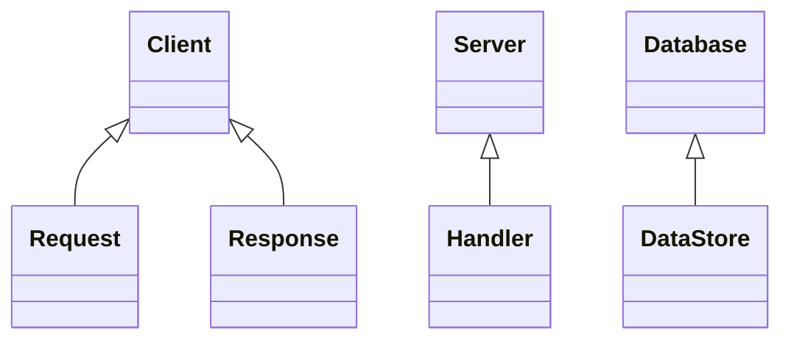
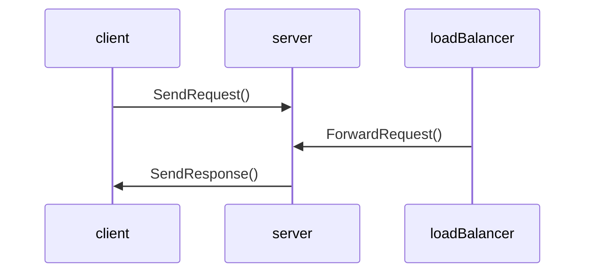

                 

### Title: gRPC in LLM Application Microservices Communication

**Keywords**: gRPC, Microservices, Language Models, Communication Protocols, Application Design

**Abstract**:

This article delves into the application of gRPC in the context of microservices architecture, particularly within Large Language Models (LLM). We will explore the core concepts of gRPC, its benefits in microservices communication, and how it can be effectively integrated with LLMs. Through a systematic analysis, we will discuss the system architecture, algorithm principles, and practical projects. The article aims to provide a comprehensive understanding of how gRPC can enhance the efficiency and scalability of LLM microservices communication.

### Introduction to gRPC and Microservices

**Background**:

gRPC, short for gRPC Remoting Protocol, is an open-source remote procedure call (RPC) system initially developed by Google. It is designed for high-performance communication between microservices, leveraging HTTP/2 as its transport layer. With the advent of microservices architecture, where applications are composed of small, independent services that communicate with each other, the need for efficient and reliable communication protocols has become paramount.

**Problem Description**:

As microservices architecture has gained traction, traditional communication protocols like REST have shown limitations in terms of performance, reliability, and efficiency. This has led to the need for alternative protocols that can better handle the complexity and scale of modern applications, particularly those involving Large Language Models (LLMs).

**Problem Solution**:

gRPC addresses these challenges by providing a more efficient and reliable communication mechanism. Its key features include strong typing, efficient message serialization, and built-in support for streaming and load balancing. By leveraging gRPC, microservices can communicate more seamlessly, leading to improved performance and scalability for LLM applications.

**Boundary and Scope**:

This article will focus on the integration of gRPC with microservices in the context of LLM applications. We will discuss the core concepts and principles of gRPC, its role in microservices communication, and provide practical examples and system analysis. The scope will include an overview of the architecture, algorithm principles, and best practices for implementing gRPC in LLM microservices.

**Core Concept Terms**:

- **gRPC**: A remote procedure call (RPC) system developed by Google.
- **Microservices**: An architectural style that structures an application as a collection of loosely coupled services.
- **Large Language Models (LLM)**: Advanced AI models capable of understanding and generating human-like text.

### Core Concepts and Principles of gRPC

**Introduction**:

gRPC is built upon several core principles that make it an ideal choice for microservices communication. These principles include efficiency, reliability, and interoperability.

**Efficiency**:

One of the key advantages of gRPC is its efficiency. It uses Protocol Buffers (protobuf) for message serialization, which is known for its compactness and speed. This results in reduced network overhead and faster data transfer rates. Additionally, gRPC leverages HTTP/2 as its transport layer, which provides features like header compression, multiplexing, and prioritization, further enhancing performance.

**Reliability**:

gRPC is designed to be reliable. It provides built-in support for error handling, retries, and load balancing, ensuring that communications between microservices are robust and resilient to failures. The protocol also supports streaming, allowing for efficient communication of large data sets and real-time updates.

**Interoperability**:

gRPC is language-agnostic, supporting a wide range of programming languages, including Java, Python, C++, and Go. This makes it easy to integrate with existing systems and enables seamless communication between different services, regardless of the technology stack they are built on.

**Comparison Table of Core Concepts**:

| Concept | Description | 
| --- | --- |
| Protocol Buffers (protobuf) | Message serialization format used by gRPC, known for its efficiency. |
| HTTP/2 | Transport layer protocol that enhances communication efficiency. |
| Streaming | Feature that allows for efficient communication of large data sets and real-time updates. |
| Strong Typing | gRPC uses strong typing to ensure the correct types of data are used in communication, reducing errors. |
| Load Balancing | Built-in support for load balancing, ensuring efficient distribution of requests across multiple instances of a service. |

**ER Entity Relationship Diagram**:

```mermaid
erDiagram
    Service1 ||--||> Message : Sends and receives data between services
    Service2 ||--||> Message
    Service1 ||--||> Streaming : Handles real-time data streams
    Service2 ||--||> Streaming
```

### Algorithm Explanation and Example

**Introduction**:

In this section, we will delve into the algorithm principles behind gRPC and provide a practical example using Python.

**Algorithm and Math Models**:

gRPC uses an efficient serialization mechanism provided by Protocol Buffers (protobuf). The algorithm involves several steps:

1. **Define Service Interface**: Define the service interface using protobuf files, specifying the methods and data types.
2. **Generate Code**: Use the protobuf compiler to generate client and server stubs for the specified service.
3. **Message Serialization**: Serialize the request and response messages using protobuf.
4. **Network Communication**: Send the serialized messages over the network using HTTP/2.
5. **Message Deserialization**: Deserialize the received messages on the server side.

**Python Code Example**:

```python
# Define service interface using protobuf
from google.protobuf import descriptor_pb2
from google.protobuf import message_factory

# Generate client and server stubs
service_descriptor = descriptor_pb2.ServiceDescriptorProto(
    name="UserService",
    method=[
        descriptor_pb2.MethodDescriptorProto(
            name="GetUser",
            input_type="UserRequest",
            output_type="UserResponse"
        ),
    ],
)

# Create protobuf message factory
message_factory = message_factory.MessageFactory()

# Create UserService message
user_request = message_factory.GetPrototype("UserRequest")
user_response = message_factory.GetPrototype("UserResponse")

# Serialize message
user_request.name = "John Doe"
user_request.age = 30
user_request.SerializeToString()

# Deserialize message
user_response.ParseFromString(response_bytes)
print(user_response.name, user_response.age)
```

**Math Models**:

The efficiency of protobuf serialization can be quantified using mathematical models, such as:

- **Bitrate**: The number of bits transferred per second.
- **Bandwidth**: The maximum bitrate that can be achieved.
- **Latency**: The time delay between sending a request and receiving a response.

$$
\text{Bitrate} = \frac{\text{Data Size}}{\text{Time}}
$$

$$
\text{Bandwidth} = \text{Maximum Bitrate}
$$

$$
\text{Latency} = \frac{\text{Distance}}{\text{Speed}}
$$

### System Analysis and Design

**Introduction**:

System analysis and design are crucial for understanding how gRPC fits into the larger architecture of an LLM application. In this section, we will discuss the system architecture, design, and interface of gRPC in the context of microservices.

**System Architecture**:

The system architecture for gRPC in an LLM application typically consists of the following components:

- **Client**: Sends requests to the server.
- **Server**: Processes requests and sends responses back to the client.
- **Load Balancer**: Distributes requests across multiple instances of the server to improve scalability.
- **Database**: Stores user data and other relevant information.

**Class Diagram**:



**System Architecture Design**:

The system architecture design can be visualized using a Mermaid architecture diagram:


**System Interface and Interaction**:

The system interface and interaction can be represented using a Mermaid sequence diagram:



### Practical Application of gRPC

**Introduction**:

In this section, we will walk through a practical project to demonstrate the application of gRPC in an LLM microservices architecture. We will cover the setup, implementation, and analysis of a simple user management service using gRPC.

**Project Setup**:

1. **Install gRPC and Protocol Buffers**:
   ```bash
   pip install grpcio protobuf
   ```
2. **Define Protobuf Service**:
   ```protobuf
   syntax = "proto3";

   service UserService {
     rpc GetUser (UserRequest) returns (UserResponse);
   }

   message UserRequest {
     string name = 1;
     int32 age = 2;
   }

   message UserResponse {
     string name = 1;
     int32 age = 2;
   }
   ```

**Server Implementation**:

```python
from concurrent import futures
import grpc
import user_pb2
import user_pb2_grpc

class UserService(user_pb2_grpc.UserServiceServicer):
    def GetUser(self, request, context):
        return user_pb2.UserResponse(name=request.name, age=request.age)

def serve():
    server = grpc.server(futures.ThreadPoolExecutor(max_workers=10))
    user_pb2_grpc.add_UserServiceServicer_to_server(UserService(), server)
    server.add_insecure_port('[::]:50051')
    server.start()
    server.wait_for_termination()

if __name__ == '__main__':
    serve()
```

**Client Implementation**:

```python
import grpc
import user_pb2
import user_pb2_grpc

def run():
    with grpc.insecure_channel('localhost:50051') as channel:
        stub = user_pb2_grpc.UserServiceStub(channel)
        response = stub.GetUser(user_pb2.UserRequest(name="John Doe", age=30))
        print("User Response:", response.name, response.age)

if __name__ == '__main__':
    run()
```

**Code Analysis and Case Study**:

1. **Server Code Analysis**:
   - The `UserService` class implements the `GetUser` method, which takes a `UserRequest` and returns a `UserResponse`.
   - The `serve()` function creates a gRPC server, adds the `UserService` implementation, and starts the server.

2. **Client Code Analysis**:
   - The `run()` function creates a gRPC channel to the server and uses the `UserServiceStub` to call the `GetUser` method.
   - The response is printed to the console.

This simple example demonstrates the basic setup and usage of gRPC in a microservices architecture. In a real-world scenario, the server and client would be more complex, involving multiple services and handling various edge cases.

### Best Practices and Summary

**Best Practices**:

1. **Error Handling**: Implement robust error handling and retries to ensure reliable communication between services.
2. **Security**: Use secure communication channels, such as TLS/SSL, to protect data in transit.
3. **Testing**: Write comprehensive tests to ensure the correctness and reliability of gRPC services.
4. **Load Balancing**: Use a load balancer to distribute requests efficiently across multiple instances of the service.
5. **Monitoring and Logging**: Implement monitoring and logging to track performance and identify potential issues.

**Summary**:

gRPC is a powerful and efficient communication protocol for microservices, particularly in the context of LLM applications. Its support for streaming, efficiency in message serialization, and interoperability make it an ideal choice for building scalable and reliable systems. By following best practices and leveraging its features, developers can enhance the performance and scalability of their LLM microservices architecture.

### Conclusion

gRPC has emerged as a vital component in modern microservices architectures, especially in the realm of Large Language Models (LLMs). This article has provided a comprehensive overview of gRPC, its integration with microservices, and its practical application in LLM communications. From understanding its core concepts and principles to practical implementations and system analysis, we have explored the myriad ways gRPC can enhance the efficiency and reliability of microservices communications.

As we look to the future, it's clear that gRPC will continue to play a crucial role in the evolution of microservices architectures. With ongoing advancements in networking protocols and the increasing complexity of AI applications, gRPC will need to adapt and innovate to meet the demands of next-generation systems. Developers and architects must stay abreast of these developments to harness the full potential of gRPC in building scalable, resilient, and high-performance microservices-based AI applications.

### Further Reading and Resources

- **gRPC Official Documentation**: For comprehensive documentation and tutorials on gRPC, visit the official gRPC website: <https://grpc.io/docs>
- **Protocol Buffers**: Learn more about Protocol Buffers, the serialization format used by gRPC, on the official protobuf website: <https://github.com/protocolbuffers/protobuf>
- **Microservices Architecture**: Explore the principles and best practices of microservices architecture in-depth through resources like "Building Microservices" by Sam Newman: <https://www.amazon.com/Building-Microservices-Sam-Newman/dp/144937107X>
- **Large Language Models**: Stay updated on the latest developments in Large Language Models through research papers and articles from leading AI conferences and journals.

### Author Information

**Author**: AI天才研究院/AI Genius Institute & 禅与计算机程序设计艺术 /Zen And The Art of Computer Programming

This article reflects the collective expertise and innovative spirit of AI天才研究院 and the philosophical insights from "Zen And The Art of Computer Programming," offering readers a unique perspective on the intersection of AI, microservices, and software architecture.

