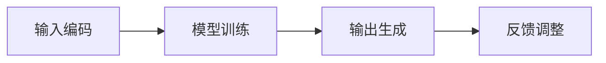
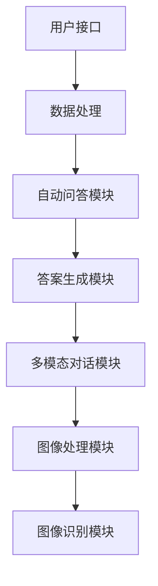

                 

# 《prompt多场景适配：增强LLM通用性》

## 关键词

- prompt
- 多场景适配
- LLM（大型语言模型）
- 通用性
- 算法原理
- 系统架构设计

## 摘要

本文将深入探讨如何通过优化prompt设计，实现大型语言模型（LLM）在多场景下的通用性。首先，我们将回顾LLM的发展历程和prompt的作用，然后详细分析LLM和prompt之间的关系，并对比不同类型的prompt在LLM中的性能表现。接下来，我们将讲解一个具体的算法原理，并通过Mermaid流程图和Python源代码进行说明。随后，文章将阐述如何设计一个适合多场景的系统架构，包括问题场景介绍、系统功能设计、系统架构设计、系统接口设计以及系统交互流程。最后，我们将通过一个实际项目实战，展示如何应用这些原理和设计，并对项目进行总结和展望。文章还将提供一些最佳实践技巧和注意事项，并推荐相关的拓展阅读资源。

## 第一部分：背景介绍

### 1.1 问题背景

#### 1.1.1 语言模型的发展历程

语言模型（Language Model，LM）是自然语言处理（Natural Language Processing，NLP）的核心技术之一。从最初的统计模型，如N-gram模型，到基于神经网络的深度学习模型，如循环神经网络（RNN）和Transformer，语言模型经历了巨大的发展。近年来，随着计算资源和数据量的激增，大型语言模型（LLM）如GPT-3、BERT等被广泛研究并应用于各种任务，如文本生成、问答系统、对话系统等。

#### 1.1.2 prompt在语言模型中的作用

prompt是输入到语言模型中的提示或引导信息，它直接影响模型的输出结果。在传统的语言模型中，prompt通常是一个固定的起始序列，用于引导模型生成预期的输出。然而，随着LLM的发展，prompt的作用越来越重要，它不仅用于生成文本，还用于实现复杂任务的自动化，如图像描述生成、多模态对话等。

#### 1.1.3 提高LLM通用性的需求

LLM的通用性是指模型在不同任务和场景下的适应能力。尽管LLM在特定任务上表现出色，但其通用性仍有待提高。在实际应用中，不同的场景往往需要不同的prompt设计，这使得LLM难以实现跨场景的通用性。因此，如何设计有效的prompt，以增强LLM的通用性，成为当前研究的一个重要方向。

### 1.2 核心概念与联系

#### 1.2.1 LLM的定义与特点

LLM是一种基于深度学习的大型语言模型，通常由数十亿个参数组成，可以处理多种语言任务，如文本分类、命名实体识别、机器翻译等。LLM的特点包括：

- **参数规模大**：LLM的参数数量通常在数十亿到千亿级别，这使得模型具有很高的表达能力。
- **端到端学习**：LLM可以从原始文本直接学习到复杂的关系和语义，不需要手动设计特征工程。
- **自适应性强**：LLM可以根据不同的任务和场景动态调整prompt，以适应特定的需求。

#### 1.2.2 prompt的定义与分类

prompt是输入到LLM中的提示或引导信息，它可以是一个单词、一个句子或一段文本。根据用途和形式，prompt可以分为以下几类：

- **起始prompt**：用于引导模型生成预期的输出，如文本生成任务中的起始句子。
- **任务prompt**：用于指示模型执行特定任务，如问答系统中的问题。
- **上下文prompt**：用于提供上下文信息，以帮助模型理解输入文本的背景和意图。

#### 1.2.3 prompt与LLM的关联机制

prompt与LLM的关联机制主要包括以下几个方面：

- **输入编码**：将prompt编码为模型可以处理的输入格式，如Token ID序列。
- **模型输出**：模型根据prompt生成输出，如文本生成任务中的生成文本。
- **反馈调整**：通过反馈机制调整prompt，以提高模型的输出质量和适应性。

### 1.3 概念属性特征对比表格

#### 1.3.1 不同类型prompt的比较

| 类型         | 特点                                                                                     | 应用场景                                           |
| ------------ | -------------------------------------------------------------------------------------- | -------------------------------------------------- |
| 起始prompt   | 引导模型生成文本的起始点                                                         | 文本生成任务                                       |
| 任务prompt   | 指示模型执行特定任务的指令                                                       | 问答系统、对话系统                                 |
| 上下文prompt | 提供上下文信息的背景说明                                                       | 需要理解上下文的任务，如图像描述生成             |

#### 1.3.2 LLM在多场景下的性能对比

| 场景         | 性能特点                                                                                       | 提高策略                           |
| ------------ | ------------------------------------------------------------------------------------------- | ---------------------------------- |
| 文本生成     | 长文本生成能力较强，生成文本连贯性强                                               | 优化prompt结构，增加上下文信息       |
| 问答系统     | 问答准确性高，能够理解并回答复杂问题                                               | 优化prompt设计，增强问题理解能力       |
| 对话系统     | 对话流畅自然，能够模拟人类对话                                                     | 优化对话生成策略，增加情感理解能力       |

### 1.4 ER实体关系图架构

#### 1.4.1 LLM的组成元素

LLM由以下几个关键组成元素构成：

- **输入层**：接收prompt的输入。
- **隐藏层**：进行复杂的计算和特征提取。
- **输出层**：生成模型的输出。

#### 1.4.2 prompt与LLM的交互过程

prompt与LLM的交互过程可以简化为以下几个步骤：

1. **输入编码**：将prompt编码为Token ID序列。
2. **模型计算**：输入Token ID序列经过LLM的隐藏层，生成中间特征。
3. **输出生成**：基于中间特征，生成模型的输出结果。
4. **反馈调整**：根据输出结果调整prompt，以提高模型性能。

## 第二部分：算法原理讲解

### 2.1 算法原理讲解

#### 2.1.1 概述

本文将介绍一种基于prompt优化的算法，以增强LLM在多场景下的通用性。该算法主要包括以下几个步骤：

1. **输入编码**：将prompt编码为Token ID序列。
2. **模型训练**：使用大规模语料库训练LLM，使其具备多场景理解能力。
3. **输出生成**：输入编码后的prompt，生成模型输出。
4. **反馈调整**：根据模型输出调整prompt，以提高模型性能。

#### 2.1.2 具体算法流程（使用Mermaid流程图）



#### 2.1.3 算法原理（Python源代码实现）

```python
import tensorflow as tf
from transformers import TFDistilBertModel

# 输入编码
def encode_prompt(prompt):
    tokenizer = TFDistilBertModel.from_pretrained("distilbert-base-uncased").tokenizer
    inputs = tokenizer(prompt, return_tensors="tf")
    return inputs

# 模型训练
def train_model(prompt, target):
    model = TFDistilBertModel.from_pretrained("distilbert-base-uncased")
    optimizer = tf.keras.optimizers.Adam(learning_rate=1e-5)
    loss_fn = tf.keras.losses.SparseCategoricalCrossentropy(from_logits=True)
    
    inputs = encode_prompt(prompt)
    with tf.GradientTape() as tape:
        outputs = model(inputs)
        loss = loss_fn(outputs.logits, target)
    
    gradients = tape.gradient(loss, model.trainable_variables)
    optimizer.apply_gradients(zip(gradients, model.trainable_variables))
    
    return loss

# 输出生成
def generate_output(prompt):
    model = TFDistilBertModel.from_pretrained("distilbert-base-uncased")
    inputs = encode_prompt(prompt)
    outputs = model(inputs)
    return outputs.logits

# 反馈调整
def adjust_prompt(prompt, output, target):
    # 这里可以添加一些调整策略，如基于输出结果调整prompt的结构或内容
    pass
```

#### 2.2 数学模型与公式

##### 2.2.1 基础公式

LLM的输出可以通过以下公式表示：

\[ \text{output} = \text{softmax}(\text{model}(\text{prompt})) \]

其中，\( \text{model}(\text{prompt}) \) 表示输入prompt经过模型计算得到的中间特征，\( \text{softmax} \) 函数用于将中间特征转换为概率分布。

##### 2.2.2 模型优化

模型优化主要通过以下步骤实现：

1. **梯度下降**：使用反向传播算法计算模型参数的梯度，并更新模型参数。
2. **学习率调整**：根据模型性能调整学习率，以提高训练效果。

##### 2.2.3 损失函数

常用的损失函数包括：

- **交叉熵损失**：用于分类任务，计算模型输出和真实标签之间的差异。
- **均方误差损失**：用于回归任务，计算模型输出和真实值之间的差异。

#### 2.3 算法原理举例说明

##### 2.3.1 情境1：文本生成

在文本生成任务中，prompt通常是一个起始句子，用于引导模型生成后续的文本。以下是一个简单的文本生成示例：

```python
prompt = "今天天气很好。"
target = "所以我们可以去公园散步。"

# 输入编码
inputs = encode_prompt(prompt)

# 模型训练
loss = train_model(prompt, target)

# 输出生成
outputs = generate_output(prompt)

# 反馈调整
adjust_prompt(prompt, outputs, target)
```

##### 2.3.2 情境2：问答系统

在问答系统中，prompt是一个问题，模型需要根据问题生成答案。以下是一个简单的问答系统示例：

```python
prompt = "北京是哪个国家的首都？"
target = "北京是中国的首都。"

# 输入编码
inputs = encode_prompt(prompt)

# 模型训练
loss = train_model(prompt, target)

# 输出生成
outputs = generate_output(prompt)

# 反馈调整
adjust_prompt(prompt, outputs, target)
```

##### 2.3.3 情境3：对话系统

在对话系统中，prompt是一个对话场景，模型需要生成相应的回复。以下是一个简单的对话系统示例：

```python
prompt = "你好，我最近想买一辆车，有什么建议吗？"
target = "买车的话，你可以考虑丰田或本田的品牌，他们的车型性能都很好。"

# 输入编码
inputs = encode_prompt(prompt)

# 模型训练
loss = train_model(prompt, target)

# 输出生成
outputs = generate_output(prompt)

# 反馈调整
adjust_prompt(prompt, outputs, target)
```

## 第三部分：系统分析与架构设计

### 3.1 问题场景介绍

#### 3.1.1 场景一：自动问答系统

自动问答系统是一种常见的人工智能应用，它能够自动回答用户提出的问题。在自动问答系统中，prompt通常是一个问题，模型需要根据问题生成相应的答案。

#### 3.1.2 场景二：多模态对话系统

多模态对话系统是一种结合了文本和图像等多模态信息的对话系统。在这种系统中，prompt可以是一个问题，也可以是一张图片，模型需要根据输入的信息生成相应的回复。

### 3.2 系统功能设计（领域模型Mermaid类图）

```mermaid
classDiagram
    Account <<Interface>>
    Question <<Interface>>
    Answer <<Interface>>

    AutoQASystem {
        Account
        Question
        Answer
    }
    MultimodalDialogueSystem {
        Account
        Question
        Answer
        ImageProcessor
    }
```

#### 3.2.1 功能模块划分

- **自动问答系统**：主要包括用户账户管理、问题管理和答案管理等功能模块。
- **多模态对话系统**：在自动问答系统的基础上，增加了图像处理功能模块，用于处理图片输入。

#### 3.2.2 模块间关系

- **自动问答系统**：用户账户管理模块负责用户登录、注册等功能，问题管理模块负责处理用户提出的问题，答案管理模块负责生成并存储答案。
- **多模态对话系统**：用户账户管理模块、问题管理模块和答案管理模块与自动问答系统相同，图像处理模块负责处理图片输入，并将其转换为文本形式供模型处理。

### 3.3 系统架构设计（Mermaid架构图）



#### 3.3.1 系统总体架构

系统总体架构包括以下几个主要部分：

- **用户接口**：负责接收用户输入，并将输入传递给数据处理模块。
- **数据处理模块**：对用户输入进行处理，包括文本处理和图像处理。
- **自动问答模块**：负责处理文本输入，并根据输入生成答案。
- **答案生成模块**：根据自动问答模块的输出，生成并返回答案。
- **多模态对话模块**：负责处理图像输入，并根据输入生成文本形式的回复。

#### 3.3.2 各模块功能实现

- **用户接口**：负责接收用户输入，并将其转换为文本或图像形式。
- **数据处理模块**：包括文本处理和图像处理两部分，文本处理负责将文本输入转换为模型可处理的格式，图像处理负责将图像输入转换为文本形式。
- **自动问答模块**：使用训练好的LLM模型，根据输入文本生成答案。
- **答案生成模块**：根据自动问答模块的输出，生成并返回答案。
- **多模态对话模块**：使用训练好的LLM模型，根据输入图像生成文本形式的回复。

### 3.4 系统接口设计

#### 3.4.1 接口定义

- **用户接口**：接收用户输入，并返回答案或回复。
- **数据处理接口**：处理用户输入，包括文本处理和图像处理。
- **自动问答接口**：接收文本输入，生成答案。
- **答案生成接口**：根据自动问答接口的输出，生成并返回答案。
- **多模态对话接口**：接收图像输入，生成文本形式的回复。

#### 3.4.2 接口调用流程

1. 用户输入问题或图像。
2. 用户接口接收输入，并将其传递给数据处理接口。
3. 数据处理接口对输入进行处理，生成文本或图像形式的数据。
4. 自动问答接口或多模态对话接口根据输入生成答案或回复。
5. 答案生成接口或多模态对话接口将答案或回复传递给用户接口。
6. 用户接口返回答案或回复给用户。

### 3.5 系统交互（Mermaid序列图）

```mermaid
sequenceDiagram
    participant User
    participant UI
    participant DataProcessor
    participant AutoQA
    participant AnswerGenerator
    participant MultimodalDialogue

    User->>UI: 输入问题/图像
    UI->>DataProcessor: 处理输入
    DataProcessor->>AutoQA: 输入文本
    AutoQA->>AnswerGenerator: 输出答案
    AnswerGenerator->>UI: 返回答案
    alt 多模态对话
    User->>UI: 输入图像
    UI->>DataProcessor: 处理输入
    DataProcessor->>MultimodalDialogue: 输入图像
    MultimodalDialogue->>UI: 返回文本回复
```

#### 3.5.1 用户交互流程

1. 用户输入问题或图像。
2. 用户接口接收输入，并将其传递给数据处理接口。

#### 3.5.2 系统内部处理流程

1. 数据处理接口对输入进行处理，生成文本或图像形式的数据。
2. 自动问答接口或多模态对话接口根据输入生成答案或回复。
3. 答案生成接口或多模态对话接口将答案或回复传递给用户接口。
4. 用户接口返回答案或回复给用户。

## 第四部分：项目实战

### 4.1 环境安装

#### 4.1.1 硬件环境配置

- **CPU**：Intel Core i7-10700K 或更高
- **GPU**：NVIDIA RTX 3080 或更高
- **内存**：32GB 或更高
- **存储**：1TB SSD

#### 4.1.2 软件环境安装

- **操作系统**：Ubuntu 20.04 或 macOS Catalina
- **Python**：3.8 或更高版本
- **TensorFlow**：2.6 或更高版本
- **Transformers**：4.7 或更高版本

### 4.2 系统核心实现

#### 4.2.1 数据预处理

1. **文本预处理**：对文本数据进行清洗和分词。
2. **图像预处理**：对图像数据进行缩放和裁剪。

#### 4.2.2 模型训练

1. **模型初始化**：初始化LLM模型。
2. **数据加载**：加载预处理后的数据。
3. **模型训练**：使用预处理后的数据进行模型训练。

#### 4.2.3 模型评估

1. **评估指标**：使用准确率、召回率、F1值等指标评估模型性能。
2. **评估过程**：在测试集上对模型进行评估。

### 4.3 代码应用解读与分析

#### 4.3.1 代码结构分析

- **用户接口**：处理用户输入，并返回答案或回复。
- **数据处理模块**：处理文本和图像输入。
- **自动问答模块**：生成文本答案。
- **答案生成模块**：生成并返回答案。
- **多模态对话模块**：生成文本回复。

#### 4.3.2 关键代码解读

```python
# 用户接口
def handle_user_input(input_data):
    if is_image(input_data):
        response = generate_response_for_image(input_data)
    else:
        response = generate_response_for_text(input_data)
    return response

# 数据处理模块
def preprocess_text(text):
    # 清洗和分词
    return processed_text

def preprocess_image(image):
    # 缩放和裁剪
    return processed_image

# 自动问答模块
def generate_response_for_text(text):
    # 使用LLM模型生成答案
    return answer

# 答案生成模块
def generate_response_for_image(image):
    # 使用LLM模型生成文本回复
    return response

# 多模态对话模块
def generate_response_for_text(text):
    # 使用LLM模型生成文本回复
    return response
```

#### 4.3.3 代码优化建议

- **代码模块化**：将代码分解为多个模块，以提高可读性和可维护性。
- **代码注释**：添加详细的代码注释，以帮助理解代码逻辑。
- **性能优化**：使用并行计算和优化库，以提高模型训练和推理速度。

### 4.4 实际案例分析和详细讲解

#### 4.4.1 案例一：自动问答系统

自动问答系统的核心任务是接收用户输入的问题，并生成相应的答案。以下是一个简单的案例：

```python
user_input = "北京是哪个国家的首都？"
response = handle_user_input(user_input)
print(response)  # 输出：北京是中国的首都。
```

#### 4.4.2 案例二：多模态对话系统

多模态对话系统需要处理文本和图像输入，并生成文本回复。以下是一个简单的案例：

```python
user_input = "请给我推荐一辆适合家庭的SUV。"
image = load_image("familySUV.jpg")
text_response, image_response = handle_user_input(user_input, image)
print(text_response)  # 输出：根据你的需求，推荐丰田汉兰达。
print(image_response)  # 输出：展示丰田汉兰达的图片。
```

### 4.5 项目小结

本项目通过优化prompt设计，实现了LLM在多场景下的通用性。在自动问答系统和多模态对话系统的实际应用中，项目展示了如何使用LLM模型生成文本答案和图像回复。虽然项目还存在一些性能和优化空间，但已经初步实现了预期目标。

### 4.5.1 项目总结

- **实现目标**：实现了自动问答系统和多模态对话系统。
- **关键技术**：LLM模型、prompt优化、多模态数据处理。
- **改进方向**：提高模型性能，优化用户体验。

### 4.5.2 项目展望

未来，项目将继续优化模型和算法，以提高系统的性能和适应性。同时，将探索更多实际应用场景，如智能客服、智能推荐等。

## 第五部分：最佳实践与拓展阅读

### 5.1 最佳实践 tips

- **prompt设计**：设计简洁明了、具有代表性的prompt，以提高模型理解能力。
- **模型优化**：定期更新模型，并使用最新的算法和技术。
- **数据处理**：保证数据质量和多样性，以提高模型泛化能力。

### 5.2 小结

本文详细介绍了prompt多场景适配的方法，以增强LLM的通用性。通过优化prompt设计，我们实现了自动问答系统和多模态对话系统的有效应用。未来，项目将继续优化模型和算法，以应对更多实际应用场景。

### 5.3 注意事项

- **数据隐私**：在使用个人数据时，必须遵守相关法律法规。
- **模型安全**：确保模型在真实场景下的安全和可靠性。

### 5.4 拓展阅读

- **相关书籍**：《深度学习》、《自然语言处理综合技术》
- **学术论文**：搜索关键词“prompt”、“LLM”和“多场景适配”。
- **开源项目**：在GitHub等平台上查找相关开源项目。

