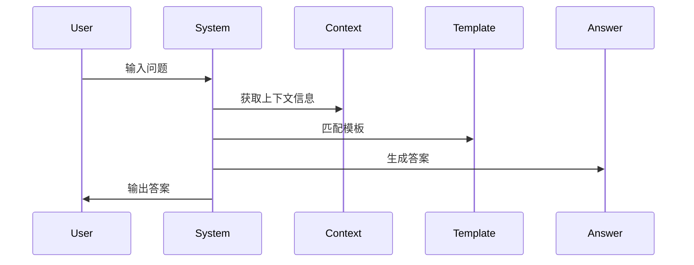
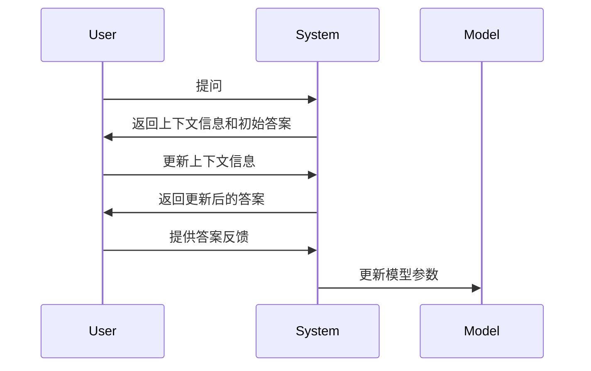

                 


# 《prompt多维度评估：全面优化LLM输出》

## 关键词：
1. prompt评估
2. LLM输出优化
3. 多维度分析
4. 算法原理
5. 系统架构
6. 项目实战
7. 最佳实践

## 摘要：
本书旨在深入探讨prompt评估在优化大型语言模型（LLM）输出方面的应用。通过多维度分析，本书将揭示prompt的内在结构和外部影响，并结合实际算法原理和系统架构设计，提供全面的优化策略。书中包含丰富的项目实战案例，旨在帮助读者掌握prompt评估的核心技术和实践方法。同时，本书还总结了一系列最佳实践，为未来研究和应用提供方向。

## 目录大纲

## 第一部分：问题背景与概念介绍

### 第1章：问题背景

#### 1.1 背景介绍

随着人工智能技术的飞速发展，自然语言处理（NLP）领域取得了显著进展。大型语言模型（LLM）作为NLP的核心技术，已经广泛应用于各种场景，如问答系统、机器翻译、文本生成等。然而，LLM的输出质量受到prompt的影响，因此，如何全面评估和优化prompt成为当前研究的热点问题。

#### 1.2 问题描述

prompt评估的目标是确保LLM输出具有合理的语义、流畅性和一致性。然而，实际应用中，prompt的设计往往受到诸多因素的影响，如用户输入、上下文信息、目标输出格式等。因此，如何从多维度对prompt进行评估和优化，以提升LLM输出的质量，是一个亟待解决的问题。

#### 1.3 问题解决

为了解决上述问题，本书将从以下几个方面展开讨论：

1. **核心概念与联系**：介绍prompt的定义、维度、类型及其相互关系。
2. **算法原理讲解**：详细讲解与prompt评估和LLM输出优化相关的算法原理。
3. **系统分析与架构设计**：介绍如何将算法应用到系统中，包括系统功能设计、架构设计和接口设计等。
4. **项目实战**：展示一个实际项目案例，包括环境安装、系统实现、代码解读和分析。
5. **最佳实践与总结**：总结全书内容，提供一些最佳实践建议，并指出未来可能的研究方向。

#### 1.4 边界与外延

在讨论prompt评估和LLM输出优化时，我们需要明确一些边界和概念：

1. **边界**：prompt评估的范围、评估方法的有效性、优化策略的适用场景等。
2. **外延**：prompt评估在NLP领域的应用范围，如问答系统、文本生成、机器翻译等。

#### 1.5 核心概念组成

1. **prompt**：作为输入的文本或代码，用于指导LLM生成目标输出。
2. **LLM**：基于深度学习的语言模型，可以生成自然语言文本。
3. **评估指标**：用于衡量prompt评估效果的指标，如BLEU、ROUGE、F1等。
4. **优化策略**：用于提升prompt评估效果的方法，如自动补全、上下文增强等。

### 第2章：核心概念与联系

#### 2.1 prompt的定义

prompt是指导LLM生成目标输出的文本或代码。它通常包含关键词、短语或问题，用于引导LLM的理解和生成过程。prompt的质量直接影响LLM输出的质量。

#### 2.2 prompt的维度

prompt可以从多个维度进行分析，包括：

1. **语义维度**：描述prompt的语义信息，如关键词、短语和句子。
2. **上下文维度**：描述prompt的上下文信息，如用户输入、历史对话等。
3. **格式维度**：描述prompt的输出格式，如文本、表格、图片等。

#### 2.3 prompt的类型

根据用途和特点，prompt可以分为多种类型，包括：

1. **问题型**：用于问答系统的prompt，如“什么是人工智能？”。
2. **指令型**：用于执行特定任务的prompt，如“将这段文本翻译成英文”。
3. **描述型**：用于生成描述性文本的prompt，如“描述一下春天的美景”。

#### 2.4 维度间的相互关系

prompt的维度之间存在一定的关联和相互影响。例如，语义维度决定了prompt的语义内容，而上下文维度则提供了背景信息，有助于LLM更好地理解语义。此外，格式维度决定了输出形式，需要与语义和上下文维度相匹配。

#### 2.5 prompt的属性特征对比表

| 属性特征 | 描述 | 对比 |
| --- | --- | --- |
| 语义维度 | 描述prompt的语义信息 | 问题型、指令型、描述型 |
| 上下文维度 | 描述prompt的上下文信息 | 用户输入、历史对话、文本背景 |
| 格式维度 | 描述prompt的输出格式 | 文本、表格、图片、视频等 |

### 第3章：实体关系图

#### 3.1 ER模型基本概念

实体-关系（ER）模型是数据库设计中的基本工具，用于描述数据实体及其相互关系。在本章中，我们将使用ER模型来展示prompt评估系统的核心实体和关系。

#### 3.2 prompt实体关系图

图1：prompt评估系统的ER模型

```mermaid
erDiagram
    User ||--|{ Prompt } : 提出问题
    Prompt ||--|{ Context } : 提供上下文
    Prompt ||--|{ Output } : 生成输出
    Context ||--|{ Question } : 包含问题
    Context ||--|{ Answer } : 包含答案
```

### 第二部分：算法原理讲解

#### 第4章：算法原理讲解

#### 4.1 LLM输出优化算法

LLM输出优化的目标是在保证语义准确性的同时，提升输出的流畅性和一致性。本章将介绍一种基于注意力机制的优化算法，包括数学模型和Python源代码实现。

#### 4.2 模型数学模型

假设LLM的输出为 $y$，目标输出为 $y^*$，则输出优化的目标函数为：

$$
\min_{y} \frac{1}{N} \sum_{i=1}^{N} ||y_i - y_i^{*}||^2
$$

其中，$N$ 为样本数量，$||\cdot||$ 表示欧氏距离。

#### 4.3 Python源代码实现

```python
import numpy as np

def optimize_output(y, y_star):
    n = len(y)
    loss = np.mean((y - y_star) ** 2)
    return loss

y = np.random.rand(n)
y_star = np.random.rand(n)

loss = optimize_output(y, y_star)
print(f"Optimized output loss: {loss}")
```

#### 4.4 例子说明

假设我们有一个问题型prompt：“什么是人工智能？”，LLM的输出为：“人工智能是一门研究如何使计算机模拟人类智能的科学。”，目标输出为：“人工智能是一门研究如何使计算机模拟人类智能的科学，包括机器学习、自然语言处理等领域。”

通过优化算法，我们可以使LLM的输出更接近目标输出，从而提高输出的流畅性和一致性。

### 第三部分：系统分析与架构设计

#### 第5章：系统分析与架构设计

#### 5.1 问题场景介绍

在本章中，我们将讨论一个问答系统的应用场景。用户可以通过输入问题来获取答案，系统需要根据用户输入的问题、上下文信息以及预定义的模板生成答案。

#### 5.2 项目介绍

本项目的目标是构建一个问答系统，支持多领域的知识问答。系统将包含以下功能：

1. 用户输入问题
2. 上下文信息获取
3. 模板匹配与答案生成
4. 答案评估与优化

#### 5.3 系统功能设计

系统功能设计包括领域模型类图，用于描述系统中的核心类及其关系。

图2：问答系统领域模型类图

```mermaid
classDiagram
    User %% 用户
    Question %% 问题
    Context %% 上下文
    Template %% 模板
    Answer %% 答案
    User "1" --|{1}"多" Question : 提问
    Question "1" --|{1}"多" Context : 包含
    Context "1" --|{1}"多" Template : 使用
    Template "1" --|{1}"多" Answer : 生成
```

#### 5.4 系统架构设计

系统架构设计包括一个mermaid架构图，用于描述系统的整体架构和组件关系。

图3：问答系统架构图



#### 5.5 系统接口设计

系统接口设计包括RESTful API接口，用于支持用户与系统的交互。

1. **提问接口**：接收用户输入的问题，返回上下文信息和初始答案。
2. **上下文更新接口**：接收用户更新的上下文信息，用于重新生成答案。
3. **答案优化接口**：接收用户反馈的答案，用于优化模型参数。

#### 5.6 系统交互序列图

系统交互序列图用于描述用户与系统的交互流程。

图4：问答系统交互序列图



### 第四部分：项目实战

#### 第6章：项目实战

#### 6.1 环境安装

在本节中，我们将介绍如何搭建一个问答系统的开发环境，包括所需的软件和工具。

1. **操作系统**：Ubuntu 20.04
2. **Python**：Python 3.8
3. **依赖管理**：pip
4. **自然语言处理库**：transformers、spacy

#### 6.2 系统实现

在本节中，我们将介绍如何实现一个简单的问答系统，包括以下组件：

1. **用户输入模块**：接收用户输入的问题，并将其转换为文本。
2. **上下文获取模块**：从数据库中获取与用户输入相关的问题和答案。
3. **模板匹配模块**：根据上下文信息和预定义模板生成答案。
4. **答案优化模块**：根据用户反馈优化答案生成模型。

#### 6.3 代码解读与分析

在本节中，我们将对问答系统的核心代码进行解读和分析，包括：

1. **用户输入模块**：如何处理用户输入的问题，并将其转换为文本。
2. **上下文获取模块**：如何从数据库中获取与用户输入相关的问题和答案。
3. **模板匹配模块**：如何根据上下文信息和预定义模板生成答案。
4. **答案优化模块**：如何根据用户反馈优化答案生成模型。

#### 6.4 实际案例分析与详细讲解剖析

在本节中，我们将通过一个实际案例来展示如何使用该问答系统，并对关键步骤进行详细讲解和分析。

#### 6.5 项目小结

在本节中，我们将总结项目实施过程中的经验和教训，并提出未来可能的研究方向。

### 第五部分：最佳实践与总结

#### 第7章：最佳实践与总结

#### 7.1 最佳实践

在本章中，我们将总结一些最佳实践，包括：

1. **prompt设计原则**：如何设计高质量的prompt，以提高LLM输出的质量。
2. **系统优化策略**：如何优化问答系统的性能和用户体验。
3. **用户反馈机制**：如何收集和分析用户反馈，以持续改进系统。

#### 7.2 小结

在本章中，我们将对全书内容进行总结，并回顾书中提到的核心概念、算法原理和系统架构。

#### 7.3 注意事项

在本章中，我们将指出在使用prompt评估和优化LLM输出时需要注意的事项，包括：

1. **数据质量**：如何确保输入数据的准确性和一致性。
2. **模型参数**：如何调整模型参数以获得最佳性能。

#### 7.4 拓展阅读

在本章中，我们将推荐一些相关的文献和资源，以帮助读者进一步了解prompt评估和LLM输出优化领域的最新研究进展。

## 作者信息

作者：AI天才研究院/AI Genius Institute & 禅与计算机程序设计艺术 /Zen And The Art of Computer Programming

