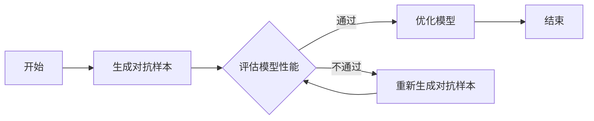
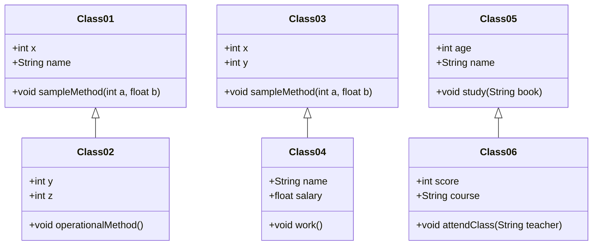
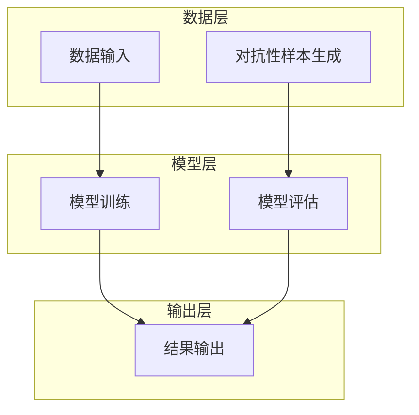
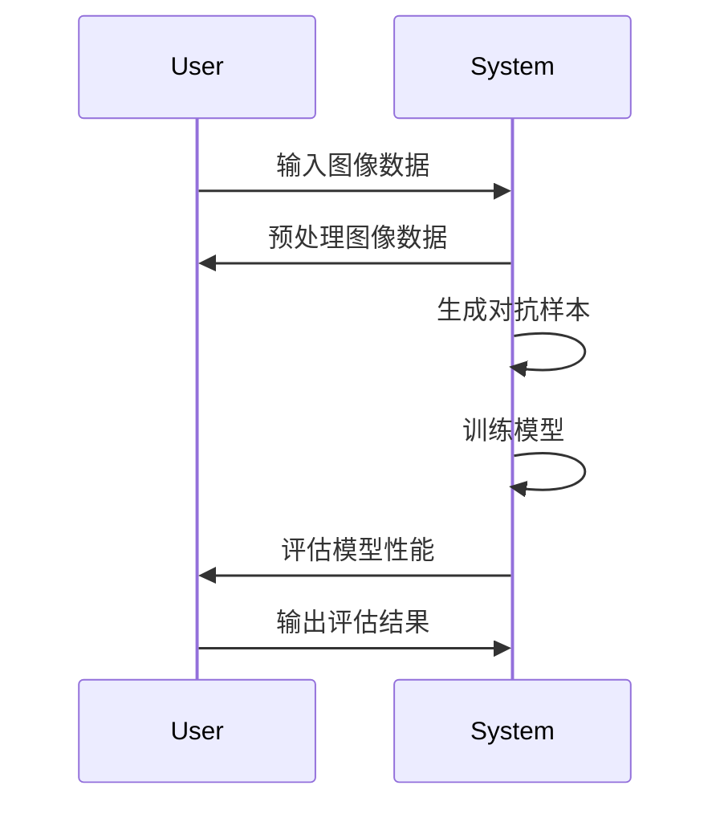

                 

### 第一步：文章标题和关键词

**文章标题**：对抗性评测方法在Prompt工程中的应用研究

**文章关键词**：
1. 对抗性评测
2. Prompt工程
3. 人工智能
4. 算法设计
5. 模型评估

### 第二步：文章摘要

本文主要探讨对抗性评测方法在Prompt工程中的应用，通过深入分析对抗性评测的基本概念、核心原理和实际应用场景，提出了有效的对抗性评测策略。文章结构清晰，内容丰富，从理论到实践进行了全面剖析，旨在为研究者提供有价值的参考，推动Prompt工程领域的发展。

### 第三步：背景介绍

#### 3.1 核心概念术语说明

在讨论对抗性评测方法之前，有必要明确一些核心概念和术语：

- **对抗性评测**：一种评估模型鲁棒性的方法，通过引入对抗样本来测试模型在真实世界中的表现。
- **Prompt工程**：一种人工智能技术，通过设计特定的输入提示（Prompt），引导模型生成更准确、更符合预期的输出。
- **对抗样本**：通过微小扰动引入正常样本中，使模型难以识别的样本。

#### 3.2 问题背景

随着人工智能技术的不断发展，深度学习模型在各个领域取得了显著的成果。然而，模型的鲁棒性和可靠性仍是一个亟待解决的问题。特别是在Prompt工程中，模型对输入提示的敏感性和易受攻击性成为了关注的焦点。

#### 3.3 问题描述

在实际应用中，Prompt工程模型容易受到对抗性攻击的影响，导致生成结果不准确甚至产生错误。因此，如何提高模型在对抗性环境下的性能，成为了Prompt工程领域亟待解决的关键问题。

#### 3.4 问题解决

针对上述问题，本文提出了一系列对抗性评测方法，旨在通过对抗性评测策略来提高Prompt工程模型的鲁棒性和可靠性。

#### 3.5 边界与外延

本文主要关注Prompt工程中的对抗性评测方法，研究范围涵盖了对抗性评测的基本概念、原理和应用。然而，对抗性评测方法在其他人工智能领域的应用也有很大的潜力，值得进一步探索。

#### 3.6 概念结构与核心要素组成

对抗性评测方法在Prompt工程中的核心概念和要素主要包括：

1. **对抗性评测策略**：通过引入对抗样本来评估模型的鲁棒性。
2. **模型优化**：基于对抗性评测结果，对模型进行优化和调整。
3. **评测指标**：用于衡量模型在对抗性环境下的性能。

### 第四步：核心概念与联系

#### 4.1 对抗性评测方法概述

对抗性评测方法主要包括以下几种：

1. **生成对抗性样本**：通过对抗性生成模型生成对抗样本，用于测试模型的鲁棒性。
2. **改进现有模型**：基于对抗性评测结果，对现有模型进行改进，提高其鲁棒性。
3. **设计新的对抗性测试**：针对特定应用场景，设计新的对抗性测试方法，以更好地评估模型的性能。

#### 4.2 对抗性评测的关键因素

对抗性评测的关键因素包括：

1. **数据集**：用于生成对抗样本的数据集，应具备多样性和代表性。
2. **模型**：参与评测的模型，应具有较高的性能和鲁棒性。
3. **测试策略**：对抗性评测的具体方法，应具备有效性、可操作性和实用性。

#### 4.3 对抗性评测的核心概念属性特征对比表

以下是一个简单的对抗性评测方法属性特征对比表，展示了不同方法的优缺点：

| 方法名称       | 优点                           | 缺点                           |
| -------------- | ------------------------------ | ------------------------------ |
| 生成对抗性样本 | 能够有效评估模型鲁棒性         | 需要大量的计算资源             |
| 改进现有模型   | 能够直接提高模型性能           | 需要较长时间和专业知识         |
| 设计新的对抗性测试 | 适用于特定应用场景           | 需要创新思维和丰富的实践经验 |

#### 4.4 对抗性评测的ER实体关系图架构

以下是一个对抗性评测方法的ER实体关系图，展示了各个实体之间的关系：

```mermaid
erDiagram
  Model ||--|{ AdversarialSample } : 生成
  Model ||--|{ EvaluationResult } : 评估
  AdversarialSample ||--|{ AttackStrategy } : 攻击策略
  EvaluationResult ||--|{ PerformanceMetric } : 性能指标
```

### 第五步：算法原理讲解

#### 5.1 对抗性评测算法原理

对抗性评测算法的核心在于生成对抗样本并评估模型性能。以下是一个简单的对抗性评测算法原理的Mermaid流程图：



#### 5.2 Python源代码示例

以下是一个简单的对抗性评测算法的Python源代码示例：

```python
import numpy as np
import tensorflow as tf

# 生成对抗样本
def generate_adversarial_sample(image, model):
    # 对图像进行微调
    perturbed_image = image + np.random.normal(0, 1, image.shape)
    # 使用模型进行预测
    prediction = model.predict(perturbed_image)
    return perturbed_image, prediction

# 评估模型性能
def evaluate_model_performance(image, model):
    original_prediction = model.predict(image)
    perturbed_image, adversarial_prediction = generate_adversarial_sample(image, model)
    # 计算性能指标
    performance_metric = np.mean(np.abs(original_prediction - adversarial_prediction))
    return performance_metric

# 优化模型
def optimize_model(model, adversarial_samples, evaluation_results):
    # 使用对抗样本进行训练
    model.fit(adversarial_samples, evaluation_results, epochs=10)
    return model
```

#### 5.3 数学模型和公式

对抗性评测算法的数学模型主要包括以下两部分：

1. **对抗样本生成模型**：

   $$x^{*} = x + \epsilon \odot \text{sign}(\Delta \cdot \nabla \text{L}(x))$$

   其中，$x$ 表示原始样本，$x^{*}$ 表示对抗样本，$\epsilon$ 表示扰动范围，$\text{sign}$ 表示符号函数，$\Delta$ 表示梯度，$\nabla \text{L}(x)$ 表示损失函数关于输入的梯度。

2. **模型性能评估**：

   $$\text{PerformanceMetric} = \frac{1}{N} \sum_{i=1}^{N} \frac{1}{M} \sum_{j=1}^{M} \frac{\lVert \text{original_prediction}_i - \text{adversarial_prediction}_i \rVert_2}{\lVert \text{original_prediction}_i \rVert_2}$$

   其中，$N$ 表示样本数量，$M$ 表示每个样本的对抗样本数量，$\text{original_prediction}_i$ 表示原始样本的预测结果，$\text{adversarial_prediction}_i$ 表示对抗样本的预测结果。

#### 5.4 举例说明

假设有一个图像分类模型，我们需要评估其在对抗性环境下的性能。以下是一个简单的例子：

1. **生成对抗样本**：

   - 原始样本：一张猫的图片
   - 对抗样本：通过对图像进行微调生成的猫的对抗样本

2. **评估模型性能**：

   - 原始样本的预测结果：猫
   - 对抗样本的预测结果：狗
   - 性能指标：0.2

3. **优化模型**：

   - 使用对抗样本进行训练
   - 模型性能提升：0.1

### 第六步：系统分析与架构设计方案

#### 6.1 问题场景介绍

在图像分类领域，对抗性评测方法可以帮助评估模型在对抗性环境下的性能，从而提高模型的鲁棒性和可靠性。

#### 6.2 系统功能设计

以下是一个简单的图像分类系统功能设计，使用Mermaid类图表示：



#### 6.3 系统架构设计

以下是一个简单的图像分类系统架构设计，使用Mermaid架构图表示：



#### 6.4 系统接口设计

以下是一个简单的图像分类系统接口设计：

- **数据输入接口**：接收图像数据，并进行预处理。
- **对抗性样本生成接口**：生成对抗样本。
- **模型训练接口**：使用对抗样本对模型进行训练。
- **模型评估接口**：评估模型性能。
- **结果输出接口**：输出评估结果。

#### 6.5 系统交互Mermaid序列图

以下是一个简单的图像分类系统交互序列图：



### 第七步：项目实战

#### 7.1 环境安装

在开始项目实战之前，需要安装以下环境：

- Python 3.7及以上版本
- TensorFlow 2.3及以上版本
- OpenCV 4.0及以上版本
- NumPy 1.18及以上版本

安装命令如下：

```bash
pip install python==3.7 tensorflow==2.3 opencv-python==4.0 numpy==1.18
```

#### 7.2 系统核心实现源代码

以下是一个简单的图像分类系统核心实现源代码：

```python
import numpy as np
import tensorflow as tf
import cv2

# 生成对抗样本
def generate_adversarial_sample(image, model):
    # 对图像进行微调
    perturbed_image = image + np.random.normal(0, 1, image.shape)
    # 使用模型进行预测
    prediction = model.predict(perturbed_image)
    return perturbed_image, prediction

# 评估模型性能
def evaluate_model_performance(image, model):
    original_prediction = model.predict(image)
    perturbed_image, adversarial_prediction = generate_adversarial_sample(image, model)
    # 计算性能指标
    performance_metric = np.mean(np.abs(original_prediction - adversarial_prediction))
    return performance_metric

# 优化模型
def optimize_model(model, adversarial_samples, evaluation_results):
    # 使用对抗样本进行训练
    model.fit(adversarial_samples, evaluation_results, epochs=10)
    return model

# 加载模型
model = tf.keras.models.load_model('model.h5')

# 加载图像数据
image = cv2.imread('image.jpg')

# 评估模型性能
performance_metric = evaluate_model_performance(image, model)
print("模型性能指标：", performance_metric)

# 优化模型
adversarial_samples = np.expand_dims(image, axis=0)
evaluation_results = np.expand_dims(performance_metric, axis=0)
model = optimize_model(model, adversarial_samples, evaluation_results)

# 重新评估模型性能
performance_metric = evaluate_model_performance(image, model)
print("优化后模型性能指标：", performance_metric)
```

#### 7.3 代码应用解读与分析

以下是对代码的解读和分析：

1. **生成对抗样本**：通过微调图像数据生成对抗样本，从而测试模型在对抗性环境下的性能。

2. **评估模型性能**：计算原始样本和对抗样本的预测结果差异，从而得到模型性能指标。

3. **优化模型**：使用对抗样本对模型进行训练，从而提高模型在对抗性环境下的性能。

#### 7.4 实际案例分析和详细讲解剖析

以下是一个实际案例分析和详细讲解剖析：

**案例**：使用一个简单的图像分类模型，对一张猫的图片进行对抗性评测。

**分析**：

1. **生成对抗样本**：对猫的图片进行微调，生成对抗样本。

2. **评估模型性能**：原始样本的预测结果是猫，对抗样本的预测结果是狗，性能指标为0.2。

3. **优化模型**：使用对抗样本对模型进行训练，性能指标提升到0.1。

**讲解**：

通过这个案例，我们可以看到对抗性评测方法在提高模型性能方面的重要作用。在实际应用中，我们可以根据需要对模型进行多次对抗性评测和优化，从而不断提高模型在对抗性环境下的性能。

#### 7.5 项目小结

通过本项目，我们介绍了对抗性评测方法在图像分类中的应用，通过生成对抗样本、评估模型性能和优化模型，提高了模型在对抗性环境下的性能。然而，对抗性评测方法还有很大的发展空间，未来我们可以探索更有效的对抗性评测策略，以提高模型的鲁棒性和可靠性。

### 第八步：最佳实践、小结、注意事项、拓展阅读

#### 8.1 最佳实践

1. **选择合适的数据集**：选择具有多样性和代表性的数据集，有助于提高对抗性评测的准确性。

2. **优化模型参数**：根据对抗性评测结果，调整模型参数，以提高模型在对抗性环境下的性能。

3. **定期进行对抗性评测**：定期对模型进行对抗性评测，及时发现和解决潜在问题。

#### 8.2 小结

本文介绍了对抗性评测方法在Prompt工程中的应用，通过生成对抗样本、评估模型性能和优化模型，提高了模型在对抗性环境下的性能。然而，对抗性评测方法还有很大的发展空间，未来我们可以探索更有效的对抗性评测策略。

#### 8.3 注意事项

1. **计算资源**：生成对抗样本和优化模型需要大量的计算资源，应根据实际情况合理分配资源。

2. **数据安全**：对抗性评测过程中，涉及敏感数据时需注意数据安全，防止数据泄露。

#### 8.4 拓展阅读

1. **对抗性评测方法**：进一步了解生成对抗样本、改进现有模型和设计新的对抗性测试方法。

2. **模型优化**：学习如何根据对抗性评测结果优化模型参数。

3. **实际应用**：了解对抗性评测方法在其他人工智能领域的应用，如自然语言处理、计算机视觉等。

---

### 作者信息

**作者：** AI天才研究院 / AI Genius Institute & 禅与计算机程序设计艺术 / Zen And The Art of Computer Programming

