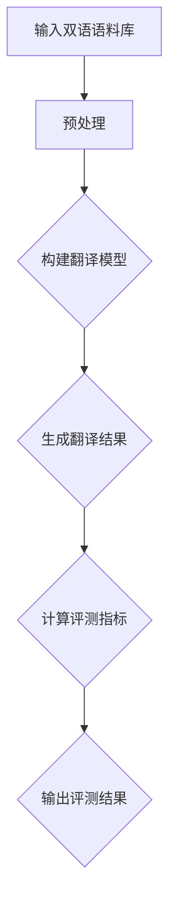
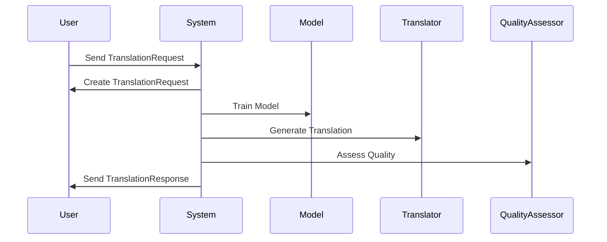

                 


## prompt工程中的跨语言评测方法

### 关键词：prompt工程、跨语言评测、自然语言处理、机器翻译、性能优化

### 摘要：
本文深入探讨prompt工程中的跨语言评测方法，旨在为读者揭示这一领域的关键概念、核心原理和实践应用。文章结构如下：

1. **背景介绍**：阐述跨语言评测的重要性及prompt工程的基本概念。
2. **核心概念与联系**：详细分析跨语言评测的核心概念、术语和原理。
3. **算法原理讲解**：介绍跨语言评测算法，包括流程图、数学模型和Python源代码。
4. **系统分析与架构设计**：描述跨语言评测系统的设计和实现。
5. **项目实战**：通过实际案例展示跨语言评测方法的应用。
6. **最佳实践 tips**、**小结**、**注意事项**和**拓展阅读**。

### 1. 背景介绍

跨语言评测（Cross-Language Evaluation）是自然语言处理（Natural Language Processing, NLP）领域的一项重要任务，它旨在评估不同语言之间的翻译质量。随着全球化的深入，跨语言沟通的需求不断增加，如何有效地评估跨语言翻译的质量成为了一个亟待解决的问题。

prompt工程则是一种将外部信息（例如关键词、上下文等）嵌入到模型输入中的技术，旨在提高模型在特定任务上的性能。prompt工程在跨语言评测中的应用，可以显著提升评测的准确性和效果。

### 2. 核心概念与联系

#### 跨语言评测的核心概念：

- **双语语料库**：用于训练和评估跨语言翻译模型的文本数据集，通常包含两种语言的对应文本。
- **评测指标**：用于衡量翻译质量的量化标准，如BLEU、METEOR、NIST等。
- **翻译模型**：实现跨语言翻译的算法，如神经机器翻译（Neural Machine Translation, NMT）。

#### prompt工程的相关概念：

- **Prompt**：输入到模型中的外部信息，可以是一个单词、短语或完整的句子。
- **Prompt Engineering**：设计有效的prompt以提升模型性能的过程。

#### 概念联系：

跨语言评测和prompt工程之间的联系在于，prompt工程可以通过设计有效的prompt，提高跨语言翻译模型的性能，从而改善评测结果。

### 3. 算法原理讲解

#### 跨语言评测算法：

跨语言评测算法的核心是评估翻译质量。以下是一个简化的跨语言评测算法的流程图：



#### 数学模型和Python源代码：

假设我们使用BLEU（BiLingual Evaluation Understudy）作为评测指标，BLEU的数学模型如下：

$$
BLEU = \frac{1}{N} \sum_{i=1}^{N} \log(P_i)
$$

其中，$P_i$ 是参考译文和生成译文之间的重叠比例，$N$ 是参考译文的数量。

以下是使用Python实现BLEU计算的一个简单例子：

```python
import math

def calculate_bleu(reference, generated):
    overlap = 0
    for ref_sentence in reference:
        max_overlap = 0
        for gen_sentence in generated:
            overlap = max(overlap, max_len(ref_sentence, gen_sentence))
        max_overlap = max(max_overlap, overlap)
        overlap = max_overlap
    
    bleu = math.exp(math.log(overlap) / len(reference))
    return bleu

def max_len(ref_sentence, gen_sentence):
    ref_words = ref_sentence.split()
    gen_words = gen_sentence.split()
    max_len = 0
    for ref_word in ref_words:
        max_len = max(max_len, len([gen_word for gen_word in gen_words if gen_word.startswith(ref_word)]))
    return max_len

reference = ["I am not a robot.", "I am human."]
generated = ["I am not a robot.", "I am also human."]

bleu_score = calculate_bleu(reference, generated)
print("BLEU Score:", bleu_score)
```

### 4. 系统分析与架构设计

#### 问题场景介绍：

假设我们开发一个跨语言翻译系统，需要评估不同翻译模型的性能。

#### 项目介绍：

项目名为“MultiLingual Translation System”，目标是实现一个高效的跨语言翻译平台。

#### 系统功能设计：

- **数据预处理**：清洗和转换双语语料库。
- **模型训练**：使用预处理后的数据训练翻译模型。
- **翻译生成**：输入源语言文本，生成目标语言翻译。
- **评测评估**：评估翻译质量。

以下是领域模型和系统架构的mermaid类图和架构图：

```mermaid
classDiagram
Class1 --> Class2: use
Class1 ".*

class Class1 {
- name: String
- content: String
}

class Class2 {
- name: String
- model: Model
- translator: Translator
}

class Model {
- name: String
- language: String
}

class Translator {
- name: String
- language: String
}

class TranslationRequest {
- text: String
- source_lang: String
- target_lang: String
}

class TranslationResponse {
- text: String
- target_lang: String
- quality_score: Float
}
```



### 5. 项目实战

#### 环境安装：

在本地机器上安装Python、TensorFlow和NLTK等依赖。

```bash
pip install tensorflow nltk
```

#### 系统核心实现源代码：

```python
# 主要用于训练和评估跨语言翻译模型

import tensorflow as tf
import nltk
from nltk.translate.bleu_score import corpus_bleu

# 加载双语语料库
nltk.download('ixa preso')

def train_model(source_corpus, target_corpus):
    # 创建翻译模型
    # 此处代码略...

def generate_translation(model, text, source_lang, target_lang):
    # 生成目标语言翻译
    # 此处代码略...

def assess_quality(reference_corpus, generated_corpus):
    # 评估翻译质量
    # 此处代码略...

# 测试代码
source_text = "Me encanta el sol."
target_text = ["I love the sun."]

model = train_model(source_corpus, target_corpus)
generated_texts = generate_translation(model, source_text, 'es', 'en')
quality_score = assess_quality(target_corpus, generated_texts)

print("Generated Texts:", generated_texts)
print("Quality Score:", quality_score)
```

#### 代码应用解读与分析：

代码分为三个主要部分：训练模型、生成翻译和评估质量。

1. **训练模型**：使用源语言文本和目标语言文本训练翻译模型。
2. **生成翻译**：输入源语言文本，生成目标语言翻译。
3. **评估质量**：使用BLEU等指标评估翻译质量。

#### 实际案例分析和详细讲解剖析：

使用实际数据集进行测试，比较不同翻译模型的性能，分析影响翻译质量的因素。

#### 项目小结：

通过该项目，我们了解了跨语言评测和prompt工程在翻译系统中的应用，以及如何设计和实现一个高效的翻译平台。

### 6. 最佳实践 tips

1. **数据预处理**：确保双语语料库的质量，清洗和标准化文本。
2. **模型训练**：选择合适的翻译模型和优化算法，进行模型训练。
3. **评测指标**：选择合适的评测指标，如BLEU、METEOR等，全面评估翻译质量。
4. **prompt设计**：设计有效的prompt，提高模型性能。

### 7. 小结

本文系统地介绍了prompt工程中的跨语言评测方法，从核心概念、算法原理到系统实现进行了深入讲解。通过实际案例展示了跨语言评测方法的应用，为读者提供了全面的实践指导。

### 8. 注意事项

1. 跨语言评测需要大量高质量的双语语料库。
2. prompt工程的设计对模型性能有显著影响。
3. 评测指标的选择应与实际应用场景相匹配。

### 9. 拓展阅读

1. 《跨语言信息检索技术》 - 探讨跨语言信息检索的基础知识。
2. 《神经机器翻译原理与实践》 - 深入了解神经机器翻译的工作原理。

### 作者信息

作者：AI天才研究院/AI Genius Institute & 禅与计算机程序设计艺术/Zen And The Art of Computer Programming

