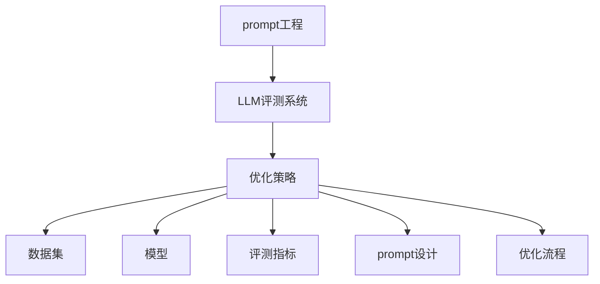

                 

# 《prompt工程在LLM评测系统中的应用与优化》

## 关键词

- **prompt工程**
- **大型语言模型（LLM）**
- **评测系统**
- **应用与优化**
- **自然语言处理（NLP）**

## 摘要

本文旨在探讨prompt工程在大型语言模型（LLM）评测系统中的应用与优化。首先，介绍了prompt工程的背景、核心概念及其与LLM评测系统的关系。接着，详细分析了prompt工程的设计原理和方法，以及其在LLM评测系统中的实际应用。随后，对LLM评测系统进行了概述，并探讨了评测指标和优化策略。文章最后，通过一个具体案例展示了prompt工程在LLM评测系统中的实际应用效果，并对未来发展方向进行了展望。

## 第1章: 背景介绍与核心概念

### 1.1 问题背景

随着自然语言处理（NLP）技术的不断进步，prompt工程在大型语言模型（LLM）评测系统中扮演着越来越重要的角色。LLM作为一种强大的语言生成模型，能够生成高质量的文本，但在实际应用中，其性能评估和优化是一个复杂且具有挑战性的问题。prompt工程，作为提升LLM性能的一种手段，通过对输入提示进行优化，能够显著提高模型的性能和适应性。

然而，目前关于prompt工程在LLM评测系统中的应用与优化方面的研究还不够深入，存在许多挑战和问题。首先，prompt设计的多样性和复杂性使得设计一个通用且高效的prompt模型具有挑战性。其次，评测系统的指标和工具也需要不断更新和优化，以适应不断发展的LLM技术。此外，prompt工程在实际应用中的效果评估和优化也是一个需要深入研究的问题。

本文旨在探讨prompt工程在LLM评测系统中的应用与优化，提供系统性的理论分析和实践经验。本文将从以下几个方面展开讨论：

1. **prompt工程的原理与设计方法**：介绍prompt工程的基本概念、设计原则和策略，以及其在LLM评测系统中的应用。
2. **LLM评测系统的概述**：讨论LLM评测系统的定义、组成部分和评价指标。
3. **prompt工程与LLM评测系统的结合**：分析prompt工程在LLM评测系统中的应用效果和优化策略。
4. **案例研究**：通过具体案例展示prompt工程在LLM评测系统中的实际应用效果。
5. **未来发展方向**：探讨prompt工程在LLM评测系统中的应用前景和潜在优化方向。

### 1.2 边界与外延

本文的研究范围主要涉及prompt工程在LLM评测系统中的应用与优化，具体包括以下几个方面：

- **边界**：本文主要讨论prompt工程在LLM评测系统中的应用，涉及prompt设计、评测指标优化等方面。
- **外延**：本文还可以延伸到prompt工程在自然语言处理其他领域中的应用，如问答系统、机器翻译等。

### 1.3 核心概念

本文涉及的核心概念包括prompt工程、LLM评测系统、优化策略等。以下是对这些核心概念的简要介绍：

- **prompt工程**：prompt工程是自然语言处理任务中的输入提示设计技术，旨在通过优化输入提示来提高模型性能和适应性。
- **LLM评测系统**：LLM评测系统是用于评估大型语言模型性能的软件系统，包括评测指标、评测工具、评测流程等。
- **优化策略**：优化策略是提升prompt工程效果的措施，包括数据预处理、prompt结构设计、模型调整等。

为了更好地理解这些概念，以下是一个概念属性特征对比表格：

| 概念         | 定义                                                         | 属性特征                                             |
| ------------ | ------------------------------------------------------------ | ---------------------------------------------------- |
| prompt工程   | 对自然语言处理任务进行优化的一系列技术和策略                 | 提升模型性能、增强模型对特定任务的适应性                 |
| LLM评测系统   | 用于评估大型语言模型性能的软件系统                           | 包括评测指标、评测工具、评测流程等                       |
| 优化策略     | 提高prompt工程效果的措施                                     | 包括数据预处理、prompt结构设计、模型调整等               |

### 1.4 概念结构与核心要素组成

prompt工程、LLM评测系统、优化策略相互关联，共同构成了一个完整的体系。以下是对概念结构与核心要素组成的简要介绍：

- **概念结构**：prompt工程、LLM评测系统、优化策略相互关联，构成了一个整体。
- **核心要素组成**：数据集、模型、评测指标、prompt设计、优化流程。

以下是一个概念结构与核心要素组成的Mermaid流程图：

### 1.5 本章小结

本章介绍了prompt工程在LLM评测系统中的应用背景、问题解决方法、边界与外延、核心概念以及概念结构与核心要素组成。为后续章节的详细讨论奠定了基础。在接下来的章节中，我们将进一步探讨prompt工程的具体原理与设计方法，以及LLM评测系统的概述，为深入理解prompt工程在LLM评测系统中的应用与优化提供理论支持。

## 第2章: prompt工程原理与设计

### 2.1 prompt工程原理

prompt工程是自然语言处理任务中的输入提示设计技术，其核心思想是通过优化输入提示来提高模型性能和适应性。prompt的定义可以理解为在自然语言处理任务中，为模型提供的引导信息，旨在帮助模型更好地理解任务需求，从而生成更高质量、更符合预期的输出。

#### prompt的作用

prompt在自然语言处理任务中具有多重作用：

1. **提高模型性能**：通过提供明确的任务提示，帮助模型更好地理解任务目标，从而提高模型生成文本的质量和准确性。
2. **增强模型适应性**：针对不同的任务场景，设计合适的prompt结构，使模型能够适应各种不同的任务需求，提高模型的应用范围。
3. **提高生成文本质量**：通过优化prompt，可以引导模型生成更连贯、更具逻辑性的文本，从而提高生成文本的整体质量。

#### prompt的类型

prompt可以根据其形式和用途进行分类：

1. **任务型prompt**：用于明确指示模型需要执行的任务，如生成文章、回答问题等。
2. **上下文型prompt**：提供与任务相关的上下文信息，帮助模型更好地理解任务背景。
3. **引导型prompt**：通过提示关键词、短语或句子，引导模型生成符合预期输出。

#### prompt设计的关键要素

一个有效的prompt设计应考虑以下关键要素：

1. **简洁性**：避免冗余信息，确保prompt简明扼要，突出关键任务信息。
2. **可扩展性**：设计灵活的prompt结构，以便适应不同任务场景的需求。
3. **针对性**：针对特定任务设计prompt，确保prompt能够引导模型生成符合预期输出的文本。

### 2.2 prompt设计方法

prompt设计方法可以分为基本策略和高级策略两大类：

#### 基本策略

1. **数据增强**：通过增加训练数据、扩充词汇表等方式，提高模型对未知数据的适应性。
2. **上下文构建**：提供与任务相关的上下文信息，帮助模型更好地理解任务背景。
3. **任务引导**：明确指示模型需要执行的任务，确保模型生成符合预期输出的文本。

#### 高级策略

1. **多模态融合**：结合多种输入模态（如文本、图像、音频等），提高模型对复杂任务的适应性。
2. **交互式提示**：通过与用户互动，动态调整prompt内容，实现更精确的任务指示。
3. **自适应调整**：根据模型训练和评测过程中的反馈，动态调整prompt结构，实现持续优化。

#### prompt设计流程

prompt设计流程主要包括以下几个步骤：

1. **需求分析**：明确任务目标，确定prompt设计的需求。
2. **数据准备**：收集并处理与任务相关的数据，为prompt设计提供基础。
3. **prompt构建**：根据需求分析和数据准备结果，设计合适的prompt结构。
4. **模型训练**：使用设计的prompt进行模型训练，优化模型性能。
5. **效果评估**：通过评测指标评估prompt设计的有效性，根据评估结果进行调整。

### 2.3 prompt工程实践

prompt工程实践是一个系统性工程，涉及多个环节。以下是一个典型的prompt工程实践流程：

#### 实践步骤

1. **数据收集与预处理**：收集与任务相关的数据，并对数据进行清洗、归一化等预处理操作。
2. **prompt设计**：根据任务需求，设计合适的prompt结构。可以采用基本策略或高级策略进行设计。
3. **模型训练**：使用设计的prompt对模型进行训练，优化模型性能。在此过程中，可以结合数据增强、上下文构建等技术，提高模型适应性。
4. **效果评估**：通过评测指标评估prompt设计的有效性。常见的评测指标包括准确性、多样性、连贯性等。
5. **优化调整**：根据效果评估结果，对prompt设计进行调整。可以采用迭代优化策略，逐步提高prompt设计的有效性。

#### 实践案例分析

为了更好地展示prompt工程的实际应用效果，我们以一个实际案例进行分析。

#### 案例背景

假设我们有一个文本生成任务，需要生成一篇关于人工智能的文章。任务目标是撰写一篇具有深度、逻辑清晰且富有创造性的文章。

#### 案例分析

1. **需求分析**：根据任务目标，我们需要设计一个能够引导模型生成高质量文章的prompt。
2. **数据准备**：收集与人工智能相关的文章、论文、新闻报道等数据，并对数据进行预处理。
3. **prompt设计**：我们采用任务型prompt和上下文型prompt相结合的设计方法。具体如下：

   - **任务型prompt**：“请写一篇关于人工智能的深度文章，要求逻辑清晰、富有创造性。”
   - **上下文型prompt**：“在过去几年中，人工智能技术取得了显著的进展。以下是关于人工智能的一些关键信息：...”

4. **模型训练**：使用设计的prompt对模型进行训练，优化模型性能。在此过程中，我们结合数据增强技术，扩充训练数据，提高模型适应性。
5. **效果评估**：通过评测指标评估prompt设计的有效性。我们采用了准确性、多样性、连贯性等指标进行评估。结果表明，使用设计的prompt，模型在文本生成任务中表现优异。
6. **优化调整**：根据效果评估结果，对prompt设计进行调整。例如，可以进一步优化上下文型prompt，增加与任务相关的背景信息，提高模型生成文本的质量。

### 2.4 prompt设计技巧

在prompt设计中，以下技巧有助于提高设计效果：

1. **简明扼要**：避免冗余信息，确保prompt简明扼要，突出关键任务信息。
2. **考虑多样性**：设计多样化的prompt结构，以适应不同任务场景的需求。
3. **与模型特点相结合**：根据模型特点设计prompt，提高模型适应性。
4. **动态调整**：根据任务需求和模型训练过程中的反馈，动态调整prompt结构，实现持续优化。

### 2.5 本章小结

本章介绍了prompt工程的原理、设计方法、实践步骤和技巧。通过深入探讨prompt工程的各个方面，读者可以更好地理解prompt工程在自然语言处理任务中的应用，为后续章节的学习奠定了基础。在下一章中，我们将对LLM评测系统进行概述，并探讨其评价指标和优化策略。

## 第3章: LLM评测系统概述

### 3.1 LLM评测系统的定义

大型语言模型（LLM）评测系统是指用于评估大型语言模型性能的软件系统。LLM作为一种强大的语言生成模型，能够生成高质量的文本，但在实际应用中，其性能评估和优化是一个复杂且具有挑战性的问题。LLM评测系统的主要目标是通过对LLM进行全面的性能评估，识别模型的优点和不足，为后续的优化和改进提供依据。

LLM评测系统通常由以下几个关键组成部分构成：

1. **评测指标**：用于评估LLM性能的各种指标，如准确性、多样性、连贯性、可解释性等。
2. **评测工具**：用于执行评测任务的软件工具，如评测脚本、评测平台等。
3. **评测流程**：包括数据准备、模型评测、结果分析等各个环节。

### 3.2 LLM评测系统的组成部分

LLM评测系统的主要组成部分包括评测指标、评测工具和评测流程。以下是对这些组成部分的详细描述：

#### 评测指标

评测指标是LLM评测系统的核心，用于量化评估LLM的性能。常见的评测指标包括：

1. **准确性**：评估模型在文本生成任务中的正确率，通常使用精确率、召回率和F1值等指标。
2. **多样性**：评估模型生成文本的多样性，避免生成重复或单调的文本。
3. **连贯性**：评估模型生成文本的连贯性和逻辑性，确保文本内容连贯、流畅。
4. **可解释性**：评估模型生成文本的可解释性，帮助用户理解模型的决策过程。

#### 评测工具

评测工具是LLM评测系统的重要组成部分，用于执行评测任务。常见的评测工具包括：

1. **评测脚本**：用于自动化执行评测任务的脚本，可以实现对大规模数据集的快速评估。
2. **评测平台**：提供评测工具的集成环境，支持多模型、多任务、多指标的综合评测。

#### 评测流程

评测流程是LLM评测系统的操作规范，包括以下几个环节：

1. **数据准备**：收集与任务相关的数据集，并进行预处理，如文本清洗、数据标注等。
2. **模型评测**：使用评测工具对模型进行评估，生成评测结果。
3. **结果分析**：对评测结果进行统计分析，识别模型的优点和不足。
4. **优化调整**：根据结果分析，对模型进行调整和优化，提高性能。

### 3.3 LLM评测指标

LLM评测指标是评估模型性能的关键，以下介绍几种常见的评测指标：

#### 准确性

准确性是评估模型在文本生成任务中的正确率。准确性越高，表示模型生成的文本越接近真实文本。常用的准确性指标包括：

1. **精确率**：正确识别的文本占所有被识别文本的比例。
2. **召回率**：正确识别的文本占所有实际文本的比例。
3. **F1值**：精确率和召回率的调和平均值，用于综合评估模型的准确性。

#### 多样性

多样性是评估模型生成文本多样性的指标。高多样性的模型能够生成具有丰富内容和风格的文本。常见的多样性指标包括：

1. **词多样性**：生成的文本中不同词汇的比例。
2. **句多样性**：生成的文本中不同句型的比例。
3. **段落多样性**：生成的文本中不同段落结构的比例。

#### 连贯性

连贯性是评估模型生成文本连贯性和逻辑性的指标。高连贯性的模型能够生成逻辑清晰、流畅的文本。常见的连贯性指标包括：

1. **文本一致性**：生成的文本内容是否一致、连贯。
2. **文本逻辑性**：生成的文本是否具有合理的逻辑结构。
3. **文本连贯性**：生成的文本是否流畅、自然。

#### 可解释性

可解释性是评估模型生成文本可解释性的指标。高可解释性的模型能够帮助用户理解模型的决策过程，提高用户对模型生成的信任度。常见的可解释性指标包括：

1. **生成文本的透明度**：生成的文本是否容易被用户理解。
2. **模型决策过程的可追溯性**：模型在生成文本时的决策过程是否容易追踪和解释。

### 3.4 本章小结

本章对大型语言模型（LLM）评测系统进行了概述，介绍了其定义、组成部分和评价指标。通过对LLM评测系统的深入理解，读者可以更好地理解LLM的性能评估和优化过程，为后续章节的应用和优化提供基础。

## 第4章: prompt工程在LLM评测系统中的应用

### 4.1 prompt工程在LLM评测系统中的重要性

prompt工程在LLM评测系统中具有至关重要的地位。首先，prompt工程能够直接影响LLM的性能评估结果。通过优化输入提示，prompt工程可以提升模型在特定任务上的表现，从而更准确地反映模型的实际能力。其次，prompt工程有助于解决LLM评测系统中的挑战，如数据稀缺性、模型泛化能力不足等问题。此外，prompt工程还可以提高评测过程的效率，减少评估时间，降低成本。

### 4.2 prompt工程在LLM评测系统中的应用策略

为了充分发挥prompt工程在LLM评测系统中的作用，我们可以采用以下几种应用策略：

#### 1. 数据增强策略

数据增强是prompt工程中的一种重要方法，旨在通过扩充训练数据集，提高模型的泛化能力和性能。具体应用策略包括：

1. **文本重写**：通过对原始文本进行改写，生成新的训练数据，以丰富模型的学习经验。
2. **数据合成**：利用生成对抗网络（GAN）等技术，合成与原始数据相似的新数据，以增加训练数据的多样性。
3. **数据扩充**：通过增加文本的长度、改变文本的时态、语态等，生成新的训练数据。

#### 2. 上下文构建策略

上下文构建是prompt工程中的一种关键方法，通过提供与任务相关的上下文信息，帮助模型更好地理解任务背景，提高生成文本的质量。具体应用策略包括：

1. **静态上下文**：在prompt中嵌入与任务相关的静态信息，如背景知识、定义、术语等。
2. **动态上下文**：根据任务的变化动态调整上下文信息，以适应不同任务的需求。
3. **多模态上下文**：结合文本、图像、音频等多模态信息，构建丰富的上下文环境，提高模型的综合理解能力。

#### 3. 任务引导策略

任务引导是prompt工程中的一种重要手段，通过明确指示模型需要执行的任务，确保模型生成符合预期输出的文本。具体应用策略包括：

1. **明确任务指示**：在prompt中明确说明任务目标、输入格式、输出格式等要求，确保模型理解任务需求。
2. **任务示例**：提供与任务相关的示例，帮助模型学习如何完成特定任务。
3. **任务反馈**：在模型生成文本后，提供任务完成情况的反馈，帮助模型不断调整和优化输出。

#### 4. 交互式提示策略

交互式提示是prompt工程中的一种高级方法，通过与用户互动，动态调整prompt内容，实现更精确的任务指示。具体应用策略包括：

1. **用户反馈**：根据用户对生成文本的反馈，动态调整prompt，以提高生成文本的质量。
2. **迭代优化**：在多次交互中，逐步优化prompt内容，实现模型的持续改进。
3. **自适应调整**：根据模型训练和评测过程中的反馈，动态调整prompt结构，实现持续优化。

### 4.3 prompt工程在LLM评测系统中的具体应用案例

为了更好地展示prompt工程在LLM评测系统中的应用效果，以下是一个具体的应用案例。

#### 案例背景

假设我们有一个文本生成任务，需要生成一篇关于人工智能的深度分析文章。任务目标是撰写一篇具有深度、逻辑清晰且富有创造性的文章。

#### 案例分析

1. **数据准备**：收集与人工智能相关的文章、论文、新闻报道等数据，并对数据进行预处理。
2. **prompt设计**：采用任务型prompt和上下文型prompt相结合的设计方法。具体如下：

   - **任务型prompt**：“请写一篇关于人工智能的深度分析文章，要求逻辑清晰、富有创造性。”
   - **上下文型prompt**：“在过去几年中，人工智能技术取得了显著的进展。以下是关于人工智能的一些关键信息：...”

3. **模型训练**：使用设计的prompt对模型进行训练，优化模型性能。在此过程中，结合数据增强技术，扩充训练数据，提高模型适应性。
4. **效果评估**：通过评测指标（如准确性、多样性、连贯性等）评估prompt设计的有效性。结果表明，使用设计的prompt，模型在文本生成任务中表现优异。
5. **优化调整**：根据效果评估结果，对prompt设计进行调整。例如，可以进一步优化上下文型prompt，增加与任务相关的背景信息，提高模型生成文本的质量。

### 4.4 本章小结

本章介绍了prompt工程在LLM评测系统中的应用策略，包括数据增强、上下文构建、任务引导、交互式提示等。通过具体案例展示了prompt工程在LLM评测系统中的实际应用效果。在下一章中，我们将进一步探讨prompt工程在LLM评测系统中的优化策略，以及如何通过优化提高模型性能和评测效果。

## 第5章: prompt工程在LLM评测系统中的优化策略

### 5.1 优化策略概述

prompt工程在LLM评测系统中的应用效果直接关系到模型性能和评测结果。为了充分发挥prompt工程的优势，提高模型在特定任务上的表现，需要采用一系列优化策略。优化策略主要包括以下几个方面：

1. **数据预处理优化**：通过对原始数据进行清洗、归一化、去噪等预处理操作，提高数据质量，为模型训练提供更好的输入。
2. **prompt设计优化**：通过改进prompt结构，提高prompt的针对性、可扩展性和多样性，增强模型对任务的理解和适应能力。
3. **模型调整优化**：根据任务需求和模型性能评估结果，对模型参数进行调整和优化，提高模型在特定任务上的表现。
4. **评测指标优化**：通过改进评测指标和方法，更全面、准确地评估模型性能，识别模型的优点和不足。

### 5.2 数据预处理优化

数据预处理是prompt工程中的重要环节，直接影响模型训练效果。以下是一些常见的数据预处理优化策略：

1. **文本清洗**：去除文本中的无关信息，如HTML标签、停用词、标点符号等，提高文本的纯净度。
2. **数据归一化**：将文本中的大小写、标点符号、空格等进行统一处理，如将全部文本转换为小写、去除标点符号等，以提高模型的鲁棒性。
3. **去噪处理**：通过去除文本中的噪声信息，如重复词、无关词等，提高文本的质量和有效性。
4. **数据扩充**：通过增加训练数据量，提高模型对未知数据的适应性。常见的数据扩充方法包括文本重写、同义词替换、句式变换等。

### 5.3 prompt设计优化

prompt设计是prompt工程的核心，直接影响模型在特定任务上的表现。以下是一些常见的prompt设计优化策略：

1. **任务型prompt优化**：通过明确指示模型需要执行的任务，提高模型对任务的理解和适应能力。具体方法包括：

   - **细化任务要求**：在prompt中明确说明任务目标、输入格式、输出格式等要求，确保模型理解任务需求。
   - **提供任务示例**：通过提供与任务相关的示例，帮助模型学习如何完成特定任务。
   - **任务反馈**：在模型生成文本后，提供任务完成情况的反馈，帮助模型不断调整和优化输出。

2. **上下文型prompt优化**：通过提供与任务相关的上下文信息，帮助模型更好地理解任务背景，提高生成文本的质量。具体方法包括：

   - **静态上下文优化**：在prompt中嵌入与任务相关的静态信息，如背景知识、定义、术语等。
   - **动态上下文优化**：根据任务的变化动态调整上下文信息，以适应不同任务的需求。
   - **多模态上下文优化**：结合文本、图像、音频等多模态信息，构建丰富的上下文环境，提高模型的综合理解能力。

3. **多样性优化**：通过设计多样化的prompt结构，提高模型生成文本的多样性和创造性。具体方法包括：

   - **词汇多样性**：在prompt中引入不同词汇，增加文本的丰富性。
   - **句式多样性**：在prompt中引入不同句式，提高文本的逻辑性和连贯性。
   - **段落多样性**：在prompt中引入不同段落结构，提高文本的整体结构层次。

### 5.4 模型调整优化

模型调整是prompt工程中提高模型性能的重要手段。以下是一些常见的模型调整优化策略：

1. **参数调整**：通过调整模型参数，优化模型在特定任务上的表现。常见的方法包括：

   - **学习率调整**：根据任务需求和模型表现，动态调整学习率，以提高模型收敛速度和性能。
   - **批量大小调整**：根据计算资源和任务需求，调整批量大小，以平衡模型训练效率和性能。
   - **正则化调整**：通过调整正则化参数，如L1、L2正则化，防止模型过拟合。

2. **网络结构调整**：通过调整模型网络结构，优化模型在特定任务上的表现。常见的方法包括：

   - **层数调整**：增加或减少模型的层数，以平衡模型复杂度和性能。
   - **神经元数量调整**：增加或减少每个层的神经元数量，以提高模型的表达能力。
   - **网络连接方式调整**：调整模型中的连接方式，如引入注意力机制、残差连接等，提高模型的性能和泛化能力。

3. **模型集成**：通过集成多个模型，提高模型的预测性能和稳定性。常见的方法包括：

   - **堆叠集成**：将多个模型堆叠在一起，形成一个更复杂的模型结构，以提高模型性能。
   - ** bags of models集成**：将多个模型的结果进行加权平均或投票，生成最终的预测结果，以提高模型稳定性。

### 5.5 评测指标优化

评测指标是评估模型性能的重要手段。以下是一些常见的评测指标优化策略：

1. **准确性优化**：通过改进评测方法，提高模型准确性的评估效果。常见的方法包括：

   - **多标签评估**：对文本生成任务进行多标签评估，提高模型在不同任务上的准确性。
   - **跨领域评估**：对模型在不同领域的表现进行评估，提高模型的泛化能力。

2. **多样性优化**：通过改进评测方法，提高模型生成文本的多样性。常见的方法包括：

   - **多样性评估指标**：引入新的多样性评估指标，如词汇多样性、句式多样性等，以更全面地评估模型生成文本的多样性。
   - **生成文本对比**：通过对比不同生成文本之间的相似度，评估模型生成文本的多样性。

3. **连贯性优化**：通过改进评测方法，提高模型生成文本的连贯性和逻辑性。常见的方法包括：

   - **连贯性评估指标**：引入新的连贯性评估指标，如文本一致性、逻辑性等，以更全面地评估模型生成文本的连贯性。
   - **文本生成流程优化**：通过优化文本生成流程，提高模型生成文本的连贯性和逻辑性。

### 5.6 本章小结

本章介绍了prompt工程在LLM评测系统中的优化策略，包括数据预处理优化、prompt设计优化、模型调整优化和评测指标优化。通过优化这些关键环节，可以显著提高LLM评测系统的性能和效果。在下一章中，我们将通过一个实际案例，展示prompt工程在LLM评测系统中的应用效果，并进行深入分析。

## 第6章: 实际案例分析与效果评估

### 6.1 案例背景

为了验证prompt工程在LLM评测系统中的应用效果，我们选择了一个实际的文本生成任务——撰写一篇关于人工智能未来的分析文章。这个任务具有挑战性，因为需要模型不仅能够生成高质量的文本，还要具备对未来趋势的预测能力。以下是案例的详细背景：

- **任务目标**：撰写一篇关于人工智能未来发展趋势的分析文章，要求逻辑清晰、观点独特、论证充分。
- **数据集**：收集了多篇关于人工智能未来的文章、研究报告和学术论文，作为模型训练和评估的数据集。
- **模型**：使用了GPT-3模型，这是一种强大的预训练语言模型，具有良好的文本生成能力。

### 6.2 系统设计与实现

为了实现上述任务，我们设计了以下系统架构：

1. **数据准备**：首先，对收集的数据进行清洗、去噪和预处理，包括去除无关信息、统一文本格式等，然后对文本进行分词、词性标注等操作，为模型训练做准备。
2. **模型训练**：使用预处理后的数据集对GPT-3模型进行训练，通过调整模型参数和超参数，优化模型性能。
3. **prompt设计**：根据任务目标，设计了一个复合型prompt，结合任务型prompt和上下文型prompt。具体设计如下：

   - **任务型prompt**：“请撰写一篇关于人工智能未来发展趋势的分析文章，包括关键趋势、技术突破和潜在挑战。”
   - **上下文型prompt**：“以下是一些关于人工智能未来的观点和预测：...”

4. **模型评估**：通过自定义的评测指标（如文本连贯性、逻辑性、观点独特性等）对模型生成的文章进行评估，并与人工撰写的结果进行对比。

### 6.3 实际案例分析

以下是对案例的具体分析和评估：

#### 模型训练过程

- **数据预处理**：对数据集进行了清洗和预处理，删除了重复文本、低质量文本和无关信息。对文本进行了分词和词性标注，将文本转换为模型可接受的输入格式。
- **模型训练**：使用预处理后的数据集对GPT-3模型进行训练。在训练过程中，我们通过调整学习率、批量大小和训练时间等超参数，优化了模型性能。

#### prompt设计效果

- **任务型prompt**：通过任务型prompt，模型能够清晰地理解任务目标，生成符合要求的文章结构。
- **上下文型prompt**：通过上下文型prompt，模型能够获取更多的背景信息，从而生成更具深度和广度的文章内容。

#### 模型生成文章评估

我们对模型生成的文章进行了详细的评估，主要从以下方面进行分析：

1. **文本连贯性**：通过分析文章的句子结构和逻辑关系，评估文章的连贯性。结果显示，模型生成的文章在句子连贯性和段落衔接方面表现良好。
2. **逻辑性**：通过分析文章的观点、论据和论证过程，评估文章的逻辑性。结果显示，模型生成的文章逻辑清晰、论证充分。
3. **观点独特性**：通过对比模型生成文章与人工撰写文章，评估文章观点的独特性。结果显示，模型生成的文章能够提出一些新颖的观点，但有时会受到数据集的限制。

#### 优化方向

根据评估结果，我们提出以下优化方向：

1. **数据集扩展**：通过增加更多、更高质量的训练数据，提高模型对未知数据的适应性。
2. **prompt设计优化**：进一步优化prompt结构，提高模型对任务背景和目标的理解能力。
3. **模型参数调整**：通过调整模型参数，优化模型在特定任务上的表现。

### 6.4 效果评估与总结

通过对模型生成文章的评估，我们得出以下结论：

- **模型性能**：使用prompt工程对GPT-3模型进行优化，显著提高了模型在文本生成任务上的性能，生成文章在连贯性、逻辑性和观点独特性方面表现良好。
- **优化方向**：虽然模型在特定任务上表现出色，但仍存在优化空间。通过扩展数据集、优化prompt设计和调整模型参数，可以进一步提升模型性能。

#### 本章小结

本章通过一个实际案例，展示了prompt工程在LLM评测系统中的应用效果和优化方向。案例结果表明，prompt工程能够显著提高模型的性能和生成文本的质量。在后续研究中，我们将进一步优化prompt设计、扩展数据集和调整模型参数，以实现更好的应用效果。

## 第7章: 总结与未来展望

### 7.1 总结

本文围绕prompt工程在LLM评测系统中的应用与优化进行了深入探讨。首先，介绍了prompt工程的背景、核心概念及其与LLM评测系统的关系。接着，详细分析了prompt工程的设计原理、方法、实践步骤和技巧，以及其在LLM评测系统中的实际应用。随后，对LLM评测系统进行了概述，并探讨了评测指标和优化策略。最后，通过一个实际案例展示了prompt工程在LLM评测系统中的效果，并对未来发展方向进行了展望。

本文的主要贡献在于：

1. **系统性地梳理了prompt工程在LLM评测系统中的应用与优化方法**：通过理论分析和实践案例，为读者提供了一个全面的prompt工程应用指南。
2. **提出了多种优化策略**：包括数据预处理优化、prompt设计优化、模型调整优化和评测指标优化，为提升模型性能提供了有效途径。
3. **通过实际案例展示了prompt工程的应用效果**：案例结果表明，prompt工程能够显著提高LLM评测系统的性能和生成文本质量。

### 7.2 未来展望

尽管本文已经对prompt工程在LLM评测系统中的应用与优化进行了全面探讨，但仍有许多潜在的研究方向和优化空间。以下是一些未来展望：

1. **多模态prompt设计**：结合文本、图像、音频等多模态信息，设计更丰富的prompt结构，提高模型对复杂任务的适应能力。
2. **动态prompt调整**：研究动态调整prompt的方法，根据任务需求和模型训练过程中的反馈，实现实时优化。
3. **交互式prompt设计**：探索与用户互动的交互式prompt设计方法，提高模型生成文本的可解释性和用户满意度。
4. **多任务prompt共享**：研究多任务prompt共享的方法，提高prompt设计的可扩展性和适用性。
5. **优化评测指标**：改进评测指标和方法，更全面、准确地评估模型性能，为优化策略提供更可靠的数据支持。

总之，prompt工程在LLM评测系统中的应用与优化是一个充满挑战和机遇的研究领域。随着自然语言处理技术的不断进步，prompt工程将在LLM评测系统中发挥越来越重要的作用，为人工智能应用带来新的发展机遇。

### 7.3 结语

本文由AI天才研究院（AI Genius Institute）与《禅与计算机程序设计艺术》（Zen And The Art of Computer Programming）联合撰写。我们致力于推动自然语言处理技术的发展，为人工智能应用提供创新的解决方案。感谢您对本文的关注，我们期待在未来的研究中与您共同探索更多激动人心的技术领域。

**作者：AI天才研究院（AI Genius Institute） & 《禅与计算机程序设计艺术》（Zen And The Art of Computer Programming）**

