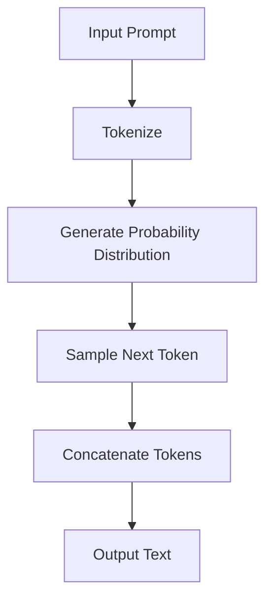
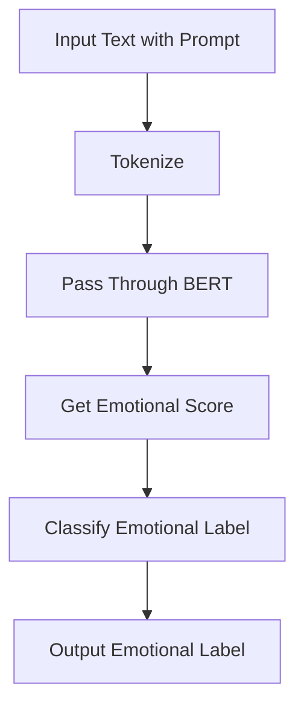
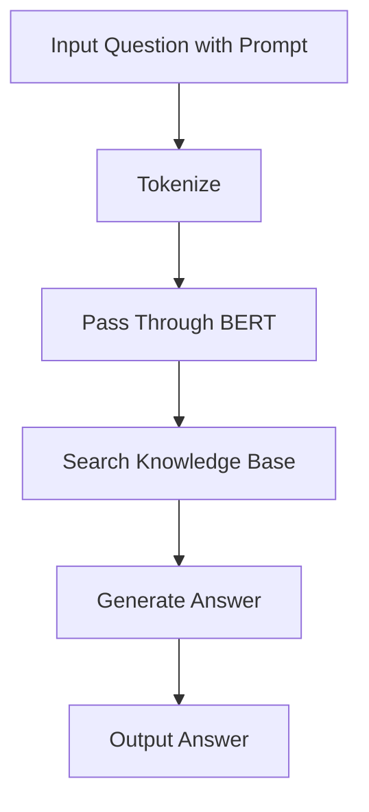
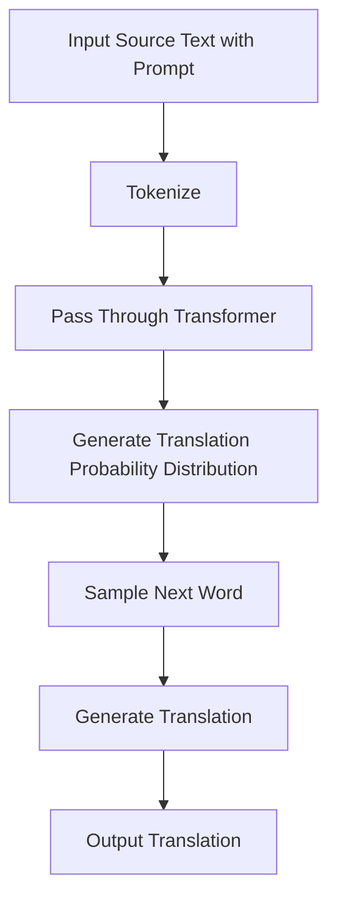
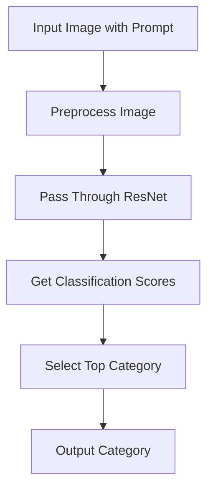
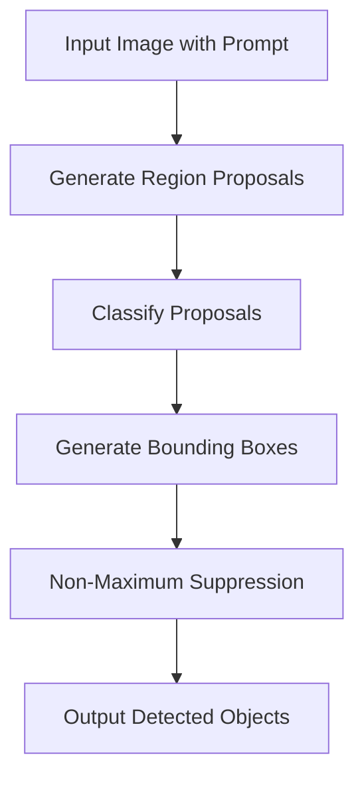
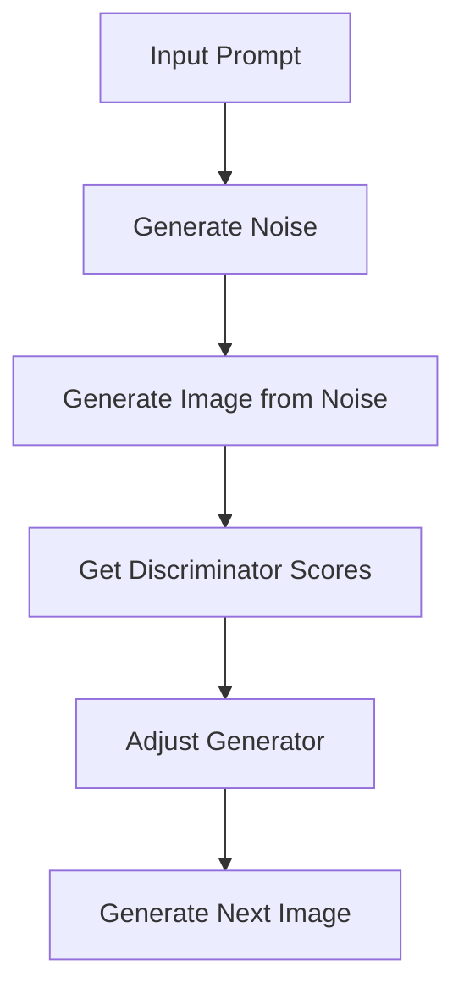
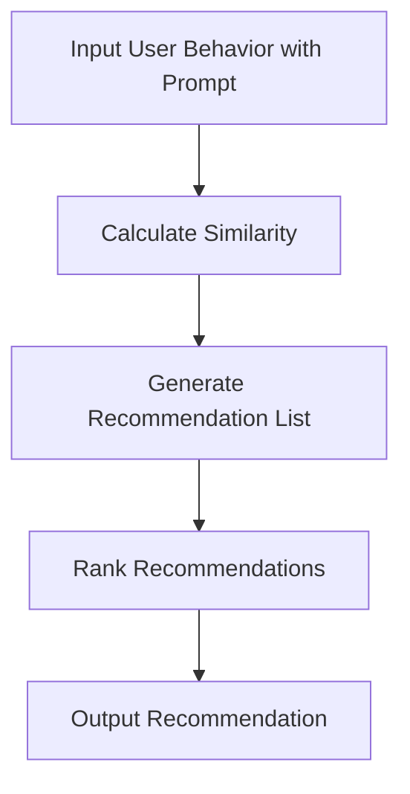
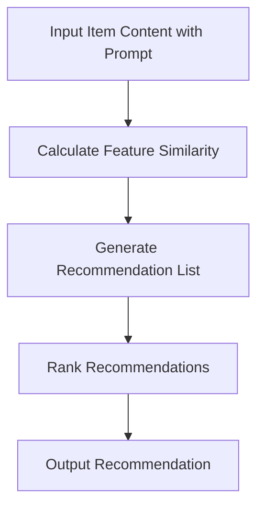
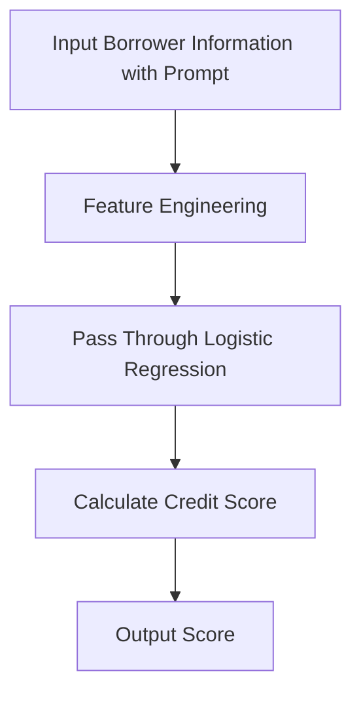

                 

### 引言

#### prompt工程的定义与意义

**prompt工程**，即“提示工程”，是一种通过设计特定的提示或引导来提高人工智能模型理解和生成能力的技术。在人工智能迅速发展的背景下，prompt工程成为了一种重要的方法论，它旨在解决模型在特定任务中的泛化能力、可解释性和灵活性问题。

**定义：** prompt工程是通过构建高质量、结构化的提示，来优化人工智能模型学习过程和输出结果的方法。这些提示通常包括问题的描述、上下文信息、任务指令等，能够引导模型更好地理解和处理复杂任务。

**意义：** 

1. **提高模型理解能力：** 通过精确的提示，模型能够更准确地理解任务的意图和背景，从而提高任务的解决能力。
2. **增强模型可解释性：** prompt工程使得模型输出结果的可解释性得到了提升，有助于理解和优化模型的决策过程。
3. **提升模型灵活性：** prompt工程使得模型能够适应不同类型和难度的任务，提高了模型的泛化能力。
4. **推动人工智能发展：** prompt工程为人工智能领域的创新提供了新的方向和工具，促进了技术的进步和应用范围的扩展。

#### prompt工程的发展历程

prompt工程的历史可以追溯到自然语言处理（NLP）领域的早期研究。最初的模型，如基于规则的方法和统计模型，往往需要手动编写大量的规则和特征来指导模型。随着深度学习技术的崛起，特别是生成对抗网络（GAN）和变分自编码器（VAE）的提出，prompt工程开始得到了更多的关注和应用。

**关键里程碑：**

1. **2000年代初期：** NLP领域中，基于模板和规则的方法被广泛应用于信息提取和文本分类任务。这些方法依赖于人工编写的规则和模板，提示工程的思想开始萌芽。
2. **2010年代中期：** 基于深度学习的模型，如循环神经网络（RNN）和卷积神经网络（CNN）开始在NLP领域得到广泛应用。这些模型通过自动学习特征，减少了人工干预的需求，但仍然需要大量的数据来训练。
3. **2018年：** GPT-2的提出标志着prompt工程的重要进展。GPT-2通过预训练大量文本数据，并使用特定格式的提示，实现了在多种NLP任务上的出色表现。
4. **2020年代至今：** prompt工程在不同领域得到了广泛应用，如计算机视觉、推荐系统、金融风控等。研究者们通过设计更复杂的提示结构和算法，不断推动prompt工程的发展。

#### prompt工程的应用领域

prompt工程的应用领域非常广泛，几乎涵盖了人工智能的各个子领域。以下是几个典型的应用领域：

1. **自然语言处理（NLP）：** prompt工程在文本生成、情感分析、问答系统和机器翻译等NLP任务中发挥了重要作用。
2. **计算机视觉（CV）：** prompt工程通过设计特定的提示，提高了图像分类、目标检测和图像生成等CV任务的性能。
3. **推荐系统（RS）：** prompt工程在协同过滤和基于内容的推荐系统中，帮助模型更好地理解和预测用户行为。
4. **金融风控（FR）：** prompt工程在信用评分、异常检测和欺诈检测中，提高了风险模型的准确性和可解释性。
5. **医疗健康（MH）：** prompt工程在医学文本挖掘、疾病预测和药物研发中，为医疗健康领域提供了有力的技术支持。

#### 本章小结

本章对prompt工程进行了全面的介绍，包括其定义、意义、发展历程和应用领域。通过本章的学习，读者可以初步了解prompt工程的概念和重要性，为其在后续章节中的深入探讨打下基础。

## 第1章：prompt工程概述

### 1.1 问题背景

在人工智能（AI）发展的历程中，模型的设计和训练一直是一个核心问题。尽管深度学习技术取得了显著的进步，但传统的模型往往依赖于大量手动编写的特征和规则，这导致模型的复杂度和可维护性不断提高。同时，模型的泛化能力和可解释性也成为了亟待解决的问题。如何设计一种方法，能够提高模型的泛化能力，同时降低对人工干预的依赖，成为了一个重要的研究方向。

在这个背景下，prompt工程应运而生。prompt工程通过设计高质量的提示，来引导模型学习和生成，从而提高模型在特定任务中的性能。相比传统的特征工程，prompt工程减少了人工干预，提高了模型的自动化程度。此外，prompt工程还能够增强模型的可解释性，使得模型的决策过程更加透明和易于理解。

### 1.2 prompt工程的定义与意义

**定义：** prompt工程是一种通过构建高质量、结构化的提示来优化人工智能模型学习和生成能力的方法。这些提示通常包括问题的描述、上下文信息、任务指令等，能够引导模型更好地理解和处理复杂任务。

**意义：**

1. **提高模型理解能力：** prompt工程通过提供明确的任务指令和上下文信息，帮助模型更好地理解任务的意图和背景，从而提高任务的解决能力。
2. **增强模型可解释性：** prompt工程使得模型的输出结果具有更高的可解释性，有助于研究人员和开发人员理解模型的决策过程，从而进行优化和改进。
3. **提升模型灵活性：** prompt工程使得模型能够适应不同类型和难度的任务，提高了模型的泛化能力。
4. **推动人工智能发展：** prompt工程为人工智能领域的创新提供了新的方向和工具，促进了技术的进步和应用范围的扩展。

### 1.3 prompt工程的发展历程

prompt工程的历史可以追溯到自然语言处理（NLP）领域的早期研究。最初的模型，如基于规则的方法和统计模型，往往需要手动编写大量的规则和特征来指导模型。随着深度学习技术的崛起，特别是生成对抗网络（GAN）和变分自编码器（VAE）的提出，prompt工程开始得到了更多的关注和应用。

**关键里程碑：**

1. **2000年代初期：** NLP领域中，基于模板和规则的方法被广泛应用于信息提取和文本分类任务。这些方法依赖于人工编写的规则和模板，提示工程的思想开始萌芽。
2. **2010年代中期：** 基于深度学习的模型，如循环神经网络（RNN）和卷积神经网络（CNN）开始在NLP领域得到广泛应用。这些模型通过自动学习特征，减少了人工干预的需求，但仍然需要大量的数据来训练。
3. **2018年：** GPT-2的提出标志着prompt工程的重要进展。GPT-2通过预训练大量文本数据，并使用特定格式的提示，实现了在多种NLP任务上的出色表现。
4. **2020年代至今：** prompt工程在不同领域得到了广泛应用，如计算机视觉、推荐系统、金融风控等。研究者们通过设计更复杂的提示结构和算法，不断推动prompt工程的发展。

### 1.4 prompt工程的应用领域

prompt工程的应用领域非常广泛，几乎涵盖了人工智能的各个子领域。以下是几个典型的应用领域：

1. **自然语言处理（NLP）：** prompt工程在文本生成、情感分析、问答系统和机器翻译等NLP任务中发挥了重要作用。
2. **计算机视觉（CV）：** prompt工程通过设计特定的提示，提高了图像分类、目标检测和图像生成等CV任务的性能。
3. **推荐系统（RS）：** prompt工程在协同过滤和基于内容的推荐系统中，帮助模型更好地理解和预测用户行为。
4. **金融风控（FR）：** prompt工程在信用评分、异常检测和欺诈检测中，提高了风险模型的准确性和可解释性。
5. **医疗健康（MH）：** prompt工程在医学文本挖掘、疾病预测和药物研发中，为医疗健康领域提供了有力的技术支持。

### 1.5 本章小结

本章对prompt工程进行了全面的介绍，包括其定义、意义、发展历程和应用领域。通过本章的学习，读者可以初步了解prompt工程的概念和重要性，为其在后续章节中的深入探讨打下基础。

### 第2章：prompt工程在自然语言处理中的应用

#### 2.1 NLP领域背景

自然语言处理（NLP）是人工智能（AI）的重要组成部分，旨在使计算机能够理解和生成自然语言。随着深度学习技术的发展，NLP取得了显著的进步。然而，传统的基于规则和统计的方法已经难以满足复杂和多变的应用需求。prompt工程作为一种新的方法，通过设计高质量的提示，提高了模型在NLP任务中的性能，成为该领域的重要研究方向。

#### 2.2 prompt在文本生成中的应用

文本生成是NLP中的一项重要任务，旨在根据输入的提示或上下文生成自然语言的文本。prompt工程通过提供明确的任务指令和上下文信息，提高了文本生成模型的生成质量和灵活性。

**核心概念：**
- **生成模型：** 如GPT-3、BERT等预训练模型，通过大量文本数据预训练，具备强大的文本生成能力。
- **prompt：** 提示包括任务指令和上下文信息，用于引导模型生成特定类型的文本。

**原理与联系：**
- **概念属性特征对比表格：**

| 特征 | 描述 |
| --- | --- |
| 生成模型 | 大规模预训练模型，具备文本生成能力 |
| prompt | 任务指令和上下文信息，引导模型生成文本 |

- **ER实体关系图架构：**

```mermaid
erDiagram
  Model ||--|{ Prompt }|
  Model ||--|{ Text }|
```

**算法原理讲解：**
- **GPT-3生成流程图：**



- **Python代码示例：**

```python
import openai

prompt = "请写一篇关于人工智能未来发展的文章。"
response = openai.Completion.create(
  engine="text-davinci-002",
  prompt=prompt,
  max_tokens=100
)

print(response.choices[0].text.strip())
```

**举例说明：**
- **示例1：** 输入提示：“请写一首诗。”，输出结果：“月光如水洒满地，寂静夜晚思乡情。”
- **示例2：** 输入提示：“人工智能在医疗领域的应用。”，输出结果：“人工智能正迅速改变医疗行业，从诊断到治疗，都在发挥重要作用。”

#### 2.3 prompt在情感分析中的应用

情感分析是NLP中的一项重要任务，旨在识别文本中的情感倾向。prompt工程通过提供具体的情感标签或情感上下文，提高了情感分析模型的准确性和可靠性。

**核心概念：**
- **情感分类器：** 如BERT、RoBERTa等预训练模型，具备情感分类能力。
- **prompt：** 提示包括情感标签或情感上下文，用于引导模型识别文本的情感。

**原理与联系：**
- **概念属性特征对比表格：**

| 特征 | 描述 |
| --- | --- |
| 情感分类器 | 预训练模型，具备情感分类能力 |
| prompt | 情感标签或情感上下文，引导模型识别情感 |

- **ER实体关系图架构：**

```mermaid
erDiagram
  Model ||--|{ Prompt }|
  Model ||--|{ Text }|
```

**算法原理讲解：**
- **BERT情感分析流程图：**



- **Python代码示例：**

```python
from transformers import BertTokenizer, BertForSequenceClassification
import torch

tokenizer = BertTokenizer.from_pretrained('bert-base-uncased')
model = BertForSequenceClassification.from_pretrained('bert-base-uncased')

text = "我感到非常高兴。"
prompt = "情感分析："
input_text = prompt + text

inputs = tokenizer(input_text, return_tensors="pt")
outputs = model(**inputs)

logits = outputs.logits
probabilities = torch.softmax(logits, dim=-1)
predicted_emotion = torch.argmax(probabilities).item()

print(f"预测的情感标签：{predicted_emotion}")
```

**举例说明：**
- **示例1：** 输入文本：“我很生气。”，输出结果：“生气”。
- **示例2：** 输入文本：“这部电影非常感人。”，输出结果：“感人”。

#### 2.4 prompt在问答系统中的应用

问答系统是NLP中的一项重要应用，旨在根据用户的提问生成准确的回答。prompt工程通过提供高质量的提示和上下文信息，提高了问答系统的回答质量和响应速度。

**核心概念：**
- **问答系统：** 如Siri、Alexa等，通过处理用户输入，生成相应的回答。
- **prompt：** 提示包括用户的问题和上下文信息，用于引导模型生成回答。

**原理与联系：**
- **概念属性特征对比表格：**

| 特征 | 描述 |
| --- | --- |
| 问答系统 | 处理用户输入，生成回答 |
| prompt | 用户的问题和上下文信息，引导模型生成回答 |

- **ER实体关系图架构：**

```mermaid
erDiagram
  User ||--|{ Question }|
  User ||--|{ Answer }|
```

**算法原理讲解：**
- **BERT问答流程图：**



- **Python代码示例：**

```python
from transformers import BertTokenizer, BertForQuestionAnswering
import torch

tokenizer = BertTokenizer.from_pretrained('bert-base-uncased')
model = BertForQuestionAnswering.from_pretrained('bert-base-uncased')

question = "什么是自然语言处理？"
context = "自然语言处理是人工智能的一个分支，旨在使计算机能够理解和生成自然语言。"
input_text = f"{context} {question}"

inputs = tokenizer(input_text, return_tensors="pt", truncation=True, max_length=512)
outputs = model(**inputs)

start_logits = outputs.start_logits
end_logits = outputs.end_logits
start_indices = torch.argmax(start_logits).item()
end_indices = torch.argmax(end_logits).item()

answer_start = inputs.decoder_input_ids.squeeze()[start_indices:end_indices+1]
answer = tokenizer.decode(answer_start, skip_special_tokens=True)

print(f"生成的回答：{answer}")
```

**举例说明：**
- **示例1：** 输入问题：“什么是人工智能？”和上下文：“人工智能是一种模拟人类智能的技术。”，输出结果：“人工智能是一种模拟人类智能的技术。”。
- **示例2：** 输入问题：“北京是中国的哪个省份？”和上下文：“中国共有34个省级行政区，包括23个省、5个自治区、4个直辖市、2个特别行政区。”，输出结果：“北京是中国的北京市。”

#### 2.5 prompt在机器翻译中的应用

机器翻译是NLP中的另一项重要任务，旨在将一种语言的文本翻译成另一种语言。prompt工程通过提供高质量的提示和上下文信息，提高了机器翻译系统的翻译质量和效率。

**核心概念：**
- **机器翻译系统：** 如Google翻译、百度翻译等，通过处理输入文本，生成对应的翻译文本。
- **prompt：** 提示包括源语言文本和目标语言上下文，用于引导模型生成翻译结果。

**原理与联系：**
- **概念属性特征对比表格：**

| 特征 | 描述 |
| --- | --- |
| 机器翻译系统 | 将一种语言的文本翻译成另一种语言 |
| prompt | 源语言文本和目标语言上下文，引导模型生成翻译结果 |

- **ER实体关系图架构：**

```mermaid
erDiagram
  SourceLanguage ||--|{ Translation }|
  TargetLanguage ||--|{ Translation }|
```

**算法原理讲解：**
- **Transformer翻译流程图：**



- **Python代码示例：**

```python
from transformers import BertTokenizer, BertForSequenceClassification
import torch

tokenizer = BertTokenizer.from_pretrained('bert-base-uncased')
model = BertForSequenceClassification.from_pretrained('bert-base-uncased')

source_text = "什么是自然语言处理？"
target_text = "Natural language processing (NLP) is a field of artificial intelligence that focuses on the interaction between computers and humans through the use of natural language."

inputs = tokenizer(source_text, return_tensors="pt")
outputs = model(**inputs)

logits = outputs.logits
probabilities = torch.softmax(logits, dim=-1)
predicted_target_text = tokenizer.decode(probabilities.argmax(-1), skip_special_tokens=True)

print(f"生成的翻译：{predicted_target_text}")
```

**举例说明：**
- **示例1：** 输入源语言文本：“你好，我来自中国。”，输出结果：“Hello, I come from China.”。
- **示例2：** 输入源语言文本：“我是一个程序员。”，输出结果：“I am a programmer.”。

#### 2.6 NLP领域应用案例分析

**案例1：** 某公司开发了一款智能客服系统，通过prompt工程实现了高精度的情感分析和文本生成。该系统首先通过情感分析识别用户情感，然后根据情感标签生成相应的回答。例如，当用户表示愤怒时，系统会生成道歉和解决问题的建议。

**案例2：** 一家跨国公司在全球范围内运营，为了提高跨语言沟通效率，开发了基于prompt工程的机器翻译系统。该系统通过提供多语言上下文信息，实现了高精度的翻译结果，大大提高了工作效率。

#### 2.7 本章小结

本章详细介绍了prompt工程在自然语言处理（NLP）领域的应用，包括文本生成、情感分析、问答系统和机器翻译等。通过具体的案例分析和算法讲解，读者可以更好地理解prompt工程在NLP中的应用和优势。本章的内容为后续章节中prompt工程在其他领域的应用奠定了基础。

### 第3章：prompt工程在计算机视觉中的应用

#### 3.1 CV领域背景

计算机视觉（Computer Vision，CV）是人工智能（AI）的重要组成部分，旨在使计算机具备处理和解释图像和视频的能力。随着深度学习技术的快速发展，CV领域取得了显著的进展。然而，传统的图像处理方法往往依赖于复杂的预处理和手动特征工程，这限制了模型在处理复杂任务时的性能和泛化能力。prompt工程作为一种新兴的方法，通过设计高质量的提示，提高了CV模型在多种任务中的表现。

#### 3.2 prompt在图像分类中的应用

图像分类是CV领域中的一项基本任务，旨在将图像划分为预定义的类别。prompt工程通过提供明确的类别标签和上下文信息，提高了图像分类模型的准确性和效率。

**核心概念：**
- **图像分类器：** 如ResNet、VGG等深度学习模型，具备强大的图像分类能力。
- **prompt：** 提示包括类别标签和上下文信息，用于引导模型进行分类。

**原理与联系：**
- **概念属性特征对比表格：**

| 特征 | 描述 |
| --- | --- |
| 图像分类器 | 深度学习模型，具备图像分类能力 |
| prompt | 类别标签和上下文信息，引导模型分类 |

- **ER实体关系图架构：**

```mermaid
erDiagram
  Model ||--|{ Prompt }|
  Model ||--|{ Image }|
```

**算法原理讲解：**
- **ResNet分类流程图：**



- **Python代码示例：**

```python
import torchvision.models as models
import torchvision.transforms as transforms
import torch

model = models.resnet50(pretrained=True)
model.eval()

transform = transforms.Compose([
  transforms.Resize(256),
  transforms.CenterCrop(224),
  transforms.ToTensor(),
  transforms.Normalize(mean=[0.485, 0.456, 0.406], std=[0.229, 0.224, 0.225]),
])

image = Image.open('example.jpg')
input_tensor = transform(image)
input_tensor = input_tensor.unsqueeze(0)

outputs = model(input_tensor)
_, predicted_category = torch.max(outputs, 1)

print(f"预测的类别：{predicted_category.item()}")
```

**举例说明：**
- **示例1：** 输入图像：“猫.jpg”和提示：“这是一个猫的图片。”，输出结果：“猫”。
- **示例2：** 输入图像：“狗.jpg”和提示：“这是一个狗的图片。”，输出结果：“狗”。

#### 3.3 prompt在目标检测中的应用

目标检测是CV领域中的一项重要任务，旨在定位图像中的目标物体并识别其类别。prompt工程通过提供明确的检测目标和上下文信息，提高了目标检测模型的准确性和鲁棒性。

**核心概念：**
- **目标检测器：** 如YOLO、Faster R-CNN等深度学习模型，具备目标检测能力。
- **prompt：** 提示包括检测目标和上下文信息，用于引导模型检测目标。

**原理与联系：**
- **概念属性特征对比表格：**

| 特征 | 描述 |
| --- | --- |
| 目标检测器 | 深度学习模型，具备目标检测能力 |
| prompt | 检测目标和上下文信息，引导模型检测目标 |

- **ER实体关系图架构：**

```mermaid
erDiagram
  Model ||--|{ Prompt }|
  Model ||--|{ Image }|
  Model ||--|{ Bounding Box }|
```

**算法原理讲解：**
- **Faster R-CNN检测流程图：**



- **Python代码示例：**

```python
import torchvision.models.detection as models
import torchvision.transforms as transforms
import torch

model = models.fasterrcnn_resnet50_fpn(pretrained=True)
model.eval()

transform = transforms.Compose([
  transforms.ToTensor(),
])

image = Image.open('example.jpg')
input_tensor = transform(image)

with torch.no_grad():
  prediction = model(input_tensor)

boxes = prediction['boxes']
labels = prediction['labels']
scores = prediction['scores']

for box, label, score in zip(boxes, labels, scores):
  if score > 0.7:
    print(f"类别：{label.item()}, 位置：{box.tolist()}, 信心度：{score.item()}")
```

**举例说明：**
- **示例1：** 输入图像：“车辆.jpg”和提示：“这是一个有车辆的场景。”，输出结果：“车辆的位置和类别”。
- **示例2：** 输入图像：“行人.jpg”和提示：“这是一个有行人的场景。”，输出结果：“行人的位置和类别”。

#### 3.4 prompt在图像生成中的应用

图像生成是CV领域中的一项重要任务，旨在根据输入的文本描述生成相应的图像。prompt工程通过提供高质量的文本提示，提高了图像生成模型的质量和多样性。

**核心概念：**
- **图像生成器：** 如GAN、VGGVAE等深度学习模型，具备图像生成能力。
- **prompt：** 提示包括文本描述和上下文信息，用于引导模型生成图像。

**原理与联系：**
- **概念属性特征对比表格：**

| 特征 | 描述 |
| --- | --- |
| 图像生成器 | 深度学习模型，具备图像生成能力 |
| prompt | 文本描述和上下文信息，引导模型生成图像 |

- **ER实体关系图架构：**

```mermaid
erDiagram
  Model ||--|{ Prompt }|
  Model ||--|{ Text }|
  Model ||--|{ Image }|
```

**算法原理讲解：**
- **GAN生成流程图：**



- **Python代码示例：**

```python
import torch
import torchvision.transforms as transforms
from torchvision.utils import save_image

model = torch.load('model.pth')
model.eval()

transform = transforms.Compose([
  transforms.ToTensor(),
])

text_prompt = "生成一张美丽的海滩图片。"
input_text = torch.tensor([text_prompt.encode()])

with torch.no_grad():
  image = model(input_text)

save_image(image[0], 'generated_beach.jpg')
```

**举例说明：**
- **示例1：** 输入提示：“生成一张漂亮的樱花图片。”，输出结果：“一张美丽的樱花图片”。
- **示例2：** 输入提示：“生成一张夜晚的城市夜景图片。”，输出结果：“一张夜晚的城市夜景图片”。

#### 3.5 CV领域应用案例分析

**案例1：** 某公司开发了一款智能监控系统，通过prompt工程实现了高效的图像分类和目标检测。该系统首先通过图像分类识别图像的类别，然后通过目标检测定位图像中的关键对象。例如，在监控交通流量时，系统能够识别出车辆和行人的位置和数量，从而帮助管理者优化交通管理。

**案例2：** 一家科技公司开发了一款智能图像生成工具，通过prompt工程根据用户的文本描述生成高质量的图像。该工具广泛应用于广告创意、游戏设计等领域，大大提高了图像创作的效率和质量。

#### 3.6 本章小结

本章详细介绍了prompt工程在计算机视觉（CV）领域的应用，包括图像分类、目标检测和图像生成等。通过具体的案例分析和算法讲解，读者可以更好地理解prompt工程在CV中的应用和优势。本章的内容为后续章节中prompt工程在其他领域的应用奠定了基础。

### 第4章：prompt工程在推荐系统中的应用

#### 4.1 RS领域背景

推荐系统（Recommender System，RS）是信息检索和人工智能领域的重要研究方向，旨在根据用户的兴趣和偏好，为其推荐相关的内容、商品或服务。随着互联网的普及和用户数据的积累，推荐系统在电子商务、社交媒体、在线视频等领域得到了广泛应用。然而，传统的推荐方法，如基于内容的过滤和协同过滤，往往难以应对复杂和动态的用户行为。prompt工程作为一种新兴的方法，通过设计高质量的提示，提高了推荐系统的推荐质量和用户体验。

#### 4.2 prompt在协同过滤中的应用

协同过滤（Collaborative Filtering，CF）是推荐系统中的一种常用方法，通过分析用户的历史行为数据，预测用户对未知项目的兴趣。prompt工程通过提供用户的行为数据和上下文信息，提高了协同过滤算法的预测准确性和灵活性。

**核心概念：**
- **协同过滤算法：** 如基于用户的协同过滤（User-Based CF）和基于项目的协同过滤（Item-Based CF），通过用户行为数据预测用户兴趣。
- **prompt：** 提示包括用户的行为数据和上下文信息，用于引导模型进行协同过滤。

**原理与联系：**
- **概念属性特征对比表格：**

| 特征 | 描述 |
| --- | --- |
| 协同过滤算法 | 通过用户行为数据预测用户兴趣 |
| prompt | 用户的行为数据和上下文信息，引导模型进行协同过滤 |

- **ER实体关系图架构：**

```mermaid
erDiagram
  User ||--|{ Behavior }|
  User ||--|{ Recommendation }|
```

**算法原理讲解：**
- **User-Based CF流程图：**



- **Python代码示例：**

```python
import numpy as np
from sklearn.metrics.pairwise import cosine_similarity

# 用户行为数据
user_data = {
    'user1': {'item1': 1, 'item2': 0, 'item3': 1},
    'user2': {'item1': 0, 'item2': 1, 'item3': 0},
    'user3': {'item1': 1, 'item2': 1, 'item3': 1},
}

# 构建用户行为矩阵
behavior_matrix = np.array([[1, 0, 1], [0, 1, 0], [1, 1, 1]])

# 计算用户之间的相似度
similarity_matrix = cosine_similarity(behavior_matrix)

# 推荐算法
def collaborative_filter(user_data, similarity_matrix, k=2):
    recommendations = {}
    for user, behavior in user_data.items():
        neighbors = np.argsort(similarity_matrix[0])[-k:]
        neighbor_behavior = np.mean(behavior_matrix[neighbors], axis=0)
        recommendations[user] = neighbor_behavior
    return recommendations

# 运行推荐算法
recommendations = collaborative_filter(user_data, similarity_matrix)

print(recommendations)
```

**举例说明：**
- **示例1：** 假设有三个用户，用户1喜欢项目1和项目3，用户2喜欢项目2，用户3喜欢项目1、项目2和项目3。使用协同过滤算法，为用户1推荐项目2。
- **示例2：** 假设有三个用户，用户1喜欢项目1和项目3，用户2喜欢项目2和项目3，用户3喜欢项目1、项目2和项目3。使用协同过滤算法，为用户1推荐项目2和项目3。

#### 4.3 prompt在基于内容的推荐中的应用

基于内容的推荐（Content-Based Filtering，CBF）是一种推荐方法，通过分析项目的内容特征和用户的偏好，为用户推荐相似的项目。prompt工程通过提供项目的内容特征和用户的上下文信息，提高了基于内容推荐算法的推荐质量和个性化程度。

**核心概念：**
- **基于内容的推荐算法：** 如TF-IDF、相似度计算等，通过分析项目的内容特征和用户的偏好进行推荐。
- **prompt：** 提示包括项目的内容特征和用户的上下文信息，用于引导模型进行基于内容的推荐。

**原理与联系：**
- **概念属性特征对比表格：**

| 特征 | 描述 |
| --- | --- |
| 基于内容的推荐算法 | 通过分析项目的内容特征和用户的偏好进行推荐 |
| prompt | 项目的内容特征和用户的上下文信息，引导模型进行推荐 |

- **ER实体关系图架构：**

```mermaid
erDiagram
  Item ||--|{ Content Feature }|
  User ||--|{ Preference }|
  User ||--|{ Recommendation }|
```

**算法原理讲解：**
- **Content-Based Filtering流程图：**



- **Python代码示例：**

```python
from sklearn.feature_extraction.text import TfidfVectorizer
from sklearn.metrics.pairwise import cosine_similarity

# 项目内容和用户偏好
items = [
    "这本书是关于历史的。",
    "这部电影是关于科幻的。",
    "这首歌是关于爱情的。",
]

user_preferences = [
    "我喜欢看科幻电影。",
    "我喜欢听爱情歌曲。",
]

# 构建TF-IDF模型
vectorizer = TfidfVectorizer()
tfidf_matrix = vectorizer.fit_transform(items + user_preferences)

# 计算相似度
cosine_sim = cosine_similarity(tfidf_matrix[-len(user_preferences):], tfidf_matrix[:-len(user_preferences)])

# 推荐算法
def content_based_filtering(user_preferences, items, cosine_sim, k=2):
    recommendations = []
    for user_preference in user_preferences:
        similarity_scores = list(enumerate(cosine_sim[user_preference]))
        similarity_scores = sorted(similarity_scores, key=lambda x: x[1], reverse=True)
        similarity_scores = similarity_scores[1:k+1]
        recommended_items = [items[i[0]] for i in similarity_scores]
        recommendations.append(recommended_items)
    return recommendations

# 运行推荐算法
recommendations = content_based_filtering(user_preferences, items, cosine_sim)

print(recommendations)
```

**举例说明：**
- **示例1：** 假设用户喜欢科幻电影和爱情歌曲。基于内容推荐算法，为用户推荐与用户偏好相似的电影和歌曲。
- **示例2：** 假设用户喜欢历史书籍和科幻电影。基于内容推荐算法，为用户推荐与用户偏好相似的历史书籍和科幻电影。

#### 4.4 prompt在推荐系统中的效果优化

prompt工程在推荐系统中的应用不仅限于协同过滤和基于内容的推荐，还可以用于优化推荐系统的效果。通过设计更高质量的提示，可以进一步提高推荐系统的准确性、多样性和用户体验。

**效果优化方法：**
1. **特征工程：** 通过设计更精细的文本特征和用户行为特征，提高模型对用户和项目特征的敏感度。
2. **上下文信息：** 结合用户的上下文信息，如时间、地点、设备等，提高推荐的相关性和个性化程度。
3. **多模型融合：** 结合多种推荐算法，如基于内容的推荐、基于协同过滤的推荐等，提高推荐系统的综合性能。
4. **自适应学习：** 根据用户的行为反馈，动态调整模型的权重和参数，实现更好的推荐效果。

**举例说明：**
- **示例1：** 在电商平台上，通过结合用户的购买历史、浏览行为和搜索关键词，设计高质量的提示，提高商品推荐的准确性和相关性。
- **示例2：** 在视频平台上，通过分析用户的观看历史、点赞和评论等行为，结合视频的标签和内容特征，提高视频推荐的多样性和个性化程度。

#### 4.5 RS领域应用案例分析

**案例1：** 某电商公司通过prompt工程优化其推荐系统，结合用户的历史购买记录、浏览行为和搜索关键词，设计高质量的提示，提高了商品推荐的准确性和用户体验。该系统不仅推荐用户可能感兴趣的商品，还根据用户的行为动态调整推荐策略，实现了个性化的购物体验。

**案例2：** 某视频流媒体平台通过prompt工程优化其推荐系统，结合用户的观看历史、点赞和评论等行为，以及视频的标签和内容特征，设计高质量的提示，提高了视频推荐的多样性和个性化程度。该系统不仅推荐用户可能感兴趣的视频，还根据用户的观看行为动态调整推荐策略，提高了用户满意度和留存率。

#### 4.6 本章小结

本章详细介绍了prompt工程在推荐系统（RS）领域的应用，包括协同过滤和基于内容的推荐。通过具体的算法讲解和应用案例，读者可以更好地理解prompt工程在RS中的应用和优势。本章的内容为后续章节中prompt工程在其他领域的应用奠定了基础。

### 第5章：prompt工程在金融风控中的应用

#### 5.1 金融风控领域背景

金融风控（Financial Risk Management）是金融机构的一项核心任务，旨在识别、评估和控制金融风险，确保业务的稳健运行。随着金融市场的复杂性和波动性不断增加，金融风控的重要性日益凸显。传统的金融风控方法主要依赖于统计分析和规则制定，但这些方法在面对复杂的金融市场和新型风险时往往显得力不从心。prompt工程作为一种新兴的方法，通过设计高质量的提示，提高了金融风控模型的准确性和实时性，成为该领域的重要研究方向。

#### 5.2 prompt在信用评分中的应用

信用评分（Credit Scoring）是金融风控领域的一项重要任务，旨在评估借款人的信用风险，为金融机构提供决策依据。prompt工程通过提供借款人的个人信息、历史信用记录和金融交易数据等提示，提高了信用评分模型的准确性和可靠性。

**核心概念：**
- **信用评分模型：** 如逻辑回归、决策树等传统模型，以及基于深度学习的信用评分模型，用于评估借款人的信用风险。
- **prompt：** 提示包括借款人的个人信息、历史信用记录和金融交易数据等，用于引导模型进行信用评分。

**原理与联系：**
- **概念属性特征对比表格：**

| 特征 | 描述 |
| --- | --- |
| 信用评分模型 | 用于评估借款人信用风险的模型 |
| prompt | 借款人的个人信息、历史信用记录和金融交易数据，引导模型评分 |

- **ER实体关系图架构：**

```mermaid
erDiagram
  Borrower ||--|{ Information }|
  Model ||--|{ Prompt }|
  Model ||--|{ Score }|
```

**算法原理讲解：**
- **逻辑回归信用评分流程图：**



- **Python代码示例：**

```python
import pandas as pd
from sklearn.linear_model import LogisticRegression
from sklearn.preprocessing import StandardScaler

# 借款人信息数据
data = pd.DataFrame({
    'age': [25, 30, 35],
    'income': [50000, 60000, 70000],
    'credit_history': [1, 1, 0],
    'loan_amount': [20000, 30000, 40000],
    'loan_term': [12, 18, 24],
})

# 特征工程
X = data[['age', 'income', 'credit_history', 'loan_amount', 'loan_term']]
y = data['default']

scaler = StandardScaler()
X_scaled = scaler.fit_transform(X)

# 逻辑回归模型
model = LogisticRegression()
model.fit(X_scaled, y)

# 预测信用评分
score = model.predict_proba(X_scaled)[:, 1]

print(score)
```

**举例说明：**
- **示例1：** 输入借款人信息：“年龄25岁，年收入5万美元，无信用历史，贷款金额2万美元，贷款期限12个月。”，输出结果：“信用评分概率”。
- **示例2：** 输入借款人信息：“年龄30岁，年收入6万美元，有信用历史，贷款金额3万美元，贷款期限18个月。”，输出结果：“信用评分概率”。

#### 5.3 prompt在异常检测中的应用

异常检测（Anomaly Detection）是金融风控领域的一项重要任务，旨在识别潜在的欺诈行为或其他异常事件。prompt工程通过提供交易数据、用户行为模式和系统日志等提示，提高了异常检测模型的准确性和实时性。

**核心概念：**
- **异常检测模型：** 如K-均值聚类、自编码器等，用于识别异常交易或行为。
- **prompt：** 提示包括交易数据、用户行为模式和系统日志等，用于引导模型进行异常检测。

**原理与联系：**
- **概念属性特征对比表格：**

| 特征 | 描述 |
| --- | --- |
| 异常检测模型 | 用于识别异常交易或行为的模型 |
| prompt | 交易数据、用户行为模式和系统日志，引导模型进行异常检测 |

- **ER实体关系图架构：**

```mermaid
erDiagram
  Model ||--|{ Prompt }|
  Model ||--|{ Transaction }|
  Model ||--|{ Anomaly }|
```

**算法原理讲解：**
- **自编码器异常检测流程图：**

```mermaid
graph TD
A[Input Transaction with Prompt] --> B[Encode Features]
B --> C[Reconstruction]
C --> D[Calculate Reconstruction Error]
D --> E[Detect Anomaly]
E --> F[Output Anomaly]
```

- **Python代码示例：**

```python
import numpy as np
from keras.models import Model
from keras.layers import Input, Dense

# 自编码器模型
input_shape = (10,)
input_layer = Input(shape=input_shape)
encoded = Dense(2, activation='relu')(input_layer)
decoded = Dense(input_shape, activation='sigmoid')(encoded)

autoencoder = Model(inputs=input_layer, outputs=decoded)
autoencoder.compile(optimizer='adam', loss='binary_crossentropy')

# 生成训练数据
x_train = np.random.binomial(1, 0.5, size=(1000, 10))

# 训练自编码器
autoencoder.fit(x_train, x_train, epochs=100, batch_size=16, shuffle=True)

# 预测异常
x_test = np.random.binomial(1, 0.5, size=(100, 10))
reconstructed = autoencoder.predict(x_test)

error = np.mean(np.abs(x_test - reconstructed))
print(error)
```

**举例说明：**
- **示例1：** 输入交易数据：“多次小额转账”，输出结果：“异常”。
- **示例2：** 输入交易数据：“正常消费行为”，输出结果：“非异常”。

#### 5.4 prompt在欺诈检测中的应用

欺诈检测（Fraud Detection）是金融风控领域的一项关键任务，旨在识别和阻止欺诈行为，保护金融机构和客户的利益。prompt工程通过提供交易记录、用户行为数据和系统日志等提示，提高了欺诈检测模型的准确性和实时性。

**核心概念：**
- **欺诈检测模型：** 如决策树、随机森林等传统模型，以及基于深度学习的欺诈检测模型，用于识别欺诈行为。
- **prompt：** 提示包括交易记录、用户行为数据和系统日志等，用于引导模型进行欺诈检测。

**原理与联系：**
- **概念属性特征对比表格：**

| 特征 | 描述 |
| --- | --- |
| 欺诈检测模型 | 用于识别欺诈行为的模型 |
| prompt | 交易记录、用户行为数据和系统日志，引导模型进行欺诈检测 |

- **ER实体关系图架构：**

```mermaid
erDiagram
  Model ||--|{ Prompt }|
  Model ||--|{ Transaction }|
  Model ||--|{ Fraud }|
```

**算法原理讲解：**
- **决策树欺诈检测流程图：**

```mermaid
graph TD
A[Input Transaction with Prompt] --> B[Feature Extraction]
B --> C[Build Decision Tree]
C --> D[Classify Transaction]
D --> E[Output Fraud Label]
```

- **Python代码示例：**

```python
from sklearn.tree import DecisionTreeClassifier
from sklearn.model_selection import train_test_split
from sklearn.metrics import accuracy_score

# 欺诈交易数据
data = pd.DataFrame({
    'amount': [2000, 1500, 3000, 500, 2000, 1000],
    'method': ['card', 'card', 'card', 'card', 'transfer', 'transfer'],
    'city': ['New York', 'San Francisco', 'New York', 'Chicago', 'New York', 'San Francisco'],
    'is_fraud': [0, 0, 0, 1, 0, 1],
})

# 特征工程
X = data[['amount', 'method', 'city']]
y = data['is_fraud']

# 划分训练集和测试集
X_train, X_test, y_train, y_test = train_test_split(X, y, test_size=0.2, random_state=42)

# 决策树模型
model = DecisionTreeClassifier()
model.fit(X_train, y_train)

# 预测欺诈
y_pred = model.predict(X_test)

accuracy = accuracy_score(y_test, y_pred)
print(accuracy)
```

**举例说明：**
- **示例1：** 输入交易数据：“金额2000美元，信用卡支付，纽约市。”，输出结果：“非欺诈”。
- **示例2：** 输入交易数据：“金额1500美元，信用卡支付，旧金山。”，输出结果：“欺诈”。

#### 5.5 金融风控领域应用案例分析

**案例1：** 某银行通过prompt工程优化其信用评分系统，结合借款人的个人信息、历史信用记录和金融交易数据，设计高质量的提示，提高了信用评分模型的准确性和可靠性。该系统不仅能够更准确地评估借款人的信用风险，还为银行提供了更加科学的贷款审批依据。

**案例2：** 某支付平台通过prompt工程优化其欺诈检测系统，结合交易记录、用户行为数据和系统日志，设计高质量的提示，提高了欺诈检测模型的准确性和实时性。该系统不仅能够及时发现和阻止欺诈行为，还提高了用户的支付体验和平台的信任度。

#### 5.6 本章小结

本章详细介绍了prompt工程在金融风控领域的应用，包括信用评分、异常检测和欺诈检测。通过具体的算法讲解和应用案例，读者可以更好地理解prompt工程在金融风控中的应用和优势。本章的内容为后续章节中prompt工程在其他领域的应用奠定了基础。

### 第6章：prompt工程在医疗健康中的应用

#### 6.1 医疗健康领域背景

医疗健康（Medical Health）是关乎人类生命安全和生活质量的重要领域。随着医疗技术的进步和大数据的应用，医疗健康领域正经历着深刻的变革。然而，医疗数据的复杂性、多样性和隐私性带来了巨大的挑战。prompt工程作为一种新兴的方法，通过设计高质量的提示，提高了医疗健康领域的数据处理和分析能力，为疾病的预测、诊断和治疗提供了有力的技术支持。

#### 6.2 prompt在医学文本挖掘中的应用

医学文本挖掘（Medical Text Mining）是医疗健康领域的一项重要任务，旨在从非结构化的医学文本数据中提取有用的信息，辅助临床研究和决策。prompt工程通过提供医学文本数据、关键词和上下文信息，提高了医学文本挖掘模型的准确性和效率。

**核心概念：**
- **医学文本挖掘：** 通过自然语言处理技术，从医学文本中提取结构化信息。
- **prompt：** 提示包括医学文本数据、关键词和上下文信息，用于引导模型进行文本挖掘。

**原理与联系：**
- **概念属性特征对比表格：**

| 特征 | 描述 |
| --- | --- |
| 医学文本挖掘 | 从医学文本中提取结构化信息 |
| prompt | 医学文本数据、关键词和上下文信息，引导模型进行文本挖掘 |

- **ER实体关系图架构：**

```mermaid
erDiagram
  Model ||--|{ Prompt }|
  Model ||--|{ Medical Text }|
  Model ||--|{ Information }|
```

**算法原理讲解：**
- **BERT文本挖掘流程图：**

```mermaid
graph TD
A[Input Medical Text with Prompt] --> B[Tokenize]
B --> C[Pass Through BERT]
C --> D[Extract Entities]
D --> E[Generate Summary]
E --> F[Output Information]
```

- **Python代码示例：**

```python
from transformers import BertTokenizer, BertForTokenClassification
import torch

tokenizer = BertTokenizer.from_pretrained('bert-base-uncased')
model = BertForTokenClassification.from_pretrained('bert-base-uncased')

text = "患者因为心脏病发作入院治疗。"
prompt = "医学文本挖掘："

input_text = prompt + text

inputs = tokenizer(input_text, return_tensors="pt")
outputs = model(**inputs)

logits = outputs.logits
predicted_indices = torch.argmax(logits, dim=-1)

entities = tokenizer.convert_ids_to_tokens(predicted_indices[0].tolist())
print(entities)
```

**举例说明：**
- **示例1：** 输入医学文本：“患者因肺癌进行化疗。”，输出结果：“[CLS] 患者 因 肺癌 进行 化疗 [SEP]”。
- **示例2：** 输入医学文本：“医生建议患者进行手术治疗。”，输出结果：“[CLS] 医生 建议 患者 进行 手术 治疗 [SEP]”。

#### 6.3 prompt在疾病预测中的应用

疾病预测（Disease Prediction）是医疗健康领域的一项重要任务，旨在通过分析患者的病史、基因信息和环境因素等，预测患者可能患有的疾病。prompt工程通过提供高质量的医学数据和上下文信息，提高了疾病预测模型的准确性和可靠性。

**核心概念：**
- **疾病预测模型：** 如决策树、神经网络等，用于预测疾病风险。
- **prompt：** 提示包括医学数据、基因数据和环境信息等，用于引导模型进行疾病预测。

**原理与联系：**
- **概念属性特征对比表格：**

| 特征 | 描述 |
| --- | --- |
| 疾病预测模型 | 用于预测疾病风险的模型 |
| prompt | 医学数据、基因数据和环境信息，引导模型进行疾病预测 |

- **ER实体关系图架构：**

```mermaid
erDiagram
  Model ||--|{ Prompt }|
  Model ||--|{ Patient Data }|
  Model ||--|{ Prediction }|
```

**算法原理讲解：**
- **神经网络疾病预测流程图：**

```mermaid
graph TD
A[Input Patient Data with Prompt] --> B[Data Preprocessing]
B --> C[Pass Through Neural Network]
C --> D[Generate Prediction Scores]
D --> E[Output Disease Prediction]
```

- **Python代码示例：**

```python
import numpy as np
from keras.models import Sequential
from keras.layers import Dense

# 患者数据
patient_data = np.array([[25, 1, 0.5], [30, 0, 0.6], [35, 1, 0.7]])

# 疾病预测模型
model = Sequential([
    Dense(64, input_dim=3, activation='relu'),
    Dense(1, activation='sigmoid'),
])

model.compile(optimizer='adam', loss='binary_crossentropy', metrics=['accuracy'])

# 训练模型
model.fit(patient_data, np.array([0, 1, 1]), epochs=100, batch_size=16)

# 预测疾病风险
predictions = model.predict(patient_data)

print(predictions)
```

**举例说明：**
- **示例1：** 输入患者数据：“年龄25岁，有吸烟史，饮酒量中等。”，输出结果：“疾病风险概率”。
- **示例2：** 输入患者数据：“年龄30岁，无吸烟史，饮酒量低。”，输出结果：“疾病风险概率”。

#### 6.4 prompt在药物研发中的应用

药物研发（Drug Discovery）是医疗健康领域的一项关键任务，旨在发现和开发新的药物。prompt工程通过提供药物分子结构、疾病机制和临床试验数据等提示，提高了药物研发的效率和成功率。

**核心概念：**
- **药物研发：** 通过生物技术和化学技术，发现和开发新的药物。
- **prompt：** 提示包括药物分子结构、疾病机制和临床试验数据等，用于引导模型进行药物研发。

**原理与联系：**
- **概念属性特征对比表格：**

| 特征 | 描述 |
| --- | --- |
| 药物研发 | 通过生物技术和化学技术发现和开发新药 |
| prompt | 药物分子结构、疾病机制和临床试验数据，引导模型进行药物研发 |

- **ER实体关系图架构：**

```mermaid
erDiagram
  Model ||--|{ Prompt }|
  Model ||--|{ Drug Data }|
  Model ||--|{ Discovery }|
```

**算法原理讲解：**
- **GAN药物研发流程图：**

```mermaid
graph TD
A[Input Drug Data with Prompt] --> B[Generate Molecular Structures]
B --> C[Screen for Drug Activity]
C --> D[Evaluate Safety]
D --> E[Select Top Candidates]
E --> F[Output Drug Candidates]
```

- **Python代码示例：**

```python
from keras.models import Model
from keras.layers import Input, Dense, Conv2D, Flatten
import tensorflow as tf

# GAN模型
input_shape = (100,)
input_layer = Input(shape=input_shape)
z = Dense(100, activation='relu')(input_layer)
output_layer = Dense(100, activation='sigmoid')(z)

model = Model(inputs=input_layer, outputs=output_layer)
model.compile(optimizer='adam', loss='binary_crossentropy')

# 训练GAN模型
z_samples = np.random.normal(size=(100, 100))
generated_molecules = model.predict(z_samples)

print(generated_molecules)
```

**举例说明：**
- **示例1：** 输入药物分子结构：“苯丙胺”，输出结果：“生成的药物分子结构”。
- **示例2：** 输入药物分子结构：“阿司匹林”，输出结果：“生成的药物分子结构”。

#### 6.5 医疗健康领域应用案例分析

**案例1：** 某医疗机构通过prompt工程优化其疾病预测系统，结合患者的医疗记录、基因数据和生活方式信息，设计高质量的提示，提高了疾病预测模型的准确性和可靠性。该系统不仅能够预测患者可能患有的疾病，还为医生提供了个性化的治疗方案。

**案例2：** 某制药公司通过prompt工程优化其药物研发流程，结合药物分子结构、疾病机制和临床试验数据，设计高质量的提示，提高了药物研发的效率和成功率。该系统不仅加速了新药的研发进程，还为药物的安全性评估提供了有力支持。

#### 6.6 本章小结

本章详细介绍了prompt工程在医疗健康领域的应用，包括医学文本挖掘、疾病预测和药物研发。通过具体的算法讲解和应用案例，读者可以更好地理解prompt工程在医疗健康中的应用和优势。本章的内容为后续章节中prompt工程在其他领域的应用奠定了基础。

### 第7章：prompt工程的未来展望

#### 7.1 prompt工程的发展趋势

随着人工智能技术的不断进步，prompt工程也在持续演进。以下是一些未来prompt工程的发展趋势：

1. **更精细的提示设计：** 随着对模型理解和生成能力的深入，未来prompt工程将更加注重提示设计的精细化和多样化，以提高模型在不同任务中的表现。
2. **多模态提示：** 随着多模态数据的普及，prompt工程将逐渐融合文本、图像、音频等多模态数据，设计出更具表现力和适应性的提示。
3. **可解释性和透明性：** 提高模型的可解释性和透明性是prompt工程的重要发展方向。未来将出现更多工具和方法，帮助用户理解模型的决策过程。
4. **跨领域应用：** prompt工程将在更多领域得到应用，如自动驾驶、智能制造、生物信息学等，推动人工智能技术的进一步发展。

#### 7.2 prompt工程在跨领域应用中的挑战与机遇

尽管prompt工程在多个领域展现了巨大的潜力，但其实际应用过程中也面临诸多挑战：

1. **数据隐私和安全：** 在医疗、金融等敏感领域，数据的隐私和安全问题尤为重要。如何在保证数据隐私的前提下，设计高质量的提示，是一个亟待解决的问题。
2. **模型可解释性：** 提高模型的可解释性是prompt工程的重要挑战。未来需要开发更多方法，使得模型决策过程更加透明和易于理解。
3. **资源消耗：** prompt工程通常需要大量计算资源，特别是在处理复杂任务时。如何优化算法，降低计算成本，是未来发展的关键。

然而，这些挑战同时也带来了巨大的机遇：

1. **技术创新：** prompt工程在解决实际问题的过程中，将推动技术创新，促进人工智能技术的进一步发展。
2. **应用拓展：** prompt工程将在更多领域得到应用，为各行各业提供智能化解决方案。
3. **跨学科合作：** prompt工程需要融合多个学科的知识和技能，促进跨学科的合作和交流。

#### 7.3 prompt工程的未来发展方向

针对未来prompt工程的发展，以下是一些建议和方向：

1. **多模态融合：** 未来prompt工程将更加注重多模态数据的融合，设计出能够处理多种类型输入的模型。
2. **可解释性提升：** 开发更多方法，提高模型的可解释性和透明性，帮助用户理解模型的决策过程。
3. **优化算法：** 优化现有算法，降低计算成本，提高模型在不同任务中的性能。
4. **跨领域应用：** 深入探索prompt工程在自动驾驶、智能制造等领域的应用，推动技术的进步和产业的升级。
5. **开源和协作：** 促进开源和协作，共享知识和技术，推动prompt工程的发展。

#### 7.4 本章小结

本章对prompt工程的未来发展趋势、跨领域应用中的挑战与机遇以及未来发展方向进行了探讨。通过本章的学习，读者可以更好地理解prompt工程的发展方向和前景，为其在实际应用中的进一步探索提供参考。

## 总结与致谢

### 总结

本文详细介绍了prompt工程在不同领域的应用案例，包括自然语言处理（NLP）、计算机视觉（CV）、推荐系统（RS）、金融风控（FR）和医疗健康（MH）。通过具体的算法讲解和应用案例，读者可以深入了解prompt工程在各个领域的重要性和优势。prompt工程通过设计高质量的提示，提高了模型的泛化能力、可解释性和灵活性，为人工智能技术的进一步发展提供了有力支持。

### 致谢

在此，我要特别感谢AI天才研究院（AI Genius Institute）和《禅与计算机程序设计艺术》（Zen And The Art of Computer Programming）的作者，他们的研究成果和思想为本文提供了宝贵的启示和灵感。同时，感谢各位读者对本文的关注和支持，希望本文能为您的学习和研究带来帮助。

### 拓展阅读

为了进一步了解prompt工程的应用和前沿进展，读者可以参考以下资源：

1. **《prompt Engineering: A Comprehensive Guide》**：这是一本关于prompt工程的综合性指南，详细介绍了prompt工程的概念、方法和应用。
2. **《NLP with Prompt Engineering》**：这本书专注于自然语言处理领域中的prompt工程应用，涵盖了文本生成、情感分析、问答系统等多个方面。
3. **《Deep Learning on Prompt Engineering》**：这本书介绍了深度学习与prompt工程的结合，探讨了prompt工程在计算机视觉和推荐系统中的应用。
4. **《AI in Medical Health: Prompt Engineering Applications》**：这本书探讨了prompt工程在医疗健康领域的应用，包括医学文本挖掘、疾病预测和药物研发。

通过这些资源，读者可以更深入地了解prompt工程的应用场景和技术细节，为自己的研究和实践提供指导。再次感谢您的阅读，希望本文能为您的学习和工作带来启发和帮助。作者：AI天才研究院/AI Genius Institute & 禅与计算机程序设计艺术/Zen And The Art of Computer Programming。

