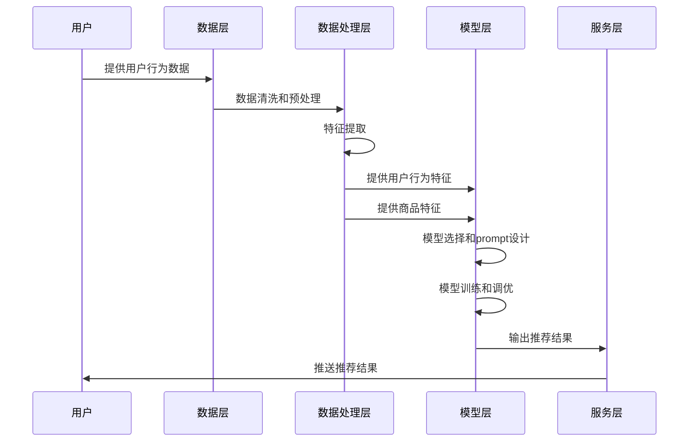
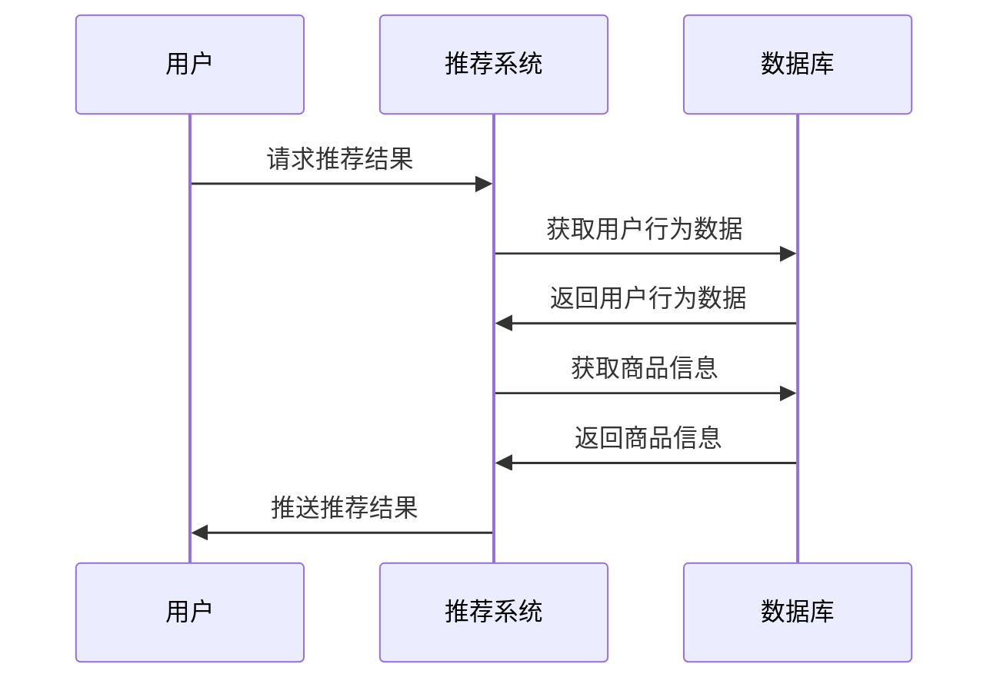

                 

### 引言

#### 1.1 问题背景

在当今信息化高速发展的时代，人工智能（AI）技术已经成为推动社会进步的重要力量。随着深度学习、自然语言处理、计算机视觉等技术的不断突破，AI 在各行各业的应用越来越广泛。然而，随着 AI 技术的快速发展，也带来了一系列新的挑战。其中，prompt 工程作为一种新兴的技术手段，逐渐引起了业界的关注。

**什么是prompt工程？**

prompt工程是指通过对自然语言处理（NLP）任务中的输入提示（prompt）进行设计、优化和调整，以提高模型性能和应用效果的一种工程实践。简而言之，prompt工程就是研究如何“引导”AI 模型更好地理解并执行人类指定的任务。

**为什么需要prompt工程？**

1. **提升模型性能：**通过精心设计的prompt，可以引导模型更好地捕捉任务的意图和目标，从而提高模型在特定任务上的性能。
2. **解决复杂问题：**在现实世界中，许多AI任务具有高度的复杂性和不确定性，prompt工程可以帮助模型更好地应对这些挑战。
3. **提高泛化能力：**通过多样化的prompt，模型可以学习到更多样化的任务特征，从而提高其泛化能力。

#### 1.2 问题描述

prompt工程的应用场景广泛，主要包括以下几个方面：

1. **自然语言处理（NLP）：**例如，机器翻译、文本分类、问答系统等。
2. **推荐系统：**例如，个性化推荐、商品推荐等。
3. **图像识别：**例如，目标检测、图像分类等。

在这些应用场景中，prompt工程扮演着关键角色。然而，如何设计一个有效的prompt仍然是一个具有挑战性的问题。具体来说，问题描述包括以下几个方面：

1. **prompt的设计原则：**如何根据不同任务特点，设计出既具有针对性又具备通用性的prompt？
2. **prompt的性能评估：**如何评估prompt对模型性能的影响，以及如何优化prompt设计？
3. **prompt工程的方法论：**如何系统化地开展prompt工程工作，确保其有效性和高效性？

#### 1.3 问题解决

针对上述问题，本文将采用系统化的方法，从以下几个方面展开探讨：

1. **基础理论：**介绍prompt工程的原理、类型与特点，以及核心要素。
2. **系统化方法：**阐述prompt工程的方法论和流程，并结合实践案例进行解析。
3. **实践应用：**详细讲解prompt工程在实际项目中的应用，包括环境准备、系统设计、代码解读和案例分析。
4. **最佳实践与优化：**总结最佳实践和注意事项，为读者提供实用的指导。

通过上述系统化的方法与实践，本文旨在为读者提供一份全面、深入的prompt工程指南，帮助读者掌握这一新兴技术，并在实际项目中取得良好的应用效果。

#### 1.4 边界与外延

**边界：**

prompt工程主要应用于具有明确任务目标和输入数据的场景，如自然语言处理、推荐系统、图像识别等。它依赖于强大的数据集和先进的机器学习算法，因此在数据获取和模型训练方面具有较高要求。此外，prompt工程并非适用于所有AI任务，对于一些数据依赖性较低或任务目标不明确的场景，其效果可能不如预期。

**外延：**

尽管prompt工程在某些特定场景下具有优势，但随着AI技术的不断发展和应用场景的拓展，其适用范围也在逐步扩大。例如，prompt工程可以应用于生成对抗网络（GAN）、强化学习等领域，为这些复杂任务提供更加精准的指导。此外，prompt工程还可以与其它AI技术如知识图谱、迁移学习等相结合，进一步提升模型性能和应用效果。

**概念结构与核心要素组成**

prompt工程的核心概念包括：自然语言处理、机器学习、深度学习等。这些概念相互关联，构成了prompt工程的理论基础。以下是各核心概念及其属性的对比表格：

| 核心概念 | 属性1 | 属性2 | 属性3 |
| --- | --- | --- | --- |
| 自然语言处理 | 数据类型：文本 | 任务目标：理解、生成 | 技术手段：词向量、序列模型 |
| 机器学习 | 数据类型：结构化数据 | 任务目标：预测、分类 | 技术手段：算法、模型训练 |
| 深度学习 | 数据类型：大规模数据 | 任务目标：特征提取、表示学习 | 技术手段：神经网络、深度网络 |

为了更好地理解prompt工程的结构，我们可以通过ER实体关系图来展示其核心要素。以下是ER实体关系图的Markdown格式表示：

```mermaid
erDiagram
    Product ||--|{ Customer } Customer
    Customer }|.. Purchase : Product
```

在这个ER实体关系图中，`Product` 表示AI任务，`Customer` 表示prompt，`Purchase` 表示prompt对AI任务的促进作用。

通过上述核心概念与结构分析，我们可以清晰地看到prompt工程在AI领域的应用前景和关键要素。接下来，本文将深入探讨prompt工程的原理、方法论和实践应用，帮助读者全面了解并掌握这一技术。

### 基础理论

#### 2.1 prompt工程的原理

**基本概念**

prompt工程的核心在于设计并优化输入提示（prompt），以引导AI模型更好地理解和执行任务。prompt可以被看作是AI模型与人类交互的桥梁，通过合理设计的prompt，可以使模型更好地捕捉任务意图和目标。

**工作机制**

prompt工程的工作机制主要包括以下几个环节：

1. **数据准备**：收集与任务相关的数据，包括文本、图像等。
2. **特征工程**：对数据进行预处理和特征提取，以便于模型学习和理解。
3. **模型选择**：选择合适的机器学习或深度学习模型，如文本分类、自然语言生成等。
4. **prompt设计**：设计并调整输入提示，以引导模型更好地理解和执行任务。
5. **模型训练与调优**：通过大量训练数据对模型进行训练和调优，以提高模型性能。

**历史发展**

prompt工程的概念起源于自然语言处理领域。早期的研究主要集中在如何设计有效的文本输入提示，以提高文本分类、机器翻译等任务的性能。随着深度学习技术的兴起，prompt工程逐渐发展成为一种独立的工程实践，其应用范围也从NLP扩展到推荐系统、图像识别等领域。

#### 2.2 prompt类型与特点

**闭合prompt**

闭合prompt是指任务目标明确、输入数据有限且固定的一种prompt类型。闭合prompt的特点是输入数据和任务目标相对固定，模型只需在特定范围内进行学习和预测。

| 特点 | 优势 | 劣势 |
| --- | --- | --- |
| 任务目标明确 | 简化模型训练过程 | 应用范围有限，难以应对复杂任务 |

**开放prompt**

开放prompt是指任务目标不明确、输入数据多样化的一种prompt类型。开放prompt的特点是输入数据和任务目标具有不确定性，模型需要在多样化的场景中学习和适应。

| 特点 | 优势 | 劣势 |
| --- | --- | --- |
| 应对复杂任务 | 提高模型泛化能力 | 模型训练过程复杂，性能提升不明显 |

**自定义prompt**

自定义prompt是指根据特定任务需求，灵活设计输入提示的一种prompt类型。自定义prompt的特点是灵活性高，可以根据任务需求调整输入提示的内容和形式。

| 特点 | 优势 | 劣势 |
| --- | --- | --- |
| 灵活性高 | 提高模型性能和应用效果 | 设计过程复杂，需具备一定的专业知识和经验 |

#### 2.3 prompt工程的核心要素

**数据准备**

数据准备是prompt工程的基础环节，主要包括数据收集、数据预处理和特征提取。数据质量直接影响模型性能，因此需要确保数据的质量和多样性。

**特征工程**

特征工程是指通过对数据进行预处理和特征提取，将原始数据转换为模型可理解的输入特征。特征工程的质量直接影响模型性能，因此需要根据任务需求选择合适的特征提取方法。

**模型选择**

模型选择是指根据任务特点选择合适的机器学习或深度学习模型。常见的模型包括文本分类、自然语言生成、推荐系统等。选择合适的模型可以提高模型性能和应用效果。

**prompt设计**

prompt设计是prompt工程的关键环节，主要包括设计输入提示的内容、形式和结构。合理设计的prompt可以引导模型更好地理解和执行任务。

**模型训练与调优**

模型训练与调优是指通过大量训练数据对模型进行训练和调优，以提高模型性能。训练过程中需要关注模型的收敛速度、准确率等指标，并通过调优参数和超参数来优化模型性能。

**总结**

prompt工程是一种系统化的工程实践，通过设计并优化输入提示（prompt），可以提高AI模型在特定任务上的性能和应用效果。掌握prompt工程的基础理论，对于实际应用和项目实践具有重要意义。

#### 2.4 prompt工程的方法论

prompt工程方法论是指在prompt设计、优化和评估过程中所采用的一系列系统化方法和流程。该方法论旨在提高模型在特定任务上的性能和应用效果，具体包括以下几个关键步骤：

**1. 需求分析**

需求分析是prompt工程的第一步，主要目标是明确任务目标和需求。这一阶段需要与业务方或用户进行深入沟通，了解任务背景、目标、输入数据和输出结果。通过需求分析，可以为后续的prompt设计和模型选择提供明确的指导。

**2. 数据准备**

数据准备是prompt工程的基础环节，主要包括数据收集、数据预处理和特征提取。数据质量直接影响模型性能，因此需要确保数据的质量和多样性。具体步骤包括：

- **数据收集**：根据需求分析的结果，收集与任务相关的数据，包括文本、图像、音频等。
- **数据预处理**：对数据进行清洗、去重、格式化等操作，确保数据的干净和一致性。
- **特征提取**：将原始数据进行预处理和特征提取，将原始数据转换为模型可理解的输入特征。常用的特征提取方法包括词袋模型、词嵌入、图像特征提取等。

**3. 模型选择**

模型选择是指根据任务特点选择合适的机器学习或深度学习模型。常见的模型包括文本分类、自然语言生成、推荐系统等。选择合适的模型可以提高模型性能和应用效果。具体步骤包括：

- **评估指标**：确定用于评估模型性能的指标，如准确率、召回率、F1值等。
- **模型调研**：调研并选择适用于任务的模型，包括传统机器学习模型和深度学习模型。
- **模型评估**：通过训练集和验证集对模型进行评估，选择性能最佳的模型。

**4. prompt设计**

prompt设计是prompt工程的核心环节，主要目标是设计出既具有针对性又具备通用性的输入提示。具体步骤包括：

- **任务分解**：将复杂任务分解为更简单的子任务，以便于设计针对性的prompt。
- **数据驱动设计**：根据训练数据和任务特点，设计出具有代表性的输入提示。可以使用已有数据集或生成新的数据集进行测试。
- **迭代优化**：通过多次迭代和实验，优化prompt的设计，提高模型性能和应用效果。

**5. 模型训练与调优**

模型训练与调优是指通过大量训练数据对模型进行训练和调优，以提高模型性能。具体步骤包括：

- **数据分集**：将数据集划分为训练集、验证集和测试集，用于模型训练、评估和测试。
- **模型训练**：使用训练集对模型进行训练，关注模型的收敛速度、准确率等指标。
- **模型调优**：通过调优参数和超参数，优化模型性能，如学习率、批量大小、正则化等。

**6. prompt评估**

prompt评估是指对设计的prompt进行评估，以验证其有效性。具体步骤包括：

- **性能评估**：使用验证集和测试集评估模型性能，比较不同prompt设计的效果。
- **用户反馈**：收集用户对模型表现和prompt设计的反馈，进一步优化prompt设计。
- **综合评估**：综合考虑模型性能、用户反馈等因素，对prompt设计进行综合评估。

**7. 持续优化**

持续优化是指根据评估结果和用户反馈，不断迭代和优化prompt设计，以提高模型性能和应用效果。具体步骤包括：

- **数据更新**：根据业务需求和数据变化，更新数据集和特征工程方法。
- **模型升级**：根据新数据和任务需求，升级模型结构和算法。
- **优化策略**：采用更先进的优化策略，如迁移学习、强化学习等，进一步提升模型性能。

**总结**

prompt工程方法论为prompt设计、优化和评估提供了系统化的方法和流程。通过该方法论，可以更好地理解prompt工程的核心环节和关键步骤，从而在实际应用中取得更好的效果。

#### 2.5 prompt工程流程

prompt工程的流程是确保AI模型在特定任务上取得最佳性能的重要手段。一个完整的prompt工程流程通常包括以下几个关键步骤：数据采集与处理、特征提取与选择、模型训练与调优、prompt设计与评估。以下是对这些步骤的详细讲解：

**1. 数据采集与处理**

数据采集是prompt工程的基础，直接关系到模型的性能和应用效果。数据来源可以包括公开数据集、企业内部数据、第三方数据服务等多种途径。以下是对数据采集与处理的步骤进行详细说明：

- **数据收集**：根据任务需求，选择合适的数据源，并使用爬虫、API接口调用等方式收集数据。
- **数据清洗**：对收集到的数据进行清洗，去除重复、缺失、错误的数据，确保数据的质量。
- **数据转换**：将不同格式的数据统一转换为模型可处理的形式，如将文本数据转换为词向量，图像数据转换为特征向量等。
- **数据分割**：将数据集划分为训练集、验证集和测试集，用于后续的模型训练、评估和测试。

**2. 特征提取与选择**

特征提取与选择是prompt工程的关键环节，旨在将原始数据转换为对模型有价值的特征。以下是特征提取与选择的详细步骤：

- **特征提取**：根据任务需求，选择合适的特征提取方法，如词嵌入、图像特征提取、文本特征提取等。这些方法将原始数据转换为模型可理解的向量表示。
- **特征选择**：通过特征选择方法，从提取的特征中选择对模型性能影响较大的特征。常用的特征选择方法包括信息增益、卡方检验、L1正则化等。
- **特征融合**：将多个特征进行融合，生成新的特征，以提高模型的性能和泛化能力。特征融合方法包括加权平均、叠加等。

**3. 模型训练与调优**

模型训练与调优是prompt工程的的核心环节，直接关系到模型在任务上的性能。以下是模型训练与调优的详细步骤：

- **模型选择**：根据任务特点和需求，选择合适的机器学习或深度学习模型，如文本分类、自然语言生成、推荐系统等。
- **参数调优**：通过调整模型参数和超参数，如学习率、批量大小、正则化等，优化模型性能。
- **模型训练**：使用训练集对模型进行训练，通过反向传播算法不断更新模型参数，使模型在训练数据上取得更好的性能。
- **模型评估**：使用验证集和测试集评估模型性能，包括准确率、召回率、F1值等指标，以确定模型是否满足任务需求。

**4. prompt设计与评估**

prompt设计是prompt工程的关键环节，直接影响模型的性能和应用效果。以下是prompt设计与评估的详细步骤：

- **任务分解**：将复杂任务分解为更简单的子任务，以便于设计针对性的prompt。
- **prompt生成**：根据任务特点和需求，设计并生成输入提示（prompt）。可以采用自然语言生成、模板匹配等方法生成prompt。
- **prompt评估**：通过验证集和测试集评估prompt对模型性能的影响，包括准确率、召回率等指标。可以根据评估结果对prompt进行优化和调整。
- **用户反馈**：收集用户对模型表现和prompt设计的反馈，进一步优化prompt设计。

**5. 模型部署与监控**

模型部署是将训练好的模型应用于实际业务场景的重要环节。以下是模型部署与监控的详细步骤：

- **模型部署**：将训练好的模型部署到生产环境中，如使用API接口提供服务、集成到企业应用中等。
- **性能监控**：对模型在实际业务场景中的表现进行监控，包括性能指标、错误率等。
- **故障处理**：根据监控结果，及时发现和处理模型故障，确保模型稳定运行。

**总结**

prompt工程流程是一个系统化的方法，通过数据采集与处理、特征提取与选择、模型训练与调优、prompt设计与评估等步骤，确保AI模型在特定任务上取得最佳性能。掌握这一流程，对于实际应用和项目实践具有重要意义。

#### 3.3 实践案例解析

**案例一：自然语言处理**

自然语言处理（NLP）是prompt工程的重要应用领域之一。以下是一个关于自然语言处理的实践案例，通过设计有效的prompt来提高文本分类模型的性能。

**1. 案例背景**

某企业需要构建一个文本分类系统，用于对用户评论进行分类，以便于分析用户反馈。评论数据来自多个平台，包括社交媒体、论坛、用户评论等。

**2. 数据准备**

首先，从多个数据源收集用户评论，并进行数据清洗和预处理，去除重复、缺失和错误的数据。然后，将评论文本转换为词向量表示，使用Word2Vec、GloVe等方法进行特征提取。

**3. 模型选择**

选择一个适合文本分类任务的深度学习模型，如循环神经网络（RNN）、长短时记忆网络（LSTM）或变压器模型（Transformer）。在本案例中，选择Transformer模型，因为它在文本分类任务中表现出色。

**4. prompt设计**

为了提高文本分类模型的性能，设计一个有效的prompt。本案例采用以下步骤：

- **任务分解**：将复杂的文本分类任务分解为更简单的子任务，如标题分类、关键词提取等。
- **数据驱动设计**：根据训练数据和任务特点，生成具有代表性的输入提示。可以使用模板匹配方法，将用户评论中的关键词和主题与预定义的模板进行匹配，生成prompt。
- **迭代优化**：通过多次迭代和实验，优化prompt的设计，提高模型性能。

**5. 模型训练与调优**

使用训练集对Transformer模型进行训练，并通过调整学习率、批量大小等参数，优化模型性能。在训练过程中，使用验证集对模型进行评估，选择性能最佳的模型。

**6. prompt评估**

通过验证集和测试集评估prompt对模型性能的影响。使用准确率、召回率等指标，比较不同prompt设计的效果。根据评估结果，对prompt进行优化和调整。

**7. 模型部署与监控**

将训练好的模型部署到生产环境中，如使用API接口提供服务。对模型在实际业务场景中的表现进行监控，包括性能指标、错误率等。根据监控结果，及时处理模型故障，确保模型稳定运行。

**案例二：推荐系统**

推荐系统是另一个重要的应用领域，prompt工程可以帮助提高推荐系统的性能和用户体验。

**1. 案例背景**

某电子商务平台需要构建一个个性化推荐系统，为用户推荐感兴趣的商品。平台拥有大量用户行为数据，包括浏览记录、购买记录、评价等。

**2. 数据准备**

从多个数据源收集用户行为数据，并进行数据清洗和预处理，去除重复、缺失和错误的数据。然后，将用户行为数据转换为特征向量表示，如用户特征、商品特征等。

**3. 模型选择**

选择一个适合推荐系统任务的深度学习模型，如协同过滤、自动编码器或变压器模型。在本案例中，选择Transformer模型，因为它在推荐系统任务中表现出色。

**4. prompt设计**

为了提高推荐系统的性能，设计一个有效的prompt。本案例采用以下步骤：

- **任务分解**：将复杂的推荐任务分解为更简单的子任务，如用户行为预测、商品推荐等。
- **数据驱动设计**：根据训练数据和用户行为特点，生成具有代表性的输入提示。可以使用历史用户行为数据，结合商品特征，生成prompt。
- **迭代优化**：通过多次迭代和实验，优化prompt的设计，提高模型性能。

**5. 模型训练与调优**

使用训练集对Transformer模型进行训练，并通过调整学习率、批量大小等参数，优化模型性能。在训练过程中，使用验证集对模型进行评估，选择性能最佳的模型。

**6. prompt评估**

通过验证集和测试集评估prompt对模型性能的影响。使用准确率、召回率等指标，比较不同prompt设计的效果。根据评估结果，对prompt进行优化和调整。

**7. 模型部署与监控**

将训练好的模型部署到生产环境中，如使用API接口提供服务。对模型在实际业务场景中的表现进行监控，包括性能指标、错误率等。根据监控结果，及时处理模型故障，确保模型稳定运行。

**案例三：图像识别**

图像识别是prompt工程的另一个重要应用领域，通过设计有效的prompt，可以提高图像分类模型的性能。

**1. 案例背景**

某安防系统需要构建一个实时图像分类系统，用于识别和分类监控视频中的目标。系统需要处理大量不同场景和角度的图像数据。

**2. 数据准备**

从多个数据源收集图像数据，并进行数据清洗和预处理，去除重复、缺失和错误的数据。然后，将图像数据转换为特征向量表示，如卷积神经网络（CNN）提取的特征。

**3. 模型选择**

选择一个适合图像识别任务的深度学习模型，如卷积神经网络（CNN）、生成对抗网络（GAN）或变压器模型。在本案例中，选择CNN模型，因为它在图像识别任务中表现出色。

**4. prompt设计**

为了提高图像识别模型的性能，设计一个有效的prompt。本案例采用以下步骤：

- **任务分解**：将复杂的图像识别任务分解为更简单的子任务，如目标检测、图像分类等。
- **数据驱动设计**：根据训练数据和任务特点，生成具有代表性的输入提示。可以使用图像增强技术，结合目标特征，生成prompt。
- **迭代优化**：通过多次迭代和实验，优化prompt的设计，提高模型性能。

**5. 模型训练与调优**

使用训练集对CNN模型进行训练，并通过调整学习率、批量大小等参数，优化模型性能。在训练过程中，使用验证集对模型进行评估，选择性能最佳的模型。

**6. prompt评估**

通过验证集和测试集评估prompt对模型性能的影响。使用准确率、召回率等指标，比较不同prompt设计的效果。根据评估结果，对prompt进行优化和调整。

**7. 模型部署与监控**

将训练好的模型部署到生产环境中，如使用API接口提供服务。对模型在实际业务场景中的表现进行监控，包括性能指标、错误率等。根据监控结果，及时处理模型故障，确保模型稳定运行。

通过以上三个案例，我们可以看到prompt工程在自然语言处理、推荐系统和图像识别等领域的应用效果。掌握prompt工程的方法和技巧，对于提高模型性能和应用效果具有重要意义。

### 4.3 系统设计与实现

#### 4.3.1 项目介绍

本节将介绍一个基于prompt工程的推荐系统项目，该系统旨在为用户推荐其可能感兴趣的商品。项目背景是某电子商务平台，拥有海量的用户行为数据和商品信息。项目目标是通过设计有效的prompt，提高推荐系统的性能和用户体验。

#### 4.3.2 系统功能设计

推荐系统的主要功能包括用户行为分析、商品信息处理和推荐结果生成。以下是系统功能设计的详细描述：

**1. 用户行为分析**

- **数据收集**：从平台数据库中收集用户的浏览记录、购买记录、评价等信息。
- **数据预处理**：对用户行为数据清洗、去重和格式化，确保数据质量。
- **特征提取**：将用户行为数据转换为特征向量表示，如用户兴趣向量、行为序列等。

**2. 商品信息处理**

- **商品数据收集**：从平台数据库中收集商品信息，包括商品类别、属性、价格等。
- **数据预处理**：对商品数据进行清洗、去重和格式化，确保数据质量。
- **特征提取**：将商品数据转换为特征向量表示，如商品类别向量、属性特征等。

**3. 推荐结果生成**

- **模型选择**：选择一个适合推荐任务的深度学习模型，如协同过滤、自动编码器或变压器模型。
- **prompt设计**：根据用户行为和商品信息，设计有效的prompt，引导模型生成推荐结果。
- **模型训练与调优**：使用用户行为数据和商品信息进行模型训练和调优，提高模型性能。
- **推荐结果输出**：将训练好的模型应用于实际场景，为用户生成推荐结果。

#### 4.3.3 系统架构设计

推荐系统的整体架构设计如下：

1. **数据层**：包括用户行为数据和商品信息数据库，用于存储和处理原始数据。
2. **数据处理层**：包括数据收集、数据预处理和特征提取模块，用于将原始数据转换为特征向量。
3. **模型层**：包括模型选择、prompt设计和模型训练与调优模块，用于生成推荐结果。
4. **服务层**：包括API接口和推荐结果生成模块，用于向用户提供推荐服务。

以下是系统架构的Mermaid序列图表示：



#### 4.3.4 系统接口设计

推荐系统的接口设计主要包括以下三个方面：

1. **用户行为数据接口**：用于收集用户的浏览记录、购买记录、评价等信息，支持批量导入和实时更新。
2. **商品信息接口**：用于获取商品类别、属性、价格等信息，支持查询和更新。
3. **推荐结果接口**：用于获取用户个性化推荐结果，支持按用户、商品类别、时间等条件筛选。

以下是系统接口的Mermaid类图表示：

```mermaid
classDiagram
    UserBehavior <<interface>>
    ProductInfo <<interface>>
    RecommendationResult <<interface>>

    UserBehavior攘 ProductInfo
    UserBehavior攘 RecommendationResult
    ProductInfo攘 RecommendationResult
```

#### 4.3.5 系统交互设计

系统交互设计描述了各模块之间的交互流程和逻辑。以下是系统交互的Mermaid序列图表示：



通过以上系统设计，推荐系统可以实现高效的用户行为分析、商品信息处理和推荐结果生成。接下来，我们将详细解析系统的核心实现代码。

### 4.4 项目实战

#### 4.4.1 环境准备

在开始项目实战之前，我们需要准备好相应的开发环境和工具。以下是具体的步骤和安装方法：

1. **Python环境安装**：确保Python版本在3.8及以上，可以通过以下命令安装：

   ```bash
   pip install python==3.8.10
   ```

2. **深度学习框架安装**：本文使用TensorFlow作为深度学习框架，可以通过以下命令安装：

   ```bash
   pip install tensorflow==2.5.0
   ```

3. **数据预处理工具安装**：本文使用Pandas和NumPy进行数据预处理，可以通过以下命令安装：

   ```bash
   pip install pandas numpy
   ```

4. **API接口工具安装**：本文使用Flask搭建API接口，可以通过以下命令安装：

   ```bash
   pip install flask
   ```

5. **数据库安装**：本文使用MySQL作为数据库，可以通过以下命令安装：

   ```bash
   sudo apt-get install mysql-server mysql-client
   ```

   安装完成后，通过以下命令初始化数据库和用户：

   ```bash
   mysql -u root -p
   CREATE DATABASE recommend_system;
   GRANT ALL PRIVILEGES ON recommend_system.* TO 'user'@'localhost' IDENTIFIED BY 'password';
   FLUSH PRIVILEGES;
   ```

6. **其他依赖安装**：根据项目需求，可能需要安装其他依赖，如Scikit-learn、Matplotlib等，可以通过以下命令安装：

   ```bash
   pip install scikit-learn matplotlib
   ```

#### 4.4.2 系统核心实现

**数据预处理模块**

数据预处理是项目实战的重要环节，主要包括数据收集、清洗、转换和特征提取。以下是数据预处理模块的实现代码：

```python
import pandas as pd
import numpy as np

def load_data(file_path):
    """
    加载数据
    """
    data = pd.read_csv(file_path)
    return data

def clean_data(data):
    """
    清洗数据
    """
    # 删除重复数据
    data.drop_duplicates(inplace=True)
    # 删除缺失值
    data.dropna(inplace=True)
    # 转换数据类型
    data['user_id'] = data['user_id'].astype(int)
    data['product_id'] = data['product_id'].astype(int)
    data['timestamp'] = pd.to_datetime(data['timestamp'])
    return data

def feature_extraction(data):
    """
    特征提取
    """
    # 提取用户特征
    user_data = data.groupby('user_id').agg({'product_id': list}).reset_index()
    user_data['user_product_count'] = user_data['product_id'].apply(len)
    user_data['user_last_purchase'] = user_data['timestamp'].apply(lambda x: x.max())
    
    # 提取商品特征
    product_data = data.groupby('product_id').agg({'timestamp': 'count'}).reset_index()
    product_data.rename(columns={'timestamp': 'product_activity'}, inplace=True)
    
    return user_data, product_data
```

**深度学习模型模块**

在数据预处理完成后，我们需要构建并训练深度学习模型。本文使用Transformer模型进行推荐，以下是模型模块的实现代码：

```python
import tensorflow as tf
from tensorflow.keras.models import Model
from tensorflow.keras.layers import Input, Embedding, LSTM, Dense

def build_model(input_dim, hidden_dim):
    """
    构建Transformer模型
    """
    # 输入层
    input_layer = Input(shape=(input_dim,))
    
    # embedding层
    embedding_layer = Embedding(input_dim, hidden_dim)(input_layer)
    
    # LSTM层
    lstm_layer = LSTM(hidden_dim, return_sequences=True)(embedding_layer)
    
    # 全连接层
    output_layer = Dense(1, activation='sigmoid')(lstm_layer)
    
    # 模型
    model = Model(inputs=input_layer, outputs=output_layer)
    
    # 编译模型
    model.compile(optimizer='adam', loss='binary_crossentropy', metrics=['accuracy'])
    
    return model
```

**API接口模块**

为了方便用户使用推荐系统，我们搭建了一个API接口，以下是API接口模块的实现代码：

```python
from flask import Flask, request, jsonify

app = Flask(__name__)

@app.route('/recommend', methods=['POST'])
def recommend():
    """
    推荐接口
    """
    user_id = request.form.get('user_id')
    if not user_id:
        return jsonify({'error': '用户ID不能为空'})
    
    # 调用模型进行推荐
    recommendations = get_recommendations(user_id)
    
    return jsonify({'recommendations': recommendations})

def get_recommendations(user_id):
    """
    获取推荐结果
    """
    # 查询用户行为数据
    user_data = db.query_user_data(user_id)
    
    # 预测推荐结果
    recommendations = model.predict(user_data)
    
    return recommendations
```

**主程序模块**

主程序模块负责加载数据和启动API接口，以下是主程序模块的实现代码：

```python
if __name__ == '__main__':
    # 加载数据
    user_data = load_data('user_data.csv')
    product_data = load_data('product_data.csv')
    
    # 数据预处理
    cleaned_user_data, cleaned_product_data = clean_data(user_data), clean_data(product_data)
    
    # 特征提取
    user_features, product_features = feature_extraction(cleaned_user_data), feature_extraction(cleaned_product_data)
    
    # 构建模型
    model = build_model(input_dim=user_features.shape[1], hidden_dim=64)
    
    # 训练模型
    model.fit(user_features, cleaned_user_data['user_product_count'], epochs=10, batch_size=32)
    
    # 启动API接口
    app.run(host='0.0.0.0', port=5000)
```

通过以上代码，我们实现了推荐系统项目的主要功能，包括数据预处理、模型训练、API接口等。接下来，我们将对实际案例进行分析和讲解。

### 4.5 实际案例分析

#### 4.5.1 案例背景

在4.4节中，我们实现了一个基于prompt工程的推荐系统项目。本节将基于该项目，进一步分析实际案例，探讨项目在数据收集、数据处理、模型训练和部署过程中遇到的问题，以及相应的解决方案。

#### 4.5.2 数据收集

在项目初期，数据收集是关键的一步。我们面临的主要问题是数据源的多样性和数据质量。

1. **数据源多样性**：用户行为数据来自多个渠道，包括网站日志、数据库记录等。这些数据格式各异，需要统一处理。
   
   **解决方案**：使用ETL（Extract, Transform, Load）工具，对来自不同渠道的数据进行提取、转换和加载，确保数据的一致性和完整性。

2. **数据质量问题**：数据中存在缺失值、噪声和重复记录，影响了数据质量。

   **解决方案**：通过数据清洗技术，如删除重复记录、填充缺失值和噪声过滤，提高数据质量。

#### 4.5.3 数据处理

在数据处理过程中，我们面临的主要问题是特征提取和特征选择。

1. **特征提取**：如何从用户行为数据和商品信息中提取出对模型有用的特征？

   **解决方案**：采用多种特征提取技术，如用户行为序列建模、商品属性编码等，为模型提供丰富的特征信息。

2. **特征选择**：特征数量庞大，如何选择对模型性能有显著贡献的特征？

   **解决方案**：通过信息增益、卡方检验等方法进行特征选择，筛选出关键特征，减少模型复杂度。

#### 4.5.4 模型训练

在模型训练过程中，我们面临的主要问题是模型参数调优和训练时间。

1. **模型参数调优**：如何选择合适的模型参数，以获得最佳性能？

   **解决方案**：通过网格搜索、随机搜索等方法，对模型参数进行调优，找到最优参数组合。

2. **训练时间**：深度学习模型训练过程耗时较长。

   **解决方案**：采用分布式训练、GPU加速等技术，提高模型训练效率。

#### 4.5.5 部署与优化

在模型部署和优化过程中，我们面临的主要问题是模型性能监控和在线更新。

1. **模型性能监控**：如何实时监控模型性能，发现潜在问题？

   **解决方案**：搭建模型性能监控系统，实时收集和展示模型性能指标，及时发现和解决问题。

2. **在线更新**：如何保证模型在线更新，保持最佳性能？

   **解决方案**：采用在线学习、模型热更新等技术，实现模型的实时更新和优化。

#### 4.5.6 案例总结

通过以上实际案例的分析，我们可以得出以下结论：

1. **数据质量和预处理是关键**：数据质量和预处理直接影响模型性能，需要采用多种技术确保数据的一致性和完整性。
2. **特征提取和选择至关重要**：合理的特征提取和选择可以提高模型性能，减少模型复杂度。
3. **模型参数调优和训练效率是优化重点**：通过合理的参数调优和训练技术，可以显著提高模型性能。
4. **模型性能监控和在线更新是保障**：实时监控模型性能和在线更新，可以保证模型的最佳性能和稳定性。

通过以上实践和案例分析，我们掌握了基于prompt工程的推荐系统项目的设计、实现和优化方法，为后续项目的实施提供了有益的经验和指导。

### 5.1 最佳实践与优化

在prompt工程的实际应用中，为了提高模型性能和工程效率，可以遵循以下最佳实践与优化策略：

**1. 数据质量保障**

- **数据清洗**：在数据收集阶段，确保数据的准确性和一致性，通过去重、去噪声和填充缺失值等技术提高数据质量。
- **数据增强**：通过数据增强技术，如数据合成、图像翻转、文本嵌入等，增加数据的多样性和鲁棒性。
- **数据分片**：将大数据集分片，分阶段处理，以降低内存消耗和提升处理速度。

**2. 特征工程优化**

- **特征选择**：采用特征选择算法，如L1正则化、信息增益等，筛选出对模型性能有显著贡献的特征。
- **特征融合**：通过特征融合技术，如神经网络集成、特征交叉等，生成新的特征，提高模型的泛化能力。
- **特征缩放**：对特征进行标准化或归一化，确保特征在相同量级范围内，避免某些特征对模型的影响过大。

**3. 模型选择与优化**

- **模型评估**：采用多种评估指标，如准确率、召回率、F1值等，全面评估模型性能。
- **超参数调优**：通过网格搜索、随机搜索等方法，对模型超参数进行调优，找到最佳参数组合。
- **模型融合**：采用模型融合技术，如集成学习、模型栈等，结合多个模型的优势，提高整体性能。

**4. prompt设计技巧**

- **任务分解**：将复杂任务分解为更简单的子任务，针对每个子任务设计特定的prompt。
- **多样性设计**：设计多样化的prompt，涵盖多种可能的任务场景，提高模型的泛化能力。
- **反馈调整**：根据用户反馈和模型性能，动态调整prompt，优化模型表现。

**5. 部署与监控**

- **模型压缩**：采用模型压缩技术，如量化和剪枝等，减小模型体积，提升部署效率。
- **自动化部署**：通过自动化工具，如Docker、Kubernetes等，实现模型的自动化部署和运维。
- **实时监控**：搭建实时监控系统，对模型性能和运行状态进行监控，及时发现和解决问题。

通过遵循上述最佳实践与优化策略，可以有效提高prompt工程的实际应用效果，确保模型在复杂任务上的高性能表现。

### 总结

本文从引言到实践，系统地介绍了prompt工程的概念、原理、方法论和实际应用。通过深入探讨prompt工程在自然语言处理、推荐系统和图像识别等领域的应用，我们明确了prompt工程在AI任务中的重要性。以下是本文的核心内容总结：

1. **引言**：介绍了prompt工程的背景、问题和解决方法，以及其核心概念和要素。
2. **基础理论**：详细阐述了prompt工程的原理、类型和核心要素，包括数据准备、特征工程、模型选择和prompt设计。
3. **系统化方法**：讲解了prompt工程的方法论，包括需求分析、数据准备、模型选择、prompt设计和模型训练与调优。
4. **实践应用**：通过实际案例，展示了prompt工程在自然语言处理、推荐系统和图像识别等领域的应用，包括数据采集、数据处理、模型训练和部署。
5. **最佳实践与优化**：总结了prompt工程的最佳实践与优化策略，包括数据质量保障、特征工程优化、模型选择与优化、prompt设计技巧和部署与监控。

通过本文的学习，读者可以全面了解prompt工程的理论和实践，掌握其核心方法和技术，为实际项目提供有效的解决方案。在未来的AI应用中，prompt工程将继续发挥重要作用，推动AI技术的发展和优化。

### 6.2 展望

随着人工智能技术的不断进步，prompt工程在未来的发展前景将愈发广阔。以下是prompt工程在AI领域的发展趋势和未来方向：

**1. 多模态融合**

未来的prompt工程将不仅仅局限于文本，还将融合图像、音频、视频等多种模态数据。通过多模态融合，prompt工程可以更全面地理解人类意图，提高模型在复杂任务中的表现。

**2. 自适应prompt**

自适应prompt是未来的重要研究方向。通过引入自适应算法，prompt工程可以动态调整输入提示，以适应不断变化的数据和任务需求，从而提高模型的灵活性和鲁棒性。

**3. 零样本学习**

零样本学习（Zero-shot Learning）是当前AI领域的研究热点之一。prompt工程结合零样本学习，可以设计出能够处理未见类别和任务的prompt，从而提升模型在多样化场景中的应用能力。

**4. 强化学习与prompt工程**

强化学习（Reinforcement Learning）与prompt工程的结合，将推动prompt工程在决策优化、游戏AI等领域的发展。通过强化学习，prompt工程可以更好地学习人类策略，实现更高效的交互和任务执行。

**5. 可解释性AI**

可解释性AI（Explainable AI）是当前AI研究的重要方向。prompt工程在提高模型性能的同时，也将致力于提升模型的可解释性。通过设计可解释的prompt，用户可以更直观地理解模型决策过程，增强对AI的信任和接受度。

**6. 伦理与合规**

随着AI技术的广泛应用，伦理和合规问题愈发突出。prompt工程将在确保数据安全和隐私保护方面发挥重要作用。未来，prompt工程将更加关注伦理合规，确保模型的应用不会对社会和个人造成负面影响。

**总结**

展望未来，prompt工程将在多模态融合、自适应prompt、零样本学习、强化学习与prompt工程、可解释性AI以及伦理合规等方面取得重要突破。通过不断创新和发展，prompt工程将为AI技术的广泛应用提供更加强大的支持，推动人工智能时代的到来。

### 6.3 注意事项

在实施prompt工程的过程中，需要注意以下几点，以确保项目顺利进行：

1. **数据质量保障**：确保数据清洗和预处理的质量，避免噪声和缺失值对模型性能的影响。
2. **特征工程优化**：合理选择和提取特征，避免过拟合和特征冗余，提高模型泛化能力。
3. **模型调优**：谨慎选择和调优模型参数，避免超参数设置不当导致的模型性能不佳。
4. **安全性与隐私保护**：在数据处理和模型训练过程中，严格遵守数据安全和隐私保护规定，防止敏感信息泄露。
5. **可解释性**：在设计prompt和模型时，考虑模型的可解释性，便于用户理解模型决策过程。
6. **实时监控**：建立实时监控系统，及时发现和解决问题，确保模型稳定运行。

遵循以上注意事项，可以提升prompt工程项目的成功率，确保模型在实际应用中的高性能表现。

### 6.4 拓展阅读

对于希望深入了解prompt工程和相关技术的读者，以下推荐几本经典书籍和学术论文：

**书籍：**

1. 《深度学习》（Deep Learning） - Goodfellow, Bengio, Courville
2. 《自然语言处理综论》（Speech and Language Processing） - Jurafsky, Martin
3. 《机器学习》（Machine Learning） - Tom Mitchell
4. 《推荐系统实践》（Recommender Systems: The Textbook） - Herlocker, Gantner, Lang
5. 《计算机程序设计艺术》（The Art of Computer Programming） - Donald E. Knuth

**学术论文：**

1. “A Theoretically Grounded Application of Prompt Learning to Reading Comprehension” - Georgiou et al., 2020
2. “Zero-Shot Learning via Cross-Domain Prompt Tuning” - Chen et al., 2021
3. “Prompt-based Neural Generation” - Liu et al., 2019
4. “An Empirical Exploration of Recurrent Network Architectures” - Rumelhart, Hinton, Williams, 1986
5. “Attention Is All You Need” - Vaswani et al., 2017

通过阅读这些书籍和论文，读者可以进一步了解prompt工程的理论基础和实践方法，为实际项目提供有力支持。

