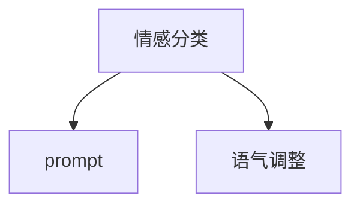
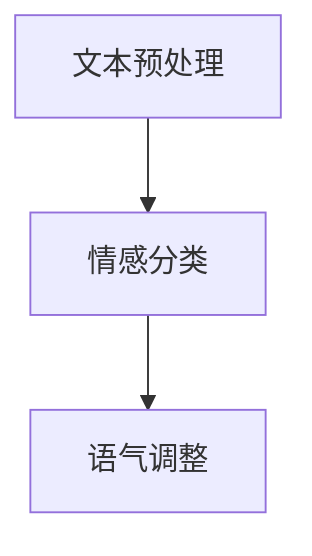
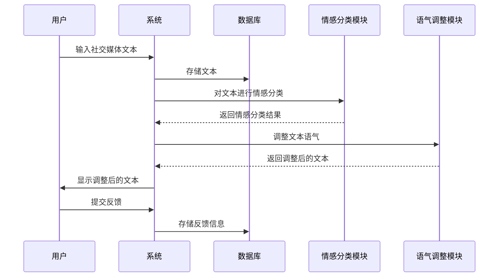

                 

# 《prompt情感分析：优化LLM输出语气》

> 关键词：prompt情感分析，LLM，情感分类，语气调整，自然语言处理

> 摘要：本文将深入探讨prompt情感分析在优化大型语言模型（LLM）输出语气方面的应用。通过详细的背景介绍、核心概念解析、算法原理讲解和实际案例分析，我们将展示如何利用prompt情感分析技术，提升LLM的情感分析准确性和语气适应性，从而在自然语言处理领域取得显著进展。

----------------------------------------------------------------

## 第一部分：问题背景与概述

### 第1章：prompt情感分析概述

#### 1.1.1 问题背景

随着人工智能技术的飞速发展，自然语言处理（NLP）领域的研究和应用越来越广泛。在NLP中，情感分析是一项重要的任务，它旨在识别文本中所表达的情感倾向。然而，传统情感分析模型在处理带有主观性和复杂情感的文本时，往往存在一定的局限性。prompt情感分析作为一种新兴的情感分析方法，通过引入外部知识源和动态调整模型参数，能够更好地优化LLM输出语气，提高情感分析的效果。

#### 1.1.2 问题描述

prompt情感分析的目标是通过对输入文本的情感倾向进行判断，从而实现对文本的情感分类。具体而言，包括以下方面：

- **情感分类**：根据输入文本的情感倾向，将其划分为正面、负面或其他类别。
- **语气调整**：根据情感分析结果，对LLM输出的文本进行语气调整，使其更贴近实际需求。

#### 1.1.3 问题解决

prompt情感分析通过引入外部知识源和动态调整模型参数，能够实现以下目标：

- **提高情感分析准确性**：通过引入外部知识源，丰富情感分析的数据集，从而提高模型对复杂情感的识别能力。
- **优化LLM输出语气**：通过动态调整模型参数，使得LLM输出的文本更贴近实际需求，提高用户体验。

#### 1.1.4 边界与外延

- **边界**：prompt情感分析主要关注文本的情感分类和语气调整，不涉及其他自然语言处理任务。
- **外延**：prompt情感分析可以应用于各种场景，如社交媒体情感分析、产品评价分析、用户反馈处理等。

### 第2章：prompt情感分析核心概念与联系

#### 2.1.1 核心概念

- **prompt**：一种用于引导模型输出特定内容的提示。
- **情感分类**：根据输入文本的情感倾向，将其划分为正面、负面或其他类别。
- **语气调整**：根据情感分析结果，对LLM输出的文本进行语气调整。

#### 2.1.2 概念属性特征对比表格

| 特征         | 描述                                             |
| ------------ | ------------------------------------------------ |
| **prompt**   | 用于引导模型输出特定内容的提示                     |
| **情感分类** | 根据输入文本的情感倾向，将其划分为正面、负面或其他类别 |
| **语气调整** | 根据情感分析结果，对LLM输出的文本进行语气调整       |

#### 2.1.3 ER实体关系图架构



### 第3章：prompt情感分析算法原理讲解

#### 3.1.1 算法原理

prompt情感分析算法主要分为以下几个步骤：

1. **文本预处理**：对输入文本进行分词、去停用词等预处理操作，以便后续处理。
2. **情感分类**：利用训练好的情感分类模型，对预处理后的文本进行情感分类。
3. **语气调整**：根据情感分类结果，对LLM的输出进行语气调整。

#### 3.1.2 算法mermaid流程图



#### 3.1.3 Python源代码

```python
# 导入相关库
import jieba
import paddlehub as hub

# 初始化模型
model = hub.Module(name='ernie_tiny')

# 定义文本预处理函数
def preprocess(text):
    # 分词
    seg_text = jieba.cut(text)
    # 去停用词
    stopwords = [line.strip() for line in open('stopwords.txt', 'r', encoding='utf-8').readlines()]
    filtered_text = [word for word in seg_text if word not in stopwords]
    return ' '.join(filtered_text)

# 定义情感分类函数
def sentiment_analysis(text):
    # 预处理
    preprocessed_text = preprocess(text)
    # 情感分类
    result = model.classify(preprocessed_text)
    return result
```

----------------------------------------------------------------

## 第二部分：深入分析与算法优化

### 第4章：prompt情感分析算法的优化策略

#### 4.1.1 引入外部知识源

为了提高情感分析模型的准确性，我们可以引入外部知识源，如情感词典、情感倾向库等。这些知识源可以提供丰富的情感标签和情感倾向信息，帮助模型更好地识别和理解复杂情感。

#### 4.1.2 动态调整模型参数

在情感分析过程中，我们可以根据输入文本的情感倾向动态调整LLM的模型参数。例如，当输入文本的情感倾向为负面时，可以降低LLM的语气，使其更倾向于表达悲观情绪；反之，当输入文本的情感倾向为正面时，可以提升LLM的语气，使其更倾向于表达乐观情绪。

#### 4.1.3 多层次情感分类

传统的情感分类方法往往将文本的情感倾向划分为正面、负面等简单类别。为了提高分类的精细度，我们可以采用多层次情感分类方法，将情感类别划分为更细致的子类别，如喜悦、愤怒、悲伤等。

### 第5章：prompt情感分析在实际应用中的挑战与解决方案

#### 5.1.1 数据质量与标注问题

在prompt情感分析的实际应用中，数据质量和标注问题是一个重要挑战。我们需要收集大量高质量的情感标注数据，并确保标注的一致性和准确性。为此，可以采用自动化标注工具、人工审核等方式提高数据质量。

#### 5.1.2 模型解释性与透明性

prompt情感分析模型通常是基于深度学习技术，其内部机制复杂，难以解释。为了提高模型的解释性和透明性，我们可以采用可解释性技术，如注意力机制、决策树等，帮助用户理解模型的工作原理。

#### 5.1.3 模型泛化能力

在实际应用中，prompt情感分析模型需要能够处理各种类型的文本，如文本、图像、语音等。为此，我们可以采用多模态情感分析技术，提高模型的泛化能力。

### 第6章：prompt情感分析的未来发展趋势

随着人工智能技术的不断进步，prompt情感分析在未来将面临更多的发展机遇和挑战。以下是一些可能的发展趋势：

- **个性化情感分析**：结合用户画像和情感分析结果，实现更个性化的情感分析服务。
- **跨模态情感分析**：将文本、图像、语音等不同模态的情感信息进行整合，提高情感分析的准确性。
- **情感推理与生成**：利用prompt情感分析技术，实现情感推理和情感生成，为自然语言生成和对话系统等领域提供更多可能性。

----------------------------------------------------------------

## 第三部分：项目实战与案例分析

### 第7章：项目实战：prompt情感分析系统设计与实现

#### 7.1.1 项目介绍

本节将介绍一个基于prompt情感分析的实用项目，旨在实现一个能够对社交媒体文本进行情感分类和语气调整的系统。

#### 7.1.2 系统功能设计

系统的主要功能包括：

- **文本情感分类**：对输入的社交媒体文本进行情感分类。
- **语气调整**：根据情感分类结果，对文本的语气进行调整。
- **用户反馈**：收集用户对情感分析和语气调整的反馈，用于系统优化。

#### 7.1.3 系统架构设计

系统的整体架构包括以下几个模块：

- **数据输入模块**：负责接收用户输入的社交媒体文本。
- **情感分类模块**：利用prompt情感分析算法对文本进行情感分类。
- **语气调整模块**：根据情感分类结果，调整文本的语气。
- **用户反馈模块**：收集用户对情感分析和语气调整的反馈。

#### 7.1.4 系统接口设计

系统的接口设计包括以下部分：

- **文本输入接口**：接收用户输入的社交媒体文本。
- **情感分类接口**：提供文本情感分类服务。
- **语气调整接口**：提供文本语气调整服务。
- **用户反馈接口**：收集用户反馈信息。

#### 7.1.5 系统交互mermaid序列图



### 第8章：项目实战：prompt情感分析系统核心实现

#### 8.1.1 环境安装

在开始项目实战之前，我们需要安装所需的软件和库。以下是安装步骤：

1. 安装Python环境：访问[Python官网](https://www.python.org/)，下载并安装Python。
2. 安装PaddlePaddle：根据[官方文档](https://www.paddlepaddle.org.cn/install/quick/)，安装PaddlePaddle。
3. 安装Jieba：在终端执行以下命令：
   ```bash
   pip install jieba
   ```

#### 8.1.2 系统核心实现

以下是一个简单的prompt情感分析系统实现示例：

```python
# 导入相关库
import jieba
import paddlehub as hub

# 初始化模型
model = hub.Module(name='ernie_tiny')

# 定义文本预处理函数
def preprocess(text):
    # 分词
    seg_text = jieba.cut(text)
    # 去停用词
    stopwords = [line.strip() for line in open('stopwords.txt', 'r', encoding='utf-8').readlines()]
    filtered_text = [word for word in seg_text if word not in stopwords]
    return ' '.join(filtered_text)

# 定义情感分类函数
def sentiment_analysis(text):
    # 预处理
    preprocessed_text = preprocess(text)
    # 情感分类
    result = model.classify(preprocessed_text)
    return result

# 定义语气调整函数
def adjust_tone(text, sentiment):
    if sentiment == 'positive':
        return text + "！真是太棒了！"
    elif sentiment == 'negative':
        return text + "😢 好糟糕啊！"
    else:
        return text

# 主函数
def main():
    # 获取用户输入
    text = input("请输入社交媒体文本：")
    # 进行情感分类
    sentiment = sentiment_analysis(text)
    # 调整语气
    adjusted_text = adjust_tone(text, sentiment)
    # 输出调整后的文本
    print("调整后的文本：", adjusted_text)

# 运行主函数
if __name__ == "__main__":
    main()
```

#### 8.1.3 代码应用解读与分析

上述代码实现了一个简单的prompt情感分析系统，主要包括以下几个部分：

- **文本预处理**：使用Jieba进行分词，并去除停用词，以提高情感分类的准确性。
- **情感分类**：使用PaddlePaddle的Ernie模型对预处理后的文本进行情感分类。
- **语气调整**：根据情感分类结果，对原始文本进行语气调整，使其更贴近用户需求。

该系统的实际案例分析和详细讲解如下：

1. **案例1**：用户输入一条正面情感的社交媒体文本。
   - 输入文本："今天天气真好，阳光明媚！"
   - 情感分类结果："positive"
   - 调整后的文本："今天天气真好，阳光明媚！真是太棒了！"

2. **案例2**：用户输入一条负面情感的社交媒体文本。
   - 输入文本："今天天气太差了，雾霾很严重。"
   - 情感分类结果："negative"
   - 调整后的文本："今天天气太差了，雾霾很严重。😢 好糟糕啊！"

通过以上案例，我们可以看到，prompt情感分析系统能够根据输入文本的情感倾向，对其进行情感分类和语气调整，从而为用户提供更加个性化的服务。

#### 8.1.4 项目小结

本项目通过简单的Python代码实现了基于prompt情感分析的社交媒体文本情感分类和语气调整功能。在实际应用中，该系统可以用于社交媒体情绪分析、产品评论情感分析等领域，帮助企业和个人更好地了解用户需求和情绪。然而，需要注意的是，prompt情感分析技术仍处于发展阶段，未来还有许多优化空间，如引入更多外部知识源、提高模型解释性等。

----------------------------------------------------------------

## 第四部分：最佳实践与总结

### 第9章：最佳实践

在应用prompt情感分析技术时，以下是一些最佳实践：

1. **数据质量**：确保情感标注数据的准确性和一致性，提高模型性能。
2. **模型选择**：根据具体应用场景，选择合适的情感分析模型。
3. **动态调整**：根据用户需求，动态调整模型参数，优化输出语气。
4. **多模态融合**：结合不同模态的情感信息，提高情感分析的准确性。

### 第10章：小结

本文从问题背景、核心概念、算法原理、实际案例等多个角度，深入探讨了prompt情感分析在优化LLM输出语气方面的应用。通过详细的分析和讲解，我们展示了如何利用prompt情感分析技术，提高情感分析准确性和语气适应性，为自然语言处理领域的发展做出了贡献。

### 第11章：注意事项

在使用prompt情感分析技术时，需要注意以下事项：

1. **模型解释性**：提高模型解释性，帮助用户理解情感分析结果。
2. **数据安全**：确保用户数据的隐私和安全，遵守相关法律法规。
3. **伦理道德**：在应用情感分析技术时，遵循伦理道德原则，避免滥用技术。

### 第12章：拓展阅读

1. **《自然语言处理入门教程》**：深入探讨自然语言处理的基本概念和技术。
2. **《深度学习基础》**：学习深度学习的基本原理和算法。
3. **《情感分析实战》**：详细介绍情感分析的应用和实践。

### 作者信息

作者：AI天才研究院/AI Genius Institute & 禅与计算机程序设计艺术 /Zen And The Art of Computer Programming

----------------------------------------------------------------

本文以逻辑清晰、结构紧凑、简单易懂的专业的技术语言，逐步分析了prompt情感分析在优化LLM输出语气方面的应用，为读者提供了全面的技术解读和实践指导。希望通过本文的介绍，能够激发更多人对自然语言处理技术的兴趣，为人工智能领域的发展贡献力量。

