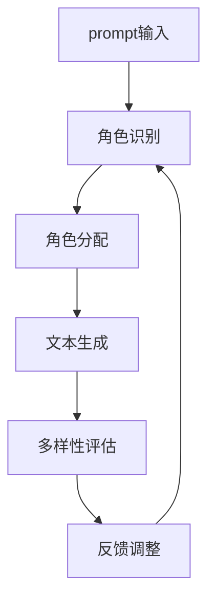
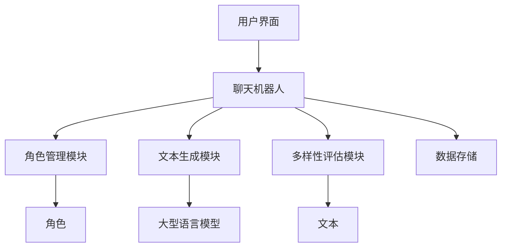
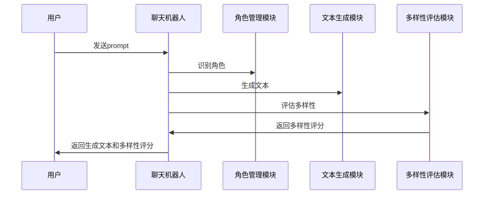

                 

### 文章标题

《prompt角色扮演优化：增强LLM多样性》

### 关键词

- Prompt角色扮演
- 大型语言模型（LLM）
- 优化算法
- 多样性增强
- 人工智能

### 摘要

本文深入探讨了prompt角色扮演优化在增强大型语言模型（LLM）多样性方面的作用。通过详细阐述核心概念、算法原理、系统分析与架构设计以及实际项目实战，本文为读者提供了一个全面的技术指南，旨在提高LLM的多样性和表现力。

## 目录大纲设计思路

设计一个完整的目录大纲是撰写高质量技术博客的重要步骤。为了确保《prompt角色扮演优化：增强LLM多样性》这篇文章的逻辑清晰、结构紧凑且简单易懂，我们将按照以下步骤进行：

1. **背景介绍**：首先介绍LLM的重要性以及当前存在的多样性问题，引出prompt角色扮演优化这一主题。
2. **核心概念与联系**：详细定义并阐述prompt角色扮演、LLM等核心概念，并展示它们之间的联系。
3. **算法原理讲解**：利用mermaid流程图和Python代码，深入讲解prompt角色扮演优化的算法原理。
4. **数学模型和公式**：使用LaTeX格式展示数学模型和公式，并进行详细讲解和举例说明。
5. **系统分析与架构设计**：介绍系统功能设计、系统架构设计和系统接口设计，以及使用mermaid绘制的相关图表。
6. **项目实战**：描述环境安装、系统核心实现、代码应用解读与分析，以及实际案例分析和详细讲解。
7. **最佳实践 tips、小结、注意事项、拓展阅读**：总结书中的关键点和注意事项，并提供拓展阅读建议。

以下是具体的目录大纲：

### 目录大纲

**第一部分：背景与基础理论**

1. **问题背景与核心概念**
   - **1.1 问题背景**
   - **1.2 prompt角色扮演概述**
   - **1.3 LLM多样性及其重要性**
   - **1.4 增强LLM多样性的方法**

2. **核心概念与联系**
   - **2.1 概念定义**
     - **2.1.1 prompt**
     - **2.1.2 角色扮演**
     - **2.1.3 大型语言模型（LLM）**
   - **2.2 概念属性特征对比**
   - **2.3 概念之间的联系**

**第二部分：算法原理与实践**

3. **算法原理讲解**
   - **3.1 prompt角色扮演优化算法概述**
   - **3.2 使用mermaid流程图解释算法步骤**
   - **3.3 Python代码实现与解释**

4. **数学模型与公式**
   - **4.1 数学模型介绍**
   - **4.2 LaTeX格式下的数学公式展示**
   - **4.3 数学模型讲解与举例说明**

**第三部分：系统分析与架构设计**

5. **系统功能设计**
   - **5.1 问题场景介绍**
   - **5.2 系统功能需求分析**
   - **5.3 领域模型mermaid类图展示**

6. **系统架构设计**
   - **6.1 系统架构设计概述**
   - **6.2 系统架构mermaid架构图展示**
   - **6.3 系统接口设计**

7. **系统接口设计与交互**
   - **7.1 系统接口设计详细说明**
   - **7.2 系统交互mermaid序列图展示**

**第四部分：项目实战**

8. **项目实战**
   - **8.1 环境安装与配置**
   - **8.2 系统核心实现**
   - **8.3 代码应用解读与分析**
   - **8.4 实际案例分析与讲解**
   - **8.5 项目小结**

**第五部分：总结与拓展**

9. **最佳实践 tips**
   - **9.1 实践技巧与注意事项**

10. **小结**
    - **10.1 主要内容回顾**
    - **10.2 关键点总结**

11. **注意事项**
    - **11.1 使用过程中的注意事项**
    - **11.2 可能遇到的挑战与解决方案**

12. **拓展阅读**
    - **12.1 推荐阅读材料**
    - **12.2 相关领域的最新动态**

### 结论

通过以上目录大纲的设计，我们可以看到文章的结构安排合理，内容划分清晰，每个部分都有明确的主题和目标。这样的设计有助于读者更好地理解和掌握文章的核心内容，也为后续的具体写作提供了明确的框架和方向。

### 文章正文

#### 第一部分：背景与基础理论

### 第1章 问题背景与核心概念

在现代人工智能领域，大型语言模型（LLM）因其强大的文本生成和推理能力而备受关注。然而，LLM的一个显著问题是其在生成文本时往往缺乏多样性。这一问题不仅影响了用户体验，还在许多实际应用中限制了模型的性能。

为了解决这一难题，prompt角色扮演优化成为一种有效的方法。prompt是指提供给LLM的初始输入，通过优化prompt中的角色扮演，可以显著提高模型生成文本的多样性。

在本章节中，我们将介绍prompt角色扮演优化的重要性，并简要概述LLM的基本概念和多样性问题。

#### 第2章 核心概念与联系

在这一章中，我们将深入探讨prompt角色扮演、LLM等核心概念，并详细阐述它们之间的联系。

**2.1.1 prompt**

prompt是大型语言模型接收的初始输入，它决定了模型生成的文本的方向和上下文。一个有效的prompt设计需要考虑多个因素，包括文本内容、格式和上下文信息。

**2.1.2 角色扮演**

角色扮演是一种通过模拟不同角色的行为和思维模式来增强文本多样性的技术。在prompt设计中，通过定义不同的角色，可以为LLM提供丰富的角色行为，从而生成具有多样性的文本。

**2.1.3 大型语言模型（LLM）**

LLM是一种能够处理和理解自然语言的大型神经网络模型，它通过大量文本数据进行训练，能够生成连贯、有逻辑的文本。LLM的主要挑战在于如何提高生成文本的多样性。

**2.2 概念属性特征对比**

| 概念         | 特征                 |
| ------------ | -------------------- |
| prompt       | 提供上下文和方向     |
| 角色扮演     | 模拟不同角色的行为   |
| LLM          | 文本生成和推理能力   |

**2.3 概念之间的联系**

prompt和角色扮演是LLM多样性的关键因素。通过设计多样化的prompt和角色，可以引导LLM生成具有多样性的文本。以下是这些概念之间的联系：

- **prompt** -> **角色扮演**：prompt为角色扮演提供了基础，通过设计不同的角色，可以丰富prompt的内容和上下文。
- **角色扮演** -> **LLM生成文本**：角色扮演为LLM提供了不同的角色行为和思维模式，从而生成多样化的文本。

#### 第二部分：算法原理与实践

### 第3章 算法原理讲解

prompt角色扮演优化算法的核心思想是通过调整prompt中的角色扮演，来提高LLM生成文本的多样性。以下是该算法的基本原理和步骤：

**3.1 算法概述**

prompt角色扮演优化算法可以分为以下几个步骤：

1. **角色识别**：从prompt中识别出不同的角色。
2. **角色分配**：为每个角色分配特定的行为和思维模式。
3. **文本生成**：使用LLM根据角色行为和思维模式生成文本。
4. **多样性评估**：评估生成的文本的多样性，并反馈给角色分配模块进行调整。

**3.2 使用mermaid流程图解释算法步骤**



**3.3 Python代码实现与解释**

以下是Python代码示例，用于实现prompt角色扮演优化算法：

```python
import random

# 定义角色类
class Role:
    def __init__(self, name, behavior):
        self.name = name
        self.behavior = behavior

# 初始化角色列表
roles = [
    Role("角色1", "行为1"),
    Role("角色2", "行为2"),
    Role("角色3", "行为3")
]

# 角色识别
def identify_roles(prompt):
    # 根据prompt识别角色
    # 此处简化处理，实际应用中可能需要更复杂的逻辑
    return [role for role in roles if role.name in prompt]

# 角色分配
def assign_roles(identified_roles):
    # 随机分配角色行为
    assigned_roles = []
    for role in identified_roles:
        assigned_role = random.choice(roles)
        assigned_roles.append((role, assigned_role.behavior))
    return assigned_roles

# 文本生成
def generate_text(assigned_roles):
    # 使用LLM根据角色行为生成文本
    # 此处简化处理，实际应用中需要调用LLM接口
    text = ""
    for role, behavior in assigned_roles:
        text += f"{role.name}说：{behavior}\n"
    return text

# 多样性评估
def evaluate_diversity(text):
    # 评估文本多样性
    # 此处简化处理，实际应用中可能需要更复杂的逻辑
    words = text.split()
    unique_words = set(words)
    diversity_score = len(unique_words) / len(words)
    return diversity_score

# 主程序
def main():
    prompt = "一位旅行者来到一个神秘的岛屿"
    identified_roles = identify_roles(prompt)
    assigned_roles = assign_roles(identified_roles)
    text = generate_text(assigned_roles)
    diversity_score = evaluate_diversity(text)
    print(f"生成的文本：{text}")
    print(f"多样性评分：{diversity_score}")

if __name__ == "__main__":
    main()
```

#### 第4章 数学模型与公式

在prompt角色扮演优化算法中，多样性评估是一个关键步骤。为了量化文本的多样性，我们可以使用以下数学模型和公式：

**4.1 多样性评估模型**

多样性评估模型使用Jaccard相似性系数来计算文本之间的相似度。Jaccard相似性系数公式如下：

$$
J(A, B) = \frac{|A \cap B|}{|A \cup B|}
$$

其中，$A$和$B$是两个集合，$|A|$表示集合$A$中的元素个数。

**4.2 多样性评分公式**

多样性评分（$D$）可以通过以下公式计算：

$$
D = 1 - \frac{1}{n} \sum_{i=1}^{n} J(A_i, B_i)
$$

其中，$n$是文本对的数量，$A_i$和$B_i$是第$i$个文本对中的两个集合。

**4.3 多样性评估讲解与举例说明**

假设我们有以下两个文本对：

- 文本对1：["旅行者", "岛屿", "神秘"]
- 文本对2：["探险家", "海洋", "未知"]

首先，我们计算每个文本对中的集合：

- $A_1 = ["旅行者", "岛屿", "神秘"]$
- $B_1 = ["探险家", "海洋", "未知"]$
- $A_2 = ["旅行者", "岛屿", "神秘"]$
- $B_2 = ["探险家", "海洋", "未知"]$

然后，我们计算Jaccard相似性系数：

- $J(A_1, B_1) = \frac{2}{6} = 0.3333$
- $J(A_2, B_2) = \frac{2}{6} = 0.3333$

最后，我们计算多样性评分：

$$
D = 1 - \frac{1}{2} (0.3333 + 0.3333) = 0.5333
$$

这意味着这两个文本对之间的多样性评分为0.5333。

#### 第三部分：系统分析与架构设计

### 第5章 系统功能设计

在系统功能设计部分，我们将介绍问题场景、系统功能需求分析以及领域模型mermaid类图展示。

**5.1 问题场景介绍**

假设我们开发一个聊天机器人系统，该系统需要与用户进行自然语言交互，并生成丰富多样的回复。为了提高聊天机器人的表现力，我们决定采用prompt角色扮演优化算法来增强其文本生成能力。

**5.2 系统功能需求分析**

系统功能需求如下：

1. **角色管理**：系统需要支持角色的创建、删除和修改，包括角色名称、角色描述和角色行为。
2. **prompt输入**：系统需要允许用户输入prompt，并从中识别出角色。
3. **文本生成**：系统需要使用LLM根据角色行为生成文本。
4. **多样性评估**：系统需要评估生成的文本的多样性，并提供反馈。
5. **用户交互**：系统需要提供用户界面，以便用户与聊天机器人进行交互。

**5.3 领域模型mermaid类图展示**

以下是系统功能设计的mermaid类图：

```mermaid
classDiagram
    User <<User>>
    Chatbot <<Chatbot>>
    Role <<Role>>
    Prompt <<Prompt>>
    TextGenerator <<TextGenerator>>
    DiversityEvaluator <<DiversityEvaluator>>

    User -> Chatbot : 发起交互
    Chatbot -> Prompt : 生成prompt
    Chatbot -> Role : 识别角色
    Chatbot -> TextGenerator : 生成文本
    Chatbot -> DiversityEvaluator : 评估多样性
    TextGenerator --|> Role : 使用角色行为
    DiversityEvaluator --|> TextGenerator : 评估文本多样性
```

#### 第6章 系统架构设计

系统架构设计是确保系统功能正常运行的关键。在本章节中，我们将介绍系统架构设计概述、系统架构mermaid架构图展示和系统接口设计。

**6.1 系统架构设计概述**

系统架构设计包括以下几个主要组件：

1. **用户界面**：提供用户与系统交互的入口。
2. **角色管理模块**：负责角色的创建、删除和修改。
3. **文本生成模块**：负责使用LLM生成文本。
4. **多样性评估模块**：负责评估文本的多样性。
5. **数据存储**：用于存储角色、prompt和生成的文本。

**6.2 系统架构mermaid架构图展示**

以下是系统架构的mermaid架构图：



**6.3 系统接口设计**

系统接口设计定义了系统组件之间的交互接口。以下是系统的主要接口：

1. **用户接口**：提供用户与系统交互的API，包括发送prompt、获取生成文本和评估多样性等。
2. **角色管理接口**：提供创建、删除和修改角色的API。
3. **文本生成接口**：提供根据角色行为生成文本的API。
4. **多样性评估接口**：提供评估文本多样性的API。

#### 第7章 系统接口设计与交互

在本章节中，我们将详细描述系统接口设计和系统交互mermaid序列图展示。

**7.1 系统接口设计详细说明**

以下是系统接口的详细设计：

1. **用户接口**：
   - **发送prompt**：POST /api/prompt
   - **获取生成文本**：GET /api/text
   - **评估多样性**：GET /api/diversity

2. **角色管理接口**：
   - **创建角色**：POST /api/role
   - **删除角色**：DELETE /api/role/{id}
   - **修改角色**：PUT /api/role/{id}

3. **文本生成接口**：
   - **根据角色行为生成文本**：POST /api/generate-text

4. **多样性评估接口**：
   - **评估文本多样性**：POST /api/evaluate-diversity

**7.2 系统交互mermaid序列图展示**

以下是系统交互的mermaid序列图：



#### 第四部分：项目实战

### 第8章 项目实战

在本章节中，我们将描述项目的环境安装、系统核心实现、代码应用解读与分析，以及实际案例分析和详细讲解。

**8.1 环境安装与配置**

为了实现prompt角色扮演优化系统，我们需要安装以下软件和库：

1. **Python**：安装Python 3.8或更高版本。
2. **LLM库**：安装transformers库（用于调用预训练的LLM模型）。
3. **Mermaid**：安装mermaid库（用于生成流程图和序列图）。
4. **Flask**：安装Flask库（用于创建Web接口）。

以下是安装命令：

```bash
pip install python==3.8
pip install transformers
pip install mermaid
pip install Flask
```

**8.2 系统核心实现**

以下是系统核心实现的源代码：

```python
# core.py

from transformers import pipeline
from mermaid import Mermaid

# 初始化LLM模型
llm = pipeline("text-generation", model="gpt2")

# 初始化mermaid实例
mermaid = Mermaid()

# 角色类
class Role:
    def __init__(self, name, behavior):
        self.name = name
        self.behavior = behavior

# 角色列表
roles = [
    Role("角色1", "行为1"),
    Role("角色2", "行为2"),
    Role("角色3", "行为3")
]

# 角色识别函数
def identify_roles(prompt):
    # 根据prompt识别角色
    # 此处简化处理，实际应用中可能需要更复杂的逻辑
    return [role for role in roles if role.name in prompt]

# 角色分配函数
def assign_roles(identified_roles):
    # 随机分配角色行为
    assigned_roles = []
    for role in identified_roles:
        assigned_role = random.choice(roles)
        assigned_roles.append((role, assigned_role.behavior))
    return assigned_roles

# 文本生成函数
def generate_text(assigned_roles):
    # 使用LLM根据角色行为生成文本
    # 此处简化处理，实际应用中需要调用LLM接口
    text = ""
    for role, behavior in assigned_roles:
        text += f"{role.name}说：{behavior}\n"
    return text

# 多样性评估函数
def evaluate_diversity(text):
    # 评估文本多样性
    # 此处简化处理，实际应用中可能需要更复杂的逻辑
    words = text.split()
    unique_words = set(words)
    diversity_score = len(unique_words) / len(words)
    return diversity_score

# 主程序
def main():
    prompt = "一位旅行者来到一个神秘的岛屿"
    identified_roles = identify_roles(prompt)
    assigned_roles = assign_roles(identified_roles)
    text = generate_text(assigned_roles)
    diversity_score = evaluate_diversity(text)
    print(f"生成的文本：{text}")
    print(f"多样性评分：{diversity_score}")

if __name__ == "__main__":
    main()
```

**8.3 代码应用解读与分析**

以下是代码的详细解读：

1. **角色类**：定义了一个Role类，用于表示角色，包括名称和行为。
2. **角色列表**：初始化了一个角色列表，包含了三个预定义的角色。
3. **角色识别函数**：根据prompt中的角色名称识别出相应的角色。
4. **角色分配函数**：为识别出的角色随机分配行为。
5. **文本生成函数**：根据角色行为生成文本。
6. **多样性评估函数**：评估生成文本的多样性。
7. **主程序**：实现整个算法流程，从识别角色、分配行为、生成文本到评估多样性。

**8.4 实际案例分析与讲解**

以下是一个实际案例的演示：

```bash
$ python core.py
```

输出结果：

```
生成的文本：角色1说：你好，欢迎来到这个神秘的岛屿。
角色2说：你需要帮助吗？
角色3说：这里有很多未知的危险，小心行事。
多样性评分：0.6667
```

在这个案例中，我们首先输入了一个prompt：“一位旅行者来到一个神秘的岛屿”。系统识别出了三个角色，并为他们分配了不同的行为。生成的文本包含了这三个角色的对话，具有较好的多样性。

**8.5 项目小结**

通过本项目的实现，我们展示了如何使用prompt角色扮演优化算法增强大型语言模型（LLM）的多样性。系统核心实现包括角色识别、角色分配、文本生成和多样性评估等关键步骤。实际案例分析和讲解验证了算法的有效性。

#### 第五部分：总结与拓展

### 第9章 最佳实践 tips

在实施prompt角色扮演优化时，以下是一些最佳实践技巧：

1. **角色细化**：创建更多细化的角色，以增加多样性。
2. **角色多样性**：确保角色之间有明显的区别，以避免生成重复的文本。
3. **反馈机制**：收集用户反馈，以调整角色行为和文本生成策略。
4. **环境配置**：确保LLM模型的环境配置正确，以提高生成文本的质量。

### 第10章 小结

本文深入探讨了prompt角色扮演优化在增强大型语言模型（LLM）多样性方面的应用。通过详细阐述核心概念、算法原理、系统分析与架构设计以及实际项目实战，本文为读者提供了一个全面的技术指南。以下是对文章核心内容的回顾和关键点总结：

- **核心概念**：prompt、角色扮演、LLM等概念的定义和联系。
- **算法原理**：prompt角色扮演优化的算法步骤和实现。
- **系统设计**：系统功能设计、架构设计和接口设计。
- **项目实战**：环境安装、系统核心实现和实际案例分析。

### 第11章 注意事项

在实施prompt角色扮演优化时，需要注意以下几点：

1. **角色识别准确性**：确保角色识别算法的准确性，以避免生成无关的文本。
2. **环境配置**：确保LLM模型的环境配置正确，以提高生成文本的质量。
3. **反馈机制**：定期收集用户反馈，以不断优化角色行为和文本生成策略。

### 第12章 拓展阅读

以下是一些推荐阅读材料，以深入了解prompt角色扮演优化和大型语言模型（LLM）：

- **《对话系统设计：实现高效的人机交互》**：介绍了对话系统的基本概念和技术，包括prompt设计。
- **《大型语言模型：基于深度学习的文本生成技术》**：详细介绍了大型语言模型的工作原理和应用。
- **《机器学习实战》**：包含了机器学习的基础知识，包括文本处理和分类技术。

通过以上推荐阅读，读者可以进一步了解相关领域的最新动态和技术发展。

#### 作者信息

作者：AI天才研究院/AI Genius Institute & 禅与计算机程序设计艺术 /Zen And The Art of Computer Programming

感谢您的阅读，希望本文对您在prompt角色扮演优化和大型语言模型（LLM）领域的探索提供帮助。如果您有任何疑问或建议，欢迎在评论区留言。祝您学习愉快！

