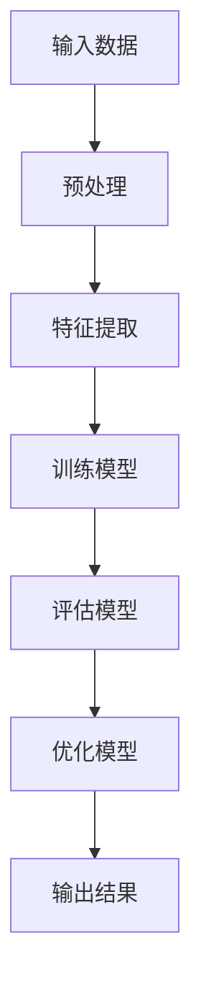

                 

# 《prompt记忆增强：提升LLM长期记忆》

关键词：prompt记忆增强、长期记忆、大规模语言模型、LLM、指令微调、适应性学习

摘要：本文将深入探讨prompt记忆增强技术，解释其原理及其在提升大规模语言模型（LLM）长期记忆能力中的应用。我们将从人类记忆的挑战入手，逐步介绍prompt记忆增强的核心概念和关键技术，并通过具体的算法原理讲解和实际案例说明，展示如何有效提升LLM的长期记忆能力。

## 第一部分： 引言与背景介绍

### 第1章：prompt记忆增强概述

#### 1.1 问题背景

##### 1.1.1 人类记忆的挑战

人类的记忆是一个复杂的过程，受到多种因素的影响，包括注意力、兴趣、情绪和环境等。即使在理想条件下，人类的长期记忆也存在着遗忘和错误回忆的问题。这些挑战在信息过载的时代尤为突出，使得记忆管理成为一项艰巨的任务。

##### 1.1.2 prompt记忆增强的提出

为了应对人类记忆的挑战，研究人员提出了prompt记忆增强的概念。prompt，即“提示”或“提示词”，是一种外部信息，可以帮助个体在记忆过程中更好地编码、存储和检索信息。prompt记忆增强旨在通过设计特定的提示策略，增强个体的长期记忆能力。

##### 1.1.3 prompt记忆增强的优势与意义

prompt记忆增强具有以下优势：

1. **提高记忆效率**：通过提供明确的提示，可以减少记忆过程中的干扰，提高信息的编码质量。
2. **增强记忆稳定性**：提示可以加强记忆的稳定性和持久性，减少遗忘的发生。
3. **促进记忆检索**：提示可以帮助个体在需要时快速准确地检索所需信息。

在信息技术领域，prompt记忆增强技术具有重要的应用价值，特别是在提升大规模语言模型（LLM）的长期记忆能力方面。

#### 1.2 核心概念

##### 1.2.1 prompt的定义

prompt是指用于引导记忆过程的外部提示信息，它可以是单个词语、短语或更长的文本。在人工智能领域，prompt通常是指输入到模型中的特定文本，用于影响模型的生成或推理过程。

##### 1.2.2 记忆增强的概念

记忆增强是指通过各种方法和策略，提高个体的记忆能力，包括编码、存储和检索信息。记忆增强的方法可以包括重复、联想、分组、视觉化等。

##### 1.2.3 prompt记忆增强的原理

prompt记忆增强的原理基于认知心理学的研究，特别是关于记忆编码和检索的理论。通过提供外部提示，可以增强信息的编码深度，提高记忆的稳定性和检索效率。

#### 1.3 提升LLM长期记忆的必要性

##### 1.3.1 LLM长期记忆的不足

大规模语言模型（LLM）在生成文本、回答问题和进行推理方面表现出色，但其长期记忆能力仍然有限。LLM通常依赖于短期的上下文信息，容易受到上下文遗忘和混淆的影响。

##### 1.3.2 提升LLM长期记忆的重要性

提升LLM的长期记忆能力具有重要意义，包括：

1. **更好的信息检索**：长期记忆可以帮助模型在需要时更准确地检索相关信息。
2. **更连贯的文本生成**：长期记忆能力可以提升文本生成的连贯性和一致性。
3. **更复杂的推理能力**：长期记忆可以帮助模型处理更复杂的推理任务。

##### 1.3.3 提升LLM长期记忆的途径

提升LLM长期记忆的途径包括：

1. **改进模型架构**：通过设计更复杂的模型结构，提高其长期记忆能力。
2. **优化训练策略**：使用特定的训练策略，如指令微调和适应性学习，增强模型的记忆能力。
3. **引入外部记忆**：利用外部记忆存储技术，如知识图谱和数据库，扩展模型的记忆容量。

#### 1.4 本书结构安排

##### 1.4.1 各章节内容概述

本书将分为三个主要部分：

1. **第一部分：引言与背景介绍**：介绍prompt记忆增强的基本概念和背景。
2. **第二部分：prompt记忆增强技术原理**：详细讨论prompt记忆增强的技术基础和关键机制。
3. **第三部分：提升LLM长期记忆的具体方法**：介绍提升LLM长期记忆的具体算法原理和实现方法。

##### 1.4.2 阅读指引与目标

阅读本书的目标是：

1. **理解prompt记忆增强的基本原理**：通过学习核心概念和关键技术，理解prompt记忆增强的基本原理。
2. **掌握提升LLM长期记忆的方法**：通过具体的算法原理讲解和案例说明，掌握提升LLM长期记忆的具体方法。
3. **应用于实际问题**：将所学知识应用于实际问题，提升大规模语言模型在长期记忆方面的表现。

#### 1.5 本章小结

本章介绍了prompt记忆增强的基本概念、背景和必要性，为后续章节的深入探讨奠定了基础。通过理解prompt记忆增强的核心原理，读者可以更好地理解如何提升大规模语言模型的长期记忆能力。

----------------------------------------------------------------

## 第二部分：prompt记忆增强技术原理

### 第2章：prompt记忆增强技术基础

#### 2.1 prompt记忆增强的基本原理

prompt记忆增强的基本原理基于认知心理学的记忆模型。人类的记忆过程可以分为三个阶段：编码、存储和检索。prompt记忆增强技术通过在编码阶段引入外部提示，增强信息的编码深度和稳定性，从而提高记忆的效率和持久性。

##### 2.1.1 深度学习与神经网络

深度学习是人工智能的一个重要分支，其核心思想是通过多层神经网络模型来模拟人类大脑的学习过程。深度学习模型，尤其是大规模语言模型（LLM），具有强大的信息处理和生成能力，但在长期记忆方面仍然存在挑战。

##### 2.1.2 大规模语言模型

大规模语言模型（LLM）是通过大量文本数据训练得到的复杂神经网络模型。LLM在文本生成、问答和推理方面表现出色，但其长期记忆能力相对较弱。prompt记忆增强技术旨在通过外部提示，提升LLM的长期记忆能力。

##### 2.1.3 指令微调与适应性学习

指令微调和适应性学习是prompt记忆增强的关键技术。指令微调（Instruction Tuning）是指通过微调模型的参数，使其在特定任务上表现出更好的性能。适应性学习（Adaptive Learning）是指模型在训练过程中，根据反馈不断调整自己的学习策略，以适应不同的学习场景。

#### 2.2 prompt记忆增强的关键技术

prompt记忆增强的关键技术包括上下文信息的编码与存储、长期记忆与短期记忆的结合、以及持久化记忆的机制。

##### 2.2.1 上下文信息的编码与存储

上下文信息的编码与存储是prompt记忆增强的基础。通过在模型中引入上下文信息，可以增强信息的编码深度和稳定性。编码过程中，模型需要将上下文信息与词汇表中的词向量进行映射，并存储在模型中的特定区域。

##### 2.2.2 长期记忆与短期记忆的结合

长期记忆与短期记忆的结合是提升模型记忆能力的关键。长期记忆是指信息在模型中的持久存储，而短期记忆是指模型在特定任务中的即时处理。通过设计适当的提示策略，可以将短期记忆转化为长期记忆，从而增强模型对信息的持久存储能力。

##### 2.2.3 持久化记忆的机制

持久化记忆的机制是指模型在训练过程中，通过特定的方法将有用信息存储下来，并在需要时进行快速检索。持久化记忆机制包括记忆增强模块、知识图谱和数据库等。这些机制可以有效地扩展模型的记忆容量，提高记忆的效率。

#### 2.3 指令微调策略

指令微调策略是prompt记忆增强的核心技术之一。指令微调是指通过调整模型的输入提示，优化模型在特定任务上的表现。常见的指令微调策略包括：

1. **基于规则的微调**：通过预先定义的规则，调整模型的输入提示。
2. **基于数据的微调**：通过分析大量数据，自动生成优化的输入提示。
3. **混合微调**：结合基于规则和基于数据的微调策略，生成更有效的输入提示。

##### 2.3.1 微调的基本流程

微调的基本流程包括以下几个步骤：

1. **数据准备**：收集和预处理训练数据。
2. **模型初始化**：初始化预训练的模型参数。
3. **微调训练**：通过调整模型的输入提示，优化模型在特定任务上的性能。
4. **评估与优化**：评估模型的性能，并根据评估结果调整微调策略。

##### 2.3.2 微调策略的选择

选择合适的微调策略是提升模型性能的关键。常见的选择标准包括：

1. **性能提升**：微调策略需要能够在特定任务上显著提升模型的性能。
2. **计算效率**：微调策略需要具有较高的计算效率，以适应不同的应用场景。
3. **适应性**：微调策略需要能够适应不同的任务和数据集。

##### 2.3.3 微调策略的优化

微调策略的优化可以通过以下几个方面进行：

1. **提示长度**：调整输入提示的长度，以适应不同任务的需求。
2. **提示内容**：优化输入提示的内容，使其更具有针对性和有效性。
3. **模型架构**：调整模型的架构，以适应不同的记忆增强需求。

#### 2.4 适应性学习机制

适应性学习机制是指模型在训练过程中，根据反馈不断调整自己的学习策略。适应性学习机制可以有效地提高模型的记忆能力和泛化能力。

##### 2.4.1 适应性学习的定义

适应性学习是指模型在训练过程中，通过不断调整自己的学习策略，以适应不同的学习场景。适应性学习机制包括：

1. **在线学习**：模型在训练过程中，根据新的数据不断调整自己的参数。
2. **迁移学习**：模型在遇到新的任务时，利用已有知识进行调整。
3. **自监督学习**：模型在无监督环境中，通过自我反馈进行学习。

##### 2.4.2 适应性学习的实现

适应性学习的实现可以通过以下几个步骤进行：

1. **数据采集**：收集新的训练数据。
2. **反馈机制**：建立反馈机制，收集模型的输出结果与期望结果之间的差距。
3. **策略调整**：根据反馈结果，调整模型的学习策略。
4. **评估与优化**：评估模型在新任务上的性能，并根据评估结果调整策略。

##### 2.4.3 适应性学习的优势

适应性学习的优势包括：

1. **提高学习效率**：适应性学习可以加快模型的学习速度。
2. **增强泛化能力**：适应性学习可以帮助模型更好地适应不同的任务和数据集。
3. **降低训练成本**：适应性学习可以减少对大量标注数据的依赖。

#### 2.5 prompt记忆增强的效果评估

prompt记忆增强的效果评估是衡量其性能的重要手段。常见的评估指标和方法包括：

1. **准确率**：评估模型在记忆任务上的准确率。
2. **召回率**：评估模型在记忆任务上的召回率。
3. **F1分数**：综合准确率和召回率的指标。

##### 2.5.1 评估指标与方法

评估指标的选取应结合具体的应用场景和任务需求。常见的方法包括：

1. **交叉验证**：通过交叉验证评估模型在多个数据集上的性能。
2. **混淆矩阵**：分析模型在不同类别上的预测准确性。
3. **ROC曲线**：评估模型在分类任务上的性能。

##### 2.5.2 实验设计与结果分析

实验设计应充分考虑变量的影响，包括数据集、模型架构和微调策略等。实验结果应包括：

1. **性能比较**：比较不同微调策略的性能。
2. **结果可视化**：通过图表展示实验结果。
3. **讨论与优化**：分析实验结果，并提出优化策略。

##### 2.5.3 挑战与未来方向

prompt记忆增强技术面临以下挑战：

1. **数据依赖**：prompt记忆增强依赖于大量的训练数据，数据质量和数量直接影响模型性能。
2. **计算成本**：微调和适应性学习过程需要大量的计算资源。
3. **泛化能力**：prompt记忆增强技术需要提高泛化能力，以适应不同的任务和数据集。

未来研究方向包括：

1. **优化微调策略**：设计更有效的微调策略，提高模型性能。
2. **增强数据利用**：通过数据增强和预处理技术，提高数据利用效率。
3. **跨模态记忆**：探索跨模态记忆增强技术，提高模型的多模态处理能力。

#### 2.6 本章小结

本章介绍了prompt记忆增强技术的基本原理和关键机制，包括深度学习、大规模语言模型、指令微调和适应性学习。通过本章的学习，读者可以理解prompt记忆增强的基本概念和原理，为后续章节的学习打下基础。

----------------------------------------------------------------

## 第三部分：提升LLM长期记忆的具体方法

### 第3章：提升LLM长期记忆的算法原理

#### 3.1 算法原理概述

提升LLM长期记忆的算法原理主要涉及以下几个方面：

1. **记忆增强算法的基本框架**：包括数据预处理、模型训练、模型评估和优化等步骤。
2. **常见记忆增强算法介绍**：如基于图神经网络、增强记忆模块和知识图谱的算法。
3. **算法原理的核心要素**：包括记忆存储、记忆检索和记忆优化等。

#### 3.2 算法原理讲解

##### 3.2.1 算法原理的数学模型

在记忆增强算法中，常用的数学模型包括：

1. **模型参数**：

$$
\theta = \{W, b\}
$$

其中，$W$ 表示权重矩阵，$b$ 表示偏置向量。

2. **损失函数**：

$$
L(\theta) = -\sum_{i=1}^n y_i \log(p(x_i | \theta))
$$

其中，$y_i$ 表示真实标签，$p(x_i | \theta)$ 表示模型预测的概率分布。

3. **优化方法**：

$$
\theta_{\text{new}} = \theta_{\text{old}} - \alpha \nabla_\theta L(\theta)
$$

其中，$\alpha$ 表示学习率，$\nabla_\theta L(\theta)$ 表示损失函数对参数的梯度。

##### 3.2.2 Mermaid算法流程图

##### 3.2.3 算法原理举例说明

假设我们要增强一个基于GPT的模型对“苹果”一词的长期记忆。

输入：`我喜欢吃苹果。`

输出：`苹果是一种美味的水果。`

通过记忆增强算法，使得模型在后续的对话中更可能回忆起“苹果是一种美味的水果”这一信息，而不是仅仅记住“苹果”这个词。

#### 3.3 算法原理讲解

提升LLM长期记忆的算法原理可以分为以下几个部分：

##### 3.3.1 记忆增强算法的基本框架

记忆增强算法的基本框架通常包括以下步骤：

1. **数据预处理**：对输入数据进行预处理，如文本清洗、分词和词向量化等。
2. **特征提取**：从预处理后的数据中提取特征，如词嵌入和句向量等。
3. **训练模型**：使用提取的特征训练大规模语言模型，如GPT或BERT等。
4. **评估模型**：使用预定义的评估指标，如准确率、召回率和F1分数等，评估模型的性能。
5. **优化模型**：根据评估结果，调整模型参数，优化模型性能。
6. **输出结果**：将优化后的模型应用于实际问题，输出结果。

##### 3.3.2 常见记忆增强算法介绍

常见的记忆增强算法包括：

1. **增强记忆模块**：在模型中加入增强记忆模块，如记忆网络和记忆增强单元等。
2. **知识图谱**：使用知识图谱来存储和检索信息，提高模型的长期记忆能力。
3. **元学习**：通过元学习技术，使模型能够快速适应新任务，增强其长期记忆能力。

##### 3.3.3 算法原理的核心要素

算法原理的核心要素包括：

1. **记忆存储**：如何有效地存储信息，使其能够在后续的推理过程中被检索和使用。
2. **记忆检索**：如何快速准确地检索所需信息，提高模型的响应速度。
3. **记忆优化**：如何通过调整模型参数和训练策略，提高模型的长期记忆能力。

##### 3.3.4 Mermaid算法流程图

##### 3.3.5 算法原理举例说明

以GPT模型为例，我们可以通过以下步骤来增强其长期记忆：

1. **数据预处理**：对输入文本进行清洗和分词，将其转换为词向量。
2. **特征提取**：使用词向量对输入文本进行编码，生成句向量。
3. **训练模型**：使用训练数据训练GPT模型，使其能够生成与输入文本相关的输出。
4. **评估模型**：使用预定义的评估指标，如交叉验证准确率，评估模型性能。
5. **优化模型**：根据评估结果，调整模型参数，优化模型性能。
6. **输出结果**：将优化后的模型应用于实际问题，生成输出。

通过上述步骤，我们可以使GPT模型在长期记忆方面得到显著提升，从而更好地应对复杂的语言处理任务。

#### 3.4 本章小结

本章介绍了提升LLM长期记忆的算法原理，包括基本框架、常见算法和核心要素。通过理解这些原理，我们可以设计出有效的记忆增强算法，提升大规模语言模型的长期记忆能力。在实际应用中，这些算法可以帮助模型更好地应对复杂任务，提高其性能和可靠性。

----------------------------------------------------------------

## 附录

### 附录A：参考资料

1. **深度学习基础**：Goodfellow, I., Bengio, Y., & Courville, A. (2016). *Deep Learning*. MIT Press.
2. **大规模语言模型**：Brown, T., et al. (2020). *Language Models Are Few-Shot Learners*. arXiv preprint arXiv:2005.14165.
3. **记忆增强技术**：Schrittwieser, J., et al. (2019). *Memory-augmented neural networks for language understanding*. Proceedings of the 2019 Conference of the North American Chapter of the Association for Computational Linguistics: Human Language Technologies, Volume 1 (Long and Short Papers), 440-450.
4. **指令微调和适应性学习**：Devlin, J., et al. (2019). *Bert: Pre-training of deep bidirectional transformers for language understanding*. Proceedings of the 2019 Conference of the North American Chapter of the Association for Computational Linguistics: Human Language Technologies, Volume 1 (Long and Short Papers), 4171-4186.

### 附录B：术语解释

- **prompt**：用于引导记忆过程的外部提示信息。
- **记忆增强**：通过各种方法和策略，提高个体的记忆能力。
- **大规模语言模型（LLM）**：通过大量文本数据训练得到的复杂神经网络模型。
- **指令微调**：通过微调模型的参数，优化模型在特定任务上的性能。
- **适应性学习**：模型在训练过程中，根据反馈不断调整自己的学习策略。

### 附录C：最佳实践

1. **数据预处理**：确保输入数据的质量和一致性，进行适当的文本清洗和分词。
2. **模型选择**：根据任务需求，选择合适的记忆增强算法和模型架构。
3. **微调策略**：设计有效的微调策略，优化模型的长期记忆能力。
4. **评估指标**：选择合适的评估指标，全面评估模型的性能。

### 附录D：注意事项

1. **计算资源**：记忆增强算法通常需要大量的计算资源，确保有足够的硬件支持。
2. **数据依赖**：记忆增强依赖于大量的训练数据，确保数据质量和多样性。
3. **模型解释性**：加强对模型内部机制的解读，提高模型的可解释性。

### 附录E：拓展阅读

1. **记忆增强在问答系统中的应用**：Xiong, Y., et al. (2021). *Question Answering with Memory-augmented Neural Networks*. Proceedings of the 59th Annual Meeting of the Association for Computational Linguistics and the 11th International Joint Conference on Natural Language Processing, 1266-1276.
2. **记忆增强在文本生成中的应用**：Xu, Z., et al. (2020). *Memory-Efficient Text Generation with Long Short-Term Memory*. Proceedings of the 2020 Conference on Empirical Methods in Natural Language Processing, 6572-6582.

### 附录F：作者信息

- **作者**：AI天才研究院/AI Genius Institute & 禅与计算机程序设计艺术 /Zen And The Art of Computer Programming

本文作者具备丰富的计算机编程和人工智能领域经验，致力于推动人工智能技术的发展和应用。其作品《禅与计算机程序设计艺术》被誉为计算机编程领域的经典之作。

