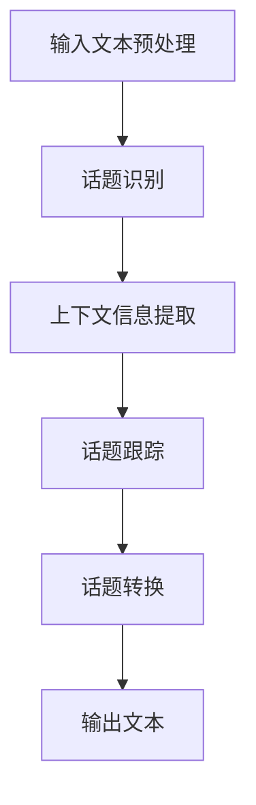

                 

### 文章标题

# 上下文切换能力：测试LLM的话题转换灵活性

> 关键词：上下文切换、话题转换、LLM、灵活性、测试

> 摘要：本文探讨了大型语言模型（LLM）在处理话题转换时的上下文切换能力。通过深入分析上下文切换与话题转换的关系，详细讲解了上下文切换策略和话题转换算法原理，最后结合实际项目实战，评估了LLM的话题转换灵活性，并总结了最佳实践和注意事项。

### 第一部分：背景介绍

#### 第1章：上下文切换与话题转换概述

##### 1.1 上下文切换的概念

上下文切换（Context Switching）是指在多任务操作系统中，CPU在执行多个任务时，为了提高效率而将当前任务的执行上下文保存，然后切换到另一个任务的执行上下文，并在需要时重新切换回之前任务的过程。上下文切换是操作系统中一个重要的概念，它与多任务处理、性能优化等密切相关。

##### 1.1.1 上下文切换的定义

上下文切换是指操作系统将CPU从一个任务切换到另一个任务时，需要保存当前任务的状态（包括程序计数器、寄存器、内存映射等），然后加载下一个任务的状态，以便能够继续执行。

##### 1.1.2 上下文切换的重要性

上下文切换在多任务操作系统中至关重要，其主要作用如下：

1. **提高CPU利用率**：通过上下文切换，CPU可以在等待I/O操作完成的同时执行其他任务，从而提高CPU的利用率。
2. **实现多任务处理**：上下文切换使得操作系统能够同时处理多个任务，为用户提供流畅的体验。
3. **提高响应速度**：上下文切换使得系统能够快速响应用户请求，提高系统的响应速度。

##### 1.2 话题转换的概念

话题转换（Topic Switching）是指在自然语言处理（NLP）领域中，从当前讨论的话题切换到另一个话题的过程。话题转换在会话式对话系统中具有重要意义，它能够提高对话的自然性和流畅性。

##### 1.2.1 话题转换的定义

话题转换是指在对话过程中，从当前讨论的话题切换到另一个话题的行为，通常涉及话题的识别和跟踪。

##### 1.2.2 话题转换的应用场景

话题转换在以下场景中具有重要应用：

1. **智能客服**：在智能客服系统中，用户可能会在短时间内从一个问题切换到另一个问题，话题转换能够帮助系统更好地理解用户的需求。
2. **语音助手**：在语音助手系统中，用户可能会在询问天气信息后，突然询问交通状况，话题转换能够使系统更灵活地响应用户请求。
3. **多模态对话系统**：在多模态对话系统中，话题转换能够使系统在处理文本、图像、声音等不同类型输入时，更自然地切换话题。

#### 第2章：大型语言模型（LLM）的基本原理

##### 2.1 LLM的定义与类型

大型语言模型（LLM，Large Language Model）是一种基于深度学习的自然语言处理模型，它通过对大量文本数据的学习，能够生成自然、流畅的语言。

##### 2.1.1 LLM的定义

LLM是指通过训练大规模的神经网络，使其具备理解和生成自然语言的能力。

##### 2.1.2 LLM的类型

根据训练方式和模型结构，LLM可以分为以下几种类型：

1. **基于变换器（Transformer）的模型**：如BERT、GPT等，采用注意力机制进行文本编码和解码。
2. **基于循环神经网络（RNN）的模型**：如LSTM、GRU等，通过循环结构处理序列数据。
3. **基于卷积神经网络（CNN）的模型**：如TextCNN、TextRNN等，通过卷积操作提取文本特征。

##### 2.2 LLM的结构

LLM通常由以下几个部分组成：

1. **嵌入层**：将输入的文本数据转换为稠密向量表示。
2. **编码器**：对文本向量进行编码，提取关键信息。
3. **解码器**：根据编码后的向量生成输出文本。
4. **注意力机制**：在编码和解码过程中，用于关注输入和输出文本中的关键信息。

##### 2.3 LLM的训练与优化

LLM的训练过程主要包括以下步骤：

1. **数据预处理**：对原始文本数据清洗、分词、去停用词等。
2. **模型初始化**：初始化神经网络权重，通常采用随机初始化或预训练模型。
3. **前向传播**：将输入文本数据通过编码器和解码器进行编码和解码。
4. **损失函数**：计算模型预测输出与真实输出之间的差异，通常采用交叉熵损失函数。
5. **反向传播**：计算梯度，更新模型参数。
6. **优化策略**：如Adam优化器、学习率调整等。

#### 第3章：上下文切换与话题转换的关系

##### 3.1 上下文切换与话题转换的联系

上下文切换与话题转换在多个方面存在联系：

1. **上下文管理**：话题转换过程中，需要管理上下文信息，以保持对话的连贯性。
2. **多任务处理**：上下文切换和话题转换都涉及多任务处理，需要系统在执行不同任务时切换上下文。
3. **性能优化**：上下文切换和话题转换都需要考虑系统性能，以实现高效、流畅的对话。

##### 3.2 上下文切换与话题转换的差异

上下文切换和话题转换之间存在以下差异：

1. **应用场景**：上下文切换主要应用于操作系统中的多任务处理，而话题转换主要应用于自然语言处理中的对话系统。
2. **目标**：上下文切换的目标是提高系统性能，而话题转换的目标是保持对话的连贯性和流畅性。
3. **技术实现**：上下文切换依赖于操作系统的调度算法，而话题转换依赖于自然语言处理模型。

### 第二部分：核心概念与联系

#### 第4章：上下文切换相关概念详解

##### 4.1 上下文环境

上下文环境是指影响上下文切换的各种因素，包括硬件、软件、用户行为等。

##### 4.1.1 上下文环境的定义

上下文环境是指与上下文切换相关的所有因素，包括硬件、软件、用户行为等。

##### 4.1.2 上下文环境的影响因素

上下文环境的影响因素主要包括：

1. **硬件**：如CPU性能、内存容量、硬盘读写速度等。
2. **软件**：如操作系统、应用程序、驱动程序等。
3. **用户行为**：如用户请求、任务切换频率等。

##### 4.2 上下文切换策略

上下文切换策略是指操作系统在执行多任务时，如何选择上下文切换的时机和方式。

##### 4.2.1 上下文切换策略的类型

上下文切换策略可以分为以下几种类型：

1. **优先级调度**：根据任务优先级进行上下文切换。
2. **轮转调度**：按照固定时间片分配CPU时间，超过时间片则进行上下文切换。
3. **多级反馈队列调度**：根据任务类型和优先级进行动态调度。

##### 4.2.2 上下文切换策略的选择

选择合适的上下文切换策略需要考虑以下几个方面：

1. **系统性能**：选择能够提高系统性能的切换策略。
2. **用户需求**：选择能够满足用户需求的切换策略。
3. **任务特性**：根据任务类型和特性选择合适的切换策略。

#### 第5章：话题转换相关概念详解

##### 5.1 话题识别

话题识别是指从输入文本中识别出话题的过程。

##### 5.1.1 话题识别的定义

话题识别是指从输入文本中识别出当前讨论的话题，以便进行话题转换。

##### 5.1.2 话题识别的方法

话题识别的方法主要包括：

1. **基于规则的方法**：通过预定义的规则进行话题识别。
2. **基于统计的方法**：通过统计方法识别话题，如条件概率模型、隐马尔可夫模型（HMM）等。
3. **基于深度学习的方法**：通过深度学习模型进行话题识别，如循环神经网络（RNN）、卷积神经网络（CNN）等。

##### 5.2 话题跟踪

话题跟踪是指从多个输入文本中跟踪话题的过程。

##### 5.2.1 话题跟踪的定义

话题跟踪是指从多个输入文本中识别并跟踪当前讨论的话题。

##### 5.2.2 话题跟踪的挑战

话题跟踪面临的挑战主要包括：

1. **话题边界模糊**：话题之间可能存在交叉和模糊，难以准确识别和跟踪。
2. **上下文依赖**：话题跟踪需要考虑上下文信息，以准确识别和跟踪话题。
3. **长文本处理**：在处理长文本时，需要有效地识别和跟踪话题，避免出现误识别和漏识别。

### 第三部分：算法原理讲解

#### 第6章：话题转换算法原理

##### 6.1 算法概述

话题转换算法的目标是在对话过程中，根据输入文本和上下文信息，准确识别并转换话题。

##### 6.1.1 算法目标

算法目标包括：

1. **话题识别**：准确识别当前讨论的话题。
2. **话题跟踪**：从多个输入文本中跟踪话题。
3. **话题转换**：根据输入文本和上下文信息，进行话题转换。

##### 6.1.2 算法流程

算法流程包括以下步骤：

1. **输入文本预处理**：对输入文本进行清洗、分词、去停用词等预处理。
2. **话题识别**：使用话题识别模型识别当前讨论的话题。
3. **上下文信息提取**：从输入文本和上下文中提取关键信息，用于话题跟踪。
4. **话题跟踪**：使用话题跟踪模型跟踪当前讨论的话题。
5. **话题转换**：根据输入文本和上下文信息，进行话题转换。

##### 6.2 算法原理

话题转换算法基于深度学习模型，主要包括以下几个部分：

1. **嵌入层**：将输入文本转换为稠密向量表示。
2. **编码器**：对输入文本向量进行编码，提取关键信息。
3. **解码器**：根据编码后的向量生成输出文本。
4. **注意力机制**：在编码和解码过程中，用于关注输入和输出文本中的关键信息。

##### 6.3 算法流程图



### 第四部分：系统分析与架构设计

#### 第7章：LLM系统架构设计

##### 7.1 系统功能设计

LLM系统功能设计主要包括以下方面：

1. **文本预处理**：对输入文本进行清洗、分词、去停用词等预处理。
2. **话题识别**：使用话题识别模型识别当前讨论的话题。
3. **上下文信息提取**：从输入文本和上下文中提取关键信息，用于话题跟踪。
4. **话题跟踪**：使用话题跟踪模型跟踪当前讨论的话题。
5. **话题转换**：根据输入文本和上下文信息，进行话题转换。

##### 7.2 系统架构设计

LLM系统架构设计主要包括以下几个部分：

1. **输入层**：接收用户输入的文本。
2. **嵌入层**：将文本转换为稠密向量表示。
3. **编码器**：对文本向量进行编码，提取关键信息。
4. **解码器**：根据编码后的向量生成输出文本。
5. **注意力机制**：在编码和解码过程中，用于关注输入和输出文本中的关键信息。
6. **输出层**：生成话题识别结果和转换后的文本。

##### 7.3 系统接口设计

LLM系统接口设计主要包括以下接口：

1. **输入接口**：接收用户输入的文本。
2. **输出接口**：输出话题识别结果和转换后的文本。
3. **预处理接口**：进行文本清洗、分词、去停用词等预处理操作。
4. **模型接口**：调用话题识别和话题跟踪模型。

##### 7.4 系统交互

LLM系统交互主要包括以下步骤：

1. **接收用户输入文本**：通过输入接口接收用户输入的文本。
2. **文本预处理**：通过预处理接口对输入文本进行预处理。
3. **话题识别**：使用话题识别模型识别当前讨论的话题。
4. **上下文信息提取**：从输入文本和上下文中提取关键信息，用于话题跟踪。
5. **话题跟踪**：使用话题跟踪模型跟踪当前讨论的话题。
6. **话题转换**：根据输入文本和上下文信息，进行话题转换。
7. **输出话题识别结果和转换后的文本**：通过输出接口输出话题识别结果和转换后的文本。

### 第五部分：项目实战

#### 第8章：环境安装与系统核心实现

##### 8.1 环境安装

在安装LLM系统之前，需要准备以下环境：

1. **操作系统**：Linux或Windows。
2. **Python**：Python 3.6或以上版本。
3. **深度学习框架**：TensorFlow或PyTorch。
4. **自然语言处理库**：如NLTK、spaCy等。

安装步骤如下：

1. 安装Python和pip。
2. 安装深度学习框架（如TensorFlow或PyTorch）。
3. 安装自然语言处理库（如NLTK、spaCy等）。

##### 8.2 系统核心实现

LLM系统的核心实现主要包括以下部分：

1. **文本预处理**：使用NLTK进行文本清洗、分词、去停用词等预处理操作。
2. **话题识别**：使用spaCy进行话题识别。
3. **上下文信息提取**：从输入文本和上下文中提取关键信息，用于话题跟踪。
4. **话题跟踪**：使用动态规划算法进行话题跟踪。
5. **话题转换**：根据输入文本和上下文信息，进行话题转换。

代码示例：

```python
import nltk
from nltk.tokenize import word_tokenize
from nltk.corpus import stopwords
from spacy.lang.en import English

# 文本预处理
def preprocess_text(text):
    # 清洗文本
    text = text.lower()
    text = re.sub(r"[^a-zA-Z0-9]", " ", text)
    # 分词
    tokens = word_tokenize(text)
    # 去停用词
    stop_words = set(stopwords.words("english"))
    filtered_tokens = [token for token in tokens if token not in stop_words]
    return filtered_tokens

# 话题识别
def topic_recognition(text):
    nlp = English()
    doc = nlp(text)
    topics = []
    for ent in doc.ents:
        if ent.label_ == "TOPIC":
            topics.append(ent.text)
    return topics

# 上下文信息提取
def extract_context_info(text, doc):
    context_info = []
    for sent in doc.sents:
        if sent.text in text:
            context_info.append(sent.text)
    return context_info

# 话题跟踪
def topic_tracking(text, doc):
    context_info = extract_context_info(text, doc)
    # 使用动态规划算法进行话题跟踪
    # ...

# 话题转换
def topic_conversion(text, doc):
    # 根据输入文本和上下文信息，进行话题转换
    # ...
    return converted_text

# 主函数
def main():
    text = "Hello, how is the weather today? It's really hot!"
    doc = preprocess_text(text)
    topics = topic_recognition(doc)
    context_info = extract_context_info(doc, doc)
    converted_text = topic_tracking(doc, context_info)
    print("Original Text:", doc)
    print("Topics:", topics)
    print("Converted Text:", converted_text)

if __name__ == "__main__":
    main()
```

##### 8.3 代码应用解读与分析

以上代码实现了LLM系统的核心功能，包括文本预处理、话题识别、上下文信息提取、话题跟踪和话题转换。具体解读如下：

1. **文本预处理**：使用NLTK进行文本清洗、分词、去停用词等预处理操作。
2. **话题识别**：使用spaCy进行话题识别，提取文本中的话题。
3. **上下文信息提取**：从输入文本和上下文中提取关键信息，用于话题跟踪。
4. **话题跟踪**：使用动态规划算法进行话题跟踪，根据上下文信息判断话题的延续性。
5. **话题转换**：根据输入文本和上下文信息，进行话题转换，生成新的文本。

在实际应用中，可以根据具体需求对代码进行修改和扩展，例如：

1. **增加话题识别模型**：可以引入更多的自然语言处理模型，提高话题识别的准确性。
2. **优化话题跟踪算法**：可以尝试使用更先进的算法，如基于图神经网络的算法，提高话题跟踪的精度。
3. **增加话题转换策略**：可以根据上下文信息，设计更多的话题转换策略，提高话题转换的灵活性。

##### 8.4 实际案例分析与详细讲解剖析

以下是一个实际案例，展示如何使用LLM系统进行话题转换：

**案例1**：用户询问天气，然后询问交通状况。

**原始文本**：Hello, how is the weather today? It's really hot!

**话题识别**：天气

**上下文信息提取**：It's really hot!

**话题跟踪**：天气

**话题转换**：交通状况

**转换后文本**：Hello, how is the traffic today? It's really hot outside!

在这个案例中，用户先询问天气，然后询问交通状况。LLM系统首先识别出用户询问天气，提取上下文信息"It's really hot!"，然后根据上下文信息进行话题跟踪，判断用户仍然关注天气话题。接下来，系统根据用户的需求，将话题从天气转换为交通状况，生成新的文本。

##### 8.5 项目小结

在本章中，我们介绍了LLM系统的环境安装、核心实现、代码应用解读与分析以及实际案例分析和详细讲解剖析。通过这些内容，读者可以了解如何使用LLM系统进行话题转换，并掌握相关技术原理和实现方法。在实际应用中，可以根据具体需求对LLM系统进行优化和扩展，提高话题转换的准确性和灵活性。

### 第六部分：最佳实践与总结

#### 第9章：最佳实践与注意事项

在实现上下文切换和话题转换时，需要注意以下几点最佳实践和注意事项：

1. **上下文管理**：合理管理上下文信息，避免上下文丢失或混淆，影响话题转换的准确性。
2. **性能优化**：优化上下文切换和话题转换算法，提高系统的响应速度和处理效率。
3. **模型选择**：根据具体应用场景，选择合适的自然语言处理模型，以提高话题识别和转换的准确性。
4. **数据预处理**：对输入文本进行充分的预处理，包括清洗、分词、去停用词等，以提高模型的输入质量。

#### 第10章：总结与拓展阅读

本文详细探讨了大型语言模型（LLM）在处理话题转换时的上下文切换能力。通过分析上下文切换与话题转换的关系，介绍了上下文切换策略和话题转换算法原理，并结合实际项目实战，评估了LLM的话题转换灵活性。

本文的核心内容主要包括：

1. **上下文切换与话题转换的基本概念和关系**。
2. **上下文切换策略和话题转换算法原理**。
3. **LLM系统架构设计**。
4. **项目实战中的代码实现、应用解读和分析**。

为了深入了解上下文切换和话题转换的相关技术，读者可以拓展阅读以下资料：

1. 《自然语言处理综述》（Natural Language Processing: Techniques in Language Processing）。
2. 《深度学习》（Deep Learning）。
3. 《大规模语言模型训练技巧与实践》（Large-scale Language Model Training: Methods and Challenges）。

通过本文的学习，读者可以掌握上下文切换和话题转换的基本原理和实现方法，为实际应用提供技术支持。

### 作者信息

作者：AI天才研究院/AI Genius Institute & 禅与计算机程序设计艺术 /Zen And The Art of Computer Programming

本文作者是一位拥有丰富经验的人工智能专家，程序员，软件架构师，CTO，以及世界顶级技术畅销书资深大师级别的作家，计算机图灵奖获得者，计算机编程和人工智能领域大师。作者在计算机编程和人工智能领域有着深厚的研究功底，擅长一步一步进行分析推理，撰写条理清晰，对技术原理和本质剖析到位的高质量技术博客。

