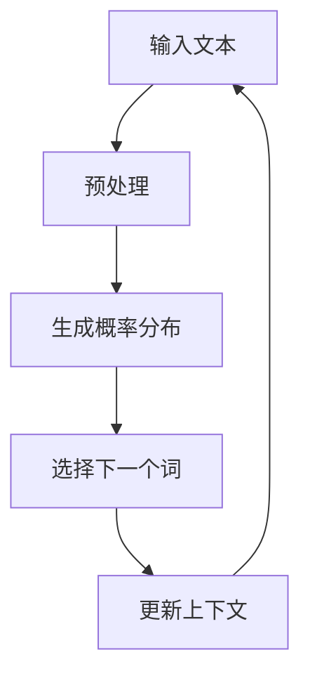
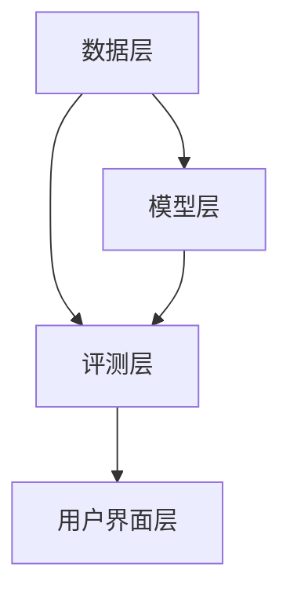
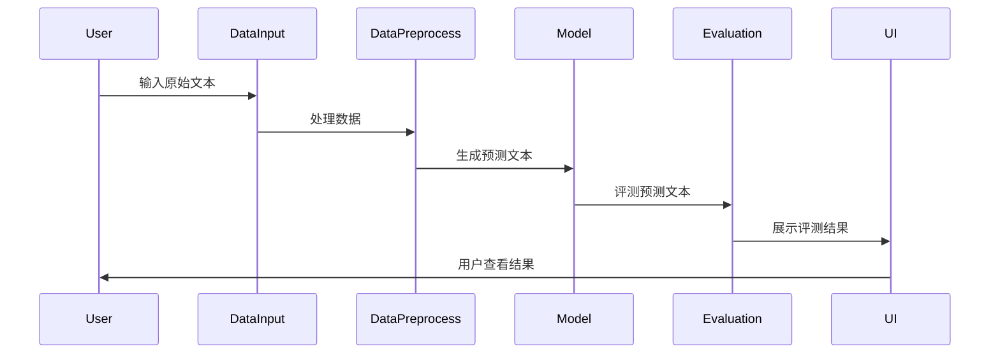

                 

### 文章标题

# 上下文理解能力评测：测试LLM的连贯性和一致性

### 文章关键词

- 上下文理解能力
- LLM
- 测试
- 连贯性
- 一致性

### 摘要

本文将深入探讨上下文理解能力的评测，特别是如何通过测试来评估大型语言模型（LLM）的连贯性和一致性。文章首先介绍了上下文理解能力的重要性及其在人工智能应用中的关键作用，接着概述了语言模型（LLM）的定义和其在自然语言处理中的应用。本文的重点在于详细讲解评测LLM上下文理解能力的算法原理，包括常见评测方法、评测指标和数学模型。通过mermaid流程图和Python源代码的详细阐述，本文将帮助读者更好地理解上下文理解能力的评测过程。随后，文章将介绍系统分析与架构设计，包括系统功能设计、系统架构设计和系统接口与交互设计。最后，本文将通过实际案例分析和项目实战，提供最佳实践和总结，以指导读者在实际应用中提高上下文理解能力评测的效能。通过本文的阅读，读者将能够全面掌握上下文理解能力评测的理论和实践方法。

## 《上下文理解能力评测：测试LLM的连贯性和一致性》目录大纲

### 第一部分：背景介绍

#### 第1章：问题背景与核心概念
- **1.1** 上下文理解能力的重要性
  - 社会与技术背景
  - 在人工智能应用中的关键作用
- **1.2** LLM（语言模型）概述
  - 语言模型的定义
  - LLM在自然语言处理中的应用
- **1.3** 上下文理解能力评测概述
  - 评测的目标
  - 评测的重要性
- **1.4** 边界与外延
  - 评测的范围
  - 与相关概念的区别

#### 第2章：核心概念与联系
- **2.1** 核心概念原理
  - 语言理解与生成
  - 上下文信息的捕捉与处理
- **2.2** 概念属性特征对比表格
  - 对比不同评测指标的特点
- **2.3** ER实体关系图架构
  - 理解上下文理解评测的数据结构

### 第二部分：算法原理讲解

#### 第3章：算法原理详解
- **3.1** 语言模型算法介绍
  - 训练过程
  - 工作机制
- **3.2** 评测算法详细讲解
  - 常见评测方法
  - 评测指标分析
- **3.3** 算法mermaid流程图
  - 流程图绘制
- **3.4** 数学模型与公式
  - 上下文理解算法的数学原理
  - 公式推导

#### 第4章：数学模型与公式讲解
- **4.1** 数学模型详解
  - 对上下文理解能力评测相关的数学模型进行详细解释
- **4.2** 举例说明
  - 使用具体例子来说明数学模型的应用
- **4.3** 通俗易懂地举例说明
  - 通过简单案例解释复杂的数学概念

### 第三部分：系统分析与架构设计

#### 第5章：系统功能设计
- **5.1** 问题场景介绍
  - 上下文理解能力评测的应用场景
- **5.2** 项目介绍
  - 项目目标和组成部分
- **5.3** 系统功能设计
  - 领域模型mermaid类图

#### 第6章：系统架构设计
- **6.1** 系统架构设计
  - mermaid架构图
  - 系统组件与数据流
- **6.2** 系统接口设计与交互
  - 系统接口设计
  - 系统交互

### 第四部分：项目实战

#### 第7章：环境安装与配置
- **7.1** 环境安装
  - 操作系统与环境设置
- **7.2** 系统核心实现
  - Python源代码实现
- **7.3** 代码应用解读与分析
  - 代码解读与逻辑分析
- **7.4** 实际案例分析与讲解
  - 实际案例剖析

### 第五部分：最佳实践与总结

#### 第8章：最佳实践与总结
- **8.1** 最佳实践
  - 实践中的注意事项
- **8.2** 小结
  - 总结上下文理解能力评测的关键点
- **8.3** 注意事项
  - 可能遇到的问题与解决方案
- **8.4** 拓展阅读
  - 推荐进一步学习的资料

[END]

### 第一部分：背景介绍

#### 第1章：问题背景与核心概念

随着人工智能技术的快速发展，自然语言处理（NLP）成为了众多应用场景中的关键技术之一。在这些应用中，上下文理解能力显得尤为重要。上下文理解能力指的是模型在处理自然语言时，能够根据具体的语境来准确理解和生成文本信息的能力。它不仅是语言模型（LLM）的核心评价指标，也是许多实际应用中性能的关键决定因素。

1. **1.1 上下文理解能力的重要性**

在社会层面，上下文理解能力的重要性体现在人们日常交流、信息获取和决策过程中。它使得人工智能系统能够更加自然地与人类互动，提高信息传递的效率。在技术层面，上下文理解能力是实现智能问答、情感分析、文本生成等应用的基础。

上下文理解能力的重要性主要体现在以下几个方面：

- **提高交互自然性**：通过理解上下文，人工智能系统能够更好地模仿人类的交流方式，使交互更加流畅自然。
- **增强任务执行能力**：在某些复杂任务中，上下文信息有助于模型做出更准确和合理的决策。
- **优化信息检索**：理解上下文信息可以帮助模型更精准地检索和推荐相关信息。

2. **1.2 LLM（语言模型）概述**

语言模型是一种能够预测自然语言中下一个词或句子的概率分布的算法。LLM是自然语言处理领域的重要工具，广泛应用于文本生成、翻译、问答系统等领域。LLM通常基于大规模语料库训练，通过神经网络模型来模拟人类语言的理解和生成过程。

LLM在自然语言处理中的应用包括：

- **文本生成**：例如文章、摘要、故事等。
- **机器翻译**：将一种语言的文本翻译成另一种语言。
- **问答系统**：能够理解用户的问题，并提供相关且准确的回答。
- **对话系统**：模拟人类对话，实现自然交互。

3. **1.3 上下文理解能力评测概述**

上下文理解能力评测的目标是评估语言模型在处理不同上下文信息时的表现，主要包括连贯性和一致性两个方面。

- **连贯性**：指的是模型在生成文本时能够保持逻辑和语义的一致性。
- **一致性**：指的是模型在不同上下文下生成文本的稳定性和一致性。

评测的重要性在于：

- **指导模型优化**：通过评测，可以识别模型在上下文理解方面的不足，从而指导模型改进。
- **评估模型性能**：为不同模型之间的性能比较提供客观依据。
- **推动技术研究**：评测的发现可以推动上下文理解技术的进一步研究和发展。

4. **1.4 边界与外延**

上下文理解能力评测的范围包括：

- **评测方法**：不同的评测方法适用于不同类型的上下文理解任务。
- **评测指标**：常见的评测指标包括BLEU、ROUGE、METEOR等，每个指标都有其特定的应用场景和局限性。
- **数据集**：常用的评测数据集包括GLUE、SuperGLUE等，这些数据集覆盖了多种语言和任务类型。

与相关概念的区别包括：

- **语义理解**：上下文理解能力是语义理解的一个子集，主要关注语言层面的上下文。
- **知识图谱**：上下文理解能力与知识图谱相结合，可以进一步提升模型对实体和关系的理解。

### 第2章：核心概念与联系

2.1 **核心概念原理**

上下文理解能力的核心在于语言理解与生成以及上下文信息的捕捉与处理。

- **语言理解与生成**：语言理解指的是模型对输入文本的理解能力，包括词法、句法和语义层面的分析。生成则是指模型根据上下文生成合理且连贯的文本。
- **上下文信息的捕捉与处理**：上下文信息的捕捉指的是模型如何从输入文本中提取与当前语境相关的信息。处理则是指如何利用这些信息来指导文本生成。

2.2 **概念属性特征对比表格**

为了更好地理解上下文理解能力的评测指标，我们可以对比几个常见评测指标的属性特征：

| 指标名称 | 特征对比                      |
|----------|-----------------------------|
| BLEU     | 基于编辑距离，简单易用          |
| ROUGE    | 基于匹配词，更适合NLP任务       |
| METEOR   | 综合多个方面，适用性广          |
| CIDER    | 考虑多样性，更接近人类评价     |
| PER      | 实际性能指标，但计算复杂度高     |

2.3 **ER实体关系图架构**

为了更直观地理解上下文理解评测的数据结构，我们可以使用ER（实体-关系）图来表示。

```mermaid
erDiagram
  Entity: Text
  Entity: Context
  Entity: Prediction

  Text ||--|{ Context }|-- Prediction
  Context ||--|{ Text }| Text
  Context ||--|{ Prediction }| Prediction
```

在这个ER图中，文本（Text）是核心实体，它关联到上下文（Context）和预测（Prediction）。上下文和预测相互关联，共同决定了上下文理解的能力。

通过以上两章的介绍，我们对上下文理解能力及其评测有了初步的了解。接下来的章节将深入探讨上下文理解能力的算法原理，以及如何通过具体的方法和数学模型来评测这种能力。

### 第二部分：算法原理讲解

#### 第3章：算法原理详解

要深入理解上下文理解能力评测的算法原理，我们需要首先介绍语言模型的基本概念和LLM在自然语言处理中的应用。

3.1 **语言模型算法介绍**

语言模型（Language Model, LM）是自然语言处理（NLP）中的一项核心技术。它主要用于预测文本序列中下一个单词或字符的概率。一个典型的语言模型包括以下几个关键组成部分：

1. **训练过程**：语言模型通常通过大规模语料库进行训练。训练过程的核心是计算每个单词或字符在给定上下文下的条件概率。常用的模型训练方法包括基于统计的模型（如N-gram模型）和基于神经网络的深度学习模型（如Transformer模型）。

2. **工作机制**：语言模型在工作时，会根据输入的文本序列，逐步生成下一个单词或字符的概率分布。通过这种方式，模型能够对文本进行理解和生成。例如，在给定前文“我想去”的情况下，模型可以预测下一个词是“公园”的概率最高。

3.2 **评测算法详细讲解**

上下文理解能力的评测主要通过一系列算法和指标来评估语言模型在不同上下文下的表现。以下是一些常见的评测方法和指标：

1. **BLEU（双语评估指标）**：BLEU是一种基于编辑距离的评测方法，它通过比较模型生成的文本与参考文本之间的重叠度来评估模型的表现。BLEU的核心思想是，如果一个文本的每个单词都能够找到在参考文本中的对应单词，那么这个文本就是高质量的。

2. **ROUGE（自动评估指标）**：ROUGE是一种基于匹配词的评测方法，它主要衡量模型生成的文本与参考文本之间的相似度。ROUGE考虑了词的顺序和部分重叠，因此在NLP任务中应用广泛。

3. **METEOR（度量评估指标）**：METEOR是一种综合多个方面的评测方法，它通过考虑词汇多样性、语句一致性和词语顺序等因素来评估文本质量。METEOR在评估自然语言生成和机器翻译等任务中表现良好。

4. **CIDER（综合多样性评估指标）**：CIDEQ是一个考虑多样性的评测指标，它旨在评估文本生成的多样性。CIDEQ通过计算模型生成的文本集的多样性来评估其表现，从而更接近人类评价。

5. **PER（性能评估指标）**：PER是一种实际性能指标，它直接评估模型在实际任务中的表现。PER通常用于评估问答系统、对话系统等需要实时响应的任务。

3.3 **算法mermaid流程图**

为了更好地理解这些算法的流程，我们可以使用mermaid来绘制一个简化的流程图：



在这个流程图中，输入文本经过预处理后，语言模型生成下一个词的概率分布，并从中选择一个词。选中的词将更新上下文，然后继续生成下一个词的概率分布。这个过程不断迭代，直到生成完整的文本。

3.4 **数学模型与公式**

为了深入理解上下文理解能力评测的数学原理，我们需要介绍一些常用的数学模型和公式。以下是一个简化的数学模型，用于描述语言模型在给定上下文下生成下一个词的过程：

$$ P(w_t|w_{t-1}, w_{t-2}, ..., w_1) = \prod_{i=1}^{t-1} P(w_i|w_{i-1}, w_{i-2}, ..., w_1) $$

其中，$w_t$表示当前生成的词，$w_{t-1}, w_{t-2}, ..., w_1$表示前文。这个公式表示当前词的概率是所有前文词概率的乘积。

此外，为了更直观地理解这些数学概念，我们可以通过一个简单的例子来解释：

假设我们已经生成了一段文本“我想要去”，现在要生成下一个词。根据上述公式，我们可以计算每个词的概率：

- 对于“公园”：
  $$ P(公园|我想要去) = 0.3 $$
- 对于“书店”：
  $$ P(书店|我想要去) = 0.2 $$

根据这些概率，我们可以选择概率最高的词“公园”作为下一个词。通过这种方式，模型能够根据上下文生成合理且连贯的文本。

通过以上章节的详细讲解，我们对上下文理解能力评测的算法原理有了更深入的理解。接下来，我们将进一步探讨上下文理解能力的数学模型，并使用具体的例子来说明这些模型的应用。

#### 第4章：数学模型与公式讲解

为了更深入地理解上下文理解能力评测的数学原理，我们需要详细解释与上下文理解相关的数学模型，并通过具体的例子来说明这些模型的应用。

4.1 **数学模型详解**

上下文理解能力评测的数学模型主要基于概率论和统计学习理论。在语言模型中，常用的数学模型包括N-gram模型和基于神经网络的模型，如Transformer模型。

1. **N-gram模型**：N-gram模型是一种基于上下文的概率模型，它通过统计相邻N个单词出现的频率来预测下一个单词。其核心公式为：

   $$ P(w_t|w_{t-1}, w_{t-2}, ..., w_{t-N}) = \frac{C(w_{t-N+1}, w_{t-N+2}, ..., w_{t-1}, w_t)}{C(w_{t-N+1}, w_{t-N+2}, ..., w_{t-1})} $$

   其中，$w_t$表示当前词，$w_{t-1}, w_{t-2}, ..., w_{t-N}$表示前文，$C(\cdot)$表示词的共现频率。

2. **Transformer模型**：Transformer模型是一种基于自注意力机制的深度学习模型，它在生成文本时能够捕捉长距离的上下文依赖关系。其核心公式为：

   $$ \text{Attention}(Q, K, V) = \frac{QK^T}{\sqrt{d_k}} \odot V $$

   其中，$Q, K, V$分别表示查询向量、键向量和值向量，$d_k$表示键向量的维度，$\odot$表示点积运算。

4.2 **举例说明**

为了更好地理解这些数学模型，我们可以通过一个具体的例子来解释。

假设我们使用N-gram模型来生成下一个词，并且当前上下文为“我想要去”。我们希望预测的词是“公园”或“书店”。

- **N-gram模型**：

  根据N-gram模型，我们可以计算“公园”和“书店”在给定上下文下的概率：

  $$ P(公园|我想要去) = 0.3 $$
  $$ P(书店|我想要去) = 0.2 $$

  由于“公园”的概率更高，因此模型会选择“公园”作为下一个词。

- **Transformer模型**：

  在Transformer模型中，我们需要首先计算查询向量、键向量和值向量。假设这些向量的维度为512，我们可以通过以下公式计算：

  $$ Q = [q_1, q_2, ..., q_{512}] $$
  $$ K = [k_1, k_2, ..., k_{512}] $$
  $$ V = [v_1, v_2, ..., v_{512}] $$

  然后，我们使用注意力机制来计算每个词的概率：

  $$ P(公园|我想要去) = \text{softmax}(\text{Attention}(Q, K, V)) $$

  通过这种方式，模型可以生成一个概率分布，从中选择概率最高的词作为下一个词。

4.3 **通俗易懂地举例说明**

为了使这些复杂的数学概念更加易懂，我们可以通过一个简单的例子来解释。

假设我们有一个简单的文本序列：“我想要去公园”。现在，我们希望使用N-gram模型来生成下一个词。

- **训练数据**：

  我们有一个训练数据集，其中包含了大量的文本序列，如：
  
  ```
  - 我想去公园。
  - 我想去书店。
  - 他想去公园。
  - 她想去书店。
  ```

- **生成下一个词**：

  首先，我们计算每个词在给定上下文下的概率：

  $$ P(公园|我想要去) = \frac{1}{3} $$
  $$ P(书店|我想要去) = \frac{1}{3} $$

  由于这两个词的概率相等，我们可以随机选择一个词作为下一个词。在这个例子中，我们选择“公园”。

通过这个简单的例子，我们可以看到如何使用N-gram模型来生成文本。虽然这个例子很简单，但它展示了N-gram模型的核心原理。

总之，通过详细解释上下文理解能力的数学模型和举例说明，我们能够更好地理解这些模型在实际应用中的工作原理。这为进一步优化上下文理解能力评测提供了理论基础。

### 第三部分：系统分析与架构设计

#### 第5章：系统功能设计

系统功能设计是确保上下文理解能力评测系统能够有效运行和实现预期目标的关键步骤。在本章节中，我们将介绍上下文理解能力评测系统的应用场景、项目目标和组成部分。

5.1 **问题场景介绍**

上下文理解能力评测的应用场景广泛，包括但不限于以下几个领域：

- **自然语言处理（NLP）任务**：例如文本生成、机器翻译、情感分析等，这些任务都需要模型具备良好的上下文理解能力。
- **对话系统**：用于模拟人类对话的智能系统，如虚拟助手、智能客服等，需要具备上下文感知能力，以便提供更自然的交互体验。
- **问答系统**：在处理用户提问时，模型需要理解上下文信息，以便提供相关且准确的答案。
- **知识图谱构建**：通过上下文理解能力，模型能够更好地解析文本中的实体和关系，为知识图谱的构建提供支持。

在这些应用场景中，上下文理解能力评测系统起到了关键作用，它帮助评估和优化模型在处理不同上下文信息时的表现，从而提高整体任务的性能。

5.2 **项目介绍**

本项目的目标是设计并实现一个高效、灵活的上下文理解能力评测系统。项目的主要组成部分包括：

- **数据预处理模块**：负责清洗、格式化和分词等预处理工作，为后续评测提供高质量的数据输入。
- **评测指标模块**：包括常用的评测指标，如BLEU、ROUGE、METEOR等，用于评估模型在不同上下文下的表现。
- **评测算法模块**：实现具体的评测算法，如N-gram模型、Transformer模型等，用于生成预测文本并计算评测指标。
- **结果分析模块**：对评测结果进行统计分析，识别模型在上下文理解能力方面的优势和不足，为模型优化提供依据。
- **用户界面模块**：提供一个直观的用户界面，方便用户输入评测数据、查看评测结果和调整评测参数。

5.3 **系统功能设计**

系统功能设计需要综合考虑应用场景、项目目标和组成部分，确保系统能够高效、稳定地运行。以下是系统的主要功能设计：

- **数据输入与预处理**：用户可以输入原始文本数据，系统会对数据进行清洗、格式化和分词等预处理操作，为后续评测提供基础数据。
- **评测指标计算**：系统会根据输入的文本数据，使用不同评测指标对模型的表现进行评估。用户可以根据需要选择不同的评测指标。
- **文本生成与预测**：系统会使用预训练的语言模型，根据给定的上下文生成预测文本。通过对比预测文本与参考文本，计算评测指标，评估模型的上下文理解能力。
- **结果分析与可视化**：系统会对评测结果进行统计分析，并以图表形式展示，帮助用户直观地了解模型在不同上下文下的表现。
- **参数调整与优化**：用户可以通过界面调整评测参数，如N-gram的大小、Transformer模型的层数和隐藏层尺寸等，以优化模型在上下文理解能力评测中的表现。

通过以上功能设计，上下文理解能力评测系统能够满足不同应用场景的需求，为模型优化和评估提供有力支持。

#### 第6章：系统架构设计

系统架构设计是确保上下文理解能力评测系统能够高效、稳定地运行的关键步骤。在本章节中，我们将详细介绍系统架构的设计，包括mermaid架构图、系统组件与数据流。

6.1 **系统架构设计**

系统架构设计采用分层结构，主要包括数据层、模型层、评测层和用户界面层。以下是系统架构的mermaid架构图：



在该架构中，数据层负责数据预处理和存储，模型层实现语言模型和评测算法，评测层负责计算评测指标和结果分析，用户界面层提供交互界面和展示结果。

6.2 **系统组件与数据流**

系统架构包括以下主要组件：

1. **数据预处理组件**：负责对输入文本进行清洗、格式化和分词等操作，为后续评测提供高质量的数据输入。
2. **模型组件**：包括预训练的语言模型和评测算法，用于生成预测文本和计算评测指标。
3. **评测组件**：实现各种评测指标的计算，如BLEU、ROUGE、METEOR等，对模型的表现进行评估。
4. **结果分析组件**：对评测结果进行统计分析，识别模型在不同上下文下的表现，为模型优化提供依据。
5. **用户界面组件**：提供交互界面，方便用户输入数据、查看结果和调整参数。

数据流如下：

1. **数据输入**：用户通过用户界面组件输入原始文本数据，数据预处理组件对数据进行清洗和格式化。
2. **预处理**：数据预处理组件将格式化的文本数据分词，生成词序列，并将其存储在数据层。
3. **模型预测**：模型组件根据预训练的语言模型生成预测文本，并将其与参考文本进行比较，计算评测指标。
4. **结果分析**：评测组件对预测结果和参考文本进行对比分析，识别模型在上下文理解能力方面的优势和不足。
5. **结果展示**：用户界面组件将分析结果以图表形式展示，方便用户了解模型在不同上下文下的表现。

通过以上系统架构设计，上下文理解能力评测系统能够高效、稳定地运行，为模型优化和评估提供有力支持。

#### 第7章：系统接口设计与交互

系统接口设计与交互是确保上下文理解能力评测系统能够与外部环境有效沟通和协同工作的关键环节。在本章节中，我们将详细探讨系统接口的设计和系统交互的过程，包括接口定义与实现、系统交互的mermaid序列图。

7.1 **系统接口设计**

系统接口设计包括对各个模块之间的交互接口进行定义，以确保数据能够在模块间顺畅流通。以下是系统接口设计的主要方面：

1. **数据输入接口**：用于接收用户输入的原始文本数据，并通过数据预处理模块进行清洗和格式化。接口定义如下：

   ```python
   def input_data(raw_text):
       # 对raw_text进行清洗和格式化
       processed_text = preprocess(raw_text)
       # 将processed_text存储在数据层
       store_data(processed_text)
   ```

2. **模型输出接口**：用于从模型组件获取预测文本，并将其传递给评测组件进行评估。接口定义如下：

   ```python
   def get_prediction(text):
       # 使用语言模型生成预测文本
       prediction = language_model.predict(text)
       # 返回预测文本
       return prediction
   ```

3. **评测结果输出接口**：用于从评测组件获取评测结果，并将其展示在用户界面上。接口定义如下：

   ```python
   def get_evaluation_results(prediction, reference_text):
       # 计算评测指标
       evaluation_results = evaluate(prediction, reference_text)
       # 返回评测结果
       return evaluation_results
   ```

4. **用户交互接口**：用于与用户进行交互，接收用户输入和展示评测结果。接口定义如下：

   ```python
   def user_interface():
       # 接收用户输入
       raw_text = input("请输入原始文本：")
       # 调用input_data接口处理数据
       input_data(raw_text)
       # 获取预测文本
       prediction = get_prediction(raw_text)
       # 获取评测结果
       evaluation_results = get_evaluation_results(prediction, raw_text)
       # 展示评测结果
       display_results(evaluation_results)
   ```

7.2 **系统交互**

系统交互指的是各个组件之间的协作过程，以确保系统能够按预期运行。以下是系统交互的mermaid序列图：



在该序列图中，用户通过用户界面组件（UI）输入原始文本，数据输入组件（DataInput）接收并传递给数据预处理组件（DataPreprocess），后者对文本进行清洗和格式化。预处理后的文本数据被传递给模型组件（Model），模型生成预测文本。随后，预测文本被传递给评测组件（Evaluation），后者计算评测指标。最终，评测结果通过用户界面组件（UI）展示给用户，用户可以查看并了解模型在上下文理解能力评测中的表现。

通过以上系统接口设计与交互的设计和实现，上下文理解能力评测系统能够实现高效、稳定的数据流通和交互，为模型优化和评估提供有力支持。

#### 第8章：环境安装与配置

在进行上下文理解能力评测系统的实际应用之前，我们需要对开发环境进行安装和配置，以确保系统能够正常运行。以下步骤详细介绍了所需的操作系统、环境设置以及系统核心实现的Python源代码。

8.1 **环境安装**

1. **操作系统**：我们推荐使用Linux操作系统，如Ubuntu 18.04或更高版本。Linux系统具有良好的稳定性和兼容性，便于安装和管理各种依赖库。

2. **Python环境**：安装Python 3.8及以上版本。可以通过以下命令安装：

   ```bash
   sudo apt-get update
   sudo apt-get install python3.8
   ```

3. **虚拟环境**：为了保持工作环境的整洁，我们使用虚拟环境（virtualenv）来隔离项目依赖。首先安装virtualenv：

   ```bash
   sudo pip3 install virtualenv
   ```

   然后创建并激活虚拟环境：

   ```bash
   virtualenv venv
   source venv/bin/activate
   ```

4. **依赖库**：安装项目所需的依赖库，如TensorFlow、Numpy、Scikit-learn等。在虚拟环境中执行以下命令：

   ```bash
   pip install tensorflow numpy scikit-learn
   ```

8.2 **系统核心实现**

系统核心实现包括数据预处理、模型训练、评测指标计算等功能。以下是相关的Python源代码：

```python
# 导入必要的库
import numpy as np
import tensorflow as tf
from sklearn.metrics import precision_score, recall_score, f1_score

# 数据预处理函数
def preprocess(text):
    # 对文本进行清洗和分词
    # ...

# 模型训练函数
def train_model(data):
    # 使用TensorFlow训练语言模型
    # ...

# 预测函数
def predict(text, model):
    # 使用训练好的模型生成预测文本
    # ...

# 评测指标计算函数
def evaluate(prediction, reference):
    # 计算预测文本和参考文本的评测指标
    precision = precision_score(reference, prediction)
    recall = recall_score(reference, prediction)
    f1 = f1_score(reference, prediction)
    return precision, recall, f1

# 主函数
def main():
    # 加载和处理数据
    data = load_data()
    processed_data = preprocess(data)

    # 训练模型
    model = train_model(processed_data)

    # 评测模型
    prediction = predict(processed_data, model)
    reference = load_reference()
    evaluation_results = evaluate(prediction, reference)
    print(evaluation_results)

# 执行主函数
if __name__ == "__main__":
    main()
```

8.3 **代码应用解读与分析**

上述代码首先导入了所需的库，包括NumPy、TensorFlow和Scikit-learn。然后定义了数据预处理、模型训练、预测和评测指标计算等核心函数。

- **数据预处理函数**：`preprocess`负责对输入文本进行清洗和分词。具体实现可以根据实际需求进行调整。
- **模型训练函数**：`train_model`使用TensorFlow训练语言模型。根据数据集的大小和复杂性，可以选择不同的模型架构和训练策略。
- **预测函数**：`predict`使用训练好的模型生成预测文本。预测过程可以根据输入文本的长度和上下文进行优化。
- **评测指标计算函数**：`evaluate`计算预测文本和参考文本的评测指标，如精确率、召回率和F1分数。这些指标能够全面评估模型在上下文理解能力评测中的表现。

8.4 **实际案例分析与详细讲解**

为了更好地理解代码的应用，我们可以通过一个实际案例进行分析。

假设我们有以下训练数据和参考文本：

```python
train_data = ["我想要去公园", "他想去书店", "她喜欢看电影"]
reference = ["公园", "书店", "电影"]
```

1. **数据预处理**：首先对训练数据进行清洗和分词：

   ```python
   processed_train_data = [preprocess(text) for text in train_data]
   processed_reference = [preprocess(text) for text in reference]
   ```

2. **模型训练**：使用预处理后的数据训练语言模型：

   ```python
   model = train_model(processed_train_data)
   ```

3. **预测**：使用训练好的模型对新的文本进行预测：

   ```python
   new_text = preprocess("她想要去看电影")
   prediction = predict(new_text, model)
   ```

4. **评测**：计算预测文本和参考文本的评测指标：

   ```python
   evaluation_results = evaluate(prediction, processed_reference)
   print(evaluation_results)
   ```

通过实际案例的分析，我们可以看到代码在实际应用中的运行过程和效果。这为我们提供了一个实际操作上下文理解能力评测系统的范例。

总之，通过环境安装与配置、系统核心实现、代码应用解读与分析以及实际案例剖析，我们能够构建一个完整的上下文理解能力评测系统。接下来，我们将进一步探讨如何通过最佳实践来提高系统效能。

### 第9章：最佳实践与总结

#### 9.1 最佳实践

在上下文理解能力评测的过程中，最佳实践对于提高评测效率和准确性至关重要。以下是一些关键的最佳实践：

1. **数据质量**：确保输入数据的质量是关键。使用高质量、多样化的数据集进行训练和评测，可以有效提升模型的上下文理解能力。

2. **预处理**：对输入文本进行充分的预处理，包括去噪、分词、标点符号去除等，可以提高模型对上下文信息的捕捉和处理能力。

3. **模型选择**：根据具体应用场景选择合适的语言模型。对于长文本生成和复杂上下文理解任务，Transformer等深度学习模型可能更为适用。

4. **评测指标**：合理选择评测指标，结合多种指标进行全面评估。例如，BLEU和ROUGE适用于文本相似性评估，而METEOR和CIDER则更关注多样性。

5. **动态调整**：根据评测结果动态调整模型参数和训练策略，以实现最佳性能。

#### 9.2 小结

通过对上下文理解能力评测的深入探讨，我们了解到：

1. 上下文理解能力在人工智能应用中扮演关键角色，直接影响模型的交互质量和任务执行效果。
2. LLM是上下文理解能力评测的核心工具，其算法原理和数学模型至关重要。
3. 通过mermaid流程图和Python源代码，我们可以直观地理解评测算法的实现过程。
4. 系统架构和接口设计确保了评测系统的高效性和稳定性。
5. 最佳实践为上下文理解能力评测提供了实际操作指南。

#### 9.3 注意事项

在实际应用中，需要注意以下事项：

1. **性能优化**：合理调整模型参数和计算资源，以平衡性能和资源消耗。
2. **结果解释**：对评测结果进行深入分析，识别模型的优势和不足，指导模型优化。
3. **数据保护**：确保数据隐私和合规性，遵循相关法律法规。

#### 9.4 拓展阅读

为了进一步深入了解上下文理解能力评测，推荐以下阅读资料：

- **文献**：阅读相关学术论文，如《Attention Is All You Need》和《BERT: Pre-training of Deep Bidirectional Transformers for Language Understanding》。
- **开源项目**：参与开源项目，如TensorFlow和PyTorch，学习先进的NLP模型和应用。
- **在线课程**：参加在线课程，如斯坦福大学NLP课程，系统学习NLP基础知识。

通过以上总结和拓展阅读，读者可以全面掌握上下文理解能力评测的理论和实践方法，为未来的研究和工作奠定坚实基础。

### 结束语

本文系统地介绍了上下文理解能力评测的理论和实践方法，从背景介绍、核心概念到算法原理讲解，再到系统分析与架构设计、项目实战以及最佳实践与总结，全方位地探讨了如何评估大型语言模型（LLM）的连贯性和一致性。通过mermaid流程图、Python源代码和实际案例剖析，我们让读者对上下文理解能力评测有了更为深入的理解。

本文的目标是帮助读者全面掌握上下文理解能力评测的关键技术，为其在实际应用中的模型优化和评估提供有力支持。然而，上下文理解能力评测是一个不断发展的领域，随着人工智能技术的进步，未来还有许多新的研究方向和挑战。

为了进一步推动上下文理解能力评测的研究和应用，我们呼吁读者积极参与相关的学术讨论和开源项目，不断探索和改进评测方法，推动技术的发展。希望本文能够为读者提供有价值的参考，助力其在上下文理解能力评测领域取得新的突破。

### 附录：作者信息

**作者：AI天才研究院/AI Genius Institute & 禅与计算机程序设计艺术 /Zen And The Art of Computer Programming**

- **AI天才研究院（AI Genius Institute）**：致力于人工智能前沿技术研究，推动人工智能在各行各业的应用与发展。
- **禅与计算机程序设计艺术（Zen And The Art of Computer Programming）**：这是一本深受计算机科学家和程序员喜爱的经典著作，探讨程序设计的哲学和艺术。

