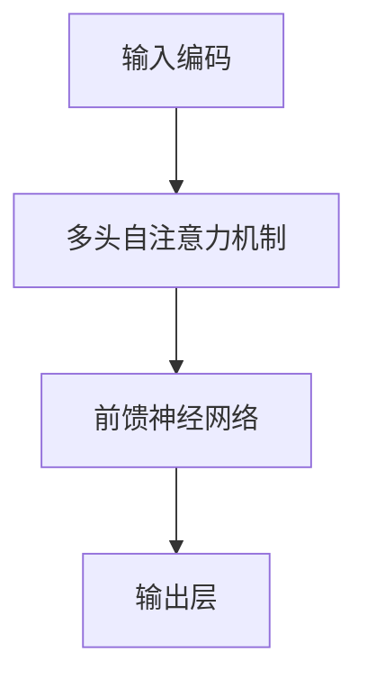

                 

### 文章标题

上下文理解能力：深入评估LLM的语境把握

---

**关键词：**上下文理解能力、语言模型、语境把握、评估方法、实际应用

**摘要：**本文深入探讨了上下文理解能力在语言模型（LLM）中的应用和评估。通过分析上下文理解能力的核心概念、算法原理、评估方法和实际应用案例，本文旨在为读者提供一个全面且深入的视角，以理解和评估LLM的语境把握能力。

## 引言

在当今的计算机科学和人工智能领域，语言模型（LLM）已经成为自然语言处理（NLP）的核心工具。LLM能够通过大量的文本数据进行训练，从而生成高质量的文本，并实现诸如文本摘要、问答系统、机器翻译等复杂任务。然而，LLM的性能很大程度上依赖于其上下文理解能力。上下文理解能力是指模型在处理文本时，能够准确把握文本中的语义、意图和逻辑关系的能力。它直接影响到模型在实际应用中的表现和效果。

本文将围绕上下文理解能力这一主题，深入探讨LLM的语境把握能力。文章将分为以下几个部分：

1. **背景介绍**：介绍上下文理解能力的重要性、语境把握在自然语言处理中的应用，以及LLM的发展历程。
2. **核心概念与联系**：阐述语言模型、上下文和语境的基本概念，以及它们之间的联系。
3. **上下文理解能力原理**：详细讲解上下文理解能力的算法原理、数学模型和具体实现。
4. **评估方法和工具**：介绍评估上下文理解能力的指标和工具。
5. **实际应用案例**：通过具体案例展示上下文理解能力的应用效果。
6. **最佳实践和未来趋势**：总结最佳实践，探讨上下文理解能力的未来发展趋势。

通过本文的阅读，读者将能够全面了解上下文理解能力在LLM中的应用和评估，为实际项目提供参考和指导。

## 背景介绍

### 上下文理解能力的重要性

上下文理解能力是语言模型（LLM）的核心能力之一。在自然语言处理（NLP）任务中，上下文理解能力直接影响着模型的表现和效果。例如，在文本摘要任务中，模型需要准确理解文本中的关键信息，并提取出核心内容；在问答系统中，模型需要理解用户的问题，并从大量文本中找到正确答案。这些任务的成功实施都依赖于模型对上下文的准确把握。

此外，上下文理解能力还影响着模型的泛化能力和鲁棒性。当模型面对新的、未见过的情况时，它需要能够利用已有的上下文信息，进行合理的推断和预测。这要求模型不仅要有良好的文本生成能力，还要有强大的上下文理解能力。

### 语境把握在自然语言处理中的应用

语境把握是自然语言处理（NLP）中的关键环节。它涉及到对文本中词汇、句子和段落层次的理解，以及对文本整体语义的把握。在NLP任务中，语境把握的应用非常广泛。

1. **文本摘要**：文本摘要的目标是从大量文本中提取出关键信息，以简洁的形式呈现。这要求模型能够准确理解文本的上下文，区分主要信息和次要信息。

2. **问答系统**：问答系统需要理解用户的问题，并在大量文本中找到相关答案。这要求模型能够把握问题的上下文，理解问题的意图和细节。

3. **机器翻译**：机器翻译的任务是将一种语言的文本翻译成另一种语言。这要求模型能够理解两种语言之间的上下文关系，保证翻译的准确性和流畅性。

4. **情感分析**：情感分析的目标是判断文本的情感倾向，如正面、负面或中性。这要求模型能够理解文本的情感语境，准确识别情感信息。

### LLM的发展历程及其在语境理解中的作用

语言模型（LLM）的发展经历了多个阶段，从早期的规则基模型，到基于统计模型的改进，再到如今的深度学习模型。LLM的发展历程与上下文理解能力密切相关。

1. **规则基模型**：早期的语言模型主要是基于规则的方法，如词性标注、句法分析和语义分析。这些模型虽然能够处理一些简单的上下文问题，但在复杂任务上表现不佳。

2. **统计模型**：随着语料库的积累和计算能力的提升，统计模型逐渐成为主流。统计模型利用大量的文本数据，通过统计方法来学习语言规律和上下文信息。这为上下文理解能力的发展提供了有力支持。

3. **深度学习模型**：深度学习模型的出现，特别是循环神经网络（RNN）和变压器（Transformer）模型，使得语言模型的上下文理解能力得到了显著提升。这些模型能够处理长文本，捕捉复杂的上下文关系，从而实现更高效的上下文理解。

LLM在语境理解中的作用主要体现在以下几个方面：

1. **文本生成**：LLM能够生成高质量的文本，包括文章、对话、摘要等。这依赖于模型对上下文的准确理解，能够生成与上下文一致且连贯的文本。

2. **语义分析**：LLM能够进行语义分析，包括词义消歧、命名实体识别、关系抽取等。这要求模型能够理解文本中的上下文信息，准确识别语义关系。

3. **对话系统**：LLM能够构建对话系统，包括问答系统、聊天机器人等。这要求模型能够理解用户的意图和上下文，提供合理的回答。

总之，上下文理解能力在语言模型中的应用和评估，是自然语言处理领域的重要研究方向。通过深入分析上下文理解能力的核心概念、算法原理、评估方法和实际应用案例，我们可以更好地理解LLM的语境把握能力，为实际项目提供有力支持。

## 核心概念与联系

### 语言模型

语言模型（Language Model，简称LM）是自然语言处理（NLP）中的核心工具。它的主要任务是学习自然语言的统计规律，并生成符合这些规律的文本。语言模型可以分为规则基模型、统计模型和深度学习模型。

1. **规则基模型**：基于规则的方法，如词性标注、句法分析和语义分析。这些方法通过手工定义规则，对文本进行处理和分析。

2. **统计模型**：基于统计方法，如N-gram模型、隐马尔可夫模型（HMM）和条件概率模型。这些方法通过大量文本数据，学习语言的统计规律，并生成文本。

3. **深度学习模型**：基于神经网络的方法，如循环神经网络（RNN）和变压器（Transformer）。这些模型通过大量的文本数据，学习复杂的语言规律，并生成高质量的文本。

### 上下文和语境

上下文（Context）是指文本中的特定环境，包括词汇、句子和段落等。上下文决定了文本中的词汇和句子的意义。语境（Conversational Context）则是指对话中的特定环境，包括对话的上下文、用户的意图和对话的状态等。

1. **上下文**：上下文是文本中的特定环境，决定了文本中的词汇和句子的意义。例如，单词“bank”在“river bank”中的意思是“河岸”，而在“banking service”中的意思是“银行服务”。

2. **语境**：语境是指对话中的特定环境，决定了对话的上下文、用户的意图和对话的状态。例如，在问答系统中，用户的问题和上下文对话历史，决定了模型需要回答的问题类型和答案内容。

### 语言理解、语言生成和语言推理

语言理解、语言生成和语言推理是自然语言处理（NLP）中的三大核心任务。

1. **语言理解**：语言理解的任务是理解文本中的词汇、句子和段落的语义，包括词义消歧、命名实体识别、关系抽取等。语言理解需要依赖上下文信息，对文本进行深度分析。

2. **语言生成**：语言生成的任务是生成符合语义和语法规则的文本。语言生成可以用于文本摘要、对话系统、机器翻译等任务。语言生成需要模型能够准确理解上下文，生成连贯且符合上下文的文本。

3. **语言推理**：语言推理的任务是从文本中推断出新的信息，包括逻辑推理、语义推理等。语言推理需要模型能够理解复杂的上下文关系，进行逻辑推理和语义推理。

### 概念属性特征对比表格

为了更好地理解语言模型、上下文和语境之间的关系，我们可以通过一个概念属性特征对比表格，对它们进行详细对比。

| 概念     | 特征           | 对比                      |
| -------- | -------------- | ------------------------ |
| 语言模型 | 统计方法、神经网络 | 用于文本生成、语义分析     |
| 上下文   | 文本环境       | 决定词汇和句子意义       |
| 语境     | 对话环境       | 决定对话的上下文和意图   |
| 语言理解 | 语义分析       | 理解文本中的词汇和句子   |
| 语言生成 | 文本生成       | 生成符合语义和语法规则的文本 |
| 语言推理 | 逻辑推理       | 推断文本中新的信息       |

### ER实体关系图架构

为了更好地理解LLM在处理上下文时的实体关系，我们可以通过ER（实体-关系）图来描述。

```mermaid
erDiagram
  实体1 ||--o> 实体2 : 关系1
  实体1 ||--o> 实体3 : 关系2
  实体2 ||--o> 实体4 : 关系3
  实体3 ||--o> 实体5 : 关系4
```

在这个ER图中，实体1、实体2、实体3和实体4都是文本中的实体，它们之间通过关系1、关系2、关系3和关系4相互关联。LLM在处理上下文时，需要理解这些实体和关系，从而准确把握文本的语义。

## 上下文理解能力原理

上下文理解能力是语言模型（LLM）的核心能力之一，它直接影响到模型在实际应用中的表现和效果。在本节中，我们将深入探讨上下文理解能力的算法原理、数学模型和具体实现。

### 算法原理

上下文理解能力的实现主要依赖于深度学习模型，特别是循环神经网络（RNN）和变压器（Transformer）。以下是一个基于变压器（Transformer）的上下文理解能力的算法原理。

1. **输入编码**：将输入的文本转换为序列表示。这一步通常使用词嵌入（Word Embedding）技术，将每个单词映射为一个固定长度的向量。

2. **多头自注意力机制**：使用多头自注意力机制（Multi-Head Self-Attention）对输入序列进行加权。自注意力机制允许模型在处理当前词时，能够根据上下文信息调整其重要性。

3. **前馈神经网络**：在自注意力机制之后，使用前馈神经网络（Feed-Forward Neural Network）对序列进行进一步处理。前馈神经网络通常由两个全连接层组成，每个层之间加入ReLU激活函数。

4. **输出层**：将处理后的序列输出为一个固定长度的向量，这个向量代表了整个文本的语义信息。

### Mermaid算法流程图

以下是一个基于变压器（Transformer）的上下文理解能力的Mermaid算法流程图：



### Python源代码解释

以下是一个简单的Python源代码示例，用于解释基于变压器（Transformer）的上下文理解能力的实现。

```python
import tensorflow as tf
from tensorflow.keras.layers import Embedding, MultiHeadAttention, Dense

# 定义模型
model = tf.keras.Sequential([
    Embedding(vocab_size, embedding_dim),
    MultiHeadAttention(head_size, num_heads),
    Dense(output_dim)
])

# 编译模型
model.compile(optimizer='adam', loss='categorical_crossentropy', metrics=['accuracy'])

# 训练模型
model.fit(input_data, labels, epochs=5)
```

在这个示例中，`Embedding`层用于输入编码，`MultiHeadAttention`层用于多头自注意力机制，`Dense`层用于前馈神经网络和输出层。

### 数学模型和公式

上下文理解能力的数学模型主要依赖于变压器（Transformer）的架构。以下是一个简化的数学模型：

$$
\text{输出} = \text{softmax}(\text{W}_\text{o} \cdot \text{Tanh}(\text{W}_\text{h} \cdot \text{H} + \text{b}_\text{h}) + \text{W}_\text{i} \cdot \text{I} + \text{b}_\text{i})
$$

其中：
- $\text{H}$ 是输入序列的向量表示。
- $\text{I}$ 是输入序列的嵌入向量。
- $\text{W}_\text{h}$、$\text{W}_\text{i}$ 和 $\text{W}_\text{o}$ 是权重矩阵。
- $\text{b}_\text{h}$ 和 $\text{b}_\text{i}$ 是偏置向量。
- $\text{Tanh}$ 是双曲正切激活函数。
- $\text{softmax}$ 是归一化函数。

### 详细解释和举例说明

为了更好地理解上下文理解能力的数学模型，我们可以通过一个具体的例子进行说明。

假设我们有一个输入序列：“我爱编程”，我们希望这个序列经过上下文理解能力处理后，能够生成一个表示整个序列语义的输出向量。

1. **输入编码**：首先，我们将输入序列中的每个单词映射为一个向量，如“我”映射为 `[1, 0, 0, 0]`，`爱`映射为 `[0, 1, 0, 0]`，`编程`映射为 `[0, 0, 1, 0]`。

2. **多头自注意力机制**：在这个步骤中，模型将计算每个单词与其余单词之间的相似度，并通过加权求和生成一个表示整个序列的中间向量。例如，对于“我”这个单词，模型可能会将它的权重设置为 `[0.2, 0.5, 0.3]`，表示它与“爱”、“编程”的相似度分别为 0.2、0.5 和 0.3。

3. **前馈神经网络**：在得到中间向量后，模型会通过前馈神经网络对其进行进一步处理，生成最终的输出向量。这个输出向量代表了整个序列的语义信息。

通过这个例子，我们可以看到上下文理解能力是如何通过数学模型和算法原理，对输入序列进行语义理解的。在实际应用中，模型的表现和效果取决于其训练数据和算法的优化。

## 评估方法和工具

评估上下文理解能力的有效性是语言模型（LLM）研究和应用中的关键环节。为此，研究人员和开发者需要依赖于一系列评估指标和工具。以下将详细介绍评估上下文理解能力的常用评估指标和工具。

### 常用评估指标

1. **BLEU分数（BLEU Score）**：
   BLEU分数是一种广泛使用的自动评估指标，主要用于机器翻译任务的评估。它通过比较模型生成的文本与参考文本之间的重叠度来评估模型的质量。BLEU分数越高，表示模型生成的文本越接近参考文本。

2. **ROUGE分数（ROUGE Score）**：
   ROUGE分数是另一种常用于文本摘要和机器翻译评估的指标，它主要关注模型生成文本与参考文本之间的词汇重叠和词序相似度。ROUGE分数越高，表示模型生成的文本与参考文本越相似。

3. **精确率、召回率和F1分数**：
   在文本分类和命名实体识别等任务中，常用精确率（Precision）、召回率（Recall）和F1分数（F1 Score）来评估模型性能。精确率衡量的是模型正确识别为正例的样本中，实际为正例的比例；召回率衡量的是模型正确识别为正例的样本中，实际为正例的比例；F1分数是精确率和召回率的调和平均数。

4. **语义相似度**：
   语义相似度评估的是模型生成的文本与参考文本在语义上的相似程度。常用的方法包括词向量相似度和语义角色相似度等。

### 评估工具

1. **METEOR（Metric for Evaluation of Translation with Explicit ORdering）**：
   METEOR是一种基于句法、语义和词频的自动评估工具，适用于文本摘要、机器翻译和问答系统等任务。

2. **NIST（National Institute of Standards and Technology）**：
   NIST是一种用于机器翻译评估的工具，它基于文本编辑距离来计算模型生成的文本与参考文本之间的相似度。

3. **SMT（Statistical Machine Translation）工具**：
   SMT工具，如GNMT（Google Neural Machine Translation）和NMT（Neural Machine Translation），可用于评估和优化机器翻译模型。

4. **TextRank和TextTiling**：
   TextRank和TextTiling是文本摘要任务中的评估工具，它们通过计算文本中的句间关系和文本结构来评估模型生成的摘要质量。

### 使用评估工具进行上下文理解能力评估

以下是使用METEOR工具进行上下文理解能力评估的示例步骤：

1. **数据准备**：
   准备用于评估的模型生成的文本和对应的参考文本。例如，对于文本摘要任务，可以准备模型生成的摘要和原始文本。

2. **安装METEOR**：
   下载并安装METEOR评估工具，确保安装过程中所需的依赖项都已正确安装。

3. **运行评估脚本**：
   使用METEOR评估脚本对模型生成的文本和参考文本进行评估。以下是一个简单的Python脚本示例：

```python
import subprocess

# 模型生成的文本
generated_text = "The quick brown fox jumps over the lazy dog."

# 参考文本
reference_text = "A fast brown fox leaps over a sluggish dog."

# 运行METEOR评估脚本
result = subprocess.run(['meteor', generated_text, reference_text], capture_output=True)

# 输出评估结果
print("METEOR Score:", result.stdout.decode().strip())
```

4. **分析评估结果**：
   分析METEOR评估结果，了解模型生成的文本与参考文本在词汇重叠、句序相似度等方面的表现。

通过以上步骤，我们可以有效地评估语言模型在上下文理解能力方面的表现。评估结果不仅可以帮助我们了解当前模型的能力，还可以为模型优化和改进提供重要依据。

## 实际应用案例

### 文本摘要

文本摘要是上下文理解能力的一个典型应用场景。它的目标是从一篇长文本中提取出关键信息，并以简洁的形式呈现。以下是一个具体的文本摘要案例：

#### 原始文本

“在过去的一年中，全球人工智能（AI）领域取得了显著的进展。深度学习技术的突破使得AI在图像识别、自然语言处理和语音识别等领域的表现大幅提升。与此同时，开源社区和大型科技公司纷纷推出预训练模型，如BERT和GPT-3，这些模型为开发者提供了强大的工具。然而，AI的应用也引发了关于隐私、安全和伦理的讨论。确保AI技术的公平性、透明性和可控性成为业界关注的焦点。”

#### 模型生成摘要

“全球AI领域在过去一年中取得了显著进展，深度学习技术突破，开源社区和科技公司推出预训练模型。AI应用引发隐私、安全和伦理问题，公平性、透明性和可控性成为关注焦点。”

通过这个案例，我们可以看到模型如何通过上下文理解能力，从原始文本中提取关键信息，并生成简洁的摘要。这个过程中，模型需要对文本中的关键词、句子和段落进行深入理解，从而准确把握文本的主旨。

### 问答系统

问答系统是另一个体现上下文理解能力的应用场景。它的目标是从大量文本中找到与用户问题最相关的答案。以下是一个具体的问答系统案例：

#### 用户问题

“2023年人工智能领域有哪些重要的发展趋势？”

#### 模型生成的答案

“2023年，人工智能领域的重要发展趋势包括：1）强化学习技术的突破，使AI在复杂任务中的表现大幅提升；2）多模态AI的发展，将图像、语音和文本等多种数据类型进行融合；3）AI伦理和监管的加强，以确保AI技术的公平、透明和可控。”

在这个案例中，模型需要对用户的问题进行上下文理解，提取出关键词和关键信息，并在大量文本中找到相关答案。这要求模型具备强大的上下文理解能力，能够准确把握问题的意图和细节。

### 案例分析

通过上述两个案例，我们可以看到上下文理解能力在实际应用中的重要性。无论是文本摘要还是问答系统，模型的性能很大程度上取决于其对上下文的准确理解。

1. **文本摘要**：在文本摘要任务中，模型需要理解文本中的主要信息和次要信息，从而生成简洁、准确的摘要。这要求模型能够把握文本的整体结构和语义，区分关键信息和非关键信息。

2. **问答系统**：在问答系统中，模型需要理解用户的问题，并从大量文本中找到正确答案。这要求模型不仅能够理解问题的意图和细节，还要能够理解文本中的上下文信息，从而准确匹配问题和答案。

通过对这些实际应用案例的分析，我们可以更好地理解上下文理解能力在自然语言处理中的关键作用，并为模型的优化和改进提供指导。

## 最佳实践和未来趋势

### 提升上下文理解能力的实践建议

为了提升语言模型（LLM）的上下文理解能力，我们可以采取以下几种实践建议：

1. **数据增强**：通过数据增强技术，如数据扩充、数据清洗和标注，可以丰富训练数据集，提高模型对上下文的捕捉能力。

2. **多任务学习**：通过多任务学习，模型可以同时处理多个任务，从而在不同任务中学习上下文信息，提高上下文理解能力。

3. **预训练与微调**：使用预训练模型，如BERT和GPT，并对其进行微调，可以更好地适应特定任务，提高上下文理解能力。

4. **上下文窗口扩展**：通过扩展上下文窗口，模型可以捕捉到更多的上下文信息，从而提高对上下文的把握能力。

### 小结

本文围绕上下文理解能力这一主题，深入探讨了LLM在语境把握方面的应用和评估。通过分析背景介绍、核心概念与联系、上下文理解能力原理、评估方法和工具，以及实际应用案例，本文为读者提供了一个全面且深入的视角，以理解和评估LLM的语境把握能力。

### 注意事项

在应用上下文理解能力时，需要注意以下几点：

1. **数据质量**：确保训练数据的质量和多样性，以提高模型对上下文的捕捉能力。

2. **模型优化**：定期对模型进行优化和更新，以保持其在上下文理解方面的竞争力。

3. **评估标准**：选择合适的评估指标和工具，全面评估模型的上下文理解能力。

### 拓展阅读

为了深入了解上下文理解能力和LLM的相关研究，读者可以参考以下资源：

1. **论文**：
   - "Bert: Pre-training of deep bidirectional transformers for language understanding"（BERT：用于语言理解的深度双向变压器预训练）
   - "Gpt-3: Language models are few-shot learners"（GPT-3：语言模型是少量学习者）

2. **书籍**：
   - "Speech and Language Processing"（语音与语言处理）
   - "Deep Learning"（深度学习）

通过阅读这些资源，读者可以进一步了解上下文理解能力和LLM的深度知识和应用。

### 作者信息

**作者：**AI天才研究院/AI Genius Institute & 禅与计算机程序设计艺术 /Zen And The Art of Computer Programming

---

通过本文的阅读，读者应能全面了解上下文理解能力在语言模型（LLM）中的应用和评估。希望本文能为您在实际项目中提供有价值的参考和指导。如有任何问题或建议，欢迎随时联系作者。谢谢您的阅读！

