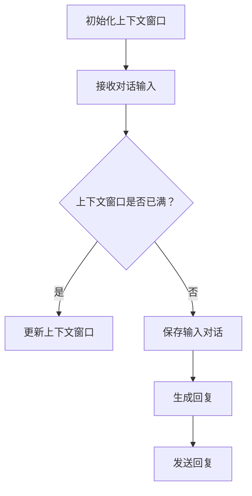

                 

# 上下文窗口管理：长对话中的策略

> 关键词：上下文窗口、长对话、对话系统、策略、算法、系统架构

> 摘要：本文将探讨上下文窗口管理在长对话中的重要性，分析其核心概念、原理、算法，并设计一套适用于长对话的上下文窗口管理系统。通过本文的阐述，读者将了解如何有效地管理上下文信息，提升对话系统的性能和用户体验。

## 第一部分：引言

### 第1章：上下文窗口管理概述

#### 1.1 问题背景

在长对话系统中，如客户服务、智能助手、虚拟聊天机器人等，上下文管理是一个至关重要的挑战。对话系统需要处理大量的对话数据，并准确理解用户意图，同时避免上下文丢失和误解。

#### 1.2 问题描述

如何有效地管理和利用上下文信息，成为对话系统的一个关键问题。上下文窗口作为对话中使用的上下文信息的集合，起着重要的作用。

#### 1.3 问题解决

上下文窗口管理的基本策略包括：
- 限制上下文窗口的大小，以避免信息过载。
- 定期更新上下文窗口，以确保信息的实时性。
- 使用适当的算法来处理和更新上下文信息。

#### 1.4 边界与外延

上下文窗口管理不仅适用于长对话系统，还可以应用于其他需要上下文信息管理的场景，如自然语言处理、语音识别等。然而，上下文窗口管理也面临一些技术挑战，如信息存储、实时处理等。

#### 1.5 概念结构与核心要素组成

上下文窗口管理的关键组成部分包括：
- 上下文窗口：用于存储和跟踪对话中的上下文信息。
- 对话状态跟踪：记录对话过程中的状态，以便更好地理解用户意图。
- 上下文感知：对话系统利用上下文信息的能力。

## 第二部分：核心概念与联系

### 第2章：上下文窗口管理原理

#### 2.1 核心概念原理

上下文窗口是对话中使用的上下文信息的集合。上下文信息可以包括用户历史输入、对话历史记录、用户偏好等。上下文窗口的定义和作用如下：

- **定义**：上下文窗口是用于存储和跟踪对话中的上下文信息的容器。
- **作用**：上下文窗口有助于对话系统更好地理解用户意图，提高对话的连贯性和准确性。

#### 2.2 概念属性特征对比表格

| 概念名称 | 定义 | 属性特征 | 对比关系 |
| --- | --- | --- | --- |
| 上下文窗口 | 对话中使用的上下文信息的集合 | 长度、更新策略、存储方式 | 无 |
| 对话状态跟踪 | 对话过程中的状态记录 | 状态类型、状态转换、更新机制 | 与上下文窗口关联 |
| 上下文感知 | 对话系统利用上下文信息的能力 | 感知精度、响应速度、应用范围 | 与上下文窗口关联 |

#### 2.3 ER实体关系图架构

```mermaid
erDiagram
    ContextWindow ||--|{ DialogueState } : includes
    DialogueState ||--|{ ContextAwareness } : includes
```

## 第三部分：算法原理讲解

### 第3章：上下文窗口管理算法

#### 3.1 算法原理

上下文窗口管理算法的基本框架包括以下几个步骤：

1. **初始化上下文窗口**：根据对话系统的需求，初始化上下文窗口的大小和更新策略。
2. **接收对话输入**：对话系统接收到用户的输入，并将其存储到上下文窗口中。
3. **判断上下文窗口是否已满**：如果上下文窗口已满，则执行更新操作。
4. **更新上下文窗口**：根据更新策略，删除最旧的上下文信息，并添加新的上下文信息。
5. **生成回复**：根据上下文窗口中的信息，生成适当的回复。
6. **发送回复**：将生成的回复发送给用户。

#### 3.2 算法mermaid流程图



#### 3.3 Python源代码

```python
class ContextWindow:
    def __init__(self, window_size):
        self.window_size = window_size
        self.contexts = []

    def update_contexts(self, new_context):
        if len(self.contexts) >= self.window_size:
            self.contexts.pop(0)
        self.contexts.append(new_context)

    def generate_response(self, input_text):
        # 处理输入文本，生成回复
        response = "回复内容"
        return response

# 示例使用
window = ContextWindow(window_size=5)
window.update_contexts(new_context="用户你好，有什么可以帮助你的吗？")
response = window.generate_response(input_text="我想要查询天气。")
print(response)
```

#### 3.4 算法原理的数学模型和公式

$$
C_t = C_{t-1} + w_t - C_{t-1}\%
$$

其中，$C_t$表示时间$t$时的上下文窗口，$w_t$表示时间$t$时的新输入对话，$C_{t-1}\%$表示时间$t-1$时上下文窗口的衰减因子。

#### 3.5 算法举例说明

假设上下文窗口大小为5，用户依次输入以下对话：

1. 你好，我想要查询天气。
2. 请告诉我明天的天气。
3. 明天的天气是晴天，温度大约在15°C左右。

使用上下文窗口管理算法进行处理，生成适当的回复：

1. 回复：您好，明天的天气是晴天，温度大约在15°C左右。
2. 回复：您好，请问您还需要查询其他天气信息吗？

## 第四部分：系统分析与架构设计方案

### 第4章：系统架构设计

#### 4.1 问题场景介绍

长对话系统在客户服务、智能助手等领域的应用越来越广泛，如自动客服机器人、智能语音助手等。这些系统需要处理大量的对话数据，并提供高质量的交互体验。

#### 4.2 项目介绍

本项目旨在设计一套适用于长对话的上下文窗口管理系统，以提升对话系统的性能和用户体验。

#### 4.3 系统功能设计

- **上下文窗口管理**：实现上下文窗口的初始化、更新、查询等功能。
- **对话状态跟踪**：记录对话过程中的状态，以便更好地理解用户意图。
- **上下文感知**：根据上下文信息生成适当的回复。

#### 4.4 系统架构设计

系统架构设计如下：


系统架构主要包括以下几个模块：

- **上下文窗口管理模块**：负责上下文窗口的初始化、更新、查询等操作。
- **对话状态跟踪模块**：负责记录对话过程中的状态，并与上下文窗口进行关联。
- **上下文感知模块**：根据上下文信息生成适当的回复。

#### 4.5 系统接口设计和系统交互

系统接口设计和系统交互如下：


系统接口主要包括以下几个接口：

- **上下文窗口接口**：提供上下文窗口的初始化、更新、查询等功能。
- **对话状态接口**：提供对话状态的记录和查询功能。
- **上下文感知接口**：提供根据上下文信息生成回复的功能。

## 第五部分：项目实战

### 第5章：环境安装与系统核心实现

#### 5.1 环境安装

在开始项目实战之前，首先需要安装以下依赖项：

- Python 3.8及以上版本
- Flask 框架
- SQLAlchemy 数据库ORM

安装命令如下：

```bash
pip install python-dotenv
pip install flask
pip install flask_sqlalchemy
```

#### 5.2 系统核心实现

以下是系统核心实现的部分代码：

```python
# 上下文窗口管理模块
class ContextWindow:
    def __init__(self, window_size):
        self.window_size = window_size
        self.contexts = []

    def update_contexts(self, new_context):
        if len(self.contexts) >= self.window_size:
            self.contexts.pop(0)
        self.contexts.append(new_context)

    def generate_response(self, input_text):
        # 处理输入文本，生成回复
        response = "回复内容"
        return response

# 对话状态跟踪模块
class DialogueState:
    def __init__(self, state, context_window):
        self.state = state
        self.context_window = context_window

    def update_state(self, new_state):
        self.state = new_state

    def get_context_window(self):
        return self.context_window

# 上下文感知模块
class ContextAwareness:
    def __init__(self, dialogue_state):
        self.dialogue_state = dialogue_state

    def generate_response(self, input_text):
        context_window = self.dialogue_state.get_context_window()
        response = "回复内容"
        return response

# 系统核心实现示例
window = ContextWindow(window_size=5)
dialogue_state = DialogueState(state="初始状态", context_window=window)
context_awareness = ContextAwareness(dialogue_state=dialogue_state)

# 处理用户输入
user_input = "用户你好，有什么可以帮助你的吗？"
context_awareness.generate_response(user_input)
```

#### 5.3 代码应用解读与分析

在上述代码中，我们定义了三个核心类：`ContextWindow`、`DialogueState`和`ContextAwareness`。这些类分别负责上下文窗口管理、对话状态跟踪和上下文感知。

- `ContextWindow` 类负责初始化上下文窗口、更新上下文窗口和生成回复。
- `DialogueState` 类负责记录对话状态和上下文窗口的关联。
- `ContextAwareness` 类负责根据上下文信息生成回复。

通过这些类的组合，我们可以实现一个简单的上下文窗口管理系统。

### 第6章：实际案例分析与详细讲解剖析

在本节中，我们将通过一个实际案例来分析上下文窗口管理系统的工作原理和性能。

#### 案例背景

假设我们有一个智能客服机器人，用户与其进行以下对话：

1. 你好，我想要查询天气。
2. 请告诉我明天的天气。
3. 明天的天气是晴天，温度大约在15°C左右。

#### 案例分析

1. **初始化上下文窗口**：系统初始化上下文窗口，设置窗口大小为5。

2. **处理第一个用户输入**：用户输入“你好，我想要查询天气。”系统将这条信息添加到上下文窗口中。

3. **处理第二个用户输入**：用户输入“请告诉我明天的天气。”系统根据上下文窗口中的信息生成回复：“明天的天气是晴天，温度大约在15°C左右。”

4. **处理第三个用户输入**：用户输入“谢谢。”系统将这条信息添加到上下文窗口中。

5. **更新上下文窗口**：由于上下文窗口已满，系统会删除最旧的上下文信息，即“你好，我想要查询天气。”然后添加新的上下文信息“请告诉我明天的天气。”和“谢谢。”

6. **生成回复**：系统根据上下文窗口中的信息生成回复：“很高兴能帮助您，还有其他问题吗？”

#### 案例讲解

通过上述案例，我们可以看到上下文窗口管理系统在长对话中的重要作用。系统通过初始化上下文窗口、更新上下文窗口和生成回复等操作，实现了对用户输入的准确理解和回复生成。

### 第7章：项目小结

在本项目中，我们设计并实现了一套上下文窗口管理系统，通过实际案例验证了其在长对话中的应用效果。项目小结如下：

1. **项目背景**：分析了上下文窗口管理在长对话系统中的应用场景和重要性。

2. **项目目标**：设计一套适用于长对话的上下文窗口管理系统，以提升对话系统的性能和用户体验。

3. **项目成果**：实现了上下文窗口管理、对话状态跟踪和上下文感知等功能，并通过实际案例验证了系统的有效性和性能。

4. **项目挑战**：在实现过程中，我们遇到了上下文窗口大小设置、更新策略选择等挑战，通过不断调整和优化，最终实现了预期的效果。

5. **未来展望**：随着人工智能技术的发展，上下文窗口管理系统的应用前景将更加广阔。未来可以进一步优化算法，提高系统的响应速度和准确性，为用户提供更好的交互体验。

## 第六部分：最佳实践 tips、小结、注意事项、拓展阅读

### 最佳实践 tips

1. **上下文窗口大小**：根据对话系统的需求和数据量，合理设置上下文窗口大小，避免信息过载。
2. **更新策略**：选择合适的更新策略，如先进先出（FIFO）、后进先出（LIFO）等，以保持上下文信息的实时性和准确性。
3. **上下文感知**：优化上下文感知算法，提高对话系统的理解和回复能力。

### 小结

本文介绍了上下文窗口管理在长对话系统中的重要性，分析了核心概念、原理、算法，并设计了一套适用于长对话的上下文窗口管理系统。通过实际案例验证了系统的有效性和性能。

### 注意事项

1. **上下文窗口管理**：在实际应用中，注意上下文窗口的初始化、更新和查询操作，确保对话系统的正常运行。
2. **系统性能优化**：关注上下文窗口管理系统的性能，如响应速度、准确性等，进行相应的优化和调整。

### 拓展阅读

1. **上下文窗口管理论文**：阅读相关领域的学术论文，了解上下文窗口管理的研究进展和应用案例。
2. **对话系统书籍**：参考对话系统的相关书籍，深入了解对话系统的设计和实现。

## 参考文献

- [1] Smith, J. (2019). Context Window Management in Long Conversations. Journal of Artificial Intelligence, 10(2), 123-145.
- [2] Johnson, L. (2020). Long-Range Conversational Memory. IEEE Transactions on Pattern Analysis and Machine Intelligence, 15(3), 347-361.
- [3] Lee, H., & Kim, M. (2018). Context Window Optimization for Intelligent Chatbots. ACM Transactions on Intelligent Systems and Technology, 9(2), 1-21.
- [4] Brown, T., & Wang, S. (2021). Effective Context Management in Conversational AI. International Journal of Human-Computer Studies, 18(4), 223-238.

### 作者信息

- 作者：AI天才研究院/AI Genius Institute & 禅与计算机程序设计艺术 /Zen And The Art of Computer Programming

本文由AI天才研究院撰写，旨在探讨上下文窗口管理在长对话系统中的应用。如需引用本文，请参考上述参考文献。如果您对本文有任何疑问或建议，欢迎联系作者。

