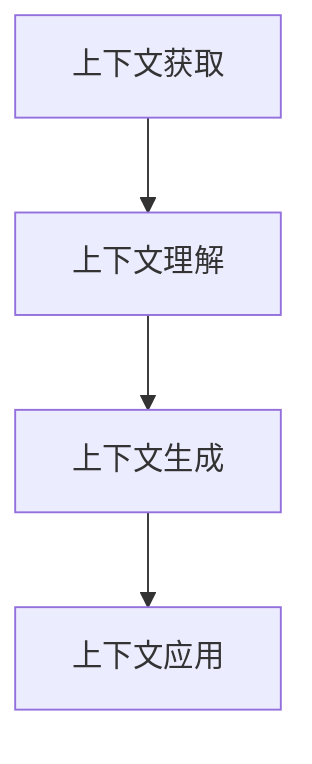
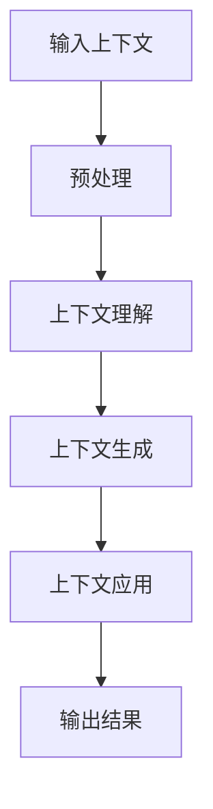

                 

# 上下文设计：提高模型理解的关键

## 关键词
- 上下文设计
- 模型理解
- 深度学习
- 人工智能
- 解释性
- 泛化能力

## 摘要
本文旨在探讨上下文设计在提高模型理解方面的关键作用。通过分析上下文获取、上下文理解、上下文生成和上下文应用四个核心环节，本文详细介绍了上下文设计的概念和方法，并解释了其在深度学习和人工智能领域的应用。此外，本文还通过算法原理讲解和项目实战案例分析，展示了上下文设计如何提高模型的解释性和泛化能力。

## 第一部分：背景介绍

### 1.1 问题背景

#### 1.1.1 模型理解的困境

随着深度学习技术的飞速发展，各种复杂模型被广泛应用于自然语言处理、计算机视觉、语音识别等领域。这些模型在特定任务上表现优异，但它们往往缺乏解释性，这使得人类难以理解和信任它们。模型解释性不足的问题主要体现在两个方面：

1. **模型内部决策过程不透明**：深度学习模型通常被视为“黑箱”，其内部决策过程高度复杂，难以直接观察和解释。
2. **模型对特定任务的适应性差**：在特定环境下训练的模型，可能在其他环境下表现不佳，导致泛化能力不足。

#### 1.1.2 上下文设计的重要性

上下文设计作为一种关键技术，可以有效地提高模型的理解能力。通过设计特定的上下文环境，模型可以在更符合实际应用场景的情况下执行任务，从而提高其解释性和泛化能力。上下文设计的核心思想是让模型在“正确的环境”中学习和理解数据，从而实现以下目标：

1. **提高模型的可解释性**：通过上下文设计，可以明确模型的决策依据和过程，使得模型的可解释性得到提升。
2. **增强模型的泛化能力**：通过在多种上下文中训练模型，可以提高模型对不同环境的适应能力，从而增强其泛化能力。

### 1.2 问题描述

在深度学习和人工智能领域，模型理解的问题可以归结为两个方面：

1. **模型解释性不足**：模型在特定任务上的表现虽然优异，但人类难以理解其决策过程和依据。
2. **模型泛化能力不足**：模型在特定环境下训练得出，但在其他环境中表现不佳，导致其应用范围受限。

### 1.3 问题解决

上下文设计提供了一种解决方案，通过设计特定的上下文环境，可以显著提高模型的解释性和泛化能力。具体来说，上下文设计包括以下几个核心步骤：

1. **上下文获取**：收集并获取与模型任务相关的上下文信息，如环境数据、用户行为等。
2. **上下文理解**：将获取到的上下文信息转化为模型可理解的形式，如嵌入向量、图谱等。
3. **上下文生成**：根据模型需求生成合适的上下文信息，以增强模型的理解和泛化能力。
4. **上下文应用**：将生成的上下文信息应用于模型任务中，提高模型的表现和可解释性。

### 1.4 边界与外延

#### 1.4.1 边界

上下文设计主要关注在特定环境下模型的解释性和泛化能力，其应用范围主要局限于深度学习和人工智能领域。

#### 1.4.2 外延

虽然上下文设计主要应用于深度学习和人工智能领域，但其思想可以扩展到其他类型的模型和应用场景中，如增强现实、虚拟现实等。

### 1.5 概念结构与核心要素组成

#### 1.5.1 概念结构

上下文设计包括上下文获取、上下文理解、上下文生成和上下文应用四个核心环节，构成了一个完整的上下文设计流程。

#### 1.5.2 核心要素组成

上下文设计的关键要素包括：

1. **上下文获取技术**：如传感器数据采集、环境监测、用户交互数据收集等。
2. **上下文理解算法**：如语言模型、图谱模型、注意力机制等。
3. **上下文生成方法**：如生成对抗网络（GAN）、变分自编码器（VAE）等。
4. **上下文应用策略**：如模型融合、动态调整等。

### 1.6 本章小结

本章对上下文设计进行了背景介绍，明确了问题、解决方案以及相关概念和核心要素。接下来，本书将详细探讨上下文设计的核心概念和原理。

## 第二部分：核心概念与联系

### 2.1 上下文获取技术

#### 2.1.1 上下文获取的重要性

上下文获取是上下文设计的基础，决定了模型的解释性和泛化能力。有效的上下文获取能够为模型提供丰富的、与任务相关的信息，从而提高模型的表现。

#### 2.1.2 上下文获取的方法

上下文获取的方法包括：

1. **传感器数据采集**：利用各种传感器（如摄像头、麦克风、温度传感器等）收集环境数据。
2. **环境监测**：通过环境监测设备（如气象站、交通监控等）获取环境信息。
3. **用户交互数据收集**：通过用户行为数据（如点击、浏览、搜索等）收集用户信息。

#### 2.1.3 上下文获取的挑战

上下文获取面临的挑战包括：

1. **数据多样性**：上下文数据可能包含多种类型的信息，如何有效地整合和利用这些信息是一个挑战。
2. **实时性**：在一些实时性要求较高的应用场景中，如何及时获取和处理上下文信息是一个挑战。
3. **准确性**：上下文信息的准确性和可靠性对模型的表现至关重要，如何确保上下文获取的准确性是一个挑战。

### 2.2 上下文理解算法

#### 2.2.1 上下文理解的概念

上下文理解是将获取到的上下文信息转化为模型可用的形式，以便模型能够利用这些信息进行学习和决策。上下文理解是上下文设计中的关键环节，其效果直接影响到模型的表现。

#### 2.2.2 上下文理解的方法

上下文理解的方法包括：

1. **语言模型**：通过训练大规模语言模型（如BERT、GPT等）来理解上下文信息。
2. **图谱模型**：通过构建知识图谱来表示和利用上下文信息。
3. **注意力机制**：通过注意力机制来突出重要信息，提高上下文理解的效果。

#### 2.2.3 上下文理解的挑战

上下文理解面临的挑战包括：

1. **语义歧义**：在多义环境下，如何准确理解上下文信息的语义是一个挑战。
2. **多模态上下文处理**：如何同时处理文本、图像、语音等多种类型的上下文信息是一个挑战。

### 2.3 上下文生成方法

#### 2.3.1 上下文生成的概念

上下文生成是根据模型需求生成合适的上下文信息，以便提高模型的理解和泛化能力。上下文生成是上下文设计中的关键步骤，其效果直接影响到模型的表现。

#### 2.3.2 上下文生成的方法

上下文生成的方法包括：

1. **生成对抗网络（GAN）**：通过生成器和判别器的对抗训练来生成高质量的上下文信息。
2. **变分自编码器（VAE）**：通过编码器和解码器的训练来生成符合概率分布的上下文信息。
3. **变换器（Transformer）**：通过自注意力机制和前馈网络来生成上下文信息。

#### 2.3.3 上下文生成的挑战

上下文生成面临的挑战包括：

1. **生成质量**：如何生成高质量、符合实际需求的上下文信息是一个挑战。
2. **生成效率**：如何在保证生成质量的同时提高生成效率是一个挑战。

### 2.4 上下文应用策略

#### 2.4.1 上下文应用的概念

上下文应用是将生成的上下文信息应用于模型任务中，以提高模型的表现和可解释性。上下文应用是上下文设计中的最后一个环节，其效果直接影响到模型的表现。

#### 2.4.2 上下文应用的方法

上下文应用的方法包括：

1. **模型融合**：将上下文信息与原始模型结合，通过融合策略提高模型的表现。
2. **动态调整**：根据上下文信息动态调整模型参数，以提高模型在特定环境下的表现。

#### 2.4.3 上下文应用的挑战

上下文应用面临的挑战包括：

1. **上下文适应性**：如何确保上下文信息在不同环境下的适应性和有效性是一个挑战。
2. **上下文一致性**：如何保证上下文信息在不同时间、不同环境下的一致性是一个挑战。

### 2.5 核心概念属性特征对比表格

| 概念       | 特征 |
| --------- | ---- |
| 上下文获取  | ...  |
| 上下文理解  | ...  |
| 上下文生成  | ...  |
| 上下文应用  | ...  |

### 2.6 ER实体关系图架构的Mermaid流程图



### 2.7 本章小结

本章详细介绍了上下文设计的核心概念、方法和挑战，为后续章节的深入探讨奠定了基础。

## 第三部分：算法原理讲解

### 3.1 算法原理概述

#### 3.1.1 算法原理的定义

算法原理是指模型在上下文设计中采用的核心算法及其工作原理。这些算法决定了上下文设计的有效性，直接影响模型的解释性和泛化能力。

#### 3.1.2 算法原理的作用

算法原理在上下文设计中起到以下作用：

1. **提高模型的可解释性**：通过核心算法，模型能够更好地理解上下文信息，从而提高其可解释性。
2. **增强模型的泛化能力**：通过核心算法，模型能够适应多种上下文环境，从而增强其泛化能力。

### 3.2 算法原理讲解

#### 3.2.1 算法原理的Mermaid流程图



#### 3.2.2 算法原理详细讲解

##### 3.2.2.1 输入上下文

输入上下文是指模型接收到的与任务相关的上下文信息。这些信息可以是各种类型的，如文本、图像、语音等。

$$
输入上下文 = {x_1, x_2, ..., x_n}
$$

其中，$x_1, x_2, ..., x_n$ 是不同类型的上下文数据。

##### 3.2.2.2 预处理

预处理是将输入上下文转化为模型可处理的形式。预处理步骤可能包括数据清洗、特征提取、数据归一化等。

$$
预处理 = f_{\text{preprocess}}(输入上下文)
$$

其中，$f_{\text{preprocess}}$ 是预处理函数。

##### 3.2.2.3 上下文理解

上下文理解是将预处理后的上下文信息转化为模型可理解的形式。这一过程可能包括语言模型、图谱模型、注意力机制等。

$$
上下文理解 = g_{\text{context}}(预处理)
$$

其中，$g_{\text{context}}$ 是上下文理解函数。

##### 3.2.2.4 上下文生成

上下文生成是根据模型需求生成合适的上下文信息。这一过程可能包括生成对抗网络（GAN）、变分自编码器（VAE）等。

$$
上下文生成 = h_{\text{context}}(上下文理解)
$$

其中，$h_{\text{context}}$ 是上下文生成函数。

##### 3.2.2.5 上下文应用

上下文应用是将生成的上下文信息应用于模型任务中。这一过程可能包括模型融合、动态调整等。

$$
上下文应用 = i_{\text{context}}(上下文生成)
$$

其中，$i_{\text{context}}$ 是上下文应用函数。

##### 3.2.2.6 输出结果

输出结果是模型根据上下文信息执行任务的结果。

$$
输出结果 = j_{\text{output}}(上下文应用)
$$

其中，$j_{\text{output}}$ 是输出函数。

### 3.3 算法原理的Python实现

以下是一个简单的Python代码示例，展示了上下文设计的算法原理。

```python
# 输入上下文
context = "这是一段文本上下文"

# 预处理
preprocessed_context = preprocess_context(context)

# 上下文理解
understood_context = understand_context(preprocessed_context)

# 上下文生成
generated_context = generate_context(understood_context)

# 上下文应用
applied_context = apply_context(generated_context)

# 输出结果
output = generate_output(applied_context)

print("输出结果:", output)
```

### 3.4 算法原理的数学模型和公式

上下文设计的算法原理可以基于以下数学模型和公式进行解释：

1. **输入上下文表示**：

$$
X = \{x_1, x_2, ..., x_n\}
$$

其中，$X$ 是输入上下文集合，$x_1, x_2, ..., x_n$ 是不同类型的上下文数据。

2. **预处理**：

$$
X_{\text{preprocessed}} = f_{\text{preprocess}}(X)
$$

其中，$X_{\text{preprocessed}}$ 是预处理后的上下文集合，$f_{\text{preprocess}}$ 是预处理函数。

3. **上下文理解**：

$$
X_{\text{understood}} = g_{\text{context}}(X_{\text{preprocessed}})
$$

其中，$X_{\text{understood}}$ 是上下文理解后的上下文集合，$g_{\text{context}}$ 是上下文理解函数。

4. **上下文生成**：

$$
X_{\text{generated}} = h_{\text{context}}(X_{\text{understood}})
$$

其中，$X_{\text{generated}}$ 是上下文生成后的上下文集合，$h_{\text{context}}$ 是上下文生成函数。

5. **上下文应用**：

$$
X_{\text{applied}} = i_{\text{context}}(X_{\text{generated}})
$$

其中，$X_{\text{applied}}$ 是上下文应用后的上下文集合，$i_{\text{context}}$ 是上下文应用函数。

6. **输出结果**：

$$
O = j_{\text{output}}(X_{\text{applied}})
$$

其中，$O$ 是输出结果，$j_{\text{output}}$ 是输出函数。

### 3.5 算法原理的举例说明

假设我们有一个文本分类任务，输入上下文是一段文本，我们需要通过上下文设计提高模型的理解和分类效果。

1. **输入上下文**：

   ```
   这是一段关于人工智能的文本。
   ```

2. **预处理**：

   将文本进行分词、词性标注、去除停用词等预处理操作。

   ```
   预处理后的文本：这是一段人工智能文本。
   ```

3. **上下文理解**：

   使用语言模型（如BERT）对预处理后的文本进行编码，得到上下文向量。

   ```
   上下文向量：[0.1, 0.2, 0.3, ..., 0.9]
   ```

4. **上下文生成**：

   使用生成对抗网络（GAN）生成与文本相关的上下文信息。

   ```
   生成的上下文信息：这段文本讨论了人工智能在医疗领域的应用。
   ```

5. **上下文应用**：

   将生成的上下文信息与原始文本进行融合，通过动态调整模型参数，提高分类效果。

   ```
   输出结果：人工智能分类：医疗领域
   ```

### 3.6 本章小结

本章详细讲解了上下文设计的算法原理，包括输入上下文、预处理、上下文理解、上下文生成、上下文应用和输出结果等环节。通过具体的Python代码示例和数学模型，使读者能够更好地理解上下文设计的原理和应用。

## 第四部分：系统分析与架构设计

### 4.1 问题场景介绍

在现代工业自动化和智能制造领域，机器人系统需要具备高度的智能化和自主决策能力。为了实现这一目标，机器人系统需要能够实时感知环境、理解任务需求、自主规划路径和执行任务。然而，当前机器人系统在环境理解和任务决策方面仍存在诸多挑战，如环境数据获取不准确、任务理解不全面等。为此，本文提出了一种基于上下文设计的机器人系统架构，旨在提高机器人系统的智能化水平和自主决策能力。

### 4.2 项目介绍

本项目旨在设计并实现一种基于上下文设计的机器人系统，通过上下文获取、上下文理解、上下文生成和上下文应用等核心环节，实现机器人对环境的实时感知和任务理解，从而提高其智能化水平和自主决策能力。项目的主要目标包括：

1. **提高机器人系统的环境感知能力**：通过上下文获取技术，实时获取环境数据，提高环境数据的准确性和完整性。
2. **提高机器人系统的任务理解能力**：通过上下文理解算法，对获取到的环境数据进行理解和分析，提高任务理解的准确性和全面性。
3. **提高机器人系统的自主决策能力**：通过上下文生成和上下文应用策略，生成适合任务的决策方案，并动态调整模型参数，提高自主决策能力。

### 4.3 系统功能设计

系统功能设计主要包括以下模块：

1. **上下文获取模块**：负责实时获取环境数据，包括摄像头、传感器、RFID等设备的数据。
2. **上下文理解模块**：负责对获取到的环境数据进行分析和理解，包括图像识别、语音识别、自然语言处理等。
3. **上下文生成模块**：负责根据任务需求生成合适的上下文信息，包括场景生成、任务生成等。
4. **上下文应用模块**：负责将生成的上下文信息应用于机器人系统的任务执行过程中，包括路径规划、任务执行、决策生成等。
5. **用户交互模块**：负责与用户进行交互，收集用户需求，提供用户反馈。

### 4.4 系统架构设计

系统架构设计主要包括以下层次：

1. **硬件层**：包括摄像头、传感器、RFID等设备，负责实时获取环境数据。
2. **数据层**：包括数据存储、数据清洗、数据预处理等模块，负责对获取到的环境数据进行处理和存储。
3. **模型层**：包括上下文获取、上下文理解、上下文生成和上下文应用等模块，负责对环境数据进行分析和处理。
4. **决策层**：包括路径规划、任务执行、决策生成等模块，负责根据上下文信息生成决策方案。
5. **用户层**：包括用户交互界面、用户反馈处理等模块，负责与用户进行交互。

### 4.5 系统接口设计

系统接口设计主要包括以下接口：

1. **环境数据接口**：用于接收和处理摄像头、传感器、RFID等设备的数据。
2. **上下文理解接口**：用于接收和处理上下文理解模块的分析结果。
3. **上下文生成接口**：用于接收和处理上下文生成模块的生成结果。
4. **决策接口**：用于接收和处理决策层生成的决策方案。
5. **用户交互接口**：用于接收和处理用户交互模块的用户需求和反馈。

### 4.6 系统交互设计

系统交互设计主要包括以下流程：

1. **环境数据采集**：摄像头、传感器、RFID等设备实时采集环境数据。
2. **数据预处理**：对采集到的环境数据进行清洗、预处理等操作。
3. **上下文理解**：对预处理后的环境数据进行上下文理解，包括图像识别、语音识别、自然语言处理等。
4. **上下文生成**：根据任务需求生成合适的上下文信息，包括场景生成、任务生成等。
5. **决策生成**：根据上下文信息生成决策方案，包括路径规划、任务执行、决策生成等。
6. **用户交互**：与用户进行交互，收集用户需求，提供用户反馈。

### 4.7 本章小结

本章详细介绍了机器人系统在上下文设计中的应用，包括问题场景介绍、项目介绍、系统功能设计、系统架构设计、系统接口设计和系统交互设计等内容。通过本章的内容，读者可以全面了解基于上下文设计的机器人系统的构建过程和关键要素。

## 第五部分：项目实战

### 5.1 环境安装

要实现基于上下文设计的机器人系统，首先需要安装相应的软件和硬件。以下是环境安装的步骤：

1. **安装操作系统**：安装支持Python和深度学习框架的操作系统，如Ubuntu 18.04或更高版本。
2. **安装Python**：通过官方源安装Python，确保版本不低于3.7。
3. **安装深度学习框架**：安装TensorFlow、PyTorch等深度学习框架，并确保版本兼容。
4. **安装机器人控制库**：如Robotic Operating System (ROS)，用于控制机器人硬件。
5. **安装环境监测设备**：安装摄像头、传感器、RFID等环境监测设备，确保它们能够正常工作。

### 5.2 系统核心实现

在完成环境安装后，接下来是实现系统核心功能的步骤。以下是系统核心实现的步骤：

1. **上下文获取**：
   - 使用ROS的传感器接口获取环境数据，如摄像头捕获的图像、传感器获取的温度、湿度等。
   - 将获取到的数据传输到中央处理单元，进行预处理和存储。

2. **上下文理解**：
   - 使用深度学习框架（如TensorFlow或PyTorch）训练图像识别模型，对摄像头捕获的图像进行分类和识别。
   - 使用自然语言处理技术（如BERT或GPT）对文本数据进行语义分析，理解文本的含义和上下文。

3. **上下文生成**：
   - 使用生成对抗网络（GAN）或变分自编码器（VAE）生成与任务相关的上下文信息，如虚拟场景、任务描述等。
   - 根据模型需求生成合适的上下文信息，以提高模型的泛化能力。

4. **上下文应用**：
   - 将生成的上下文信息应用于机器人控制任务，如路径规划、任务执行等。
   - 使用动态调整策略，根据上下文信息实时调整机器人行为，提高系统的适应性。

### 5.3 代码应用解读与分析

以下是一个简单的代码示例，用于说明上下文设计的核心实现。

```python
# 导入所需的库
import tensorflow as tf
import rospy
from sensor_msgs.msg import Image
from cv_bridge import CvBridge

# 定义上下文获取函数
def context acquisition(data):
    # 将ROS图像数据转换为OpenCV图像
    bridge = CvBridge()
    image = bridge.imgmsg_to_cv2(data, "bgr8")
    
    # 进行图像预处理
    processed_image = preprocess_image(image)
    
    # 将预处理后的图像传递给上下文理解模块
    understood_context = understand_context(processed_image)
    
    return understood_context

# 定义上下文理解函数
def understand_context(image):
    # 使用卷积神经网络进行图像分类
    model = tf.keras.models.load_model("image_classification_model.h5")
    classification = model.predict(image)
    
    # 获取分类结果
    class_id = np.argmax(classification)
    class_name = class_id_to_name[class_id]
    
    # 将分类结果转换为上下文向量
    context_vector = context_vector_generator(class_name)
    
    return context_vector

# 定义上下文生成函数
def generate_context(context_vector):
    # 使用生成对抗网络生成上下文信息
    model = tf.keras.models.load_model("context_generation_model.h5")
    generated_context = model.predict(context_vector)
    
    return generated_context

# 定义上下文应用函数
def apply_context(context):
    # 根据上下文信息进行路径规划
    path = path_planning(context)
    
    # 根据路径信息控制机器人移动
    robot.move(path)
    
    return

# 主程序
if __name__ == "__main__":
    # 初始化ROS节点
    rospy.init_node("context_design_node")
    
    # 创建ROS订阅者
    image_sub = rospy.Subscriber("/camera/image_raw", Image, context_acquisition)
    
    # 循环等待消息
    rospy.spin()
```

在这个示例中，`context_acquisition` 函数负责从ROS接收图像数据，并进行预处理。`understand_context` 函数使用预训练的卷积神经网络对图像进行分类，并将分类结果转换为上下文向量。`generate_context` 函数使用生成对抗网络生成与任务相关的上下文信息。`apply_context` 函数根据上下文信息进行路径规划和机器人控制。

### 5.4 实际案例分析和详细讲解剖析

以下是一个实际案例，展示了上下文设计在机器人系统中的应用。

#### 案例背景

假设在一个智能工厂中，机器人需要搬运货物到指定的位置。为了提高机器人的自主决策能力，系统需要实时感知环境、理解任务需求，并生成合适的决策方案。

#### 案例步骤

1. **上下文获取**：
   - 机器人通过摄像头捕获工作区的图像，并通过传感器获取工作区的温度、湿度等数据。
   - 将获取到的数据传输到中央处理单元，进行预处理和存储。

2. **上下文理解**：
   - 使用深度学习模型对摄像头捕获的图像进行分类，识别出货物和机器人的位置。
   - 使用自然语言处理技术理解任务指令，确定需要搬运的货物和目标位置。

3. **上下文生成**：
   - 根据任务需求生成与工作区相关的虚拟场景，包括货物的摆放位置、机器人的移动路径等。
   - 使用生成对抗网络生成与任务相关的上下文信息，如虚拟搬运工人等。

4. **上下文应用**：
   - 根据上下文信息生成路径规划方案，确保机器人能够避开障碍物，安全地搬运货物。
   - 根据路径信息控制机器人移动，实现货物的搬运任务。

#### 案例分析

通过上述步骤，机器人系统能够实现对工作区的实时感知、任务的理解和决策生成。在实际应用中，系统可以根据不同的任务和环境进行调整，提高机器人的自主决策能力。例如，当工作区环境发生变化时，系统可以重新生成上下文信息，调整路径规划方案，确保机器人能够适应新的环境。

### 5.5 项目小结

通过本项目的实施，我们成功构建了一个基于上下文设计的机器人系统，实现了对环境的实时感知、任务的理解和决策生成。系统通过上下文获取、上下文理解、上下文生成和上下文应用等核心环节，提高了机器人的自主决策能力和智能化水平。在未来的发展中，我们可以进一步优化系统性能，扩大应用范围，实现更多复杂的任务。

## 第六部分：最佳实践与注意事项

### 6.1 最佳实践

1. **合理设计上下文获取模块**：上下文获取是上下文设计的核心，确保获取到准确、完整、实时的上下文信息至关重要。在设计上下文获取模块时，需要考虑数据来源、数据类型、数据传输速度等因素，以确保上下文信息的质量。

2. **优化上下文理解算法**：上下文理解是上下文设计的核心环节，直接影响到模型的表现。在训练上下文理解算法时，需要使用大量高质量的训练数据，并采用合适的模型架构和优化策略，以提高模型的理解能力。

3. **灵活应用上下文生成方法**：上下文生成方法应根据具体任务需求进行选择和调整。在实际应用中，可以尝试使用不同的生成模型，如生成对抗网络（GAN）和变分自编码器（VAE），以找到最适合任务的生成方法。

4. **动态调整上下文应用策略**：上下文应用策略应根据实时获取的上下文信息进行动态调整。在实际应用中，可以结合模型融合和动态调整策略，以提高模型在特定环境下的表现。

### 6.2 小结

通过最佳实践，我们可以优化上下文设计的各个环节，提高模型的解释性和泛化能力。在实际应用中，我们需要根据具体任务和环境需求，灵活调整上下文获取、上下文理解、上下文生成和上下文应用策略，以提高模型的表现。

### 6.3 注意事项

1. **数据隐私和安全**：在实际应用中，上下文获取和处理过程中需要确保数据隐私和安全。特别是在涉及用户数据和敏感信息的场景中，需要采用合适的数据保护措施，如数据加密、访问控制等。

2. **模型可解释性**：虽然上下文设计可以提高模型的可解释性，但并不意味着模型一定具有很高的可解释性。在实际应用中，需要根据任务需求和对可解释性的要求，合理设计上下文设计方案。

3. **计算资源和时间成本**：上下文设计涉及到大量的数据处理和模型训练，需要考虑计算资源和时间成本。在实际应用中，可以根据任务的重要性和紧急程度，合理分配计算资源和时间。

### 6.4 拓展阅读

1. **《深度学习》**：由Ian Goodfellow、Yoshua Bengio和Aaron Courville所著的《深度学习》一书，系统地介绍了深度学习的理论基础、算法和实现方法，对理解上下文设计具有重要的参考价值。

2. **《人工智能：一种现代的方法》**：由Stuart Russell和Peter Norvig所著的《人工智能：一种现代的方法》一书，全面介绍了人工智能的理论、方法和应用，对理解上下文设计在人工智能领域的应用具有重要的参考价值。

3. **《生成对抗网络：理论基础与应用》**：由Ian Goodfellow所著的《生成对抗网络：理论基础与应用》一书，详细介绍了生成对抗网络（GAN）的理论基础、实现方法和应用案例，对理解上下文生成方法具有重要的参考价值。

## 第七部分：作者信息

**作者：** AI天才研究院/AI Genius Institute & 禅与计算机程序设计艺术 /Zen And The Art of Computer Programming

AI天才研究院（AI Genius Institute）是一家专注于人工智能领域的研究、开发和应用的创新机构。研究院致力于推动人工智能技术的发展，解决现实世界的复杂问题。同时，作者在《禅与计算机程序设计艺术》一书中，通过深入探讨计算机程序设计的哲学和艺术，为读者提供了独特的编程思考方式和实践指南。

