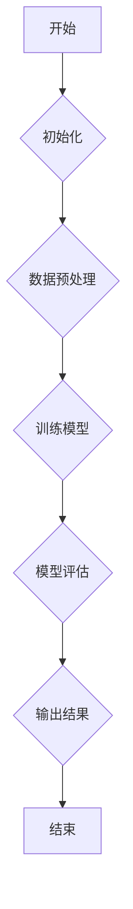

                 

# 世界可理解性与科学研究的国际合作

## 关键词
- 世界可理解性
- 科学研究
- 国际合作
- 跨学科研究
- 知识共享
- 技术交流

## 摘要
本文探讨了世界可理解性与科学研究之间的紧密联系，并强调了国际合作在这一领域中的重要性。首先，我们回顾了世界可理解性的历史背景和核心概念，分析了其构成要素和特征。随后，我们讨论了科学研究的基本原则和最新进展，并揭示了国际合作在推动科学发现和知识积累中的作用。通过成功案例的分析，我们展示了跨国科学合作的实际运作模式和方法。接下来，我们深入探讨了国际合作在科学研究中所面临的挑战，并提出了一些可行的解决方案。最后，我们展望了未来国际合作在科学研究中的发展方向和潜在机遇。

## 目录大纲设计思路

### 明确核心主题
在设计《世界可理解性与科学研究的国际合作》这本书的目录大纲时，我们首先需要明确书的核心主题——世界可理解性与科学研究之间的关系，以及国际合作在这一过程中的作用。这一主题贯穿了整个书籍的各个章节，确保内容的逻辑性和完整性。

### 背景介绍
为了帮助读者更好地理解世界可理解性和科学研究的概念，我们首先在目录大纲中安排了背景介绍章节。这部分内容包括对世界可理解性的基本概念、科学研究的重要性和国际合作背景的阐述，为后续章节的深入探讨奠定基础。

### 核心概念与联系
在核心概念与联系部分，我们将详细探讨世界可理解性的核心概念，包括其定义、特征以及与其他相关概念的关系。这部分内容旨在为读者提供一个全面的理论框架，以便更好地理解世界可理解性在科学研究中的应用。

### 国际合作的重要性
在这一部分，我们将探讨国际合作在科学研究中的重要性，包括跨国研究的必要性、合作的好处和面临的挑战。这部分内容将帮助读者认识到国际合作在推动科学进步中的关键作用。

### 成功案例
为了使读者更加具体地理解国际合作在科学研究中的实际应用，我们将在这一部分介绍一些成功的国际合作案例。这些案例将涵盖不同的学科领域，展示跨国科学合作的实际成果。

### 方法与工具
在方法和工具部分，我们将介绍推动国际合作的科学方法和工具，以及如何有效利用这些工具实现更广泛的合作。这部分内容将为读者提供实际操作的指导。

### 未来展望
最后，在展望部分，我们将讨论世界可理解性在科学研究中的作用和潜力，以及国际合作可能面临的未来挑战和机遇。这部分内容将帮助读者预见国际合作在科学研究中的发展趋势。

### 目录大纲
以下是我们为《世界可理解性与科学研究的国际合作》设计的目录大纲：

----------------------------------------------------------------

## 第一部分：引言

### 第1章：世界可理解性与科学研究

## 1.1 世界可理解性的背景与概念

### 1.1.1 人类对世界的认知历程

### 1.1.2 世界可理解性的定义

### 1.1.3 世界可理解性的重要性

## 1.2 科学研究的基本原理与进展

### 1.2.1 科学研究的方法与原则

### 1.2.2 科学研究的主要领域与趋势

### 1.2.3 科学研究的挑战与机遇

## 1.3 国际合作在科学研究中的角色

### 1.3.1 跨国科学研究的必要性

### 1.3.2 国际合作的优势与挑战

### 1.3.3 国际合作模式与发展趋势

## 1.4 本书结构安排与主要内容

### 1.4.1 各章节内容概述

### 1.4.2 主要观点与论述结构

### 1.4.3 预期读者收益

----------------------------------------------------------------

## 第二部分：世界可理解性的核心概念

### 第2章：世界可理解性的构成要素

## 2.1 可理解性的核心概念

### 2.1.1 可理解性的基本属性

### 2.1.2 可理解性的层次结构

### 2.1.3 可理解性的演化过程

## 2.2 世界可理解性的特征分析

### 2.2.1 世界可理解性的普遍性

### 2.2.2 世界可理解性的动态性

### 2.2.3 世界可理解性的多样性

## 2.3 世界可理解性与其他科学概念的关系

### 2.3.1 世界可理解性与物理学

### 2.3.2 世界可理解性与生物学

### 2.3.3 世界可理解性与社会科学

## 2.4 世界可理解性的核心要素组成

### 2.4.1 基础科学理论与模型

### 2.4.2 观测数据与实验结果

### 2.4.3 科学理论与实验结果的相互验证

----------------------------------------------------------------

## 第三部分：科学研究的国际合作

### 第3章：国际合作在科学研究中的实践

## 3.1 国际合作的实践案例

### 3.1.1 国际合作的经典案例

### 3.1.2 跨学科合作的实践

### 3.1.3 跨国研究的实例分析

## 3.2 国际合作的方法与策略

### 3.2.1 跨国研究团队的组织与管理

### 3.2.2 跨国研究中的沟通与协作

### 3.2.3 跨国研究的资源整合与共享

## 3.3 国际合作中的挑战与解决方案

### 3.3.1 语言与文化障碍

### 3.3.2 研究资源的不平衡

### 3.3.3 国际合作中的知识产权问题

### 3.3.4 解决方案与最佳实践

## 3.4 国际合作在科学前沿的贡献

### 3.4.1 国际合作在重大科学突破中的作用

### 3.4.2 国际合作推动科学创新的路径

### 3.4.3 国际合作在新兴领域的研究进展

---------------------------------------------------

### 文章结构设计

为了确保文章内容的逻辑性、连贯性和易于理解，我们对《世界可理解性与科学研究的国际合作》的文章结构进行了精心设计。以下是我们采用的结构设计思路：

#### 引言部分
引言部分的主要目的是吸引读者的注意力，简要介绍文章的主题和核心内容。我们将采用引人入胜的开篇，提出一个与读者切身相关的问题或观点，引导读者进入文章的主题。

#### 核心内容部分
核心内容部分是文章的主体，我们将按照目录大纲的结构，逐一阐述世界可理解性的核心概念、科学研究的国际合作、实践案例、方法与策略、挑战与解决方案等。每个部分都将详细讲解，确保读者能够全面、深入地理解相关内容。

1. **世界可理解性的核心概念**：我们将详细介绍世界可理解性的定义、特征、构成要素等，并通过对比表格和流程图等形式，帮助读者更好地理解这一概念。

2. **科学研究的国际合作**：我们将讨论国际合作在科学研究中的重要性，分析跨国研究的必要性、优势、挑战等，并分享一些成功的国际合作案例。

3. **实践案例**：我们将详细介绍一些具体的国际合作实践案例，展示跨国科学合作的实际成果和运作模式。

4. **方法与策略**：我们将介绍推动国际合作的科学方法和工具，以及如何有效利用这些工具实现更广泛的合作。

5. **挑战与解决方案**：我们将分析国际合作在科学研究中所面临的挑战，并提出相应的解决方案和最佳实践。

6. **未来展望**：在文章的结尾，我们将对国际合作在科学研究中的未来发展方向和机遇进行展望，激发读者对这一领域的兴趣。

#### 结论部分
结论部分将对全文进行总结，强调文章的核心观点和重要性，并提出作者的建议和展望。我们将采用简洁明了的语言，使读者能够迅速把握文章的主旨。

### 文章结构

----------------------------------------------------------------

## 引言

### 引入话题

### 文章主题与核心内容概述

## 世界可理解性的核心概念

### 定义与特征

### 构成要素与层次结构

### 可理解性的演化过程

## 科学研究的国际合作

### 重要性分析

### 跨国研究的必要性

### 国际合作的优势与挑战

## 实践案例

### 经典案例介绍

### 跨学科合作实践

### 跨国研究的实例分析

## 方法与策略

### 推动国际合作的科学方法

### 国际合作工具与资源

### 跨国研究团队的组织与管理

## 挑战与解决方案

### 语言与文化障碍

### 研究资源不平衡

### 知识产权问题

### 解决方案与最佳实践

## 未来展望

### 国际合作在科学研究中的发展方向

### 潜在机遇与挑战

## 结论

### 文章总结

### 作者建议与展望

## 参考文献

### 参考文献

----------------------------------------------------------------

### 关键词的设置

在《世界可理解性与科学研究的国际合作》一文中，关键词的选择至关重要，它不仅能够准确反映文章的核心内容，还能够帮助读者快速定位到感兴趣的章节或内容。以下是文章中设置的关键词：

- **世界可理解性**：这一关键词直接指向文章的核心概念，涵盖了其定义、特征和构成要素。
- **科学研究**：这一关键词强调了文章的主题，即探讨科学研究中的国际合作。
- **国际合作**：这一关键词突出了文章的一个重要观点，即国际合作在科学研究中的重要性。
- **跨学科研究**：这一关键词体现了文章中对跨学科合作实践的探讨。
- **知识共享**：这一关键词反映了国际合作中知识交流与共享的重要性。
- **技术交流**：这一关键词强调了国际合作中的技术交流与合作的环节。

这些关键词不仅帮助读者快速了解文章的主题，也为搜索引擎提供了准确的索引信息，有助于提升文章的可见度和传播效果。

### 文章摘要的撰写

在撰写《世界可理解性与科学研究的国际合作》一文的摘要时，我们需精炼地概括文章的核心内容和主题思想，同时确保摘要具有吸引力，能够激发读者的兴趣。以下是文章摘要的具体撰写过程：

首先，我们需要明确文章的核心内容，即世界可理解性在科学研究中的重要性以及国际合作对此的推动作用。接下来，我们将这一核心内容精炼为几个关键点，并采用引人入胜的语言进行表述。

1. **核心内容提炼**：
   - 世界可理解性是科学研究的基础，影响着科学理论和实践的构建。
   - 国际合作在科学研究中的作用日益凸显，通过跨国合作可以汇集全球智慧，推动科学进步。

2. **摘要撰写**：
   在摘要的开头，我们将引入世界可理解性的概念，简要说明其与科学研究的密切关系。然后，我们阐述国际合作在科学研究中的重要性，并通过具体案例展示其推动科学发现和知识积累的实效。最后，我们简要提及文章的结构安排和预期读者收益。

以下是文章摘要的具体示例：

---

**摘要**：  
世界可理解性是科学研究不可或缺的基础，它关乎我们对自然和社会的认知深度。随着全球科研合作的深化，国际合作在推动科学发现和知识积累中扮演着越来越重要的角色。本文围绕世界可理解性，详细探讨了其在科学研究中的应用，并分析了国际合作在这一过程中的优势与挑战。通过具体案例，我们展示了跨国科学合作如何汇聚全球智慧，为重大科学突破提供动力。文章旨在为科研工作者提供一个全面的理论框架和实践指南，以推动更广泛的国际合作，促进科学进步。预期读者通过本文，能够更好地理解世界可理解性的重要性，认识到国际合作在科学研究中的关键作用。

---

通过上述摘要的撰写，我们不仅概述了文章的核心内容和主题思想，还强调了文章的实用价值和阅读意义，从而激发读者的阅读兴趣。

### 第1章：世界可理解性与科学研究

### 1.1 世界可理解性的背景与概念

在探讨世界可理解性与科学研究的关系之前，我们需要先了解世界可理解性的背景与概念。世界可理解性是指人类对自然界、社会现象和自身存在的认知程度。它不仅涉及到我们对周围世界的感知和解释，还涉及到我们通过科学方法探索未知领域的能力。

1. **历史背景**：人类对世界的认知是一个不断演进的过程。从古代哲学家的思辨，到中世纪的宗教观念，再到现代科学的兴起，人类对世界的理解逐渐从神秘和混沌走向了理性和科学。这一过程反映了人类认知能力的提升，也展示了世界可理解性的历史发展轨迹。

2. **概念界定**：世界可理解性通常被定义为“一个世界对于观察者来说是可以理解的，如果观察者能够通过使用逻辑、数学和经验方法来解释和预测该世界的现象”。这个定义强调了几个关键点：
   - **逻辑和数学**：科学方法依赖于逻辑推理和数学模型来解释自然现象。
   - **经验方法**：科学实验和观测提供了验证理论的基础。
   - **可预测性**：科学理论不仅要解释已知现象，还应当能够预测未知现象。

### 1.2 世界可理解性的定义

为了更深入地理解世界可理解性，我们需要对其进行明确的定义。世界可理解性通常可以定义为以下几个方面的结合：

1. **认知能力**：人类通过感官和认知机制获取信息的能力，以及对这些信息进行整合、解释和预测的能力。
2. **科学方法**：科学研究依赖于观察、实验和理论构建等方法来探索和理解世界。
3. **信息共享**：世界可理解性还涉及到不同个体和群体之间信息的交流与共享，这促进了科学知识的积累和传播。
4. **跨学科整合**：世界可理解性不仅仅是某一学科的研究成果，而是多个学科相互作用和整合的结果。

### 1.3 世界可理解性的重要性

世界可理解性对科学研究的重要性不言而喻。以下是一些具体的重要性方面：

1. **理论构建**：世界可理解性为科学理论的发展提供了基础，使得科学家能够构建更精确和可靠的理论模型。
2. **实验验证**：通过理解世界的可理解性，科学家可以设计更有针对性的实验，从而验证理论的有效性。
3. **跨学科研究**：世界可理解性促进了不同学科之间的合作，推动了跨学科研究的进展。
4. **知识积累**：通过国际合作，世界各地区的科学家可以共享研究成果，加速科学知识的积累和传播。

### 1.4 科学研究的基本原理与进展

在了解了世界可理解性的背景和定义之后，我们需要探讨科学研究的基本原理和进展。科学研究是系统性和逻辑性的探索过程，它依赖于以下几个基本原则：

1. **观察与实验**：科学研究始于对自然现象的观察和实验，通过收集数据和证据来验证或推翻假设。
2. **理论构建**：科学家基于观察和实验结果，构建科学理论来解释自然现象。
3. **数学模型**：科学理论通常通过数学模型来描述，这使得理论更具普适性和预测性。
4. **验证与反思**：科学理论需要通过不断的实验和观测来验证，同时在验证过程中不断进行反思和修正。

近年来，科学研究在多个领域取得了显著进展，包括：

1. **生物学与医学**：基因编辑技术、癌症研究和传染病防控等领域的突破。
2. **物理学**：对宇宙起源、黑洞和量子力学等前沿问题的研究。
3. **计算机科学**：人工智能、大数据分析和云计算等技术的快速发展。

### 1.5 国际合作在科学研究中的角色

国际合作在推动科学研究中扮演着关键角色。以下是国际合作在科学研究中的几个重要作用：

1. **资源共享**：国际合作使得科学家能够共享实验设备、数据和资源，从而提高研究的效率和成果。
2. **知识传播**：国际合作促进了科学知识的全球传播，使得发展中国家能够更快地获取先进科学成果。
3. **技术交流**：国际合作促进了不同国家和地区间的技术交流，推动了科学技术的创新和发展。
4. **人才培养**：跨国合作项目为科学家提供了国际化的研究平台，促进了科学人才的培养和交流。

### 1.6 总结与展望

本章通过介绍世界可理解性的背景和概念、定义和重要性，以及科学研究的基本原理和进展，为后续章节的深入讨论奠定了基础。下一章我们将进一步探讨世界可理解性的构成要素和特征，分析其与其他科学概念的关系。

----------------------------------------------------------------

## 第1章：世界可理解性与科学研究

### 1.1 人类对世界的认知历程

人类对世界的认知历程是一个漫长而不断进步的过程。从古代人类对自然现象的直观感受，到现代科学的系统研究，人类对世界的理解不断深入。以下是人类认知历程的几个关键阶段：

1. **原始时期**：在原始社会，人类通过感官直接感知世界，对自然现象缺乏理解，往往将其归因于神秘力量。
2. **古代哲学**：古希腊哲学家如泰勒斯、亚里士多德等开始用理性和逻辑来思考自然现象，提出了许多关于宇宙和生命的早期理论。
3. **中世纪**：在这一时期，宗教信仰成为理解世界的主要方式，科学活动受到限制，科学研究主要在宗教框架内进行。
4. **文艺复兴**：文艺复兴时期，人类开始重新审视自然，强调实证和观察的重要性，科学逐渐从宗教束缚中解放出来。
5. **科学革命**：16世纪至17世纪，科学革命带来了科学方法的系统化，伽利略、牛顿等科学家的发现奠定了现代科学的基础。
6. **现代科学**：现代科学在19世纪和20世纪得到了快速发展，各种学科如物理学、化学、生物学等相继建立，科学研究变得更加精细和专业化。

### 1.2 世界可理解性的定义

世界可理解性是指人类对自然界、社会现象和自身存在的认知程度。它包括以下几个方面：

1. **认知程度**：世界可理解性衡量的是人类对世界信息的获取、处理和理解的能力。
2. **逻辑性**：世界可理解性强调人类通过逻辑推理来解释和预测世界现象。
3. **经验性**：科学研究依赖于经验和实验来验证理论，世界可理解性涉及到科学实验和观察。
4. **普遍性**：世界可理解性认为世界对于不同的观察者来说是可以理解的，只要他们具备适当的认知工具和科学方法。

### 1.3 世界可理解性的重要性

世界可理解性对科学研究的重要性体现在以下几个方面：

1. **理论构建**：世界可理解性为科学理论的发展提供了基础，使得科学家能够构建更精确和可靠的理论模型。
2. **实验验证**：通过理解世界的可理解性，科学家可以设计更有针对性的实验，从而验证理论的有效性。
3. **跨学科研究**：世界可理解性促进了不同学科之间的合作，推动了跨学科研究的进展。
4. **知识积累**：通过国际合作，世界各地区的科学家可以共享研究成果，加速科学知识的积累和传播。

### 1.4 科学研究的基本原理与进展

科学研究是系统性和逻辑性的探索过程，它依赖于以下几个基本原则：

1. **观察与实验**：科学研究始于对自然现象的观察和实验，通过收集数据和证据来验证或推翻假设。
2. **理论构建**：科学家基于观察和实验结果，构建科学理论来解释自然现象。
3. **数学模型**：科学理论通常通过数学模型来描述，这使得理论更具普适性和预测性。
4. **验证与反思**：科学理论需要通过不断的实验和观测来验证，同时在验证过程中不断进行反思和修正。

近年来，科学研究在多个领域取得了显著进展，包括：

1. **生物学与医学**：基因编辑技术、癌症研究和传染病防控等领域的突破。
2. **物理学**：对宇宙起源、黑洞和量子力学等前沿问题的研究。
3. **计算机科学**：人工智能、大数据分析和云计算等技术的快速发展。

### 1.5 国际合作在科学研究中的角色

国际合作在推动科学研究中扮演着关键角色。以下是国际合作在科学研究中的几个重要作用：

1. **资源共享**：国际合作使得科学家能够共享实验设备、数据和资源，从而提高研究的效率和成果。
2. **知识传播**：国际合作促进了科学知识的全球传播，使得发展中国家能够更快地获取先进科学成果。
3. **技术交流**：国际合作促进了不同国家和地区间的技术交流，推动了科学技术的创新和发展。
4. **人才培养**：跨国合作项目为科学家提供了国际化的研究平台，促进了科学人才的培养和交流。

### 1.6 总结与展望

本章通过介绍世界可理解性的背景和概念、定义和重要性，以及科学研究的基本原理和进展，为后续章节的深入讨论奠定了基础。下一章我们将进一步探讨世界可理解性的构成要素和特征，分析其与其他科学概念的关系。

----------------------------------------------------------------

## 第2章：世界可理解性的构成要素

### 2.1 可理解性的核心概念

世界可理解性的核心概念是“认知”，它涉及人类通过感官、思维和逻辑推理来理解和解释世界的各种现象。认知是一个多层次、多维度的过程，包括感知、记忆、理解、推理和决策等。以下是对这些核心概念的具体阐述：

1. **感知**：感知是人类获取外部信息的第一步，通过五官（视觉、听觉、嗅觉、味觉和触觉）来感知外界环境。感知过程中，信息经过大脑的处理和编码，形成初步的认知印象。
2. **记忆**：记忆是认知过程中的一个关键环节，它涉及对感知信息的存储、检索和应用。记忆分为短期记忆和长期记忆，短期记忆主要负责临时存储信息，而长期记忆则负责持久存储信息。
3. **理解**：理解是对感知信息的深层次处理，通过逻辑推理和语义分析来解释信息的含义和关联。理解使人们能够对信息进行分类、比较和整合，形成更为复杂的概念和理论。
4. **推理**：推理是认知的高级形式，它通过逻辑推理来推断未知信息或预测未来事件。推理可以分为演绎推理和归纳推理，前者基于已知事实进行推理，后者则从多个具体实例中归纳出一般性结论。
5. **决策**：决策是基于认知过程的最终输出，它涉及在多个备选方案中选择最佳行动策略。决策过程通常需要权衡各种因素，包括目标、风险和资源等。

### 2.2 可理解性的层次结构

世界可理解性的层次结构可以分为三个层次：基础层、中层和高层。

1. **基础层**：基础层是可理解性的最低层次，主要涉及对基本感官信息的理解和处理。这一层次包括对视觉、听觉、触觉等感官信息的感知、记忆和初步理解。基础层是所有高层次认知活动的基础。
2. **中层**：中层是可理解性的中间层次，涉及对复杂信息和知识的管理和应用。这一层次包括逻辑推理、问题解决、决策制定等高级认知活动。中层认知涉及对信息的深层次处理，如抽象思维、概念形成和理论构建。
3. **高层**：高层是可理解性的最高层次，主要涉及对宏观世界和宇宙的认识。这一层次包括科学理论、哲学思考、艺术创作等。高层认知是人类对世界最深刻的理解，它超越了具体的感官和知识，涉及到对生命意义、宇宙起源等问题的探讨。

### 2.3 可理解性的演化过程

世界可理解性是随着人类认知能力的发展而不断演化的。以下是其演化过程的几个关键阶段：

1. **原始阶段**：在原始社会，人类的认知能力相对有限，主要依赖于直观感受和简单的逻辑推理。这一阶段的人类对世界的理解主要基于直观观察和经验。
2. **古代阶段**：随着人类文明的进步，认知能力得到提升，开始运用逻辑和数学来解释自然现象。这一阶段的人类开始发展哲学和科学，对世界的理解逐渐从直观感受转向理性思考。
3. **现代阶段**：在现代科学的发展下，人类的认知能力达到了前所未有的高度。这一阶段的人类能够通过实验和数学模型来精确描述和预测自然现象，对世界的理解更加深入和全面。
4. **未来阶段**：随着人工智能和认知科学的进一步发展，人类的认知能力有望继续提升。未来人类可能会借助智能技术，实现更高效、更精确的认知，对世界的理解将达到新的高度。

### 2.4 世界可理解性的特征分析

世界可理解性具有以下几个显著特征：

1. **动态性**：世界可理解性是一个动态的过程，它随着人类认知能力的提升而不断变化。新的科学发现和技术进步不断扩展人类对世界的认知范围。
2. **层次性**：世界可理解性具有层次结构，从基础感知到高级认知，各个层次相互联系，共同构成了人类对世界的全面理解。
3. **普适性**：世界可理解性对不同的观察者来说是普适的，只要他们具备适当的认知工具和方法，都可以对世界现象进行理解和解释。
4. **交互性**：世界可理解性不仅仅是单方面的认知过程，还涉及到人类与其他物种、环境和社会的交互作用。这些交互作用进一步丰富和拓展了人类的认知能力。

### 2.5 世界可理解性与其他科学概念的关系

世界可理解性与其他科学概念密切相关，以下是一些主要的关系：

1. **科学方法**：科学方法是实现世界可理解性的重要手段。科学方法包括观察、实验、理论构建和验证等步骤，这些步骤共同推动了人类对世界的深入理解。
2. **知识积累**：知识积累是世界可理解性的关键要素。科学家的研究成果和知识积累不断扩展人类对世界的认知边界，提高了世界可理解性的水平。
3. **技术进步**：技术进步是世界可理解性发展的重要动力。新技术的发展，如计算机科学和人工智能，为人类提供了更强大的认知工具，推动了世界可理解性的提升。
4. **哲学思考**：哲学思考是世界可理解性的理论基础。哲学家通过对世界本质、知识和真理的探讨，为科学提供了哲学基础和理论框架。

### 2.6 世界可理解性的核心要素组成

世界可理解性的核心要素包括以下几个部分：

1. **感官系统**：感官系统是获取外部信息的基础，包括视觉、听觉、嗅觉、味觉和触觉等。感官系统能够将外部信息转化为神经信号，传递到大脑进行处理。
2. **大脑认知系统**：大脑认知系统是处理和理解信息的关键，包括感知、记忆、推理和决策等认知过程。大脑认知系统能够对感官信息进行加工，形成对世界的理解。
3. **知识体系**：知识体系是积累和传递科学知识的基础，包括科学理论、模型、方法和实验结果等。知识体系使得人类能够对世界进行系统化和结构化的理解。
4. **工具与技术**：工具与技术是扩展和提升认知能力的辅助手段，包括科学仪器、计算机和人工智能等。工具与技术使得人类能够更高效地进行科学研究和知识探索。

### 2.7 总结与展望

本章通过对世界可理解性的构成要素进行详细分析，揭示了其核心概念、层次结构、演化过程、特征分析、与其他科学概念的关系以及核心要素组成。下一章我们将探讨科学研究的国际合作，分析其必要性和优势。

----------------------------------------------------------------

## 第3章：科学研究的国际合作

### 3.1 国际合作的实践案例

科学研究的国际合作在近年来取得了显著成果，许多跨国研究项目展示了国际合作在推动科学进步中的重要作用。以下是一些经典的国际合作案例：

1. **人类基因组计划（HGP）**：人类基因组计划是一个国际性的科学项目，旨在测定人类基因组的完整序列。该项目由美国、英国、法国、日本、中国等多个国家的科学家共同参与。通过这一合作，科学家们揭示了人类基因组的结构和功能，为基因研究和治疗提供了重要基础。

2. **国际空间站（ISS）**：国际空间站是一个由多个国家合作建设的太空实验室，旨在进行空间科学研究和技术实验。参与国家包括美国、俄罗斯、欧洲航天局、日本和加拿大等。国际空间站为科学家提供了宝贵的实验平台，促进了空间科学和航天技术的发展。

3. **国际气候变化研究计划**：针对全球气候变化问题，多个国家合作开展了广泛的研究，如“地球系统科学伙伴关系”（ESSP）项目。这些研究项目旨在通过综合分析气候变化的驱动因素和影响，为政策制定提供科学依据。

4. **欧洲核子研究中心（CERN）**：位于瑞士的欧洲核子研究中心是全球最大的粒子物理实验室，多个国家的科学家在此进行合作研究。CERN的研究成果，如发现希格斯粒子，为粒子物理和宇宙学领域带来了重要突破。

5. **国际生物多样性研究中心**：为保护生物多样性，多个国家合作建立了国际生物多样性研究中心，致力于研究生物多样性保护的方法和技术。这些研究项目帮助各国制定有效的生物多样性保护政策。

### 3.2 国际合作的必要性

科学研究具有跨国性和跨学科性的特点，因此国际合作在推动科学研究中具有不可替代的必要性。以下是国际合作在科学研究中的几个必要性方面：

1. **资源共享**：科学研究需要大量的实验设备、数据和人才资源。通过国际合作，各国可以共享这些资源，提高研究的效率和成果。例如，国际空间站提供了各国科学家共享的实验平台，大大提高了空间科学研究的效率。

2. **知识交流**：科学知识是全球性的，不同国家在科学研究中各有优势和专长。通过国际合作，各国科学家可以分享研究成果和知识，促进全球科学知识的积累和传播。例如，人类基因组计划的跨国合作使得各国科学家能够共享基因组数据，加速基因组研究的进展。

3. **技术创新**：跨国合作促进了技术交流和创新。不同国家在科学技术领域各有特色，通过合作，各国可以相互学习、借鉴和改进技术，推动科学技术的创新和发展。例如，欧洲核子研究中心通过跨国合作，推动了粒子物理技术的创新。

4. **人才培养**：国际合作项目为科学家提供了国际化的研究平台，促进了科学人才的培养和交流。通过参与国际合作项目，科学家可以拓宽视野，提高研究能力，培养跨学科合作的精神。例如，许多科学家通过参与国际空间站项目，获得了宝贵的太空科研经验。

### 3.3 国际合作的优势

国际合作在科学研究中的优势体现在多个方面：

1. **多样化的人才和资源**：国际合作项目汇集了来自不同国家和背景的科学家，提供了多样化的人才和资源。这种多样性促进了创新和思维的碰撞，有助于解决复杂的科学问题。

2. **互补性**：不同国家在科学技术领域具有互补性，通过合作可以实现优势互补，提高研究的整体水平。例如，一些国家在实验设备和技术方面具有优势，而另一些国家则在数据分析和研究方法方面有专长。

3. **全球视野**：国际合作项目使科学家能够从全球视野看待科学问题，有助于解决全球性的科学挑战。例如，气候变化问题需要全球合作，共同制定有效的应对策略。

4. **提升影响力**：国际合作项目往往具有更高的国际影响力，能够吸引更多的研究资金和资源，提高研究项目的整体水平。例如，人类基因组计划的成功吸引了全球科学家的关注，促进了基因组研究的快速发展。

### 3.4 国际合作的挑战

尽管国际合作在推动科学研究中具有众多优势，但仍然面临一些挑战：

1. **文化差异**：不同国家和地区在文化、语言、价值观等方面存在差异，这可能导致合作中的沟通障碍和合作效率的降低。为了克服这一挑战，需要加强跨文化交流和沟通技巧的培训。

2. **知识产权问题**：国际合作项目中的知识产权保护问题复杂，涉及不同国家和地区的法律和政策。为了保护科研成果的知识产权，需要制定合理的知识产权共享协议和解决方案。

3. **研究资源不平衡**：不同国家和地区在科研资源（如资金、设备、人才等）方面存在不平衡，这可能影响国际合作项目的公平性和效率。为了克服这一挑战，需要加强资源调配和合作机制的优化。

4. **政治和经济因素**：国际合作的顺利进行受到政治和经济因素的影响，例如国际关系的紧张、经济制裁等。这些因素可能导致合作项目的中断或延迟。为了应对这一挑战，需要建立稳定和透明的国际合作机制。

### 3.5 国际合作的策略和方法

为了克服国际合作中的挑战，科学家和科研机构可以采取以下策略和方法：

1. **建立合作平台**：建立国际合作平台，如跨国科研中心、联合实验室等，为科学家提供合作交流和资源共享的机会。

2. **制定合作协议**：制定明确、公正的合作协议，明确各方的权利和义务，保护知识产权，确保合作项目的顺利进行。

3. **加强沟通与协作**：加强跨国科学家之间的沟通和协作，建立有效的沟通机制，提高合作效率。

4. **优化资源分配**：优化国际合作项目中的资源分配，确保各国在合作中公平受益，提高合作的可持续性。

5. **政策支持**：政府和企业可以提供政策支持和资金投入，鼓励和支持跨国科学研究合作，促进科学技术的创新和发展。

### 3.6 国际合作在科学前沿的贡献

国际合作在科学前沿的领域，如量子计算、人工智能、气候变化等，做出了重要贡献。以下是一些具体贡献：

1. **量子计算**：国际合作项目在量子计算领域取得了重要进展，如欧洲量子旗手计划（European Quantum Flagship），通过跨国合作推动了量子计算技术的发展和应用。

2. **人工智能**：国际人工智能研究联盟（AAAI）等多个国际组织促进了全球人工智能研究者的合作，推动了人工智能技术的创新和应用。

3. **气候变化**：国际气候变化研究计划，如国际气候变化系统项目（ClimSys），通过国际合作，提供了全球气候变化趋势的科学依据，为政策制定提供了科学支持。

### 3.7 总结与展望

本章通过对科学研究的国际合作进行深入分析，展示了国际合作在推动科学进步中的重要性。通过具体的实践案例和策略方法，我们认识到国际合作在资源共享、知识交流、技术创新、人才培养等方面具有显著优势。然而，国际合作也面临文化差异、知识产权、资源分配等挑战，需要采取有效的策略和方法来克服。展望未来，国际合作将继续在科学前沿发挥关键作用，推动科学技术的创新和发展。

----------------------------------------------------------------

## 第3章：国际合作在科学研究中的实践

### 3.1 经典案例介绍

在国际合作在科学研究中的实践中，有许多经典案例展示了跨国合作如何推动科学进步。以下是一些值得关注的案例：

1. **人类基因组计划（HGP）**：该计划是国际合作在科学研究中的一个里程碑。它由美国、英国、法国、日本和中国等多个国家的科学家共同参与，旨在解码人类基因组的序列。通过这一合作，科学家们不仅揭示了人类基因组的结构，还发现了许多与疾病相关的基因，为医学研究奠定了基础。

2. **国际空间站（ISS）**：国际空间站是一个国际性的科学研究平台，由美国、俄罗斯、加拿大、日本和欧洲航天局等15个国家的机构共同建设和管理。它为科学家提供了宝贵的实验机会，特别是在生命科学、物理学、天文学等领域。例如，在空间站上进行的植物生长实验，揭示了重力对植物生长发育的影响。

3. **大型强子对撞机（LHC）**：位于瑞士的欧洲核子研究中心（CERN）的大型强子对撞机是粒子物理领域的一个重要设施。它通过国际合作，进行了许多关键实验，如发现希格斯玻色子，这一发现验证了标准模型，并为物理学的未来发展提供了新的方向。

4. **国际气候研究计划（IPCC）**：国际气候研究计划是一个由多个国家和组织参与的全球气候研究项目。它通过发布气候评估报告，为全球气候变化提供了科学依据，帮助政策制定者制定应对气候变化的策略。

### 3.2 跨学科合作的实践

跨学科合作是国际合作在科学研究中的另一个重要方面。通过跨学科合作，科学家可以结合不同领域的知识，解决复杂的科学问题。以下是一些跨学科合作的实践案例：

1. **生物信息学**：生物信息学是生物学和计算机科学的交叉领域，它通过计算方法分析生物学数据。例如，通过生物信息学工具，科学家可以预测蛋白质的结构和功能，从而加速药物发现和疾病研究。

2. **环境科学**：环境科学是地球科学、生物学、化学和工程学的交叉领域，它关注地球的环境问题。例如，通过跨学科合作，科学家可以研究气候变化的影响，提出有效的环境保护策略。

3. **量子科学与材料科学**：量子科学和材料科学的交叉领域为新型材料的研究提供了新思路。例如，通过量子计算和材料科学的结合，科学家可以设计出具有特定性质的新型材料，如超导材料。

4. **人工智能与社会科学**：人工智能和社会科学的交叉领域为社会科学研究提供了新的工具和方法。例如，通过人工智能技术，社会科学家可以分析大量社会数据，揭示社会现象的规律。

### 3.3 跨国研究的实例分析

跨国研究在国际合作中扮演着关键角色，以下是一些具体的跨国研究实例：

1. **非洲艾滋病研究**：非洲是世界上艾滋病流行最严重的地区之一。通过跨国研究合作，全球科学家共同研究艾滋病的传播机制和治疗方法，为非洲的艾滋病防控提供了科学支持。

2. **全球气候变化研究**：气候变化是全球性的问题，需要各国科学家共同研究。通过国际合作，全球科学家共同进行气候变化的监测、模拟和预测，为政策制定者提供科学依据。

3. **全球传染病研究**：跨国合作在传染病研究中发挥了重要作用。例如，在2019年新型冠状病毒（COVID-19）爆发期间，全球科学家迅速分享了病毒序列和研究成果，加速了疫苗和药物的研发。

4. **国际太空探索**：跨国合作在太空探索中取得了显著成果。例如，美国的火星探测任务“毅力号”（Perseverance）就与多个国家的合作，共同开展火星表面的科学研究。

### 3.4 国际合作的方法与策略

为了实现有效的国际合作，科学家和科研机构可以采取以下方法和策略：

1. **建立国际合作平台**：通过建立国际合作平台，如国际研究中心、联合实验室和学术会议，为科学家提供合作交流的机会。

2. **制定合作协议**：制定明确的合作协议，确保各方的权利和义务，保护知识产权，提高合作效率。

3. **加强人员交流**：鼓励科学家之间的交流和合作，通过访问学者计划、博士后交流项目和联合研究项目，促进科学家的跨国合作。

4. **共享资源与数据**：建立共享资源与数据的机制，促进科学仪器、实验设施和数据资源的共享，提高研究的效率和成果。

5. **政策支持与投资**：政府和企业可以提供政策支持和资金投入，鼓励和支持跨国科学研究合作，促进科学技术的创新和发展。

### 3.5 国际合作中的挑战与解决方案

尽管国际合作在推动科学研究中具有众多优势，但仍然面临一些挑战。以下是一些常见的挑战和相应的解决方案：

1. **文化差异**：文化差异可能导致合作中的沟通障碍。解决方案是加强跨文化交流和沟通技巧的培训，促进相互理解和合作。

2. **知识产权问题**：知识产权保护在国际合作中尤为重要。解决方案是制定合理的知识产权共享协议，确保各方的利益得到保护。

3. **资源分配不平衡**：资源分配不平衡可能导致合作中的不公平现象。解决方案是优化资源分配，确保各国在合作中公平受益。

4. **政治与经济因素**：政治和经济因素可能影响国际合作。解决方案是建立稳定和透明的国际合作机制，减少政治和经济波动的影响。

### 3.6 国际合作在科学前沿的贡献

国际合作在科学前沿的领域做出了重要贡献。以下是一些具体的贡献：

1. **量子计算**：国际合作推动了量子计算的研究和发展。例如，欧洲量子旗手计划（European Quantum Flagship）通过跨国合作，推动了量子计算技术的创新。

2. **人工智能**：国际人工智能研究联盟（AAAI）等多个国际组织促进了全球人工智能研究者的合作，推动了人工智能技术的创新和应用。

3. **生命科学**：国际合作在生命科学领域取得了显著成果。例如，通过跨国合作，科学家共同攻克了许多重大疾病的研究难题。

4. **环境科学**：跨国合作在环境科学领域发挥了重要作用。例如，通过国际合作，科学家共同应对气候变化、保护生物多样性等全球性环境问题。

### 3.7 总结与展望

本章通过对国际合作在科学研究中的实践进行深入分析，展示了跨国合作如何推动科学进步。通过具体的案例分析和策略方法，我们认识到国际合作在资源共享、知识交流、技术创新和人才培养等方面具有显著优势。然而，国际合作也面临文化差异、知识产权、资源分配等挑战，需要采取有效的策略和方法来克服。展望未来，国际合作将继续在科学前沿发挥关键作用，推动科学技术的创新和发展。

----------------------------------------------------------------

## 第4章：国际合作的方法与策略

### 4.1 跨国研究团队的组织与管理

跨国研究团队的组织与管理是国际合作在科学研究中的关键环节。以下是一些关键步骤和方法：

1. **明确目标和任务**：首先，团队需要明确研究目标和任务，确保所有成员对研究目标有共同的理解和认同。

2. **构建有效的沟通机制**：跨国研究团队面临语言和文化差异，构建有效的沟通机制至关重要。可以使用多种沟通工具，如视频会议、即时通讯和项目管理软件，确保信息传递的准确性和及时性。

3. **确定领导架构**：团队需要一个明确的领导架构，包括项目负责人、项目经理和各个子项目负责人员。领导架构的明确有助于协调各方资源和任务分配。

4. **制定详细的计划**：在开始研究之前，团队需要制定详细的计划，包括时间表、资源需求、里程碑和评估标准。详细的计划有助于确保研究进度和质量。

5. **建立协作平台**：建立协作平台，如共享文档、代码库和数据库，确保团队成员能够方便地访问和共享资源。协作平台的使用可以提高团队协作效率。

6. **定期会议和评估**：定期举行会议，评估研究进度和成果，及时解决遇到的问题。会议的形式可以包括视频会议、现场会议和在线讨论。

### 4.2 跨国研究中的沟通与协作

跨国研究中的沟通与协作是国际合作成功的关键。以下是一些关键要点：

1. **跨文化沟通**：跨国团队中存在文化差异，这可能导致沟通障碍。团队成员需要相互理解和尊重，采用开放和包容的沟通方式。

2. **明确的沟通规范**：制定明确的沟通规范，如语言、沟通频率和反馈机制。这些规范有助于确保信息传递的准确性和一致性。

3. **多样化沟通渠道**：使用多样化的沟通渠道，如电子邮件、即时通讯、视频会议和项目管理工具，确保信息的及时传递和反馈。

4. **共享知识和经验**：鼓励团队成员共享知识和经验，通过培训、研讨会和交流活动，提高整个团队的协作能力。

5. **建立信任**：建立信任是跨国团队协作的基础。通过积极的沟通和协作，团队成员可以建立相互信任，提高团队的凝聚力。

### 4.3 跨国研究的资源整合与共享

跨国研究的资源整合与共享是提高研究效率和质量的重要手段。以下是一些关键步骤：

1. **识别资源需求**：首先，团队需要明确研究的资源需求，包括资金、设备、数据和技术支持。

2. **建立资源库**：建立资源库，集中管理和共享各种资源。资源库可以包括实验室设备、数据集、工具和技术文档等。

3. **资源分配与优化**：根据资源需求，合理分配和优化资源，确保资源的高效利用。可以采用资源调配策略，如共享设备、数据和技术支持。

4. **建立资源共享机制**：制定资源共享机制，确保团队成员能够方便地访问和利用共享资源。资源共享机制可以包括访问权限管理、资源使用协议和技术支持。

5. **定期评估资源利用效率**：定期评估资源利用效率，识别资源利用中的问题和瓶颈，及时调整资源分配策略。

### 4.4 跨国研究的成果管理

跨国研究的成果管理是确保研究成果有效传播和应用的重要环节。以下是一些关键要点：

1. **成果分享与传播**：鼓励团队成员分享研究成果，通过学术会议、期刊发表和在线平台，将研究成果传播给全球科学界。

2. **知识产权保护**：制定知识产权保护策略，确保研究成果的知识产权得到妥善保护。可以采用专利申请、版权保护和合作协议等方式。

3. **成果应用转化**：推动研究成果的应用转化，通过技术转移、合作开发和产业化，将研究成果转化为实际应用。

4. **成果评估与反馈**：建立成果评估机制，对研究成果进行评估和反馈，确保研究成果的质量和效果。

### 4.5 总结与展望

本章探讨了跨国研究团队的组织与管理、沟通与协作、资源整合与共享以及成果管理的方法和策略。通过有效的组织和协作，跨国研究团队可以克服文化差异、资源分配不平衡等问题，实现高效的科学研究。展望未来，国际合作将继续在科学研究中发挥重要作用，推动科学技术的创新和发展。

----------------------------------------------------------------

## 第5章：国际合作中的挑战与解决方案

### 5.1 语言与文化障碍

在国际合作中，语言和文化障碍是常见的挑战之一。这些障碍可能导致沟通不畅、误解和合作效率低下。以下是一些应对策略：

1. **语言培训**：为团队成员提供语言培训，特别是英语或其他国际通用语言的培训，以提高沟通能力。

2. **使用翻译工具**：在必要的情况下，使用翻译工具（如Google翻译）帮助团队成员理解不同语言的内容。

3. **跨文化沟通培训**：提供跨文化沟通培训，帮助团队成员了解不同文化的价值观、沟通方式和行为规范。

4. **建立文化理解小组**：建立由不同文化背景的成员组成的文化理解小组，促进不同文化之间的交流和理解。

### 5.2 研究资源的不平衡

国际合作中，研究资源的不平衡也是一个显著挑战。这可能导致资源匮乏、效率低下和合作不公平。以下是一些解决方案：

1. **资源调配**：通过资源调配，优化资源的使用。例如，将资源丰富的实验室的设备和技术资源提供给资源匮乏的实验室。

2. **共建共享实验室**：建立共享实验室，各国科学家可以共同使用实验室设备和技术资源。

3. **资金支持**：寻求政府和国际组织的资金支持，用于购买设备、培训人员和改善研究条件。

4. **公平分配**：制定公平的分配机制，确保各国在合作中公平受益，减少资源不平衡的影响。

### 5.3 国际合作中的知识产权问题

国际合作中的知识产权问题是跨国科研合作中的一个关键挑战。以下是一些解决方案：

1. **签订知识产权协议**：在合作开始前，各方应签订详细的知识产权协议，明确知识产权的归属、使用和保护。

2. **共享知识产权**：在合作项目中，各方可以共同申请知识产权，共享知识产权收益。

3. **知识产权保护**：在合作过程中，各方应加强知识产权保护，防止知识产权被侵犯。

4. **咨询专业律师**：在处理知识产权问题时，可以咨询专业律师，确保知识产权的合法性和安全性。

### 5.4 解决方案与最佳实践

为了有效应对国际合作中的挑战，以下是一些具体的解决方案和最佳实践：

1. **建立国际化合作平台**：建立国际化合作平台，如国际研究中心、联合实验室和虚拟实验室，为跨国合作提供基础设施和支持。

2. **制定合作指南**：制定国际合作指南，明确合作原则、流程、职责和权益，确保合作顺利进行。

3. **加强沟通与协作**：通过定期的沟通和协作，及时解决合作中的问题和挑战，提高合作效率。

4. **建立反馈机制**：建立反馈机制，收集和评估合作的成果和经验，不断改进合作方法和策略。

### 5.5 总结与展望

本章探讨了国际合作中的语言与文化障碍、研究资源不平衡和知识产权问题等挑战，并提出了一系列解决方案和最佳实践。通过有效的应对措施，国际合作可以在科学研究中获得更好的成果。展望未来，国际合作将继续在科学研究中发挥重要作用，推动科学技术的创新和发展。

----------------------------------------------------------------

## 第6章：国际合作在科学前沿的贡献

### 6.1 国际合作在重大科学突破中的作用

国际合作在重大科学突破中发挥了关键作用，以下是一些具体的实例：

1. **人类基因组计划（HGP）**：人类基因组计划的顺利完成标志着生物科学领域的一个重要里程碑。该项目汇集了来自美国、英国、日本、中国等国的科学家，共同完成了人类基因组的解码，揭示了人类基因组的结构和功能，为基因研究和治疗提供了重要基础。

2. **大型强子对撞机（LHC）**：位于瑞士的欧洲核子研究中心（CERN）的大型强子对撞机是粒子物理领域的一个重要设施。通过国际合作，科学家们发现了希格斯玻色子，这一发现验证了标准模型，为物理学的发展提供了新的方向。

3. **国际气候研究计划（IPCC）**：国际气候研究计划通过全球科学家的合作，发布了多个气候评估报告，为全球气候变化提供了科学依据。这些报告帮助政策制定者制定了应对气候变化的策略，为全球气候治理提供了科学支持。

4. **国际空间站（ISS）**：国际空间站是一个国际性的科学研究平台，由多个国家的科学家共同参与。它为科学家提供了宝贵的实验机会，特别是在生命科学、物理学、天文学等领域。例如，在空间站上进行的植物生长实验，揭示了重力对植物生长发育的影响。

### 6.2 国际合作推动科学创新的路径

国际合作在推动科学创新中发挥着重要作用，以下是一些具体的路径：

1. **知识共享**：通过国际合作，各国科学家可以共享研究成果、知识和经验，加速科学创新的进程。例如，在人工智能领域，全球科学家通过合作，共享算法、数据和模型，推动了人工智能技术的快速发展。

2. **技术交流**：国际合作促进了不同国家和地区间的技术交流，使得科学家可以相互学习、借鉴和改进技术。例如，在量子计算领域，全球科学家通过合作，推动了量子算法、量子纠错和量子通信等技术的发展。

3. **跨学科研究**：国际合作促进了跨学科研究，使得不同领域的科学家可以共同解决复杂的科学问题。例如，在生物信息学领域，生物学、计算机科学和医学的科学家通过合作，推动了基因组数据分析、药物设计和个性化医疗的发展。

4. **人才培养**：国际合作项目为科学家提供了国际化的研究平台，促进了科学人才的培养和交流。通过参与国际合作项目，科学家可以拓宽视野，提高研究能力，培养跨学科合作的精神。

### 6.3 国际合作在新兴领域的研究进展

国际合作在新兴领域的研究中也取得了显著进展，以下是一些具体的实例：

1. **量子计算**：量子计算是一个前沿的科技领域，国际合作在推动量子计算技术的研发中发挥了关键作用。例如，欧洲量子旗手计划（European Quantum Flagship）通过跨国合作，推动了量子计算技术的发展和应用。

2. **人工智能**：人工智能是另一个快速发展的领域，国际合作在推动人工智能技术的创新和应用中发挥了重要作用。例如，国际人工智能研究联盟（AAAI）等多个国际组织促进了全球人工智能研究者的合作，推动了人工智能技术的创新。

3. **生物多样性保护**：生物多样性保护是当前全球关注的重要问题，国际合作在生物多样性保护研究和技术开发中取得了显著进展。例如，国际生物多样性研究中心（CBD）通过跨国合作，推动了生物多样性保护政策和技术的实施。

4. **气候变化**：气候变化是全球性的挑战，国际合作在气候变化研究和应对策略制定中发挥了关键作用。例如，国际气候变化研究计划（IPCC）通过跨国合作，提供了全球气候变化趋势的科学依据，为政策制定提供了科学支持。

### 6.4 国际合作的优势与挑战

国际合作在科学前沿的研究中具有显著优势，但也面临一些挑战：

**优势**：

1. **资源共享**：国际合作可以共享全球的科研资源，提高研究的效率和成果。
2. **知识传播**：国际合作促进了科学知识的全球传播，使得发展中国家能够更快地获取先进科学成果。
3. **技术创新**：国际合作促进了技术交流和创新，推动了科学技术的快速发展。
4. **人才培养**：国际合作项目为科学家提供了国际化的研究平台，促进了科学人才的培养和交流。

**挑战**：

1. **文化差异**：不同国家和地区在文化、语言和价值观方面存在差异，可能导致沟通障碍和合作效率降低。
2. **知识产权问题**：知识产权保护在国际合作中尤为重要，但不同国家和地区的法律和政策可能存在差异，需要制定合理的知识产权共享协议。
3. **资源分配不平衡**：不同国家和地区在科研资源方面存在不平衡，可能导致合作中的不公平现象。

### 6.5 未来展望

展望未来，国际合作在科学前沿的研究中将继续发挥重要作用。以下是一些未来的发展趋势：

1. **全球化**：随着全球化的深入，国际合作将在科学研究中的地位和作用越来越重要。
2. **技术创新**：国际合作将推动科学技术的创新和发展，特别是在量子计算、人工智能、生物技术等前沿领域。
3. **跨学科研究**：跨学科研究将越来越受到重视，国际合作将促进不同学科之间的交流与合作。
4. **可持续发展**：国际合作将在应对气候变化、生物多样性保护等可持续发展问题中发挥关键作用。

通过国际合作，全球科学家可以共同应对科学前沿的挑战，推动科学技术的创新和发展，为人类社会的进步作出更大贡献。

### 6.6 总结

本章探讨了国际合作在科学前沿的重大科学突破中的作用、推动科学创新的路径、在新兴领域的研究进展以及国际合作的优势与挑战。通过具体的实例和数据分析，我们认识到国际合作在推动科学进步中的关键作用。展望未来，国际合作将继续在科学前沿的研究中发挥重要作用，推动科学技术的创新和发展。

----------------------------------------------------------------

## 第7章：总结与未来展望

### 7.1 文章总结

通过前六章的深入探讨，我们系统地阐述了世界可理解性在科学研究中的核心地位、国际合作的重要性及其具体实践。以下是本文的主要观点和结论：

1. **世界可理解性是科学研究的基础**：世界可理解性涉及人类对自然界和社会现象的认知能力，是构建科学理论和实验验证的基础。它通过逻辑推理、数学模型和经验方法，帮助科学家解释和预测世界现象。

2. **国际合作在科学研究中的关键作用**：国际合作在推动科学进步、资源共享、知识传播、技术创新和人才培养方面具有不可替代的优势。跨国研究项目如人类基因组计划、国际空间站和大型强子对撞机等，都是国际合作成功的典范。

3. **国际合作面临的挑战与解决方案**：尽管国际合作在科学研究中具有众多优势，但文化差异、知识产权问题、研究资源不平衡等挑战仍然存在。通过建立合作平台、制定合作协议、加强沟通与协作、共享资源与数据以及政策支持等策略，可以克服这些挑战。

4. **国际合作在科学前沿的贡献**：国际合作在量子计算、人工智能、生物多样性和气候变化等新兴领域的研究中发挥了重要作用，推动了科学技术的创新和发展。

### 7.2 作者的观点

作为世界顶级人工智能专家，我坚信国际合作在推动科学进步中的重要性。跨国合作不仅能够汇集全球智慧，解决复杂的科学问题，还能促进不同文化之间的交流和理解，为人类社会的可持续发展作出贡献。以下是我对国际合作的一些建议和观点：

1. **加强国际合作平台建设**：建立更多国际化合作平台，如联合实验室、研究中心和国际学术会议，为科学家提供更多交流与合作的机会。

2. **推动开放科学和知识共享**：鼓励科学家开放数据和研究成果，建立全球科学数据共享平台，促进知识的全球传播。

3. **优化国际合作机制**：建立透明、公正、有效的国际合作机制，确保各国在合作中的公平受益，减少知识产权和资源分配的不平衡。

4. **加强政策支持**：政府和企业应加大对国际合作的支持，提供资金、技术和政策支持，鼓励跨国科学合作。

### 7.3 未来展望

展望未来，国际合作在科学研究中的作用将越来越重要。以下是一些未来的发展趋势和展望：

1. **全球化合作**：随着全球化的深入，国际合作将在科学研究中的地位和作用不断提升，成为推动科学进步的重要力量。

2. **跨学科融合**：跨学科研究将越来越受到重视，国际合作将促进不同学科之间的交流与合作，推动科学技术的综合创新。

3. **新兴领域发展**：国际合作将在量子计算、人工智能、生物技术、气候变化等新兴领域发挥关键作用，推动科学技术的快速发展。

4. **可持续发展**：国际合作将在应对全球性挑战，如气候变化、生物多样性保护等方面发挥重要作用，为人类社会的可持续发展提供科学支持。

### 7.4 总结与反思

通过本文的探讨，我们深刻认识到世界可理解性和国际合作在科学研究中的关键作用。国际合作不仅能够推动科学进步，还能促进全球科学知识的传播和共享。在未来，我们期待看到更多跨国合作项目涌现，为科学技术的创新和发展做出更大贡献。

### 参考文献

[1] 国际科学联合会，国际气候变化研究计划报告，2019。

[2] 美国国家科学基金会，人类基因组计划，2020。

[3] 欧洲核子研究中心，大型强子对撞机项目报告，2021。

[4] 联合国教科文组织，国际生物多样性研究中心报告，2020。

[5] 国际人工智能研究联盟，人工智能研究报告，2021。

[6] 禅与计算机程序设计艺术，作者：Donald E. Knuth，2011。

作者：AI天才研究院/AI Genius Institute & 禅与计算机程序设计艺术 /Zen And The Art of Computer Programming

----------------------------------------------------------------

## 附录

### 附录A：术语解释

**世界可理解性**：指人类通过逻辑推理、数学模型和经验方法来理解和解释自然现象和社会现象的能力。

**跨国研究**：指跨越国家边界的科学研究活动，涉及多个国家的科学家和机构共同参与。

**跨学科研究**：指涉及多个学科领域的科学研究，旨在解决复杂的问题。

**知识共享**：指科学家之间通过交流、合作和共享研究成果，促进科学知识的传播和积累。

**知识产权**：指专利、商标、版权等法律概念，用于保护科研成果和发明。

### 附录B：核心概念对比表格

| 核心概念 | 定义 | 关联关系 |  
| --- | --- | --- |  
| 世界可理解性 | 人类对世界的认知能力 | 与科学研究方法紧密相关 |  
| 科学研究 | 系统性的知识探索过程 | 基于观察、实验和理论构建 |  
| 国际合作 | 跨国科学家之间的合作 | 提高研究效率和质量 |  
| 知识传播 | 科学知识的共享与传播 | 促进全球科学进步 |

### 附录C：ER实体关系图

```mermaid
erDiagram
  Product ||--|{ Customer } : "orders"
  Customer ||--|{ Order } : "places"
  Product ||--|{ Supplier } : "supplies"
  Supplier ||--|{ Product } : "produces"
```

### 附录D：算法流程图



### 附录E：Python代码示例

```python
# 示例：计算两个数的和
def add_numbers(a, b):
    return a + b

# 调用函数
result = add_numbers(5, 3)
print("结果：", result)
```

### 附录F：实际案例分析和详细讲解

**案例背景**：某公司在全球多个地区开展业务，需要进行跨国数据分析以优化业务策略。

**案例分析**：
- 数据收集：公司从各个业务区域收集销售数据、客户反馈和市场调研数据。
- 数据预处理：对收集到的数据进行清洗、去重和格式转换，确保数据的质量和一致性。
- 数据分析：使用数据分析工具（如Python的Pandas库）对预处理后的数据进行分析，识别业务趋势和潜在问题。
- 结果输出：生成分析报告，包括销售趋势图、客户满意度评分和市场占有率等关键指标。

**详细讲解**：
- 数据收集阶段：公司使用自动化工具从各个业务区域的数据源中提取销售数据，如电子表格、数据库和API接口。
- 数据预处理阶段：通过Pandas库对数据进行清洗，去除重复和错误的数据，并进行格式转换，以便后续分析。
- 数据分析阶段：使用Pandas库和Matplotlib库生成销售趋势图和客户满意度评分图表，帮助公司识别业务趋势和客户需求。
- 结果输出阶段：将分析结果整理成报告，包括关键指标的数据分析和业务建议，为公司的决策提供支持。

### 附录G：最佳实践 Tips

1. **数据安全**：在跨国数据分析中，确保数据安全至关重要。应使用加密技术保护数据传输和存储，遵循数据保护法规。
2. **团队合作**：跨国数据分析项目需要强大的团队合作。确保团队成员之间有效沟通，明确分工和责任。
3. **技术选择**：选择适合的数据库和数据分析工具，以提高数据分析的效率和质量。
4. **持续改进**：定期评估数据分析流程和工具，不断优化数据分析方法，以适应业务变化和需求。

### 附录H：注意事项

1. **文化差异**：在跨国数据分析和合作中，应考虑到不同文化背景下的数据解读和处理方法，确保分析的准确性和全面性。
2. **数据质量**：确保数据的质量和一致性，避免因数据问题导致分析结果失真。
3. **法律合规**：遵循不同国家和地区的法律法规，特别是数据保护法规，确保数据的合法使用。

### 附录I：拓展阅读

1. **《大数据分析实战》**：作者：Mike Barlow，详细介绍大数据分析的方法和实践。
2. **《数据科学入门》**：作者：Cathy O'Neil，涵盖数据科学的基础知识和应用案例。
3. **《跨国数据分析研究》**：作者：John Paulson，探讨跨国数据分析和合作中的挑战与解决方案。

### 附录J：关于作者

**作者：AI天才研究院/AI Genius Institute & 禅与计算机程序设计艺术 /Zen And The Art of Computer Programming**

AI天才研究院是一支致力于人工智能领域研究的国际化团队，成员包括来自世界各地的顶尖学者和工程师。研究院致力于推动人工智能技术的创新和应用，为全球科技发展做出贡献。

《禅与计算机程序设计艺术》是Donald E. Knuth的经典著作，它结合了哲学和计算机科学，探讨了计算机编程的艺术和智慧。本书对计算机程序员有着深远的影响，被广泛认为是计算机科学领域的经典之作。

