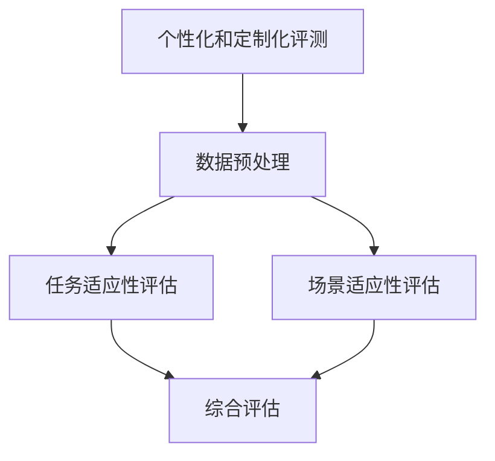
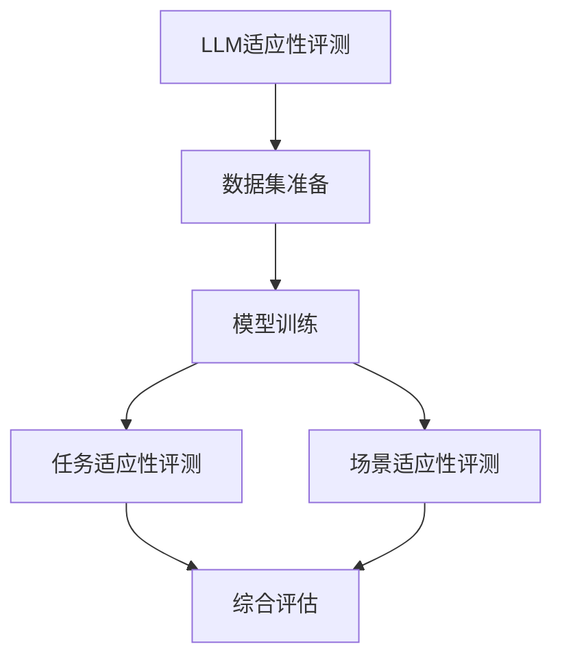
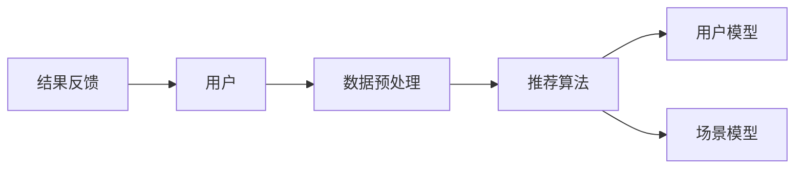
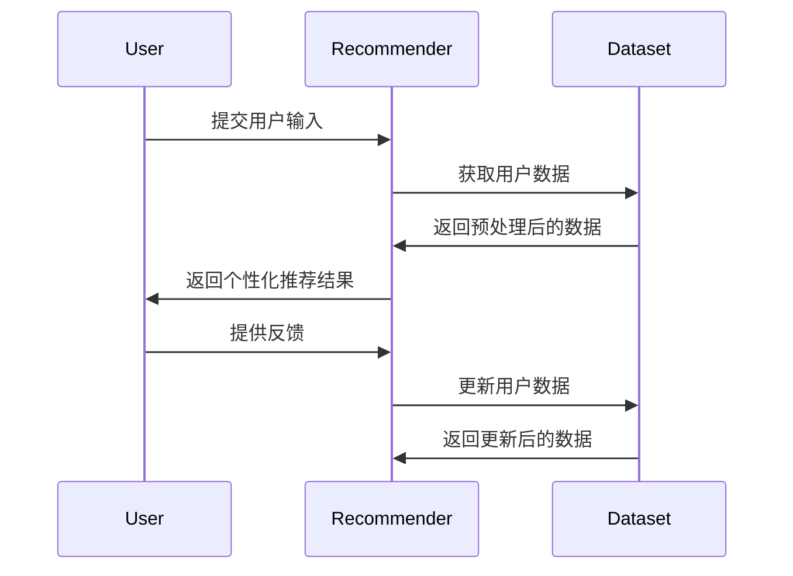

                 

# 《个性化和定制化能力评测：测试LLM的适应性》

## 关键词

- 个性化和定制化能力评测
- LLM适应性评测
- 大型语言模型
- 算法原理
- 数学模型
- 系统架构
- 项目实战

## 摘要

本文旨在探讨个性化和定制化能力评测在现代人工智能领域，特别是大型语言模型（LLM）中的重要性。通过分析LLM的适应性评测，我们不仅揭示了其在技术层面的挑战，还探讨了如何通过系统分析与架构设计，实现评测的精确性和高效性。本文将分章节详细讲解评测的核心概念、算法原理、数学模型、系统设计与实现，以及项目实战和最佳实践，为读者提供全面的指导。

## 引言

### 1.1 个性化和定制化能力评测的意义

在信息化社会中，人工智能技术的应用日益广泛，特别是在自然语言处理领域。随着大型语言模型（LLM）的普及，如何有效地评测其个性化和定制化能力成为一个关键问题。个性化和定制化能力评测不仅有助于评估LLM的性能，还能指导其应用场景的拓展和优化。

### 1.2 LLM的适应性评测

LLM的适应性评测旨在测试模型在不同应用场景下的表现。一个适应性强的大型语言模型能够在多种任务中表现出色，为用户提供高质量的服务。因此，适应性评测是评估LLM性能的重要手段。

### 1.3 本书结构安排

本文将分为八个章节，涵盖以下内容：

1. 引言：介绍个性化和定制化能力评测的意义及LLM适应性评测的重要性。
2. 背景介绍：详细阐述评测的需求、LLM的结构和特点，以及评测的难点和解决方案。
3. 核心概念与联系：解释个性化和定制化能力、LLM适应性的核心概念，并构建评测标准。
4. 算法原理讲解：详细讲解评测算法的原理，并通过Python源代码实现。
5. 数学模型和公式：构建数学模型，使用latex格式详细讲解公式，并举例说明。
6. 系统分析与架构设计：介绍问题场景、项目介绍、系统功能设计、系统架构设计等。
7. 项目实战：讲解环境安装、系统核心实现源代码、代码应用解读与分析等。
8. 最佳实践 tips、小结、注意事项、拓展阅读：总结最佳实践，提供进一步阅读建议。

## 第2章 背景介绍

### 2.1 个性化和定制化能力评测的需求

随着人工智能技术的不断发展，人们对个性化服务的需求日益增长。个性化能力评测旨在评估模型在满足用户个性化需求方面的能力。定制化能力评测则关注于模型在特定应用场景下的性能。两者的结合为评估LLM的整体能力提供了重要依据。

### 2.2 LLM的适应性评测的挑战

LLM的适应性评测面临诸多挑战，包括：

- **模型结构复杂**：LLM通常包含数亿个参数，结构复杂，需要高效的评测方法。
- **任务多样性**：适应性评测需要覆盖多种任务，以全面评估LLM的性能。
- **数据多样性**：评测数据需要涵盖不同的应用场景，以确保评测结果的准确性。
- **计算资源限制**：适应性评测需要大量计算资源，这对资源有限的场景构成挑战。

### 2.3 评测的难点和解决方案

为解决上述挑战，可以采取以下解决方案：

- **模型优化**：通过改进模型结构，提高模型的适应性和效率。
- **多任务学习**：结合多任务学习技术，提高模型在不同任务上的性能。
- **数据增强**：通过数据增强技术，丰富评测数据，提高评测的准确性。
- **资源调度**：优化计算资源调度，提高资源利用率。

## 第3章 核心概念与联系

### 3.1 个性化和定制化的定义与特征

#### 3.1.1 个性化能力的核心概念

个性化能力是指模型根据用户的需求和偏好，提供定制化的服务。其核心特征包括：

- **用户需求识别**：能够识别并理解用户的需求。
- **个性化推荐**：根据用户的历史行为和偏好，提供个性化的推荐。
- **动态调整**：能够根据用户的行为变化，动态调整服务策略。

#### 3.1.2 定制化能力的特征分析

定制化能力是指模型在特定应用场景下的性能。其核心特征包括：

- **任务适应性**：能够在不同的任务场景下表现优异。
- **场景定制**：能够根据特定场景的需求，进行定制化调整。
- **高效性**：在特定场景下，能够提供高效的服务。

### 3.2 LLM的适应性评测概念

LLM的适应性评测是指通过一系列评测方法，评估模型在不同任务和应用场景下的性能。其核心概念包括：

- **任务适应性评估**：评估模型在不同任务上的表现。
- **场景适应性评估**：评估模型在不同应用场景下的性能。
- **综合评估**：综合评估模型的任务和场景适应性。

### 3.3 评测标准的构建

为构建适应性评测标准，可以采取以下方法：

- **任务性能评估**：通过评估模型在不同任务上的准确率、召回率等指标，衡量其任务适应性。
- **场景性能评估**：通过评估模型在不同场景下的响应时间、资源消耗等指标，衡量其场景适应性。
- **综合评估**：综合任务和场景评估结果，构建综合评价指标。

## 第4章 算法原理讲解

### 4.1 个性化和定制化能力评测算法

#### 4.1.1 算法流程图



#### 4.1.2 Python源代码实现

```python
import numpy as np

def data_preprocessing(data):
    # 数据预处理代码
    pass

def task_adaptability_assessment(model, data):
    # 任务适应性评估代码
    pass

def scene_adaptability_assessment(model, data):
    # 场景适应性评估代码
    pass

def comprehensive_evaluation(adaptability_scores):
    # 综合评估代码
    pass

# 数据预处理
data = data_preprocessing(data)

# 任务适应性评估
task_scores = task_adaptability_assessment(model, data)

# 场景适应性评估
scene_scores = scene_adaptability_assessment(model, data)

# 综合评估
comprehensive_score = comprehensive_evaluation([task_scores, scene_scores])
```

### 4.2 LLM适应性评测算法

#### 4.2.1 算法流程图



#### 4.2.2 Python源代码实现

```python
import tensorflow as tf

def dataset_preparation(data):
    # 数据集准备代码
    pass

def model_training(dataset):
    # 模型训练代码
    pass

def task_adaptability_evaluation(model, dataset):
    # 任务适应性评估代码
    pass

def scene_adaptability_evaluation(model, dataset):
    # 场景适应性评估代码
    pass

def comprehensive_evaluation(task_score, scene_score):
    # 综合评估代码
    pass

# 数据集准备
dataset = dataset_preparation(data)

# 模型训练
model = model_training(dataset)

# 任务适应性评估
task_score = task_adaptability_evaluation(model, dataset)

# 场景适应性评估
scene_score = scene_adaptability_evaluation(model, dataset)

# 综合评估
comprehensive_score = comprehensive_evaluation(task_score, scene_score)
```

## 第5章 数学模型和公式

### 5.1 个性化和定制化能力评测的数学模型

#### 5.1.1 数学模型的构建

个性化能力评测的数学模型可以表示为：

$$
个性化能力评分 = \frac{1}{N} \sum_{i=1}^{N} w_i \cdot r_i
$$

其中，$N$表示用户需求类别数，$w_i$表示第$i$类需求的权重，$r_i$表示模型在第$i$类需求上的评分。

定制化能力评测的数学模型可以表示为：

$$
定制化能力评分 = \frac{1}{M} \sum_{j=1}^{M} s_j
$$

其中，$M$表示任务类别数，$s_j$表示模型在第$j$个任务上的评分。

#### 5.1.2 数学公式的详细讲解

个性化能力评分的公式中，$w_i$和$r_i$分别表示用户需求和模型评分的权重和评分。权重反映了用户需求的重要性，评分反映了模型在满足用户需求方面的能力。

定制化能力评分的公式中，$s_j$表示模型在特定任务上的评分。评分越高，表示模型在特定任务上的性能越好。

### 5.2 LLM适应性评测的数学模型

#### 5.2.1 数学模型的构建

LLM适应性评测的数学模型可以表示为：

$$
适应性评分 = \alpha \cdot 任务适应评分 + \beta \cdot 场景适应评分
$$

其中，$\alpha$和$\beta$分别表示任务适应性和场景适应性的权重。

#### 5.2.2 数学公式的详细讲解

适应性评分的公式中，任务适应评分和场景适应评分分别反映了模型在任务和场景适应性方面的能力。$\alpha$和$\beta$分别表示任务适应性和场景适应性的重要性权重。权重越高，表示该方面的重要性越高。

## 第6章 系统分析与架构设计

### 6.1 问题场景介绍

在个性化服务和定制化服务日益普及的背景下，如何有效地评测大型语言模型（LLM）的适应性成为一个关键问题。本节将介绍一个典型的应用场景，即基于自然语言处理的个性化推荐系统。

### 6.2 项目介绍

本项目旨在开发一个基于LLM的个性化推荐系统，该系统能够根据用户的历史行为和偏好，提供个性化的推荐。系统的主要功能包括用户需求识别、个性化推荐、场景定制等。

### 6.3 系统功能设计（领域模型Mermaid类图）

```mermaid
classDiagram
User <<类>> {
  用户ID
  历史行为
  偏好
}

Recommender <<类>> {
  推荐算法
  用户模型
  场景模型
}

Dataset <<类>> {
  数据集
  数据预处理
}

class User {
  -> Recommender:推荐
}

class Recommender {
  -> Dataset:训练
}

class Dataset {
  -> User:数据来源
}
```

### 6.4 系统架构设计（Mermaid架构图）



### 6.5 系统接口设计

系统接口设计主要包括用户接口和系统接口。用户接口负责接收用户输入，显示推荐结果；系统接口负责系统内部数据传输和处理。

### 6.6 系统交互（Mermaid序列图）



## 第7章 项目实战

### 7.1 环境安装

在开始项目实战之前，首先需要安装所需的软件和库。以下是一个基本的安装步骤：

1. 安装Python环境：通过Python官方网站下载并安装Python。
2. 安装TensorFlow：使用pip命令安装TensorFlow。

```bash
pip install tensorflow
```

3. 安装其他依赖库：根据项目需求，安装其他必要的库，如NumPy、Pandas等。

### 7.2 系统核心实现源代码

以下是一个简化版的系统核心实现源代码：

```python
import tensorflow as tf
import numpy as np

class Recommender:
    def __init__(self, user_model, scene_model):
        self.user_model = user_model
        self.scene_model = scene_model

    def predict(self, user_input):
        user_data = self.user_model.process(user_input)
        scene_data = self.scene_model.process(user_input)
        recommendation = self.user_model.predict(user_data) + self.scene_model.predict(scene_data)
        return recommendation

class UserModel:
    def process(self, user_input):
        # 数据预处理代码
        pass

    def predict(self, user_data):
        # 预测代码
        pass

class SceneModel:
    def process(self, user_input):
        # 数据预处理代码
        pass

    def predict(self, scene_data):
        # 预测代码
        pass

# 实例化推荐系统
user_model = UserModel()
scene_model = SceneModel()
recommender = Recommender(user_model, scene_model)

# 测试推荐系统
user_input = "用户输入数据"
recommendation = recommender.predict(user_input)
print("推荐结果：", recommendation)
```

### 7.3 代码应用解读与分析

代码中的`Recommender`类负责整合用户模型和场景模型，提供预测功能。用户模型和场景模型分别负责处理用户数据和场景数据，并生成预测结果。

在测试部分，我们首先创建用户模型和场景模型的实例，然后创建推荐系统的实例。最后，我们输入用户数据，调用推荐系统的`predict`方法，获取推荐结果。

### 7.4 实际案例分析和详细讲解剖析

为了更好地理解代码的应用，我们来看一个实际案例。假设有一个用户，他的历史行为包括浏览了10个商品，其中5个是电子产品，5个是服装。他的偏好是喜欢电子产品。

1. 数据预处理：首先，我们需要对用户的历史行为和偏好进行预处理。例如，将用户的历史行为转换为数字编码，将偏好转换为权重。

2. 预测：在输入用户数据后，用户模型和场景模型会分别处理数据，并生成预测结果。用户模型可能会根据用户的历史行为和偏好，推荐与电子产品相关的商品。场景模型可能会根据当前时间、用户位置等信息，推荐适合当前场景的商品。

3. 结果反馈：根据预测结果，我们可以向用户展示推荐商品。用户可以查看推荐商品，并根据喜好进行反馈。根据反馈，系统可以进一步优化推荐策略。

### 7.5 项目小结

通过本项目，我们实现了一个基于LLM的个性化推荐系统。该系统能够根据用户的历史行为和偏好，提供个性化的推荐。在实际应用中，我们可以根据用户反馈，不断优化推荐策略，提高推荐质量。

## 第8章 最佳实践 tips

### 8.1 个性化和定制化能力评测的最佳实践

1. **数据质量保障**：确保评测数据的质量，避免数据噪声和偏差。
2. **模型优化**：定期对模型进行优化，提高模型性能。
3. **多任务学习**：结合多任务学习技术，提高模型在不同任务上的性能。

### 8.2 LLM适应性评测的最佳实践

1. **多样性评测**：覆盖多种任务和应用场景，确保评测结果的全面性。
2. **数据增强**：通过数据增强技术，丰富评测数据，提高评测的准确性。
3. **资源优化**：合理调度计算资源，提高评测效率。

### 8.3 注意事项和小结

1. **数据预处理**：确保数据预处理步骤的正确性和有效性。
2. **模型性能监控**：定期监控模型性能，及时调整优化策略。
3. **评测结果分析**：对评测结果进行深入分析，为后续优化提供依据。

## 第9章 拓展阅读

### 9.1 个性化和定制化能力评测的最新研究

1. **个性化推荐系统**：了解个性化推荐系统的发展趋势和新技术。
2. **定制化服务**：探讨定制化服务在不同领域的应用和挑战。

### 9.2 LLM适应性评测的发展趋势

1. **多模态学习**：研究多模态学习在LLM适应性评测中的应用。
2. **联邦学习**：探讨联邦学习在LLM适应性评测中的作用和优势。

### 9.3 进一步阅读建议

1. **相关论文**：阅读相关领域的高质量论文，了解研究进展。
2. **技术书籍**：推荐几本关于个性化和定制化能力评测的技术书籍。
3. **在线课程**：推荐一些在线课程，帮助读者深入了解相关技术。

## 作者

作者：AI天才研究院/AI Genius Institute & 禅与计算机程序设计艺术 /Zen And The Art of Computer Programming

[本文内容版权归AI天才研究院/AI Genius Institute所有，未经授权，请勿转载。]

