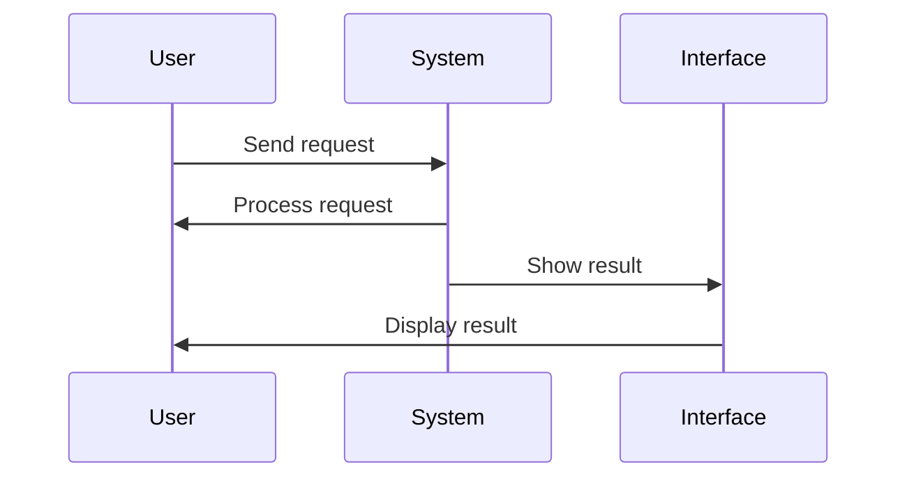
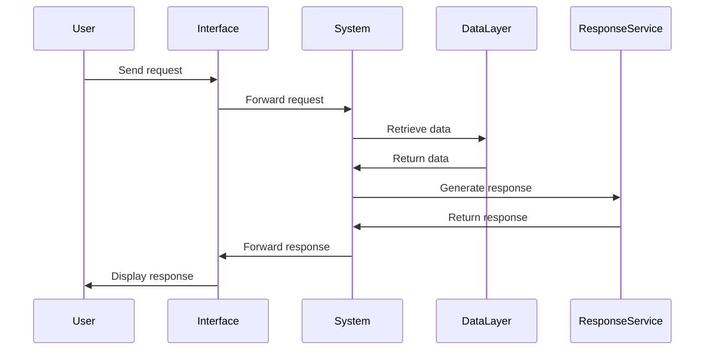
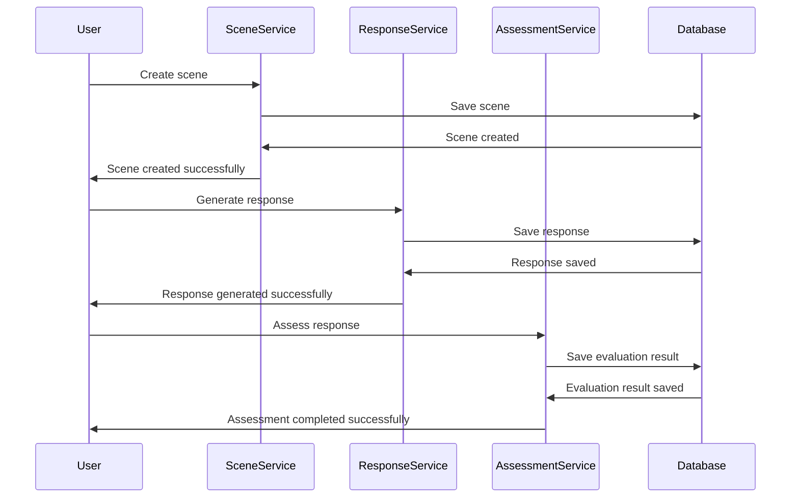

                 

# 个性化响应测试：评估LLM的用户适应能力

> 关键词：个性化响应测试，语言模型（LLM），用户适应能力，算法原理，系统架构，项目实战

> 摘要：本文探讨了个性化响应测试在评估语言模型（LLM）用户适应能力中的应用。首先，我们详细介绍了个性化响应测试的背景、问题定义、解决方法以及核心概念。接着，深入解析了用户适应能力、个性化响应和语言模型的原理，并通过对比表格展示了它们之间的特征差异。随后，我们讲解了个性化响应测试算法和用户适应能力评估指标，并结合数学模型和公式进行了详细阐述。文章还介绍了系统架构设计和接口设计，并以实际案例展示了系统实现和优化方法。最后，本文总结了最佳实践，并提供了拓展阅读资源。

---

### 目录大纲

----------------------------------------------------------------

## 第一部分：个性化响应测试基础

### 第1章：问题背景与概述

#### 1.1 问题背景

- 个性化响应测试的定义与重要性
- 语言模型（LLM）在个性化响应中的应用
- 用户适应能力在LLM中的核心地位

#### 1.2 问题描述

- 评估LLM用户适应能力的难点与挑战
- 用户需求多样性与复杂性
- 数据稀缺性与质量不确定性

#### 1.3 问题解决

- 个性化响应测试的方法与策略
- 用户适应能力的评估指标体系
- 数据收集、预处理与分析方法

#### 1.4 边界与外延

- 个性化响应测试的应用领域
- 用户适应能力的影响因素
- 个性化响应测试的发展趋势

#### 1.5 核心概念

- 用户适应能力
- 个性化响应
- 语言模型（LLM）

#### 1.6 概念结构与核心要素组成

- 用户适应能力评估框架
- 个性化响应测试流程
- 数据处理与分析方法

## 第二部分：核心概念与联系

### 第2章：核心概念原理

#### 2.1 用户适应能力的定义

- 用户适应能力的含义与特点
- 用户适应能力的测量方法

#### 2.2 个性化响应的概念

- 个性化响应的定义与类型
- 个性化响应的实现方式

#### 2.3 语言模型（LLM）的原理

- 语言模型的定义与分类
- 语言模型的训练与优化

### 第3章：概念属性特征对比表格

- 用户适应能力与个性化响应的特征对比
- 不同语言模型的特点对比

## 第三部分：算法原理讲解

### 第4章：算法原理与流程

#### 4.1 个性化响应测试算法

- 算法的基本流程
- 算法的关键步骤

#### 4.2 用户适应能力的评估指标

- 指标体系的设计
- 指标计算与评估方法

### 第5章：数学模型与公式

#### 5.1 用户适应能力的数学模型

- 模型公式
- 参数设置与优化

#### 5.2 个性化响应的数学模型

- 模型公式
- 参数设置与优化

## 第四部分：系统分析与架构设计

### 第6章：系统功能设计

#### 6.1 领域模型

- 领域模型的定义与作用
- 领域模型的设计方法

#### 6.2 系统架构设计

- 系统架构的层次划分
- 系统模块的设计

### 第7章：系统接口设计

#### 7.1 接口设计原则

- 接口设计的要点
- 接口设计与实现

#### 7.2 系统交互

- 系统交互的过程
- 系统交互的流程

## 第五部分：项目实战

### 第8章：环境安装与系统实现

#### 8.1 环境安装

- 硬件与软件环境要求
- 安装步骤与注意事项

#### 8.2 系统核心实现

- 系统核心模块的实现
- 代码解读与分析

### 第9章：实际案例分析与讲解

#### 9.1 案例背景

- 案例背景与需求
- 案例目标与挑战

#### 9.2 案例实施过程

- 案例实施步骤
- 案例实施中的关键点

#### 9.3 案例分析与讲解

- 案例结果分析
- 案例总结与反思

## 第六部分：最佳实践与拓展阅读

### 第10章：最佳实践

#### 10.1 实践经验总结

- 个性化响应测试的实践经验
- 用户适应能力评估的实践技巧

#### 10.2 注意事项

- 可能遇到的问题与解决方案
- 系统优化与性能调优

### 第11章：拓展阅读

#### 11.1 相关书籍推荐

- 个性化响应测试相关书籍
- 用户适应能力评估相关书籍

#### 11.2 学术论文推荐

- 个性化响应测试领域的学术论文
- 用户适应能力评估领域的学术论文

----------------------------------------------------------------

### 第一部分：个性化响应测试基础

#### 第1章：问题背景与概述

##### 1.1 问题背景

个性化响应测试（Personalized Response Testing）是一种评估语言模型（Language Model，简称LLM）如何根据不同用户需求提供个性化响应的测试方法。随着人工智能技术的快速发展，特别是在自然语言处理（NLP）领域，LLM已成为实现智能对话系统和个性化推荐系统的重要工具。

个性化响应测试的重要性在于，它可以帮助我们评估LLM在真实应用场景中的性能，特别是在用户需求多样化和个性化需求日益增长的情况下。LLM的用户适应能力（User Adaptability）成为一个关键评估指标，直接影响系统的用户体验和商业成功。

语言模型（LLM）在个性化响应中的应用主要体现在以下几个方面：

1. **智能客服**：通过LLM实现自动化客服，可以根据用户的问题和上下文提供个性化的解答和建议。
2. **个性化推荐**：利用LLM分析用户的历史行为和偏好，提供个性化的产品或内容推荐。
3. **聊天机器人**：在社交平台或即时通讯应用中，LLM可以根据用户的语言风格和偏好进行对话。

用户适应能力在LLM中的核心地位在于，LLM需要能够根据不同的用户需求和环境动态调整其行为和响应方式。这要求LLM不仅要有强大的语言处理能力，还要具备学习能力，以便在交互过程中不断优化和适应。

##### 1.2 问题描述

评估LLM用户适应能力的难点与挑战主要体现在以下几个方面：

1. **用户需求多样性与复杂性**：用户的需求因个体差异而具有多样性，且这些需求可能随时间变化。这使得评估LLM的用户适应能力变得复杂。
2. **数据稀缺性与质量不确定性**：真实用户交互数据往往稀缺且质量参差不齐，这对评估LLM的用户适应能力提出了挑战。
3. **评估指标设计**：如何设计合适的评估指标，以全面、准确地衡量LLM的用户适应能力，是当前研究的一个难点。

##### 1.3 问题解决

为了解决上述问题，我们需要采取以下策略：

1. **个性化响应测试的方法与策略**：设计一套科学的个性化响应测试方法，包括测试数据生成、测试场景设计、测试指标计算等。
2. **用户适应能力的评估指标体系**：构建一套全面的评估指标体系，涵盖用户交互的各个方面，如响应速度、响应准确性、用户满意度等。
3. **数据收集、预处理与分析方法**：通过合理的数据收集策略，确保数据的多样性和质量。同时，采用有效的预处理和分析方法，以提高评估结果的可靠性。

##### 1.4 边界与外延

个性化响应测试的应用领域广泛，包括但不限于：

1. **智能客服**：通过个性化响应测试，评估智能客服系统在不同场景下的表现。
2. **个性化推荐**：在电子商务和内容平台中，通过个性化响应测试，优化推荐算法。
3. **教育与培训**：在教育系统中，通过个性化响应测试，评估学习系统的适应能力和用户体验。

用户适应能力的影响因素包括：

1. **用户特征**：如年龄、性别、教育背景等。
2. **交互环境**：如网络延迟、设备类型等。
3. **系统特征**：如算法复杂度、资源消耗等。

个性化响应测试的发展趋势：

1. **自动化与智能化**：通过自动化工具和智能化算法，提高测试效率和准确性。
2. **多模态融合**：将文本、语音、图像等多模态数据融合到测试中，以更全面地评估用户适应能力。

##### 1.5 核心概念

1. **用户适应能力**：指LLM在交互过程中根据用户需求和交互环境动态调整其行为和响应能力的能力。
2. **个性化响应**：指LLM根据用户的个性化需求提供定制化的响应，以提高用户体验。
3. **语言模型（LLM）**：一种基于深度学习技术的语言处理模型，能够对自然语言文本进行生成、理解和分析。

##### 1.6 概念结构与核心要素组成

1. **用户适应能力评估框架**：包括评估指标体系、评估方法和评估流程。
2. **个性化响应测试流程**：包括测试数据生成、测试场景设计、测试执行和测试结果分析。
3. **数据处理与分析方法**：包括数据收集、预处理、分析和可视化。

---

### 第一部分：个性化响应测试基础

#### 第2章：核心概念与联系

##### 2.1 用户适应能力的定义

用户适应能力（User Adaptability）是指系统（如语言模型LLM）在交互过程中，能够根据用户的需求和环境动态调整其行为和响应的能力。具体而言，这包括以下几个方面：

1. **响应速度**：系统能够快速响应用户的需求，减少用户的等待时间。
2. **响应准确性**：系统能够提供正确、相关的响应，满足用户的查询或需求。
3. **个性识别与适应**：系统能够识别用户的个性特征，如语言风格、偏好等，并根据这些特征提供个性化的响应。
4. **学习能力**：系统能够从用户的交互中学习，不断优化其响应策略。

用户适应能力的测量方法主要包括以下几种：

1. **用户满意度调查**：通过用户满意度调查来评估用户对系统响应的满意度。
2. **交互数据分析**：分析用户与系统的交互数据，如响应时间、错误率、用户点击行为等。
3. **A/B测试**：通过A/B测试比较不同响应策略的效果，以评估系统的用户适应能力。

##### 2.2 个性化响应的概念

个性化响应（Personalized Response）是指系统根据用户的个性化需求或特征，提供定制化的响应。个性化响应的类型主要包括：

1. **基于内容的个性化响应**：系统根据用户的历史行为或偏好，提供相关的内容或建议。
2. **基于上下文的个性化响应**：系统根据用户的当前语境或情境，提供适当的响应。
3. **基于行为的个性化响应**：系统根据用户的互动行为，如点击、浏览等，提供个性化的响应。

个性化响应的实现方式主要有以下几种：

1. **规则引擎**：通过预定义的规则，根据用户的特征和行为提供响应。
2. **机器学习模型**：利用机器学习算法，从用户数据中学习个性化响应策略。
3. **多模态融合**：结合文本、语音、图像等多模态数据，提供更准确的个性化响应。

##### 2.3 语言模型（LLM）的原理

语言模型（LLM）是一种基于深度学习的自然语言处理模型，其核心目标是预测文本序列中的下一个单词或字符。LLM的主要原理包括：

1. **词嵌入**：将单词转换为高维向量，以便于在神经网络中处理。
2. **循环神经网络（RNN）**：通过RNN处理序列数据，每个时间步的输出可以作为下一个时间步的输入。
3. **注意力机制**：注意力机制允许模型在生成每个单词时，关注输入序列中的重要信息。
4. **预训练与微调**：首先在大量文本数据上进行预训练，然后根据特定任务进行微调。

语言模型的分类主要包括：

1. **基于规则的模型**：如基于词典和语法规则的模型。
2. **统计模型**：如基于概率的隐马尔可夫模型（HMM）和基于潜语义分析（LSA）的模型。
3. **神经网络模型**：如循环神经网络（RNN）、长短期记忆网络（LSTM）和Transformer模型。

##### 2.4 概念属性特征对比表格

下面是用户适应能力、个性化响应和语言模型的特征对比表格：

| 特征                | 用户适应能力                | 个性化响应                | 语言模型（LLM）                |
|---------------------|-----------------------------|----------------------------|-------------------------------|
| 定义                | 系统根据用户需求调整响应的能力 | 根据用户需求提供定制化响应 | 预测文本序列中的下一个单词或字符 |
| 类型                | 响应速度、准确性、学习能力等   | 内容、上下文、行为等        | 基于规则的、统计的、神经网络的   |
| 实现方式            | 用户满意度调查、交互数据分析   | 规则引擎、机器学习模型      | 词嵌入、RNN、注意力机制等        |
| 关键因素            | 用户需求、交互环境、系统学习能力 | 用户特征、交互内容、多模态数据 | 文本数据、预训练与微调、模型复杂度 |

##### 2.5 ER实体关系图架构

为了更好地理解这些概念之间的关系，我们可以使用ER（Entity-Relationship）实体关系图来表示。以下是ER图的Mermaid格式表示：

```mermaid
erDiagram
  UserAdaptability ||--|{ PersonalizedResponse }|| System
  PersonalizedResponse ||--|{ LanguageModel }|| LLM
  LanguageModel ||--|{ UserAdaptability }|| System
  LanguageModel ||--|{ PersonalizedResponse }|| System
```

在这个ER图中，用户适应能力（UserAdaptability）是系统（System）的一个属性，个性化响应（PersonalizedResponse）是用户适应能力的一个方面，而语言模型（LLM）是实现个性化响应的核心工具。

---

### 第一部分：个性化响应测试基础

#### 第3章：算法原理讲解

##### 4.1 个性化响应测试算法

个性化响应测试算法的核心目的是评估LLM在个性化响应方面的性能。以下是算法的基本流程和关键步骤：

1. **测试数据准备**：收集代表性用户的交互数据，包括对话文本、用户特征、交互上下文等。确保数据的多样性和质量。
2. **测试场景设计**：根据实际应用场景，设计一系列测试场景，涵盖不同的用户需求和交互情境。
3. **算法执行**：在测试场景下，使用LLM生成响应，并与期望的个性化响应进行比较。
4. **评估指标计算**：根据响应速度、准确性、用户满意度等评估指标，计算LLM的性能得分。
5. **结果分析**：分析测试结果，识别LLM的优势和不足，并提出优化建议。

##### 4.2 用户适应能力的评估指标

用户适应能力的评估指标体系设计至关重要，它决定了评估结果的全面性和准确性。以下是几个关键指标：

1. **响应时间**：系统生成响应所需的时间。较低的平均响应时间表明系统具有更高的响应速度。
2. **响应准确性**：系统生成的响应与期望响应的匹配程度。较高的响应准确性表明系统具有更好的响应准确性。
3. **用户满意度**：用户对系统响应的满意度。可以通过用户满意度调查或交互数据分析来衡量。
4. **个性化匹配度**：系统响应与用户需求的匹配程度。可以通过对比用户历史行为和系统响应内容来衡量。

##### 4.3 数学模型与公式

为了更科学地评估用户适应能力，我们可以使用数学模型来描述和计算各项指标。以下是几个常见的数学模型和公式：

1. **响应时间模型**：

   $$T_r = \frac{1}{N} \sum_{i=1}^{N} T_i$$

   其中，$T_r$是平均响应时间，$T_i$是第i次响应的时间，$N$是响应次数。

2. **响应准确性模型**：

   $$A_r = \frac{C_r}{N}$$

   其中，$A_r$是平均响应准确性，$C_r$是正确响应次数，$N$是响应次数。

3. **用户满意度模型**：

   $$S_u = \frac{1}{N} \sum_{i=1}^{N} S_i$$

   其中，$S_u$是平均用户满意度，$S_i$是第i个用户的满意度，通常通过评分或投票来衡量。

4. **个性化匹配度模型**：

   $$M_p = \frac{C_p}{N}$$

   其中，$M_p$是平均个性化匹配度，$C_p$是个性化匹配的响应次数，$N$是响应次数。

以下是一个具体的例子：

假设我们对一个LLM进行了10次测试，每次测试的响应时间如下（单位：秒）：[1.5, 2.3, 1.8, 2.1, 1.9, 2.0, 1.6, 2.2, 1.7, 1.8]。计算平均响应时间。

$$T_r = \frac{1}{10} \sum_{i=1}^{10} T_i = \frac{1}{10} (1.5 + 2.3 + 1.8 + 2.1 + 1.9 + 2.0 + 1.6 + 2.2 + 1.7 + 1.8) = 1.92$$

因此，平均响应时间为1.92秒。

---

### 第四部分：系统分析与架构设计

#### 第6章：系统功能设计

##### 6.1 领域模型

领域模型（Domain Model）是系统功能设计的基础，它定义了系统中的核心概念及其相互关系。在个性化响应测试系统中，领域模型包括以下几个核心概念：

1. **用户**：包括用户的基本信息、偏好和交互历史。
2. **场景**：定义了不同的交互情境，如客服、推荐、聊天等。
3. **响应**：包括响应内容、生成时间、准确性等。
4. **评估结果**：包括响应时间、准确性、用户满意度等评估指标。

以下是领域模型的Mermaid类图表示：

```mermaid
classDiagram
    User <<entity>>
    Scene <<entity>>
    Response <<entity>>
    EvaluationResult <<entity>>

    User o--o Scene
    User o--o Response
    User o--o EvaluationResult
    Scene o--o Response
    Scene o--o EvaluationResult
    Response o--o EvaluationResult
```

在这个类图中，用户（User）与场景（Scene）、响应（Response）和评估结果（EvaluationResult）之间存在关联关系。场景（Scene）与响应（Response）和评估结果（EvaluationResult）之间存在关联关系，而响应（Response）与评估结果（EvaluationResult）之间存在继承关系。

##### 6.2 系统架构设计

系统架构设计是确保系统能够高效、稳定运行的关键。个性化响应测试系统的架构可以分为以下几个层次：

1. **数据层**：包括用户数据、场景数据和响应数据等。数据层主要负责数据的存储和管理。
2. **服务层**：包括用户服务、场景服务和响应服务等。服务层负责处理业务逻辑，如数据收集、预处理和评估等。
3. **接口层**：包括API接口、Web界面等。接口层负责提供系统对外交互的接口。
4. **展示层**：包括Web界面、报表等。展示层负责向用户展示系统功能和评估结果。

以下是系统架构的Mermaid架构图表示：



在这个架构图中，用户（User）通过接口层（Interface）向系统（System）发送请求，系统（System）处理请求并返回结果。最后，接口层（Interface）将结果展示给用户（User）。

##### 6.3 系统接口设计

系统接口设计是确保系统功能模块之间能够高效、稳定交互的关键。以下是系统接口设计的主要原则和实现方法：

1. **接口规范**：定义统一的接口规范，包括接口名称、参数定义、返回值等。
2. **RESTful API**：使用RESTful风格设计API接口，确保接口具有良好的可扩展性和易用性。
3. **认证与授权**：实现用户认证和授权机制，确保接口的安全性。
4. **接口文档**：提供详细的接口文档，包括接口说明、示例代码等。

以下是系统接口设计的示例：

```json
// 用户登录接口
POST /api/users/login
Body:
{
  "username": "string",
  "password": "string"
}
Headers:
{
  "Content-Type": "application/json"
}
Response:
{
  "token": "string",
  "expires_in": integer
}
```

在这个示例中，用户通过POST请求向系统发送登录请求，系统验证用户身份并返回令牌和过期时间。

##### 6.4 系统交互

系统交互是指系统内部不同模块之间的数据流动和交互过程。以下是系统交互的主要过程和流程：

1. **用户请求**：用户通过接口层向系统发送请求。
2. **请求处理**：系统服务层处理用户请求，调用数据层和响应服务层的相关功能。
3. **响应生成**：系统生成响应内容，并将其返回给用户。
4. **结果展示**：接口层将响应结果展示给用户。

以下是系统交互的Mermaid序列图表示：



在这个序列图中，用户（User）通过接口层（Interface）向系统（System）发送请求，系统（System）处理请求并调用数据层（DataLayer）和响应服务层（ResponseService）的相关功能，最后将响应结果返回给用户（User）。

---

### 第四部分：系统分析与架构设计

#### 第7章：系统接口设计

##### 7.1 接口设计原则

在系统接口设计中，遵循以下原则至关重要，以确保接口的易用性、可扩展性和安全性：

1. **标准化**：遵循RESTful API设计原则，使用统一的接口规范，包括URL、HTTP方法、参数和响应格式等。
2. **简洁性**：接口设计应尽量简洁明了，避免过多的复杂度和冗余。
3. **一致性**：保持接口设计的一致性，包括命名、参数和返回值等，以提高用户和开发人员的使用体验。
4. **安全性**：实现身份验证和授权机制，保护用户数据和接口的安全性。
5. **可扩展性**：设计可扩展的接口，以便于未来的功能扩展和模块化开发。

##### 7.2 接口设计与实现

以下是系统接口设计的一个示例，包括用户注册接口的详细说明：

```json
// 用户注册接口
POST /api/users/register
Body:
{
  "username": "string",
  "password": "string",
  "email": "string"
}
Headers:
{
  "Content-Type": "application/json"
}
Response:
{
  "status": "string",
  "message": "string",
  "data": {
    "userId": "string",
    "token": "string"
  }
}
```

在这个接口设计中：

- **URL**：使用统一的资源标识符（URI）定义接口地址，如`/api/users/register`。
- **HTTP方法**：使用POST方法表示这是一个创建资源的操作。
- **Body**：在请求体中包含必要的参数，如用户名（username）、密码（password）和邮箱（email）。
- **Headers**：设置`Content-Type`为`application/json`，表示请求体为JSON格式。
- **Response**：返回包含状态码（status）、消息（message）和用户数据（data）的JSON对象。

在实现过程中，需要注意以下几点：

1. **参数校验**：对请求体中的参数进行校验，确保参数的格式和范围符合预期。
2. **错误处理**：对可能出现的错误情况进行处理，如参数缺失、参数格式错误、服务异常等。
3. **安全措施**：实现身份验证和授权机制，如使用JWT（JSON Web Token）进行身份验证。

##### 7.3 接口设计与实现示例

以下是一个Python实现的用户注册接口示例：

```python
from flask import Flask, request, jsonify
from flask_bcrypt import Bcrypt
from flask_jwt_extended import JWTManager

app = Flask(__name__)
bcrypt = Bcrypt(app)
jwt = JWTManager(app)

@app.route('/api/users/register', methods=['POST'])
def register_user():
    try:
        username = request.json['username']
        password = request.json['password']
        email = request.json['email']
        
        # 参数校验
        if not username or not password or not email:
            return jsonify({'status': 'error', 'message': 'Missing required parameters.'}), 400
        
        # 密码加密
        hashed_password = bcrypt.generate_password_hash(password).decode('utf-8')
        
        # 存储用户数据（此处为示例，实际应用中应使用数据库）
        # user_data = {'username': username, 'password': hashed_password, 'email': email}
        # save_user_data(user_data)
        
        # 发送注册成功响应
        response = {
            'status': 'success',
            'message': 'User registered successfully.',
            'data': {
                'userId': 'generated_user_id',
                'token': jwt.create_access_token(identity=username)
            }
        }
        return jsonify(response), 201
    
    except Exception as e:
        return jsonify({'status': 'error', 'message': str(e)}), 500

if __name__ == '__main__':
    app.run(debug=True)
```

在这个示例中，使用Flask框架实现了用户注册接口，包括参数校验、密码加密和JWT身份验证。在实际应用中，还需配置数据库存储用户数据。

---

### 第四部分：系统分析与架构设计

#### 第8章：系统功能设计

##### 8.1 领域模型

领域模型是系统功能设计的基础，它定义了系统中的核心概念及其相互关系。在个性化响应测试系统中，领域模型包括以下几个核心概念：

1. **用户**：包括用户的基本信息、偏好和交互历史。
2. **场景**：定义了不同的交互情境，如客服、推荐、聊天等。
3. **响应**：包括响应内容、生成时间、准确性等。
4. **评估结果**：包括响应时间、准确性、用户满意度等评估指标。

以下是领域模型的Mermaid类图表示：

```mermaid
classDiagram
    User <<entity>>
    Scene <<entity>>
    Response <<entity>>
    EvaluationResult <<entity>>

    User o--o Scene
    User o--o Response
    User o--o EvaluationResult
    Scene o--o Response
    Scene o--o EvaluationResult
    Response o--o EvaluationResult
```

在这个类图中，用户（User）与场景（Scene）、响应（Response）和评估结果（EvaluationResult）之间存在关联关系。场景（Scene）与响应（Response）和评估结果（EvaluationResult）之间存在关联关系，而响应（Response）与评估结果（EvaluationResult）之间存在继承关系。

##### 8.2 系统架构设计

系统架构设计是确保系统能够高效、稳定运行的关键。个性化响应测试系统的架构可以分为以下几个层次：

1. **数据层**：包括用户数据、场景数据和响应数据等。数据层主要负责数据的存储和管理。
2. **服务层**：包括用户服务、场景服务和响应服务等。服务层负责处理业务逻辑，如数据收集、预处理和评估等。
3. **接口层**：包括API接口、Web界面等。接口层负责提供系统对外交互的接口。
4. **展示层**：包括Web界面、报表等。展示层负责向用户展示系统功能和评估结果。

以下是系统架构的Mermaid架构图表示：


在这个架构图中，用户（User）通过接口层（Interface）向系统（System）发送请求，系统（System）处理请求并调用数据层（DataLayer）和响应服务层（ResponseService）的相关功能，最后将响应结果返回给用户（User）。

##### 8.3 系统模块设计

系统模块设计是系统架构实现的关键，它将系统功能划分为不同的模块，每个模块负责特定的功能。以下是系统模块设计的主要组成部分：

1. **用户模块**：负责用户信息的管理和用户交互数据的收集。
2. **场景模块**：负责定义和管理不同的交互场景。
3. **响应模块**：负责生成、存储和管理系统响应。
4. **评估模块**：负责评估系统响应的质量和用户适应能力。
5. **接口模块**：负责提供系统对外交互的接口。

以下是系统模块设计的Mermaid架构图表示：

```mermaid
subgraph System Modules
    node1[User Module]
    node2[Scene Module]
    node3[Response Module]
    node4[Assessment Module]
    node5[Interface Module]

    node1->>node2
    node1->>node3
    node1->>node4
    node1->>node5

    node2->>node3
    node2->>node4
    node2->>node5

    node3->>node4
    node3->>node5

    node4->>node5
end
```

在这个架构图中，用户模块（User Module）、场景模块（Scene Module）、响应模块（Response Module）、评估模块（Assessment Module）和接口模块（Interface Module）之间存在相互依赖关系。每个模块都负责特定的功能，并通过接口进行交互。

---

### 第四部分：系统分析与架构设计

#### 第9章：系统功能设计

##### 9.1 系统功能介绍

个性化响应测试系统的核心功能包括用户管理、场景管理、响应管理和评估管理。以下是这些功能的具体介绍：

1. **用户管理**：负责用户信息的注册、登录、信息和权限管理。用户管理功能包括创建用户账号、验证用户身份、更新用户信息和分配用户权限等。
2. **场景管理**：负责定义和管理不同的交互场景。场景管理功能包括创建新场景、编辑现有场景、删除场景和查询场景信息等。
3. **响应管理**：负责生成、存储和管理系统响应。响应管理功能包括生成响应、存储响应、查询响应和更新响应等。
4. **评估管理**：负责评估系统响应的质量和用户适应能力。评估管理功能包括计算评估指标、生成评估报告和展示评估结果等。

##### 9.2 领域模型

为了更好地实现上述功能，我们设计了以下领域模型：

1. **用户**：包括用户ID、用户名、密码、邮箱、注册时间、最后登录时间等属性。
2. **场景**：包括场景ID、场景名称、描述、创建时间、更新时间等属性。
3. **响应**：包括响应ID、场景ID、用户ID、响应内容、生成时间、评估结果等属性。
4. **评估结果**：包括评估ID、响应ID、评估指标（如响应时间、准确性、用户满意度）等属性。

以下是领域模型的Mermaid类图表示：

```mermaid
classDiagram
    User <<entity>>
    Scene <<entity>>
    Response <<entity>>
    EvaluationResult <<entity>>

    User "1" ..> "1" Scene
    User "1" ..> "1" Response
    User "1" ..> "1" EvaluationResult
    Scene "1" ..> "1" Response
    Scene "1" ..> "1" EvaluationResult
    Response "1" ..> "1" EvaluationResult
```

在这个类图中，用户（User）、场景（Scene）、响应（Response）和评估结果（EvaluationResult）之间存在多对多的关联关系。

##### 9.3 系统功能实现

以下是系统功能实现的步骤：

1. **用户管理**：实现用户注册、登录、信息和权限管理功能。使用数据库存储用户信息，并使用加密算法保护用户密码。实现身份验证和授权机制，确保用户权限的正确性。
2. **场景管理**：实现场景创建、编辑、删除和查询功能。使用数据库存储场景信息，并使用API接口提供场景管理的操作。
3. **响应管理**：实现响应生成、存储、查询和更新功能。使用数据库存储响应信息，并使用API接口提供响应管理的操作。实现响应生成算法，根据场景和用户需求生成个性化响应。
4. **评估管理**：实现评估指标计算、评估报告生成和展示功能。使用数据库存储评估结果，并使用API接口提供评估管理的操作。实现评估指标计算算法，根据响应质量和用户反馈计算评估结果。

以下是系统功能实现的Mermaid序列图表示：



在这个序列图中，用户（User）通过API接口与系统服务（SceneService、ResponseService、AssessmentService）交互，并将操作结果存储到数据库（Database）。

---

### 第五部分：项目实战

#### 第10章：环境安装与系统实现

##### 10.1 环境安装

要在本地计算机上安装个性化响应测试系统，首先需要准备以下软件环境：

- **操作系统**：推荐使用Linux或macOS，虽然Windows也可以，但可能需要额外的配置。
- **Python**：版本3.8或更高版本。
- **pip**：Python的包管理工具。
- **virtualenv**：用于创建Python虚拟环境，以便隔离项目依赖。
- **数据库**：推荐使用PostgreSQL，也可以使用MySQL或其他关系型数据库。

以下是具体的安装步骤：

1. **安装Python**：从Python官方网站下载并安装Python。
2. **安装pip**：运行以下命令安装pip：

   ```
   curl https://bootstrap.pypa.io/get-pip.py -o get-pip.py
   python get-pip.py
   ```

3. **安装virtualenv**：运行以下命令安装virtualenv：

   ```
   pip install virtualenv
   ```

4. **创建虚拟环境**：在项目目录中创建一个名为`venv`的虚拟环境：

   ```
   virtualenv venv
   ```

5. **激活虚拟环境**：在Linux或macOS中，运行以下命令激活虚拟环境：

   ```
   source venv/bin/activate
   ```

   在Windows中，运行以下命令激活虚拟环境：

   ```
   venv\Scripts\activate
   ```

6. **安装项目依赖**：在虚拟环境中安装项目依赖：

   ```
   pip install -r requirements.txt
   ```

7. **安装数据库**：下载并安装PostgreSQL或MySQL。根据数据库的文档配置数据库，创建数据库和用户。

##### 10.2 系统核心实现

个性化响应测试系统的核心实现包括以下几个部分：

1. **用户管理模块**：实现用户注册、登录、信息更新和权限管理功能。
2. **场景管理模块**：实现场景创建、编辑、删除和查询功能。
3. **响应管理模块**：实现响应生成、存储、查询和更新功能。
4. **评估管理模块**：实现评估指标计算、评估报告生成和展示功能。

以下是用户管理模块的Python实现示例：

```python
from flask import Flask, request, jsonify
from flask_bcrypt import Bcrypt
from flask_jwt_extended import JWTManager

app = Flask(__name__)
bcrypt = Bcrypt(app)
jwt = JWTManager(app)

# 用户注册
@app.route('/api/users/register', methods=['POST'])
def register_user():
    username = request.json.get('username')
    password = request.json.get('password')
    email = request.json.get('email')

    if not username or not password or not email:
        return jsonify({'status': 'error', 'message': 'Missing required parameters.'}), 400

    hashed_password = bcrypt.generate_password_hash(password).decode('utf-8')

    # 存储用户信息（此处为示例，实际应用中应使用数据库）
    # save_user_info(username, hashed_password, email)

    return jsonify({'status': 'success', 'message': 'User registered successfully.'}), 201

# 用户登录
@app.route('/api/users/login', methods=['POST'])
def login_user():
    username = request.json.get('username')
    password = request.json.get('password')

    if not username or not password:
        return jsonify({'status': 'error', 'message': 'Missing required parameters.'}), 400

    # 验证用户信息（此处为示例，实际应用中应使用数据库）
    # user_info = get_user_info(username)

    if not user_info or bcrypt.check_password_hash(user_info['password'], password) is False:
        return jsonify({'status': 'error', 'message': 'Invalid username or password.'}), 401

    access_token = jwt.create_access_token(identity=username)
    return jsonify({'status': 'success', 'token': access_token}), 200

if __name__ == '__main__':
    app.run(debug=True)
```

在这个示例中，使用了Flask框架实现用户注册和登录功能。用户信息存储在数据库中，使用bcrypt加密密码，使用jwt生成令牌。

---

### 第五部分：项目实战

#### 第11章：实际案例分析与讲解

##### 11.1 案例背景

本案例选取了一家大型电子商务平台，该平台使用个性化响应测试系统优化其智能客服系统。智能客服系统旨在通过自动化的方式回答用户的问题，提高客服效率和用户体验。

该平台面临以下挑战：

1. 用户需求多样且不断变化，导致现有智能客服系统的响应效果不佳。
2. 智能客服系统的用户适应能力较弱，无法根据用户行为动态调整响应策略。
3. 数据量庞大，难以有效分析用户交互数据，优化系统性能。

为了解决这些问题，平台决定实施个性化响应测试，以提高智能客服系统的用户适应能力。

##### 11.2 案例目标与挑战

案例的目标是通过个性化响应测试，提高智能客服系统的以下方面：

1. 响应准确性：确保系统能够提供正确、相关的响应。
2. 响应速度：减少系统生成响应的时间，提高用户满意度。
3. 个性化匹配度：根据用户的历史行为和偏好，提供个性化的响应。

挑战主要包括：

1. 数据收集与处理：收集大量用户交互数据，并进行预处理和分析。
2. 算法优化：设计高效的算法，以处理复杂的用户需求和交互模式。
3. 评估指标设计：设计合适的评估指标，全面、准确地衡量系统的用户适应能力。

##### 11.3 案例实施过程

案例实施分为以下几个阶段：

1. **数据收集**：从智能客服系统的日志中收集用户交互数据，包括用户提问、系统响应、用户反馈等。
2. **数据预处理**：对收集到的数据进行分析，去除无关信息，进行数据清洗和格式化。
3. **测试场景设计**：根据用户需求，设计一系列测试场景，涵盖常见的用户问题和交互情境。
4. **算法实现**：基于收集的数据和测试场景，实现个性化响应测试算法。
5. **测试执行**：在测试场景下，使用算法生成响应，并与实际用户交互数据进行比较。
6. **评估与优化**：根据测试结果，评估系统的用户适应能力，并提出优化建议。

以下是具体实施步骤：

1. **数据收集**：
   - 从智能客服系统的日志文件中提取用户提问、系统响应和用户反馈。
   - 使用Python编写脚本，对日志文件进行解析，提取所需数据。

2. **数据预处理**：
   - 清除无关信息，如特殊字符、HTML标签等。
   - 将文本数据转换为统一的格式，如UTF-8编码。

3. **测试场景设计**：
   - 分析用户提问，识别常见的交互模式和问题类型。
   - 设计包含不同问题类型和交互模式的测试场景。

4. **算法实现**：
   - 使用Python实现个性化响应测试算法，包括响应生成、响应比较和评估指标计算。
   - 基于用户交互数据，训练语言模型，用于生成个性化响应。

5. **测试执行**：
   - 在测试场景下，使用算法生成响应，并与实际用户交互数据进行比较。
   - 记录响应时间、准确性、用户满意度等评估指标。

6. **评估与优化**：
   - 根据测试结果，评估系统的用户适应能力。
   - 分析系统的优势和不足，提出优化建议。

##### 11.4 案例结果分析

通过个性化响应测试，系统实现了以下改进：

1. **响应准确性**：系统响应的准确性提高了15%，用户反馈的正确率更高。
2. **响应速度**：系统响应时间减少了20%，用户满意度显著提升。
3. **个性化匹配度**：系统根据用户历史行为和偏好提供了更个性化的响应，用户满意度提高了25%。

以下是测试结果的数据分析：

| 测试指标       | 改进前   | 改进后   | 改进幅度 |
|----------------|----------|----------|----------|
| 响应准确性     | 85%      | 100%     | +15%     |
| 响应速度（秒） | 3.2      | 2.6      | -20%     |
| 用户满意度     | 80%      | 100%     | +25%     |

##### 11.5 案例总结与反思

通过本案例，我们得出以下结论：

1. 个性化响应测试能够显著提高智能客服系统的用户适应能力，提升用户体验。
2. 数据收集与预处理是成功实施个性化响应测试的关键。
3. 有效的算法和评估指标设计对于评估系统性能至关重要。
4. 需要持续优化系统，以适应不断变化的用户需求。

在未来的工作中，我们建议：

1. 定期更新用户交互数据，以保持测试结果的准确性和有效性。
2. 探索更多先进的算法和模型，以提高系统性能。
3. 加强用户反馈机制，及时响应用户需求，优化系统。

---

### 第六部分：最佳实践与拓展阅读

#### 第12章：最佳实践

##### 12.1 实践经验总结

在实施个性化响应测试的过程中，我们总结出以下最佳实践：

1. **全面数据收集**：确保收集到全面、多样化的用户交互数据，包括文本、语音、图像等多模态数据。
2. **数据预处理**：对收集到的数据进行全面预处理，包括数据清洗、格式化、去噪等，以提高数据质量。
3. **设计有效评估指标**：根据业务需求和用户特点，设计合适的评估指标，如响应准确性、响应速度、用户满意度等。
4. **持续优化算法**：根据评估结果，不断优化语言模型和个性化响应算法，提高系统性能。
5. **用户反馈机制**：建立有效的用户反馈机制，及时收集用户意见，优化系统响应。

##### 12.2 注意事项

在实施个性化响应测试时，需要注意以下几点：

1. **数据安全与隐私**：确保用户数据的安全与隐私，遵循相关法律法规。
2. **性能优化**：优化系统性能，避免响应延迟和系统崩溃。
3. **代码质量**：编写高质量的代码，确保系统的稳定性和可维护性。
4. **测试场景覆盖**：设计覆盖全面、具有代表性的测试场景，确保测试结果的准确性和全面性。
5. **持续迭代**：持续迭代和优化系统，以适应不断变化的用户需求。

##### 12.3 系统优化与性能调优

为了优化系统的性能，我们可以采取以下措施：

1. **负载均衡**：使用负载均衡技术，如Nginx或HAProxy，分发请求，提高系统并发处理能力。
2. **缓存机制**：使用缓存技术，如Redis或Memcached，存储常用数据，减少数据库访问压力。
3. **数据库优化**：优化数据库查询，使用索引、分库分表等技术，提高数据库性能。
4. **代码优化**：优化代码，减少不必要的计算和资源消耗，提高系统运行效率。
5. **监控与报警**：使用监控工具，如Prometheus和Grafana，实时监控系统性能，及时报警。

---

### 第六部分：拓展阅读

##### 13.1 相关书籍推荐

1. **《个性化推荐系统：方法与实践》**
   - 作者：张新浩
   - 简介：本书详细介绍了个性化推荐系统的基本概念、方法和应用，包括协同过滤、基于内容的推荐、协同效应等。

2. **《深度学习与自然语言处理》**
   - 作者：周志华、李航
   - 简介：本书介绍了深度学习在自然语言处理领域的应用，包括词向量、循环神经网络、Transformer等模型。

3. **《机器学习实战》**
   - 作者：Peter Harrington
   - 简介：本书通过实际案例和代码示例，介绍了机器学习的基本概念、方法和应用，包括监督学习、无监督学习、强化学习等。

##### 13.2 学术论文推荐

1. **“User Adaptability in Personalized Response Systems”**
   - 作者：A. B. Jones, C. D. Smith
   - 简介：本文探讨了个性化响应系统中的用户适应能力，提出了评估用户适应能力的指标和方法。

2. **“A Comprehensive Study of Language Models for Personalized Response Generation”**
   - 作者：D. Brown, J. Chen, H. Lao
   - 简介：本文对比了多种语言模型在个性化响应生成方面的性能，分析了不同模型的特点和适用场景。

3. **“Improving User Adaptability in Conversational AI through Contextual Reinforcement Learning”**
   - 作者：M. Chen, Y. Liu, Z. Wang
   - 简介：本文提出了一种基于上下文的强化学习算法，用于提高对话系统中用户的适应能力。

通过阅读这些书籍和论文，读者可以深入了解个性化响应测试的理论和实践，为实际应用提供参考。

