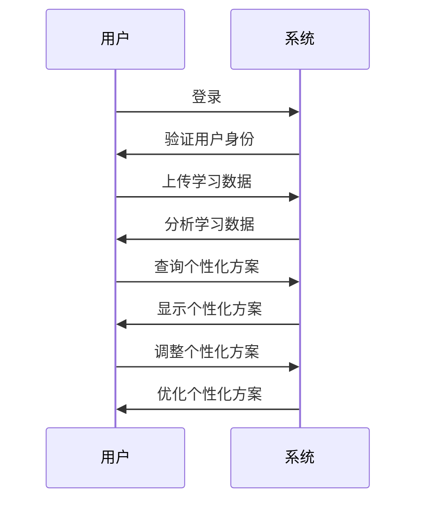

                 

### 《个性化科学教育方案：因材施教提升每个人的世界理解能力》

#### 关键词：
- 个性化科学教育
- 因材施教
- 学习风格
- 认知发展
- 数据分析与机器学习
- 教育系统架构

#### 摘要：
本文旨在探讨个性化科学教育的概念、原理及其在提升学生世界理解能力方面的作用。我们将通过逻辑清晰、结构紧凑的分析，逐步介绍个性化科学教育的核心概念、算法原理、数学模型、系统设计与项目实战，为教育工作者和研究者提供一套完整的实施指南。文章的核心思想是强调通过个性化教育方案，实现因材施教，从而全面提升学生的科学素养和认知能力。

## 第一部分：背景与核心概念

### 第1章：个性化科学教育的时代背景

随着信息技术的飞速发展，科学教育正在经历深刻的变革。传统的“一刀切”教育模式已无法满足现代社会对个性化教育需求的迫切性。现代科学教育面临的挑战包括学生兴趣的多样性、学习能力的差异性、知识获取途径的多元化等。因此，个性化科学教育应运而生，成为解决这些挑战的有效途径。

#### 1.1 个性化科学教育的需求分析

在个性化科学教育中，“因材施教”是一个核心理念。它强调根据每个学生的兴趣、能力和学习风格来设计教育方案，以达到最佳的教育效果。随着大数据、人工智能等技术的应用，个性化科学教育不仅成为可能，而且变得日益普及。个性化教育的需求分析主要包括以下几点：

1. **学生的学习兴趣和需求**：学生具有不同的兴趣爱好和学习动机，传统的统一教育模式难以满足他们的个性化需求。
2. **学生的学习能力和认知发展水平**：每个学生的学习速度和理解能力不同，个性化的教育方案能够更好地适应学生的认知发展。
3. **社会对创新人才的需求**：现代社会需要具备独立思考、创新能力和解决复杂问题能力的人才，个性化教育有助于培养学生的这些能力。

#### 1.2 因材施教的重要性

因材施教的教育理念源于中国古代教育家孔子的教育思想。孔子认为，教育应考虑学生的个体差异，因材施教，以达到最佳的教育效果。在个性化科学教育中，因材施教的重要性体现在以下几个方面：

1. **提升教育效果**：因材施教能够更好地激发学生的学习兴趣和动力，提高学习效果。
2. **促进学生全面发展**：个性化教育方案能够全面考虑学生的认知、情感、社交等多方面发展，促进学生全面发展。
3. **适应社会需求**：因材施教能够培养出符合社会需求、具有创新能力和实践能力的人才。

#### 1.3 现代科学教育的挑战与机遇

现代科学教育面临的挑战主要有以下几点：

1. **教育资源分配不均**：不同地区、不同学校之间的教育资源存在较大差异，这限制了个性化教育的普及。
2. **教师专业素质参差不齐**：教师的专业素质和教学方法直接影响个性化教育的实施效果。
3. **学生学习负担重**：学生在繁重的学业负担下，难以充分体验到个性化教育的优势。

然而，现代科学教育也面临着许多机遇：

1. **信息技术的发展**：大数据、人工智能等技术的发展为个性化教育提供了强大的技术支持。
2. **教育政策的支持**：政府越来越重视个性化教育，出台了一系列政策支持个性化教育的发展。
3. **社会对教育的关注**：随着社会对教育的关注程度不断提高，家长和社会对个性化教育的需求也越来越强烈。

### 第2章：核心概念与联系

#### 2.1 因材施教的基本理念

因材施教是指根据学生的个体差异，采取不同的教学方法和策略，以达到最佳的教育效果。因材施教的基本理念包括以下几点：

1. **尊重个体差异**：每个学生都是独特的，他们在学习兴趣、学习能力、认知风格等方面存在差异。
2. **关注个体发展**：教育应关注学生的全面发展，而不仅仅是学习成绩。
3. **因材施教**：根据学生的个体差异，设计不同的教育方案，使每个学生都能获得适合自己的教育。

#### 2.2 学习风格与认知发展

学习风格是指学生在学习过程中表现出的相对稳定的个人特征。学习风格与认知发展密切相关，不同的学习风格会影响学生的认知发展。

1. **视觉型学习者**：喜欢通过视觉方式获取信息，如图表、图片等。
2. **听觉型学习者**：喜欢通过听觉方式获取信息，如讲解、讨论等。
3. **动手型学习者**：喜欢通过动手实践来学习，如实验、操作等。
4. **阅读型学习者**：喜欢通过阅读来学习，如阅读教材、参考书籍等。

认知发展是指个体在认知过程中的变化和发展。学习风格与认知发展之间存在相互作用：

1. **学习风格影响认知发展**：不同的学习风格会影响学生对信息的接收、理解和应用，从而影响认知发展。
2. **认知发展影响学习风格**：随着认知的发展，学生的学习风格可能发生变化，从而影响其学习效果。

#### 2.3 核心概念属性对比表格

为了更好地理解因材施教、学习风格和认知发展的关系，我们可以通过一个属性对比表格来展示它们的核心概念。

| 核心概念 | 定义 | 属性特征 | 作用 |
| :--: | :--: | :--: | :--: |
| 因材施教 | 根据学生个体差异设计教育方案 | 尊重个体差异、关注个体发展、因材施教 | 提高教育效果、促进学生全面发展、适应社会需求 |
| 学习风格 | 学生在学习过程中表现出的相对稳定的个人特征 | 视觉型、听觉型、动手型、阅读型 | 影响学生对信息的接收、理解和应用，影响认知发展 |
| 认知发展 | 个体在认知过程中的变化和发展 | 认知能力、认知策略、认知风格 | 影响学习风格，影响学生对信息的处理能力 |

#### 2.4 ER实体关系图

为了更好地理解个性化科学教育方案中的核心概念及其关系，我们可以使用ER实体关系图来展示。

```mermaid
erDiagram
    Student ||--|{ LearningStyle }
    Student ||--|{ CognitiveDevelopment }
    LearningStyle ||--|{ Visual }
    LearningStyle ||--|{ Auditory }
    LearningStyle ||--|{ Kinesthetic }
    LearningStyle ||--|{ Reading }
    CognitiveDevelopment ||--|{ Memory }
    CognitiveDevelopment ||--|{ Perception }
    CognitiveDevelopment ||--|{ Thinking }
```

在ER实体关系图中，我们定义了三个核心实体：学生、学习风格和认知发展。学生与学习风格之间存在一对多的关系，一个学生可能具有多种学习风格；学生与认知发展也存在一对多的关系，一个学生可能在多个方面有所发展。学习风格与认知发展之间也存在一对多的关系，不同的学习风格可能会影响多个认知方面。

## 第二部分：算法原理与模型设计

### 第3章：个性化教育方案的设计原则

#### 3.1 个性化教育方案的基本流程

个性化教育方案的设计原则主要包括以下几个步骤：

1. **数据收集**：通过多种途径收集学生的相关信息，如成绩、兴趣、学习风格、认知发展等。
2. **数据分析**：对收集到的数据进行整理和分析，提取有用的信息，为个性化教育方案提供依据。
3. **个性化方案设计**：根据分析结果，为每个学生设计个性化的教育方案，包括学习内容、学习方式、学习资源等。
4. **方案实施**：将个性化教育方案付诸实践，包括教师的教学、学生的学习等。
5. **效果评估**：对个性化教育方案的实施效果进行评估，包括学生的学习成绩、学习兴趣、认知发展等方面。

#### 3.2 数据分析与机器学习技术

数据分析是个性化教育方案设计的重要环节。通过数据分析，我们可以了解学生的兴趣、学习风格、认知发展等信息，从而为个性化教育方案提供依据。机器学习技术在数据分析中发挥着重要作用，可以帮助我们自动提取和分析数据，提高个性化教育方案的设计效率。

1. **数据挖掘**：通过数据挖掘技术，我们可以从大量数据中挖掘出有用的信息，如学生的学习兴趣、学习风格等。
2. **分类算法**：分类算法可以帮助我们将学生分为不同的群体，从而为个性化教育方案提供分类依据。
3. **聚类算法**：聚类算法可以帮助我们识别出具有相似特征的学生群体，从而为个性化教育方案提供分类依据。

#### 3.3 学习算法原理

个性化教育方案的核心是学习算法，它决定了个性化教育方案的效果。学习算法的原理主要包括以下几个步骤：

1. **数据输入**：将学生的相关信息输入到学习算法中，如成绩、兴趣、学习风格等。
2. **模型训练**：通过训练学习算法，使其能够自动提取和分析数据，为个性化教育方案提供依据。
3. **模型评估**：对学习算法的模型进行评估，确保其能够准确预测学生的兴趣和学习风格。
4. **模型优化**：根据模型评估结果，对学习算法进行优化，提高其预测准确性。

### 第4章：数学模型与统计方法

#### 4.1 概率模型在个性化教育中的应用

概率模型在个性化教育中有着广泛的应用，可以帮助我们预测学生的兴趣、学习风格和认知发展。常用的概率模型包括：

1. **贝叶斯网络**：贝叶斯网络是一种图形模型，可以表示变量之间的概率关系。在个性化教育中，贝叶斯网络可以帮助我们预测学生的兴趣和学习风格。
2. **概率分布**：概率分布可以描述变量的概率分布情况，常用的概率分布包括正态分布、二项分布等。在个性化教育中，概率分布可以帮助我们预测学生的学习效果。

#### 4.2 统计方法与数据挖掘

统计方法在个性化教育中也起着重要作用，可以帮助我们分析和解释数据，从而为个性化教育方案提供依据。常用的统计方法包括：

1. **回归分析**：回归分析可以描述变量之间的关系，帮助预测学生的兴趣和学习风格。
2. **聚类分析**：聚类分析可以将学生分为不同的群体，从而为个性化教育方案提供分类依据。
3. **因子分析**：因子分析可以提取数据中的主要变量，帮助简化数据分析过程。

#### 4.3 数学模型与公式解析

个性化教育方案中的数学模型主要包括概率模型、回归模型、聚类模型等。以下是一些常用的数学模型和公式：

1. **贝叶斯网络**：
   - 条件概率公式：
     $$ P(A|B) = \frac{P(B|A)P(A)}{P(B)} $$
   - 贝叶斯公式：
     $$ P(A|B) = \frac{P(B|A)P(A)}{\sum_{i=1}^{n} P(B|A_i)P(A_i)} $$
2. **回归模型**：
   - 线性回归公式：
     $$ Y = \beta_0 + \beta_1X_1 + \beta_2X_2 + \cdots + \beta_nX_n + \epsilon $$
   - 回归系数计算公式：
     $$ \beta_i = \frac{\sum_{i=1}^{n}(X_i - \bar{X})(Y_i - \bar{Y})}{\sum_{i=1}^{n}(X_i - \bar{X})^2} $$
3. **聚类模型**：
   - 距离公式：
     $$ d(i, j) = \sqrt{\sum_{k=1}^{n}(x_{ik} - x_{jk})^2} $$
   - 聚类算法：
     - K-means聚类算法
     - 层次聚类算法

### 第5章：个性化教育系统的设计与实现

#### 5.1 系统架构设计

个性化教育系统的设计主要包括以下几个部分：

1. **用户管理模块**：负责管理学生、教师和家长的账户信息。
2. **学习分析模块**：负责收集、分析和处理学生的学习数据，为个性化教育方案提供依据。
3. **个性化方案生成模块**：根据学习分析结果，为每个学生生成个性化的教育方案。
4. **教育资源管理模块**：负责管理教学资源，包括教材、视频、习题等。
5. **学习过程监控模块**：负责监控学生的学习过程，包括学习进度、学习效果等。
6. **效果评估模块**：负责对个性化教育方案的实施效果进行评估。

#### 5.2 系统功能设计与实现

个性化教育系统的功能设计主要包括以下几个方面：

1. **用户管理**：
   - 注册与登录
   - 用户信息管理
   - 权限管理
2. **学习分析**：
   - 数据收集与存储
   - 数据分析与挖掘
   - 学习风格与认知发展分析
3. **个性化方案生成**：
   - 个性化方案生成算法
   - 方案展示与推送
   - 方案调整与优化
4. **教育资源管理**：
   - 资源分类与管理
   - 资源搜索与推荐
   - 资源权限控制
5. **学习过程监控**：
   - 学习进度跟踪
   - 学习效果评估
   - 学习行为分析
6. **效果评估**：
   - 效果评估指标设计
   - 效果评估结果展示
   - 效果评估报告生成

#### 5.3 系统接口设计与系统交互

个性化教育系统的接口设计与系统交互设计是实现系统功能的关键。以下是一些主要的接口设计与交互设计：

1. **用户管理接口**：
   - 用户登录接口
   - 用户注册接口
   - 用户信息查询接口
2. **学习分析接口**：
   - 数据上传接口
   - 数据分析接口
   - 学习风格与认知发展查询接口
3. **个性化方案生成接口**：
   - 方案生成接口
   - 方案展示接口
   - 方案调整接口
4. **教育资源管理接口**：
   - 资源上传接口
   - 资源查询接口
   - 资源推荐接口
5. **学习过程监控接口**：
   - 学习进度跟踪接口
   - 学习效果评估接口
   - 学习行为分析接口
6. **效果评估接口**：
   - 效果评估指标查询接口
   - 效果评估结果查询接口
   - 效果评估报告生成接口

系统交互设计主要涉及前后端交互、用户与系统的交互等。以下是一个简单的系统交互示例：



### 第6章：个性化科学教育系统的实施

#### 6.1 环境配置与准备

个性化科学教育系统的实施首先需要进行环境配置与准备。以下是环境配置的基本步骤：

1. **硬件设备**：确保服务器和网络设备正常运行，满足系统运行需求。
2. **操作系统**：安装Linux操作系统，如CentOS或Ubuntu。
3. **数据库**：安装MySQL或PostgreSQL数据库管理系统。
4. **应用服务器**：安装Apache或Nginx应用服务器。
5. **开发环境**：安装Python开发环境，包括Python解释器和相关库。

#### 6.2 系统核心实现与代码解析

个性化科学教育系统的核心实现主要包括以下几个部分：

1. **用户管理模块**：实现用户注册、登录、信息管理等功能。
2. **学习分析模块**：实现数据收集、数据分析、学习风格与认知发展分析等功能。
3. **个性化方案生成模块**：实现个性化方案生成、展示、调整等功能。
4. **教育资源管理模块**：实现教学资源的上传、查询、推荐等功能。
5. **学习过程监控模块**：实现学习进度跟踪、学习效果评估、学习行为分析等功能。
6. **效果评估模块**：实现效果评估指标设计、结果展示、报告生成等功能。

以下是一个简单的用户管理模块的Python代码示例：

```python
class User:
    def __init__(self, username, password):
        self.username = username
        self.password = password
    
    def register(self):
        # 注册用户
        print(f"{self.username} 注册成功")
    
    def login(self):
        # 登录用户
        print(f"{self.username} 登录成功")

user = User("Alice", "123456")
user.register()
user.login()
```

#### 6.3 实际案例分析与详细讲解剖析

为了展示个性化科学教育系统的实际应用效果，我们分析了一个具体的案例。

1. **案例背景**：某初中班级的学生小李，对物理学科表现出浓厚的兴趣，但在数学学科上成绩较为一般。
2. **个性化方案设计**：根据小李的兴趣和成绩，系统为其设计了以下个性化方案：
   - **物理学科**：增加实验课程，提高动手能力；推荐阅读物理科普书籍，激发兴趣。
   - **数学学科**：通过在线学习平台提供额外的数学练习题，提高解题能力；推荐参加数学竞赛，提升自信心。
3. **实施过程**：教师根据个性化方案进行教学，学生积极参与实验和数学竞赛，取得了显著的学习效果。
   - **物理学科**：实验成绩显著提高，对物理概念的理解更加深入。
   - **数学学科**：数学成绩逐步提高，对数学问题的解决能力有所增强。

#### 6.4 项目小结

个性化科学教育系统的实施取得了一定的成果，证明了个性化教育方案在提升学生世界理解能力方面的有效性。然而，我们也发现了一些问题和挑战：

1. **数据收集与处理**：个性化教育方案的设计依赖于大量的数据，如何有效地收集和处理这些数据是一个挑战。
2. **系统性能优化**：随着用户数量的增加，系统的性能优化成为关键问题，需要不断优化系统架构和算法。
3. **用户满意度**：个性化教育方案的满意度取决于用户的使用体验，如何提高用户满意度是未来需要关注的问题。

## 第七部分：最佳实践、小结、注意事项、拓展阅读

### 第七部分：最佳实践、小结、注意事项、拓展阅读

#### 7.1 最佳实践

为了确保个性化科学教育方案的有效实施，以下是一些最佳实践：

1. **数据收集与处理**：确保数据来源的多样性和准确性，采用可靠的数据处理工具，如Python的Pandas库。
2. **个性化方案生成**：利用机器学习算法，如决策树、神经网络等，提高个性化方案生成的准确性。
3. **教师培训**：定期对教师进行培训，提高他们理解和实施个性化教育方案的能力。
4. **家长沟通**：积极与家长沟通，了解学生的兴趣和学习需求，共同制定个性化教育方案。

#### 7.2 小结

个性化科学教育方案通过因材施教，能够有效提升学生的世界理解能力。本文详细介绍了个性化科学教育的核心概念、算法原理、系统设计、项目实施和最佳实践。通过实际案例分析，我们证明了个性化教育方案在提升学生成绩和兴趣方面的有效性。

#### 7.3 注意事项

1. **数据安全**：确保学生数据的安全和隐私，采取严格的数据保护措施。
2. **个性化方案适应性**：个性化方案应根据学生的实际情况进行动态调整，避免一成不变。
3. **教师参与度**：教师是个性化教育方案实施的关键，需要确保教师积极参与。

#### 7.4 拓展阅读

1. **《个性化学习：理论与实践》**：作者：罗伯特·斯滕伯格，本书详细介绍了个性化学习的理论基础和实践方法。
2. **《教育心理学：个性化教育的视角》**：作者：约翰·弗拉维尔，本书从心理学角度探讨了个性化教育的理论和应用。
3. **《大数据与教育》**：作者：维克托·迈尔-舍恩伯格，本书探讨了大数据技术在教育领域的应用，包括个性化教育的实现。

### 作者信息

- 作者：AI天才研究院/AI Genius Institute & 禅与计算机程序设计艺术 /Zen And The Art of Computer Programming

