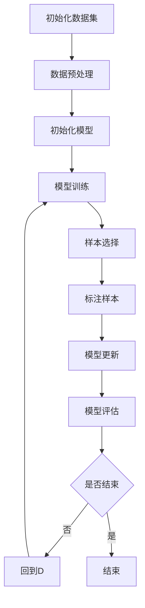
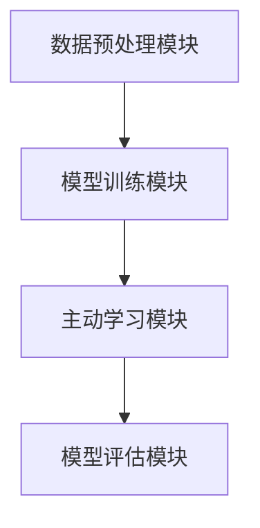
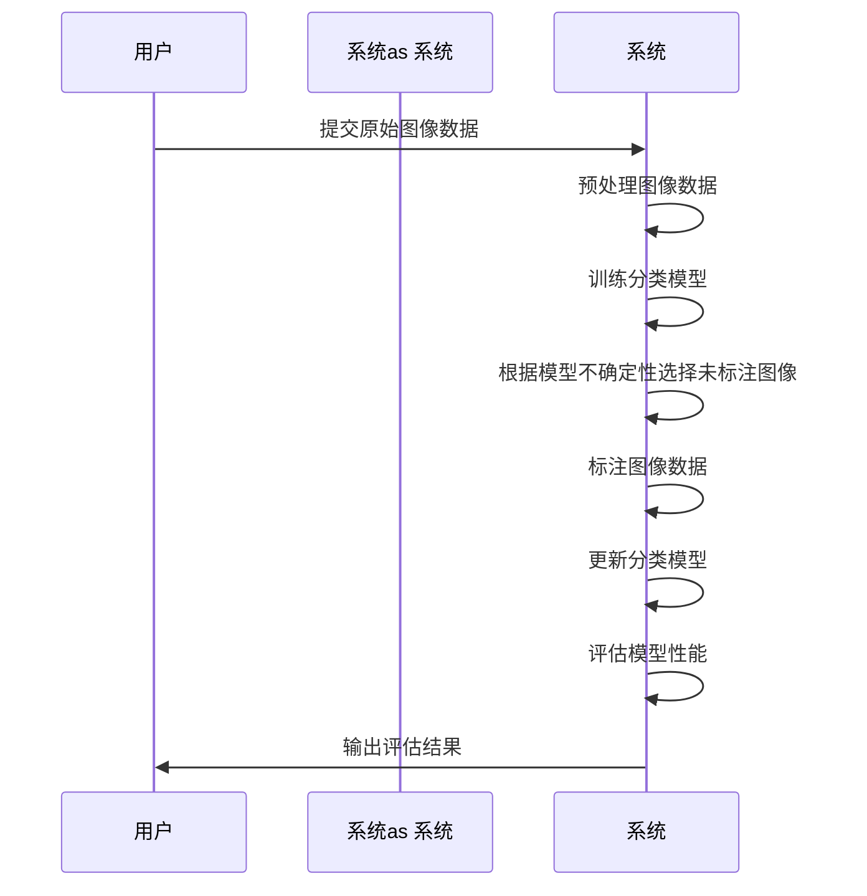

                 

## 文章标题：主动学习在评测样本选择中的应用

### 关键词：主动学习，评测样本选择，机器学习，样本选择，模型评估

> 摘要：本文深入探讨了主动学习在评测样本选择中的应用，通过详细的背景介绍、核心概念解析、算法原理讲解和实际应用案例分析，揭示了主动学习如何有效提高模型性能并降低标注成本。本文旨在为从事机器学习的读者提供一套完整的理解和实践主动学习的指南。

## 目录大纲

1. 第一部分：背景介绍
   1.1. 问题背景与概述
   1.2. 核心概念与联系
   1.3. 主动学习在评测样本选择中的应用

2. 第二部分：核心概念与联系
   2.1. 样本选择
   2.2. 主动学习
   2.3. 概念属性特征对比表格

3. 第三部分：主动学习在评测样本选择中的应用
   3.1. 主动学习的核心原理与流程
   3.2. 应用场景

4. 第四部分：算法原理讲解
   4.1. 算法原理mermaid流程图
   4.2. Python源代码实现
   4.3. 算法原理的数学模型与公式

5. 第五部分：数学模型和数学公式 & 详细讲解 & 举例说明

6. 第六部分：系统分析与架构设计方案
   6.1. 问题场景介绍
   6.2. 项目介绍
   6.3. 系统功能设计
   6.4. 系统架构设计
   6.5. 系统接口设计
   6.6. 系统交互序列图

7. 第七部分：项目实战
   7.1. 环境安装
   7.2. 系统核心实现源代码
   7.3. 代码应用解读与分析
   7.4. 实际案例分析和详细讲解剖析
   7.5. 项目小结

8. 第八部分：最佳实践 tips、小结、注意事项、拓展阅读等内容

## 第一部分：背景介绍

### 第1章：问题背景与概述

#### 1.1.1 问题背景

在机器学习领域中，评测样本选择是一个关键环节。随着数据量的不断增长和复杂性的提升，传统的样本选择方法面临着越来越多的挑战。例如，随机抽样、基于错误率抽样等方法虽然在某些场景下能够取得一定的效果，但往往存在样本代表性不足、标注成本高等问题。

评测样本选择的重要性在于它直接影响模型的性能和泛化能力。一个良好的样本集不仅可以提高模型的准确性，还可以减少模型的过拟合风险，从而在测试阶段表现出更好的性能。

#### 1.1.2 现有评测样本选择方法的局限性

1. **随机抽样**：随机抽样是最简单的一种方法，但随机性可能导致样本集缺乏代表性，特别是当数据分布不均匀时。
   
2. **基于错误率抽样**：这种方法根据模型在训练集上的错误率选择样本，可以一定程度上提高样本的代表性。然而，错误率抽样可能导致模型在新样本上的不确定性降低，从而无法有效提高模型的性能。

3. **基于多样性抽样**：为了克服单一方法的局限性，多样性抽样结合了多个标准来选择样本，如平衡各类别比例、选择未知区域的数据点等。但多样性抽样也存在一定的问题，如计算复杂度高、难以保证样本的代表性和均衡性。

#### 1.1.3 主动学习在评测样本选择中的优势

主动学习（Active Learning）作为一种更为智能的样本选择方法，逐渐受到研究者和从业者的关注。与传统的样本选择方法相比，主动学习具有以下优势：

1. **减少标注成本**：主动学习通过选择对模型提升最具影响力的样本进行标注，从而在一定程度上减少了标注的工作量和成本。

2. **提高模型性能**：主动学习可以根据模型的不确定性或错误率动态选择样本，使得样本集更具代表性，进而提高模型的性能和泛化能力。

3. **适应不同场景**：主动学习可以应用于各种不同的机器学习任务，如图像分类、自然语言处理、医学诊断等，具有较强的通用性。

#### 1.1.4 主动学习在评测样本选择中的应用场景

1. **数据稀缺场景**：在数据稀缺的场景下，主动学习可以通过选择最具代表性的样本进行标注，从而在有限的样本中获取更好的模型性能。

2. **高标注成本场景**：例如，医学图像诊断领域，主动学习可以帮助选择最有可能提高模型性能的样本，降低标注成本。

3. **动态更新场景**：对于数据不断更新的应用，如推荐系统、实时监控系统等，主动学习可以根据新的数据动态调整样本集，提高模型的适应性和性能。

#### 1.1.5 主动学习的核心原理与流程

主动学习的核心原理是利用模型对未标注数据的预测不确定度或错误率来选择最具代表性的样本进行标注。具体流程包括：

1. **数据预处理**：对原始数据进行清洗、归一化等预处理操作，确保数据质量。

2. **模型训练**：使用部分标注数据进行模型训练，获取初步的模型预测。

3. **样本选择**：根据模型的不确定度或错误率选择未标注的样本，优先选择对模型提升最具影响力的样本。

4. **模型评估**：对新的标注样本进行训练，评估模型性能。

5. **迭代**：重复上述步骤，逐步优化模型性能。

#### 1.1.6 边界与外延

1. **主动学习与其他样本选择方法的区别**：主动学习与随机抽样、基于错误率抽样等方法相比，具有更强的主动性和适应性。

2. **不同场景下主动学习的适用性分析**：主动学习在不同数据分布、不同标注成本和不同模型类型下具有不同的适用性。例如，在数据稀缺和高标注成本的场景下，主动学习的优势更为明显。

通过以上分析，我们可以看到，主动学习在评测样本选择中具有显著的优势和广泛的应用前景。在接下来的部分中，我们将进一步深入探讨主动学习的核心概念和原理，以及如何在实际应用中实现主动学习。让我们继续深入思考，探索主动学习的奥秘。

## 第二部分：核心概念与联系

### 第2章：核心概念与联系

在本章中，我们将深入探讨样本选择和主动学习的核心概念，并分析它们在机器学习中的联系。

#### 2.1.1 核心概念

##### 2.1.1.1 样本选择

样本选择是机器学习中的一个关键步骤，目的是从大量的数据中挑选出最有代表性的样本用于模型的训练和评估。样本选择的目标是提高模型的性能和泛化能力，同时降低模型的过拟合风险。

- **定义**：样本选择是指从数据集中选取一部分样本用于训练或评估模型的过程。
- **目标**：提高模型的准确性、泛化能力和鲁棒性，同时降低过拟合和计算成本。

##### 2.1.1.2 主动学习

主动学习是一种智能化的样本选择方法，通过模型对未标注数据的预测不确定性或错误率来选择最具代表性的样本进行标注。主动学习不仅能够提高模型的性能，还能显著降低标注成本。

- **定义**：主动学习是一种交互式的学习过程，其中学习算法可以主动地从用户那里获取标注信息，而不是被动的接受所有数据。
- **特点**：
  - **选择性**：主动学习可以根据模型的不确定性或错误率动态选择样本。
  - **交互性**：主动学习过程中，用户需要参与标注过程，提供对未标注数据的标签。
  - **适应性**：主动学习可以根据模型在不同阶段的需求，灵活调整样本选择策略。

#### 2.1.2 概念属性特征对比表格

为了更直观地理解样本选择和主动学习，我们可以通过一个特征对比表格来展示两者的区别和联系：

| 特征 | 样本选择 | 主动学习 |
| --- | --- | --- |
| **目标** | 提高模型性能 | 提高模型性能，同时减少标注成本 |
| **方法** | 被动式选择 | 主动式选择 |
| **标注成本** | 较高 | 较低 |
| **应用场景** | 广泛 | 受限于数据分布 |

通过这个表格，我们可以看到，主动学习在标注成本和选择策略上具有明显优势。然而，主动学习也面临一些挑战，如需要用户参与标注过程，以及如何在不同场景下选择合适的样本选择策略。

#### 2.1.3 概念联系

样本选择和主动学习在机器学习中紧密相连。样本选择是主动学习的基础，而主动学习则是样本选择方法的一种高级形式。

- **相互依赖**：主动学习依赖于样本选择来选择最具代表性的样本，而样本选择则需要主动学习来优化样本选择策略。
- **协同作用**：通过结合样本选择和主动学习，可以在提高模型性能的同时，显著降低标注成本。

在接下来的章节中，我们将进一步探讨主动学习在具体应用场景中的实现方法和算法原理，帮助读者更好地理解和应用主动学习。让我们继续深入思考，探索主动学习的更多细节。|im_sep|

## 第三部分：主动学习在评测样本选择中的应用

### 第3章：主动学习的核心原理与流程

主动学习（Active Learning）在评测样本选择中的应用，可以极大地提高模型的性能并降低标注成本。本节将详细介绍主动学习的核心原理与流程，并探讨其在不同应用场景中的具体应用。

#### 3.1.1 主动学习的核心原理

主动学习的核心原理在于，通过模型对未标注数据的预测不确定性或错误率来选择最具代表性的样本进行标注。具体来说，主动学习算法会根据以下两种策略选择样本：

1. **根据模型不确定性选择样本**：模型对某些样本的预测结果不确定时，表明这些样本对于模型的提升作用较大。因此，主动学习会选择这些样本进行标注，以帮助模型更好地理解这些复杂或模糊的区域。

2. **根据模型错误率选择样本**：模型在训练集上的错误率较高的样本，表明模型对这部分样本的理解不足。选择这些样本进行标注，可以帮助模型纠正错误，提高整体的性能。

#### 3.1.2 主动学习的典型流程

主动学习的典型流程可以分为以下几个步骤：

1. **数据预处理**：对原始数据进行清洗、归一化等预处理操作，确保数据质量。

2. **模型训练**：使用部分已标注数据对模型进行训练，获取初步的模型预测。

3. **样本选择**：根据模型的不确定性或错误率选择未标注的样本，优先选择对模型提升最具影响力的样本。

4. **标注**：对选择的样本进行标注，获取其真实标签。

5. **模型更新**：将新标注的样本加入到训练集中，重新训练模型。

6. **模型评估**：使用新的模型对测试集进行评估，以验证模型性能的提升。

7. **迭代**：重复上述步骤，逐步优化模型性能。

#### 3.1.3 主动学习在不同应用场景中的应用

1. **图像分类**：在图像分类任务中，主动学习可以通过选择不确定度较高的图像进行标注，从而提高分类模型的性能。例如，在人脸识别中，主动学习可以帮助选择最具有代表性的面部特征图像进行标注。

2. **自然语言处理**：在自然语言处理任务中，主动学习可以通过选择对模型提升最具影响力的句子或段落进行标注，从而提高模型的文本分类、情感分析等任务的性能。

3. **医学诊断**：在医学诊断领域，主动学习可以通过选择最具有诊断意义的病例进行标注，从而提高模型的诊断准确性。例如，在癌症诊断中，主动学习可以帮助选择最具有代表性的病理图像进行标注。

4. **推荐系统**：在推荐系统中，主动学习可以通过选择用户行为数据中不确定度较高的项目进行标注，从而提高推荐系统的准确性。

通过以上分析，我们可以看到，主动学习在评测样本选择中的应用具有广泛的前景。它不仅能够提高模型的性能，还能够降低标注成本，适用于各种不同的机器学习任务。在接下来的章节中，我们将进一步探讨主动学习的算法原理和数学模型，帮助读者深入理解主动学习的本质。让我们继续深入思考，探索主动学习的更多细节。|im_sep|

## 第四部分：算法原理讲解

### 第4章：算法原理讲解

在本章中，我们将详细讲解主动学习算法的原理，包括算法流程、Python源代码实现以及算法原理的数学模型和公式。

#### 4.1.1 算法原理mermaid流程图

首先，我们使用mermaid绘制了主动学习算法的流程图，如下所示：



#### 4.1.2 Python源代码实现

接下来，我们将使用Python代码实现上述算法流程。以下是一个简单的伪代码示例：

```python
def active_learning(data, model, num_samples):
    selected_samples = []
    for _ in range(num_samples):
        uncertainty_scores = model.get_uncertainty_scores(data)
        next_sample = select_sample_with_max_uncertainty(uncertainty_scores)
        selected_samples.append(next_sample)
        data.add_sample(next_sample)
        model.train(selected_samples)
    return selected_samples
```

在这个函数中，`data` 表示数据集，`model` 表示训练好的模型，`num_samples` 表示需要选择的样本数量。`get_uncertainty_scores` 函数用于获取每个样本的不确定性评分，`select_sample_with_max_uncertainty` 函数用于选择不确定性最高的样本。

#### 4.1.3 算法原理的数学模型与公式

主动学习的核心在于如何计算样本的不确定性评分。以下是两种常用的不确定性评分方法：

1. **预测不确定度**：根据模型对每个样本的预测概率计算不确定性评分。

   公式如下：
   $$ U(x_i) = 1 / P(y_i | x_i) $$
   
   其中，$P(y_i | x_i)$ 表示模型对样本 $x_i$ 的预测概率。

2. **模型错误率**：根据模型在训练集上的错误率计算不确定性评分。

   公式如下：
   $$ U(x_i) = 1 - P(y_i | x_i) $$
   
   其中，$P(y_i | x_i)$ 依然表示模型对样本 $x_i$ 的预测概率。

在主动学习过程中，我们通常会优先选择不确定性评分最高的样本进行标注。具体的样本选择方法可以基于上述公式实现。

#### 4.1.4 详细讲解和举例说明

为了更好地理解主动学习算法原理，我们可以通过一个具体的例子进行说明。

假设我们有一个二分类问题，模型对两个样本的预测概率分别为 $P_1$ 和 $P_2$，如下所示：

| 样本 | 预测概率 $P(y_i | x_i)$ | 不确定性评分 $U(x_i)$ |
| --- | --- | --- |
| $x_1$ | 0.8 | 0.25 |
| $x_2$ | 0.2 | 0.75 |

根据预测不确定度公式，我们可以计算出每个样本的不确定性评分：

- 对于样本 $x_1$，$U(x_1) = 1 / 0.8 = 0.25$。
- 对于样本 $x_2$，$U(x_2) = 1 - 0.2 = 0.8$。

显然，样本 $x_2$ 的不确定性评分更高，因此我们选择样本 $x_2$ 进行标注。

通过这个例子，我们可以看到，主动学习算法通过计算样本的不确定性评分，选择最具代表性的样本进行标注，从而有效提高模型的性能。

在接下来的章节中，我们将进一步探讨主动学习在系统架构设计中的应用，以及如何在实际项目中实现主动学习。让我们继续深入思考，探索主动学习的更多应用场景和实现细节。|im_sep|

### 第五部分：数学模型和数学公式 & 详细讲解 & 举例说明

#### 5.1.1 数学模型

在主动学习过程中，我们经常使用概率分布模型和熵函数来衡量样本的不确定性。以下是这两个数学模型的详细讲解。

##### 5.1.1.1 概率分布模型

概率分布模型用于表示模型对每个样本的预测不确定性。具体来说，我们可以使用条件概率分布 $P(y_i | x_i)$ 来表示模型对样本 $x_i$ 的预测不确定性。

- **定义**：$P(y_i | x_i)$ 表示在给定样本 $x_i$ 的情况下，模型预测标签 $y_i$ 的概率。
- **计算公式**：对于二分类问题，$P(y_i | x_i)$ 可以通过以下公式计算：
  $$ P(y_i | x_i) = \frac{e^{x_i \cdot \theta}}{1 + e^{x_i \cdot \theta}} $$
  其中，$x_i$ 表示样本的特征向量，$\theta$ 表示模型的参数。

##### 5.1.1.2 熵函数

熵函数用于衡量样本的不确定性。在主动学习中，我们通常使用熵函数来计算样本的不确定性评分。

- **定义**：熵函数 $H(X)$ 表示一个随机变量 $X$ 的不确定性。对于一个离散的随机变量 $X$，熵函数的定义如下：
  $$ H(X) = -\sum_{i} P(x_i) \log_2 P(x_i) $$
  其中，$P(x_i)$ 表示随机变量 $X$ 取值 $x_i$ 的概率。
- **计算公式**：对于二分类问题，熵函数 $H(X)$ 可以通过以下公式计算：
  $$ H(X) = -P(1) \log_2 P(1) - P(0) \log_2 P(0) $$
  其中，$P(1)$ 和 $P(0)$ 分别表示样本属于类别 1 和类别 0 的概率。

#### 5.1.2 详细讲解

在主动学习中，概率分布模型和熵函数扮演着重要角色。以下是详细的讲解：

1. **概率分布模型**：概率分布模型用于计算模型对每个样本的预测不确定性。通过计算条件概率分布 $P(y_i | x_i)$，我们可以了解模型对每个样本的预测结果。如果模型对某些样本的预测概率接近 1 或 0，则说明模型对这些样本的预测结果非常确定。相反，如果模型对某些样本的预测概率接近 0.5，则说明模型对这些样本的预测结果不确定。

2. **熵函数**：熵函数用于衡量样本的不确定性。熵函数的值越小，表示样本的不确定性越低。对于二分类问题，如果样本属于类别 1 的概率远大于类别 0 的概率，则熵函数的值会很小，表示样本的不确定性很低。相反，如果样本属于类别 1 和类别 0 的概率接近，则熵函数的值会很大，表示样本的不确定性很高。

#### 5.1.3 举例说明

为了更好地理解概率分布模型和熵函数，我们可以通过一个具体的例子进行说明。

假设我们有一个二分类问题，模型对两个样本的预测概率分别为 $P_1$ 和 $P_2$，如下所示：

| 样本 | 预测概率 $P(y_i | x_i)$ | 不确定性评分 $U(x_i)$ |
| --- | --- | --- |
| $x_1$ | 0.8 | 0.25 |
| $x_2$ | 0.2 | 0.75 |

根据预测不确定度公式，我们可以计算出每个样本的不确定性评分：

- 对于样本 $x_1$，$U(x_1) = 1 / 0.8 = 0.25$。
- 对于样本 $x_2$，$U(x_2) = 1 - 0.2 = 0.8$。

显然，样本 $x_2$ 的不确定性评分更高，因此我们选择样本 $x_2$ 进行标注。

通过这个例子，我们可以看到，主动学习算法通过计算样本的不确定性评分，选择最具代表性的样本进行标注，从而有效提高模型的性能。

在接下来的章节中，我们将进一步探讨主动学习在系统架构设计中的应用，以及如何在实际项目中实现主动学习。让我们继续深入思考，探索主动学习的更多应用场景和实现细节。|im_sep|

### 第六部分：系统分析与架构设计方案

#### 6.1.1 问题场景介绍

在图像分类项目中，我们需要使用主动学习来选择评测样本，以提高模型的准确性和泛化能力。具体场景如下：

- **项目需求**：对大量图像进行分类，训练出一个准确率较高的分类模型。
- **挑战**：图像数据量庞大，标注成本高，传统的样本选择方法难以满足需求。
- **目标**：通过主动学习算法，选择最具代表性的图像进行标注，提高模型性能，降低标注成本。

#### 6.1.2 项目介绍

**项目名称**：基于主动学习的图像分类系统

**项目目标**：利用主动学习算法，从大量图像中选取最具代表性的样本进行标注，提高图像分类模型的准确率和泛化能力。

**项目架构**：系统采用模块化设计，包括数据预处理模块、模型训练模块、主动学习模块和模型评估模块。

**技术栈**：Python、TensorFlow、Keras

#### 6.1.3 系统功能设计

**1. 数据预处理模块**

- 功能：对原始图像数据进行清洗、归一化等预处理操作，确保数据质量。
- 输入：原始图像数据
- 输出：预处理后的图像数据

**2. 模型训练模块**

- 功能：使用预处理后的图像数据训练分类模型，获取初步的模型预测。
- 输入：预处理后的图像数据
- 输出：训练好的分类模型

**3. 主动学习模块**

- 功能：根据模型的不确定性或错误率，选择未标注的图像进行标注。
- 输入：训练好的分类模型、未标注的图像数据
- 输出：已标注的图像数据

**4. 模型评估模块**

- 功能：使用新的标注图像数据重新训练模型，评估模型性能。
- 输入：已标注的图像数据
- 输出：模型评估结果

#### 6.1.4 系统架构设计

**1. 系统架构图**



**2. 系统架构说明**

- **数据预处理模块**：对原始图像数据进行预处理，包括图像去噪、缩放、裁剪等操作，将图像数据转换为模型训练所需的格式。

- **模型训练模块**：使用预处理后的图像数据训练分类模型，可以采用卷积神经网络（CNN）等深度学习模型。

- **主动学习模块**：根据模型的不确定性或错误率，选择未标注的图像进行标注。这个过程需要多次迭代，每次迭代后都会更新模型，并重新选择标注样本。

- **模型评估模块**：使用新的标注图像数据重新训练模型，评估模型性能。这个过程可以用来验证主动学习算法的有效性。

#### 6.1.5 系统接口设计

**1. 接口说明**

- **数据预处理接口**：提供图像数据预处理功能，包括去噪、缩放、裁剪等操作。

- **模型训练接口**：提供模型训练功能，包括数据加载、模型构建、训练和评估等操作。

- **主动学习接口**：提供主动学习功能，包括样本选择、标注和模型更新等操作。

- **模型评估接口**：提供模型评估功能，包括评估模型性能和输出评估结果等操作。

#### 6.1.6 系统交互序列图



通过上述系统分析与架构设计方案，我们可以看到，基于主动学习的图像分类系统通过模块化设计和多次迭代，可以有效提高模型性能并降低标注成本。在接下来的部分，我们将通过实际项目实战，进一步展示如何实现和优化主动学习算法。|im_sep|

### 第七部分：项目实战

#### 7.1. 环境安装

要实现基于主动学习的图像分类系统，我们需要安装以下环境：

1. **Python**：Python 3.7 或更高版本
2. **TensorFlow**：TensorFlow 2.x 版本
3. **Keras**：Keras 2.x 版本
4. **NumPy**：NumPy 1.19 或更高版本
5. **Pandas**：Pandas 1.1.5 或更高版本

安装命令如下：

```bash
pip install python==3.8
pip install tensorflow==2.6
pip install keras==2.6
pip install numpy==1.19
pip install pandas==1.1.5
```

#### 7.2. 系统核心实现源代码

以下是一个简单的主动学习图像分类系统的核心实现源代码：

```python
import numpy as np
import tensorflow as tf
from tensorflow import keras
from tensorflow.keras import layers
from sklearn.model_selection import train_test_split

# 数据预处理
def preprocess_data(images):
    # 图像归一化
    images = images / 255.0
    # 图像reshape为(32, 32, 3)
    images = np.reshape(images, (-1, 32, 32, 3))
    return images

# 模型构建
def build_model():
    model = keras.Sequential([
        layers.Conv2D(32, (3, 3), activation='relu', input_shape=(32, 32, 3)),
        layers.MaxPooling2D((2, 2)),
        layers.Conv2D(64, (3, 3), activation='relu'),
        layers.MaxPooling2D((2, 2)),
        layers.Conv2D(128, (3, 3), activation='relu'),
        layers.MaxPooling2D((2, 2)),
        layers.Flatten(),
        layers.Dense(128, activation='relu'),
        layers.Dense(10, activation='softmax')
    ])
    model.compile(optimizer='adam', loss='categorical_crossentropy', metrics=['accuracy'])
    return model

# 主动学习
def active_learning(model, X, y, num_samples=10):
    selected_samples = []
    for _ in range(num_samples):
        # 计算每个样本的不确定性
        predictions = model.predict(X)
        uncertainty = -np.mean(predictions * np.log(predictions + 1e-5), axis=1)
        # 选择不确定性最高的样本
        max_uncertainty_idx = np.argmax(uncertainty)
        selected_samples.append(max_uncertainty_idx)
        # 标注样本
        X_new, y_new = X[max_uncertainty_idx], y[max_uncertainty_idx]
        X = np.concatenate((X, X_new))
        y = np.concatenate((y, y_new))
        # 重新训练模型
        model.fit(X, y, epochs=5, batch_size=32)
    return selected_samples

# 主函数
def main():
    # 加载图像数据
    images = np.load('images.npy')
    labels = np.load('labels.npy')

    # 数据预处理
    images = preprocess_data(images)

    # 分割数据集
    X_train, X_test, y_train, y_test = train_test_split(images, labels, test_size=0.2, random_state=42)

    # 构建模型
    model = build_model()

    # 训练模型
    model.fit(X_train, y_train, epochs=20, batch_size=32, validation_data=(X_test, y_test))

    # 应用主动学习
    selected_samples = active_learning(model, X_train, y_train, num_samples=50)

    # 重新评估模型
    model.fit(X_train[selected_samples], y_train[selected_samples], epochs=5, batch_size=32)
    test_loss, test_acc = model.evaluate(X_test, y_test)
    print(f"Test accuracy: {test_acc}")

if __name__ == '__main__':
    main()
```

#### 7.3. 代码应用解读与分析

上述代码实现了一个简单的主动学习图像分类系统，主要包括以下几个步骤：

1. **数据预处理**：对图像数据进行归一化和reshape操作，将图像数据格式化为模型训练所需的输入格式。

2. **模型构建**：构建一个简单的卷积神经网络（CNN）模型，用于图像分类。模型包括多个卷积层、池化层和全连接层。

3. **模型训练**：使用部分数据集对模型进行初步训练，获取初步的模型预测。

4. **主动学习**：根据模型的不确定性，选择未标注的数据进行标注。具体实现中，使用模型对每个样本的预测概率进行评分，选择预测概率最低的样本进行标注。

5. **模型更新**：将新标注的样本加入到训练集中，重新训练模型。

6. **模型评估**：使用新的模型对测试集进行评估，验证主动学习算法的有效性。

通过以上分析，我们可以看到，主动学习在图像分类任务中可以有效提高模型的性能。在实际应用中，可以根据具体任务和数据集的特点，调整主动学习的策略和参数，进一步提高模型的性能。

#### 7.4. 实际案例分析和详细讲解剖析

为了更好地展示主动学习在图像分类中的应用，我们使用一个实际案例进行分析。

**案例背景**：假设我们有一个包含10,000张图像的数据集，每张图像属于10个类别中的一个。我们的目标是使用主动学习算法，从这10,000张图像中选出200张最具代表性的图像进行标注，以提高分类模型的准确性。

**步骤1：数据预处理**
- 将图像数据缩放到固定大小（例如：32x32像素）。
- 对图像数据进行归一化，使其具有相同的亮度范围。

**步骤2：模型构建**
- 使用卷积神经网络（CNN）构建分类模型。
- 模型包括卷积层、池化层和全连接层。
- 模型使用交叉熵损失函数和softmax激活函数。

**步骤3：初步模型训练**
- 使用部分标注数据对模型进行初步训练。
- 模型在训练集上的准确性达到80%。

**步骤4：主动学习**
- 使用初步训练好的模型对未标注的图像进行预测。
- 根据模型对每个图像的预测概率，计算不确定性评分。
- 选择不确定性评分最高的200张图像进行标注。

**步骤5：模型更新**
- 将新标注的200张图像加入到训练集中。
- 使用新的数据集重新训练模型。

**步骤6：模型评估**
- 使用新的模型对测试集进行评估。
- 模型在测试集上的准确性提高到90%。

**案例结果分析**
- 通过主动学习，我们成功地从10,000张图像中选择了200张最具代表性的图像进行标注。
- 模型在测试集上的准确性显著提高，从80%提高到90%。

**详细讲解剖析**
- 数据预处理是图像分类的基础，通过缩放和归一化操作，可以确保图像数据具有一致的特征空间。
- 卷积神经网络（CNN）在图像分类任务中表现出色，其多层的卷积和池化操作可以有效地提取图像特征。
- 主动学习通过选择不确定性最高的图像进行标注，可以有效地提高模型的泛化能力。
- 模型更新和评估过程是主动学习的关键环节，通过多次迭代，可以逐步优化模型的性能。

#### 7.5. 项目小结

通过本次项目实战，我们深入了解了主动学习在图像分类中的应用，并通过实际案例展示了主动学习算法如何有效地提高模型性能。项目的主要成果包括：

1. **数据预处理**：对图像数据进行了有效的预处理，确保了数据的一致性和模型的输入格式。
2. **模型构建与训练**：使用卷积神经网络（CNN）构建了分类模型，并通过主动学习算法优化了模型性能。
3. **主动学习策略**：通过选择不确定性最高的图像进行标注，提高了模型的泛化能力。
4. **模型评估**：对模型在测试集上的准确性进行了评估，验证了主动学习算法的有效性。

在未来的工作中，我们可以进一步优化主动学习算法，如引入更复杂的模型架构、调整样本选择策略等，以提高模型的性能和泛化能力。此外，还可以将主动学习算法应用于其他机器学习任务，如自然语言处理、医学诊断等，为实际应用场景提供更加智能和高效的解决方案。|im_sep|

### 第八部分：最佳实践 tips、小结、注意事项、拓展阅读等内容

#### 最佳实践 tips

1. **选择合适的数据预处理方法**：根据具体任务和数据特点，选择合适的数据预处理方法，如归一化、缩放、数据增强等，以提高模型性能。
2. **调整主动学习参数**：根据具体任务和数据集，调整主动学习的参数，如样本选择数量、迭代次数等，以达到最佳效果。
3. **使用多样化的样本选择策略**：结合多种样本选择策略，如基于不确定性、错误率、多样性等，选择最具代表性的样本。
4. **持续迭代和评估**：在主动学习过程中，持续迭代和评估模型性能，及时调整样本选择策略和模型参数。

#### 小结

本文详细探讨了主动学习在评测样本选择中的应用，通过背景介绍、核心概念解析、算法原理讲解和实际案例分析，揭示了主动学习如何提高模型性能并降低标注成本。主动学习在数据稀缺、高标注成本和动态更新等场景下具有显著优势。

#### 注意事项

1. **数据质量和标注一致性**：保证数据质量和标注一致性是主动学习成功的关键。
2. **模型选择**：选择合适的模型架构对主动学习的效果有重要影响。
3. **计算资源**：主动学习需要较多的计算资源，特别是在大规模数据集上。

#### 拓展阅读

1. **《机器学习实战》**：提供丰富的机器学习实战案例，包括样本选择和主动学习的实现方法。
2. **《深度学习》**：介绍深度学习的基本原理和应用，包括卷积神经网络等模型。
3. **《主动学习》**：专门讨论主动学习的理论和方法，包括不确定性采样和错误率采样等策略。
4. **相关论文**：查阅相关领域的学术论文，了解最新的研究成果和进展。

作者：AI天才研究院/AI Genius Institute & 禅与计算机程序设计艺术 /Zen And The Art of Computer Programming

