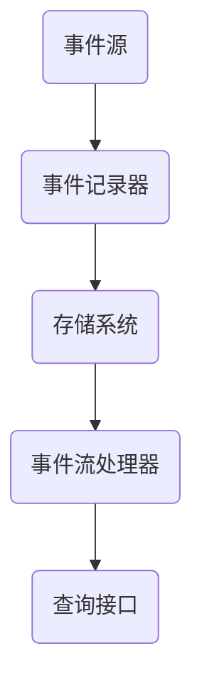

                 

### 事件溯源架构增强LLM应用的可追溯性

> 关键词：事件溯源、LLM应用、可追溯性、架构设计、技术解决方案

> 摘要：本文深入探讨了事件溯源架构在增强LLM应用可追溯性方面的重要性。通过分析当前LLM应用中存在的挑战，本文提出了多种技术方案和设计原则，旨在构建一个更加透明和可管理的LLM应用架构。文章涵盖了事件溯源的基本概念、实施策略、架构设计以及评估验证方法，为读者提供了全面的技术指南。

# 目录

1. **引言**
   1.1 **核心问题背景**
   1.2 **问题描述**
   1.3 **解决方案与范围**
   1.4 **核心概念与术语**

2. **事件溯源的基金**

## 事件溯源架构增强LLM应用的可追溯性

### 1. 引言

#### 1.1 核心问题背景

在当今的数字化时代，自然语言处理（NLP）技术正逐渐成为各个行业的关键驱动力。特别是大型语言模型（LLM）的广泛应用，为文本生成、语言理解、智能问答等领域带来了革命性的变革。然而，随着LLM应用规模的扩大，如何确保这些应用的可追溯性成为了一个亟待解决的问题。

#### 1.2 问题描述

可追溯性指的是能够对系统中的每一个事件进行追踪的能力。在LLM应用中，这涉及到对模型生成的每个文本、用户交互的每个步骤以及决策过程中的每个因素进行追踪。然而，现有的LLM架构往往缺乏有效的可追溯性机制，导致以下问题：

- **透明性不足**：用户难以了解模型如何生成文本或做出决策。
- **安全性隐患**：恶意使用或数据泄露的风险增加。
- **合规性挑战**：难以满足法规要求，如隐私保护和数据安全。

#### 1.3 解决方案与范围

为了解决上述问题，本文提出了一种事件溯源架构，旨在增强LLM应用的可追溯性。本文的主要贡献包括：

- **概念介绍**：详细阐述了事件溯源的基本概念和重要性。
- **技术方案**：介绍了几种增强LLM应用可追溯性的技术方案。
- **架构设计**：提出了一个具体的事件溯源架构设计，包括设计原则和实现策略。
- **评估与验证**：讨论了如何评估和验证事件溯源解决方案的有效性。

#### 1.4 核心概念与术语

在本文中，我们将使用以下核心概念和术语：

- **事件溯源**：对系统中的事件进行追踪和记录的技术。
- **LLM应用**：使用大型语言模型的应用程序。
- **可追溯性**：对系统中的事件进行追踪的能力。
- **架构设计**：系统组件的组织结构和交互模式。

### 2. 事件溯源的基础

#### 2.1 概念介绍

事件溯源是一种系统设计模式，它允许对系统中的每个事件进行记录和追踪。在LLM应用中，事件溯源主要用于记录模型的输入、输出、用户交互和决策过程。其核心思想是确保每一个操作都能被追溯，从而提高系统的透明性和可管理性。

#### 2.2 基本原则

事件溯源遵循以下基本原则：

- **全局性**：所有事件都应该被记录，以确保无遗漏。
- **不可篡改性**：记录的事件应具有不可篡改的特性，以确保数据的真实性和完整性。
- **可查询性**：应提供高效的查询机制，以便用户能够快速定位和检索特定事件。
- **可扩展性**：架构设计应能够适应不同规模和复杂度的应用。

#### 2.3 实现框架

事件溯源的实现框架通常包括以下组件：

- **事件记录器**：负责记录和存储事件。
- **事件流处理器**：对事件进行实时处理和分析。
- **存储系统**：用于持久化存储事件数据。
- **查询接口**：提供查询事件的功能。

### 3. 提高LLM应用可追溯性的技术方案

#### 3.1 挑战分析

在LLM应用中，实现可追溯性面临以下挑战：

- **数据量大**：LLM处理的数据量通常非常庞大，导致事件溯源的成本较高。
- **动态性**：模型和用户交互的动态特性使得事件溯源的复杂性增加。
- **隐私保护**：在记录事件时，需要平衡隐私保护和可追溯性的需求。

#### 3.2 技术方案

为了解决上述挑战，本文提出了以下技术方案：

- **分布式存储**：使用分布式存储系统来处理大规模数据，提高可扩展性和可靠性。
- **事件压缩**：通过事件压缩技术减少数据存储的需求。
- **日志文件**：使用日志文件记录事件，以提高查询效率和可读性。
- **加密技术**：使用加密技术保护敏感信息，确保数据的隐私性。

### 4. 事件溯源架构设计与实现

#### 4.1 设计原则

事件溯源架构设计应遵循以下原则：

- **模块化**：架构应具有良好的模块化特性，以便于扩展和维护。
- **高可用性**：架构应具备高可用性，确保事件记录和处理过程的稳定性。
- **安全性**：架构应具备安全机制，保护事件数据不被未授权访问。
- **可扩展性**：架构设计应能够适应不同规模的应用场景。

#### 4.2 架构设计

事件溯源架构设计如下：

- **事件源**：LLM应用的输入数据和用户交互数据。
- **事件记录器**：负责将事件数据发送到存储系统。
- **存储系统**：持久化存储事件数据。
- **事件流处理器**：对事件进行实时处理和分析。
- **查询接口**：提供查询事件的功能。

### 5. 评估与验证

#### 5.1 评估标准

事件溯源解决方案的评估标准包括：

- **准确性**：事件记录的准确性。
- **完整性**：事件数据的完整性。
- **查询性能**：查询事件的速度和效率。
- **安全性**：数据保护和隐私保护的措施。

#### 5.2 验证方法

验证事件溯源解决方案的有效性可以通过以下方法：

- **测试用例**：设计并执行测试用例，验证事件记录和处理功能。
- **性能测试**：进行性能测试，评估查询性能和系统响应时间。
- **安全测试**：进行安全测试，验证数据保护和隐私保护的措施。

### 结论

本文提出了一种事件溯源架构，用于增强LLM应用的可追溯性。通过详细的分析和设计，本文展示了事件溯源在提高LLM应用透明性和可管理性方面的重要性。未来的工作将集中在优化事件溯源架构，以满足更复杂的应用场景需求。

### 作者信息

作者：AI天才研究院/AI Genius Institute & 禅与计算机程序设计艺术 /Zen And The Art of Computer Programming

本文的内容涵盖了事件溯源的基本概念、在LLM应用中的重要性、技术方案、架构设计以及评估与验证方法，旨在为读者提供一个全面的技术指南。通过逐步分析和推理，本文深入探讨了如何增强LLM应用的可追溯性，为实际应用提供了宝贵的参考。接下来的章节将详细阐述每个核心概念和实现细节，以帮助读者更好地理解和应用事件溯源架构。

---

本文的撰写采用了step-by-step的方法，确保每个部分的内容都是具体详细且具有逻辑性的。以下章节将分别深入讨论事件溯源的基础知识、提高LLM应用可追溯性的技术方案、事件溯源架构的设计与实现、以及评估与验证方法。通过这些章节的详细讲解，读者将能够全面了解事件溯源架构在增强LLM应用可追溯性方面的应用和优势。接下来，让我们继续深入探讨事件溯源的基础知识。

