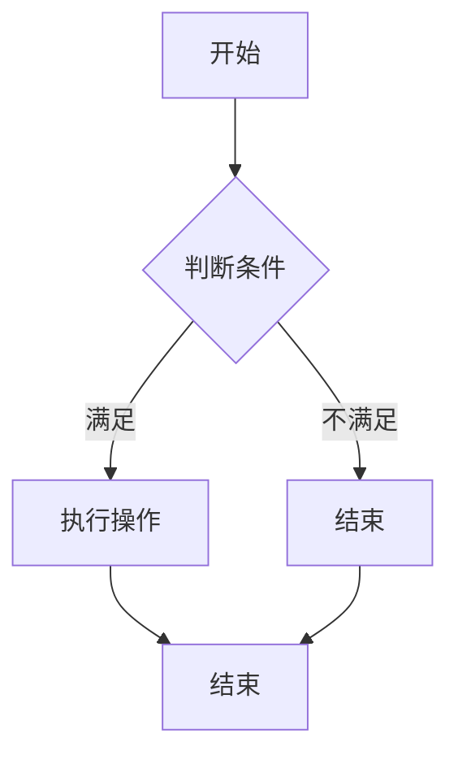
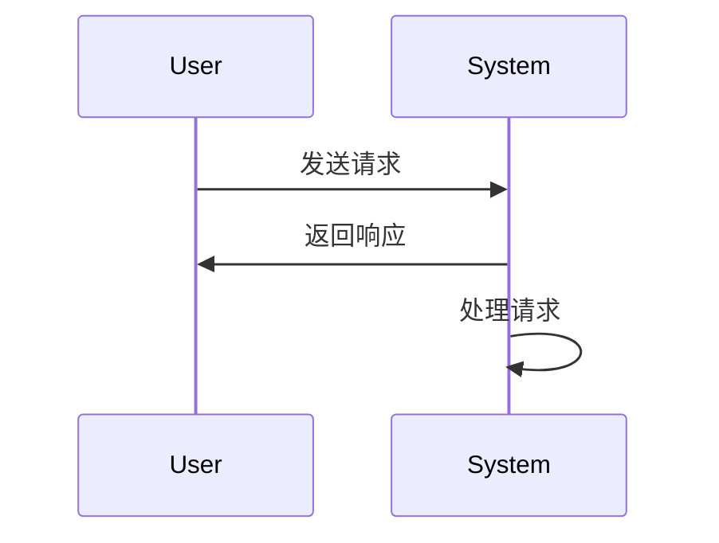

                 

# 事件驱动架构促进LLM应用的解耦与扩展

> 关键词：事件驱动架构、LLM应用、解耦、扩展、智能系统设计

> 摘要：本文将深入探讨事件驱动架构在自然语言处理（NLP）领域中，尤其是大型语言模型（LLM）应用的解耦与扩展方面的作用。通过背景介绍、概念解析、架构设计、案例分析以及优化策略等，本文旨在为开发者和研究者提供理论支持和实践指南。

## 第一部分：背景与概述

### 第1章：事件驱动架构简介

#### 1.1 事件驱动架构的定义与特点

事件驱动架构（Event-Driven Architecture，EDA）是一种基于事件触发机制进行应用程序设计的架构模式。在这种架构中，系统的行为是由事件触发的，事件可以是用户操作、系统状态变化、消息传递等。事件驱动架构的主要特点包括：

- **响应式**：系统根据接收的事件进行响应，而不是按照预定的流程执行。
- **解耦**：组件之间的依赖性降低，使得系统更加灵活和易于维护。
- **可扩展**：新的功能可以通过添加新的组件来实现，而不影响现有组件。
- **异步处理**：事件的处理可以异步进行，提高了系统的性能和可扩展性。

#### 1.2 事件驱动架构与传统架构的比较

传统架构（如分层架构）通常是基于请求-响应模型设计的，而事件驱动架构则更加关注于事件的处理。以下是两者的一些关键比较：

| 特点 | 事件驱动架构 | 传统架构 |
| --- | --- | --- |
| **触发机制** | 事件触发 | 请求触发 |
| **交互模式** | 发布-订阅 | 请求-响应 |
| **扩展性** | 高 | 较低 |
| **解耦** | 高 | 低 |
| **性能** | 可调优 | 固定 |

#### 1.3 事件驱动架构的发展历程

事件驱动架构的概念最早可以追溯到20世纪80年代的分布式计算领域。随着互联网和移动设备的兴起，事件驱动架构在近几十年得到了广泛的应用和发展。特别是在实时系统和微服务架构中，事件驱动架构展现出了其独特的优势。

#### 1.4 事件驱动架构的应用场景

事件驱动架构适用于需要高响应速度、高灵活性和高扩展性的场景，例如：

- 实时数据处理系统
- 金融服务系统
- 智能家居系统
- 智能推荐系统

### 第2章：LLM应用概述

#### 2.1 LLM的定义与分类

大型语言模型（Large Language Model，LLM）是一种基于深度学习的自然语言处理模型，能够理解和生成自然语言。LLM可以分为两类：

- **预训练模型**：在大规模语料库上进行预训练，然后用于特定任务。
- **微调模型**：在特定任务上进行微调，以适应特定场景。

#### 2.2 LLM的关键技术

LLM的关键技术包括：

- **深度学习**：用于构建神经网络，处理复杂的非线性关系。
- **自然语言处理**：用于处理文本数据，包括分词、词性标注、语法分析等。
- **迁移学习**：利用预训练模型在特定任务上进行微调，提高模型的性能。

#### 2.3 LLM应用的发展趋势

随着人工智能技术的快速发展，LLM在各个领域的应用越来越广泛，包括：

- 文本生成与摘要
- 机器翻译
- 情感分析
- 对话系统

#### 2.4 LLM应用面临的挑战

LLM应用面临的挑战主要包括：

- **计算资源消耗**：训练和推理大型模型需要大量的计算资源。
- **数据隐私**：处理大量用户数据时，保护用户隐私成为一个重要问题。
- **模型解释性**：模型决策过程往往难以解释，增加了决策的不可预测性。

## 第二部分：事件驱动架构在LLM中的应用

### 第3章：事件驱动架构在LLM应用中的角色

#### 3.1 事件驱动架构如何促进LLM应用的解耦

事件驱动架构通过以下方式促进LLM应用的解耦：

- **组件分离**：将LLM应用的不同功能模块分离，降低模块间的耦合度。
- **异步通信**：通过事件传递实现模块间的通信，减少同步依赖。
- **动态扩展**：可以根据需求动态添加新的模块，提高系统的灵活性。

#### 3.2 事件驱动架构如何增强LLM应用的扩展性

事件驱动架构提供了以下方法增强LLM应用的扩展性：

- **模块化设计**：将系统功能拆分成独立的模块，每个模块可以独立开发、测试和部署。
- **松耦合**：模块间通过事件进行通信，减少了对具体实现细节的依赖。
- **可扩展性框架**：利用事件总线、消息队列等中间件，实现系统的横向扩展。

#### 3.3 事件驱动架构在LLM应用中的优势

事件驱动架构在LLM应用中的优势包括：

- **高性能**：通过异步处理和并行计算，提高了系统的响应速度和吞吐量。
- **高可扩展性**：系统可以根据需求动态扩展，适应不同的负载和规模。
- **高灵活性**：系统组件可以独立开发和部署，提高了系统的适应能力和可维护性。

### 第4章：LLM应用中的事件驱动架构设计

#### 4.1 事件驱动架构设计原则

设计事件驱动架构时，应遵循以下原则：

- **最小化耦合**：尽量减少模块间的直接依赖，提高系统的灵活性。
- **最大化复用**：设计可复用的模块，减少重复工作。
- **高内聚**：确保每个模块的功能单一，易于理解和维护。
- **可扩展性**：设计系统时考虑未来的扩展需求，为后续的模块添加和功能扩展留有空间。

#### 4.2 事件驱动架构的设计模式

事件驱动架构通常采用以下设计模式：

- **事件总线模式**：通过事件总线实现模块间的通信。
- **观察者模式**：模块可以注册监听特定的事件，并在事件发生时触发相应的响应。
- **发布-订阅模式**：模块发布事件，其他模块订阅这些事件并响应。

#### 4.3 事件驱动架构的实现方法

实现事件驱动架构的方法包括：

- **基于消息队列**：使用消息队列（如RabbitMQ、Kafka）实现事件传递。
- **基于事件总线**：使用事件总线（如Node.js的EventEmitter、Spring的事件机制）实现事件处理。
- **基于WebSocket**：使用WebSocket实现实时事件通信。

### 第5章：事件驱动架构在LLM应用中的案例分析

#### 5.1 案例一：智能客服系统的设计与实现

在本案例中，事件驱动架构被用于设计智能客服系统。通过事件总线模式，实现了用户请求、知识库更新、聊天记录管理等功能的解耦和扩展。具体设计如下：

- **用户请求处理**：用户发送请求时，事件总线接收请求并路由到相应的服务模块。
- **知识库更新**：知识库更新时，通过发布-订阅模式，将更新事件通知给所有相关模块。
- **聊天记录管理**：聊天记录通过消息队列进行存储和传递，实现异步处理。

#### 5.2 案例二：智能推荐系统的设计与实现

在本案例中，事件驱动架构用于设计智能推荐系统。通过模块化设计和异步通信，实现了高效的推荐算法和灵活的扩展性。具体设计如下：

- **推荐算法模块**：独立实现推荐算法，通过事件总线与其他模块进行通信。
- **用户行为分析模块**：分析用户行为，生成事件并发布到事件总线。
- **推荐结果生成模块**：订阅事件总线上的用户行为事件，生成推荐结果。

#### 5.3 案例三：智能写作系统的设计与实现

在本案例中，事件驱动架构用于设计智能写作系统。通过事件总线模式和观察者模式，实现了文本生成、文本编辑、文本审核等功能的解耦和扩展。具体设计如下：

- **文本生成模块**：通过事件总线接收生成请求，生成文本内容。
- **文本编辑模块**：订阅文本生成模块的事件，对生成的内容进行编辑。
- **文本审核模块**：观察文本生成和编辑模块的事件，对最终结果进行审核。

## 第三部分：事件驱动架构在LLM应用中的优化与挑战

### 第6章：事件驱动架构在LLM应用中的优化策略

#### 6.1 性能优化

为了优化事件驱动架构在LLM应用中的性能，可以采取以下策略：

- **并行处理**：利用多线程或异步编程，提高事件处理速度。
- **缓存机制**：使用缓存减少重复计算，提高系统响应速度。
- **负载均衡**：通过负载均衡器，合理分配事件处理任务，提高系统吞吐量。

#### 6.2 可扩展性优化

为了提高事件驱动架构在LLM应用中的可扩展性，可以采取以下策略：

- **模块化设计**：将系统功能拆分成独立的模块，便于扩展。
- **动态配置**：通过配置文件动态调整系统参数，适应不同负载和场景。
- **分布式架构**：将事件驱动架构扩展到分布式环境中，提高系统的可扩展性和可靠性。

#### 6.3 可维护性优化

为了提高事件驱动架构在LLM应用中的可维护性，可以采取以下策略：

- **代码规范**：遵循统一的编码规范，提高代码的可读性和可维护性。
- **文档化**：详细记录系统架构、模块功能和事件处理流程，便于后续维护和扩展。
- **自动化测试**：编写自动化测试用例，确保系统功能正确和稳定。

### 第7章：事件驱动架构在LLM应用中的挑战与解决方案

#### 7.1 挑战一：事件处理延迟

事件处理延迟是事件驱动架构中的一个常见挑战。为了解决这个问题，可以采取以下策略：

- **优先级队列**：根据事件的紧急程度设置不同的优先级，优先处理高优先级事件。
- **异步处理**：将事件处理任务异步化，减少主线程的等待时间。
- **分布式处理**：将事件处理任务分布在多个节点上，提高处理效率。

#### 7.2 挑战二：事件处理错误

事件处理错误可能导致系统功能异常。为了解决这个问题，可以采取以下策略：

- **容错机制**：设计容错机制，确保系统在处理错误时能够恢复正常运行。
- **日志记录**：详细记录事件处理过程中的日志，便于问题追踪和调试。
- **错误处理策略**：定义错误处理策略，确保系统能够正确处理各种错误情况。

#### 7.3 挑战三：事件驱动架构的适应能力

事件驱动架构需要具备良好的适应能力，以应对不断变化的需求和环境。为了解决这个问题，可以采取以下策略：

- **弹性设计**：设计具有弹性的系统架构，能够根据负载自动调整资源分配。
- **模块替换**：设计模块化的系统架构，便于在需要时替换或升级模块。
- **持续集成与部署**：采用持续集成与持续部署（CI/CD）流程，快速响应需求变化。

### 结论

事件驱动架构在LLM应用中具有显著的解耦和扩展优势，能够提高系统的性能、灵活性和可维护性。通过优化策略和解决方案，可以有效地应对事件处理延迟、错误和适应能力等挑战。本文为开发者和研究者提供了理论支持和实践指南，旨在推动事件驱动架构在LLM应用中的广泛应用。

### 作者信息

作者：AI天才研究院/AI Genius Institute & 禅与计算机程序设计艺术 /Zen And The Art of Computer Programming

### 拓展阅读

- 《事件驱动架构：设计原则与实践》
- 《大规模语言模型：理论与实践》
- 《微服务架构：设计与实现》
- 《实时数据处理技术》

## 附录

本文中所使用的Mermaid流程图、类图、序列图等图表均为Markdown格式，具体代码如下：

### Mermaid流程图



### Mermaid类图

```mermaid
classDiagram
    Person <|-- Student
    Person <<-- Teacher
    Person : +name: String
    Person : +age: int
    Student : +studentID: String
    Teacher : +teacherID: String
```

### Mermaid序列图



以上图表均为Markdown格式的Mermaid语言编写，可以在Markdown编辑器中直接使用。通过这些图表，可以更加直观地理解事件驱动架构在LLM应用中的设计和实现过程。

